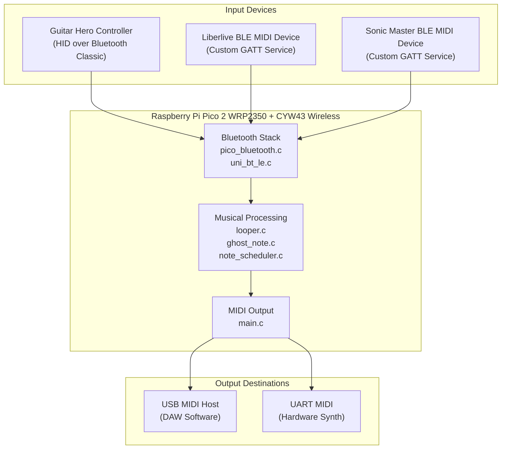
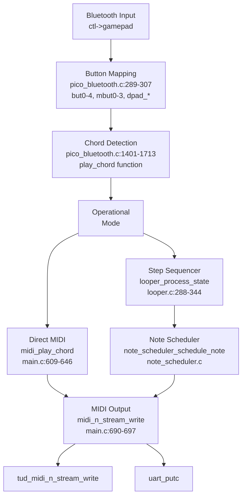
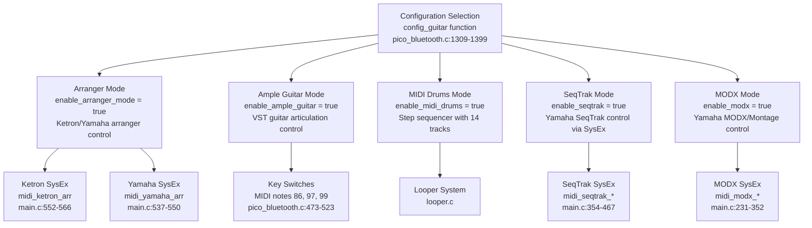
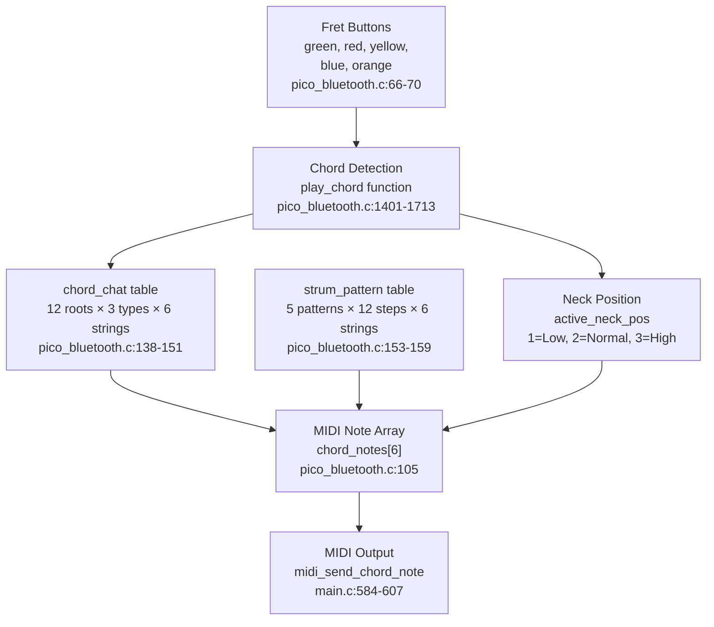
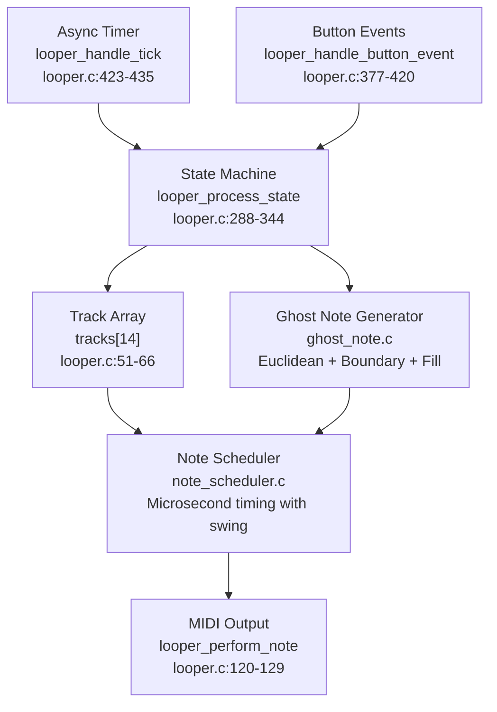
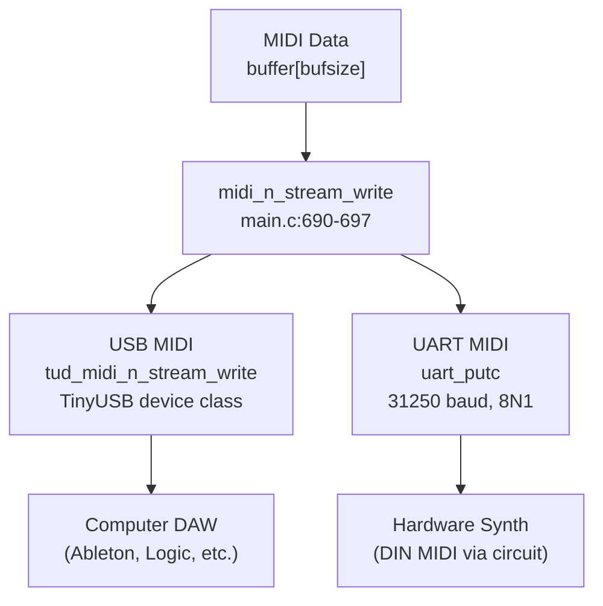

# Orinayo Overview

> **Relevant source files**
> * [README.md](https://github.com/Jus-Be/orinayo-pico/blob/122fa496/README.md)
> * [looper.c](https://github.com/Jus-Be/orinayo-pico/blob/122fa496/looper.c)
> * [main.c](https://github.com/Jus-Be/orinayo-pico/blob/122fa496/main.c)
> * [pico_bluetooth.c](https://github.com/Jus-Be/orinayo-pico/blob/122fa496/pico_bluetooth.c)

## Purpose and Scope

This document provides a high-level introduction to the Orinayo system, a Bluetooth-to-MIDI gateway that transforms guitar controller input into professional MIDI output. It covers the system's purpose, architecture, major components, and operational modes. For detailed information about specific subsystems, see:

* Hardware setup and building: [Getting Started](./2-getting-started.md)
* Bluetooth device connectivity: [Bluetooth Input System](./4-bluetooth-input-system.md)
* Musical processing and sequencing: [Musical Processing](./5-musical-processing.md)
* MIDI output configuration: [MIDI Output System](./6-midi-output-system.md)

## What is Orinayo?

Orinayo is firmware for the Raspberry Pi Pico 2 W that converts Bluetooth game controllers (primarily Guitar Hero-style controllers) into MIDI control surfaces. The system operates in real-time, translating button combinations and strum gestures into chord progressions, arpeggios, and drum patterns suitable for controlling hardware synthesizers, software DAWs, and keyboard arrangers.

The system supports two distinct workflows:

1. **Direct MIDI Generation**: Button combinations are mapped to chords and immediately output as MIDI Note On/Off messages
2. **Step Sequencer Mode**: Drum patterns are recorded and played back through a 32-step looper with algorithmic embellishments

All MIDI data is transmitted simultaneously via USB MIDI (TinyUSB device class) and hardware UART at 31,250 baud, enabling connection to both computer-based and hardware-based music equipment.

**Sources**: [pico_bluetooth.c L1-L50](https://github.com/Jus-Be/orinayo-pico/blob/122fa496/pico_bluetooth.c#L1-L50)

 [main.c L1-L60](https://github.com/Jus-Be/orinayo-pico/blob/122fa496/main.c#L1-L60)

 [README.md L1-L5](https://github.com/Jus-Be/orinayo-pico/blob/122fa496/README.md#L1-L5)

## System Context



**Sources**: [pico_bluetooth.c L220-L275](https://github.com/Jus-Be/orinayo-pico/blob/122fa496/pico_bluetooth.c#L220-L275)

 [main.c L57-L62](https://github.com/Jus-Be/orinayo-pico/blob/122fa496/main.c#L57-L62)

 [main.c L690-L697](https://github.com/Jus-Be/orinayo-pico/blob/122fa496/main.c#L690-L697)

## Major Components

The codebase is organized into several functional subsystems, each implemented in dedicated source files:

| Component | Primary Files | Key Responsibility |
| --- | --- | --- |
| **Bluetooth Input** | `pico_bluetooth.c`, `uni_bt_le.c` | Device discovery, connection management, HID report parsing |
| **Chord Generation** | `pico_bluetooth.c` lines 138-151, 153-197 | Button-to-chord mapping via `chord_chat` and `strum_pattern` tables |
| **Step Sequencer** | `looper.c`, `ghost_note.c` | 32-step drum pattern recording and playback with algorithmic fills |
| **Note Scheduling** | `note_scheduler.c` | Microsecond-precision MIDI event timing with swing quantization |
| **MIDI Output** | `main.c` lines 690-697 | Dual USB/UART transmission via `midi_n_stream_write` |
| **Synthesizer Control** | `main.c` lines 210-582 | SysEx generation for Yamaha MODX, SeqTrak, Ketron arrangers |
| **Storage** | `storage.c` | Flash-based persistence of looper patterns |
| **UI** | `display.c` | UART-based text display of system status |

**Sources**: [pico_bluetooth.c L1-L50](https://github.com/Jus-Be/orinayo-pico/blob/122fa496/pico_bluetooth.c#L1-L50)

 [looper.c L1-L67](https://github.com/Jus-Be/orinayo-pico/blob/122fa496/looper.c#L1-L67)

 [main.c L1-L110](https://github.com/Jus-Be/orinayo-pico/blob/122fa496/main.c#L1-L110)

## Core Data Flow



This diagram shows the complete signal path from Bluetooth input to MIDI output, highlighting the key decision point where `enable_midi_drums` determines whether notes route through the step sequencer or go directly to output.

**Sources**: [pico_bluetooth.c L276-L325](https://github.com/Jus-Be/orinayo-pico/blob/122fa496/pico_bluetooth.c#L276-L325)

 [pico_bluetooth.c L327-L1274](https://github.com/Jus-Be/orinayo-pico/blob/122fa496/pico_bluetooth.c#L327-L1274)

 [pico_bluetooth.c L1401-L1713](https://github.com/Jus-Be/orinayo-pico/blob/122fa496/pico_bluetooth.c#L1401-L1713)

 [looper.c L288-L344](https://github.com/Jus-Be/orinayo-pico/blob/122fa496/looper.c#L288-L344)

 [main.c L609-L688](https://github.com/Jus-Be/orinayo-pico/blob/122fa496/main.c#L609-L688)

 [main.c L690-L697](https://github.com/Jus-Be/orinayo-pico/blob/122fa496/main.c#L690-L697)

## Operational Modes

The system implements five mutually-exclusive operational modes, controlled by boolean flags in `pico_bluetooth.c`:



Each mode is activated by a specific button combination (green/red/yellow/blue/orange fret buttons + config button). The modes are mutually exclusive and control different aspects of MIDI generation:

| Mode | Enable Flag | Primary Use Case |
| --- | --- | --- |
| **Arranger** | `enable_arranger_mode` | Control Ketron/Yamaha keyboard arrangers with chords and style sections |
| **Ample Guitar** | `enable_ample_guitar` | Trigger guitar VST articulations and strumming modes |
| **MIDI Drums** | `enable_midi_drums` | Record and playback drum patterns with algorithmic fills |
| **SeqTrak** | `enable_seqtrak` | Control Yamaha SeqTrak's arpeggiator and pattern selection |
| **MODX** | `enable_modx` | Control Yamaha MODX/Montage arpeggiator and scene changes |

**Sources**: [pico_bluetooth.c L22-L38](https://github.com/Jus-Be/orinayo-pico/blob/122fa496/pico_bluetooth.c#L22-L38)

 [pico_bluetooth.c L1309-L1399](https://github.com/Jus-Be/orinayo-pico/blob/122fa496/pico_bluetooth.c#L1309-L1399)

 [main.c L210-L582](https://github.com/Jus-Be/orinayo-pico/blob/122fa496/main.c#L210-L582)

## Chord Generation System

The core musical intelligence resides in two lookup tables that map fret button combinations to guitar chord fingerings:



The `chord_chat` table stores fret positions (0-5 or -1 for muted strings) for 36 chord types (12 root notes × 3 chord qualities: major, minor, suspended). When a button combination is detected, the `play_chord` function looks up the appropriate fingering and converts it to absolute MIDI note numbers based on the `active_neck_pos` variable.

**Sources**: [pico_bluetooth.c L66-L70](https://github.com/Jus-Be/orinayo-pico/blob/122fa496/pico_bluetooth.c#L66-L70)

 [pico_bluetooth.c L138-L159](https://github.com/Jus-Be/orinayo-pico/blob/122fa496/pico_bluetooth.c#L138-L159)

 [pico_bluetooth.c L1401-L1713](https://github.com/Jus-Be/orinayo-pico/blob/122fa496/pico_bluetooth.c#L1401-L1713)

 [main.c L584-L607](https://github.com/Jus-Be/orinayo-pico/blob/122fa496/main.c#L584-L607)

## Step Sequencer Architecture

When `enable_midi_drums` is active, the system operates as a 32-step drum sequencer supporting 14 simultaneous tracks:



Each track stores:

* `pattern[32]`: User-recorded note pattern (boolean array)
* `ghost_notes[32]`: Algorithmically generated ghost notes with probability
* `fill_pattern[32]`: Fill-in notes for phrase endings
* `note`: MIDI note number (e.g., `BASS_DRUM = 36`)
* `channel`: MIDI channel (typically `MIDI_CHANNEL10 = 9`)

The sequencer runs at a tempo derived from `looper_status.bpm`, with each step representing a 16th note. The `looper_process_state` function advances through states (`WAITING`, `RECORDING`, `PLAYING`, `TAP_TEMPO`) based on button input and timing.

**Sources**: [looper.c L25-L67](https://github.com/Jus-Be/orinayo-pico/blob/122fa496/looper.c#L25-L67)

 [looper.c L120-L194](https://github.com/Jus-Be/orinayo-pico/blob/122fa496/looper.c#L120-L194)

 [looper.c L288-L344](https://github.com/Jus-Be/orinayo-pico/blob/122fa496/looper.c#L288-L344)

 [looper.c L377-L420](https://github.com/Jus-Be/orinayo-pico/blob/122fa496/looper.c#L377-L420)

 [looper.c L423-L435](https://github.com/Jus-Be/orinayo-pico/blob/122fa496/looper.c#L423-L435)

## Dual MIDI Output

All MIDI data converges at the `midi_n_stream_write` function, which simultaneously transmits to both USB and UART:



The function is called from multiple locations throughout the codebase:

* `looper_perform_note` for sequencer output [looper.c L120-L129](https://github.com/Jus-Be/orinayo-pico/blob/122fa496/looper.c#L120-L129)
* `midi_send_note` for direct note events [main.c L480-L491](https://github.com/Jus-Be/orinayo-pico/blob/122fa496/main.c#L480-L491)
* `midi_send_control_change` for CC messages [main.c L493-L502](https://github.com/Jus-Be/orinayo-pico/blob/122fa496/main.c#L493-L502)
* `midi_send_program_change` for patch changes [main.c L504-L512](https://github.com/Jus-Be/orinayo-pico/blob/122fa496/main.c#L504-L512)
* Various SysEx generation functions [main.c L210-L582](https://github.com/Jus-Be/orinayo-pico/blob/122fa496/main.c#L210-L582)

This architecture ensures synchronized output to multiple destinations without requiring separate transmission logic in each caller.

**Sources**: [main.c L57-L62](https://github.com/Jus-Be/orinayo-pico/blob/122fa496/main.c#L57-L62)

 [main.c L690-L697](https://github.com/Jus-Be/orinayo-pico/blob/122fa496/main.c#L690-L697)

 [looper.c L120-L129](https://github.com/Jus-Be/orinayo-pico/blob/122fa496/looper.c#L120-L129)

## Initialization Sequence

The system initialization follows this sequence in `main`:

```mermaid
sequenceDiagram
  participant main.c
  participant LED Init
  participant Board Init
  participant TinyUSB
  participant Bluetooth
  participant Storage
  participant Async Timer
  participant Looper
  participant Note Scheduler
  participant UART

  main.c->>LED Init: pico_led_init
  main.c->>Board Init: board_init
  main.c->>TinyUSB: tusb_init
  main.c->>main.c: stdio_init_all
  main.c->>Bluetooth: bluetooth_init
  main.c->>TinyUSB: tud_task
  main.c->>Storage: storage_load_tracks
  main.c->>Async Timer: async_timer_init
  main.c->>Looper: looper_schedule_step_timer
  main.c->>Note Scheduler: note_scheduler_init
  main.c->>UART: uart_init (31250 baud)
  main.c->>main.c: Enter main loop
```

After initialization, the main loop [main.c L152-L171](https://github.com/Jus-Be/orinayo-pico/blob/122fa496/main.c#L152-L171)

 continuously:

1. Calls `tud_task()` to process USB events
2. Reads incoming MIDI clock messages via `tud_midi_available()`
3. Dispatches scheduled notes via `note_scheduler_dispatch_pending()`

All Bluetooth processing and step sequencer advancement occurs asynchronously via the `async_timer` system, avoiding blocking operations in the main loop.

**Sources**: [main.c L125-L173](https://github.com/Jus-Be/orinayo-pico/blob/122fa496/main.c#L125-L173)

## Key Configuration Points

The system behavior is controlled by several configuration files:

| File | Purpose | Key Definitions |
| --- | --- | --- |
| `sdkconfig.h` | Pico SDK and Bluepad32 configuration | `CONFIG_BLUEPAD32_PLATFORM_CUSTOM` |
| `tusb_config.h` | USB descriptor configuration | Vendor ID, Product ID, device strings |
| `btstack_config.h` | Bluetooth stack parameters | Max connections, buffer sizes |
| `looper.h` | Sequencer parameters | `LOOPER_DEFAULT_BPM`, `LOOPER_TOTAL_STEPS` |

Global mode flags in `pico_bluetooth.c` [lines 28-38](https://github.com/Jus-Be/orinayo-pico/blob/122fa496/lines 28-38)

 control operational behavior:

* `enable_style_play`: Enable automatic chord generation
* `enable_auto_hold`: Sustain chords after strum release
* `enable_chord_track`: Enable chord track output (SeqTrak mode)
* `enable_bass_track`: Enable bass track output (SeqTrak mode)

These flags are modified at runtime via specific button combinations, allowing the user to reconfigure the system without reflashing firmware.

**Sources**: [pico_bluetooth.c L28-L38](https://github.com/Jus-Be/orinayo-pico/blob/122fa496/pico_bluetooth.c#L28-L38)

 [looper.c L49](https://github.com/Jus-Be/orinayo-pico/blob/122fa496/looper.c#L49-L49)

## Build and Deployment

The firmware is built using CMake with a two-tier architecture:

1. **Static Library (`orinayobt`)**: Contains Bluetooth infrastructure (`pico_bluetooth.c`, `async_timer.c`, `display.c`, `storage.c`)
2. **Main Executable (`orinayo`)**: Links against the library and contains application logic (`main.c`, `looper.c`, `ghost_note.c`, `note_scheduler.c`, `tap_tempo.c`)

The GitHub Actions workflow (`.github/workflows/build.yml`) automatically builds the firmware on every push, producing:

* `orinayo.uf2` - Drag-and-drop firmware image for Pico W
* `orinayo.bin` - Raw binary for flash programmers
* `orinayo.elf` - Debug symbols for GDB

For detailed build instructions, see [Building and Flashing](./2.2-building-and-flashing.md).

**Sources**: [CMakeLists.txt](https://github.com/Jus-Be/orinayo-pico/blob/122fa496/CMakeLists.txt)

 [.github/workflows/build.yml](https://github.com/Jus-Be/orinayo-pico/blob/122fa496/.github/workflows/build.yml)