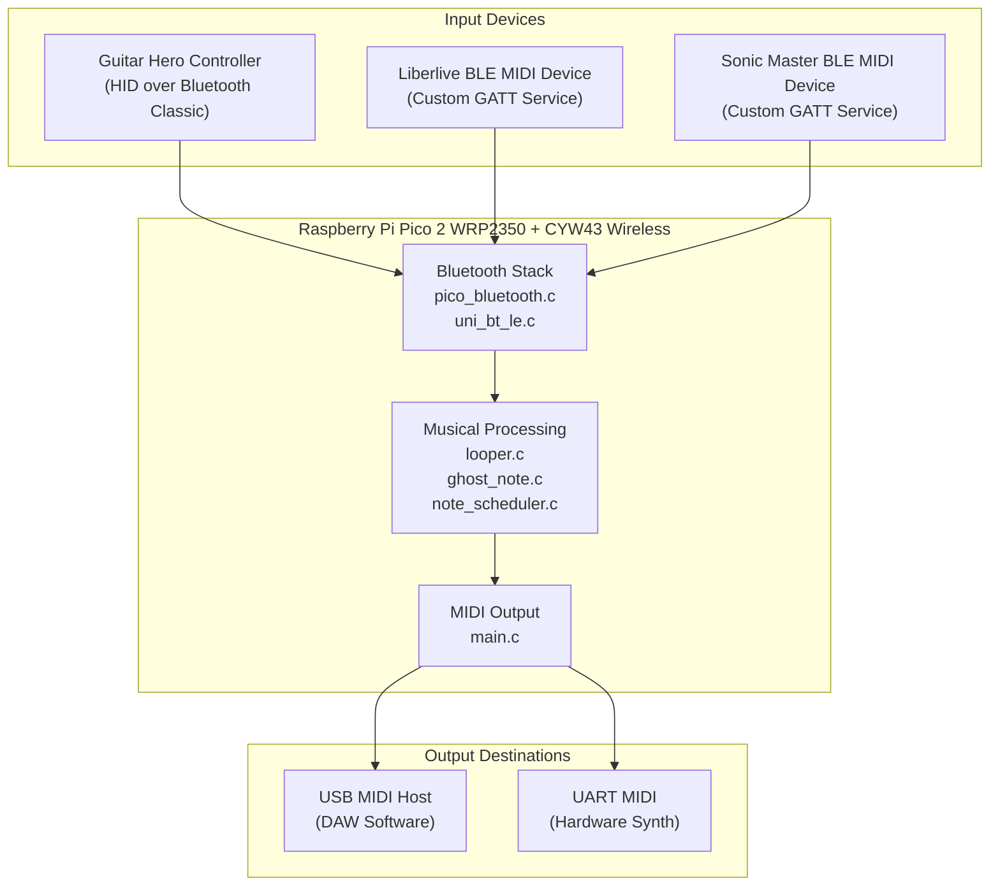
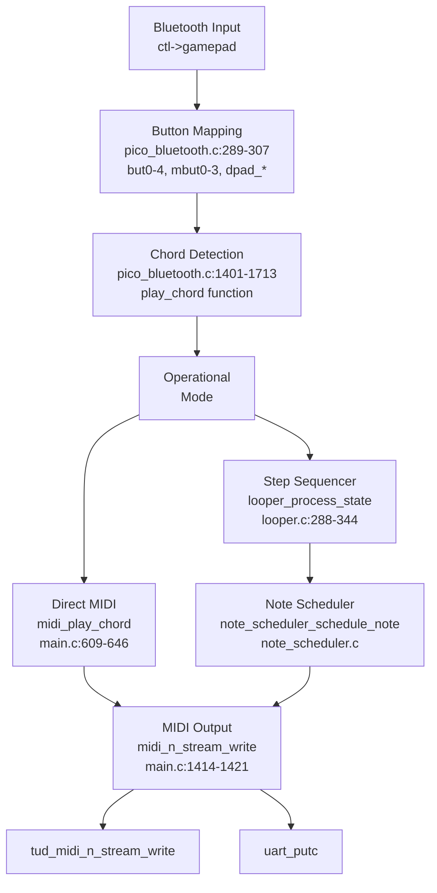
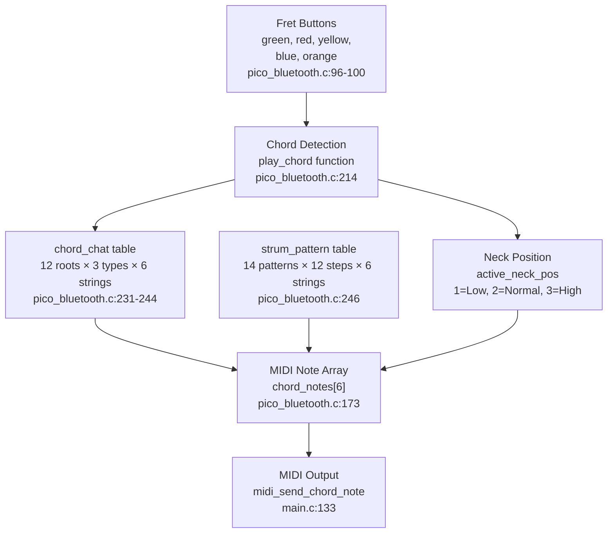
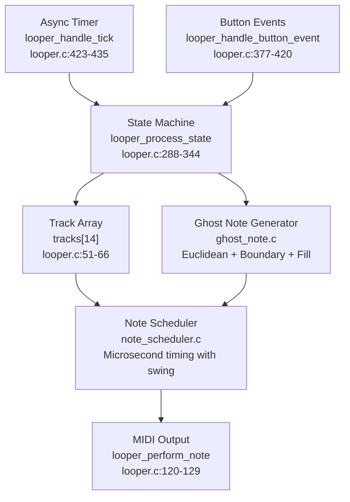
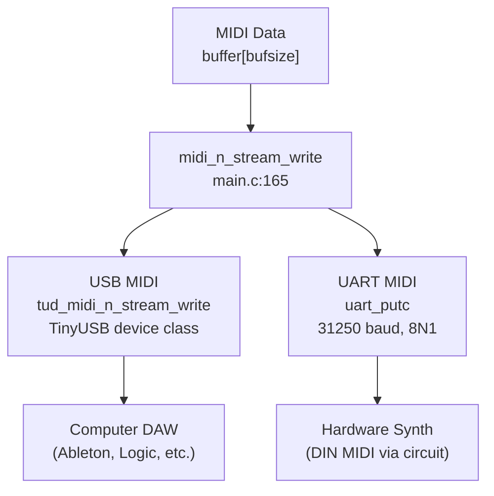

# Orinayo Overview

> **Relevant source files**
> * [Hiroyuki_OYAMA_license.md](https://github.com/Jus-Be/orinayo-pico/blob/6dde5a75/Hiroyuki_OYAMA_license.md?plain=1)
> * [README.md](https://github.com/Jus-Be/orinayo-pico/blob/6dde5a75/README.md?plain=1)
> * [main.c](https://github.com/Jus-Be/orinayo-pico/blob/6dde5a75/main.c)
> * [pico_bluetooth.c](https://github.com/Jus-Be/orinayo-pico/blob/6dde5a75/pico_bluetooth.c)

## Purpose and Scope

This document provides a high-level introduction to the Orinayo system, a Bluetooth-to-MIDI gateway that transforms guitar controller input into professional MIDI output. It covers the system's purpose, architecture, major components, and operational modes. For detailed information about specific subsystems, see:

* Hardware setup and building: [Getting Started](https://github.com/Jus-Be/orinayo-pico/blob/6dde5a75/Getting Started)
* Bluetooth device connectivity: [Bluetooth Input System](https://github.com/Jus-Be/orinayo-pico/blob/6dde5a75/Bluetooth Input System)
* Musical processing and sequencing: [Musical Processing](https://github.com/Jus-Be/orinayo-pico/blob/6dde5a75/Musical Processing)
* MIDI output configuration: [MIDI Output System](https://github.com/Jus-Be/orinayo-pico/blob/6dde5a75/MIDI Output System)

## What is Orinayo?

Orinayo is firmware for the Raspberry Pi Pico 2 W that converts Bluetooth game controllers (primarily Guitar Hero-style controllers) into MIDI control surfaces. The system operates in real-time, translating button combinations and strum gestures into chord progressions, arpeggios, and drum patterns suitable for controlling hardware synthesizers, software DAWs, and keyboard arrangers.

The system supports two distinct workflows:

1. **Direct MIDI Generation**: Button combinations are mapped to chords and immediately output as MIDI Note On/Off messages.
2. **Step Sequencer Mode**: Drum patterns are recorded and played back through a 32-step looper with algorithmic embellishments.

All MIDI data is transmitted simultaneously via USB MIDI (TinyUSB device class) and hardware UART at 31,250 baud, enabling connection to both computer-based and hardware-based music equipment.

**Sources**: [pico_bluetooth.c L1-L50](https://github.com/Jus-Be/orinayo-pico/blob/6dde5a75/pico_bluetooth.c#L1-L50)

 [main.c L1-L60](https://github.com/Jus-Be/orinayo-pico/blob/6dde5a75/main.c#L1-L60)

 [README.md L1-L5](https://github.com/Jus-Be/orinayo-pico/blob/6dde5a75/README.md?plain=1#L1-L5)

## System Context

```mermaid
flowchart TD

GH["Guitar Hero Controller<br>(HID over Bluetooth Classic)"]
LL["Liberlive BLE MIDI Device<br>(Custom GATT Service)"]
SM["Sonic Master BLE MIDI Device<br>(Custom GATT Service)"]
BT["Bluetooth Stack<br>pico_bluetooth.c<br>uni_bt_le.c"]
PROC["Musical Processing<br>looper.c<br>ghost_note.c<br>note_scheduler.c"]
OUT["MIDI Output<br>main.c"]
USB["USB MIDI Host<br>(DAW Software)"]
UART["UART MIDI<br>(Hardware Synth)"]

GH --> BT
LL --> BT
SM --> BT
OUT --> USB
OUT --> UART

subgraph Output ["Output Destinations"]
    USB
    UART
end

subgraph PicoW ["Raspberry Pi Pico 2 WRP2350 + CYW43 Wireless"]
    BT
    PROC
    OUT
    BT --> PROC
    PROC --> OUT
end

subgraph Input ["Input Devices"]
    GH
    LL
    SM
end
```

**Sources**: [pico_bluetooth.c L220-L275](https://github.com/Jus-Be/orinayo-pico/blob/6dde5a75/pico_bluetooth.c#L220-L275)

 [main.c L61-L65](https://github.com/Jus-Be/orinayo-pico/blob/6dde5a75/main.c#L61-L65)

 [main.c L231-L233](https://github.com/Jus-Be/orinayo-pico/blob/6dde5a75/main.c#L231-L233)

 [main.c L1414-L1421](https://github.com/Jus-Be/orinayo-pico/blob/6dde5a75/main.c#L1414-L1421)

## Major Components

The codebase is organized into several functional subsystems, each implemented in dedicated source files:

| Component | Primary Files | Key Responsibility |
| --- | --- | --- |
| **Bluetooth Input** | `pico_bluetooth.c`, `uni_bt_le.c` | Device discovery, connection management, HID report parsing |
| **Chord Generation** | `pico_bluetooth.c` | Button-to-chord mapping via `chord_chat` and `strum_pattern` tables |
| **Step Sequencer** | `looper.c`, `ghost_note.c` | 32-step drum pattern recording and playback with algorithmic fills |
| **Note Scheduling** | `note_scheduler.c` | Microsecond-precision MIDI event timing with swing quantization |
| **MIDI Output** | `main.c` | Dual USB/UART transmission via `midi_n_stream_write` |
| **Synthesizer Control** | `main.c` | SysEx generation for Yamaha MODX, SeqTrak, Ketron arrangers |
| **Storage** | `storage.c` | Flash-based persistence of looper patterns and preferences |
| **UI** | `display.c` | UART-based text display of system status |

**Sources**: [pico_bluetooth.c L1-L50](https://github.com/Jus-Be/orinayo-pico/blob/6dde5a75/pico_bluetooth.c#L1-L50)

 [looper.c L1-L67](https://github.com/Jus-Be/orinayo-pico/blob/6dde5a75/looper.c#L1-L67)

 [main.c L1-L110](https://github.com/Jus-Be/orinayo-pico/blob/6dde5a75/main.c#L1-L110)

 [CMakeLists.txt L39-L44](https://github.com/Jus-Be/orinayo-pico/blob/6dde5a75/CMakeLists.txt#L39-L44)

## Core Data Flow

```mermaid
flowchart TD

BTInput["Bluetooth Input<br>ctl->gamepad"]
ButtonMap["Button Mapping<br>pico_bluetooth.c:289-307<br>but0-4, mbut0-3, dpad_*"]
ChordDetect["Chord Detection<br>pico_bluetooth.c:1401-1713<br>play_chord function"]
ModeBranch["Operational<br>Mode"]
DirectMIDI["Direct MIDI<br>midi_play_chord<br>main.c:609-646"]
Looper["Step Sequencer<br>looper_process_state<br>looper.c:288-344"]
Scheduler["Note Scheduler<br>note_scheduler_schedule_note<br>note_scheduler.c"]
Output["MIDI Output<br>midi_n_stream_write<br>main.c:1414-1421"]
USBHost["tud_midi_n_stream_write"]
UARTHost["uart_putc"]

BTInput --> ButtonMap
ButtonMap --> ChordDetect
ChordDetect --> ModeBranch
ModeBranch --> DirectMIDI
ModeBranch --> Looper
DirectMIDI --> Output
Looper --> Scheduler
Scheduler --> Output
Output --> USBHost
Output --> UARTHost
```

This diagram shows the complete signal path from Bluetooth input to MIDI output, highlighting the key decision point where `enable_midi_drums` determines whether notes route through the step sequencer or go directly to output.

**Sources**: [pico_bluetooth.c L276-L325](https://github.com/Jus-Be/orinayo-pico/blob/6dde5a75/pico_bluetooth.c#L276-L325)

 [pico_bluetooth.c L1401-L1713](https://github.com/Jus-Be/orinayo-pico/blob/6dde5a75/pico_bluetooth.c#L1401-L1713)

 [looper.c L288-L344](https://github.com/Jus-Be/orinayo-pico/blob/6dde5a75/looper.c#L288-L344)

 [main.c L609-L688](https://github.com/Jus-Be/orinayo-pico/blob/6dde5a75/main.c#L609-L688)

 [main.c L1414-L1421](https://github.com/Jus-Be/orinayo-pico/blob/6dde5a75/main.c#L1414-L1421)

## Operational Modes

The system implements several mutually-exclusive operational modes, controlled by boolean flags in `pico_bluetooth.c`:

```mermaid
flowchart TD

Config["Configuration Selection<br>config_guitar function<br>pico_bluetooth.c:201-213"]
Mode1["Arranger Mode<br>enable_arranger_mode = true<br>Ketron/Yamaha arranger control"]
Mode2["Ample Guitar Mode<br>enable_ample_guitar = true<br>VST guitar articulation control"]
Mode3["MIDI Drums Mode<br>enable_midi_drums = true<br>Step sequencer with 14 tracks"]
Mode4["SeqTrak Mode<br>enable_seqtrak = true<br>Yamaha SeqTrak control via SysEx"]
Mode5["MODX Mode<br>enable_modx = true<br>Yamaha MODX/Montage control"]
Mode6["MPC Sample Mode<br>enable_mpc_sample = true<br>Trigger 124 audio loops"]
Mode7["SP404 Mk2 Mode<br>enable_sp404mk2 = true<br>Trigger 160 audio loops"]
Mode8["WAV Trigger Pro Mode<br>enable_wav_trigger_pro = true<br>Multi-sampled instrument + loops"]
Mode9["Nanobox Tangerine Mode<br>enable_nanobox_tangerine = true<br>Multi-sampled instruments + loops"]
Mode10["MPX8 Looper Mode<br>enable_mpx_looper = true<br>Trigger 8 chord audio loops"]
SysEx1["Ketron SysEx<br>midi_ketron_arr<br>main.c:552-566"]
SysEx2["Yamaha SysEx<br>midi_yamaha_arr<br>main.c:537-550"]
KeySwitch["Key Switches<br>MIDI notes 86, 97, 99<br>pico_bluetooth.c:473-523"]
LooperSys["Looper System<br>looper.c"]
SeqSysEx["SeqTrak SysEx<br>midi_seqtrak_*<br>main.c:354-467"]
ModxSysEx["MODX SysEx<br>midi_modx_*<br>main.c:231-352"]
MPCSample["MPC Sample Trigger<br>mpc_trigger_loop<br>main.c:157"]
SP404Sample["SP404 Trigger<br>sp404_trigger_loop<br>main.c:159"]
WAVTrigger["WAV Trigger Pro<br>wav_trigger_pro_stop_loops<br>pico_bluetooth.c:227"]
Nanobox["Nanobox Tangerine<br>nanobox_stop_loops<br>pico_bluetooth.c:223"]
MPX8["MPX8 Looper<br>mpx_trigger_loop<br>main.c:158"]

Config --> Mode1
Config --> Mode2
Config --> Mode3
Config --> Mode4
Config --> Mode5
Config --> Mode6
Config --> Mode7
Config --> Mode8
Config --> Mode9
Config --> Mode10
Mode1 --> SysEx1
Mode1 --> SysEx2
Mode2 --> KeySwitch
Mode3 --> LooperSys
Mode4 --> SeqSysEx
Mode5 --> ModxSysEx
Mode6 --> MPCSample
Mode7 --> SP404Sample
Mode8 --> WAVTrigger
Mode9 --> Nanobox
Mode10 --> MPX8
```

Each mode is activated by a specific button combination (green/red/yellow/blue/orange fret buttons + config button). The modes are mutually exclusive and control different aspects of MIDI generation:

| Mode | Enable Flag | Primary Use Case |
| --- | --- | --- |
| **Arranger** | `enable_arranger_mode` | Control Ketron/Yamaha keyboard arrangers with chords and style sections |
| **Ample Guitar** | `enable_ample_guitar` | Trigger guitar VST articulations and strumming modes |
| **MIDI Drums** | `enable_midi_drums` | Record and playback drum patterns with algorithmic fills |
| **SeqTrak** | `enable_seqtrak` | Control Yamaha SeqTrak's arpeggiator and pattern selection |
| **MODX** | `enable_modx` | Control Yamaha MODX/Montage arpeggiator and scene changes |
| **MPC Sample** | `enable_mpc_sample` | Trigger 124 audio loops via MIDI |
| **SP404 Mk2** | `enable_sp404mk2` | Trigger 160 audio loops via MIDI |
| **WAV Trigger Pro** | `enable_wav_trigger_pro` | Play multi-sampled instruments and trigger audio loops |
| **Nanobox Tangerine** | `enable_nanobox_tangerine` | Play multi-sampled instruments with effects and trigger audio loops |
| **MPX8** | `enable_mpx_looper` | Trigger 8 chord audio loops via MIDI |

**Sources**: [pico_bluetooth.c L22-L69](https://github.com/Jus-Be/orinayo-pico/blob/6dde5a75/pico_bluetooth.c#L22-L69)

 [pico_bluetooth.c L201-L213](https://github.com/Jus-Be/orinayo-pico/blob/6dde5a75/pico_bluetooth.c#L201-L213)

 [main.c L210-L582](https://github.com/Jus-Be/orinayo-pico/blob/6dde5a75/main.c#L210-L582)

 [main.c L155-L159](https://github.com/Jus-Be/orinayo-pico/blob/6dde5a75/main.c#L155-L159)

 [pico_bluetooth.c L223-L227](https://github.com/Jus-Be/orinayo-pico/blob/6dde5a75/pico_bluetooth.c#L223-L227)

## Chord Generation System

The core musical intelligence resides in two lookup tables that map fret button combinations to guitar chord fingerings:

```mermaid
flowchart TD

Buttons["Fret Buttons<br>green, red, yellow,<br>blue, orange<br>pico_bluetooth.c:96-100"]
Detect["Chord Detection<br>play_chord function<br>pico_bluetooth.c:214"]
ChordChat["chord_chat table<br>12 roots × 3 types × 6 strings<br>pico_bluetooth.c:231-244"]
StrumPat["strum_pattern table<br>14 patterns × 12 steps × 6 strings<br>pico_bluetooth.c:246"]
NeckPos["Neck Position<br>active_neck_pos<br>1=Low, 2=Normal, 3=High"]
Notes["MIDI Note Array<br>chord_notes[6]<br>pico_bluetooth.c:173"]
Output["MIDI Output<br>midi_send_chord_note<br>main.c:133"]

Buttons --> Detect
Detect --> ChordChat
Detect --> NeckPos
ChordChat --> Notes
StrumPat --> Notes
NeckPos --> Notes
Notes --> Output
```

The `chord_chat` table stores fret positions (0-5 or -1 for muted strings) for 36 chord types (12 root notes × 3 chord qualities: major, minor, suspended). When a button combination is detected, the `play_chord` function [pico_bluetooth.c L214](https://github.com/Jus-Be/orinayo-pico/blob/6dde5a75/pico_bluetooth.c#L214-L214)

 looks up the appropriate fingering and converts it to absolute MIDI note numbers based on the `active_neck_pos` variable [pico_bluetooth.c L123](https://github.com/Jus-Be/orinayo-pico/blob/6dde5a75/pico_bluetooth.c#L123-L123)

**Sources**: [pico_bluetooth.c L96-L100](https://github.com/Jus-Be/orinayo-pico/blob/6dde5a75/pico_bluetooth.c#L96-L100)

 [pico_bluetooth.c L123](https://github.com/Jus-Be/orinayo-pico/blob/6dde5a75/pico_bluetooth.c#L123-L123)

 [pico_bluetooth.c L173](https://github.com/Jus-Be/orinayo-pico/blob/6dde5a75/pico_bluetooth.c#L173-L173)

 [pico_bluetooth.c L214](https://github.com/Jus-Be/orinayo-pico/blob/6dde5a75/pico_bluetooth.c#L214-L214)

 [pico_bluetooth.c L231-L246](https://github.com/Jus-Be/orinayo-pico/blob/6dde5a75/pico_bluetooth.c#L231-L246)

 [main.c L133](https://github.com/Jus-Be/orinayo-pico/blob/6dde5a75/main.c#L133-L133)

## Step Sequencer Architecture

When `enable_midi_drums` is active, the system operates as a 32-step drum sequencer supporting 14 simultaneous tracks:

```mermaid
flowchart TD

Timer["Async Timer<br>looper_handle_tick<br>looper.c:423-435"]
State["State Machine<br>looper_process_state<br>looper.c:288-344"]
Tracks["Track Array<br>tracks[14]<br>looper.c:51-66"]
Ghost["Ghost Note Generator<br>ghost_note.c<br>Euclidean + Boundary + Fill"]
Scheduler["Note Scheduler<br>note_scheduler.c<br>Microsecond timing with swing"]
Output["MIDI Output<br>looper_perform_note<br>looper.c:120-129"]
Input["Button Events<br>looper_handle_button_event<br>looper.c:377-420"]

Timer --> State
State --> Tracks
State --> Ghost
Tracks --> Scheduler
Ghost --> Scheduler
Scheduler --> Output
Input --> State
```

Each track stores:

* `pattern[32]`: User-recorded note pattern (boolean array)
* `ghost_notes[32]`: Algorithmically generated ghost notes with probability
* `fill_pattern[32]`: Fill-in notes for phrase endings
* `note`: MIDI note number (e.g., `BASS_DRUM = 36`)
* `channel`: MIDI channel (typically `MIDI_CHANNEL10 = 9`)

The sequencer runs at a tempo derived from `looper_status.bpm`, with each step representing a 16th note. The `looper_process_state` function [looper.c L288-L344](https://github.com/Jus-Be/orinayo-pico/blob/6dde5a75/looper.c#L288-L344)

 advances through states (`WAITING`, `RECORDING`, `PLAYING`, `TAP_TEMPO`) based on button input and timing.

**Sources**: [looper.c L25-L67](https://github.com/Jus-Be/orinayo-pico/blob/6dde5a75/looper.c#L25-L67)

 [looper.c L120-L194](https://github.com/Jus-Be/orinayo-pico/blob/6dde5a75/looper.c#L120-L194)

 [looper.c L288-L344](https://github.com/Jus-Be/orinayo-pico/blob/6dde5a75/looper.c#L288-L344)

 [looper.c L377-L420](https://github.com/Jus-Be/orinayo-pico/blob/6dde5a75/looper.c#L377-L420)

 [looper.c L423-L435](https://github.com/Jus-Be/orinayo-pico/blob/6dde5a75/looper.c#L423-L435)

## Dual MIDI Output

All MIDI data converges at the `midi_n_stream_write` function [main.c L165](https://github.com/Jus-Be/orinayo-pico/blob/6dde5a75/main.c#L165-L165)

 which simultaneously transmits to both USB and UART:

```mermaid
flowchart TD

Input["MIDI Data<br>buffer[bufsize]"]
Function["midi_n_stream_write<br>main.c:165"]
USB["USB MIDI<br>tud_midi_n_stream_write<br>TinyUSB device class"]
UART["UART MIDI<br>uart_putc<br>31250 baud, 8N1"]
DAW["Computer DAW<br>(Ableton, Logic, etc.)"]
Synth["Hardware Synth<br>(DIN MIDI via circuit)"]

Input --> Function
Function --> USB
Function --> UART
USB --> DAW
UART --> Synth
```

The function is called from multiple locations throughout the codebase:

* `looper_perform_note` for sequencer output [looper.c L120-L129](https://github.com/Jus-Be/orinayo-pico/blob/6dde5a75/looper.c#L120-L129)
* `midi_send_note` for direct note events [main.c L131](https://github.com/Jus-Be/orinayo-pico/blob/6dde5a75/main.c#L131-L131)
* `midi_send_control_change` for CC messages [main.c L135](https://github.com/Jus-Be/orinayo-pico/blob/6dde5a75/main.c#L135-L135)
* `midi_send_program_change` for patch changes [main.c L134](https://github.com/Jus-Be/orinayo-pico/blob/6dde5a75/main.c#L134-L134)
* Various SysEx generation functions [main.c L140-L154](https://github.com/Jus-Be/orinayo-pico/blob/6dde5a75/main.c#L140-L154)

This architecture ensures synchronized output to multiple destinations without requiring separate transmission logic in each caller.

**Sources**: [main.c L61-L65](https://github.com/Jus-Be/orinayo-pico/blob/6dde5a75/main.c#L61-L65)

 [main.c L131](https://github.com/Jus-Be/orinayo-pico/blob/6dde5a75/main.c#L131-L131)

 [main.c L133-L135](https://github.com/Jus-Be/orinayo-pico/blob/6dde5a75/main.c#L133-L135)

 [main.c L140-L154](https://github.com/Jus-Be/orinayo-pico/blob/6dde5a75/main.c#L140-L154)

 [main.c L165](https://github.com/Jus-Be/orinayo-pico/blob/6dde5a75/main.c#L165-L165)

 [looper.c L120-L129](https://github.com/Jus-Be/orinayo-pico/blob/6dde5a75/looper.c#L120-L129)

## Initialization Sequence

The system initialization follows this sequence in `main`:

```mermaid
sequenceDiagram
  participant main.c
  participant LED Init
  participant Board Init
  participant TinyUSB
  participant Bluetooth
  participant Storage
  participant Async Timer
  participant Looper
  participant Note Scheduler
  participant UART

  main.c->>LED Init: pico_led_init
  main.c->>Board Init: board_init
  main.c->>TinyUSB: tud_init
  main.c->>main.c: stdio_init_all
  main.c->>Bluetooth: bluetooth_init
  main.c->>TinyUSB: tud_task
  main.c->>Async Timer: async_timer_init
  main.c->>Looper: looper_schedule_step_timer
  main.c->>Note Scheduler: note_scheduler_init
  main.c->>UART: uart_init (31250 baud)
  main.c->>main.c: Enter main loop
```

After initialization, the main loop [main.c L227-L241](https://github.com/Jus-Be/orinayo-pico/blob/6dde5a75/main.c#L227-L241)

 continuously:

1. Calls `tud_task()` to process USB events.
2. Reads incoming MIDI packets via `tud_midi_packet_read()`.
3. Dispatches scheduled notes via `note_scheduler_dispatch_pending()`.
4. Checks for `preferences_changed` to trigger flash storage and reboot [main.c L241](https://github.com/Jus-Be/orinayo-pico/blob/6dde5a75/main.c#L241-L241)

All Bluetooth processing and step sequencer advancement occurs asynchronously via the `async_timer` system, avoiding blocking operations in the main loop.

**Sources**: [main.c L194-L241](https://github.com/Jus-Be/orinayo-pico/blob/6dde5a75/main.c#L194-L241)

## Key Configuration Points

The system behavior is controlled by several configuration files:

| File | Purpose | Key Definitions |
| --- | --- | --- |
| `sdkconfig.h` | Pico SDK and Bluepad32 configuration | `CONFIG_BLUEPAD32_PLATFORM_CUSTOM` |
| `tusb_config.h` | USB descriptor configuration | Vendor ID, Product ID, device strings |
| `btstack_config.h` | Bluetooth stack parameters | Max connections, buffer sizes |
| `looper.h` | Sequencer parameters | `LOOPER_DEFAULT_BPM`, `LOOPER_TOTAL_STEPS` |

Global mode flags in `pico_bluetooth.c` [lines 41-68](https://github.com/Jus-Be/orinayo-pico/blob/6dde5a75/lines 41-68)

 control operational behavior:

* `enable_style_play`: Enable automatic chord generation.
* `enable_auto_hold`: Sustain chords after strum release.
* `enable_chord_track`: Enable chord track output (SeqTrak mode).
* `enable_bass_track`: Enable bass track output (SeqTrak mode).

These flags are modified at runtime via specific button combinations, allowing the user to reconfigure the system without reflashing firmware.

**Sources**: [pico_bluetooth.c L41-L68](https://github.com/Jus-Be/orinayo-pico/blob/6dde5a75/pico_bluetooth.c#L41-L68)

 [looper.c L49](https://github.com/Jus-Be/orinayo-pico/blob/6dde5a75/looper.c#L49-L49)

## Build and Deployment

The firmware is built using CMake with a two-tier architecture:

1. **Static Library (`orinayobt`)**: Contains Bluetooth infrastructure (`pico_bluetooth.c`, `async_timer.c`, `display.c`, `storage.c`) [CMakeLists.txt L39-L42](https://github.com/Jus-Be/orinayo-pico/blob/6dde5a75/CMakeLists.txt#L39-L42)
2. **Main Executable (`Orinayo`)**: Links against the library and contains application logic (`main.c`, `looper.c`, `ghost_note.c`, `note_scheduler.c`, `tap_tempo.c`) [CMakeLists.txt L44-L56](https://github.com/Jus-Be/orinayo-pico/blob/6dde5a75/CMakeLists.txt#L44-L56)

The build system targets the `rp2350-arm-s` platform for the `pico2_w` board [CMakeLists.txt L23-L24](https://github.com/Jus-Be/orinayo-pico/blob/6dde5a75/CMakeLists.txt#L23-L24)

**Sources**: [CMakeLists.txt L19-L67](https://github.com/Jus-Be/orinayo-pico/blob/6dde5a75/CMakeLists.txt#L19-L67)