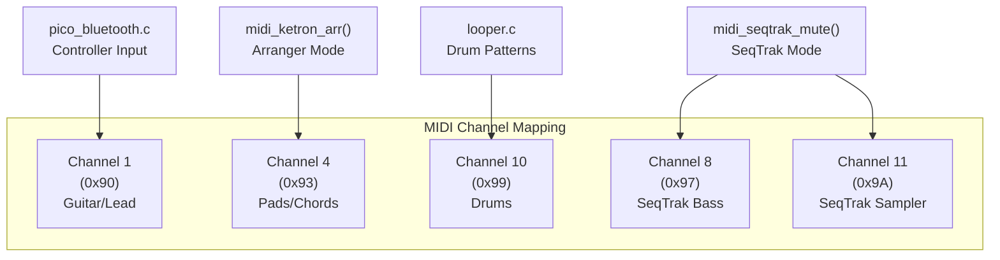
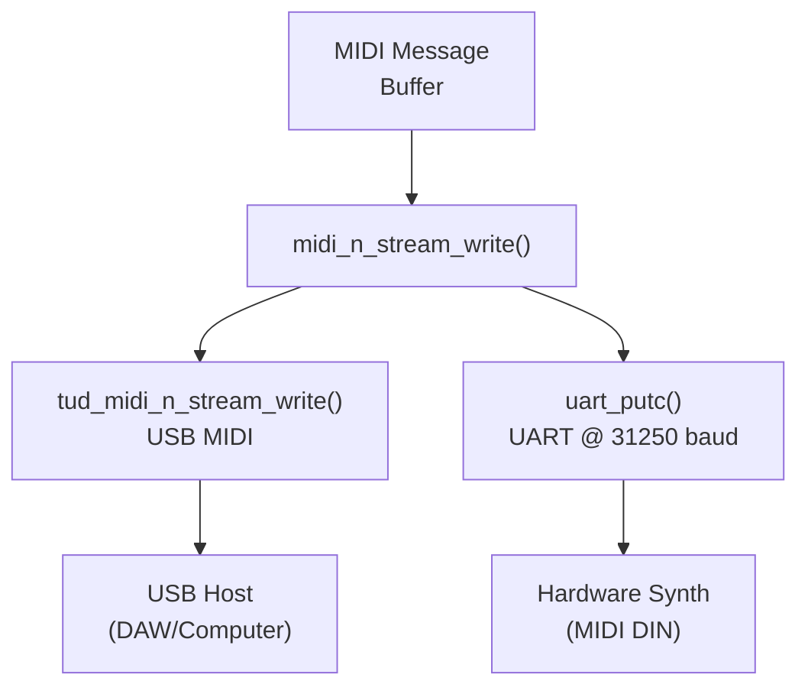
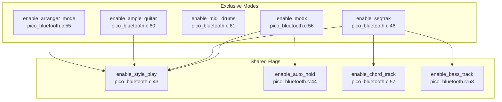
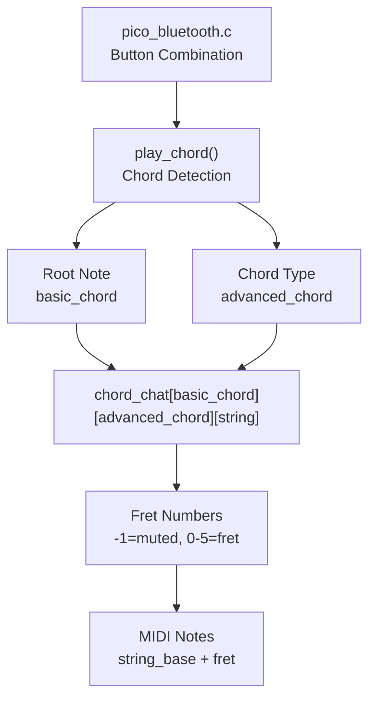

# Reference

> **Relevant source files**
> * [looper.c](https://github.com/Jus-Be/orinayo-pico/blob/6dde5a75/looper.c)
> * [main.c](https://github.com/Jus-Be/orinayo-pico/blob/6dde5a75/main.c)
> * [pico_bluetooth.c](https://github.com/Jus-Be/orinayo-pico/blob/6dde5a75/pico_bluetooth.c)

This page provides quick reference material for developers and users working with the Orinayo system. It includes complete MIDI message specifications, configuration options, button mappings, and troubleshooting guidance. For detailed implementation guides on specific subsystems, see the Architecture section ([Architecture](./3-architecture.md)), Bluetooth Input System ([Bluetooth Input System](./4-bluetooth-input-system.md)), Musical Processing ([Musical Processing](./5-musical-processing.md)), and MIDI Output System ([MIDI Output System](./6-midi-output-system.md)).

## MIDI Message Reference

The Orinayo system implements a dual-output MIDI architecture that simultaneously transmits all messages via USB and UART (31,250 baud). The system generates MIDI messages in three categories: performance notes, control messages, and device-specific SysEx commands.

### Core MIDI Messages

The following table documents all standard MIDI messages generated by the system:

| Message Type | Status Byte | Data Bytes | Function | Code Reference |
| --- | --- | --- | --- | --- |
| Note On | `0x90 + channel` | note, velocity | Play note | [main.c L131](https://github.com/Jus-Be/orinayo-pico/blob/6dde5a75/main.c#L131-L131) |
| Note Off | `0x80 + channel` | note, 0 | Stop note | [looper.c L128-L129](https://github.com/Jus-Be/orinayo-pico/blob/6dde5a75/looper.c#L128-L129) |
| Program Change | `0xC0 + channel` | program | Change instrument | [main.c L133](https://github.com/Jus-Be/orinayo-pico/blob/6dde5a75/main.c#L133-L133) |
| Control Change | `0xB0 + channel` | controller, value | Modify parameter | [main.c L134](https://github.com/Jus-Be/orinayo-pico/blob/6dde5a75/main.c#L134-L134) |
| MIDI Start | `0xFA` | - | Start sequencer | [main.c L130](https://github.com/Jus-Be/orinayo-pico/blob/6dde5a75/main.c#L130-L130) |
| MIDI Stop | `0xFC` | - | Stop sequencer | [main.c L130](https://github.com/Jus-Be/orinayo-pico/blob/6dde5a75/main.c#L130-L130) |

For a complete reference of all MIDI messages sent and received by the system, see [MIDI Implementation Chart](./10.1-midi-implementation-chart.md).

**Sources:** [main.c L130-L134](https://github.com/Jus-Be/orinayo-pico/blob/6dde5a75/main.c#L130-L134)

 [looper.c L128-L129](https://github.com/Jus-Be/orinayo-pico/blob/6dde5a75/looper.c#L128-L129)

### Channel Assignment

**Sources:** [looper.c L26-L28](https://github.com/Jus-Be/orinayo-pico/blob/6dde5a75/looper.c#L26-L28)

 [looper.c L51-L65](https://github.com/Jus-Be/orinayo-pico/blob/6dde5a75/looper.c#L51-L65)

### Output Routing

The system implements simultaneous dual-output through the `midi_n_stream_write` function:

**Sources:** [main.c L165](https://github.com/Jus-Be/orinayo-pico/blob/6dde5a75/main.c#L165-L165)

 [looper.c L113](https://github.com/Jus-Be/orinayo-pico/blob/6dde5a75/looper.c#L113-L113)

## Control Change Reference

The system uses Control Change messages for real-time parameter modulation and synthesizer control:

| CC# | Function | Value Range | Target Device | Code Reference |
| --- | --- | --- | --- | --- |
| 0 | Bank Select MSB | 0-127 | SeqTrak/MODX | [pico_bluetooth.c L191](https://github.com/Jus-Be/orinayo-pico/blob/6dde5a75/pico_bluetooth.c#L191-L191) |
| 7 | Volume | 0-127 | All | [pico_bluetooth.c L139](https://github.com/Jus-Be/orinayo-pico/blob/6dde5a75/pico_bluetooth.c#L139-L139) |
| 27 | Arp Type | 2-15 | SeqTrak | [main.c L164](https://github.com/Jus-Be/orinayo-pico/blob/6dde5a75/main.c#L164-L164) |
| 28 | Arp Gate | 0-127 | SeqTrak | [main.c L164](https://github.com/Jus-Be/orinayo-pico/blob/6dde5a75/main.c#L164-L164) |
| 29 | Arp Speed | 0-127 | SeqTrak | [main.c L164](https://github.com/Jus-Be/orinayo-pico/blob/6dde5a75/main.c#L164-L164) |
| 32 | Bank Select LSB | 0-127 | SeqTrak/MODX | [pico_bluetooth.c L191](https://github.com/Jus-Be/orinayo-pico/blob/6dde5a75/pico_bluetooth.c#L191-L191) |
| 64 | Hold Pedal | 0-127 | Ample Guitar | [pico_bluetooth.c L191](https://github.com/Jus-Be/orinayo-pico/blob/6dde5a75/pico_bluetooth.c#L191-L191) |

**Sources:** [pico_bluetooth.c L139](https://github.com/Jus-Be/orinayo-pico/blob/6dde5a75/pico_bluetooth.c#L139-L139)

 [pico_bluetooth.c L191](https://github.com/Jus-Be/orinayo-pico/blob/6dde5a75/pico_bluetooth.c#L191-L191)

 [main.c L164](https://github.com/Jus-Be/orinayo-pico/blob/6dde5a75/main.c#L164-L164)

## SysEx Command Reference

The system generates manufacturer-specific SysEx messages for deep integration with Yamaha and Ketron devices.

### Yamaha MODX Commands

| Function | SysEx Format | Code Reference |
| --- | --- | --- |
| Set Key | `F0 43 10 7F 1C 0D 00 00 02 00 {key+0x40} F7` | [main.c L147](https://github.com/Jus-Be/orinayo-pico/blob/6dde5a75/main.c#L147-L147) |
| Set Tempo | `F0 43 10 7F 1C 0D 06 00 02 1E {tempo_hi} {tempo_lo} F7` | [main.c L146](https://github.com/Jus-Be/orinayo-pico/blob/6dde5a75/main.c#L146-L146) |
| Arp On/Off | `F0 43 10 7F 1C 0D 06 00 01 09 {0/1} F7` | [main.c L149](https://github.com/Jus-Be/orinayo-pico/blob/6dde5a75/main.c#L149-L149) |
| Arp Octave | `F0 43 10 7F 1C 0D 00 00 02 02 {octave+0x40} F7` | [main.c L152](https://github.com/Jus-Be/orinayo-pico/blob/6dde5a75/main.c#L152-L152) |
| Arp Hold | `F0 43 10 7F 1C 0D {part+0x10} 00 06 00 00 {1/2} F7` | [main.c L150](https://github.com/Jus-Be/orinayo-pico/blob/6dde5a75/main.c#L150-L150) |

### Yamaha SeqTrak Commands

| Function | SysEx Format | Code Reference |
| --- | --- | --- |
| Set Key | `F0 43 10 7F 1C 0C 30 40 7F {key} F7` | [main.c L142](https://github.com/Jus-Be/orinayo-pico/blob/6dde5a75/main.c#L142-L142) |
| Set Tempo | `F0 43 10 7F 1C 0C 30 40 76 {tempo_hi} {tempo_lo} F7` | [main.c L143](https://github.com/Jus-Be/orinayo-pico/blob/6dde5a75/main.c#L143-L143) |
| Track Mute | `F0 43 10 7F 1C 0C 30 {track+0x50} 29 {0/0x7D} F7` | [main.c L141](https://github.com/Jus-Be/orinayo-pico/blob/6dde5a75/main.c#L141-L141) |
| Pattern Select | `F0 43 10 7F 1C 0C 30 {track+0x50} 0F {pattern} F7` | [main.c L140](https://github.com/Jus-Be/orinayo-pico/blob/6dde5a75/main.c#L140-L140) |
| Arp Octave | `F0 43 10 7F 1C 0C 31 {track+0x50} 1C {octave+0x40} F7` | [main.c L145](https://github.com/Jus-Be/orinayo-pico/blob/6dde5a75/main.c#L145-L145) |

### Ketron Arranger Commands

| Function | SysEx Format | Code Reference |
| --- | --- | --- |
| Arranger Control | `F0 26 79 05 00 {code} {0/0x7F} F7` | [main.c L138](https://github.com/Jus-Be/orinayo-pico/blob/6dde5a75/main.c#L138-L138) |
| Footswitch | `F0 26 7C 05 01 {code+0x55} {0/0x7F} F7` | [main.c L139](https://github.com/Jus-Be/orinayo-pico/blob/6dde5a75/main.c#L139-L139) |

### Roland Dream Synth Commands

| Function | SysEx Format | Code Reference |
| --- | --- | --- |
| Delay Rate | `F0 41 00 42 12 40 01 35 {rate} 00 F7` | [main.c L153](https://github.com/Jus-Be/orinayo-pico/blob/6dde5a75/main.c#L153-L153) |

**Sources:** [main.c L138-L153](https://github.com/Jus-Be/orinayo-pico/blob/6dde5a75/main.c#L138-L153)

## Configuration Flags

The system behavior is controlled through boolean configuration flags that enable different operational modes.

### Mode Configuration

**Sources:** [pico_bluetooth.c L43-L63](https://github.com/Jus-Be/orinayo-pico/blob/6dde5a75/pico_bluetooth.c#L43-L63)

### Configuration Variables

| Variable | Type | Default | Description |
| --- | --- | --- | --- |
| `enable_arranger_mode` | `bool` | `false` | Ketron/Yamaha arranger control |
| `enable_ample_guitar` | `bool` | `false` | Ample Guitar VST keyswitches |
| `enable_midi_drums` | `bool` | `false` | Enable looper sequencer |
| `enable_seqtrak` | `bool` | `false` | Yamaha SeqTrak control |
| `enable_modx` | `bool` | `false` | Yamaha MODX control |
| `enable_style_play` | `bool` | `false` | Enable chord generation |
| `enable_auto_hold` | `bool` | `false` | Sustain notes automatically |
| `enable_chord_track` | `bool` | `true` | SeqTrak CH10 arp output |
| `enable_bass_track` | `bool` | `true` | SeqTrak CH8 arp output |

For a comprehensive table of all configuration macros and their effects, see [Configuration Reference](./10.2-configuration-reference.md).

**Sources:** [pico_bluetooth.c L43-L63](https://github.com/Jus-Be/orinayo-pico/blob/6dde5a75/pico_bluetooth.c#L43-L63)

## Button Mapping Reference

The system maps gamepad buttons to musical functions through the Bluepad32 library. Button states are extracted from the controller data structure and processed in `gamepad_bluetooth_handle_data`.

### Fret Button Mapping

| Button | Variable | Musical Function |
| --- | --- | --- |
| Green | `green` | G chord / Low register |
| Red | `red` | Am chord / Bass select |
| Yellow | `yellow` | C chord / Normal select |
| Blue | `blue` | Dm chord / High select |
| Orange | `orange` | F chord / Arpeggio 3 |

### Misc Button Mapping

| Button | Variable | Function |
| --- | --- | --- |
| Logo/Button 0 | `logo` | Start/Stop sequencer/arranger |
| Menu/Button 2 | `menu` | Registration/style group select |
| Config/Button 3 | `config` | Mode configuration |

**Sources:** [pico_bluetooth.c L96-L101](https://github.com/Jus-Be/orinayo-pico/blob/6dde5a75/pico_bluetooth.c#L96-L101)

 [pico_bluetooth.c L110-L113](https://github.com/Jus-Be/orinayo-pico/blob/6dde5a75/pico_bluetooth.c#L110-L113)

## Chord Detection System

The system implements a chord detection engine that maps button combinations to MIDI chord voicings.

### Chord Lookup Table Structure

The `chord_chat` table contains guitar fingering patterns indexed by `[root_note][chord_type][string]`:

**Sources:** [pico_bluetooth.c L129-L130](https://github.com/Jus-Be/orinayo-pico/blob/6dde5a75/pico_bluetooth.c#L129-L130)

 [pico_bluetooth.c L231-L244](https://github.com/Jus-Be/orinayo-pico/blob/6dde5a75/pico_bluetooth.c#L231-L244)

## Hardware Configuration

### UART Settings

| Parameter | Value | Constant | Code Reference |
| --- | --- | --- | --- |
| UART Interface | uart0 | `UART_ID` | [main.c L66](https://github.com/Jus-Be/orinayo-pico/blob/6dde5a75/main.c#L66-L66) |
| Baud Rate | 31250 | `BAUD_RATE` | [main.c L67](https://github.com/Jus-Be/orinayo-pico/blob/6dde5a75/main.c#L67-L67) |
| TX Pin | GPIO 0 | `UART_TX_PIN` | [main.c L68](https://github.com/Jus-Be/orinayo-pico/blob/6dde5a75/main.c#L68-L68) |
| RX Pin | GPIO 1 | `UART_RX_PIN` | [main.c L69](https://github.com/Jus-Be/orinayo-pico/blob/6dde5a75/main.c#L69-L69) |

**Sources:** [main.c L66-L70](https://github.com/Jus-Be/orinayo-pico/blob/6dde5a75/main.c#L66-L70)

## Common Troubleshooting

For detailed troubleshooting steps, including common issues and solutions for Bluetooth pairing, MIDI output, and timing problems, see [Troubleshooting](./10.3-troubleshooting.md).

### Bluetooth Connection Issues

* **Device not discovered**: Verify the device is in pairing mode. Check Bluepad32 logs for scan reports.
* **Pairing failed**: Clear existing keys using `gap_delete_bonding` if necessary.

### MIDI Output Problems

* **No USB Output**: Ensure `tud_task()` is called in the main loop [main.c L228](https://github.com/Jus-Be/orinayo-pico/blob/6dde5a75/main.c#L228-L228)
* **No UART Output**: Verify `UART_TX_PIN` (GPIO 0) wiring and `BAUD_RATE` (31250) [main.c L220-L222](https://github.com/Jus-Be/orinayo-pico/blob/6dde5a75/main.c#L220-L222)

**Sources:** [main.c L220-L222](https://github.com/Jus-Be/orinayo-pico/blob/6dde5a75/main.c#L220-L222)

 [main.c L228](https://github.com/Jus-Be/orinayo-pico/blob/6dde5a75/main.c#L228-L228)