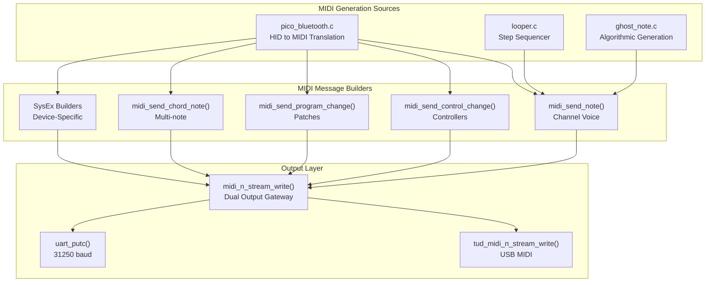
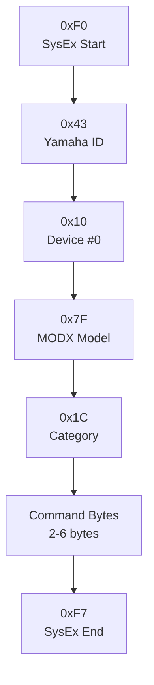
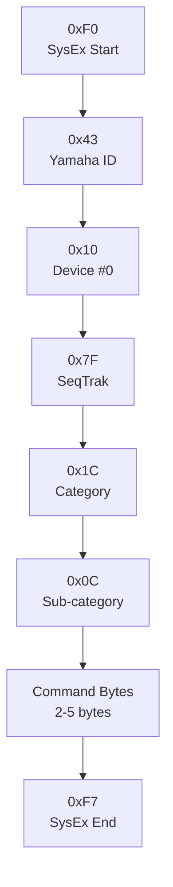
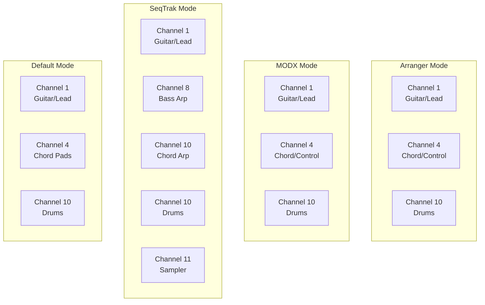
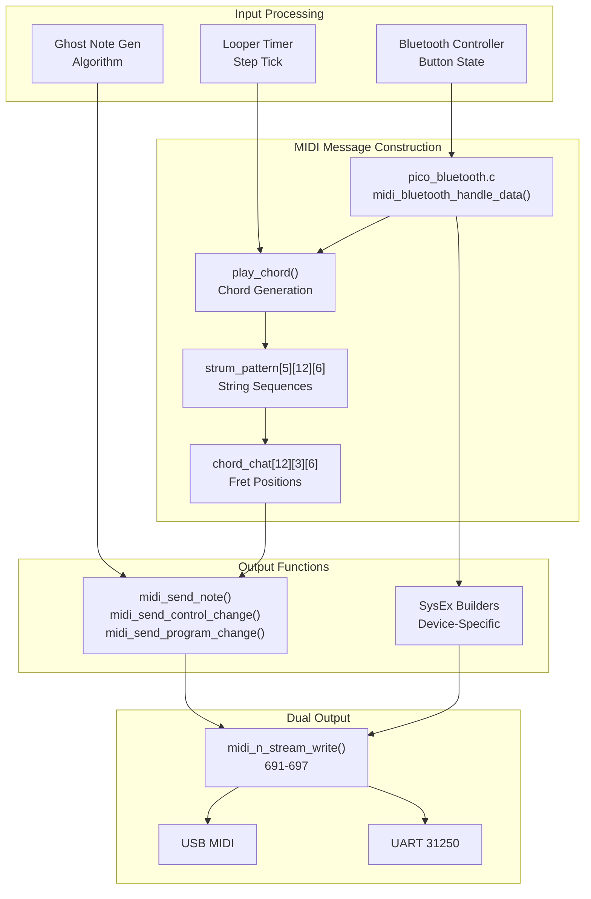

# MIDI Implementation Chart

> **Relevant source files**
> * [looper.c](https://github.com/Jus-Be/orinayo-pico/blob/122fa496/looper.c)
> * [main.c](https://github.com/Jus-Be/orinayo-pico/blob/122fa496/main.c)
> * [pico_bluetooth.c](https://github.com/Jus-Be/orinayo-pico/blob/122fa496/pico_bluetooth.c)

This page provides a complete reference of all MIDI messages transmitted and received by the Orinayo system. It documents the implementation of MIDI 1.0 standard messages, including Channel Voice Messages, System Real-Time Messages, and manufacturer-specific System Exclusive (SysEx) commands for supported hardware synthesizers.

For information about the dual USB/UART output architecture, see [Dual Output Architecture](./6.1-dual-output-architecture.md). For synthesizer-specific control commands, see [Synthesizer Control](./6.3-synthesizer-control.md).

---

## Overview

The Orinayo system implements a comprehensive MIDI output solution supporting:

* Standard Channel Voice Messages (Note On/Off, CC, PC)
* System Real-Time Messages (Clock, Start, Stop)
* Manufacturer-specific SysEx commands for Yamaha and Ketron devices
* Simultaneous USB MIDI and UART MIDI output at 31,250 baud
* External MIDI clock synchronization for tempo-locked operation

All MIDI output is transmitted through the `midi_n_stream_write` function, which ensures synchronization between USB and UART interfaces.

---

## MIDI Transmission Implementation

### Output Function Architecture



**Sources:** [main.c L690-L697](https://github.com/Jus-Be/orinayo-pico/blob/122fa496/main.c#L690-L697)

 [main.c L480-L491](https://github.com/Jus-Be/orinayo-pico/blob/122fa496/main.c#L480-L491)

 [looper.c L120-L129](https://github.com/Jus-Be/orinayo-pico/blob/122fa496/looper.c#L120-L129)

---

## MIDI Messages Transmitted

### Channel Voice Messages

#### Note On (0x9n)

| **Usage Context** | **Channel** | **Note Range** | **Velocity** | **Function** |
| --- | --- | --- | --- | --- |
| Guitar/Lead | 1 (0x90) | Variable | 25-127 | Chord notes and melodies |
| Chord Track | 4 (0x93) | 36-47 (C1-B2) | 100-127 | Arranger chord voicing |
| Bass Track | 8 (0x97) | Variable | 100-127 | SeqTrak bass arpeggio |
| Chord Synth | 10 (0x99) | 36-47 (C1-B2) | 100-127 | SeqTrak DX synth |
| Drums | 10 (0x99) | 36-64 | 30-127 | GM drum kit notes |
| Sampler | 11 (0x9A) | 60-65 | 127 | SeqTrak chord samples |

**Note Assignment (GM Drum Map):**

* 36: Bass Drum
* 38: Snare Drum
* 39: Hand Clap
* 41: Low Floor Tom
* 42: Closed Hi-Hat
* 45: Low Tom
* 46: Open Hi-Hat
* 48: Hi Mid Tom
* 49: Crash Cymbal
* 51: Ride Cymbal
* 56: Cowbell (metronome click)
* 58: Vibraslap
* 60: Hi Bongo
* 61: Low Bongo
* 62: Mute Conga
* 64: Low Conga

**Sources:** [looper.c L25-L66](https://github.com/Jus-Be/orinayo-pico/blob/122fa496/looper.c#L25-L66)

 [pico_bluetooth.c L1718-L1724](https://github.com/Jus-Be/orinayo-pico/blob/122fa496/pico_bluetooth.c#L1718-L1724)

 [main.c L584-L606](https://github.com/Jus-Be/orinayo-pico/blob/122fa496/main.c#L584-L606)

#### Note Off (0x8n)

Transmitted for all Note On messages when notes are released. Velocity is always 0.

**Sources:** [looper.c L127-L128](https://github.com/Jus-Be/orinayo-pico/blob/122fa496/looper.c#L127-L128)

 [pico_bluetooth.c L1282-L1288](https://github.com/Jus-Be/orinayo-pico/blob/122fa496/pico_bluetooth.c#L1282-L1288)

 [main.c L635-L637](https://github.com/Jus-Be/orinayo-pico/blob/122fa496/main.c#L635-L637)

#### Program Change (0xCn)

| **Channel** | **Range** | **Usage** |
| --- | --- | --- |
| 1 (0xC0) | 0-127 | Guitar patch selection (PC 25=Acoustic, 26=Jazz, 28=Muted, 33=Bass) |
| 4 (0xC3) | 0-127 | Pad voice selection (PC 89=Warm Pad default) |
| 1 (0xC0) | 0-15 | SeqTrak project selection (with Bank MSB=64) |

**Sources:** [pico_bluetooth.c L416](https://github.com/Jus-Be/orinayo-pico/blob/122fa496/pico_bluetooth.c#L416-L416)

 [main.c L504-L511](https://github.com/Jus-Be/orinayo-pico/blob/122fa496/main.c#L504-L511)

 [pico_bluetooth.c L1344-L1345](https://github.com/Jus-Be/orinayo-pico/blob/122fa496/pico_bluetooth.c#L1344-L1345)

#### Control Change (0xBn)

**Standard Controllers:**

| **CC#** | **Channel** | **Function** | **Value Range** | **Description** |
| --- | --- | --- | --- | --- |
| 0 | 1 | Bank MSB | 0-127 | Bank select for PC |
| 7 | 1, 4 | Volume | 0-127 | Channel volume |
| 27 | 8, 10 | Arp Type | 0-15 | SeqTrak arpeggiator pattern |
| 28 | 8, 10 | Arp Gate | 0-127 | SeqTrak arpeggiator gate time |
| 29 | 8, 10 | Arp Speed | 0-12 | SeqTrak arpeggiator speed |
| 32 | 1 | Bank LSB | 0-127 | Bank select LSB |
| 64 | 1 | Sustain | 0-127 | Sustain pedal (on/off) |
| 80 | 1 | Reverb Type | 0-7 | Effect type selection |
| 81 | 1 | Chorus Type | 0-7 | Effect type selection |
| 91 | 1 | Reverb Level | 0-127 | Effect send level |
| 93 | 1 | Chorus Level | 0-127 | Effect send level |
| 92 | 4 | Scene Select | 0-127 | MODX scene switching (0, 16, 32, 48, 64, 80, 96, 112) |

**Custom Controllers (Channel 4):**

| **CC#** | **Value** | **Function** |
| --- | --- | --- |
| 3 | 1-5 | Fill patterns (1-5) |
| 3 | 65 | Play/Start |
| 3 | 66-68 | Ending patterns (1-3) |
| 3 | 69 | Sync stop |
| 3 | 70 | Fade out |
| 3 | 127 | Stop |
| 9 | 1-5 | Melody voice selection |
| 14 | 1-5 | Style selection |
| 14 | 6-9 | Fill variations |
| 14 | 10 | Break |
| 14 | 65 | Next style |
| 14 | 127 | Previous style |
| 15 | 1-13 | Style group selection |

**Sources:** [main.c L493-L502](https://github.com/Jus-Be/orinayo-pico/blob/122fa496/main.c#L493-L502)

 [pico_bluetooth.c L533-L537](https://github.com/Jus-Be/orinayo-pico/blob/122fa496/pico_bluetooth.c#L533-L537)

 [pico_bluetooth.c L686-L691](https://github.com/Jus-Be/orinayo-pico/blob/122fa496/pico_bluetooth.c#L686-L691)

---

### System Real-Time Messages

#### MIDI Clock (0xF8)

Transmitted at 24 PPQN (pulses per quarter note). Also received for external clock synchronization.

**Transmission:** Sent during MIDI Start/Stop sequences
**Reception:** Processed to synchronize looper tempo and step timing

**Sources:** [main.c L520-L521](https://github.com/Jus-Be/orinayo-pico/blob/122fa496/main.c#L520-L521)

 [looper.c L457-L486](https://github.com/Jus-Be/orinayo-pico/blob/122fa496/looper.c#L457-L486)

#### MIDI Start (0xFA)

Transmitted to start playback on external devices. Also received to sync playback start.

**Sources:** [main.c L517](https://github.com/Jus-Be/orinayo-pico/blob/122fa496/main.c#L517-L517)

 [looper.c L488-L493](https://github.com/Jus-Be/orinayo-pico/blob/122fa496/looper.c#L488-L493)

#### MIDI Stop (0xFC)

Transmitted to stop playback on external devices. Also received to sync playback stop.

**Sources:** [main.c L517](https://github.com/Jus-Be/orinayo-pico/blob/122fa496/main.c#L517-L517)

---

### System Exclusive Messages

The system implements manufacturer-specific SysEx commands for multiple hardware synthesizers. All SysEx messages follow standard MIDI format: `0xF0 [manufacturer ID] [data bytes] 0xF7`

#### Yamaha MODX SysEx Format



**MODX Arpeggiator Control:**

| **Function** | **Address** | **Data** | **Code Reference** |
| --- | --- | --- | --- |
| Arp On/Off | 0x0D 06 00 01 09 | 0x00/0x01 | [main.c L271-L289](https://github.com/Jus-Be/orinayo-pico/blob/122fa496/main.c#L271-L289) |
| Arp Hold | 0x0D 1n 00 06 00 00 | 0x01/0x02 | [main.c L291-L310](https://github.com/Jus-Be/orinayo-pico/blob/122fa496/main.c#L291-L310) |
| Arp Octave | 0x0D 00 00 02 02 | 0x3D-0x43 | [main.c L251-L269](https://github.com/Jus-Be/orinayo-pico/blob/122fa496/main.c#L251-L269) |
| Tempo | 0x0D 06 00 02 1E | MSB/LSB | [main.c L333-L352](https://github.com/Jus-Be/orinayo-pico/blob/122fa496/main.c#L333-L352) |
| Key | 0x0D 00 00 02 00 | 0x40+key | [main.c L231-L249](https://github.com/Jus-Be/orinayo-pico/blob/122fa496/main.c#L231-L249) |

**Sources:** [main.c L231-L352](https://github.com/Jus-Be/orinayo-pico/blob/122fa496/main.c#L231-L352)

#### Yamaha SeqTrak SysEx Format



**SeqTrak Control Commands:**

| **Function** | **Address** | **Data** | **Code Reference** |
| --- | --- | --- | --- |
| Pattern Select | 0x30 5n 0F | 0-5 | [main.c L431-L451](https://github.com/Jus-Be/orinayo-pico/blob/122fa496/main.c#L431-L451) |
| Track Mute | 0x30 5n 29 | 0x00/0x7D | [main.c L412-L429](https://github.com/Jus-Be/orinayo-pico/blob/122fa496/main.c#L412-L429) |
| Key Change | 0x30 40 7F | 0-11 | [main.c L393-L410](https://github.com/Jus-Be/orinayo-pico/blob/122fa496/main.c#L393-L410) |
| Tempo | 0x30 40 76 | MSB/LSB | [main.c L373-L391](https://github.com/Jus-Be/orinayo-pico/blob/122fa496/main.c#L373-L391) |
| Arp Octave | 0x31 5n 1C | 0x3D-0x43 | [main.c L354-L371](https://github.com/Jus-Be/orinayo-pico/blob/122fa496/main.c#L354-L371) |

**Sources:** [main.c L354-L467](https://github.com/Jus-Be/orinayo-pico/blob/122fa496/main.c#L354-L467)

#### Yamaha Arranger SysEx Format

**Start/Stop Control:**

```
0xF0 0x43 0x60 [code] [value] 0xF7
```

* Code: 0x7A (Start), 0x7D (Stop)
* Value: 0x7F (On), 0x00 (Off)

**Section Control:**

```
0xF0 0x43 0x7E 0x00 [section] [value] 0xF7
```

* Section codes: 0x00-0x02 (Intro/End), 0x10-0x13 (Main A-D), 0x18 (Break), 0x20-0x22 (Ending)
* Value: 0x7F (On), 0x00 (Off)

**Sources:** [main.c L524-L550](https://github.com/Jus-Be/orinayo-pico/blob/122fa496/main.c#L524-L550)

#### Ketron Arranger SysEx Format

**Section Control:**

```
0xF0 0x26 0x79 0x05 0x00 [section] [value] 0xF7
```

* Section codes: 0x03-0x06 (Main A-D), 0x07-0x0A (Fill A-D), 0x0B-0x0E (Return A-D), 0x0F-0x11 (Intro/End), 0x12 (Start/Stop), 0x17 (To End), 0x35 (Fade)

**Footswitch Control:**

```
0xF0 0x26 0x7C 0x05 0x01 [0x55+code] [value] 0xF7
```

* Code: 0-8 (footswitch number)
* Value: 0x7F (Pressed), 0x00 (Released)

**Sources:** [main.c L552-L582](https://github.com/Jus-Be/orinayo-pico/blob/122fa496/main.c#L552-L582)

#### Roland Dream SysEx Format

**Delay Time Control:**

```
0xF0 0x41 0x00 0x42 0x12 0x40 0x01 [param] [value] 0x00 0xF7
```

* Parameter: 0x35 (Delay Time), 0x3D (Delay Feedback)
* Value: Calculated as `(60000 / tempo / 128 / 4) % 128`

**Sources:** [main.c L210-L229](https://github.com/Jus-Be/orinayo-pico/blob/122fa496/main.c#L210-L229)

---

## MIDI Reception Implementation

### External Clock Synchronization

```

```

**Sources:** [looper.c L457-L486](https://github.com/Jus-Be/orinayo-pico/blob/122fa496/looper.c#L457-L486)

 [main.c L157-L167](https://github.com/Jus-Be/orinayo-pico/blob/122fa496/main.c#L157-L167)

### Clock Source Switching

The looper automatically switches between internal and external clock sources:

| **Event** | **Action** | **State Change** |
| --- | --- | --- |
| First MIDI Clock received | Switch to `LOOPER_CLOCK_EXTERNAL` | Cancel internal timer |
| 250ms without MIDI Clock | Switch to `LOOPER_CLOCK_INTERNAL` | Resume internal timer at current BPM |
| MIDI Start received | Reset step counter to 0 | Sync playback start |

**Sources:** [looper.c L437-L454](https://github.com/Jus-Be/orinayo-pico/blob/122fa496/looper.c#L437-L454)

 [looper.c L462-L472](https://github.com/Jus-Be/orinayo-pico/blob/122fa496/looper.c#L462-L472)

---

## MIDI Channel Assignment

### Channel Mapping by Operational Mode



**Sources:** [pico_bluetooth.c L32-L38](https://github.com/Jus-Be/orinayo-pico/blob/122fa496/pico_bluetooth.c#L32-L38)

 [main.c L481-L491](https://github.com/Jus-Be/orinayo-pico/blob/122fa496/main.c#L481-L491)

 [main.c L584-L606](https://github.com/Jus-Be/orinayo-pico/blob/122fa496/main.c#L584-L606)

### Track-Specific Channel Usage

The looper assigns all 14 drum tracks to MIDI Channel 10 (GM standard):

**Sources:** [looper.c L51-L66](https://github.com/Jus-Be/orinayo-pico/blob/122fa496/looper.c#L51-L66)

---

## MIDI Data Flow Architecture



**Sources:** [pico_bluetooth.c L327-L1274](https://github.com/Jus-Be/orinayo-pico/blob/122fa496/pico_bluetooth.c#L327-L1274)

 [main.c L690-L697](https://github.com/Jus-Be/orinayo-pico/blob/122fa496/main.c#L690-L697)

 [looper.c L120-L129](https://github.com/Jus-Be/orinayo-pico/blob/122fa496/looper.c#L120-L129)

---

## Implementation Notes

### USB MIDI Class Compliance

The system implements USB MIDI Device Class 1.0 specification through TinyUSB library:

* Vendor ID: 0xCAFE
* Product ID: Dynamic (based on enabled features)
* Interface: Standard MIDI Streaming
* Endpoints: Bulk IN/OUT

**Sources:** Referenced in architecture diagrams, implemented via TinyUSB

### UART MIDI Hardware

UART0 is configured for standard MIDI electrical specification:

* Baud Rate: 31,250 bps
* Data Bits: 8
* Parity: None
* Stop Bits: 1
* TX Pin: GPIO 0
* RX Pin: GPIO 1 (not currently used)

**Sources:** [main.c L58-L62](https://github.com/Jus-Be/orinayo-pico/blob/122fa496/main.c#L58-L62)

 [main.c L146-L150](https://github.com/Jus-Be/orinayo-pico/blob/122fa496/main.c#L146-L150)

### Message Priority

All MIDI messages are transmitted synchronously in the order they are generated. No buffering or priority queue is implemented. The `midi_n_stream_write` function blocks until UART transmission completes.

**Sources:** [main.c L690-L697](https://github.com/Jus-Be/orinayo-pico/blob/122fa496/main.c#L690-L697)

### Timing Considerations

* Step sequencer timing: Microsecond precision using `time_us_64()`
* Swing offset: Applied per-step before note scheduling
* External clock: Automatically detected and synchronized within one measure
* Latency: <1ms for immediate notes, scheduled notes dispatched at precise timestamps

**Sources:** [looper.c L148-L158](https://github.com/Jus-Be/orinayo-pico/blob/122fa496/looper.c#L148-L158)

 [note_scheduler.c](https://github.com/Jus-Be/orinayo-pico/blob/122fa496/note_scheduler.c)

 (referenced)

---

## Quick Reference Tables

### MIDI Message Summary

| **Message Type** | **Status Byte** | **Data Bytes** | **Usage** |
| --- | --- | --- | --- |
| Note On | 0x90-0x9F | Note, Velocity | Guitar, drums, chord notes |
| Note Off | 0x80-0x8F | Note, 0 | Note release |
| Program Change | 0xC0-0xCF | Program | Patch selection |
| Control Change | 0xB0-0xBF | CC#, Value | Controllers, effects, scenes |
| MIDI Clock | 0xF8 | None | 24 PPQN timing |
| MIDI Start | 0xFA | None | Start playback |
| MIDI Stop | 0xFC | None | Stop playback |
| SysEx | 0xF0...0xF7 | Variable | Device-specific control |

### Supported Synthesizer Models

| **Manufacturer** | **Model** | **Function** | **SysEx ID** |
| --- | --- | --- | --- |
| Yamaha | MODX | Arpeggiator, tempo, scene control | 0x43 0x10 0x7F 0x1C |
| Yamaha | SeqTrak | Pattern, mute, tempo control | 0x43 0x10 0x7F 0x1C 0x0C |
| Yamaha | PSR/Tyros | Start/stop, section control | 0x43 0x60 / 0x43 0x7E |
| Ketron | SD/Event | Section, fill control | 0x26 0x79 / 0x26 0x7C |
| Roland | Boutique Dream | Delay time control | 0x41 0x00 0x42 |

**Sources:** [main.c L210-L582](https://github.com/Jus-Be/orinayo-pico/blob/122fa496/main.c#L210-L582)