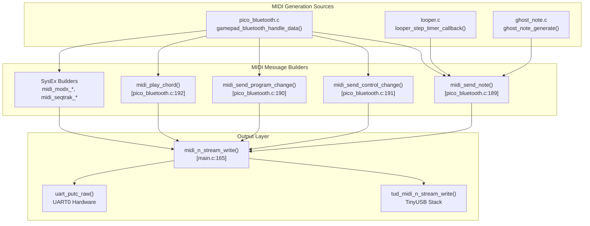
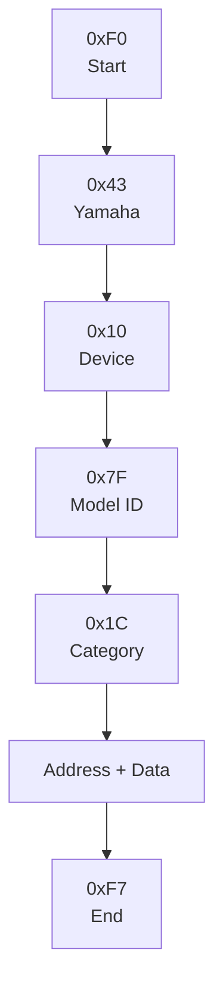
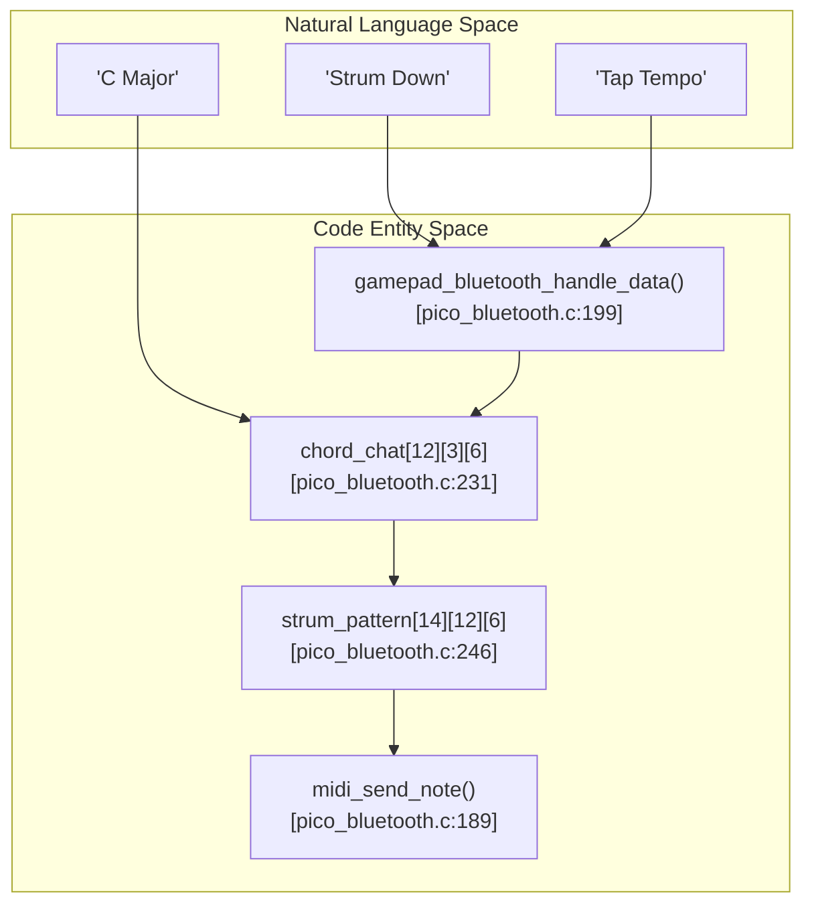

# MIDI Implementation Chart

> **Relevant source files**
> * [main.c](https://github.com/Jus-Be/orinayo-pico/blob/6dde5a75/main.c)
> * [pico_bluetooth.c](https://github.com/Jus-Be/orinayo-pico/blob/6dde5a75/pico_bluetooth.c)

This page provides a complete reference of all MIDI messages transmitted and received by the Orinayo system. It documents the implementation of MIDI 1.0 standard messages, including Channel Voice Messages, System Real-Time Messages, and manufacturer-specific System Exclusive (SysEx) commands for supported hardware synthesizers.

For information about the dual USB/UART output architecture, see [6.1 Dual Output Architecture](https://github.com/Jus-Be/orinayo-pico/blob/6dde5a75/6.1 Dual Output Architecture)

 For synthesizer-specific control commands, see [6.3 Synthesizer Control](https://github.com/Jus-Be/orinayo-pico/blob/6dde5a75/6.3 Synthesizer Control)

---

## Overview

The Orinayo system implements a comprehensive MIDI output solution supporting:

* Standard Channel Voice Messages (Note On/Off, CC, PC)
* System Real-Time Messages (Clock, Start, Stop)
* Manufacturer-specific SysEx commands for Yamaha, Ketron, and Roland devices
* Simultaneous USB MIDI and UART MIDI output at 31,250 baud
* External MIDI clock synchronization for tempo-locked operation

All MIDI output is transmitted through the `midi_n_stream_write` function, which acts as the unified gateway for both physical and virtual interfaces.

---

## MIDI Transmission Implementation

### Output Function Architecture

The following diagram maps the high-level MIDI generation logic to the specific code entities responsible for message construction and dispatch.

```mermaid
flowchart TD

BT["pico_bluetooth.c<br>gamepad_bluetooth_handle_data()"]
LOOP["looper.c<br>looper_step_timer_callback()"]
GHOST["ghost_note.c<br>ghost_note_generate()"]
SEND_NOTE["midi_send_note()<br>[pico_bluetooth.c:189]"]
SEND_CC["midi_send_control_change()<br>[pico_bluetooth.c:191]"]
SEND_PC["midi_send_program_change()<br>[pico_bluetooth.c:190]"]
SEND_CHORD["midi_play_chord()<br>[pico_bluetooth.c:192]"]
SEND_SYSEX["SysEx Builders<br>midi_modx_*, midi_seqtrak_*"]
STREAM["midi_n_stream_write()<br>[main.c:165]"]
USB["tud_midi_n_stream_write()<br>TinyUSB Stack"]
UART["uart_putc_raw()<br>UART0 Hardware"]

BT --> SEND_NOTE
BT --> SEND_CC
BT --> SEND_PC
BT --> SEND_CHORD
LOOP --> SEND_NOTE
GHOST --> SEND_NOTE
BT --> SEND_SYSEX
SEND_NOTE --> STREAM
SEND_CC --> STREAM
SEND_PC --> STREAM
SEND_CHORD --> STREAM
SEND_SYSEX --> STREAM

subgraph subGraph2 ["Output Layer"]
    STREAM
    USB
    UART
    STREAM --> USB
    STREAM --> UART
end

subgraph subGraph1 ["MIDI Message Builders"]
    SEND_NOTE
    SEND_CC
    SEND_PC
    SEND_CHORD
    SEND_SYSEX
end

subgraph subGraph0 ["MIDI Generation Sources"]
    BT
    LOOP
    GHOST
end
```

**Sources:** [main.c L165](https://github.com/Jus-Be/orinayo-pico/blob/6dde5a75/main.c#L165-L165)

 [pico_bluetooth.c L189-L198](https://github.com/Jus-Be/orinayo-pico/blob/6dde5a75/pico_bluetooth.c#L189-L198)

---

## MIDI Messages Transmitted

### Channel Voice Messages

#### Note On (0x9n)

| **Usage Context** | **Channel** | **Note Range** | **Velocity** | **Function** |
| --- | --- | --- | --- | --- |
| Guitar/Lead | 1 (0x90) | Variable | 25-127 | Chord notes and melodies |
| Chord Track | 4 (0x93) | 36-47 (C1-B2) | 100-127 | Arranger chord voicing |
| Bass Track | 8 (0x97) | Variable | 100-127 | SeqTrak bass arpeggio |
| Chord Synth | 10 (0x99) | 36-47 (C1-B2) | 100-127 | SeqTrak DX synth |
| Drums | 10 (0x99) | 36-64 | 30-127 | GM drum kit notes |
| Sampler | 11 (0x9A) | 60-65 | 127 | SeqTrak chord samples |

**Note Assignment (GM Drum Map):**

* 36: Bass Drum
* 38: Snare Drum
* 42: Closed Hi-Hat
* 46: Open Hi-Hat
* 49: Crash Cymbal
* 56: Cowbell (metronome click)

**Sources:** [pico_bluetooth.c L148-L154](https://github.com/Jus-Be/orinayo-pico/blob/6dde5a75/pico_bluetooth.c#L148-L154)

 [pico_bluetooth.c L158-L168](https://github.com/Jus-Be/orinayo-pico/blob/6dde5a75/pico_bluetooth.c#L158-L168)

 [pico_bluetooth.c L189](https://github.com/Jus-Be/orinayo-pico/blob/6dde5a75/pico_bluetooth.c#L189-L189)

#### Note Off (0x8n)

Transmitted for all Note On messages when notes are released. Velocity is typically 0.

**Sources:** [pico_bluetooth.c L189](https://github.com/Jus-Be/orinayo-pico/blob/6dde5a75/pico_bluetooth.c#L189-L189)

#### Program Change (0xCn)

| **Channel** | **Range** | **Usage** |
| --- | --- | --- |
| 1 (0xC0) | 0-127 | Guitar patch selection (PC 26=Jazz default) |
| 4 (0xC3) | 0-127 | Pad voice selection |
| 1 (0xC0) | 0-15 | SeqTrak project selection |

**Sources:** [pico_bluetooth.c L119](https://github.com/Jus-Be/orinayo-pico/blob/6dde5a75/pico_bluetooth.c#L119-L119)

 [pico_bluetooth.c L190](https://github.com/Jus-Be/orinayo-pico/blob/6dde5a75/pico_bluetooth.c#L190-L190)

#### Control Change (0xBn)

**Standard Controllers:**

| **CC#** | **Channel** | **Function** | **Value Range** | **Description** |
| --- | --- | --- | --- | --- |
| 0 | 1 | Bank MSB | 0-127 | Bank select for PC |
| 7 | 1, 4 | Volume | 0-127 | Channel volume |
| 32 | 1 | Bank LSB | 0-127 | Bank select LSB |
| 64 | 1 | Sustain | 0-127 | Sustain pedal (on/off) |
| 91 | 1 | Reverb Level | 0-127 | Effect send level |
| 92 | 4 | Scene Select | 0-127 | MODX scene switching |

**Sources:** [pico_bluetooth.c L191](https://github.com/Jus-Be/orinayo-pico/blob/6dde5a75/pico_bluetooth.c#L191-L191)

---

### System Real-Time Messages

#### MIDI Clock (0xF8)

Transmitted at 24 PPQN (pulses per quarter note) when acting as master. Received to synchronize the looper to an external source.

**Sources:** [pico_bluetooth.c L188](https://github.com/Jus-Be/orinayo-pico/blob/6dde5a75/pico_bluetooth.c#L188-L188)

#### MIDI Start (0xFA) / Stop (0xFC)

Transmitted via `midi_start_stop()` to control external sequencers and the internal looper engine simultaneously.

**Sources:** [pico_bluetooth.c L188](https://github.com/Jus-Be/orinayo-pico/blob/6dde5a75/pico_bluetooth.c#L188-L188)

---

### System Exclusive Messages

The system implements manufacturer-specific SysEx commands for multiple hardware synthesizers.

#### Yamaha MODX / SeqTrak SysEx Format

```mermaid
flowchart TD

F0["0xF0<br>Start"]
YID["0x43<br>Yamaha"]
DEV["0x10<br>Device"]
MDL["0x7F<br>Model ID"]
CAT["0x1C<br>Category"]
CMD["Address + Data"]
F7["0xF7<br>End"]

F0 --> YID
YID --> DEV
DEV --> MDL
MDL --> CAT
CAT --> CMD
CMD --> F7
```

**Common MODX/SeqTrak Commands:**

* **Tempo:** `midi_modx_tempo()` [pico_bluetooth.c L181](https://github.com/Jus-Be/orinayo-pico/blob/6dde5a75/pico_bluetooth.c#L181-L181)  `midi_seqtrak_tempo()` [pico_bluetooth.c L185](https://github.com/Jus-Be/orinayo-pico/blob/6dde5a75/pico_bluetooth.c#L185-L185)
* **Arp Control:** `midi_modx_arp()` [pico_bluetooth.c L178](https://github.com/Jus-Be/orinayo-pico/blob/6dde5a75/pico_bluetooth.c#L178-L178)
* **Pattern Select:** `midi_seqtrak_pattern()` [pico_bluetooth.c L186](https://github.com/Jus-Be/orinayo-pico/blob/6dde5a75/pico_bluetooth.c#L186-L186)

#### Roland Dream (M5Audio) SysEx

Used to set delay times relative to the current BPM.

* **Formula:** `(60000 / tempo / 128 / 4) % 128`
* **Source:** `dream_set_delay()` [pico_bluetooth.c L217](https://github.com/Jus-Be/orinayo-pico/blob/6dde5a75/pico_bluetooth.c#L217-L217)

#### Arranger Control (Yamaha/Ketron)

* **Yamaha Arranger:** Controls sections (Intro, Main, Fill, Ending) via `midi_yamaha_arr()`. [pico_bluetooth.c L197](https://github.com/Jus-Be/orinayo-pico/blob/6dde5a75/pico_bluetooth.c#L197-L197)
* **Ketron Arranger:** Controls sections and footswitches via `midi_ketron_arr()` and `midi_ketron_footsw()`. [pico_bluetooth.c L194-L195](https://github.com/Jus-Be/orinayo-pico/blob/6dde5a75/pico_bluetooth.c#L194-L195)

---

## MIDI Reception Implementation

### External Clock Synchronization

The system listens for incoming MIDI packets via `tud_midi_packet_read()` in the main loop.

```mermaid
sequenceDiagram
  participant External MIDI Clock
  participant TinyUSB (main.c)
  participant Note Scheduler

  External MIDI Clock->>TinyUSB (main.c): Status 0xF8 (Clock)
  TinyUSB (main.c)->>TinyUSB (main.c): tud_midi_packet_read()
  note over TinyUSB (main.c): Detects Real-time Status
  TinyUSB (main.c)->>Note Scheduler: Synchronize Dispatcher
```

**Sources:** [main.c L232-L234](https://github.com/Jus-Be/orinayo-pico/blob/6dde5a75/main.c#L232-L234)

---

## MIDI Data Flow Architecture

The mapping from physical Bluetooth HID inputs to MIDI messages is defined in `pico_bluetooth.c`.

```mermaid
flowchart TD

STRUM["'Strum Down'"]
CHORD["'C Major'"]
TEMPO["'Tap Tempo'"]
BT_DATA["gamepad_bluetooth_handle_data()<br>[pico_bluetooth.c:199]"]
CHORD_MAP["chord_chat[12][3][6]<br>[pico_bluetooth.c:231]"]
STRUM_MAP["strum_pattern[14][12][6]<br>[pico_bluetooth.c:246]"]
MIDI_OUT["midi_send_note()<br>[pico_bluetooth.c:189]"]

STRUM --> BT_DATA
CHORD --> CHORD_MAP
TEMPO --> BT_DATA

subgraph subGraph1 ["Code Entity Space"]
    BT_DATA
    CHORD_MAP
    STRUM_MAP
    MIDI_OUT
    BT_DATA --> CHORD_MAP
    CHORD_MAP --> STRUM_MAP
    STRUM_MAP --> MIDI_OUT
end

subgraph subGraph0 ["Natural Language Space"]
    STRUM
    CHORD
    TEMPO
end
```

**Sources:** [pico_bluetooth.c L199](https://github.com/Jus-Be/orinayo-pico/blob/6dde5a75/pico_bluetooth.c#L199-L199)

 [pico_bluetooth.c L231-L244](https://github.com/Jus-Be/orinayo-pico/blob/6dde5a75/pico_bluetooth.c#L231-L244)

 [pico_bluetooth.c L246](https://github.com/Jus-Be/orinayo-pico/blob/6dde5a75/pico_bluetooth.c#L246-L246)

---

## Implementation Details

### UART Configuration

The Raspberry Pi Pico UART0 is configured specifically for MIDI baud rates.

* **Baud Rate:** 31,250 [main.c L66](https://github.com/Jus-Be/orinayo-pico/blob/6dde5a75/main.c#L66-L66)
* **Pins:** TX (GPIO 0), RX (GPIO 1) [main.c L67-L68](https://github.com/Jus-Be/orinayo-pico/blob/6dde5a75/main.c#L67-L68)
* **Initialization:** `uart_init(UART_ID, BAUD_RATE)` [main.c L220](https://github.com/Jus-Be/orinayo-pico/blob/6dde5a75/main.c#L220-L220)

### USB MIDI Class

Handled by the TinyUSB stack.

* **Task:** `tud_task()` must be called frequently in the main loop. [main.c L228](https://github.com/Jus-Be/orinayo-pico/blob/6dde5a75/main.c#L228-L228)
* **Connection State:** Monitored via `tud_mount_cb` and `tud_umount_cb` to update the onboard LED. [main.c L209-L218](https://github.com/Jus-Be/orinayo-pico/blob/6dde5a75/main.c#L209-L218)

**Sources:** [main.c L66-L68](https://github.com/Jus-Be/orinayo-pico/blob/6dde5a75/main.c#L66-L68)

 [main.c L220](https://github.com/Jus-Be/orinayo-pico/blob/6dde5a75/main.c#L220-L220)

 [main.c L228](https://github.com/Jus-Be/orinayo-pico/blob/6dde5a75/main.c#L228-L228)