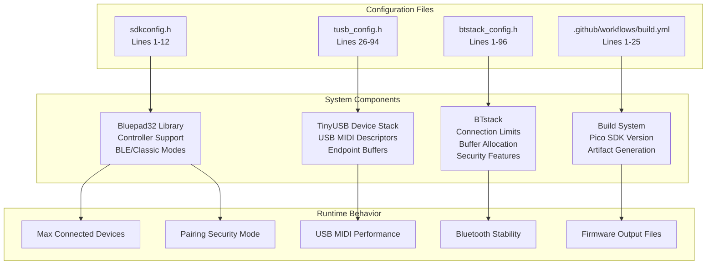
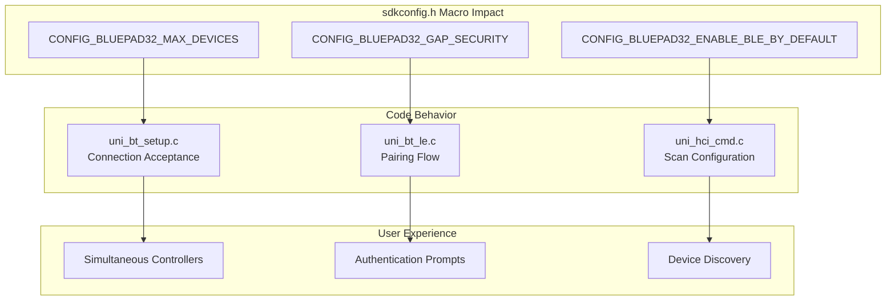
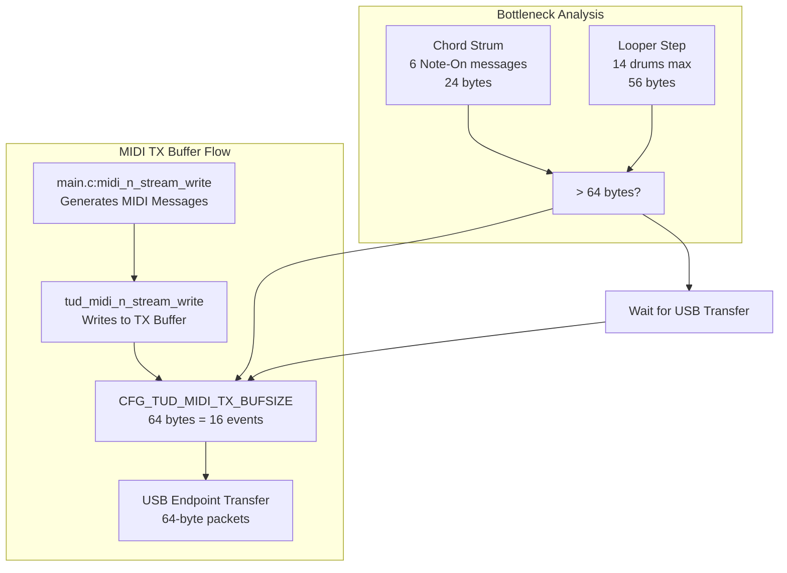
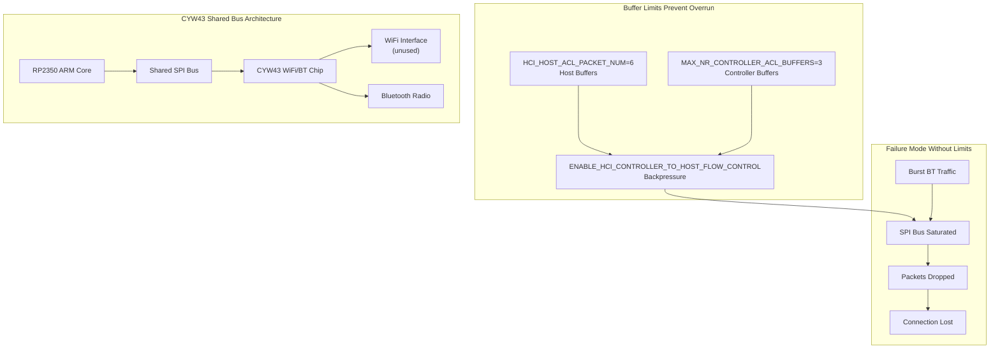
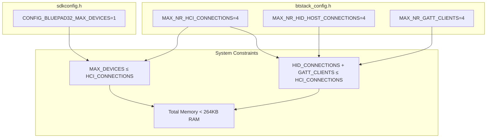

# Configuration Reference

> **Relevant source files**
> * [.github/workflows/build.yml](https://github.com/Jus-Be/orinayo-pico/blob/122fa496/.github/workflows/build.yml)
> * [bluepad32/include/btstack_config.h](https://github.com/Jus-Be/orinayo-pico/blob/122fa496/bluepad32/include/btstack_config.h)
> * [pico_bluetooth.h](https://github.com/Jus-Be/orinayo-pico/blob/122fa496/pico_bluetooth.h)
> * [sdkconfig.h](https://github.com/Jus-Be/orinayo-pico/blob/122fa496/sdkconfig.h)
> * [seqlock.h](https://github.com/Jus-Be/orinayo-pico/blob/122fa496/seqlock.h)
> * [tusb_config.h](https://github.com/Jus-Be/orinayo-pico/blob/122fa496/tusb_config.h)

This page provides a comprehensive reference for all configuration macros and build settings in the Orinayo system. These configurations control Bluetooth behavior, USB MIDI functionality, memory allocation, and build options.

For information about runtime operational modes selected via controller input, see [Operational Modes](./4.4-operational-modes.md). For hardware setup and connection options, see [Hardware Requirements](./2.1-hardware-requirements.md). For build instructions, see [Building and Flashing](./2.2-building-and-flashing.md).

## Configuration File Overview

The Orinayo system uses multiple configuration files organized by subsystem. The following diagram shows how each configuration file controls different aspects of the system:



**Sources:** [sdkconfig.h L1-L12](https://github.com/Jus-Be/orinayo-pico/blob/122fa496/sdkconfig.h#L1-L12)

 [tusb_config.h L26-L94](https://github.com/Jus-Be/orinayo-pico/blob/122fa496/tusb_config.h#L26-L94)

 [bluepad32/include/btstack_config.h L1-L96](https://github.com/Jus-Be/orinayo-pico/blob/122fa496/bluepad32/include/btstack_config.h#L1-L96)

 [.github/workflows/build.yml L1-L25](https://github.com/Jus-Be/orinayo-pico/blob/122fa496/.github/workflows/build.yml#L1-L25)

## Bluepad32 Configuration (sdkconfig.h)

The [sdkconfig.h L1-L12](https://github.com/Jus-Be/orinayo-pico/blob/122fa496/sdkconfig.h#L1-L12)

 file configures the Bluepad32 controller library. This file controls the maximum number of simultaneous Bluetooth connections, security requirements, and logging verbosity.

### Configuration Macros

| Macro | Default Value | Valid Range | Description |
| --- | --- | --- | --- |
| `CONFIG_BLUEPAD32_PLATFORM_CUSTOM` | Defined | - | Enables custom platform implementation (Pico W) |
| `CONFIG_TARGET_PICO_W` | Defined | - | Specifies target hardware is Raspberry Pi Pico W |
| `CONFIG_BLUEPAD32_LOG_LEVEL` | `0` | 0-4 | Log verbosity: 0=INFO, 1=WARN, 2=ERROR, 3=VERBOSE, 4=DEBUG |
| `CONFIG_BLUEPAD32_MAX_DEVICES` | `1` | 1-4 | Maximum simultaneous Bluetooth devices |
| `CONFIG_BLUEPAD32_MAX_ALLOWLIST` | `1` | 0-16 | Maximum devices in pairing allowlist |
| `CONFIG_BLUEPAD32_GAP_SECURITY` | `1` | 0-3 | Security mode: 0=None, 1=Encryption, 2=Auth, 3=Secure |
| `CONFIG_BLUEPAD32_ENABLE_BLE_BY_DEFAULT` | `1` | 0-1 | Enable BLE scanning on startup (0=Classic only, 1=BLE+Classic) |

### Usage Guidelines

**Increasing MAX_DEVICES**: The default value of `1` is optimized for single-controller use cases (Guitar Hero controller or Liberlive MIDI device). Increasing this requires corresponding changes in [btstack_config.h L47](https://github.com/Jus-Be/orinayo-pico/blob/122fa496/btstack_config.h#L47-L47)

 (`MAX_NR_HCI_CONNECTIONS`) to allocate sufficient connection slots. Each additional device increases memory usage by approximately 4KB.

**Security Levels**: The default `GAP_SECURITY=1` enables encryption without requiring numeric comparison. For devices requiring stronger authentication (e.g., keyboards), increase to `2` or `3`. Note that some legacy controllers may fail to pair with higher security levels.

**BLE Mode**: The system requires `ENABLE_BLE_BY_DEFAULT=1` to support Liberlive and Sonic Master MIDI devices, which use custom GATT services. Disabling BLE limits input to Bluetooth Classic HID controllers only.



**Sources:** [sdkconfig.h L1-L12](https://github.com/Jus-Be/orinayo-pico/blob/122fa496/sdkconfig.h#L1-L12)

## TinyUSB Configuration (tusb_config.h)

The [tusb_config.h L26-L94](https://github.com/Jus-Be/orinayo-pico/blob/122fa496/tusb_config.h#L26-L94)

 file configures the TinyUSB device stack for USB MIDI output. This file controls endpoint sizes, buffer allocation, and enabled device classes.

### Core Configuration

| Macro | Default Value | Description |
| --- | --- | --- |
| `CFG_TUSB_MCU` | `OPT_MCU_RP2040` | Target microcontroller (set by CMake) |
| `CFG_TUSB_RHPORT0_MODE` | `OPT_MODE_DEVICE` | USB mode: Device (not Host) |
| `CFG_TUSB_OS` | `OPT_OS_PICO` | Operating system integration layer |
| `CFG_TUD_ENDPOINT0_SIZE` | `64` | Control endpoint max packet size (bytes) |
| `CFG_TUSB_MEM_ALIGN` | `__attribute__ ((aligned(4)))` | Memory alignment for DMA transfers |

### Device Class Configuration

| Class | Macro | Enabled | Purpose |
| --- | --- | --- | --- |
| CDC (Serial) | `CFG_TUD_CDC` | `0` | Disabled - UART used for debug instead |
| Mass Storage | `CFG_TUD_MSC` | `0` | Disabled - No storage device emulation |
| HID | `CFG_TUD_HID` | `0` | Disabled - System is MIDI-only device |
| **MIDI** | `CFG_TUD_MIDI` | `1` | **Enabled - Primary USB function** |
| Vendor | `CFG_TUD_VENDOR` | `0` | Disabled - No custom protocol needed |

### MIDI Buffer Configuration

| Macro | Default Value | High-Speed Value | Description |
| --- | --- | --- | --- |
| `CFG_TUD_MIDI_RX_BUFSIZE` | `64` | `512` | USB-to-device receive buffer (bytes) |
| `CFG_TUD_MIDI_TX_BUFSIZE` | `64` | `512` | Device-to-USB transmit buffer (bytes) |

The buffer sizes automatically scale based on the detected USB speed via the `TUD_OPT_HIGH_SPEED` macro. The Pico W operates in Full-Speed mode (12 Mbps), so the 64-byte buffers are used. These buffers hold USB MIDI Event Packets (4 bytes each), supporting up to 16 pending messages per direction.

### Performance Tuning



**Buffer Overflow Scenarios**: The default 64-byte buffer can overflow during dense looper activity. When all 14 drum tracks trigger simultaneously (28 Note On + 28 Note Off = 112 bytes), the system must wait for USB transfers to complete. This introduces latency spikes of up to 5.3ms (64 bytes @ 12 Mbps). For high-throughput applications, consider increasing `CFG_TUD_MIDI_TX_BUFSIZE` to `128` or `256` bytes.

**Memory Alignment**: The `CFG_TUSB_MEM_ALIGN` setting ensures DMA-safe memory access. On RP2040/RP2350, the DMA controller requires 4-byte alignment for optimal performance. Do not modify this value.

**Sources:** [tusb_config.h L26-L94](https://github.com/Jus-Be/orinayo-pico/blob/122fa496/tusb_config.h#L26-L94)

## BTstack Configuration (btstack_config.h)

The [btstack_config.h L1-L96](https://github.com/Jus-Be/orinayo-pico/blob/122fa496/btstack_config.h#L1-L96)

 file configures the BTstack Bluetooth library. This file controls connection limits, buffer sizes, security features, and protocol support. It is located in the `bluepad32/include/` directory and shared across the Bluepad32 integration.

### Feature Enable Flags

| Macro | Value | Requirement | Description |
| --- | --- | --- | --- |
| `ENABLE_LOG_INFO` | Defined | Optional | Enable informational log messages |
| `ENABLE_LOG_ERROR` | Defined | **Required** | Enable error logging for debugging |
| `ENABLE_PRINTF_HEXDUMP` | Defined | Optional | Enable hex dump output for packet analysis |
| `ENABLE_BLE` | Defined | **Required** | Bluetooth Low Energy support (Liberlive/Sonic Master) |
| `ENABLE_CLASSIC` | Defined | **Required** | Bluetooth Classic support (HID controllers) |
| `ENABLE_LE_CENTRAL` | Defined | **Required** | BLE central role (initiates connections) |
| `ENABLE_LE_PERIPHERAL` | Defined | Optional | BLE peripheral role (not used in this system) |
| `ENABLE_LE_SECURE_CONNECTIONS` | Defined | **Required** | BLE secure pairing with ECDH key exchange |
| `ENABLE_GATT_CLIENT_PAIRING` | Defined | **Required** | GATT client with pairing support |
| `ENABLE_HCI_CONTROLLER_TO_HOST_FLOW_CONTROL` | Defined | **Required** | Prevents CYW43 bus overrun |

### Connection and Resource Limits

The following table shows the most critical resource limits. These must be balanced against available RAM (264KB on Pico W):

| Macro | Default | Range | Memory Impact | Description |
| --- | --- | --- | --- | --- |
| `MAX_NR_HCI_CONNECTIONS` | `4` | 1-7 | ~8KB each | Total simultaneous Bluetooth connections |
| `MAX_NR_GATT_CLIENTS` | `4` | 1-8 | ~2KB each | GATT client instances for BLE devices |
| `MAX_NR_HID_HOST_CONNECTIONS` | `4` | 1-8 | ~4KB each | HID host connections (Classic controllers) |
| `MAX_NR_L2CAP_CHANNELS` | `6` | 2-16 | ~1KB each | L2CAP logical channels |
| `MAX_NR_BTSTACK_LINK_KEY_DB_MEMORY_ENTRIES` | `2` | 1-32 | ~80 bytes each | Cached link keys for faster reconnection |
| `MAX_NR_LE_DEVICE_DB_ENTRIES` | `16` | 1-64 | ~128 bytes each | BLE device database (bonded devices) |
| `NVM_NUM_DEVICE_DB_ENTRIES` | `16` | 1-64 | Flash storage | Persistent BLE device records |
| `NVM_NUM_LINK_KEYS` | `16` | 1-64 | Flash storage | Persistent Classic link keys |

### Buffer Size Configuration

| Macro | Default | Purpose | Tuning Guidance |
| --- | --- | --- | --- |
| `HCI_ACL_PAYLOAD_SIZE` | `1695` | Maximum ACL packet size | **Do not reduce** - breaks A2DP audio |
| `HCI_HOST_ACL_PACKET_LEN` | `1024` | Host-side ACL buffer | Reduce if memory-constrained |
| `HCI_HOST_ACL_PACKET_NUM` | `6` | Number of ACL buffers | Controls throughput vs memory |
| `MAX_ATT_DB_SIZE` | `512` | GATT attribute database | Increase if custom GATT services added |
| `HCI_OUTGOING_PRE_BUFFER_SIZE` | `4` | Header space before packets | **Do not modify** |

### CYW43-Specific Configuration

These settings are critical for preventing the shared SPI bus overrun on Pico W's CYW43 chip:

| Macro | Value | Purpose |
| --- | --- | --- |
| `MAX_NR_CONTROLLER_ACL_BUFFERS` | `3` | Limit controller ACL buffers to prevent bus saturation |
| `MAX_NR_CONTROLLER_SCO_PACKETS` | `3` | Limit SCO packets for audio applications |
| `HCI_HOST_ACL_PACKET_NUM` | `6` | Flow control buffer count |
| `ENABLE_HCI_CONTROLLER_TO_HOST_FLOW_CONTROL` | Defined | **Critical** - Enables backpressure mechanism |



**Critical Note**: The CYW43 chip on Pico W shares a single SPI bus between WiFi, Bluetooth, and host communication. Without the buffer limits and flow control settings at [btstack_config.h L61-L70](https://github.com/Jus-Be/orinayo-pico/blob/122fa496/btstack_config.h#L61-L70)

 the system experiences packet loss during high Bluetooth activity (e.g., multiple HID reports per second). These settings are derived from Raspberry Pi's official Pico examples and should not be modified without testing.

### Security and Pairing Configuration

| Macro | Value | Description |
| --- | --- | --- |
| `ENABLE_LE_SECURE_CONNECTIONS` | Defined | Uses ECDH P-256 for BLE pairing (stronger than legacy) |
| `ENABLE_SOFTWARE_AES128` | Defined | Software AES for platforms without hardware crypto |
| `ENABLE_MICRO_ECC_FOR_LE_SECURE_CONNECTIONS` | Defined | micro-ECC library for elliptic curve operations |
| `ENABLE_CROSS_TRANSPORT_KEY_DERIVATION` | Defined | Allows Classic and BLE to share link keys |

**Sources:** [bluepad32/include/btstack_config.h L1-L96](https://github.com/Jus-Be/orinayo-pico/blob/122fa496/bluepad32/include/btstack_config.h#L1-L96)

## Build System Configuration

### GitHub Actions Workflow

The [.github/workflows/build.yml L1-L25](https://github.com/Jus-Be/orinayo-pico/blob/122fa496/.github/workflows/build.yml#L1-L25)

 file defines the CI/CD pipeline that automatically builds firmware on every push to the repository.

| Setting | Value | Description |
| --- | --- | --- |
| Trigger | `on: [push]` | Builds on every commit pushed to any branch |
| Runner | `ubuntu-latest` | Uses latest Ubuntu VM |
| Build Action | `samyarsadat/Pico-Build-Action@v1` | Third-party action for Pico SDK builds |
| Source Directory | `"."` | Builds from repository root |
| Artifact Name | `workspace_artifacts` | Name of generated build artifacts |
| Artifact Contents | `*.uf2, *.elf, *.bin, *.hex, *.map` | All output formats |

### Build Action Behavior

The Pico-Build-Action automatically:

1. Installs Pico SDK (version determined by action)
2. Initializes submodules (Bluepad32, TinyUSB, BTstack)
3. Runs CMake configuration
4. Builds all targets defined in CMakeLists.txt
5. Packages outputs into `workspace_artifacts` ZIP

**Customization**: To use a specific Pico SDK version, fork the repository and modify the Build Action's `sdk_version` parameter. The default action uses the latest stable release.

**Sources:** [.github/workflows/build.yml L1-L25](https://github.com/Jus-Be/orinayo-pico/blob/122fa496/.github/workflows/build.yml#L1-L25)

## Configuration Dependencies

The following diagram shows how configuration macros across different files must be kept consistent:



### Validation Rules

1. **Bluepad32 vs BTstack**: `CONFIG_BLUEPAD32_MAX_DEVICES` must not exceed `MAX_NR_HCI_CONNECTIONS`
2. **Connection Type Balance**: `MAX_NR_HID_HOST_CONNECTIONS` + `MAX_NR_GATT_CLIENTS` should be ≥ `MAX_NR_HCI_CONNECTIONS`
3. **Memory Budget**: Total allocated buffers must fit in available RAM after stack and heap
4. **TinyUSB Alignment**: `CFG_TUSB_MEM_ALIGN` must match DMA requirements (4 bytes for RP2040/RP2350)

**Sources:** [sdkconfig.h L8](https://github.com/Jus-Be/orinayo-pico/blob/122fa496/sdkconfig.h#L8-L8)

 [btstack_config.h L46-L49](https://github.com/Jus-Be/orinayo-pico/blob/122fa496/btstack_config.h#L46-L49)

## Configuration Change Examples

### Example 1: Enabling Two Simultaneous Controllers

To support two Guitar Hero controllers simultaneously:

1. In [sdkconfig.h L8](https://github.com/Jus-Be/orinayo-pico/blob/122fa496/sdkconfig.h#L8-L8)  change `CONFIG_BLUEPAD32_MAX_DEVICES` from `1` to `2`
2. Verify [btstack_config.h L47](https://github.com/Jus-Be/orinayo-pico/blob/122fa496/btstack_config.h#L47-L47)  has `MAX_NR_HCI_CONNECTIONS ≥ 2` (default is `4`, sufficient)
3. Verify [btstack_config.h L48](https://github.com/Jus-Be/orinayo-pico/blob/122fa496/btstack_config.h#L48-L48)  has `MAX_NR_HID_HOST_CONNECTIONS ≥ 2` (default is `4`, sufficient)

**Memory Impact**: +4KB RAM, no flash change

### Example 2: Increasing USB MIDI Throughput

To reduce latency during dense looper activity:

1. In [tusb_config.h L88](https://github.com/Jus-Be/orinayo-pico/blob/122fa496/tusb_config.h#L88-L88)  change `CFG_TUD_MIDI_TX_BUFSIZE` from `64` to `128`
2. Verify USB enumeration still succeeds (larger buffers may affect some hosts)

**Memory Impact**: +64 bytes RAM, no flash change

### Example 3: Reducing Memory Footprint

To free up RAM for custom features:

1. In [btstack_config.h L47](https://github.com/Jus-Be/orinayo-pico/blob/122fa496/btstack_config.h#L47-L47)  reduce `MAX_NR_HCI_CONNECTIONS` from `4` to `2`
2. In [btstack_config.h L48](https://github.com/Jus-Be/orinayo-pico/blob/122fa496/btstack_config.h#L48-L48)  reduce `MAX_NR_HID_HOST_CONNECTIONS` from `4` to `2`
3. In [btstack_config.h L46](https://github.com/Jus-Be/orinayo-pico/blob/122fa496/btstack_config.h#L46-L46)  reduce `MAX_NR_GATT_CLIENTS` from `4` to `2`
4. In [btstack_config.h L68](https://github.com/Jus-Be/orinayo-pico/blob/122fa496/btstack_config.h#L68-L68)  reduce `HCI_HOST_ACL_PACKET_NUM` from `6` to `4`

**Memory Impact**: -20KB RAM (approx), no flash change

**Sources:** [sdkconfig.h L8](https://github.com/Jus-Be/orinayo-pico/blob/122fa496/sdkconfig.h#L8-L8)

 [tusb_config.h L88](https://github.com/Jus-Be/orinayo-pico/blob/122fa496/tusb_config.h#L88-L88)

 [btstack_config.h L46-L68](https://github.com/Jus-Be/orinayo-pico/blob/122fa496/btstack_config.h#L46-L68)

## Advanced Configuration Topics

### Seqlock Configuration

The [seqlock.h L1-L105](https://github.com/Jus-Be/orinayo-pico/blob/122fa496/seqlock.h#L1-L105)

 header provides a macro-based seqlock implementation for lock-free inter-core communication. While not a configuration file per se, it requires proper usage:

**Alignment Requirement**: Seqlock-protected structures must be 32-byte aligned for RP2040/RP2350 cache line boundaries:

```
SEQLOCK_DECL(shared_ctrl_t, uni_gamepad_t);
shared_ctrl_t g_ctrl __attribute__((aligned(32)));
```

**Memory Ordering**: The implementation uses C11 atomics with explicit memory ordering. Do not modify the `memory_order_*` parameters in [seqlock.h L41-L46](https://github.com/Jus-Be/orinayo-pico/blob/122fa496/seqlock.h#L41-L46)

 without understanding ARM memory model implications.

### CMake Build Configuration

While not stored in a dedicated configuration file, CMake options affect the build:

* `PICO_BOARD`: Must be set to `pico_w` or `pico2_w` (RP2350 variant)
* `CMAKE_BUILD_TYPE`: `Release` (default) or `Debug` (enables `CFG_TUSB_DEBUG`)
* `PICO_SDK_PATH`: Path to Pico SDK installation

These are typically set via command-line arguments to CMake, not in source files.

**Sources:** [seqlock.h L1-L105](https://github.com/Jus-Be/orinayo-pico/blob/122fa496/seqlock.h#L1-L105)

## Configuration Best Practices

1. **Start with Defaults**: The default configuration supports the primary use case (single Guitar Hero controller). Only modify if you have specific requirements.
2. **Test After Changes**: Configuration changes, especially to BTstack buffer sizes, can cause subtle timing issues. Test thoroughly after modification.
3. **Version Control**: Keep configuration files in version control. Use branches to experiment with different configurations.
4. **Document Changes**: Add comments in configuration files explaining why non-default values are used.
5. **Memory Budget**: After configuration changes, check binary size and RAM usage via the generated `.map` file. The RP2350 has 264KB RAM; leaving 50KB free is recommended for stack growth.
6. **Consistency Checks**: Use the validation rules above to ensure configuration consistency across files.

**Sources:** All configuration files listed in this page