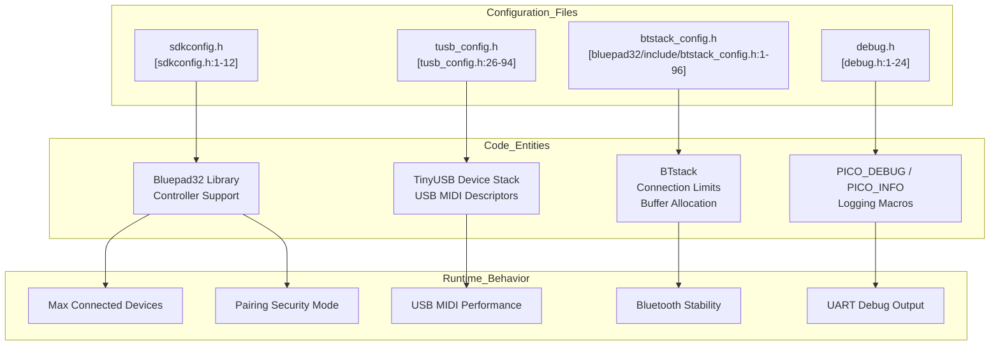
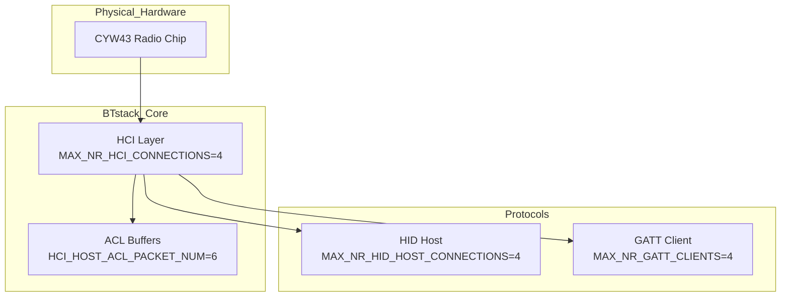

# Configuration Reference

> **Relevant source files**
> * [CMakeLists.txt](https://github.com/Jus-Be/orinayo-pico/blob/6dde5a75/CMakeLists.txt)
> * [bluepad32/include/btstack_config.h](https://github.com/Jus-Be/orinayo-pico/blob/6dde5a75/bluepad32/include/btstack_config.h)
> * [btstack_config.h](https://github.com/Jus-Be/orinayo-pico/blob/6dde5a75/btstack_config.h)
> * [debug.h](https://github.com/Jus-Be/orinayo-pico/blob/6dde5a75/debug.h)
> * [pico_bluetooth.h](https://github.com/Jus-Be/orinayo-pico/blob/6dde5a75/pico_bluetooth.h)
> * [sdkconfig.h](https://github.com/Jus-Be/orinayo-pico/blob/6dde5a75/sdkconfig.h)
> * [seqlock.h](https://github.com/Jus-Be/orinayo-pico/blob/6dde5a75/seqlock.h)
> * [tusb_config.h](https://github.com/Jus-Be/orinayo-pico/blob/6dde5a75/tusb_config.h)
> * [usb_descriptors.c](https://github.com/Jus-Be/orinayo-pico/blob/6dde5a75/usb_descriptors.c)

This page provides a comprehensive reference for all configuration macros and build settings in the Orinayo system. These configurations control Bluetooth behavior, USB MIDI functionality, memory allocation, and build options.

For information about runtime operational modes selected via controller input, see [Operational Modes](./4.4-operational-modes.md). For hardware setup and connection options, see [Hardware Requirements](./2.1-hardware-requirements.md). For build instructions, see [Building and Flashing](./2.2-building-and-flashing.md).

## Configuration File Overview

The Orinayo system uses multiple configuration files organized by subsystem. The following diagram shows how each configuration file controls different aspects of the system:

Title: Configuration File to System Mapping

```mermaid
flowchart TD

SDKCONFIG["sdkconfig.h<br>[sdkconfig.h:1-12]"]
TUSBCONFIG["tusb_config.h<br>[tusb_config.h:26-94]"]
BTSTACKCONFIG["btstack_config.h<br>[bluepad32/include/btstack_config.h:1-96]"]
DEBUGCONFIG["debug.h<br>[debug.h:1-24]"]
BP32["Bluepad32 Library<br>Controller Support"]
TUSB["TinyUSB Device Stack<br>USB MIDI Descriptors"]
BTSTACK["BTstack<br>Connection Limits<br>Buffer Allocation"]
LOGGING["PICO_DEBUG / PICO_INFO<br>Logging Macros"]
DEVICES["Max Connected Devices"]
SECURITY["Pairing Security Mode"]
USBMIDI["USB MIDI Performance"]
BTCONN["Bluetooth Stability"]
LOGOUT["UART Debug Output"]

SDKCONFIG --> BP32
TUSBCONFIG --> TUSB
BTSTACKCONFIG --> BTSTACK
DEBUGCONFIG --> LOGGING
BP32 --> DEVICES
BP32 --> SECURITY
TUSB --> USBMIDI
BTSTACK --> BTCONN
LOGGING --> LOGOUT

subgraph Runtime_Behavior ["Runtime_Behavior"]
    DEVICES
    SECURITY
    USBMIDI
    BTCONN
    LOGOUT
end

subgraph Code_Entities ["Code_Entities"]
    BP32
    TUSB
    BTSTACK
    LOGGING
end

subgraph Configuration_Files ["Configuration_Files"]
    SDKCONFIG
    TUSBCONFIG
    BTSTACKCONFIG
    DEBUGCONFIG
end
```

**Sources:** [sdkconfig.h L1-L12](https://github.com/Jus-Be/orinayo-pico/blob/6dde5a75/sdkconfig.h#L1-L12)

 [tusb_config.h L26-L94](https://github.com/Jus-Be/orinayo-pico/blob/6dde5a75/tusb_config.h#L26-L94)

 [bluepad32/include/btstack_config.h L1-L96](https://github.com/Jus-Be/orinayo-pico/blob/6dde5a75/bluepad32/include/btstack_config.h#L1-L96)

 [debug.h L1-L24](https://github.com/Jus-Be/orinayo-pico/blob/6dde5a75/debug.h#L1-L24)

## Bluepad32 Configuration (sdkconfig.h)

The [sdkconfig.h L1-L12](https://github.com/Jus-Be/orinayo-pico/blob/6dde5a75/sdkconfig.h#L1-L12)

 file configures the Bluepad32 controller library. This file controls the maximum number of simultaneous Bluetooth connections, security requirements, and logging verbosity.

### Configuration Macros

| Macro | Default Value | Valid Range | Description |
| --- | --- | --- | --- |
| `CONFIG_BLUEPAD32_PLATFORM_CUSTOM` | Defined | - | Enables custom platform implementation (Pico W) [sdkconfig.h L4](https://github.com/Jus-Be/orinayo-pico/blob/6dde5a75/sdkconfig.h#L4-L4) |
| `CONFIG_TARGET_PICO_W` | Defined | - | Specifies target hardware is Raspberry Pi Pico W [sdkconfig.h L5](https://github.com/Jus-Be/orinayo-pico/blob/6dde5a75/sdkconfig.h#L5-L5) |
| `CONFIG_BLUEPAD32_LOG_LEVEL` | `0` | 0-4 | Log verbosity: 0=INFO, 1=WARN, 2=ERROR [sdkconfig.h L6](https://github.com/Jus-Be/orinayo-pico/blob/6dde5a75/sdkconfig.h#L6-L6) |
| `CONFIG_BLUEPAD32_MAX_DEVICES` | `1` | 1-4 | Maximum simultaneous Bluetooth devices [sdkconfig.h L8](https://github.com/Jus-Be/orinayo-pico/blob/6dde5a75/sdkconfig.h#L8-L8) |
| `CONFIG_BLUEPAD32_MAX_ALLOWLIST` | `1` | 0-16 | Maximum devices in pairing allowlist [sdkconfig.h L9](https://github.com/Jus-Be/orinayo-pico/blob/6dde5a75/sdkconfig.h#L9-L9) |
| `CONFIG_BLUEPAD32_GAP_SECURITY` | `1` | 0-3 | Security mode: 1=Encryption [sdkconfig.h L10](https://github.com/Jus-Be/orinayo-pico/blob/6dde5a75/sdkconfig.h#L10-L10) |
| `CONFIG_BLUEPAD32_ENABLE_BLE_BY_DEFAULT` | `1` | 0-1 | Enable BLE scanning on startup [sdkconfig.h L11](https://github.com/Jus-Be/orinayo-pico/blob/6dde5a75/sdkconfig.h#L11-L11) |

### Usage Guidelines

**Increasing MAX_DEVICES**: The default value of `1` [sdkconfig.h L8](https://github.com/Jus-Be/orinayo-pico/blob/6dde5a75/sdkconfig.h#L8-L8)

 is optimized for single-controller use cases. Increasing this requires corresponding changes in [bluepad32/include/btstack_config.h L47](https://github.com/Jus-Be/orinayo-pico/blob/6dde5a75/bluepad32/include/btstack_config.h#L47-L47)

 (`MAX_NR_HCI_CONNECTIONS`) to allocate sufficient connection slots.

**Security Levels**: The default `GAP_SECURITY=1` [sdkconfig.h L10](https://github.com/Jus-Be/orinayo-pico/blob/6dde5a75/sdkconfig.h#L10-L10)

 enables encryption. For devices requiring stronger authentication, increase to `2` or `3`.

**BLE Mode**: The system requires `ENABLE_BLE_BY_DEFAULT=1` [sdkconfig.h L11](https://github.com/Jus-Be/orinayo-pico/blob/6dde5a75/sdkconfig.h#L11-L11)

 to support Liberlive and Sonic Master MIDI devices.

**Sources:** [sdkconfig.h L1-L12](https://github.com/Jus-Be/orinayo-pico/blob/6dde5a75/sdkconfig.h#L1-L12)

## TinyUSB Configuration (tusb_config.h)

The [tusb_config.h L26-L94](https://github.com/Jus-Be/orinayo-pico/blob/6dde5a75/tusb_config.h#L26-L94)

 file configures the TinyUSB device stack for USB MIDI output.

### Core Configuration

| Macro | Default Value | Description |
| --- | --- | --- |
| `CFG_TUSB_OS` | `OPT_OS_PICO` | Operating system integration layer [tusb_config.h L45](https://github.com/Jus-Be/orinayo-pico/blob/6dde5a75/tusb_config.h#L45-L45) |
| `CFG_TUD_ENDPOINT0_SIZE` | `64` | Control endpoint max packet size [tusb_config.h L84](https://github.com/Jus-Be/orinayo-pico/blob/6dde5a75/tusb_config.h#L84-L84) |
| `CFG_TUSB_MEM_ALIGN` | `aligned(4)` | Memory alignment for DMA transfers [tusb_config.h L69](https://github.com/Jus-Be/orinayo-pico/blob/6dde5a75/tusb_config.h#L69-L69) |
| `BOARD_TUD_RHPORT` | `0` | Root hub port for native USB device (Pico USB connector) [tusb_config.h L41](https://github.com/Jus-Be/orinayo-pico/blob/6dde5a75/tusb_config.h#L41-L41) |
| `BOARD_TUH_RHPORT` | `1` | Root hub port for PIO USB host (external D+/D- wiring) [tusb_config.h L42](https://github.com/Jus-Be/orinayo-pico/blob/6dde5a75/tusb_config.h#L42-L42) |
| `CFG_TUSB_RHPORT0_MODE` | `OPT_MODE_DEVICE` | Configures port 0 as USB device [tusb_config.h L43](https://github.com/Jus-Be/orinayo-pico/blob/6dde5a75/tusb_config.h#L43-L43) |
| `CFG_TUSB_RHPORT1_MODE` | `OPT_MODE_HOST` | Configures port 1 as USB host [tusb_config.h L44](https://github.com/Jus-Be/orinayo-pico/blob/6dde5a75/tusb_config.h#L44-L44) |
| `CFG_TUH_RPI_PIO_USB_PORT` | `1` | Specifies PIO USB host port [tusb_config.h L46](https://github.com/Jus-Be/orinayo-pico/blob/6dde5a75/tusb_config.h#L46-L46) |
| `CFG_TUD_RHPORT` | `0` | Specifies TinyUSB device root hub port [tusb_config.h L47](https://github.com/Jus-Be/orinayo-pico/blob/6dde5a75/tusb_config.h#L47-L47) |
| `CFG_TUD_ENABLED` | `1` | Enables TinyUSB device stack [tusb_config.h L50](https://github.com/Jus-Be/orinayo-pico/blob/6dde5a75/tusb_config.h#L50-L50) |
| `CFG_TUH_ENABLED` | `1` | Enables TinyUSB host stack [tusb_config.h L51](https://github.com/Jus-Be/orinayo-pico/blob/6dde5a75/tusb_config.h#L51-L51) |

### Device Class Configuration

| Class | Macro | Enabled | Purpose |
| --- | --- | --- | --- |
| CDC (Serial) | `CFG_TUD_CDC` | `0` | Disabled [tusb_config.h L88](https://github.com/Jus-Be/orinayo-pico/blob/6dde5a75/tusb_config.h#L88-L88) |
| MSC (Mass Storage) | `CFG_TUD_MSC` | `0` | Disabled [tusb_config.h L89](https://github.com/Jus-Be/orinayo-pico/blob/6dde5a75/tusb_config.h#L89-L89) |
| HID | `CFG_TUD_HID` | `0` | Disabled [tusb_config.h L90](https://github.com/Jus-Be/orinayo-pico/blob/6dde5a75/tusb_config.h#L90-L90) |
| **MIDI** | `CFG_TUD_MIDI` | `1` | **Enabled - Primary function** [tusb_config.h L91](https://github.com/Jus-Be/orinayo-pico/blob/6dde5a75/tusb_config.h#L91-L91) |
| Vendor | `CFG_TUD_VENDOR` | `0` | Disabled [tusb_config.h L92](https://github.com/Jus-Be/orinayo-pico/blob/6dde5a75/tusb_config.h#L92-L92) |

### MIDI Buffer Configuration

| Macro | Default Value | High-Speed Value | Description |
| --- | --- | --- | --- |
| `CFG_TUD_MIDI_RX_BUFSIZE` | `64` | `512` | USB receive buffer [tusb_config.h L95](https://github.com/Jus-Be/orinayo-pico/blob/6dde5a75/tusb_config.h#L95-L95) |
| `CFG_TUD_MIDI_TX_BUFSIZE` | `64` | `512` | USB transmit buffer [tusb_config.h L96](https://github.com/Jus-Be/orinayo-pico/blob/6dde5a75/tusb_config.h#L96-L96) |

The buffer sizes automatically scale based on `TUD_OPT_HIGH_SPEED` [tusb_config.h L95-L96](https://github.com/Jus-Be/orinayo-pico/blob/6dde5a75/tusb_config.h#L95-L96)

### Host Configuration (PIO USB)

| Macro | Default Value | Description |
| --- | --- | --- |
| `CFG_TUH_RPI_PIO_USB` | `1` | Enables PIO-USB as host controller [tusb_config.h L103](https://github.com/Jus-Be/orinayo-pico/blob/6dde5a75/tusb_config.h#L103-L103) |
| `CFG_TUH_ENUMERATION_BUFSIZE` | `1024` | Buffer size for host enumeration [tusb_config.h L106](https://github.com/Jus-Be/orinayo-pico/blob/6dde5a75/tusb_config.h#L106-L106) |
| `CFG_TUH_HUB` | `1` | Enables USB hub support for host [tusb_config.h L109](https://github.com/Jus-Be/orinayo-pico/blob/6dde5a75/tusb_config.h#L109-L109) |
| `CFG_TUH_DEVICE_MAX` | `(3 * CFG_TUH_HUB + 1)` | Maximum number of host devices [tusb_config.h L110](https://github.com/Jus-Be/orinayo-pico/blob/6dde5a75/tusb_config.h#L110-L110) |
| `CFG_TUH_MIDI` | `1` | Enables USB MIDI host class [tusb_config.h L111](https://github.com/Jus-Be/orinayo-pico/blob/6dde5a75/tusb_config.h#L111-L111) |
| `CFG_TUH_MIDI_STREAM_API` | `1` | Enables MIDI stream API for host [tusb_config.h L112](https://github.com/Jus-Be/orinayo-pico/blob/6dde5a75/tusb_config.h#L112-L112) |
| `CFG_TUH_MIDI_RX_BUFSIZE` | `TUH_EPSIZE_BULK_MAX` | Host MIDI receive buffer size [tusb_config.h L116](https://github.com/Jus-Be/orinayo-pico/blob/6dde5a75/tusb_config.h#L116-L116) |
| `CFG_TUH_MIDI_TX_BUFSIZE` | `TUH_EPSIZE_BULK_MAX` | Host MIDI transmit buffer size [tusb_config.h L117](https://github.com/Jus-Be/orinayo-pico/blob/6dde5a75/tusb_config.h#L117-L117) |

**Sources:** [tusb_config.h L26-L94](https://github.com/Jus-Be/orinayo-pico/blob/6dde5a75/tusb_config.h#L26-L94)

## BTstack Configuration (btstack_config.h)

The [bluepad32/include/btstack_config.h L1-L96](https://github.com/Jus-Be/orinayo-pico/blob/6dde5a75/bluepad32/include/btstack_config.h#L1-L96)

 file defines the resource limits and features for the Bluetooth stack.

### Resource Limits

| Macro | Default | Description |
| --- | --- | --- |
| `MAX_NR_AVDTP_CONNECTIONS` | `1` | Max AVDTP connections [bluepad32/include/btstack_config.h L40](https://github.com/Jus-Be/orinayo-pico/blob/6dde5a75/bluepad32/include/btstack_config.h#L40-L40) |
| `MAX_NR_AVDTP_STREAM_ENDPOINTS` | `1` | Max AVDTP stream endpoints [bluepad32/include/btstack_config.h L41](https://github.com/Jus-Be/orinayo-pico/blob/6dde5a75/bluepad32/include/btstack_config.h#L41-L41) |
| `MAX_NR_AVRCP_CONNECTIONS` | `2` | Max AVRCP connections [bluepad32/include/btstack_config.h L42](https://github.com/Jus-Be/orinayo-pico/blob/6dde5a75/bluepad32/include/btstack_config.h#L42-L42) |
| `MAX_NR_BNEP_CHANNELS` | `1` | Max BNEP channels [bluepad32/include/btstack_config.h L43](https://github.com/Jus-Be/orinayo-pico/blob/6dde5a75/bluepad32/include/btstack_config.h#L43-L43) |
| `MAX_NR_BNEP_SERVICES` | `1` | Max BNEP services [bluepad32/include/btstack_config.h L44](https://github.com/Jus-Be/orinayo-pico/blob/6dde5a75/bluepad32/include/btstack_config.h#L44-L44) |
| `MAX_NR_BTSTACK_LINK_KEY_DB_MEMORY_ENTRIES` | `2` | Max link key DB entries [bluepad32/include/btstack_config.h L45](https://github.com/Jus-Be/orinayo-pico/blob/6dde5a75/bluepad32/include/btstack_config.h#L45-L45) |
| `MAX_NR_GATT_CLIENTS` | `4` | GATT client instances for BLE [bluepad32/include/btstack_config.h L46](https://github.com/Jus-Be/orinayo-pico/blob/6dde5a75/bluepad32/include/btstack_config.h#L46-L46) |
| `MAX_NR_HCI_CONNECTIONS` | `4` | Total Bluetooth connections [bluepad32/include/btstack_config.h L47](https://github.com/Jus-Be/orinayo-pico/blob/6dde5a75/bluepad32/include/btstack_config.h#L47-L47) |
| `MAX_NR_HID_HOST_CONNECTIONS` | `4` | Classic HID controller slots [bluepad32/include/btstack_config.h L48](https://github.com/Jus-Be/orinayo-pico/blob/6dde5a75/bluepad32/include/btstack_config.h#L48-L48) |
| `MAX_NR_HIDS_CLIENTS` | `4` | Max HIDS clients [bluepad32/include/btstack_config.h L49](https://github.com/Jus-Be/orinayo-pico/blob/6dde5a75/bluepad32/include/btstack_config.h#L49-L49) |
| `MAX_NR_HFP_CONNECTIONS` | `1` | Max HFP connections [bluepad32/include/btstack_config.h L50](https://github.com/Jus-Be/orinayo-pico/blob/6dde5a75/bluepad32/include/btstack_config.h#L50-L50) |
| `MAX_NR_L2CAP_CHANNELS` | `6` | L2CAP logical channels [bluepad32/include/btstack_config.h L51](https://github.com/Jus-Be/orinayo-pico/blob/6dde5a75/bluepad32/include/btstack_config.h#L51-L51) |
| `MAX_NR_L2CAP_SERVICES` | `5` | Max L2CAP services [bluepad32/include/btstack_config.h L52](https://github.com/Jus-Be/orinayo-pico/blob/6dde5a75/bluepad32/include/btstack_config.h#L52-L52) |
| `MAX_NR_RFCOMM_CHANNELS` | `1` | Max RFCOMM channels [bluepad32/include/btstack_config.h L53](https://github.com/Jus-Be/orinayo-pico/blob/6dde5a75/bluepad32/include/btstack_config.h#L53-L53) |
| `MAX_NR_RFCOMM_MULTIPLEXERS` | `1` | Max RFCOMM multiplexers [bluepad32/include/btstack_config.h L54](https://github.com/Jus-Be/orinayo-pico/blob/6dde5a75/bluepad32/include/btstack_config.h#L54-L54) |
| `MAX_NR_RFCOMM_SERVICES` | `1` | Max RFCOMM services [bluepad32/include/btstack_config.h L55](https://github.com/Jus-Be/orinayo-pico/blob/6dde5a75/bluepad32/include/btstack_config.h#L55-L55) |
| `MAX_NR_SERVICE_RECORD_ITEMS` | `4` | Max service record items [bluepad32/include/btstack_config.h L56](https://github.com/Jus-Be/orinayo-pico/blob/6dde5a75/bluepad32/include/btstack_config.h#L56-L56) |
| `MAX_NR_SM_LOOKUP_ENTRIES` | `3` | Max SM lookup entries [bluepad32/include/btstack_config.h L57](https://github.com/Jus-Be/orinayo-pico/blob/6dde5a75/bluepad32/include/btstack_config.h#L57-L57) |
| `MAX_NR_WHITELIST_ENTRIES` | `0` | Max whitelist entries [bluepad32/include/btstack_config.h L58](https://github.com/Jus-Be/orinayo-pico/blob/6dde5a75/bluepad32/include/btstack_config.h#L58-L58) |
| `MAX_NR_LE_DEVICE_DB_ENTRIES` | `16` | Max LE device DB entries [bluepad32/include/btstack_config.h L59](https://github.com/Jus-Be/orinayo-pico/blob/6dde5a75/bluepad32/include/btstack_config.h#L59-L59) |
| `NVM_NUM_DEVICE_DB_ENTRIES` | `16` | Number of device DB entries for NVM [bluepad32/include/btstack_config.h L73](https://github.com/Jus-Be/orinayo-pico/blob/6dde5a75/bluepad32/include/btstack_config.h#L73-L73) |
| `NVM_NUM_LINK_KEYS` | `16` | Number of link keys for NVM [bluepad32/include/btstack_config.h L74](https://github.com/Jus-Be/orinayo-pico/blob/6dde5a75/bluepad32/include/btstack_config.h#L74-L74) |
| `MAX_ATT_DB_SIZE` | `512` | Fixed-size ATT DB [bluepad32/include/btstack_config.h L77](https://github.com/Jus-Be/orinayo-pico/blob/6dde5a75/bluepad32/include/btstack_config.h#L77-L77) |

### CYW43-Specific Configuration

These settings prevent shared bus overrun on the Pico W [bluepad32/include/btstack_config.h L61-L70](https://github.com/Jus-Be/orinayo-pico/blob/6dde5a75/bluepad32/include/btstack_config.h#L61-L70)

:

| Macro | Value | Purpose |
| --- | --- | --- |
| `MAX_NR_CONTROLLER_ACL_BUFFERS` | `3` | Limit controller buffers [bluepad32/include/btstack_config.h L62](https://github.com/Jus-Be/orinayo-pico/blob/6dde5a75/bluepad32/include/btstack_config.h#L62-L62) |
| `MAX_NR_CONTROLLER_SCO_PACKETS` | `3` | Limit SCO packets [bluepad32/include/btstack_config.h L63](https://github.com/Jus-Be/orinayo-pico/blob/6dde5a75/bluepad32/include/btstack_config.h#L63-L63) |
| `ENABLE_HCI_CONTROLLER_TO_HOST_FLOW_CONTROL` | Defined | Enables backpressure [bluepad32/include/btstack_config.h L66](https://github.com/Jus-Be/orinayo-pico/blob/6dde5a75/bluepad32/include/btstack_config.h#L66-L66) |
| `HCI_HOST_ACL_PACKET_LEN` | `1024` | Host ACL packet length [bluepad32/include/btstack_config.h L67](https://github.com/Jus-Be/orinayo-pico/blob/6dde5a75/bluepad32/include/btstack_config.h#L67-L67) |
| `HCI_HOST_ACL_PACKET_NUM` | `6` | Flow control buffer count [bluepad32/include/btstack_config.h L68](https://github.com/Jus-Be/orinayo-pico/blob/6dde5a75/bluepad32/include/btstack_config.h#L68-L68) |
| `HCI_HOST_SCO_PACKET_LEN` | `120` | Host SCO packet length [bluepad32/include/btstack_config.h L69](https://github.com/Jus-Be/orinayo-pico/blob/6dde5a75/bluepad32/include/btstack_config.h#L69-L69) |
| `HCI_HOST_SCO_PACKET_NUM` | `3` | Host SCO packet number [bluepad32/include/btstack_config.h L70](https://github.com/Jus-Be/orinayo-pico/blob/6dde5a75/bluepad32/include/btstack_config.h#L70-L70) |

Title: BTstack Resource Interaction

```mermaid
flowchart TD

CYW43["CYW43 Radio Chip"]
HCI["HCI Layer<br>MAX_NR_HCI_CONNECTIONS=4"]
ACL["ACL Buffers<br>HCI_HOST_ACL_PACKET_NUM=6"]
HID["HID Host<br>MAX_NR_HID_HOST_CONNECTIONS=4"]
GATT["GATT Client<br>MAX_NR_GATT_CLIENTS=4"]

CYW43 --> HCI
HCI --> HID
HCI --> GATT

subgraph Protocols ["Protocols"]
    HID
    GATT
end

subgraph BTstack_Core ["BTstack_Core"]
    HCI
    ACL
    HCI --> ACL
end

subgraph Physical_Hardware ["Physical_Hardware"]
    CYW43
end
```

**Sources:** [bluepad32/include/btstack_config.h L1-L96](https://github.com/Jus-Be/orinayo-pico/blob/6dde5a75/bluepad32/include/btstack_config.h#L1-L96)

## Debug and Infrastructure Configuration

### Debug Macros (debug.h)

The system uses a custom logging abstraction in [debug.h L1-L24](https://github.com/Jus-Be/orinayo-pico/blob/6dde5a75/debug.h#L1-L24)

| Macro | Condition | Effect |
| --- | --- | --- |
| `PICO_DEBUG_MODE` | Default `1` | Enables/Disables debug output [debug.h L8](https://github.com/Jus-Be/orinayo-pico/blob/6dde5a75/debug.h#L8-L8) |
| `PICO_DEBUG(...)` | `IS_PICO_DEBUG` | Prints `[DEBUG]` to stdout [debug.h L15](https://github.com/Jus-Be/orinayo-pico/blob/6dde5a75/debug.h#L15-L15) |
| `PICO_INFO(...)` | `IS_PICO_DEBUG` | Prints `[INFO]` to stdout [debug.h L16](https://github.com/Jus-Be/orinayo-pico/blob/6dde5a75/debug.h#L16-L16) |
| `PICO_ERROR(...)` | Always | Prints `[ERROR]` to stdout [debug.h L17](https://github.com/Jus-Be/orinayo-pico/blob/6dde5a75/debug.h#L17-L17) |

### Seqlock Infrastructure (seqlock.h)

The [seqlock.h L1-L105](https://github.com/Jus-Be/orinayo-pico/blob/6dde5a75/seqlock.h#L1-L105)

 file provides a lightweight single-writer / multiple-reader lock.

* **Writer**: Uses `seqlock_write_begin` [seqlock.h L40](https://github.com/Jus-Be/orinayo-pico/blob/6dde5a75/seqlock.h#L40-L40)  and `seqlock_write_end` [seqlock.h L45](https://github.com/Jus-Be/orinayo-pico/blob/6dde5a75/seqlock.h#L45-L45)
* **Reader**: Uses `SEQLOCK_TRY_READ` [seqlock.h L59](https://github.com/Jus-Be/orinayo-pico/blob/6dde5a75/seqlock.h#L59-L59)  macro to obtain a consistent snapshot of shared data (e.g., gamepad state).

**Sources:** [debug.h L1-L24](https://github.com/Jus-Be/orinayo-pico/blob/6dde5a75/debug.h#L1-L24)

 [seqlock.h L1-L105](https://github.com/Jus-Be/orinayo-pico/blob/6dde5a75/seqlock.h#L1-L105)

## Configuration Validation Rules

1. **Memory Alignment**: `CFG_TUSB_MEM_ALIGN` must be `aligned(4)` for RP2040 DMA [tusb_config.h L69](https://github.com/Jus-Be/orinayo-pico/blob/6dde5a75/tusb_config.h#L69-L69)
2. **Bluetooth Coexistence**: `ENABLE_BLE` and `ENABLE_CLASSIC` must both be defined for Bluepad32 [bluepad32/include/btstack_config.h L13-L30](https://github.com/Jus-Be/orinayo-pico/blob/6dde5a75/bluepad32/include/btstack_config.h#L13-L30)
3. **Data Integrity**: Seqlock-protected structures should be 32-byte aligned for cache efficiency [seqlock.h L87](https://github.com/Jus-Be/orinayo-pico/blob/6dde5a75/seqlock.h#L87-L87)

**Sources:** [tusb_config.h L69](https://github.com/Jus-Be/orinayo-pico/blob/6dde5a75/tusb_config.h#L69-L69)

 [bluepad32/include/btstack_config.h L13-L30](https://github.com/Jus-Be/orinayo-pico/blob/6dde5a75/bluepad32/include/btstack_config.h#L13-L30)

 [seqlock.h L87](https://github.com/Jus-Be/orinayo-pico/blob/6dde5a75/seqlock.h#L87-L87)