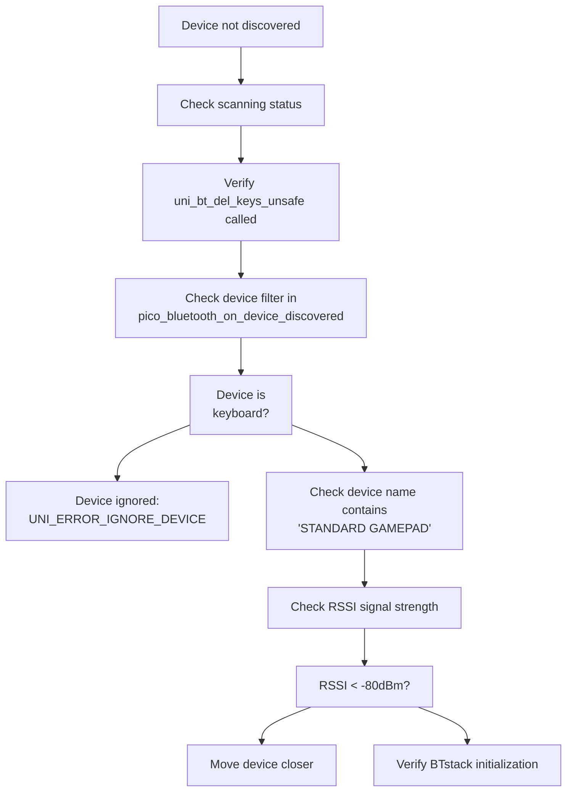
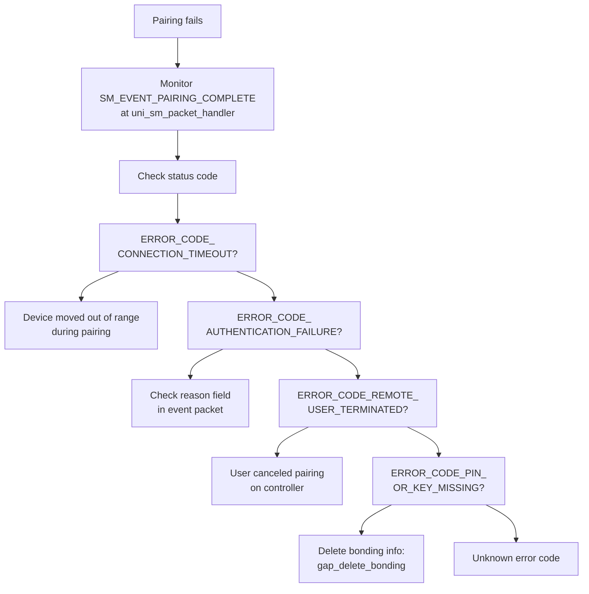
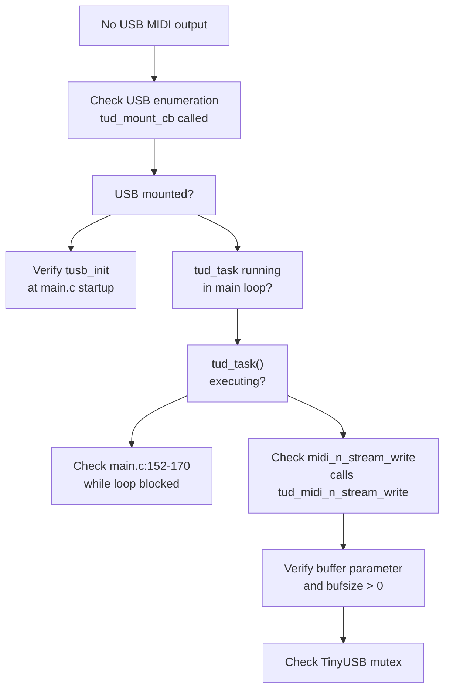
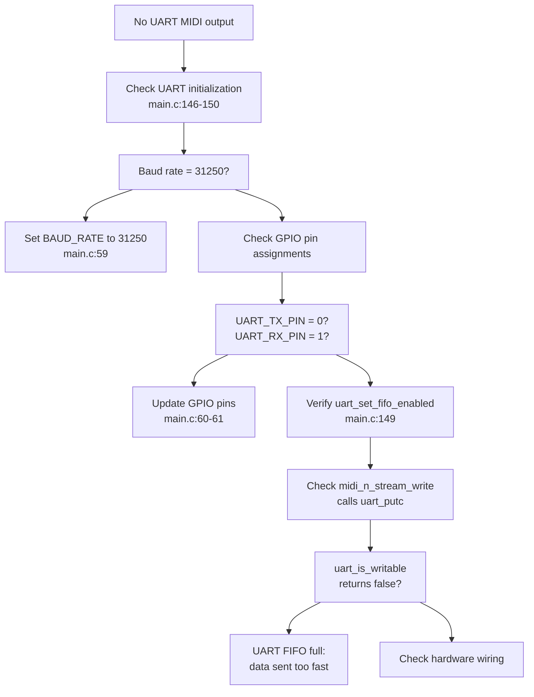
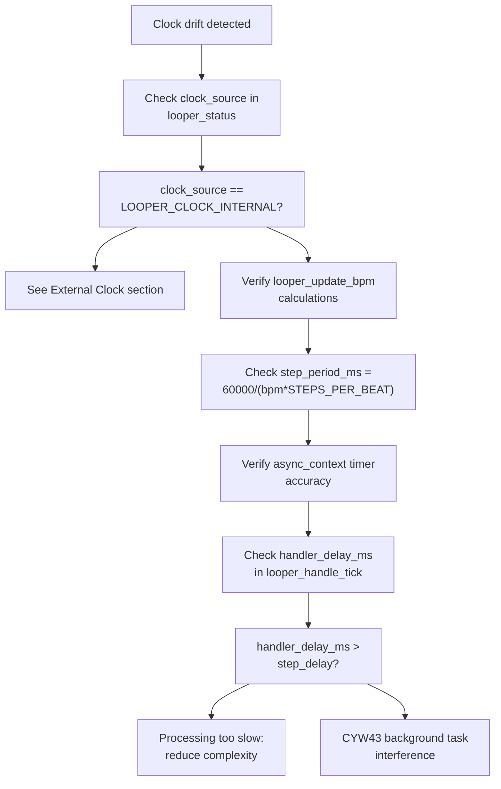
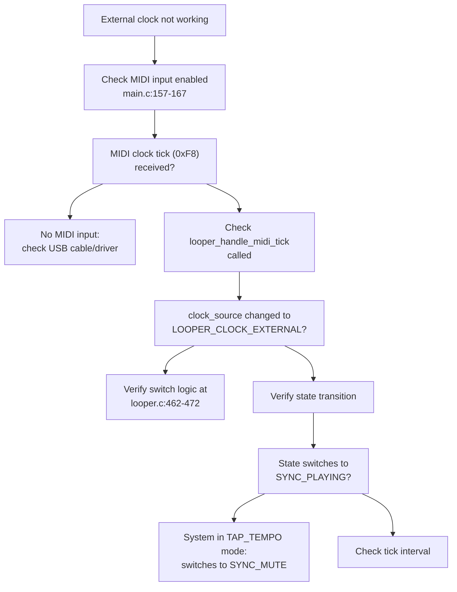
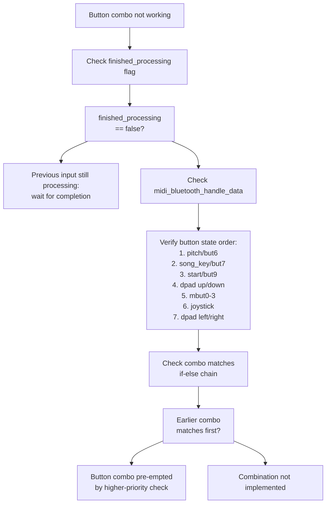
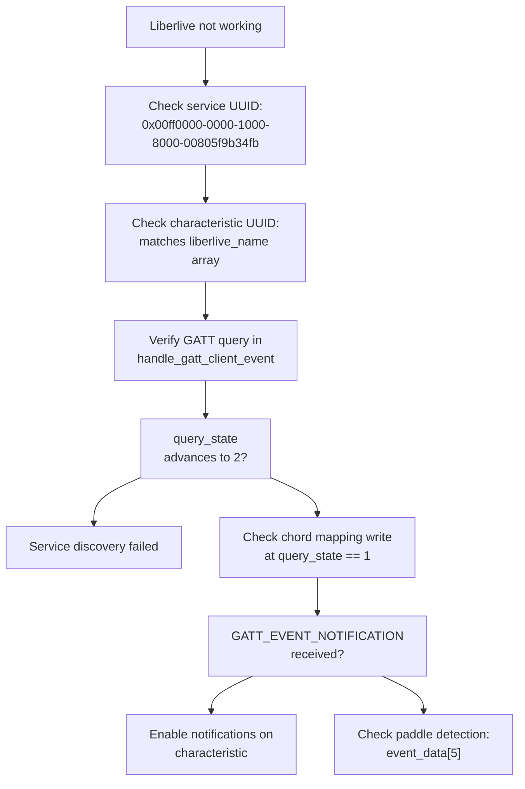

# Troubleshooting

> **Relevant source files**
> * [bluepad32/bt/uni_bt_le.c](https://github.com/Jus-Be/orinayo-pico/blob/122fa496/bluepad32/bt/uni_bt_le.c)
> * [looper.c](https://github.com/Jus-Be/orinayo-pico/blob/122fa496/looper.c)
> * [main.c](https://github.com/Jus-Be/orinayo-pico/blob/122fa496/main.c)
> * [pico_bluetooth.c](https://github.com/Jus-Be/orinayo-pico/blob/122fa496/pico_bluetooth.c)

This page provides systematic troubleshooting procedures for diagnosing and resolving common issues with the Orinayo Bluetooth-to-MIDI gateway system. It covers connection failures, MIDI output problems, timing issues, and performance degradation.

For general system configuration, see [Configuration](./2.3-configuration.md). For detailed information about clock synchronization behavior, see [Clock Synchronization](./5.3-clock-synchronization.md). For button input handling, see [Button Input](./7.1-button-input.md).

---

## 1. Bluetooth Connection Issues

### 1.1 Device Not Discovered

**Symptoms**: Bluetooth controller is not found during scanning; onboard LED does not respond to controller connection.



**Diagnostic Steps**:

1. **Verify scanning is active**: Check that `uni_bt_start_scanning_and_autoconnect_safe()` is called in [`pico_bluetooth.c L213](https://github.com/Jus-Be/orinayo-pico/blob/122fa496/`pico_bluetooth.c#L213-L213)  The function `is_scanning` flag should be true.
2. **Check device filters**: The system filters out keyboards at [`pico_bluetooth.c L237-L240](https://github.com/Jus-Be/orinayo-pico/blob/122fa496/`pico_bluetooth.c#L237-L240)  If your device advertises as `UNI_BT_COD_MINOR_KEYBOARD`, it will be rejected with `UNI_ERROR_IGNORE_DEVICE`.
3. **Verify Bluetooth keys cleared**: At startup, [`pico_bluetooth.c L210](https://github.com/Jus-Be/orinayo-pico/blob/122fa496/`pico_bluetooth.c#L210-L210)  calls `uni_bt_del_keys_unsafe()` to delete stored pairing keys. If this fails, old bonding information may prevent new connections.
4. **Check RSSI signal strength**: The discovery callback at [`pico_bluetooth.c L220-L242](https://github.com/Jus-Be/orinayo-pico/blob/122fa496/`pico_bluetooth.c#L220-L242)  receives RSSI (Received Signal Strength Indicator). Values below -80 dBm indicate weak signal.

**Resolution**:

| Issue | Code Location | Solution |
| --- | --- | --- |
| Keyboard filter blocking device | [`pico_bluetooth.c L237-L240](https://github.com/Jus-Be/orinayo-pico/blob/122fa496/`pico_bluetooth.c#L237-L240) | Remove or modify `UNI_BT_COD_MINOR_KEYBOARD` check |
| Scanning not started | [`pico_bluetooth.c L213](https://github.com/Jus-Be/orinayo-pico/blob/122fa496/`pico_bluetooth.c#L213-L213) | Ensure `uni_bt_start_scanning_and_autoconnect_safe()` executes |
| Old pairing data | [`pico_bluetooth.c L210](https://github.com/Jus-Be/orinayo-pico/blob/122fa496/`pico_bluetooth.c#L210-L210) | Verify `uni_bt_del_keys_unsafe()` completes successfully |
| Weak signal | Hardware | Position devices within 10 meters, remove obstacles |

**Sources**: [`pico_bluetooth.c L200-L243](https://github.com/Jus-Be/orinayo-pico/blob/122fa496/`pico_bluetooth.c#L200-L243)

---

### 1.2 Pairing Failures

**Symptoms**: Device discovered but pairing fails; `SM_EVENT_PAIRING_COMPLETE` reports error status.



**Diagnostic Steps**:

1. **Monitor Security Manager events**: The `uni_sm_packet_handler()` at [`uni_bt_le.c L632-L768](https://github.com/Jus-Be/orinayo-pico/blob/122fa496/`uni_bt_le.c#L632-L768)  processes all pairing events. Add debug logging to track: * `SM_EVENT_PAIRING_STARTED` at [`uni_bt_le.c L674](https://github.com/Jus-Be/orinayo-pico/blob/122fa496/`uni_bt_le.c#L674-L674) * `SM_EVENT_PAIRING_COMPLETE` at [`uni_bt_le.c L715-L749](https://github.com/Jus-Be/orinayo-pico/blob/122fa496/`uni_bt_le.c#L715-L749) * Status codes from `sm_event_pairing_complete_get_status(packet)`
2. **Check authentication method**: The system uses "Just Works" pairing at [`uni_bt_le.c L650-L653](https://github.com/Jus-Be/orinayo-pico/blob/122fa496/`uni_bt_le.c#L650-L653)  Some devices may require numeric comparison instead: * `SM_EVENT_JUST_WORKS_REQUEST` auto-confirms at line 652 * `SM_EVENT_NUMERIC_COMPARISON_REQUEST` at line 654-657
3. **Verify re-encryption handling**: For previously bonded devices, check `SM_EVENT_REENCRYPTION_COMPLETE` at [`uni_bt_le.c L687-L714](https://github.com/Jus-Be/orinayo-pico/blob/122fa496/`uni_bt_le.c#L687-L714) : * `ERROR_CODE_PIN_OR_KEY_MISSING` triggers bonding deletion at lines 702-709 * System automatically re-pairs after deleting stale bonds

**Resolution**:

| Error Code | Location | Action |
| --- | --- | --- |
| `ERROR_CODE_CONNECTION_TIMEOUT` | [`uni_bt_le.c L731](https://github.com/Jus-Be/orinayo-pico/blob/122fa496/`uni_bt_le.c#L731-L731) | Move device closer; retry pairing |
| `ERROR_CODE_AUTHENTICATION_FAILURE` | [`uni_bt_le.c L737-L738](https://github.com/Jus-Be/orinayo-pico/blob/122fa496/`uni_bt_le.c#L737-L738) | Check `sm_event_pairing_complete_get_reason(packet)` |
| `ERROR_CODE_PIN_OR_KEY_MISSING` | [`uni_bt_le.c L702-L709](https://github.com/Jus-Be/orinayo-pico/blob/122fa496/`uni_bt_le.c#L702-L709) | Delete bonding with `gap_delete_bonding()`; re-pair |
| `ERROR_CODE_REMOTE_USER_TERMINATED_CONNECTION` | [`uni_bt_le.c L734](https://github.com/Jus-Be/orinayo-pico/blob/122fa496/`uni_bt_le.c#L734-L734) | User canceled; retry pairing |

**Sources**: [`uni_bt_le.c L632-L768](https://github.com/Jus-Be/orinayo-pico/blob/122fa496/`uni_bt_le.c#L632-L768)

---

### 1.3 Connection Drops

**Symptoms**: Device connects successfully but disconnects shortly after; `pico_bluetooth_on_device_disconnected()` called unexpectedly.

**Diagnostic Checks**:

1. **Monitor disconnection events**: The callback at [`pico_bluetooth.c L254-L263](https://github.com/Jus-Be/orinayo-pico/blob/122fa496/`pico_bluetooth.c#L254-L263)  handles disconnections. When triggered: * `gamepad_guitar_connected` is set to `false` at line 255 * Scanning restarts automatically at line 259 * LED is turned on at line 261
2. **Check re-encryption status**: If disconnection occurs during re-encryption (external MIDI clock sync), examine [`uni_bt_le.c L687-L714](https://github.com/Jus-Be/orinayo-pico/blob/122fa496/`uni_bt_le.c#L687-L714) : * `ERROR_CODE_CONNECTION_TIMEOUT` at line 694 * `ERROR_CODE_REMOTE_USER_TERMINATED_CONNECTION` at line 698
3. **Verify HIDS client connection**: After pairing, the HIDS client must connect at [`uni_bt_le.c L360-L394](https://github.com/Jus-Be/orinayo-pico/blob/122fa496/`uni_bt_le.c#L360-L394)  Check for: * `GATTSERVICE_SUBEVENT_HID_SERVICE_CONNECTED` at line 360 * `ERROR_CODE_SUCCESS` at line 364 * `uni_hid_device_set_ready()` call at line 386

**Resolution**:

| Symptom | Code Reference | Fix |
| --- | --- | --- |
| Immediate disconnection after pairing | [`uni_bt_le.c L360-L394](https://github.com/Jus-Be/orinayo-pico/blob/122fa496/`uni_bt_le.c#L360-L394) | Verify GATT service discovery completes; check HID descriptor |
| Random disconnections during use | [`pico_bluetooth.c L276-L325](https://github.com/Jus-Be/orinayo-pico/blob/122fa496/`pico_bluetooth.c#L276-L325) | Check `finished_processing` flag at line 328; may indicate data processing bottleneck |
| Disconnection during mode switch | [`pico_bluetooth.c L601-L739](https://github.com/Jus-Be/orinayo-pico/blob/122fa496/`pico_bluetooth.c#L601-L739) | Complex button combination may cause processing delay; increase `finished_processing` guard scope |

**Sources**: [`pico_bluetooth.c L254-L263](https://github.com/Jus-Be/orinayo-pico/blob/122fa496/`pico_bluetooth.c#L254-L263)

 [`uni_bt_le.c L687-L714](https://github.com/Jus-Be/orinayo-pico/blob/122fa496/`uni_bt_le.c#L687-L714)

 [`uni_bt_le.c L360-L394](https://github.com/Jus-Be/orinayo-pico/blob/122fa496/`uni_bt_le.c#L360-L394)

---

## 2. MIDI Output Problems

### 2.1 No MIDI Data on USB

**Symptoms**: USB enumerates successfully but no MIDI data appears in DAW or MIDI monitor software.



**Diagnostic Steps**:

1. **Verify USB initialization**: At [`main.c L130](https://github.com/Jus-Be/orinayo-pico/blob/122fa496/`main.c#L130-L130)  `tusb_init()` must complete successfully before MIDI operations.
2. **Check USB mount status**: The callback `tud_mount_cb()` at [`main.c L180-L183](https://github.com/Jus-Be/orinayo-pico/blob/122fa496/`main.c#L180-L183)  sets LED to `true` when USB enumerates. If this never fires: * USB cable may be faulty * Host may not recognize device descriptor * Power delivery may be insufficient
3. **Verify tud_task() runs continuously**: The main loop at [`main.c L152-L170](https://github.com/Jus-Be/orinayo-pico/blob/122fa496/`main.c#L152-L170)  must call `tud_task()` at line 153 on every iteration. If blocked: * Check for infinite loops in async timer handlers * Verify `note_scheduler_dispatch_pending()` at line 169 completes quickly
4. **Check MIDI write function**: All MIDI output flows through `midi_n_stream_write()` at [`main.c L690-L697](https://github.com/Jus-Be/orinayo-pico/blob/122fa496/`main.c#L690-L697)  This function: * Calls `tud_midi_n_stream_write()` at line 691 (USB output) * Calls `uart_putc()` at line 695 (UART output) * If USB write fails, UART may still work

**Resolution**:

| Problem | Location | Solution |
| --- | --- | --- |
| `tusb_init()` fails | [`main.c L130](https://github.com/Jus-Be/orinayo-pico/blob/122fa496/`main.c#L130-L130) | Check `tusb_config.h` for correct USB descriptor configuration |
| `tud_mount_cb()` never fires | [`main.c L180-L183](https://github.com/Jus-Be/orinayo-pico/blob/122fa496/`main.c#L180-L183) | Verify USB cable; try different host port; check power supply (3.3V required) |
| `tud_task()` not called | [`main.c L153](https://github.com/Jus-Be/orinayo-pico/blob/122fa496/`main.c#L153-L153) | Ensure main loop not blocked by Bluetooth processing at line 134 |
| USB mutex contention | Note scheduler design | System uses two-stage note dispatch to avoid USB mutex locks in async context |

**Testing Procedure**:

```

```

**Sources**: [`main.c L125-L173](https://github.com/Jus-Be/orinayo-pico/blob/122fa496/`main.c#L125-L173)

 [`main.c L180-L204](https://github.com/Jus-Be/orinayo-pico/blob/122fa496/`main.c#L180-L204)

 [`main.c L690-L697](https://github.com/Jus-Be/orinayo-pico/blob/122fa496/`main.c#L690-L697)

---

### 2.2 No MIDI Data on UART

**Symptoms**: UART configured but hardware MIDI device receives no data; LED blinks correctly indicating system activity.



**Diagnostic Steps**:

1. **Verify UART initialization**: At [`main.c L146-L150](https://github.com/Jus-Be/orinayo-pico/blob/122fa496/`main.c#L146-L150)  the UART must be configured with: * Baud rate: `31250` (standard MIDI baud rate) at line 59 * TX pin: GPIO 0 at line 60 * RX pin: GPIO 1 at line 61 * FIFO enabled at line 149 * CRLF translation disabled at line 150
2. **Check UART write mechanism**: In `midi_n_stream_write()` at [`main.c L693-L696](https://github.com/Jus-Be/orinayo-pico/blob/122fa496/`main.c#L693-L696) : * The function iterates through the buffer * Waits for `uart_is_writable()` at line 694 before each byte * Calls `uart_putc()` at line 695 * If this loop blocks indefinitely, UART FIFO may be disabled or hardware disconnected
3. **Verify GPIO function assignment**: At [`main.c L147-L148](https://github.com/Jus-Be/orinayo-pico/blob/122fa496/`main.c#L147-L148) : ``` ``` Both pins must be set to `GPIO_FUNC_UART` (value 2 at line 62).

**Hardware Verification**:

| Signal | GPIO Pin | Hardware Connection |
| --- | --- | --- |
| UART TX | GPIO 0 | MIDI OUT jack pin 5 (current source) |
| UART RX | GPIO 1 | MIDI IN optocoupler (not used by this application) |
| Ground | GND | MIDI connector pin 2 |
| +5V | VBUS | Required for MIDI current loop (220Ω resistor to pin 4) |

**Common Hardware Issues**:

* Missing 220Ω current-limiting resistor on TX
* Incorrect MIDI connector pinout (pin 4 = +5V via 220Ω, pin 5 = TX signal, pin 2 = GND)
* MIDI cable reversed (5-pin DIN IN/OUT swapped)

**Sources**: [`main.c L57-L62](https://github.com/Jus-Be/orinayo-pico/blob/122fa496/`main.c#L57-L62)

 [`main.c L146-L150](https://github.com/Jus-Be/orinayo-pico/blob/122fa496/`main.c#L146-L150)

 [`main.c L690-L697](https://github.com/Jus-Be/orinayo-pico/blob/122fa496/`main.c#L690-L697)

---

### 2.3 MIDI Data Corruption

**Symptoms**: MIDI messages received but contain wrong note numbers, stuck notes, or garbled data.

**Diagnostic Approach**:

1. **Check message construction**: All MIDI messages are constructed as byte arrays before transmission. Example from [`main.c L480-L491](https://github.com/Jus-Be/orinayo-pico/blob/122fa496/`main.c#L480-L491) : ``` ``` Corruption may occur if: * `command` is not a valid MIDI status byte (0x80-0xEF) * `note` exceeds 127 * `velocity` exceeds 127
2. **Verify Note Off messages**: The looper sends Note Off messages at [`looper.c L127-L129](https://github.com/Jus-Be/orinayo-pico/blob/122fa496/`looper.c#L127-L129) : ``` ``` Stuck notes occur if Note Off is never sent. Check that: * `looper_perform_note()` is called for both Note On and Note Off * Channel numbers match between On and Off messages
3. **Check chord note tracking**: The system tracks old chord notes to send proper Note Off messages at [`main.c L77-L80](https://github.com/Jus-Be/orinayo-pico/blob/122fa496/`main.c#L77-L80) : ``` ``` If these are not updated correctly in `midi_play_chord()` at [`main.c L609-L646](https://github.com/Jus-Be/orinayo-pico/blob/122fa496/`main.c#L609-L646)  wrong notes may be turned off.

**Resolution**:

| Symptom | Cause | Fix |
| --- | --- | --- |
| Wrong note numbers | Transpose value incorrect | Check `transpose` variable range 0-11 in chord calculations |
| Stuck notes | Note Off not sent | Verify `stop_chord()` at [`pico_bluetooth.c L1276-L1293](https://github.com/Jus-Be/orinayo-pico/blob/122fa496/`pico_bluetooth.c#L1276-L1293) <br>  clears all active notes |
| Wrong MIDI channel | Mode flag incorrect | Check `enable_seqtrak`, `enable_modx` flags determine channel routing |
| Duplicate notes | Old note tracking broken | Ensure `old_p1`-`old_p4` updated in `midi_play_chord()` at [`main.c L625-L627](https://github.com/Jus-Be/orinayo-pico/blob/122fa496/`main.c#L625-L627) |

**Sources**: [`main.c L480-L491](https://github.com/Jus-Be/orinayo-pico/blob/122fa496/`main.c#L480-L491)

 [`main.c L609-L646](https://github.com/Jus-Be/orinayo-pico/blob/122fa496/`main.c#L609-L646)

 [`main.c L690-L697](https://github.com/Jus-Be/orinayo-pico/blob/122fa496/`main.c#L690-L697)

 [`looper.c L120-L129](https://github.com/Jus-Be/orinayo-pico/blob/122fa496/`looper.c#L120-L129)

 [`pico_bluetooth.c L1276-L1293](https://github.com/Jus-Be/orinayo-pico/blob/122fa496/`pico_bluetooth.c#L1276-L1293)

---

## 3. Timing and Synchronization Issues

### 3.1 Internal Clock Drift

**Symptoms**: BPM gradually speeds up or slows down; metronome clicks out of sync with external reference.



**Diagnostic Steps**:

1. **Verify BPM calculation**: At [`looper.c L281-L285](https://github.com/Jus-Be/orinayo-pico/blob/122fa496/`looper.c#L281-L285)  the step period is calculated as: ``` ``` For 120 BPM with 4 steps per beat: `60000 / (120 * 4) = 125 ms` per step.
2. **Check timer rescheduling**: The tick handler at [`looper.c L423-L435](https://github.com/Jus-Be/orinayo-pico/blob/122fa496/`looper.c#L423-L435)  compensates for processing time: ``` ``` If `handler_delay_ms` consistently exceeds `step_delay`, the system cannot keep up.
3. **Measure processing time**: Add timing instrumentation to `looper_process_state()` at [`looper.c L288-L344](https://github.com/Jus-Be/orinayo-pico/blob/122fa496/`looper.c#L288-L344)  Expected processing time: < 10 ms per step.

**Resolution Table**:

| Issue | Location | Solution |
| --- | --- | --- |
| Handler too slow | [`looper.c L288-L344](https://github.com/Jus-Be/orinayo-pico/blob/122fa496/`looper.c#L288-L344) | Reduce ghost note complexity; disable display updates during critical timing |
| Timer not compensating | [`looper.c L429-L432](https://github.com/Jus-Be/orinayo-pico/blob/122fa496/`looper.c#L429-L432) | Verify `handler_delay_ms` calculation; ensure `time_us_64()` precise |
| CYW43 interference | [`async_timer.c`](https://github.com/Jus-Be/orinayo-pico/blob/122fa496/`async_timer.c`) | System uses `CYW43_ARCH_THREADSAFE_BACKGROUND` but may still have jitter |
| BPM calculation overflow | [`looper.c L283](https://github.com/Jus-Be/orinayo-pico/blob/122fa496/`looper.c#L283-L283) | Check for integer overflow with extreme BPM values (> 240) |

**Sources**: [`looper.c L281-L285](https://github.com/Jus-Be/orinayo-pico/blob/122fa496/`looper.c#L281-L285)

 [`looper.c L423-L435](https://github.com/Jus-Be/orinayo-pico/blob/122fa496/`looper.c#L423-L435)

 [`looper.c L288-L344](https://github.com/Jus-Be/orinayo-pico/blob/122fa496/`looper.c#L288-L344)

---

### 3.2 External MIDI Clock Synchronization Failure

**Symptoms**: System does not follow external MIDI clock; `clock_source` remains `LOOPER_CLOCK_INTERNAL` despite receiving clock ticks.



**Diagnostic Steps**:

1. **Verify MIDI input reception**: At [`main.c L157-L167](https://github.com/Jus-Be/orinayo-pico/blob/122fa496/`main.c#L157-L167)  the system reads incoming MIDI packets: ``` ``` MIDI clock is status byte `0xF8` (not currently handled in visible code).
2. **Check clock source switching**: At [`looper.c L462-L472](https://github.com/Jus-Be/orinayo-pico/blob/122fa496/`looper.c#L462-L472)  the system switches to external clock: ``` ``` The internal timer is **removed** when switching to external clock.
3. **Verify BPM calculation from ticks**: At [`looper.c L477-L483](https://github.com/Jus-Be/orinayo-pico/blob/122fa496/`looper.c#L477-L483)  BPM is derived from tick intervals: ``` ``` 6 ticks = 1 sixteenth note; 24 ticks = 1 quarter note (MIDI standard).
4. **Check clock timeout**: The audit function at [`looper.c L437-L454](https://github.com/Jus-Be/orinayo-pico/blob/122fa496/`looper.c#L437-L454)  monitors clock health: ``` ```

**Resolution**:

| Problem | Code Reference | Fix |
| --- | --- | --- |
| Clock ticks not received | [`main.c L157-L167](https://github.com/Jus-Be/orinayo-pico/blob/122fa496/`main.c#L157-L167) | Add handler for `0xF8` status byte; call `looper_handle_midi_tick()` |
| Clock source not switching | [`looper.c L462-L472](https://github.com/Jus-Be/orinayo-pico/blob/122fa496/`looper.c#L462-L472) | Debug: verify `looper_handle_midi_tick()` is actually called |
| BPM calculation incorrect | [`looper.c L480-L481](https://github.com/Jus-Be/orinayo-pico/blob/122fa496/`looper.c#L480-L481) | Check `accumulated_tick_interval_us` for overflow at high BPMs |
| Premature timeout | [`looper.c L441](https://github.com/Jus-Be/orinayo-pico/blob/122fa496/`looper.c#L441-L441) | Increase timeout from 250 ms if clock is intermittent |
| State stuck in SYNC_MUTE | [`looper.c L469](https://github.com/Jus-Be/orinayo-pico/blob/122fa496/`looper.c#L469-L469) | System was in TAP_TEMPO when clock started; exit tap tempo first |

**Sources**: [`main.c L157-L167](https://github.com/Jus-Be/orinayo-pico/blob/122fa496/`main.c#L157-L167)

 [`looper.c L437-L486](https://github.com/Jus-Be/orinayo-pico/blob/122fa496/`looper.c#L437-L486)

---

### 3.3 Note Scheduling Jitter

**Symptoms**: Notes play with inconsistent timing; rhythmic patterns sound uneven despite correct BPM.

**Diagnostic Approach**:

1. **Check note scheduler queue**: The system uses a two-stage dispatch mechanism to avoid USB mutex issues: * Stage 1: Schedule notes with microsecond timestamps in async context * Stage 2: Dispatch notes in main loop when timestamps are reached The queue is processed at [`main.c L169](https://github.com/Jus-Be/orinayo-pico/blob/122fa496/`main.c#L169-L169) : ``` ``` This function must be called frequently (every iteration of main loop).
2. **Verify swing offset calculation**: At [`looper.c L148-L158](https://github.com/Jus-Be/orinayo-pico/blob/122fa496/`looper.c#L148-L158)  swing is applied: ``` ``` Swing ratio of 0.5 = straight timing; 0.65 = heavy swing.
3. **Check LFO modulation**: The LFO phase increments at [`looper.c L342](https://github.com/Jus-Be/orinayo-pico/blob/122fa496/`looper.c#L342-L342)  and [`looper.c L372](https://github.com/Jus-Be/orinayo-pico/blob/122fa496/`looper.c#L372-L372) : ``` ``` This modulates velocity via `ghost_note_modulate_base_velocity()`. Ensure LFO rate is not too high.

**Performance Requirements**:

| Component | Max Processing Time | Code Location |
| --- | --- | --- |
| `looper_process_state()` | 10 ms | [`looper.c L288-L344](https://github.com/Jus-Be/orinayo-pico/blob/122fa496/`looper.c#L288-L344) |
| `looper_perform_step()` | 5 ms | [`looper.c L162-L194](https://github.com/Jus-Be/orinayo-pico/blob/122fa496/`looper.c#L162-L194) |
| `note_scheduler_dispatch_pending()` | 2 ms | [`main.c L169](https://github.com/Jus-Be/orinayo-pico/blob/122fa496/`main.c#L169-L169) |
| Total per-step budget | 15 ms | Step period is typically 125 ms at 120 BPM |

**Sources**: [`looper.c L148-L158](https://github.com/Jus-Be/orinayo-pico/blob/122fa496/`looper.c#L148-L158)

 [`looper.c L162-L194](https://github.com/Jus-Be/orinayo-pico/blob/122fa496/`looper.c#L162-L194)

 [`looper.c L342](https://github.com/Jus-Be/orinayo-pico/blob/122fa496/`looper.c#L342-L342)

 [`main.c L169](https://github.com/Jus-Be/orinayo-pico/blob/122fa496/`main.c#L169-L169)

---

## 4. Controller Input Mapping Issues

### 4.1 Button Combinations Not Recognized

**Symptoms**: Specific fret button combinations do not trigger expected chords or actions; some combinations work while others don't.



**Diagnostic Steps**:

1. **Verify processing flag**: At [`pico_bluetooth.c L327-L329](https://github.com/Jus-Be/orinayo-pico/blob/122fa496/`pico_bluetooth.c#L327-L329)  all input processing is guarded: ``` ``` If `finished_processing` is not set to `true` at function exit, ALL subsequent inputs are blocked.
2. **Check button state capture**: At [`pico_bluetooth.c L289-L306](https://github.com/Jus-Be/orinayo-pico/blob/122fa496/`pico_bluetooth.c#L289-L306)  raw button states are extracted from HID report: ``` ``` If these bit positions don't match your controller, no combinations will work correctly.
3. **Understand button processing order**: The handler processes buttons in strict priority order: * **Highest priority** (checked first): `but6` (pitch/strum select) at [`pico_bluetooth.c L372-L542](https://github.com/Jus-Be/orinayo-pico/blob/122fa496/`pico_bluetooth.c#L372-L542) * `but7` (song key) at [`pico_bluetooth.c L546-L560](https://github.com/Jus-Be/orinayo-pico/blob/122fa496/`pico_bluetooth.c#L546-L560) * `but9` (start button) at [`pico_bluetooth.c L564-L568](https://github.com/Jus-Be/orinayo-pico/blob/122fa496/`pico_bluetooth.c#L564-L568) * `dpad_up` and `dpad_down` (transpose) at [`pico_bluetooth.c L570-L596](https://github.com/Jus-Be/orinayo-pico/blob/122fa496/`pico_bluetooth.c#L570-L596) * `mbut0` (logo button - start/stop) at [`pico_bluetooth.c L601-L739](https://github.com/Jus-Be/orinayo-pico/blob/122fa496/`pico_bluetooth.c#L601-L739) * `mbut1` (style selection) at [`pico_bluetooth.c L741-L839](https://github.com/Jus-Be/orinayo-pico/blob/122fa496/`pico_bluetooth.c#L741-L839) * `mbut2` (menu - registrations) at [`pico_bluetooth.c L841-L975](https://github.com/Jus-Be/orinayo-pico/blob/122fa496/`pico_bluetooth.c#L841-L975) * `mbut3` (config mode) at [`pico_bluetooth.c L977-L998](https://github.com/Jus-Be/orinayo-pico/blob/122fa496/`pico_bluetooth.c#L977-L998) * Joystick movements at [`pico_bluetooth.c L1000-L1219](https://github.com/Jus-Be/orinayo-pico/blob/122fa496/`pico_bluetooth.c#L1000-L1219) * **Lowest priority**: `dpad_right` and `dpad_left` (strum) at [`pico_bluetooth.c L1221-L1271](https://github.com/Jus-Be/orinayo-pico/blob/122fa496/`pico_bluetooth.c#L1221-L1271)
4. **Check combination logic**: Each button section uses nested `if-else` chains. Example from [`pico_bluetooth.c L412-L460](https://github.com/Jus-Be/orinayo-pico/blob/122fa496/`pico_bluetooth.c#L412-L460) : ``` ``` The first matching condition wins; subsequent checks are skipped.

**Resolution Table**:

| Issue | Cause | Fix |
| --- | --- | --- |
| No input recognized | `finished_processing` stuck `false` | Add `finished_processing = true;` at ALL function exit points |
| Specific combo ignored | Earlier condition matches first | Reorder `if-else` chain; move specific combos before general ones |
| All combos with same button fail | Button bit position wrong | Update bit shift in button capture code at [`pico_bluetooth.c L289-L306](https://github.com/Jus-Be/orinayo-pico/blob/122fa496/`pico_bluetooth.c#L289-L306) |
| Intermittent recognition | Race condition with HID reports | Increase processing frequency; reduce complexity in handler |

**Example Fix for Pre-emption**:

```

```

**Sources**: [`pico_bluetooth.c L327-L1274](https://github.com/Jus-Be/orinayo-pico/blob/122fa496/`pico_bluetooth.c#L327-L1274)

---

### 4.2 Wrong Chord Detection

**Symptoms**: Playing specific fret combinations produces incorrect MIDI notes; some chords transposed incorrectly.

**Diagnostic Steps**:

1. **Verify chord lookup table**: The `chord_chat` array at [`pico_bluetooth.c L138-L151](https://github.com/Jus-Be/orinayo-pico/blob/122fa496/`pico_bluetooth.c#L138-L151)  defines chord shapes: ``` ``` Values are fret positions; `-1` means string not played.
2. **Check chord building in play_chord()**: At [`pico_bluetooth.c L1401-L1607](https://github.com/Jus-Be/orinayo-pico/blob/122fa496/`pico_bluetooth.c#L1401-L1607)  button combinations map to chord notes. Example: ``` ``` Where `base = 24 + transpose` (C4 = MIDI note 48 when transpose=0).
3. **Verify transpose application**: The `transpose` variable (0-11) is set by: * Direct key selection via `but7` at [`pico_bluetooth.c L546-L560](https://github.com/Jus-Be/orinayo-pico/blob/122fa496/`pico_bluetooth.c#L546-L560) * Up/down via `dpad_up` and `dpad_down` at [`pico_bluetooth.c L570-L596](https://github.com/Jus-Be/orinayo-pico/blob/122fa496/`pico_bluetooth.c#L570-L596) * Liberlive MIDI device key changes at [`uni_bt_le.c L936-L949](https://github.com/Jus-Be/orinayo-pico/blob/122fa496/`uni_bt_le.c#L936-L949)
4. **Check strum pattern effect**: The `active_strum_pattern` at [`pico_bluetooth.c L92](https://github.com/Jus-Be/orinayo-pico/blob/122fa496/`pico_bluetooth.c#L92-L92)  affects which notes are played: * `-1`: No chord data (pattern data only) * `0`: Full strum (all strings) * `1`: Strum + bass alternation * `2`-`4`: Various arpeggios Defined at [`pico_bluetooth.c L153-L159](https://github.com/Jus-Be/orinayo-pico/blob/122fa496/`pico_bluetooth.c#L153-L159) : ``` ```

**Resolution**:

| Problem | Location | Solution |
| --- | --- | --- |
| All chords transposed wrong | [`pico_bluetooth.c L1408](https://github.com/Jus-Be/orinayo-pico/blob/122fa496/`pico_bluetooth.c#L1408-L1408) | Check `base = 24 + transpose`; verify `transpose` range 0-11 |
| Specific chord wrong notes | [`pico_bluetooth.c L138-L151](https://github.com/Jus-Be/orinayo-pico/blob/122fa496/`pico_bluetooth.c#L138-L151) | Update `chord_chat` lookup table for correct fret positions |
| Slash chords (F/C, G/B) incorrect | [`pico_bluetooth.c L1412-L1547](https://github.com/Jus-Be/orinayo-pico/blob/122fa496/`pico_bluetooth.c#L1412-L1547) | Verify bass note calculation in complex chord checks |
| Ample Guitar mode broken | [`pico_bluetooth.c L1367-L1369](https://github.com/Jus-Be/orinayo-pico/blob/122fa496/`pico_bluetooth.c#L1367-L1369) | Check key switches: note 86 (chord mode), note 97 (strum on/off) |
| Notes outside playable range | [`main.c L615-L618](https://github.com/Jus-Be/orinayo-pico/blob/122fa496/`main.c#L615-L618) | Squeeze chords into C1-B2 (36-47) for Ample Guitar/MODX |

**Sources**: [`pico_bluetooth.c L138-L159](https://github.com/Jus-Be/orinayo-pico/blob/122fa496/`pico_bluetooth.c#L138-L159)

 [`pico_bluetooth.c L1401-L1607](https://github.com/Jus-Be/orinayo-pico/blob/122fa496/`pico_bluetooth.c#L1401-L1607)

 [`main.c L609-L688](https://github.com/Jus-Be/orinayo-pico/blob/122fa496/`main.c#L609-L688)

---

### 4.3 Mode Switching Failures

**Symptoms**: Configuration button combinations do not switch operational modes (Arranger, MIDI Drums, SeqTrak, MODX, Ample Guitar).

**Diagnostic Steps**:

1. **Verify config handler**: Mode switches occur in `config_guitar()` at [`pico_bluetooth.c L1309-L1399](https://github.com/Jus-Be/orinayo-pico/blob/122fa496/`pico_bluetooth.c#L1309-L1399)  triggered by `mbut3` button at [`pico_bluetooth.c L977-L998](https://github.com/Jus-Be/orinayo-pico/blob/122fa496/`pico_bluetooth.c#L977-L998) : ``` ```
2. **Check mode flags**: Each mode sets exclusive boolean flags: * `enable_arranger_mode` at [`pico_bluetooth.c L33](https://github.com/Jus-Be/orinayo-pico/blob/122fa496/`pico_bluetooth.c#L33-L33) * `enable_ample_guitar` at [`pico_bluetooth.c L37](https://github.com/Jus-Be/orinayo-pico/blob/122fa496/`pico_bluetooth.c#L37-L37) * `enable_midi_drums` at [`pico_bluetooth.c L38](https://github.com/Jus-Be/orinayo-pico/blob/122fa496/`pico_bluetooth.c#L38-L38) * `enable_seqtrak` at [`pico_bluetooth.c L32](https://github.com/Jus-Be/orinayo-pico/blob/122fa496/`pico_bluetooth.c#L32-L32) * `enable_modx` at [`pico_bluetooth.c L34](https://github.com/Jus-Be/orinayo-pico/blob/122fa496/`pico_bluetooth.c#L34-L34)
3. **Verify mode initialization**: In `config_guitar()` at [`pico_bluetooth.c L1349-L1398](https://github.com/Jus-Be/orinayo-pico/blob/122fa496/`pico_bluetooth.c#L1349-L1398) : ``` ```

**Common Issues**:

| Problem | Code Location | Resolution |
| --- | --- | --- |
| Multiple modes active simultaneously | [`pico_bluetooth.c L1349-L1398](https://github.com/Jus-Be/orinayo-pico/blob/122fa496/`pico_bluetooth.c#L1349-L1398) | Only one mode should be active; add mutual exclusion to `config_guitar()` |
| Mode change not persisted | No flash storage for modes | Mode flags reset on reboot; save to flash in `storage.c` |
| Config button combo blocked | [`pico_bluetooth.c L981-L994](https://github.com/Jus-Be/orinayo-pico/blob/122fa496/`pico_bluetooth.c#L981-L994) | `config_guitar()` only triggers on button press (when `mbut3` transitions to 1) |
| MIDI initialization fails | [`pico_bluetooth.c L1354-L1358](https://github.com/Jus-Be/orinayo-pico/blob/122fa496/`pico_bluetooth.c#L1354-L1358) | Arranger mode sends MIDI program changes; ensure MIDI output functional |

**Testing Procedure**:

```

```

**Sources**: [`pico_bluetooth.c L977-L998](https://github.com/Jus-Be/orinayo-pico/blob/122fa496/`pico_bluetooth.c#L977-L998)

 [`pico_bluetooth.c L1309-L1399](https://github.com/Jus-Be/orinayo-pico/blob/122fa496/`pico_bluetooth.c#L1309-L1399)

---

## 5. Specialized Device Issues

### 5.1 Liberlive MIDI Device Connection

**Symptoms**: Liberlive BLE MIDI device pairs but does not send chord data; LED does not indicate connection.



**Diagnostic Steps**:

1. **Verify service UUID**: At [`uni_bt_le.c L78-L79](https://github.com/Jus-Be/orinayo-pico/blob/122fa496/`uni_bt_le.c#L78-L79)  flags control Liberlive and Sonic Master: ``` ``` These must be set to `true` before device connection.
2. **Check GATT query sequence**: At [`uni_bt_le.c L796-L878](https://github.com/Jus-Be/orinayo-pico/blob/122fa496/`uni_bt_le.c#L796-L878)  a state machine handles GATT discovery: * `query_state = 0`: Service discovered, trigger characteristic query at lines 813-815 * `query_state = 1`: Characteristic found, write chord mappings at lines 828-848 * `query_state = 2`: Configuration complete at line 848
3. **Verify chord mapping write**: At [`uni_bt_le.c L828-L830](https://github.com/Jus-Be/orinayo-pico/blob/122fa496/`uni_bt_le.c#L828-L830)  chord key mapping is sent: ``` ```
4. **Check notification handling**: At [`uni_bt_le.c L882-L1122](https://github.com/Jus-Be/orinayo-pico/blob/122fa496/`uni_bt_le.c#L882-L1122)  GATT notifications are parsed: ``` ```

**Resolution**:

| Issue | Location | Fix |
| --- | --- | --- |
| Service not discovered | [`uni_bt_le.c L813-L820](https://github.com/Jus-Be/orinayo-pico/blob/122fa496/`uni_bt_le.c#L813-L820) | Verify `liberlive_enabled = true` before pairing; check UUID matches |
| Chord mapping not written | [`uni_bt_le.c L828-L848](https://github.com/Jus-Be/orinayo-pico/blob/122fa496/`uni_bt_le.c#L828-L848) | Add error checking for `gatt_client_write_value_of_characteristic()` |
| Notifications not received | [`uni_bt_le.c L882](https://github.com/Jus-Be/orinayo-pico/blob/122fa496/`uni_bt_le.c#L882-L882) | Enable notifications on characteristic; check GATT subscription |
| Paddle detection fails | [`uni_bt_le.c L913](https://github.com/Jus-Be/orinayo-pico/blob/122fa496/`uni_bt_le.c#L913-L913) | Debug `event_data[5]` values; may need threshold adjustment |
| Conflicts with gamepad | [`uni_bt_le.c L883](https://github.com/Jus-Be/orinayo-pico/blob/122fa496/`uni_bt_le.c#L883-L883) | Only one input type active at a time; disconnect gamepad first |

**Sources**: [`uni_bt_le.c L78-L79](https://github.com/Jus-Be/orinayo-pico/blob/122fa496/`uni_bt_le.c#L78-L79)

 [`uni_bt_le.c L770-L1122](https://github.com/Jus-Be/orinayo-pico/blob/122fa496/`uni_bt_le.c#L770-L1122)

---

### 5.2 Sonic Master BLE MIDI Device

**Symptoms**: Sonic Master device connects but functionality is limited compared to Liberlive.

**Diagnostic Notes**:

1. **Check service UUID**: At [`uni_bt_le.c L787](https://github.com/Jus-Be/orinayo-pico/blob/122fa496/`uni_bt_le.c#L787-L787)  Sonic Master uses different UUID: ``` ```
2. **Verify GATT query**: At [`uni_bt_le.c L818-L820](https://github.com/Jus-Be/orinayo-pico/blob/122fa496/`uni_bt_le.c#L818-L820)  Sonic Master characteristic discovery: ``` ```
3. **Check initialization**: At [`uni_bt_le.c L852-L855](https://github.com/Jus-Be/orinayo-pico/blob/122fa496/`uni_bt_le.c#L852-L855)  Sonic Master reaches `query_state = 2` but has no additional configuration like Liberlive's chord mappings.

**Limitation**: The Sonic Master implementation at [`uni_bt_le.c L852-L855](https://github.com/Jus-Be/orinayo-pico/blob/122fa496/`uni_bt_le.c#L852-L855)

 is minimal. No device-specific initialization is performed; only GATT notification subscription.

**Sources**: [`uni_bt_le.c L787](https://github.com/Jus-Be/orinayo-pico/blob/122fa496/`uni_bt_le.c#L787-L787)

 [`uni_bt_le.c L818-L820](https://github.com/Jus-Be/orinayo-pico/blob/122fa496/`uni_bt_le.c#L818-L820)

 [`uni_bt_le.c L852-L855](https://github.com/Jus-Be/orinayo-pico/blob/122fa496/`uni_bt_le.c#L852-L855)

---

## 6. Performance and System Health

### 6.1 LED Status Indicators

The onboard LED (`CYW43_WL_GPIO_LED_PIN`) indicates system state:

| LED State | Meaning | Code Location |
| --- | --- | --- |
| Solid ON | USB mounted | [`main.c L182](https://github.com/Jus-Be/orinayo-pico/blob/122fa496/`main.c#L182-L182) |
| Solid OFF | USB unmounted or suspended | [`main.c L188](https://github.com/Jus-Be/orinayo-pico/blob/122fa496/`main.c#L188-L188) <br>  [`main.c L197](https://github.com/Jus-Be/orinayo-pico/blob/122fa496/`main.c#L197-L197) |
| ON when controller connects | Bluetooth device ready | [`pico_bluetooth.c L217](https://github.com/Jus-Be/orinayo-pico/blob/122fa496/`pico_bluetooth.c#L217-L217) <br>  [`pico_bluetooth.c L267](https://github.com/Jus-Be/orinayo-pico/blob/122fa496/`pico_bluetooth.c#L267-L267) |
| Blinking during strum | Strum input detected | [`pico_bluetooth.c L1241](https://github.com/Jus-Be/orinayo-pico/blob/122fa496/`pico_bluetooth.c#L1241-L1241) <br>  [`pico_bluetooth.c L1267](https://github.com/Jus-Be/orinayo-pico/blob/122fa496/`pico_bluetooth.c#L1267-L1267) |
| Matches `style_started` | Style playback active | [`pico_bluetooth.c L735](https://github.com/Jus-Be/orinayo-pico/blob/122fa496/`pico_bluetooth.c#L735-L735) |

**Sources**: [`main.c L180-L204](https://github.com/Jus-Be/orinayo-pico/blob/122fa496/`main.c#L180-L204)

 [`pico_bluetooth.c L217-L267](https://github.com/Jus-Be/orinayo-pico/blob/122fa496/`pico_bluetooth.c#L217-L267)

 [`pico_bluetooth.c L735](https://github.com/Jus-Be/orinayo-pico/blob/122fa496/`pico_bluetooth.c#L735-L735)

 [`pico_bluetooth.c L1241-L1267](https://github.com/Jus-Be/orinayo-pico/blob/122fa496/`pico_bluetooth.c#L1241-L1267)

---

### 6.2 Memory and Resource Limits

**System Constraints**:

| Resource | Limit | Code Reference |
| --- | --- | --- |
| Max Bluetooth connections | 4 | BTstack configuration |
| HID descriptor storage | `HID_MAX_DESCRIPTOR_LEN * CONFIG_BLUEPAD32_MAX_DEVICES` | [`uni_bt_le.c L162](https://github.com/Jus-Be/orinayo-pico/blob/122fa496/`uni_bt_le.c#L162-L162) |
| Note scheduler queue | 24 notes | Design diagram mentions |
| Looper tracks | 14 | [`looper.c L51-L66](https://github.com/Jus-Be/orinayo-pico/blob/122fa496/`looper.c#L51-L66) |
| Looper steps | 32 (2 bars × 16 steps) | `LOOPER_TOTAL_STEPS` |
| UART FIFO | Hardware limited | Blocking writes at [`main.c L694](https://github.com/Jus-Be/orinayo-pico/blob/122fa496/`main.c#L694-L694) |

**Sources**: [`uni_bt_le.c L162](https://github.com/Jus-Be/orinayo-pico/blob/122fa496/`uni_bt_le.c#L162-L162)

 [`looper.c L51-L66](https://github.com/Jus-Be/orinayo-pico/blob/122fa496/`looper.c#L51-L66)

 [`main.c L694](https://github.com/Jus-Be/orinayo-pico/blob/122fa496/`main.c#L694-L694)

---

### 6.3 Debug Output Configuration

Enable debug output by defining `IS_PICO_DEBUG` in `debug.h`:

```

```

Located at [`pico_bluetooth.c L334-L346](https://github.com/Jus-Be/orinayo-pico/blob/122fa496/`pico_bluetooth.c#L334-L346)

**Sources**: [`pico_bluetooth.c L334-L346](https://github.com/Jus-Be/orinayo-pico/blob/122fa496/`pico_bluetooth.c#L334-L346)

---

## 7. System Reset and Recovery

### 7.1 Factory Reset Procedure

To clear all stored patterns and reset to default state:

1. **Clear looper patterns**: Hold button for ≥5 seconds triggers `LOOPER_STATE_CLEAR_TRACKS` at [`looper.c L413-L415](https://github.com/Jus-Be/orinayo-pico/blob/122fa496/`looper.c#L413-L415) * Calls `looper_clear_all_tracks()` at [`looper.c L246-L254](https://github.com/Jus-Be/orinayo-pico/blob/122fa496/`looper.c#L246-L254) * Resets BPM to `LOOPER_DEFAULT_BPM` * Clears all track patterns and ghost notes
2. **Clear flash storage**: The `storage_erase_tracks()` function clears persistent data (implementation in `storage.c`)
3. **Clear Bluetooth bonding**: At startup, [`pico_bluetooth.c L210](https://github.com/Jus-Be/orinayo-pico/blob/122fa496/`pico_bluetooth.c#L210-L210)  calls `uni_bt_del_keys_unsafe()` to remove all paired devices

**Sources**: [`looper.c L246-L254](https://github.com/Jus-Be/orinayo-pico/blob/122fa496/`looper.c#L246-L254)

 [`looper.c L413-L415](https://github.com/Jus-Be/orinayo-pico/blob/122fa496/`looper.c#L413-L415)

 [`pico_bluetooth.c L210](https://github.com/Jus-Be/orinayo-pico/blob/122fa496/`pico_bluetooth.c#L210-L210)

---

### 7.2 Firmware Update Procedure

To flash new firmware:

1. **Build firmware**: Follow [Building and Flashing](./2.2-building-and-flashing.md) instructions to generate `orinayo.uf2`
2. **Enter bootloader mode**: * Hold BOOTSEL button on Pico W * Connect USB cable * Pico appears as USB mass storage device
3. **Copy firmware**: Drag `orinayo.uf2` to the mounted drive
4. **Automatic reboot**: Device reboots automatically after firmware write
5. **Verify version**: Check LED behavior and USB enumeration

**Sources**: Build system documentation