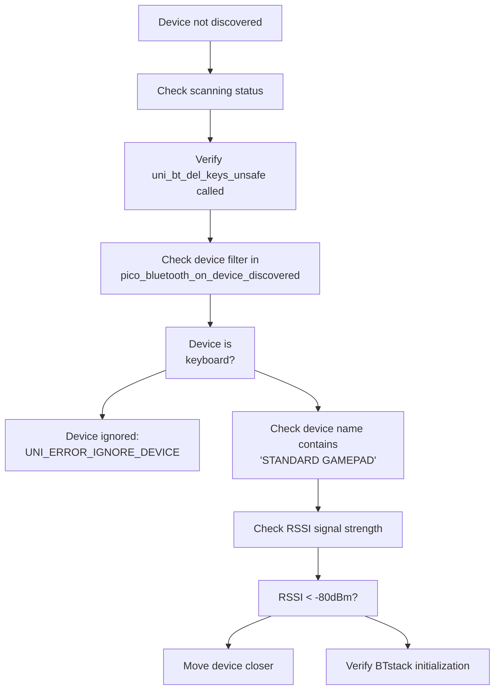
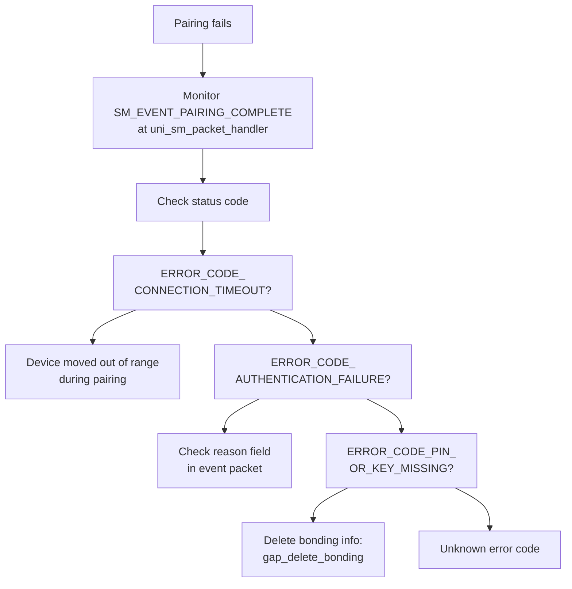

# Troubleshooting

> **Relevant source files**
> * [bluepad32/bt/uni_bt.c](https://github.com/Jus-Be/orinayo-pico/blob/6dde5a75/bluepad32/bt/uni_bt.c)
> * [bluepad32/bt/uni_bt_le.c](https://github.com/Jus-Be/orinayo-pico/blob/6dde5a75/bluepad32/bt/uni_bt_le.c)
> * [bluepad32/bt/uni_bt_setup.c](https://github.com/Jus-Be/orinayo-pico/blob/6dde5a75/bluepad32/bt/uni_bt_setup.c)
> * [main.c](https://github.com/Jus-Be/orinayo-pico/blob/6dde5a75/main.c)
> * [storage.c](https://github.com/Jus-Be/orinayo-pico/blob/6dde5a75/storage.c)
> * [storage.h](https://github.com/Jus-Be/orinayo-pico/blob/6dde5a75/storage.h)

This page provides systematic troubleshooting procedures for diagnosing and resolving common issues with the Orinayo Bluetooth-to-MIDI gateway system. It covers connection failures, MIDI output problems, timing issues, and performance degradation.

For general system configuration, see [Configuration](https://github.com/Jus-Be/orinayo-pico/blob/6dde5a75/Configuration)

 For detailed information about clock synchronization behavior, see [Clock Synchronization](https://github.com/Jus-Be/orinayo-pico/blob/6dde5a75/Clock Synchronization)

 For button input handling, see [Button Input](https://github.com/Jus-Be/orinayo-pico/blob/6dde5a75/Button Input)

---

## 1. Bluetooth Connection Issues

### 1.1 Device Not Discovered

**Symptoms**: Bluetooth controller is not found during scanning; onboard LED does not respond to controller connection.

```mermaid
flowchart TD

Start["Device not discovered"]
CheckScanning["Check scanning status"]
VerifyDelete["Verify uni_bt_del_keys_unsafe called"]
CheckFilter["Check device filter in<br>pico_bluetooth_on_device_discovered"]
IsKeyboard["Device is<br>keyboard?"]
Ignored["Device ignored:<br>UNI_ERROR_IGNORE_DEVICE"]
CheckName["Check device name contains<br>'STANDARD GAMEPAD'"]
CheckRSSI["Check RSSI signal strength"]
TooWeak["RSSI < -80dBm?"]
MoveCloser["Move device closer"]
CheckBTStack["Verify BTstack initialization"]

Start --> CheckScanning
CheckScanning --> VerifyDelete
VerifyDelete --> CheckFilter
CheckFilter --> IsKeyboard
IsKeyboard --> Ignored
IsKeyboard --> CheckName
CheckName --> CheckRSSI
CheckRSSI --> TooWeak
TooWeak --> MoveCloser
TooWeak --> CheckBTStack
```

**Diagnostic Steps**:

1. **Verify scanning is active**: Check that `uni_bt_start_scanning_and_autoconnect_safe()` is called in `pico_bluetooth.c`. The `is_scanning` flag in `bluepad32/bt/uni_bt_le.c` should be true. [bluepad32/bt/uni_bt_le.c L81](https://github.com/Jus-Be/orinayo-pico/blob/6dde5a75/bluepad32/bt/uni_bt_le.c#L81-L81)
2. **Check device filters**: The system filters out keyboards in the discovery callback. If your device advertises as `UNI_BT_COD_MINOR_KEYBOARD`, it will be rejected with `UNI_ERROR_IGNORE_DEVICE`.
3. **Verify Bluetooth keys cleared**: At startup, the system calls `uni_bt_del_keys_unsafe()` to delete stored pairing keys. If this fails, old bonding information may prevent new connections.
4. **Check RSSI signal strength**: The discovery callback receives RSSI (Received Signal Strength Indicator). Values below -80 dBm indicate weak signal.

**Resolution**:

| Issue | Code Location | Solution |
| --- | --- | --- |
| Keyboard filter blocking device | `pico_bluetooth.c` | Remove or modify `UNI_BT_COD_MINOR_KEYBOARD` check |
| Scanning not started | `bluepad32/bt/uni_bt_le.c` | Ensure `gap_start_scan()` executes via `resume_scanning_hint` [bluepad32/bt/uni_bt_le.c L184-L190](https://github.com/Jus-Be/orinayo-pico/blob/6dde5a75/bluepad32/bt/uni_bt_le.c#L184-L190) |
| Old pairing data | `bluepad32/bt/uni_bt_le.c` | Verify `gap_delete_bonding()` completes successfully [bluepad32/bt/uni_bt_le.c L203](https://github.com/Jus-Be/orinayo-pico/blob/6dde5a75/bluepad32/bt/uni_bt_le.c#L203-L203) |
| Weak signal | Hardware | Position devices within 10 meters, remove obstacles |

**Sources**: [bluepad32/bt/uni_bt_le.c L81-L210](https://github.com/Jus-Be/orinayo-pico/blob/6dde5a75/bluepad32/bt/uni_bt_le.c#L81-L210)

 [pico_bluetooth.c L200-L243](https://github.com/Jus-Be/orinayo-pico/blob/6dde5a75/pico_bluetooth.c#L200-L243)

---

### 1.2 Pairing Failures

**Symptoms**: Device discovered but pairing fails; `SM_EVENT_PAIRING_COMPLETE` reports error status.

```mermaid
flowchart TD

Start["Pairing fails"]
CheckEventType["Monitor SM_EVENT_PAIRING_COMPLETE<br>at uni_sm_packet_handler"]
CheckStatus["Check status code"]
Timeout["ERROR_CODE_<br>CONNECTION_TIMEOUT?"]
CheckRange["Device moved out of range<br>during pairing"]
AuthFail["ERROR_CODE_<br>AUTHENTICATION_FAILURE?"]
CheckReason["Check reason field<br>in event packet"]
KeyMissing["ERROR_CODE_PIN_<br>OR_KEY_MISSING?"]
DeleteBonding["Delete bonding info:<br>gap_delete_bonding"]
OtherError["Unknown error code"]

Start --> CheckEventType
CheckEventType --> CheckStatus
CheckStatus --> Timeout
Timeout --> CheckRange
Timeout --> AuthFail
AuthFail --> CheckReason
AuthFail --> KeyMissing
KeyMissing --> DeleteBonding
KeyMissing --> OtherError
```

**Diagnostic Steps**:

1. **Monitor Security Manager events**: The `uni_sm_packet_handler()` in the BLE stack processes all pairing events.
2. **Check authentication method**: The system uses "Just Works" pairing. Some devices may require numeric comparison instead.
3. **Verify re-encryption handling**: For previously bonded devices, check `SM_EVENT_REENCRYPTION_COMPLETE`. `ERROR_CODE_PIN_OR_KEY_MISSING` triggers bonding deletion, and the system automatically re-pairs after deleting stale bonds.

**Resolution**:

| Error Code | Location | Action |
| --- | --- | --- |
| `ERROR_CODE_CONNECTION_TIMEOUT` | `bluepad32/bt/uni_bt_le.c` | Move device closer; retry pairing |
| `ERROR_CODE_AUTHENTICATION_FAILURE` | `bluepad32/bt/uni_bt_le.c` | Check `sm_event_pairing_complete_get_reason(packet)` |
| `ERROR_CODE_PIN_OR_KEY_MISSING` | `bluepad32/bt/uni_bt_le.c` | Delete bonding with `gap_delete_bonding()`; re-pair [bluepad32/bt/uni_bt_le.c L203](https://github.com/Jus-Be/orinayo-pico/blob/6dde5a75/bluepad32/bt/uni_bt_le.c#L203-L203) |
| `ERROR_CODE_REMOTE_USER_TERMINATED_CONNECTION` | `bluepad32/bt/uni_bt_le.c` | User canceled; retry pairing |

**Sources**: [bluepad32/bt/uni_bt_le.c L192-L210](https://github.com/Jus-Be/orinayo-pico/blob/6dde5a75/bluepad32/bt/uni_bt_le.c#L192-L210)

---

### 1.3 Connection Drops

**Symptoms**: Device connects successfully but disconnects shortly after.

**Diagnostic Checks**:

1. **Monitor disconnection events**: The `hog_disconnect` function handles disconnections and triggers a scan resume. [bluepad32/bt/uni_bt_le.c L192-L210](https://github.com/Jus-Be/orinayo-pico/blob/6dde5a75/bluepad32/bt/uni_bt_le.c#L192-L210)
2. **Verify HIDS client connection**: After pairing, the HIDS client must connect. If the GATT service discovery fails or the HID descriptor is invalid, the connection may drop.
3. **Check processing flags**: If the `finished_processing` flag in `pico_bluetooth.c` is not reset correctly, it may indicate a data processing bottleneck. [pico_bluetooth.c L49](https://github.com/Jus-Be/orinayo-pico/blob/6dde5a75/pico_bluetooth.c#L49-L49)

**Resolution**:

| Symptom | Code Reference | Fix |
| --- | --- | --- |
| Immediate disconnection after pairing | `bluepad32/bt/uni_bt_le.c` | Verify GATT service discovery completes [bluepad32/bt/uni_bt_le.c L44-L54](https://github.com/Jus-Be/orinayo-pico/blob/6dde5a75/bluepad32/bt/uni_bt_le.c#L44-L54) |
| Random disconnections | `pico_bluetooth.c` | Check `finished_processing` flag [pico_bluetooth.c L49](https://github.com/Jus-Be/orinayo-pico/blob/6dde5a75/pico_bluetooth.c#L49-L49) |
| Disconnection during mode switch | `pico_bluetooth.c` | Check if complex button combos block the event loop |

**Sources**: [bluepad32/bt/uni_bt_le.c L44-L54](https://github.com/Jus-Be/orinayo-pico/blob/6dde5a75/bluepad32/bt/uni_bt_le.c#L44-L54)

 [bluepad32/bt/uni_bt_le.c L192-L210](https://github.com/Jus-Be/orinayo-pico/blob/6dde5a75/bluepad32/bt/uni_bt_le.c#L192-L210)

 [pico_bluetooth.c L49-L51](https://github.com/Jus-Be/orinayo-pico/blob/6dde5a75/pico_bluetooth.c#L49-L51)

---

## 2. MIDI Output Problems

### 2.1 No MIDI Data on USB

**Symptoms**: USB enumerates successfully but no MIDI data appears in DAW or MIDI monitor software.

**Diagnostic Steps**:

1. **Verify USB initialization**: `tud_init(BOARD_TUD_RHPORT)` must complete successfully before MIDI operations. [main.c L209](https://github.com/Jus-Be/orinayo-pico/blob/6dde5a75/main.c#L209-L209)
2. **Check USB mount status**: The LED typically indicates mount status. If it never turns on, check the USB cable or host drivers.
3. **Verify `tud_task()` runs continuously**: The main loop must call `tud_task()` on every iteration. [main.c L228](https://github.com/Jus-Be/orinayo-pico/blob/6dde5a75/main.c#L228-L228)  If blocked by Bluetooth processing, USB MIDI will fail.
4. **Check MIDI write function**: All MIDI output flows through `midi_n_stream_write()` which targets both USB and UART. [main.c L165](https://github.com/Jus-Be/orinayo-pico/blob/6dde5a75/main.c#L165-L165)

**Sources**: [main.c L165](https://github.com/Jus-Be/orinayo-pico/blob/6dde5a75/main.c#L165-L165)

 [main.c L209](https://github.com/Jus-Be/orinayo-pico/blob/6dde5a75/main.c#L209-L209)

 [main.c L228](https://github.com/Jus-Be/orinayo-pico/blob/6dde5a75/main.c#L228-L228)

---

### 2.2 No MIDI Data on UART

**Symptoms**: UART configured but hardware MIDI device receives no data.

**Diagnostic Steps**:

1. **Verify UART initialization**: The UART must be configured with a baud rate of 31250 (standard MIDI). [main.c L220](https://github.com/Jus-Be/orinayo-pico/blob/6dde5a75/main.c#L220-L220)
2. **Check UART write mechanism**: Ensure `uart_putc()` is being called and that `uart_is_writable()` is checked to prevent FIFO overflows.
3. **Verify GPIO function assignment**: Ensure the TX pin is correctly set to `GPIO_FUNC_UART`. [main.c L221](https://github.com/Jus-Be/orinayo-pico/blob/6dde5a75/main.c#L221-L221)

**Hardware Verification**:

| Signal | GPIO Pin | Hardware Connection |
| --- | --- | --- |
| UART TX | GPIO 0 | MIDI OUT jack pin 5 |
| Ground | GND | MIDI connector pin 2 |
| +5V | VBUS | Required for MIDI current loop |

**Sources**: [main.c L220-L221](https://github.com/Jus-Be/orinayo-pico/blob/6dde5a75/main.c#L220-L221)

---

## 3. Storage and Preferences Issues

### 3.1 Preferences Not Saving

**Symptoms**: Mode changes (e.g., Ample Guitar, SeqTrak) are lost after a power cycle.

**Diagnostic Steps**:

1. **Check Flash Offset**: Ensure `GHOST_FLASH_BANK_STORAGE_OFFSET` is pointing to a valid, unused area of flash. [storage.c L13-L15](https://github.com/Jus-Be/orinayo-pico/blob/6dde5a75/storage.c#L13-L15)
2. **Verify Magic Header**: The system looks for the "GHST" magic header to validate data. [storage.c L17](https://github.com/Jus-Be/orinayo-pico/blob/6dde5a75/storage.c#L17-L17)
3. **Bluetooth Interference**: Writing to flash is sensitive to interrupts. The system shuts down the Bluetooth architecture (`cyw43_arch_deinit()`) before performing the write to ensure stability. [storage.c L98](https://github.com/Jus-Be/orinayo-pico/blob/6dde5a75/storage.c#L98-L98)

**Resolution**:

| Issue | Code Location | Solution |
| --- | --- | --- |
| Write fails | `storage.c:98-102` | Ensure `cyw43_arch_deinit()` is called before `flash_range_program` and `cyw43_arch_init()` after. |
| Load fails | `storage.c:107-112` | Check if `MAGIC_HEADER` is present at the start of the flash bank |
| Preferences not updated | `storage.c:81-91` | Verify that global `enable_` flags are correctly mapped in `storage_store_preferences` |

**Sources**: [storage.c L13-L119](https://github.com/Jus-Be/orinayo-pico/blob/6dde5a75/storage.c#L13-L119)

---

## 4. Controller Input Mapping Issues

### 4.1 Chord Generation Failures

**Symptoms**: Incorrect chords are played, or notes are missing from the chord.

**Diagnostic Steps**:

1. **Check Chord Table**: The `chord_chat` table defines the fret positions for every root note and chord type (Major, Minor, Sus). [pico_bluetooth.c L189-L202](https://github.com/Jus-Be/orinayo-pico/blob/6dde5a75/pico_bluetooth.c#L189-L202)
2. **Verify Strum Patterns**: Strum patterns define which strings are hit and in what order. Check the `strum_pattern` array if the arpeggio sounds incorrect. [pico_bluetooth.c L204-L219](https://github.com/Jus-Be/orinayo-pico/blob/6dde5a75/pico_bluetooth.c#L204-L219)
3. **Check Velocity Mapping**: Ensure `applied_velocity` is within MIDI range (0-127). [bluepad32/bt/uni_bt_le.c L102](https://github.com/Jus-Be/orinayo-pico/blob/6dde5a75/bluepad32/bt/uni_bt_le.c#L102-L102)

**Sources**: [pico_bluetooth.c L189-L219](https://github.com/Jus-Be/orinayo-pico/blob/6dde5a75/pico_bluetooth.c#L189-L219)

 [bluepad32/bt/uni_bt_le.c L102](https://github.com/Jus-Be/orinayo-pico/blob/6dde5a75/bluepad32/bt/uni_bt_le.c#L102-L102)

---

## 5. System Reset and Recovery

### 5.1 Factory Reset Procedure

To clear all stored patterns and reset to default state:

1. **Clear looper patterns**: The system provides `storage_erase_tracks()` to wipe the flash sector used for patterns. [storage.c L67-L70](https://github.com/Jus-Be/orinayo-pico/blob/6dde5a75/storage.c#L67-L70)
2. **Clear Bluetooth bonding**: Use the controller's specific pairing reset or rely on `gap_delete_bonding()` within the firmware to force a new handshake. [bluepad32/bt/uni_bt_le.c L203](https://github.com/Jus-Be/orinayo-pico/blob/6dde5a75/bluepad32/bt/uni_bt_le.c#L203-L203)

**Sources**: [storage.c L67-L70](https://github.com/Jus-Be/orinayo-pico/blob/6dde5a75/storage.c#L67-L70)

 [bluepad32/bt/uni_bt_le.c L203](https://github.com/Jus-Be/orinayo-pico/blob/6dde5a75/bluepad32/bt/uni_bt_le.c#L203-L203)