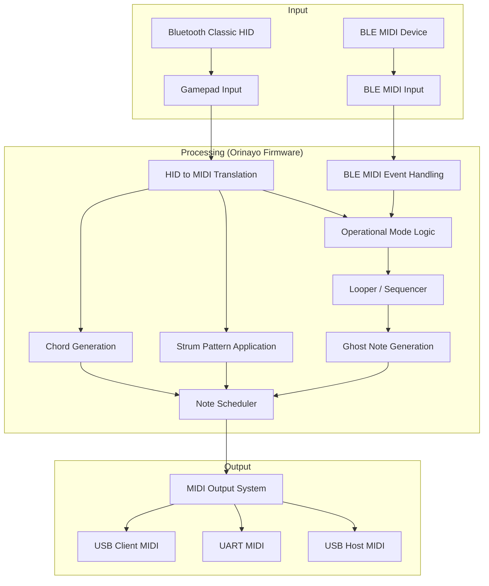

# Glossary

> **Relevant source files**
> * [CMakeLists.txt](https://github.com/Jus-Be/orinayo-pico/blob/6dde5a75/CMakeLists.txt)
> * [Hiroyuki_OYAMA_license.md](https://github.com/Jus-Be/orinayo-pico/blob/6dde5a75/Hiroyuki_OYAMA_license.md?plain=1)
> * [README.md](https://github.com/Jus-Be/orinayo-pico/blob/6dde5a75/README.md?plain=1)
> * [ble_midi_controller.c](https://github.com/Jus-Be/orinayo-pico/blob/6dde5a75/ble_midi_controller.c)
> * [ble_midi_controller.h](https://github.com/Jus-Be/orinayo-pico/blob/6dde5a75/ble_midi_controller.h)
> * [bluepad32/bt/uni_bt.c](https://github.com/Jus-Be/orinayo-pico/blob/6dde5a75/bluepad32/bt/uni_bt.c)
> * [bluepad32/bt/uni_bt_le.c](https://github.com/Jus-Be/orinayo-pico/blob/6dde5a75/bluepad32/bt/uni_bt_le.c)
> * [bluepad32/bt/uni_bt_setup.c](https://github.com/Jus-Be/orinayo-pico/blob/6dde5a75/bluepad32/bt/uni_bt_setup.c)
> * [button.h](https://github.com/Jus-Be/orinayo-pico/blob/6dde5a75/button.h)
> * [ghost_note.c](https://github.com/Jus-Be/orinayo-pico/blob/6dde5a75/ghost_note.c)
> * [ghost_note.h](https://github.com/Jus-Be/orinayo-pico/blob/6dde5a75/ghost_note.h)
> * [looper.c](https://github.com/Jus-Be/orinayo-pico/blob/6dde5a75/looper.c)
> * [looper.h](https://github.com/Jus-Be/orinayo-pico/blob/6dde5a75/looper.h)
> * [main.c](https://github.com/Jus-Be/orinayo-pico/blob/6dde5a75/main.c)
> * [note_scheduler.c](https://github.com/Jus-Be/orinayo-pico/blob/6dde5a75/note_scheduler.c)
> * [note_scheduler.h](https://github.com/Jus-Be/orinayo-pico/blob/6dde5a75/note_scheduler.h)
> * [pico-w-ble-midi-lib/ble_midi_client.c](https://github.com/Jus-Be/orinayo-pico/blob/6dde5a75/pico-w-ble-midi-lib/ble_midi_client.c)
> * [pico-w-ble-midi-lib/ble_midi_client.h](https://github.com/Jus-Be/orinayo-pico/blob/6dde5a75/pico-w-ble-midi-lib/ble_midi_client.h)
> * [pico_bluetooth.c](https://github.com/Jus-Be/orinayo-pico/blob/6dde5a75/pico_bluetooth.c)
> * [storage.c](https://github.com/Jus-Be/orinayo-pico/blob/6dde5a75/storage.c)
> * [storage.h](https://github.com/Jus-Be/orinayo-pico/blob/6dde5a75/storage.h)
> * [tap_tempo.c](https://github.com/Jus-Be/orinayo-pico/blob/6dde5a75/tap_tempo.c)
> * [tap_tempo.h](https://github.com/Jus-Be/orinayo-pico/blob/6dde5a75/tap_tempo.h)
> * [tusb_config.h](https://github.com/Jus-Be/orinayo-pico/blob/6dde5a75/tusb_config.h)
> * [usb_descriptors.c](https://github.com/Jus-Be/orinayo-pico/blob/6dde5a75/usb_descriptors.c)

This page defines codebase-specific terms, jargon, abbreviations, and domain concepts used within the Orinayo project. It aims to provide an onboarding engineer with a clear understanding of the system's terminology, along with pointers to relevant code entities.

## Orinayo Specific Terms

### Orinayo

The name of the project, a firmware for the Raspberry Pi Pico 2 W that acts as a Bluetooth-to-MIDI gateway. It turns Bluetooth Classic (HID over L2CAP) and BLE devices into professional MIDI control surfaces.
Sources: [README.md L1-L5](https://github.com/Jus-Be/orinayo-pico/blob/6dde5a75/README.md?plain=1#L1-L5)

### Pico 2 W

Refers specifically to the Raspberry Pi Pico 2 W microcontroller, which is the target hardware for the Orinayo firmware. It features an RP2350 microcontroller and a CYW43439 Wi-Fi/Bluetooth chip.
Sources: [README.md L62](https://github.com/Jus-Be/orinayo-pico/blob/6dde5a75/README.md?plain=1#L62-L62)

### Bluetooth Classic HID

A Bluetooth communication profile used for Human Interface Devices (HIDs) like gamepads. Orinayo supports these devices for input.
Sources: [README.md L13-L14](https://github.com/Jus-Be/orinayo-pico/blob/6dde5a75/README.md?plain=1#L13-L14)

### BLE MIDI

Bluetooth Low Energy MIDI. Orinayo supports BLE MIDI devices for input.
Sources: [README.md L13](https://github.com/Jus-Be/orinayo-pico/blob/6dde5a75/README.md?plain=1#L13-L13)

### Dual MIDI Output

Orinayo's capability to output MIDI data simultaneously over two different interfaces: USB MIDI and UART MIDI.
Sources: [README.md L14-L15](https://github.com/Jus-Be/orinayo-pico/blob/6dde5a75/README.md?plain=1#L14-L15)

### USB Client MIDI

MIDI output via the Pico W's native USB connector, typically connected to a computer (DAW).
Sources: [tusb_config.h L41](https://github.com/Jus-Be/orinayo-pico/blob/6dde5a75/tusb_config.h#L41-L41)

 [README.md L36](https://github.com/Jus-Be/orinayo-pico/blob/6dde5a75/README.md?plain=1#L36-L36)

### USB Host MIDI

MIDI output via the Pico W's PIO USB host interface, allowing connection to MIDI-compliant USB devices.
Sources: [tusb_config.h L42](https://github.com/Jus-Be/orinayo-pico/blob/6dde5a75/tusb_config.h#L42-L42)

 [README.md L37](https://github.com/Jus-Be/orinayo-pico/blob/6dde5a75/README.md?plain=1#L37-L37)

### UART MIDI

MIDI output via the UART0 GPIO pins (TX on GPIO 0, RX on GPIO 1), typically connected to hardware synthesizers or phrase samplers.
Sources: [main.c L66-L69](https://github.com/Jus-Be/orinayo-pico/blob/6dde5a75/main.c#L66-L69)

 [README.md L38-L39](https://github.com/Jus-Be/orinayo-pico/blob/6dde5a75/README.md?plain=1#L38-L39)

### Chord Generation System

A feature that maps gamepad button combinations to musical chords using a lookup table.
Sources: [README.md L16-L17](https://github.com/Jus-Be/orinayo-pico/blob/6dde5a75/README.md?plain=1#L16-L17)

#### chord_chat

A 3D array in `pico_bluetooth.c` that serves as the lookup table for chord generation. It stores MIDI note offsets for different chord types and neck positions.
Sources: [pico_bluetooth.c L231-L244](https://github.com/Jus-Be/orinayo-pico/blob/6dde5a75/pico_bluetooth.c#L231-L244)

### 32-step Drum Sequencer

A looper module that allows recording and playback of drum patterns across 14 tracks, incorporating algorithmic ghost notes and fills.
Sources: [README.md L17-L18](https://github.com/Jus-Be/orinayo-pico/blob/6dde5a75/README.md?plain=1#L17-L18)

 [looper.c L1-L5](https://github.com/Jus-Be/orinayo-pico/blob/6dde5a75/looper.c#L1-L5)

#### looper_status_t

A structure defined in `looper.h` and instantiated as `looper_status` in `looper.c` and `pico_bluetooth.c`. It holds the current state of the looper, including BPM, current step, and operational state.
Sources: [looper.c L49](https://github.com/Jus-Be/orinayo-pico/blob/6dde5a75/looper.c#L49-L49)

 [pico_bluetooth.c L39](https://github.com/Jus-Be/orinayo-pico/blob/6dde5a75/pico_bluetooth.c#L39-L39)

#### track_t

A structure representing a single track in the looper, containing its name, MIDI note, channel, and a 32-step pattern.
Sources: [looper.c L51](https://github.com/Jus-Be/orinayo-pico/blob/6dde5a75/looper.c#L51-L51)

#### drum_styles

A 3D array in `looper.c` containing predefined drum patterns for various styles.
Sources: [looper.c L69-L100](https://github.com/Jus-Be/orinayo-pico/blob/6dde5a75/looper.c#L69-L100)

### Ghost Notes

Algorithmic note generation patterns (Euclidean, boundary, fill-in) applied to drum tracks to add musical complexity.
Sources: [README.md L18](https://github.com/Jus-Be/orinayo-pico/blob/6dde5a75/README.md?plain=1#L18-L18)

### Tap Tempo

A system to detect and set the BPM (Beats Per Minute) by analyzing user input taps.
Sources: [README.md L18](https://github.com/Jus-Be/orinayo-pico/blob/6dde5a75/README.md?plain=1#L18-L18)

### Pattern Persistence

The ability to save looper patterns to flash memory and restore them upon power-up.
Sources: [README.md L18](https://github.com/Jus-Be/orinayo-pico/blob/6dde5a75/README.md?plain=1#L18-L18)

#### storage_preference_t

A structure used for storing system preferences in flash memory. It includes a magic header and an array of preferences.
Sources: [storage.c L20-L23](https://github.com/Jus-Be/orinayo-pico/blob/6dde5a75/storage.c#L20-L23)

#### storage_pattern_t

A structure used for storing looper patterns in flash memory. It includes a magic header and a 2D array representing the patterns for each track.
Sources: [storage.c L25-L28](https://github.com/Jus-Be/orinayo-pico/blob/6dde5a75/storage.c#L25-L28)

### Operational Modes

Different configurations of Orinayo that tailor its behavior for specific musical instruments or software. These modes can be selected at runtime.
Sources: [README.md L19-L20](https://github.com/Jus-Be/orinayo-pico/blob/6dde5a75/README.md?plain=1#L19-L20)

#### Arranger Mode

Configures Orinayo to send chords and style-section commands to Ketron/Yamaha keyboard arrangers.
Sources: [README.md L47](https://github.com/Jus-Be/orinayo-pico/blob/6dde5a75/README.md?plain=1#L47-L47)

#### Ample Guitar Mode

Configures Orinayo to trigger guitar VST articulations and strumming modes via key switches.
Sources: [README.md L48](https://github.com/Jus-Be/orinayo-pico/blob/6dde5a75/README.md?plain=1#L48-L48)

#### MIDI Drums Mode

Configures Orinayo for recording and playing back MIDI guitar and drum patterns with 14 tracks, ghost notes, and fills.
Sources: [README.md L49](https://github.com/Jus-Be/orinayo-pico/blob/6dde5a75/README.md?plain=1#L49-L49)

#### SeqTrak Mode

Configures Orinayo to control Yamaha SeqTrak arpeggiator and pattern selection via SysEx messages.
Sources: [README.md L50](https://github.com/Jus-Be/orinayo-pico/blob/6dde5a75/README.md?plain=1#L50-L50)

#### MODX Mode

Configures Orinayo for specific control of the Yamaha MODX synthesizer.
Sources: [pico_bluetooth.c L54](https://github.com/Jus-Be/orinayo-pico/blob/6dde5a75/pico_bluetooth.c#L54-L54)

 [main.c L93](https://github.com/Jus-Be/orinayo-pico/blob/6dde5a75/main.c#L93-L93)

#### MPC Sample Mode

Configures Orinayo to trigger 124 audio loops via MIDI with independent tracks for drums, bass, and other instruments.
Sources: [README.md L52](https://github.com/Jus-Be/orinayo-pico/blob/6dde5a75/README.md?plain=1#L52-L52)

#### SP404 Mk2 Mode

Configures Orinayo to trigger 160 audio loops via MIDI with independent tracks for drums, bass, and other instruments.
Sources: [README.md L53](https://github.com/Jus-Be/orinayo-pico/blob/6dde5a75/README.md?plain=1#L53-L53)

#### WAV Trigger Pro Mode

Configures Orinayo to play a single multi-sampled instrument and trigger audio loops on WAV Trigger Pro from SparkFun via MIDI.
Sources: [README.md L54](https://github.com/Jus-Be/orinayo-pico/blob/6dde5a75/README.md?plain=1#L54-L54)

#### Nanobox Tangerine Mode

Configures Orinayo to play up to 4 multi-sampled instruments with effects and trigger audio loops on Nanobox Tangerine from 1010Music via MIDI.
Sources: [README.md L55](https://github.com/Jus-Be/orinayo-pico/blob/6dde5a75/README.md?plain=1#L55-L55)

### strum_pattern

A 3D array in `pico_bluetooth.c` that defines various strumming patterns for guitar-like input.
Sources: [pico_bluetooth.c L246](https://github.com/Jus-Be/orinayo-pico/blob/6dde5a75/pico_bluetooth.c#L246-L246)

## Abbreviations and Technologies

### Pico SDK

The official Software Development Kit for the Raspberry Pi Pico microcontrollers.
Sources: [CMakeLists.txt L43](https://github.com/Jus-Be/orinayo-pico/blob/6dde5a75/CMakeLists.txt#L43-L43)

### TinyUSB (TUSB)

A lightweight, open-source USB stack used for both USB device and USB host functionalities on the Pico W.
Sources: [main.c L17](https://github.com/Jus-Be/orinayo-pico/blob/6dde5a75/main.c#L17-L17)

 [tusb_config.h L1-L24](https://github.com/Jus-Be/orinayo-pico/blob/6dde5a75/tusb_config.h#L1-L24)

#### tud_init()

Initializes the TinyUSB device stack.
Sources: [main.c L209](https://github.com/Jus-Be/orinayo-pico/blob/6dde5a75/main.c#L209-L209)

#### tuh_init()

Initializes the TinyUSB host stack.
Sources: [main.c L187](https://github.com/Jus-Be/orinayo-pico/blob/6dde5a75/main.c#L187-L187)

#### tud_task()

The main task function for the TinyUSB device stack, which should be called repeatedly in the main loop.
Sources: [main.c L228](https://github.com/Jus-Be/orinayo-pico/blob/6dde5a75/main.c#L228-L228)

#### tuh_task()

The main task function for the TinyUSB host stack, which should be called repeatedly in the main loop.
Sources: [main.c L190](https://github.com/Jus-Be/orinayo-pico/blob/6dde5a75/main.c#L190-L190)

### BTstack

A dual-mode Bluetooth stack (Classic and LE) used for Bluetooth communication on the Pico W.
Sources: [pico_bluetooth.c L8](https://github.com/Jus-Be/orinayo-pico/blob/6dde5a75/pico_bluetooth.c#L8-L8)

 [bluepad32/bt/uni_bt.c L58](https://github.com/Jus-Be/orinayo-pico/blob/6dde5a75/bluepad32/bt/uni_bt.c#L58-L58)

### Bluepad32

A library that integrates with BTstack to provide support for various Bluetooth gamepads and HID devices.
Sources: [pico_bluetooth.c L7](https://github.com/Jus-Be/orinayo-pico/blob/6dde5a75/pico_bluetooth.c#L7-L7)

 [CMakeLists.txt L49](https://github.com/Jus-Be/orinayo-pico/blob/6dde5a75/CMakeLists.txt#L49-L49)

#### uni_hid_device_t

A structure representing a connected HID device within the Bluepad32 framework.
Sources: [bluepad32/bt/uni_bt.c L152](https://github.com/Jus-Be/orinayo-pico/blob/6dde5a75/bluepad32/bt/uni_bt.c#L152-L152)

#### uni_bt_le_on_gap_event_advertising_report()

A function in `uni_bt_le.c` that processes BLE advertising reports to discover devices.
Sources: [bluepad32/bt/uni_bt_le.c L45](https://github.com/Jus-Be/orinayo-pico/blob/6dde5a75/bluepad32/bt/uni_bt_le.c#L45-L45)

#### hog_connect()

A function in `uni_bt_le.c` responsible for initiating a connection to a remote BLE device.
Sources: [bluepad32/bt/uni_bt_le.c L173-L181](https://github.com/Jus-Be/orinayo-pico/blob/6dde5a75/bluepad32/bt/uni_bt_le.c#L173-L181)

### BLE MIDI Client

A module (`ble_midi_client.c`) that handles the client-side integration for BLE MIDI, including scanning, connecting, and processing MIDI data from BLE MIDI peripherals.
Sources: [ble_midi_controller.c L1-L9](https://github.com/Jus-Be/orinayo-pico/blob/6dde5a75/ble_midi_controller.c#L1-L9)

#### ble_midi_client_request_connect()

Function to request a connection to a BLE MIDI peripheral.
Sources: [ble_midi_controller.c L35](https://github.com/Jus-Be/orinayo-pico/blob/6dde5a75/ble_midi_controller.c#L35-L35)

#### send_ble_midi()

Function to send MIDI data to a connected BLE MIDI peripheral.
Sources: [ble_midi_controller.c L27](https://github.com/Jus-Be/orinayo-pico/blob/6dde5a75/ble_midi_controller.c#L27-L27)

### PIO USB

A software-defined USB host/device implementation using the Raspberry Pi Pico's Programmable I/O (PIO) state machines. Orinayo uses it for USB Host MIDI.
Sources: [main.c L18](https://github.com/Jus-Be/orinayo-pico/blob/6dde5a75/main.c#L18-L18)

 [tusb_config.h L42](https://github.com/Jus-Be/orinayo-pico/blob/6dde5a75/tusb_config.h#L42-L42)

 [CMakeLists.txt L28](https://github.com/Jus-Be/orinayo-pico/blob/6dde5a75/CMakeLists.txt#L28-L28)

### SysEx

System Exclusive messages in MIDI, used for manufacturer-specific commands and data. Orinayo uses SysEx for controlling devices like Yamaha SeqTrak and MODX.
Sources: [README.md L50](https://github.com/Jus-Be/orinayo-pico/blob/6dde5a75/README.md?plain=1#L50-L50)

### LFO

Low-Frequency Oscillator. Used in `looper.c` for modulating note velocities, contributing to ghost note generation.
Sources: [looper.c L172](https://github.com/Jus-Be/orinayo-pico/blob/6dde5a75/looper.c#L172-L172)

### async_timer

An abstraction for asynchronous timer operations, potentially integrating with `CYW43` for thread-safe background execution.
Sources: [main.c L215](https://github.com/Jus-Be/orinayo-pico/blob/6dde5a75/main.c#L215-L215)

### note_scheduler

A module responsible for scheduling MIDI notes with microsecond precision and dispatching them in a USB-safe manner.
Sources: [main.c L217](https://github.com/Jus-Be/orinayo-pico/blob/6dde5a75/main.c#L217-L217)

## Data Flow and Interaction

### MIDI Data Flow

MIDI data can originate from Bluetooth Classic HID devices (like guitar controllers) or BLE MIDI devices. This input is processed, potentially generating chords or drum patterns, and then routed to dual outputs: USB Client MIDI (to a DAW) and UART MIDI (to external hardware).



Sources: [README.md L13-L15](https://github.com/Jus-Be/orinayo-pico/blob/6dde5a75/README.md?plain=1#L13-L15)

 [pico_bluetooth.c L199](https://github.com/Jus-Be/orinayo-pico/blob/6dde5a75/pico_bluetooth.c#L199-L199)

 [ble_midi_controller.c L101-L121](https://github.com/Jus-Be/orinayo-pico/blob/6dde5a75/ble_midi_controller.c#L101-L121)

 [main.c L232-L240](https://github.com/Jus-Be/orinayo-pico/blob/6dde5a75/main.c#L232-L240)

### Bluetooth Initialization and Device Management

The Bluetooth system initializes both Bluepad32 and the BLE MIDI client. It scans for devices, handles connections, and manages the lifecycle of connected Bluetooth HID and BLE MIDI peripherals.

```

```

Sources: [main.c L210](https://github.com/Jus-Be/orinayo-pico/blob/6dde5a75/main.c#L210-L210)

 [bluepad32/bt/uni_bt.c L118-L125](https://github.com/Jus-Be/orinayo-pico/blob/6dde5a75/bluepad32/bt/uni_bt.c#L118-L125)

 [bluepad32/bt/uni_bt_le.c L173-L181](https://github.com/Jus-Be/orinayo-pico/blob/6dde5a75/bluepad32/bt/uni_bt_le.c#L173-L181)

 [ble_midi_controller.c L101-L222](https://github.com/Jus-Be/orinayo-pico/blob/6dde5a75/ble_midi_controller.c#L101-L222)

### Flash Storage Operations

The system uses the Pico W's flash memory for persistent storage of looper patterns and user preferences. Operations involve erasing sectors and programming pages.

```

```

Sources: [storage.c L75-L124](https://github.com/Jus-Be/orinayo-pico/blob/6dde5a75/storage.c#L75-L124)

 [storage.c L149-L165](https://github.com/Jus-Be/orinayo-pico/blob/6dde5a75/storage.c#L149-L165)