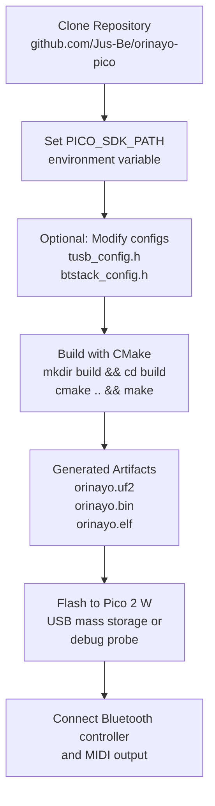
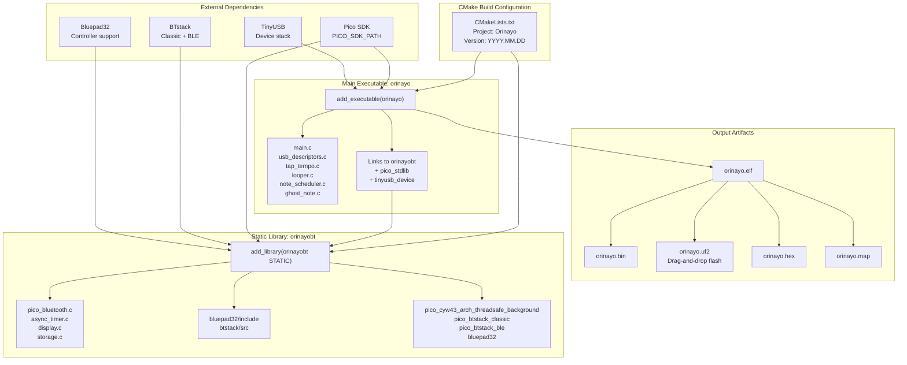
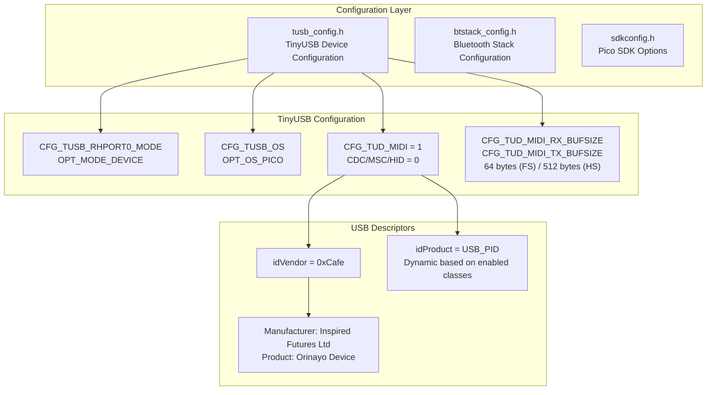
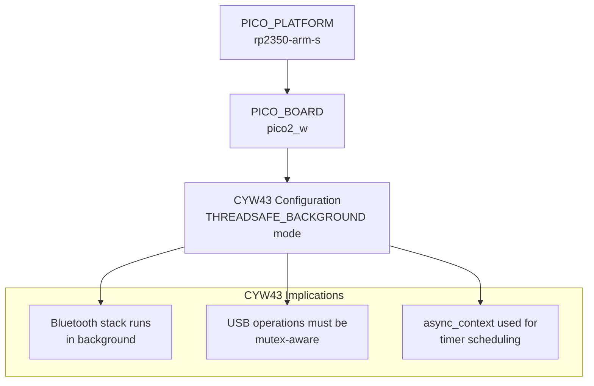
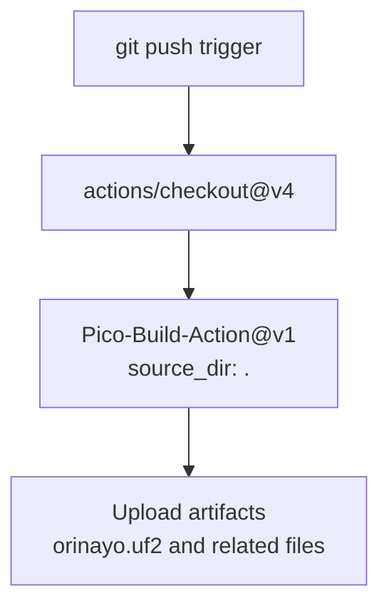

# Getting Started

> **Relevant source files**
> * [.github/workflows/build.yml](https://github.com/Jus-Be/orinayo-pico/blob/122fa496/.github/workflows/build.yml)
> * [.gitignore](https://github.com/Jus-Be/orinayo-pico/blob/122fa496/.gitignore)
> * [CMakeLists.txt](https://github.com/Jus-Be/orinayo-pico/blob/122fa496/CMakeLists.txt)
> * [tusb_config.h](https://github.com/Jus-Be/orinayo-pico/blob/122fa496/tusb_config.h)
> * [usb_descriptors.c](https://github.com/Jus-Be/orinayo-pico/blob/122fa496/usb_descriptors.c)

This page provides an overview of the prerequisites, build process, and initial configuration needed to develop and deploy the Orinayo firmware. It covers the essential steps from cloning the repository to flashing a working firmware image onto the Raspberry Pi Pico 2 W hardware.

For detailed system architecture, see [Architecture](./3-architecture.md). For operational details about individual subsystems, see [Bluetooth Input System](./4-bluetooth-input-system.md) and [Musical Processing](./5-musical-processing.md).

## Scope and Prerequisites

The Orinayo firmware targets the **Raspberry Pi Pico 2 W** (RP2350-based board with CYW43 Bluetooth/WiFi chip) and requires the following components:

| Component | Requirement | Notes |
| --- | --- | --- |
| **Target Hardware** | Raspberry Pi Pico 2 W | RP2350 dual-core ARM, CYW43 wireless chip |
| **Build System** | CMake 3.12+ | Configured in [CMakeLists.txt L20](https://github.com/Jus-Be/orinayo-pico/blob/122fa496/CMakeLists.txt#L20-L20) |
| **SDK** | Pico SDK | Must be installed with `PICO_SDK_PATH` environment variable set |
| **Compiler** | ARM GCC toolchain | Included with Pico SDK setup |
| **Input Devices** | Bluetooth controllers | HID gamepads or specialized MIDI devices (see [Hardware Requirements](./2.1-hardware-requirements.md)) |
| **Output Devices** | USB host or UART MIDI | DAW, hardware synthesizer, or both simultaneously |

The build system is configured for the **rp2350-arm-s** platform and **pico2_w** board as specified in [CMakeLists.txt L23-L24](https://github.com/Jus-Be/orinayo-pico/blob/122fa496/CMakeLists.txt#L23-L24)

**Sources:** [CMakeLists.txt L19-L24](https://github.com/Jus-Be/orinayo-pico/blob/122fa496/CMakeLists.txt#L19-L24)

## Quick Start Workflow

The workflow follows a standard embedded development pattern with three configuration points before building. For automated builds, see the GitHub Actions workflow in [.github/workflows/build.yml](https://github.com/Jus-Be/orinayo-pico/blob/122fa496/.github/workflows/build.yml)

**Sources:** [CMakeLists.txt L1-L67](https://github.com/Jus-Be/orinayo-pico/blob/122fa496/CMakeLists.txt#L1-L67)

 [.github/workflows/build.yml L1-L25](https://github.com/Jus-Be/orinayo-pico/blob/122fa496/.github/workflows/build.yml#L1-L25)

## Build System Architecture

The build system implements a **two-tier library architecture** to separate Bluetooth infrastructure from application logic:

### Build Target Details

| Target | Type | Source Files | Purpose |
| --- | --- | --- | --- |
| **orinayobt** | Static library | [pico_bluetooth.c, async_timer.c, display.c, storage.c](https://github.com/Jus-Be/orinayo-pico/blob/122fa496/pico_bluetooth.c, async_timer.c, display.c, storage.c) | Bluetooth infrastructure and hardware abstraction ([CMakeLists.txt L39](https://github.com/Jus-Be/orinayo-pico/blob/122fa496/CMakeLists.txt#L39-L39)   ) |
| **orinayo** | Executable | [main.c, usb_descriptors.c, tap_tempo.c, looper.c, note_scheduler.c, ghost_note.c](https://github.com/Jus-Be/orinayo-pico/blob/122fa496/main.c, usb_descriptors.c, tap_tempo.c, looper.c, note_scheduler.c, ghost_note.c) | Application logic and musical processing ([CMakeLists.txt L44](https://github.com/Jus-Be/orinayo-pico/blob/122fa496/CMakeLists.txt#L44-L44)   ) |

The separation allows the Bluetooth subsystem to be compiled with specific flags (e.g., `PICO_CYW43_ARCH_THREADSAFE_BACKGROUND` defined at [CMakeLists.txt L42](https://github.com/Jus-Be/orinayo-pico/blob/122fa496/CMakeLists.txt#L42-L42)

) without affecting the main application.

**Sources:** [CMakeLists.txt L38-L56](https://github.com/Jus-Be/orinayo-pico/blob/122fa496/CMakeLists.txt#L38-L56)

## Configuration Files Overview

Three configuration headers control different aspects of the system:

### Key Configuration Points

| File | Key Settings | Line References |
| --- | --- | --- |
| **tusb_config.h** | MIDI class enabled, CDC/HID disabled | [tusb_config.h L80-L84](https://github.com/Jus-Be/orinayo-pico/blob/122fa496/tusb_config.h#L80-L84) |
|  | MIDI buffer sizes (64/512 bytes) | [tusb_config.h L87-L88](https://github.com/Jus-Be/orinayo-pico/blob/122fa496/tusb_config.h#L87-L88) |
| **usb_descriptors.c** | USB VID: `0xCafe` | [usb_descriptors.c L51](https://github.com/Jus-Be/orinayo-pico/blob/122fa496/usb_descriptors.c#L51-L51) |
|  | USB PID: Dynamic bitmap | [usb_descriptors.c L35-L36](https://github.com/Jus-Be/orinayo-pico/blob/122fa496/usb_descriptors.c#L35-L36) |
|  | Device strings and metadata | [usb_descriptors.c L131-L139](https://github.com/Jus-Be/orinayo-pico/blob/122fa496/usb_descriptors.c#L131-L139) |

The USB Product ID is dynamically calculated based on enabled TinyUSB device classes using a bitmap at [usb_descriptors.c L34-L36](https://github.com/Jus-Be/orinayo-pico/blob/122fa496/usb_descriptors.c#L34-L36)

 allowing the same vendor ID to support different interface configurations.

**Sources:** [tusb_config.h L26-L94](https://github.com/Jus-Be/orinayo-pico/blob/122fa496/tusb_config.h#L26-L94)

 [usb_descriptors.c L28-L67](https://github.com/Jus-Be/orinayo-pico/blob/122fa496/usb_descriptors.c#L28-L67)

 [usb_descriptors.c L131-L139](https://github.com/Jus-Be/orinayo-pico/blob/122fa496/usb_descriptors.c#L131-L139)

## Platform Configuration

The build targets the **RP2350** platform with specific settings:

The `PICO_CYW43_ARCH_THREADSAFE_BACKGROUND` define at [CMakeLists.txt L42](https://github.com/Jus-Be/orinayo-pico/blob/122fa496/CMakeLists.txt#L42-L42)

 enables background processing of Bluetooth events, which is critical for maintaining low-latency MIDI output while handling wireless communication. This configuration requires careful synchronization in the application code (see [Synchronization Primitives](./8.3-synchronization-primitives.md)).

**Sources:** [CMakeLists.txt L23-L24](https://github.com/Jus-Be/orinayo-pico/blob/122fa496/CMakeLists.txt#L23-L24)

 [CMakeLists.txt L42](https://github.com/Jus-Be/orinayo-pico/blob/122fa496/CMakeLists.txt#L42-L42)

## CI/CD Pipeline

The repository includes a GitHub Actions workflow for automated building:

The workflow at [.github/workflows/build.yml](https://github.com/Jus-Be/orinayo-pico/blob/122fa496/.github/workflows/build.yml)

 automatically builds the firmware on every push, using the `samyarsadat/Pico-Build-Action@v1` action. Build artifacts (UF2, BIN, HEX, ELF, MAP files) are uploaded and available for download from the Actions tab.

**Sources:** [.github/workflows/build.yml L1-L25](https://github.com/Jus-Be/orinayo-pico/blob/122fa496/.github/workflows/build.yml#L1-L25)

## Next Steps

For detailed information on specific aspects of getting started:

* **[Hardware Requirements](./2.1-hardware-requirements.md)**: Detailed specifications for Pico 2 W, supported Bluetooth controllers, and MIDI output connections
* **[Building and Flashing](./2.2-building-and-flashing.md)**: Step-by-step build instructions, flashing methods, and verification procedures
* **[Configuration](./2.3-configuration.md)**: In-depth guide to configuration options in sdkconfig.h, tusb_config.h, and btstack_config.h

Once the firmware is built and flashed, refer to [Bluetooth Input System](./4-bluetooth-input-system.md) for pairing controllers and [MIDI Output System](./6-midi-output-system.md) for connecting synthesizers.

**Sources:** [CMakeLists.txt L1-L67](https://github.com/Jus-Be/orinayo-pico/blob/122fa496/CMakeLists.txt#L1-L67)

 [.github/workflows/build.yml L1-L25](https://github.com/Jus-Be/orinayo-pico/blob/122fa496/.github/workflows/build.yml#L1-L25)

 [tusb_config.h L26-L94](https://github.com/Jus-Be/orinayo-pico/blob/122fa496/tusb_config.h#L26-L94)

 [usb_descriptors.c L1-L180](https://github.com/Jus-Be/orinayo-pico/blob/122fa496/usb_descriptors.c#L1-L180)