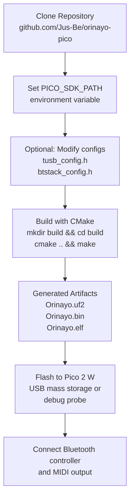
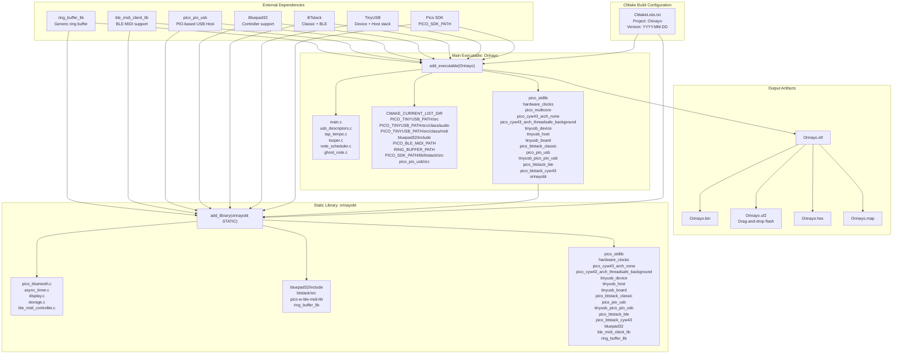
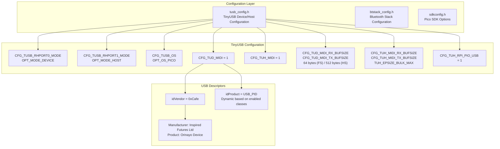
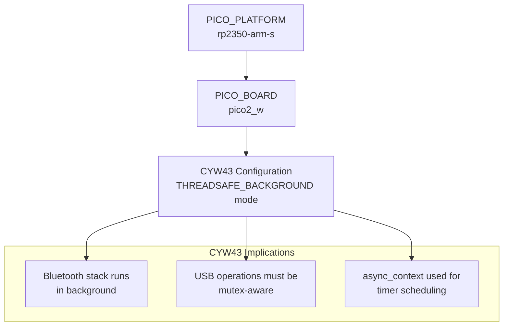
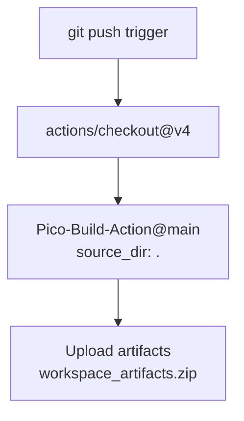

# Getting Started

> **Relevant source files**
> * [.github/workflows/build.yml](https://github.com/Jus-Be/orinayo-pico/blob/6dde5a75/.github/workflows/build.yml)
> * [.github/workflows/build.yml.experiment](https://github.com/Jus-Be/orinayo-pico/blob/6dde5a75/.github/workflows/build.yml.experiment)
> * [.gitignore](https://github.com/Jus-Be/orinayo-pico/blob/6dde5a75/.gitignore)
> * [CMakeLists.txt](https://github.com/Jus-Be/orinayo-pico/blob/6dde5a75/CMakeLists.txt)
> * [Dockerfile](https://github.com/Jus-Be/orinayo-pico/blob/6dde5a75/Dockerfile)
> * [Hiroyuki_OYAMA_license.md](https://github.com/Jus-Be/orinayo-pico/blob/6dde5a75/Hiroyuki_OYAMA_license.md?plain=1)
> * [README.md](https://github.com/Jus-Be/orinayo-pico/blob/6dde5a75/README.md?plain=1)
> * [tusb_config.h](https://github.com/Jus-Be/orinayo-pico/blob/6dde5a75/tusb_config.h)
> * [usb_descriptors.c](https://github.com/Jus-Be/orinayo-pico/blob/6dde5a75/usb_descriptors.c)

This page provides an overview of the prerequisites, build process, and initial configuration needed to develop and deploy the Orinayo firmware. It covers the essential steps from cloning the repository to flashing a working firmware image onto the Raspberry Pi Pico 2 W hardware.

For detailed system architecture, see [Architecture](./3-architecture.md). For operational details about individual subsystems, see [Bluetooth Input System](./4-bluetooth-input-system.md) and [Musical Processing](./5-musical-processing.md).

## Scope and Prerequisites

The Orinayo firmware targets the **Raspberry Pi Pico 2 W** (RP2350-based board with CYW43 Bluetooth/WiFi chip) and requires the following components:

| Component | Requirement | Notes |
| --- | --- | --- |
| **Target Hardware** | Raspberry Pi Pico 2 W | RP2350 dual-core ARM, CYW43 wireless chip |
| **Build System** | CMake 3.12+ | Configured in [CMakeLists.txt L20](https://github.com/Jus-Be/orinayo-pico/blob/6dde5a75/CMakeLists.txt#L20-L20) |
| **SDK** | Pico SDK | Must be installed with `PICO_SDK_PATH` environment variable set |
| **Compiler** | ARM GCC toolchain | Included with Pico SDK setup |
| **Input Devices** | Bluetooth controllers | HID gamepads or specialized MIDI devices (see [Hardware Requirements](./2.1-hardware-requirements.md)) |
| **Output Devices** | USB host or UART MIDI | DAW, hardware synthesizer, or both simultaneously |

The build system is configured for the **rp2350-arm-s** platform and **pico2_w** board as specified in [CMakeLists.txt L23-L24](https://github.com/Jus-Be/orinayo-pico/blob/6dde5a75/CMakeLists.txt#L23-L24)

**Sources:** [CMakeLists.txt L19-L24](https://github.com/Jus-Be/orinayo-pico/blob/6dde5a75/CMakeLists.txt#L19-L24)

## Quick Start Workflow

```mermaid
flowchart TD

Clone["Clone Repository<br>github.com/Jus-Be/orinayo-pico"]
SDK["Set PICO_SDK_PATH<br>environment variable"]
Config["Optional: Modify configs<br>tusb_config.h<br>btstack_config.h"]
Build["Build with CMake<br>mkdir build && cd build<br>cmake .. && make"]
Artifacts["Generated Artifacts<br>Orinayo.uf2<br>Orinayo.bin<br>Orinayo.elf"]
Flash["Flash to Pico 2 W<br>USB mass storage or<br>debug probe"]
Run["Connect Bluetooth controller<br>and MIDI output"]

Clone --> SDK
SDK --> Config
Config --> Build
Build --> Artifacts
Artifacts --> Flash
Flash --> Run
```

The workflow follows a standard embedded development pattern with three configuration points before building. For automated builds, see the GitHub Actions workflow in [.github/workflows/build.yml](https://github.com/Jus-Be/orinayo-pico/blob/6dde5a75/.github/workflows/build.yml)

**Sources:** [CMakeLists.txt L1-L67](https://github.com/Jus-Be/orinayo-pico/blob/6dde5a75/CMakeLists.txt#L1-L67)

 [.github/workflows/build.yml L1-L25](https://github.com/Jus-Be/orinayo-pico/blob/6dde5a75/.github/workflows/build.yml#L1-L25)

## Build System Architecture

The build system implements a **two-tier library architecture** to separate Bluetooth infrastructure from application logic:

```mermaid
flowchart TD

CMakeRoot["CMakeLists.txt<br>Project: Orinayo<br>Version: YYYY.MM.DD"]
BTLib["add_library(orinayobt STATIC)"]
BTSources["pico_bluetooth.c<br>async_timer.c<br>display.c<br>storage.c<br>ble_midi_controller.c"]
BTIncludes["bluepad32/include<br>btstack/src<br>pico-w-ble-midi-lib<br>ring_buffer_lib"]
BTLinks["pico_stdlib<br>hardware_clocks<br>pico_cyw43_arch_none<br>pico_cyw43_arch_threadsafe_background<br>tinyusb_device<br>tinyusb_host<br>tinyusb_board<br>pico_btstack_classic<br>pico_pio_usb<br>tinyusb_pico_pio_usb<br>pico_btstack_ble<br>pico_btstack_cyw43<br>bluepad32<br>ble_midi_client_lib<br>ring_buffer_lib"]
MainExe["add_executable(Orinayo)"]
MainSources["main.c<br>usb_descriptors.c<br>tap_tempo.c<br>looper.c<br>note_scheduler.c<br>ghost_note.c"]
MainIncludes["CMAKE_CURRENT_LIST_DIR<br>PICO_TINYUSB_PATH/src<br>PICO_TINYUSB_PATH/src/class/audio<br>PICO_TINYUSB_PATH/src/class/midi<br>bluepad32/include<br>PICO_BLE_MIDI_PATH<br>RING_BUFFER_PATH<br>PICO_SDK_PATH/lib/btstack/src<br>pico_pio_usb/src"]
MainLinks["pico_stdlib<br>hardware_clocks<br>pico_multicore<br>pico_cyw43_arch_none<br>pico_cyw43_arch_threadsafe_background<br>tinyusb_device<br>tinyusb_host<br>tinyusb_board<br>pico_btstack_classic<br>pico_pio_usb<br>tinyusb_pico_pio_usb<br>pico_btstack_ble<br>pico_btstack_cyw43<br>orinayobt"]
PicoSDK["Pico SDK<br>PICO_SDK_PATH"]
TinyUSB["TinyUSB<br>Device + Host stack"]
BTStack["BTstack<br>Classic + BLE"]
Bluepad32["Bluepad32<br>Controller support"]
PicoPioUSB["pico_pio_usb<br>PIO-based USB Host"]
BleMidiClientLib["ble_midi_client_lib<br>BLE MIDI support"]
RingBufferLib["ring_buffer_lib<br>Generic ring buffer"]
ELF["Orinayo.elf"]
BIN["Orinayo.bin"]
UF2["Orinayo.uf2<br>Drag-and-drop flash"]
HEX["Orinayo.hex"]
MAP["Orinayo.map"]

CMakeRoot --> BTLib
CMakeRoot --> MainExe
MainLinks --> BTLib
PicoSDK --> BTLib
PicoSDK --> MainExe
TinyUSB --> BTLib
TinyUSB --> MainExe
BTStack --> BTLib
BTStack --> MainExe
Bluepad32 --> BTLib
Bluepad32 --> MainExe
PicoPioUSB --> BTLib
PicoPioUSB --> MainExe
BleMidiClientLib --> BTLib
BleMidiClientLib --> MainExe
RingBufferLib --> BTLib
RingBufferLib --> MainExe
MainExe --> ELF

subgraph subGraph4 ["Output Artifacts"]
    ELF
    BIN
    UF2
    HEX
    MAP
    ELF --> BIN
    ELF --> UF2
    ELF --> HEX
    ELF --> MAP
end

subgraph subGraph3 ["External Dependencies"]
    PicoSDK
    TinyUSB
    BTStack
    Bluepad32
    PicoPioUSB
    BleMidiClientLib
    RingBufferLib
end

subgraph subGraph2 ["Main Executable: Orinayo"]
    MainExe
    MainSources
    MainIncludes
    MainLinks
    MainExe --> MainSources
    MainExe --> MainIncludes
    MainExe --> MainLinks
end

subgraph subGraph1 ["Static Library: orinayobt"]
    BTLib
    BTSources
    BTIncludes
    BTLinks
    BTLib --> BTSources
    BTLib --> BTIncludes
    BTLib --> BTLinks
end

subgraph subGraph0 ["CMake Build Configuration"]
    CMakeRoot
end
```

### Build Target Details

| Target | Type | Source Files | Purpose |
| --- | --- | --- | --- |
| **orinayobt** | Static library | [pico_bluetooth.c, async_timer.c, display.c, storage.c, ble_midi_controller.c](https://github.com/Jus-Be/orinayo-pico/blob/6dde5a75/pico_bluetooth.c, async_timer.c, display.c, storage.c, ble_midi_controller.c) | Bluetooth infrastructure and hardware abstraction ([CMakeLists.txt L68](https://github.com/Jus-Be/orinayo-pico/blob/6dde5a75/CMakeLists.txt#L68-L68)   ) |
| **Orinayo** | Executable | [main.c, usb_descriptors.c, tap_tempo.c, looper.c, note_scheduler.c, ghost_note.c](https://github.com/Jus-Be/orinayo-pico/blob/6dde5a75/main.c, usb_descriptors.c, tap_tempo.c, looper.c, note_scheduler.c, ghost_note.c) | Application logic and musical processing ([CMakeLists.txt L73](https://github.com/Jus-Be/orinayo-pico/blob/6dde5a75/CMakeLists.txt#L73-L73)   ) |

The separation allows the Bluetooth subsystem to be compiled with specific flags (e.g., `PICO_CYW43_ARCH_THREADSAFE_BACKGROUND` defined at [CMakeLists.txt L71](https://github.com/Jus-Be/orinayo-pico/blob/6dde5a75/CMakeLists.txt#L71-L71)

) without affecting the main application.

**Sources:** [CMakeLists.txt L68-L85](https://github.com/Jus-Be/orinayo-pico/blob/6dde5a75/CMakeLists.txt#L68-L85)

## Configuration Files Overview

Three configuration headers control different aspects of the system:

```mermaid
flowchart TD

TUSB["tusb_config.h<br>TinyUSB Device/Host Configuration"]
BTSTACK["btstack_config.h<br>Bluetooth Stack Configuration"]
SDK["sdkconfig.h<br>Pico SDK Options"]
TUSBDeviceMode["CFG_TUSB_RHPORT0_MODE<br>OPT_MODE_DEVICE"]
TUSBHostMode["CFG_TUSB_RHPORT1_MODE<br>OPT_MODE_HOST"]
TUSBOS["CFG_TUSB_OS<br>OPT_OS_PICO"]
MIDIEnableDevice["CFG_TUD_MIDI = 1"]
MIDIEnableHost["CFG_TUH_MIDI = 1"]
MIDIBufDevice["CFG_TUD_MIDI_RX_BUFSIZE<br>CFG_TUD_MIDI_TX_BUFSIZE<br>64 bytes (FS) / 512 bytes (HS)"]
MIDIBufHost["CFG_TUH_MIDI_RX_BUFSIZE<br>CFG_TUH_MIDI_TX_BUFSIZE<br>TUH_EPSIZE_BULK_MAX"]
PioUsbHost["CFG_TUH_RPI_PIO_USB = 1"]
VID["idVendor = 0xCafe"]
PID["idProduct = USB_PID<br>Dynamic based on enabled classes"]
Strings["Manufacturer: Inspired Futures Ltd<br>Product: Orinayo Device"]

TUSB --> TUSBDeviceMode
TUSB --> TUSBHostMode
TUSB --> TUSBOS
TUSB --> MIDIEnableDevice
TUSB --> MIDIEnableHost
TUSB --> MIDIBufDevice
TUSB --> MIDIBufHost
TUSB --> PioUsbHost
MIDIEnableDevice --> VID
MIDIEnableDevice --> PID

subgraph subGraph2 ["USB Descriptors"]
    VID
    PID
    Strings
    VID --> Strings
end

subgraph subGraph1 ["TinyUSB Configuration"]
    TUSBDeviceMode
    TUSBHostMode
    TUSBOS
    MIDIEnableDevice
    MIDIEnableHost
    MIDIBufDevice
    MIDIBufHost
    PioUsbHost
end

subgraph subGraph0 ["Configuration Layer"]
    TUSB
    BTSTACK
    SDK
end
```

### Key Configuration Points

| File | Key Settings | Line References |
| --- | --- | --- |
| **tusb_config.h** | Dual-role USB (Device + Host) enabled | [tusb_config.h L50-L51](https://github.com/Jus-Be/orinayo-pico/blob/6dde5a75/tusb_config.h#L50-L51) |
|  | USB Device MIDI class enabled, CDC/HID disabled | [tusb_config.h L80-L84](https://github.com/Jus-Be/orinayo-pico/blob/6dde5a75/tusb_config.h#L80-L84) |
|  | USB Device MIDI buffer sizes (64/512 bytes) | [tusb_config.h L95-L96](https://github.com/Jus-Be/orinayo-pico/blob/6dde5a75/tusb_config.h#L95-L96) |
|  | USB Host MIDI class enabled | [tusb_config.h L111](https://github.com/Jus-Be/orinayo-pico/blob/6dde5a75/tusb_config.h#L111-L111) |
|  | USB Host MIDI buffer sizes (`TUH_EPSIZE_BULK_MAX`) | [tusb_config.h L116-L117](https://github.com/Jus-Be/orinayo-pico/blob/6dde5a75/tusb_config.h#L116-L117) |
|  | PIO-USB enabled for host functionality | [tusb_config.h L103](https://github.com/Jus-Be/orinayo-pico/blob/6dde5a75/tusb_config.h#L103-L103) |
| **usb_descriptors.c** | USB VID: `0xCafe` | [usb_descriptors.c L51](https://github.com/Jus-Be/orinayo-pico/blob/6dde5a75/usb_descriptors.c#L51-L51) |
|  | USB PID: Dynamic bitmap | [usb_descriptors.c L35-L36](https://github.com/Jus-Be/orinayo-pico/blob/6dde5a75/usb_descriptors.c#L35-L36) |
|  | Device strings and metadata | [usb_descriptors.c L131-L139](https://github.com/Jus-Be/orinayo-pico/blob/6dde5a75/usb_descriptors.c#L131-L139) |

The USB Product ID is dynamically calculated based on enabled TinyUSB device classes using a bitmap at [usb_descriptors.c L34-L36](https://github.com/Jus-Be/orinayo-pico/blob/6dde5a75/usb_descriptors.c#L34-L36)

 allowing the same vendor ID to support different interface configurations.

**Sources:** [tusb_config.h L26-L117](https://github.com/Jus-Be/orinayo-pico/blob/6dde5a75/tusb_config.h#L26-L117)

 [usb_descriptors.c L28-L67](https://github.com/Jus-Be/orinayo-pico/blob/6dde5a75/usb_descriptors.c#L28-L67)

 [usb_descriptors.c L131-L139](https://github.com/Jus-Be/orinayo-pico/blob/6dde5a75/usb_descriptors.c#L131-L139)

## Platform Configuration

The build targets the **RP2350** platform with specific settings:

```mermaid
flowchart TD

Platform["PICO_PLATFORM<br>rp2350-arm-s"]
Board["PICO_BOARD<br>pico2_w"]
CYW43["CYW43 Configuration<br>THREADSAFE_BACKGROUND mode"]
BTThread["Bluetooth stack runs<br>in background"]
USBSafe["USB operations must be<br>mutex-aware"]
AsyncCtx["async_context used for<br>timer scheduling"]

Platform --> Board
Board --> CYW43
CYW43 --> BTThread
CYW43 --> USBSafe
CYW43 --> AsyncCtx

subgraph subGraph0 ["CYW43 Implications"]
    BTThread
    USBSafe
    AsyncCtx
end
```

The `PICO_CYW43_ARCH_THREADSAFE_BACKGROUND` define at [CMakeLists.txt L71](https://github.com/Jus-Be/orinayo-pico/blob/6dde5a75/CMakeLists.txt#L71-L71)

 enables background processing of Bluetooth events, which is critical for maintaining low-latency MIDI output while handling wireless communication. This configuration requires careful synchronization in the application code (see [Synchronization Primitives](./8.3-synchronization-primitives.md)).

**Sources:** [CMakeLists.txt L23-L24](https://github.com/Jus-Be/orinayo-pico/blob/6dde5a75/CMakeLists.txt#L23-L24)

 [CMakeLists.txt L71](https://github.com/Jus-Be/orinayo-pico/blob/6dde5a75/CMakeLists.txt#L71-L71)

## CI/CD Pipeline

The repository includes a GitHub Actions workflow for automated building:

```mermaid
flowchart TD

Push["git push trigger"]
Checkout["actions/checkout@v4"]
Build["Pico-Build-Action@main<br>source_dir: ."]
Artifacts["Upload artifacts<br>workspace_artifacts.zip"]

Push --> Checkout
Checkout --> Build
Build --> Artifacts
```

The workflow at [.github/workflows/build.yml](https://github.com/Jus-Be/orinayo-pico/blob/6dde5a75/.github/workflows/build.yml)

 automatically builds the firmware on every push, using the `deleolajide/Pico-Build-Action@main` action. Build artifacts (UF2, BIN, HEX, ELF, MAP files) are uploaded and available for download from the Actions tab.

**Sources:** [.github/workflows/build.yml L1-L25](https://github.com/Jus-Be/orinayo-pico/blob/6dde5a75/.github/workflows/build.yml#L1-L25)

## Next Steps

For detailed information on specific aspects of getting started:

* **[Hardware Requirements](./2.1-hardware-requirements.md)**: Detailed specifications for Pico 2 W, supported Bluetooth controllers, and MIDI output connections
* **[Building and Flashing](./2.2-building-and-flashing.md)**: Step-by-step build instructions, flashing methods, and verification procedures
* **[Configuration](./2.3-configuration.md)**: In-depth guide to configuration options in sdkconfig.h, tusb_config.h, and btstack_config.h

Once the firmware is built and flashed, refer to [Bluetooth Input System](./4-bluetooth-input-system.md) for pairing controllers and [MIDI Output System](./6-midi-output-system.md) for connecting synthesizers.

**Sources:** [CMakeLists.txt L1-L96](https://github.com/Jus-Be/orinayo-pico/blob/6dde5a75/CMakeLists.txt#L1-L96)

 [.github/workflows/build.yml L1-L25](https://github.com/Jus-Be/orinayo-pico/blob/6dde5a75/.github/workflows/build.yml#L1-L25)

 [tusb_config.h L26-L117](https://github.com/Jus-Be/orinayo-pico/blob/6dde5a75/tusb_config.h#L26-L117)

 [usb_descriptors.c L1-L180](https://github.com/Jus-Be/orinayo-pico/blob/6dde5a75/usb_descriptors.c#L1-L180)