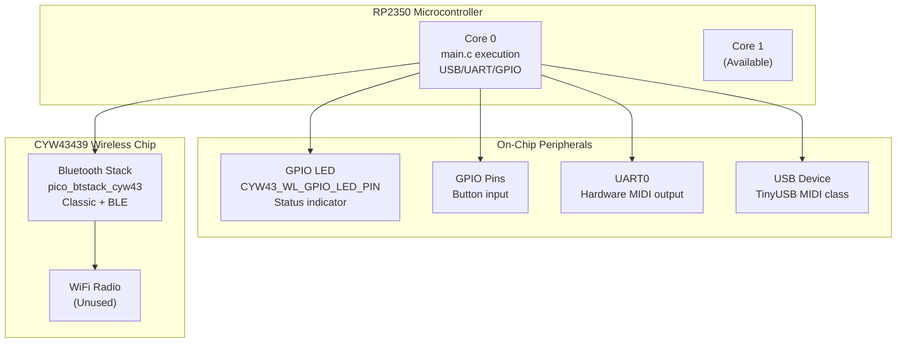
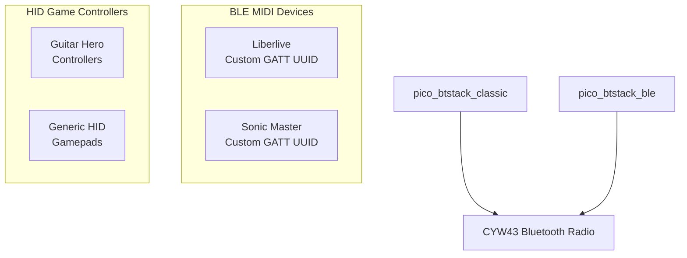
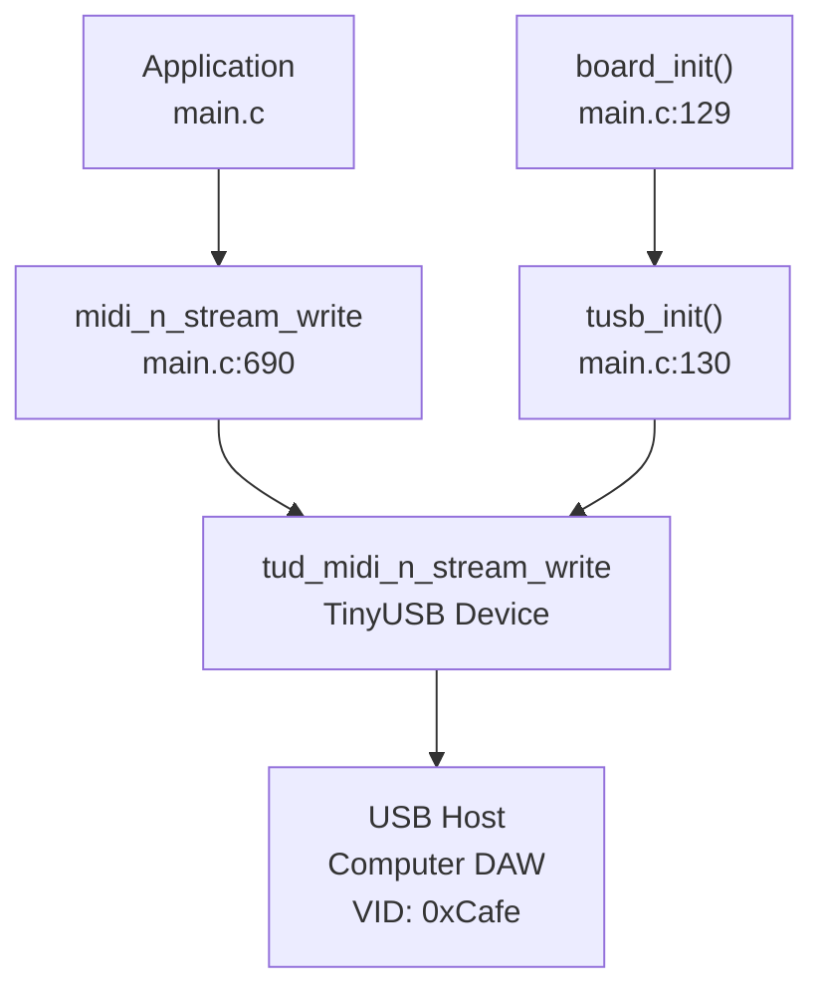
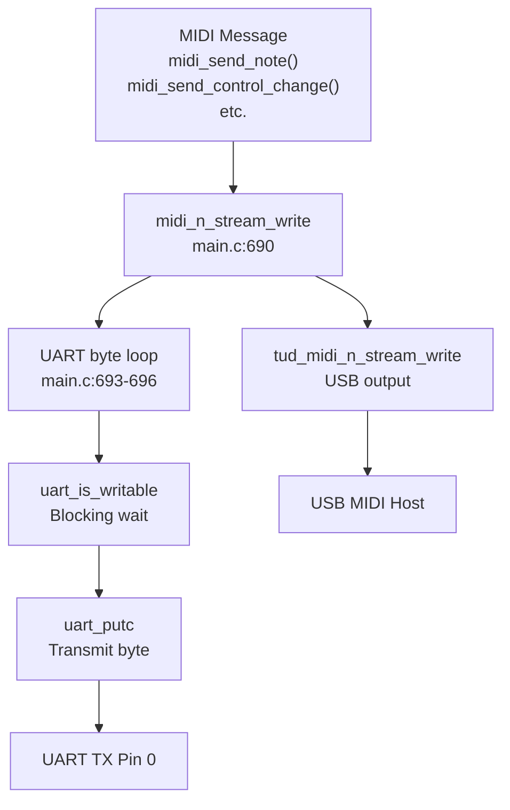
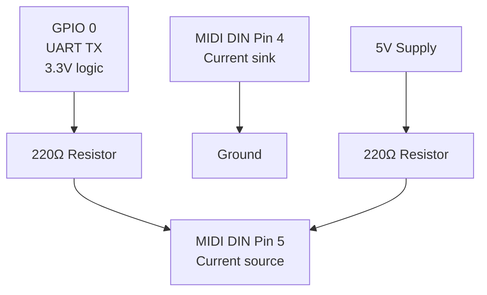

# Hardware Requirements

> **Relevant source files**
> * [CMakeLists.txt](https://github.com/Jus-Be/orinayo-pico/blob/122fa496/CMakeLists.txt)
> * [main.c](https://github.com/Jus-Be/orinayo-pico/blob/122fa496/main.c)
> * [pico_bluetooth.h](https://github.com/Jus-Be/orinayo-pico/blob/122fa496/pico_bluetooth.h)
> * [sdkconfig.h](https://github.com/Jus-Be/orinayo-pico/blob/122fa496/sdkconfig.h)
> * [seqlock.h](https://github.com/Jus-Be/orinayo-pico/blob/122fa496/seqlock.h)

This document specifies the physical hardware components required to build and operate the Orinayo Bluetooth-to-MIDI gateway system. It covers the microcontroller platform, supported Bluetooth input devices, MIDI output interfaces, and optional physical controls.

For software build requirements and dependencies, see [Building and Flashing](./2.2-building-and-flashing.md). For system configuration options, see [Configuration](./2.3-configuration.md).

---

## Core Hardware Platform

### Raspberry Pi Pico 2 W

The system requires a **Raspberry Pi Pico 2 W** board with the following specifications:

| Component | Specification | Usage in System |
| --- | --- | --- |
| **Microcontroller** | RP2350 dual-core ARM Cortex-M33 | Core 0: main application, USB, UART. Core 1: available |
| **Wireless Chip** | Infineon CYW43439 | Bluetooth Classic + BLE connectivity |
| **Platform Target** | `rp2350-arm-s` | Secure ARM build configuration |
| **Flash Memory** | 2MB+ | Firmware storage and pattern persistence |
| **RAM** | 520KB SRAM | Runtime operation and buffers |

The build system explicitly targets the `pico2_w` board variant with the `rp2350-arm-s` platform, as specified in [CMakeLists.txt L23-L24](https://github.com/Jus-Be/orinayo-pico/blob/122fa496/CMakeLists.txt#L23-L24)



**Diagram: Pico 2 W Hardware Architecture**

**Sources:** [CMakeLists.txt L23-L24](https://github.com/Jus-Be/orinayo-pico/blob/122fa496/CMakeLists.txt#L23-L24)

 [main.c L24-L26](https://github.com/Jus-Be/orinayo-pico/blob/122fa496/main.c#L24-L26)

 [main.c L40-L42](https://github.com/Jus-Be/orinayo-pico/blob/122fa496/main.c#L40-L42)

### CYW43 Wireless Configuration

The system uses the `pico_cyw43_arch_threadsafe_background` architecture, enabling Bluetooth operations to run asynchronously without blocking the main application loop. This is critical for maintaining MIDI timing precision while processing Bluetooth HCI events.

The onboard LED (accessed via `CYW43_WL_GPIO_LED_PIN`) provides visual feedback for USB connection status and MIDI drum mode state, as implemented in [main.c L47-L55](https://github.com/Jus-Be/orinayo-pico/blob/122fa496/main.c#L47-L55)

 and [main.c L155-L166](https://github.com/Jus-Be/orinayo-pico/blob/122fa496/main.c#L155-L166)

**Sources:** [CMakeLists.txt L41-L42](https://github.com/Jus-Be/orinayo-pico/blob/122fa496/CMakeLists.txt#L41-L42)

 [main.c L40-L54](https://github.com/Jus-Be/orinayo-pico/blob/122fa496/main.c#L40-L54)

---

## Bluetooth Input Devices

The system supports three categories of Bluetooth input devices, each handled by different subsystems:

### Supported Device Types



**Diagram: Bluetooth Device Support Architecture**

| Device Category | Protocol | Library/Handler | Max Connections |
| --- | --- | --- | --- |
| **HID Game Controllers** | Bluetooth Classic | `bluepad32` library | 1 (configurable) |
| **Liberlive MIDI** | BLE GATT | `uni_bt_le.c` | Shared limit |
| **Sonic Master MIDI** | BLE GATT | `uni_bt_le.c` | Shared limit |

The maximum number of simultaneous Bluetooth devices is configured via `CONFIG_BLUEPAD32_MAX_DEVICES` in [sdkconfig.h L8](https://github.com/Jus-Be/orinayo-pico/blob/122fa496/sdkconfig.h#L8-L8)

 currently set to 1.

**Sources:** [sdkconfig.h L4-L11](https://github.com/Jus-Be/orinayo-pico/blob/122fa496/sdkconfig.h#L4-L11)

 [CMakeLists.txt L41](https://github.com/Jus-Be/orinayo-pico/blob/122fa496/CMakeLists.txt#L41-L41)

 [pico_bluetooth.h L1-L6](https://github.com/Jus-Be/orinayo-pico/blob/122fa496/pico_bluetooth.h#L1-L6)

### Bluetooth Configuration Parameters

Key Bluetooth stack configuration from [sdkconfig.h](https://github.com/Jus-Be/orinayo-pico/blob/122fa496/sdkconfig.h)

:

* **Security Level**: `CONFIG_BLUEPAD32_GAP_SECURITY 1` enables pairing/bonding
* **BLE Default**: `CONFIG_BLUEPAD32_ENABLE_BLE_BY_DEFAULT 1` allows BLE device discovery
* **Allowlist Size**: `CONFIG_BLUEPAD32_MAX_ALLOWLIST 1` for device filtering
* **Log Level**: `CONFIG_BLUEPAD32_LOG_LEVEL 0` (INFO level)

**Sources:** [sdkconfig.h L8-L11](https://github.com/Jus-Be/orinayo-pico/blob/122fa496/sdkconfig.h#L8-L11)

---

## MIDI Output Interfaces

The system provides simultaneous dual MIDI output through USB and hardware UART, implemented in the `midi_n_stream_write()` function at [main.c L690-L697](https://github.com/Jus-Be/orinayo-pico/blob/122fa496/main.c#L690-L697)

### USB MIDI Output



**Diagram: USB MIDI Output Path**

| Parameter | Value | Configuration Location |
| --- | --- | --- |
| **USB Device Class** | MIDI | TinyUSB device library |
| **Interface Number** | 0 (default) | `tud_midi_n_stream_write()` first parameter |
| **Cable Number** | 0 | `tud_midi_n_stream_write()` second parameter |
| **Vendor ID** | 0xCafe | `usb_descriptors.c` |
| **Product ID** | Dynamic | Based on enabled features |

The USB connection state controls the onboard LED via callbacks defined at [main.c L180-L204](https://github.com/Jus-Be/orinayo-pico/blob/122fa496/main.c#L180-L204)

**Sources:** [main.c L129-L130](https://github.com/Jus-Be/orinayo-pico/blob/122fa496/main.c#L129-L130)

 [main.c L690-L691](https://github.com/Jus-Be/orinayo-pico/blob/122fa496/main.c#L690-L691)

 [main.c L180-L204](https://github.com/Jus-Be/orinayo-pico/blob/122fa496/main.c#L180-L204)

### UART MIDI Output

Hardware UART provides a standard MIDI DIN-compatible output at 31,250 baud, suitable for connecting to hardware synthesizers and sound modules.

#### UART Pin Assignment

| Signal | GPIO Pin | Function | Configuration |
| --- | --- | --- | --- |
| **TX** | GPIO 0 | UART0 Transmit | `UART_TX_PIN` |
| **RX** | GPIO 1 | UART0 Receive (unused) | `UART_RX_PIN` |

Pin configuration is defined at [main.c L58-L62](https://github.com/Jus-Be/orinayo-pico/blob/122fa496/main.c#L58-L62)

 and initialized at [main.c L146-L150](https://github.com/Jus-Be/orinayo-pico/blob/122fa496/main.c#L146-L150)

#### UART Configuration

```
// From main.c:58-62
#define UART_ID uart0
#define BAUD_RATE 31250      // Standard MIDI baud rate
#define UART_TX_PIN 0
#define UART_RX_PIN 1
#define GPIO_FUNC_UART 2
```

The UART initialization sequence at [main.c L146-L150](https://github.com/Jus-Be/orinayo-pico/blob/122fa496/main.c#L146-L150)

 configures:

* **Baud Rate**: 31,250 baud (standard MIDI)
* **FIFO**: Enabled for buffering
* **CRLF Translation**: Disabled (binary MIDI data)
* **Function**: GPIO pins set to `GPIO_FUNC_UART` mode

MIDI data transmission occurs in [main.c L693-L696](https://github.com/Jus-Be/orinayo-pico/blob/122fa496/main.c#L693-L696)

 where each byte is written with blocking wait for UART writability.

**Sources:** [main.c L58-L62](https://github.com/Jus-Be/orinayo-pico/blob/122fa496/main.c#L58-L62)

 [main.c L146-L150](https://github.com/Jus-Be/orinayo-pico/blob/122fa496/main.c#L146-L150)

 [main.c L693-L696](https://github.com/Jus-Be/orinayo-pico/blob/122fa496/main.c#L693-L696)

### Dual Output Synchronization



**Diagram: Dual Output Data Flow**

All MIDI output functions (note on/off, control change, program change, SysEx) converge at `midi_n_stream_write()`, ensuring USB and UART receive identical MIDI streams with guaranteed ordering.

**Sources:** [main.c L690-L697](https://github.com/Jus-Be/orinayo-pico/blob/122fa496/main.c#L690-L697)

 [main.c L480-L522](https://github.com/Jus-Be/orinayo-pico/blob/122fa496/main.c#L480-L522)

---

## Optional Physical Components

### Button Input

The system supports GPIO button input for controlling looper functions (record, play, tempo tap). While pin assignments are not hardcoded in the provided files, the infrastructure for button handling is present in the codebase.

Button events are processed by:

* `looper.c` for pattern recording and playback
* `tap_tempo.c` for BPM detection
* Various operational mode handlers in `pico_bluetooth.c`

**Sources:** [main.c L18-L19](https://github.com/Jus-Be/orinayo-pico/blob/122fa496/main.c#L18-L19)

### External MIDI Hardware Circuit

To connect the UART output to standard 5-pin MIDI DIN hardware, an external circuit is required:



**Diagram: UART to MIDI DIN Hardware Interface**

This circuit converts the 3.3V UART signal to MIDI current loop format (5mA nominal).

---

## Summary Hardware Checklist

### Required Components

* **Raspberry Pi Pico 2 W** board (RP2350, pico2_w variant)
* **USB Cable** (Micro-B or USB-C depending on board revision) for power and USB MIDI
* **Bluetooth Input Device** (Guitar Hero controller, Liberlive, or Sonic Master)

### Optional Components

* **UART to MIDI Circuit** (220Ω resistors, 5-pin DIN connector) for hardware MIDI output
* **Physical Buttons** connected to GPIO for looper control
* **LED Indicators** (onboard LED used by default)

### Not Required

* **External Crystal/Oscillator**: RP2350 uses internal oscillators
* **WiFi Antenna**: CYW43 WiFi functionality is unused
* **External Memory**: 2MB onboard flash is sufficient
* **Power Supply**: USB bus power (5V) is adequate for typical operation

---

## Hardware Setup Sequence

1. **Connect Pico 2 W** to computer via USB
2. **Flash firmware** using drag-and-drop UF2 file (see [Building and Flashing](./2.2-building-and-flashing.md))
3. **Power cycle** the device to start Bluetooth initialization
4. **Pair Bluetooth input device** (LED indicates connection status)
5. **(Optional)** Connect UART TX (Pin 0) to MIDI DIN circuit for hardware output
6. **(Optional)** Connect GPIO buttons for looper control

The initialization sequence in [main.c L125-L143](https://github.com/Jus-Be/orinayo-pico/blob/122fa496/main.c#L125-L143)

 performs LED initialization, board setup, TinyUSB initialization, Bluetooth stack initialization, and UART configuration in that order.

**Sources:** [main.c L125-L151](https://github.com/Jus-Be/orinayo-pico/blob/122fa496/main.c#L125-L151)