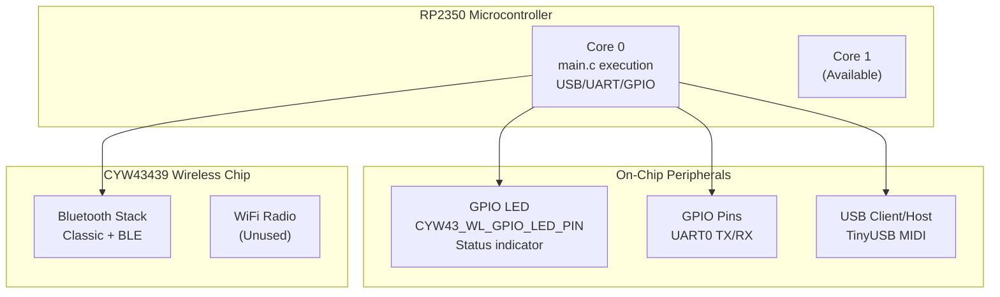
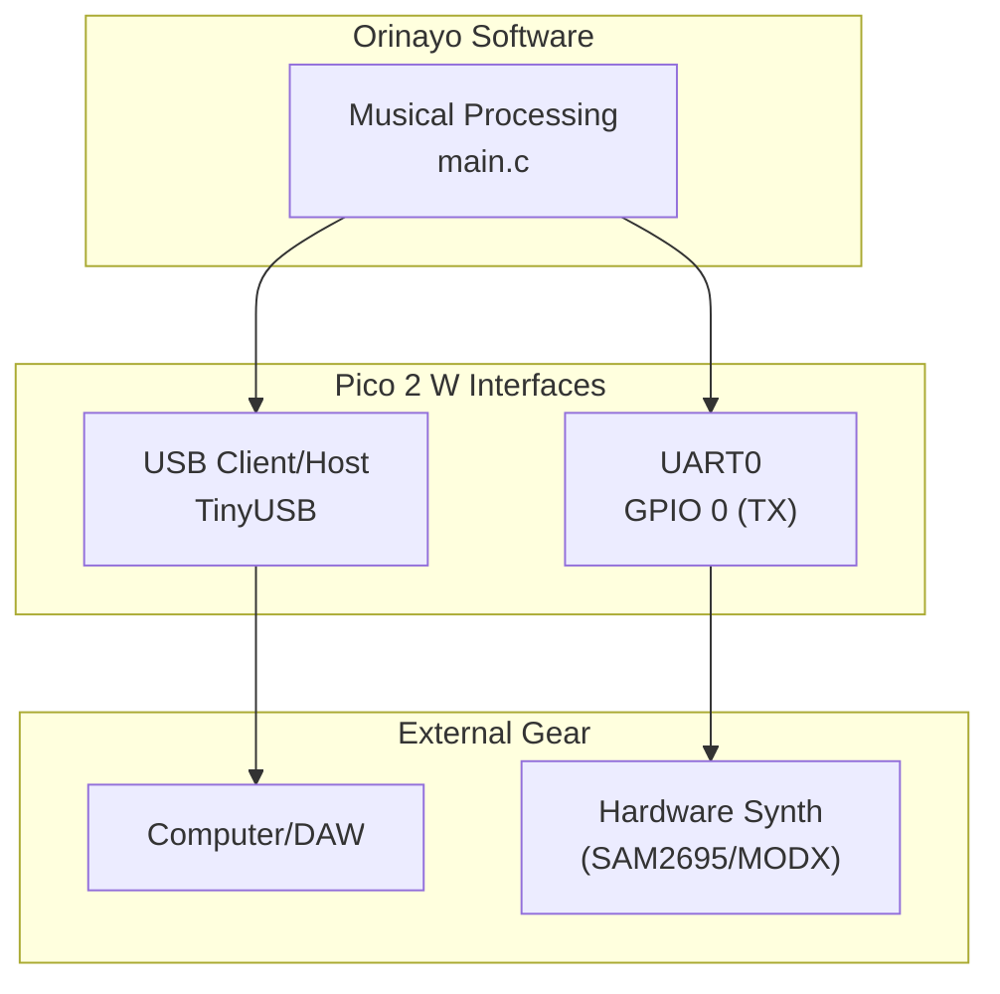

# Hardware Requirements

> **Relevant source files**
> * [Hiroyuki_OYAMA_license.md](https://github.com/Jus-Be/orinayo-pico/blob/6dde5a75/Hiroyuki_OYAMA_license.md?plain=1)
> * [README.md](https://github.com/Jus-Be/orinayo-pico/blob/6dde5a75/README.md?plain=1)
> * [btstack_config.h](https://github.com/Jus-Be/orinayo-pico/blob/6dde5a75/btstack_config.h)
> * [debug.h](https://github.com/Jus-Be/orinayo-pico/blob/6dde5a75/debug.h)
> * [pico_bluetooth.h](https://github.com/Jus-Be/orinayo-pico/blob/6dde5a75/pico_bluetooth.h)
> * [sdkconfig.h](https://github.com/Jus-Be/orinayo-pico/blob/6dde5a75/sdkconfig.h)
> * [seqlock.h](https://github.com/Jus-Be/orinayo-pico/blob/6dde5a75/seqlock.h)

This document specifies the physical hardware components required to build and operate the Orinayo Bluetooth-to-MIDI gateway system. It covers the microcontroller platform, supported Bluetooth input devices, MIDI output interfaces, and physical connectivity.

For software build requirements and dependencies, see [Building and Flashing](https://github.com/Jus-Be/orinayo-pico/blob/6dde5a75/Building and Flashing)

 For system configuration options, see [Configuration](https://github.com/Jus-Be/orinayo-pico/blob/6dde5a75/Configuration)

---

## Core Hardware Platform

### Raspberry Pi Pico 2 W

The system is specifically designed for the **Raspberry Pi Pico 2 W** board. This board features the RP2350 microcontroller and the CYW43439 wireless chip.

| Component | Specification | Usage in System |
| --- | --- | --- |
| **Microcontroller** | RP2350 dual-core ARM Cortex-M33 | Primary processing, MIDI routing, and chord generation. |
| **Wireless Chip** | Infineon CYW43439 | Bluetooth Classic (HID) and BLE MIDI connectivity. |
| **Flash Memory** | 2MB+ | Firmware storage and persistent looper pattern storage. |
| **RAM** | 520KB SRAM | Runtime operation and sequence buffers. |

The build system explicitly targets the `pico2_w` board variant with the `rp2350-arm-s` platform [README.md L62](https://github.com/Jus-Be/orinayo-pico/blob/6dde5a75/README.md?plain=1#L62-L62)

**Pico 2 W Hardware Architecture**

```mermaid
flowchart TD

Core0["Core 0<br>main.c execution<br>USB/UART/GPIO"]
Core1["Core 1<br>(Available)"]
BT["Bluetooth Stack<br>Classic + BLE"]
WiFi["WiFi Radio<br>(Unused)"]
LED["GPIO LED<br>CYW43_WL_GPIO_LED_PIN<br>Status indicator"]
GPIO["GPIO Pins<br>UART0 TX/RX"]
USB["USB Client/Host<br>TinyUSB MIDI"]

Core0 --> LED
Core0 --> GPIO
Core0 --> USB
Core0 --> BT

subgraph Peripherals ["On-Chip Peripherals"]
    LED
    GPIO
    USB
end

subgraph CYW43 ["CYW43439 Wireless Chip"]
    BT
    WiFi
end

subgraph RP2350 ["RP2350 Microcontroller"]
    Core0
    Core1
end
```

**Sources:** [README.md L62](https://github.com/Jus-Be/orinayo-pico/blob/6dde5a75/README.md?plain=1#L62-L62)

 [sdkconfig.h L5](https://github.com/Jus-Be/orinayo-pico/blob/6dde5a75/sdkconfig.h#L5-L5)

### CYW43 Wireless Configuration

The system utilizes the CYW43439 chip for both Bluetooth Classic and BLE. The Bluetooth stack is configured to support a limited number of simultaneous connections to ensure stability and avoid shared bus overruns with the CYW43 chip [btstack_config.h L61-L64](https://github.com/Jus-Be/orinayo-pico/blob/6dde5a75/btstack_config.h#L61-L64)

**Sources:** [btstack_config.h L61-L68](https://github.com/Jus-Be/orinayo-pico/blob/6dde5a75/btstack_config.h#L61-L68)

 [sdkconfig.h L11](https://github.com/Jus-Be/orinayo-pico/blob/6dde5a75/sdkconfig.h#L11-L11)

---

## Bluetooth Input Devices

Orinayo acts as a gateway for several types of wireless controllers. The system is optimized for low-latency HID and BLE MIDI processing.

### Supported Device Types

| Device Category | Protocol | Examples |
| --- | --- | --- |
| **HID Gamepads** | Bluetooth Classic | Guitar Hero-style controllers (CRKD-Gibson), Generic HID gamepads [README.md L28-L29](https://github.com/Jus-Be/orinayo-pico/blob/6dde5a75/README.md?plain=1#L28-L29) |
| **BLE MIDI** | BLE | Liberlive, Sonic Master, Generic BLE MIDI Controllers [README.md L30-L31](https://github.com/Jus-Be/orinayo-pico/blob/6dde5a75/README.md?plain=1#L30-L31) |

### Bluetooth Stack Configuration

The stack is configured in `sdkconfig.h` and `btstack_config.h` with the following hardware-relevant limits:

* **Max Devices**: Limited to 1 device by default to ensure maximum performance for the primary controller [sdkconfig.h L8](https://github.com/Jus-Be/orinayo-pico/blob/6dde5a75/sdkconfig.h#L8-L8)
* **Security**: GAP Security is enabled for pairing [sdkconfig.h L10](https://github.com/Jus-Be/orinayo-pico/blob/6dde5a75/sdkconfig.h#L10-L10)
* **Protocol Support**: Both BLE and Bluetooth Classic are enabled [btstack_config.h L13-L30](https://github.com/Jus-Be/orinayo-pico/blob/6dde5a75/btstack_config.h#L13-L30)

**Sources:** [sdkconfig.h L8-L11](https://github.com/Jus-Be/orinayo-pico/blob/6dde5a75/sdkconfig.h#L8-L11)

 [btstack_config.h L13-L30](https://github.com/Jus-Be/orinayo-pico/blob/6dde5a75/btstack_config.h#L13-L30)

 [README.md L25-L31](https://github.com/Jus-Be/orinayo-pico/blob/6dde5a75/README.md?plain=1#L25-L31)

---

## MIDI Output Interfaces

The system provides simultaneous dual MIDI output through USB and hardware UART.

### USB MIDI Output

The Pico 2 W acts as a **USB MIDI Client** (connecting to a DAW) and supports **USB MIDI Host** mode (connecting to other MIDI compliant devices) [README.md L36-L37](https://github.com/Jus-Be/orinayo-pico/blob/6dde5a75/README.md?plain=1#L36-L37)

| Interface | Connector | Usage |
| --- | --- | --- |
| **USB Client** | USB-C/Micro-B | Connection to Computer/DAW |
| **USB Host** | USB-A (via adapter) | Connection to Class-Compliant Synths |

### UART MIDI Output

For connection to traditional hardware synthesizers or sound modules (like the M5Stack SAM2695), the system uses the hardware UART0 [README.md L38](https://github.com/Jus-Be/orinayo-pico/blob/6dde5a75/README.md?plain=1#L38-L38)

**UART Pin Assignment**

| Signal | GPIO Pin | Physical Pin | Function |
| --- | --- | --- | --- |
| **TX** | GPIO 0 | Pin 1 | MIDI Transmit (31,250 baud) |
| **RX** | GPIO 1 | Pin 2 | MIDI Receive |

**MIDI Output Data Flow**

```mermaid
flowchart TD

Proc["Musical Processing<br>main.c"]
USB_C["USB Client/Host<br>TinyUSB"]
UART0["UART0<br>GPIO 0 (TX)"]
DAW["Computer/DAW"]
Synth["Hardware Synth<br>(SAM2695/MODX)"]

Proc --> USB_C
Proc --> UART0
USB_C --> DAW
UART0 --> Synth

subgraph External ["External Gear"]
    DAW
    Synth
end

subgraph Hardware_IO ["Pico 2 W Interfaces"]
    USB_C
    UART0
end

subgraph Internal ["Orinayo Software"]
    Proc
end
```

**Sources:** [README.md L33-L38](https://github.com/Jus-Be/orinayo-pico/blob/6dde5a75/README.md?plain=1#L33-L38)

 [pico_bluetooth.h L4-L9](https://github.com/Jus-Be/orinayo-pico/blob/6dde5a75/pico_bluetooth.h#L4-L9)

---

## Summary Hardware Checklist

### Required Components

* **Microcontroller**: Raspberry Pi Pico 2 W (RP2350 based) [README.md L62](https://github.com/Jus-Be/orinayo-pico/blob/6dde5a75/README.md?plain=1#L62-L62)
* **Power/Data**: USB cable for power and MIDI communication.
* **Input**: A supported Bluetooth Classic HID gamepad or BLE MIDI device [README.md L65](https://github.com/Jus-Be/orinayo-pico/blob/6dde5a75/README.md?plain=1#L65-L65)

### Optional Components

* **Hardware MIDI**: 5-pin DIN connector or M5Stack SAM2695 for hardware UART MIDI [README.md L38](https://github.com/Jus-Be/orinayo-pico/blob/6dde5a75/README.md?plain=1#L38-L38)
* **External Synth**: Devices like Yamaha SeqTrak, MODX, or SP404 Mk2 for specific operational modes [README.md L48-L56](https://github.com/Jus-Be/orinayo-pico/blob/6dde5a75/README.md?plain=1#L48-L56)

**Sources:** [README.md L60-L66](https://github.com/Jus-Be/orinayo-pico/blob/6dde5a75/README.md?plain=1#L60-L66)