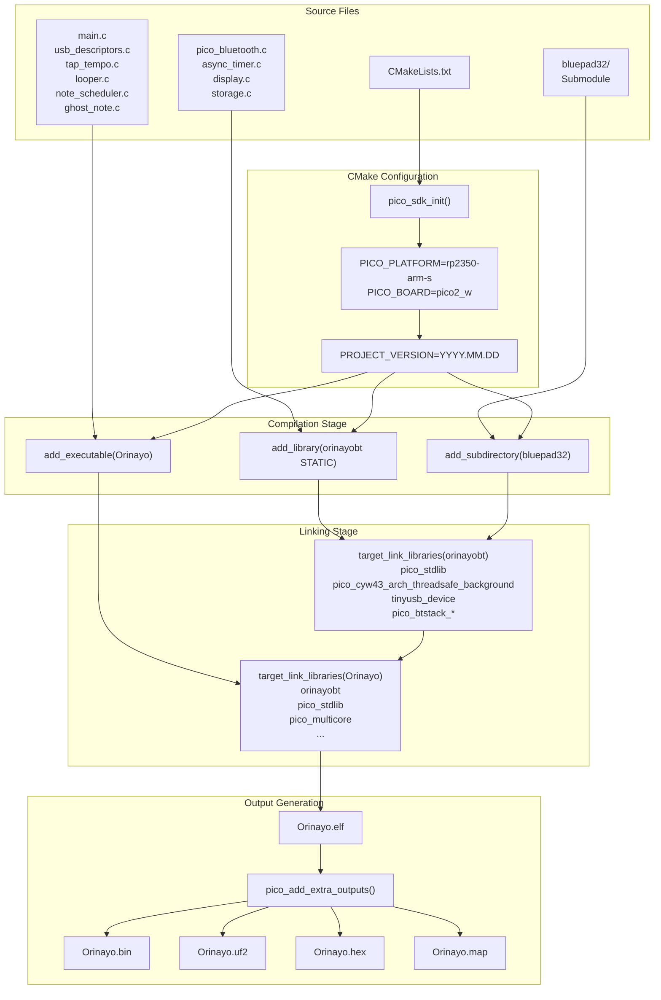
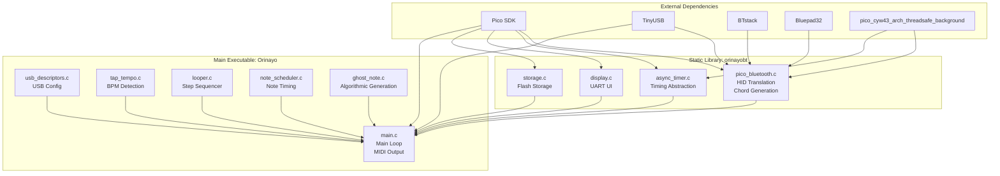
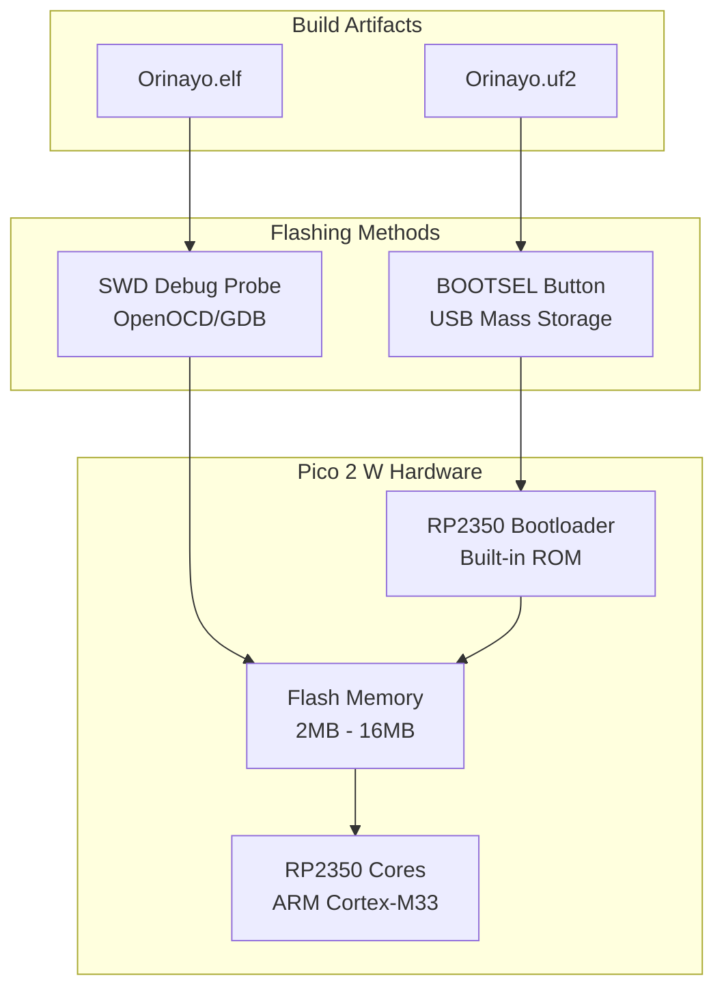
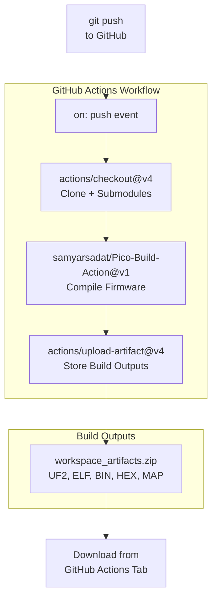

# Building and Flashing

> **Relevant source files**
> * [.github/workflows/build.yml](https://github.com/Jus-Be/orinayo-pico/blob/122fa496/.github/workflows/build.yml)
> * [CMakeLists.txt](https://github.com/Jus-Be/orinayo-pico/blob/122fa496/CMakeLists.txt)
> * [tusb_config.h](https://github.com/Jus-Be/orinayo-pico/blob/122fa496/tusb_config.h)

This page provides step-by-step instructions for building the Orinayo firmware from source and flashing it to a Raspberry Pi Pico 2 W. It covers the CMake build system, output artifacts, and multiple flashing methods. For hardware selection and requirements, see [Hardware Requirements](./2.1-hardware-requirements.md). For post-flash configuration options, see [Configuration](./2.3-configuration.md).

---

## Prerequisites

The Orinayo build system requires the following dependencies:

| Component | Version | Purpose |
| --- | --- | --- |
| **Pico SDK** | Latest | Provides hardware abstraction, TinyUSB, BTstack |
| **CMake** | ≥ 3.12 | Build system generator |
| **GCC ARM Toolchain** | arm-none-eabi-gcc | Cross-compilation for ARM Cortex-M |
| **Git** | Any | Repository cloning and submodule management |

The Pico SDK must be installed and the `PICO_SDK_PATH` environment variable must point to its location. The SDK includes BTstack for Bluetooth functionality and TinyUSB for USB device implementation.

**Sources:** [CMakeLists.txt L19-L36](https://github.com/Jus-Be/orinayo-pico/blob/122fa496/CMakeLists.txt#L19-L36)

---

## Building from Source

### Step 1: Clone Repository

Clone the repository with its submodules (Bluepad32 library):

```sql
git clone https://github.com/Jus-Be/orinayo-pico.git
cd orinayo-pico
git submodule update --init --recursive
```

The `bluepad32` directory must be populated for the build to succeed, as it provides controller profile support.

### Step 2: Configure Build Environment

Ensure the Pico SDK path is set:

```javascript
export PICO_SDK_PATH=/path/to/pico-sdk
```

The build system is configured for the **RP2350** platform in ARM-S mode (not RISC-V) and targets the **Pico 2 W** board specifically:

**Sources:** [CMakeLists.txt L22-L24](https://github.com/Jus-Be/orinayo-pico/blob/122fa496/CMakeLists.txt#L22-L24)

### Step 3: Generate Build Files

Create a build directory and run CMake:

```
mkdir build
cd build
cmake ..
```

CMake will:

* Initialize the Pico SDK ([CMakeLists.txt L36](https://github.com/Jus-Be/orinayo-pico/blob/122fa496/CMakeLists.txt#L36-L36) )
* Set the project version to the current UTC date in `YYYY.MM.DD` format ([CMakeLists.txt L30-L31](https://github.com/Jus-Be/orinayo-pico/blob/122fa496/CMakeLists.txt#L30-L31) )
* Configure the two-tier build architecture (see Build System Architecture below)
* Locate dependencies (TinyUSB, BTstack, Bluepad32)

### Step 4: Compile

Build all targets:

```
make -j$(nproc)
```

Or build only the main executable:

```
make Orinayo
```

The build process compiles:

1. The **orinayobt** static library from `pico_bluetooth.c`, `async_timer.c`, `display.c`, `storage.c`
2. The **Orinayo** executable from `main.c`, `usb_descriptors.c`, `tap_tempo.c`, `looper.c`, `note_scheduler.c`, `ghost_note.c`
3. The **bluepad32** library from its subdirectory

Compilation flags include `-ffunction-sections -fdata-sections` for dead code elimination during linking ([CMakeLists.txt L64-L65](https://github.com/Jus-Be/orinayo-pico/blob/122fa496/CMakeLists.txt#L64-L65)

).

**Sources:** [CMakeLists.txt L38-L56](https://github.com/Jus-Be/orinayo-pico/blob/122fa496/CMakeLists.txt#L38-L56)

### Step 5: Output Artifacts

The build generates the following files in the `build/` directory:

| File | Format | Use Case |
| --- | --- | --- |
| `Orinayo.elf` | ELF executable | Debugging with GDB/SWD |
| `Orinayo.bin` | Raw binary | Direct flash programming |
| `Orinayo.uf2` | USB Flashing Format | Drag-and-drop to Pico |
| `Orinayo.hex` | Intel HEX | Legacy programmers |
| `Orinayo.map` | Linker map | Memory layout analysis |

The UF2 file is the recommended format for end users. The ELF file is useful for debugging with OpenOCD or picoprobe.

**Sources:** [CMakeLists.txt L47-L53](https://github.com/Jus-Be/orinayo-pico/blob/122fa496/CMakeLists.txt#L47-L53)

---

## Build Process Diagram

The following diagram shows the complete build pipeline from source files to flashable artifacts:



**Sources:** [CMakeLists.txt L19-L67](https://github.com/Jus-Be/orinayo-pico/blob/122fa496/CMakeLists.txt#L19-L67)

---

## Build System Architecture

The build system uses a **two-tier architecture** to separate Bluetooth infrastructure from application logic:

### Tier 1: orinayobt Static Library

The `orinayobt` library ([CMakeLists.txt L39](https://github.com/Jus-Be/orinayo-pico/blob/122fa496/CMakeLists.txt#L39-L39)

) encapsulates Bluetooth and system infrastructure:

| Source File | Purpose |
| --- | --- |
| `pico_bluetooth.c` | HID-to-MIDI translation, chord generation, operational modes |
| `async_timer.c` | Asynchronous timer abstraction with CYW43 integration |
| `display.c` | UART status display rendering |
| `storage.c` | Flash-based pattern persistence |

This library links against:

* `pico_stdlib` - Standard Pico SDK functions
* `pico_cyw43_arch_threadsafe_background` - Thread-safe CYW43 wireless chip access
* `tinyusb_device` - USB device stack
* `pico_btstack_classic` - Bluetooth Classic stack
* `pico_btstack_ble` - Bluetooth Low Energy stack
* `pico_btstack_cyw43` - BTstack integration for CYW43
* `bluepad32` - Controller profile library

The compile definition `PICO_CYW43_ARCH_THREADSAFE_BACKGROUND` ([CMakeLists.txt L42](https://github.com/Jus-Be/orinayo-pico/blob/122fa496/CMakeLists.txt#L42-L42)

) enables non-blocking Bluetooth operations critical for real-time MIDI processing.

**Sources:** [CMakeLists.txt L39-L42](https://github.com/Jus-Be/orinayo-pico/blob/122fa496/CMakeLists.txt#L39-L42)

### Tier 2: Orinayo Executable

The main executable ([CMakeLists.txt L44](https://github.com/Jus-Be/orinayo-pico/blob/122fa496/CMakeLists.txt#L44-L44)

) contains application-level musical processing:

| Source File | Purpose |
| --- | --- |
| `main.c` | Main loop, MIDI output coordination, synthesizer control |
| `usb_descriptors.c` | USB device descriptor with dynamic PID |
| `tap_tempo.c` | BPM detection from button taps |
| `looper.c` | 2-bar, 32-step sequencer with 14 drum tracks |
| `note_scheduler.c` | Microsecond-precision note timing |
| `ghost_note.c` | Algorithmic note generation (Euclidean, boundary, fill) |

This executable links against `orinayobt` and all its dependencies, plus `pico_multicore` for potential dual-core support.

**Sources:** [CMakeLists.txt L44-L56](https://github.com/Jus-Be/orinayo-pico/blob/122fa496/CMakeLists.txt#L44-L56)

### Build Architecture Diagram



This architecture allows the Bluetooth infrastructure to be independently maintained and potentially reused in other projects.

**Sources:** [CMakeLists.txt L39-L56](https://github.com/Jus-Be/orinayo-pico/blob/122fa496/CMakeLists.txt#L39-L56)

---

## Flashing to Hardware

### Method 1: UF2 Drag-and-Drop (Recommended)

The UF2 format enables flashing without special tools:

1. **Enter bootloader mode** on the Pico 2 W: * Hold the **BOOTSEL** button while plugging in the USB cable * The Pico will appear as a USB mass storage device named **RPI-RP2**
2. **Copy the UF2 file**: ``` cp build/Orinayo.uf2 /media/RPI-RP2/ ``` Or drag-and-drop `Orinayo.uf2` to the **RPI-RP2** drive in your file manager
3. **Auto-reboot**: * The Pico will automatically reboot and run the new firmware * The RPI-RP2 drive will disappear once flashing completes

No drivers or additional software are required. The UF2 bootloader is built into the RP2350 chip.

### Method 2: SWD Debugging

For development with breakpoints and real-time debugging:

1. **Connect a debug probe**: * Use a Raspberry Pi Debug Probe, picoprobe, or another Pico as a debugger * Connect SWD, GND, and optionally UART pins
2. **Flash with OpenOCD**: ``` openocd -f interface/cmsis-dap.cfg -f target/rp2350.cfg \     -c "adapter speed 5000" \     -c "program build/Orinayo.elf verify reset exit" ```
3. **Debug with GDB**: ``` arm-none-eabi-gdb build/Orinayo.elf (gdb) target remote localhost:3333 (gdb) load (gdb) monitor reset init (gdb) continue ```

The ELF file contains debug symbols for source-level debugging.

### Flashing Process Diagram



**Sources:** Inferred from standard Pico flashing procedures

---

## CI/CD Pipeline

The repository includes a GitHub Actions workflow that automatically builds firmware on every push:

### Workflow Configuration

The workflow is defined in [.github/workflows/build.yml L1-L25](https://github.com/Jus-Be/orinayo-pico/blob/122fa496/.github/workflows/build.yml#L1-L25)

 and consists of:

1. **Checkout**: Clones the repository with submodules
2. **Build**: Uses the `samyarsadat/Pico-Build-Action@v1` action to compile firmware
3. **Upload**: Stores build artifacts (UF2, ELF, BIN, HEX, MAP files) for download

### Build Action Details

| Parameter | Value | Purpose |
| --- | --- | --- |
| `source_dir` | `.` | Root directory containing CMakeLists.txt |
| `output_dir` | From `build.outputs.output_dir` | Location of compiled artifacts |

The action automatically:

* Installs the Pico SDK and toolchain
* Configures CMake with correct platform settings
* Compiles all targets
* Packages output files for artifact upload

### Artifact Download

After a successful workflow run:

1. Navigate to the **Actions** tab in GitHub
2. Select the workflow run
3. Download `workspace_artifacts.zip` containing all build outputs

This enables testing without local compilation toolchains.

**Sources:** [.github/workflows/build.yml L1-L25](https://github.com/Jus-Be/orinayo-pico/blob/122fa496/.github/workflows/build.yml#L1-L25)

### CI/CD Pipeline Diagram



**Sources:** [.github/workflows/build.yml L1-L25](https://github.com/Jus-Be/orinayo-pico/blob/122fa496/.github/workflows/build.yml#L1-L25)

---

## Advanced Build Options

### Custom Compiler Flags

Additional flags can be appended via CMake command line:

```
cmake -DCMAKE_C_FLAGS="-O3 -Wall" ..
```

The default optimization is set by the Pico SDK (typically `-O2` for release, `-Og` for debug).

### Debug vs Release Builds

To build with debug symbols and no optimization:

```
cmake -DCMAKE_BUILD_TYPE=Debug ..
make
```

For optimized release builds:

```
cmake -DCMAKE_BUILD_TYPE=Release ..
make
```

Debug builds enable `CFG_TUSB_DEBUG` in TinyUSB for verbose USB enumeration logging.

### Binary Information

The build embeds metadata using `pico_set_program_*` functions ([CMakeLists.txt L59-L61](https://github.com/Jus-Be/orinayo-pico/blob/122fa496/CMakeLists.txt#L59-L61)

):

* **Name**: `Orinayo`
* **Version**: Current date in `YYYY.MM.DD` format
* **Description**: `Pico Build Action - Orinayo`

This information is readable with the `picotool` utility:

```
picotool info -a build/Orinayo.uf2
```

**Sources:** [CMakeLists.txt L59-L65](https://github.com/Jus-Be/orinayo-pico/blob/122fa496/CMakeLists.txt#L59-L65)

---

## Troubleshooting

### Common Build Issues

| Problem | Cause | Solution |
| --- | --- | --- |
| `PICO_SDK_PATH not found` | Environment variable unset | `export PICO_SDK_PATH=/path/to/sdk` |
| `bluepad32 not found` | Submodule not initialized | `git submodule update --init --recursive` |
| `arm-none-eabi-gcc not found` | Toolchain not in PATH | Install ARM GCC toolchain |
| `pico_cyw43_arch_threadsafe_background not found` | Wrong Pico SDK version | Update to latest SDK from GitHub |
| `Undefined reference to btstack_*` | BTstack not compiled | Ensure Pico SDK includes BTstack |

### Build System Reference

The build system expects the following directory structure:

```markdown
orinayo-pico/
├── CMakeLists.txt          # Main build configuration
├── main.c                  # Application entry point
├── pico_bluetooth.c        # Bluetooth infrastructure
├── bluepad32/              # Controller library (submodule)
│   └── CMakeLists.txt
├── build/                  # Generated build directory
└── [other source files]
```

If the structure differs, update the `add_subdirectory` path in [CMakeLists.txt L67](https://github.com/Jus-Be/orinayo-pico/blob/122fa496/CMakeLists.txt#L67-L67)

### Flashing Issues

| Problem | Solution |
| --- | --- |
| Pico not recognized as RPI-RP2 | Hold BOOTSEL longer; try different USB cable/port |
| UF2 file doesn't run | Verify UF2 is for RP2350 (not RP2040); check serial output |
| SWD connection fails | Check wiring; ensure debug probe firmware is updated |
| Firmware crashes on boot | Check power supply; verify Pico 2 W (not Pico W) |

For runtime issues after successful flashing, see [Troubleshooting](./10.3-troubleshooting.md).

**Sources:** General embedded systems knowledge; [CMakeLists.txt L19-L67](https://github.com/Jus-Be/orinayo-pico/blob/122fa496/CMakeLists.txt#L19-L67)

---

## Next Steps

After successfully building and flashing:

* **Configuration**: Modify USB descriptors, MIDI channels, and operational modes ([Configuration](./2.3-configuration.md))
* **Hardware Setup**: Connect MIDI outputs and Bluetooth controllers ([Hardware Requirements](./2.1-hardware-requirements.md))
* **System Architecture**: Understand how components interact ([Architecture](./3-architecture.md))