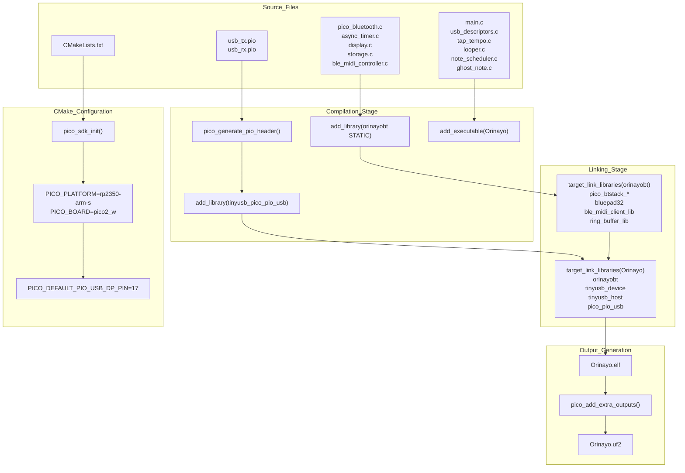
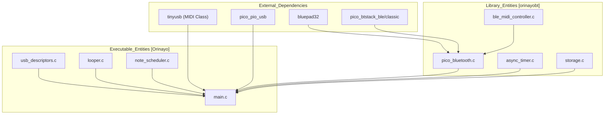

# Building and Flashing

> **Relevant source files**
> * [.github/workflows/build.yml](https://github.com/Jus-Be/orinayo-pico/blob/6dde5a75/.github/workflows/build.yml)
> * [.github/workflows/build.yml.experiment](https://github.com/Jus-Be/orinayo-pico/blob/6dde5a75/.github/workflows/build.yml.experiment)
> * [.gitignore](https://github.com/Jus-Be/orinayo-pico/blob/6dde5a75/.gitignore)
> * [CMakeLists.txt](https://github.com/Jus-Be/orinayo-pico/blob/6dde5a75/CMakeLists.txt)
> * [Dockerfile](https://github.com/Jus-Be/orinayo-pico/blob/6dde5a75/Dockerfile)
> * [tusb_config.h](https://github.com/Jus-Be/orinayo-pico/blob/6dde5a75/tusb_config.h)
> * [usb_descriptors.c](https://github.com/Jus-Be/orinayo-pico/blob/6dde5a75/usb_descriptors.c)

This page provides step-by-step instructions for building the Orinayo firmware from source and flashing it to a Raspberry Pi Pico 2 W. It covers the CMake build system, output artifacts, and multiple flashing methods. For hardware selection and requirements, see [Hardware Requirements](https://github.com/Jus-Be/orinayo-pico/blob/6dde5a75/Hardware Requirements)

 For post-flash configuration options, see [Configuration](https://github.com/Jus-Be/orinayo-pico/blob/6dde5a75/Configuration)

---

## Prerequisites

The Orinayo build system requires the following dependencies:

| Component | Version | Purpose |
| --- | --- | --- |
| **Pico SDK** | Latest | Provides hardware abstraction, TinyUSB, BTstack |
| **CMake** | ≥ 3.12 | Build system generator |
| **GCC ARM Toolchain** | arm-none-eabi-gcc | Cross-compilation for ARM Cortex-M |
| **Python 3** | Any | Required by Pico SDK scripts |
| **Git** | Any | Repository cloning and submodule management |

The Pico SDK must be installed and the `PICO_SDK_PATH` environment variable must point to its location. The build system relies on several integrated libraries including `tinyusb`, `pico_pio_usb`, and `bluepad32`.

**Sources:** [CMakeLists.txt L19-L32](https://github.com/Jus-Be/orinayo-pico/blob/6dde5a75/CMakeLists.txt#L19-L32)

 [Dockerfile L5-L20](https://github.com/Jus-Be/orinayo-pico/blob/6dde5a75/Dockerfile#L5-L20)

---

## Building from Source

### Step 1: Clone Repository

Clone the repository with its submodules (Bluepad32, TinyUSB, PIO USB, and others):

```sql
git clone https://github.com/Jus-Be/orinayo-pico.gitcd orinayo-picogit submodule update --init --recursive
```

The build system specifically includes subdirectories for `tinyusb`, `ring_buffer_lib`, `pico-w-ble-midi-lib`, `pico_pio_usb`, and `bluepad32`.

**Sources:** [CMakeLists.txt L25-L28](https://github.com/Jus-Be/orinayo-pico/blob/6dde5a75/CMakeLists.txt#L25-L28)

 [CMakeLists.txt L45-L49](https://github.com/Jus-Be/orinayo-pico/blob/6dde5a75/CMakeLists.txt#L45-L49)

### Step 2: Configure Build Environment

Ensure the Pico SDK path is set:

```javascript
export PICO_SDK_PATH=/path/to/pico-sdk
```

The build system is configured for the **RP2350** platform in ARM-S mode and targets the **Pico 2 W** board:

**Sources:** [CMakeLists.txt L23-L24](https://github.com/Jus-Be/orinayo-pico/blob/6dde5a75/CMakeLists.txt#L23-L24)

### Step 3: Generate Build Files

Create a build directory and run CMake:

```
mkdir buildcd buildcmake ..
```

CMake will:

* Initialize the Pico SDK ([CMakeLists.txt L43](https://github.com/Jus-Be/orinayo-pico/blob/6dde5a75/CMakeLists.txt#L43-L43) )
* Set the project version to the current UTC date in `YYYY.MM.DD` format ([CMakeLists.txt L37-L38](https://github.com/Jus-Be/orinayo-pico/blob/6dde5a75/CMakeLists.txt#L37-L38) )
* Configure the PIO USB pins (Default DP Pin: 17) ([CMakeLists.txt L51-L54](https://github.com/Jus-Be/orinayo-pico/blob/6dde5a75/CMakeLists.txt#L51-L54) )
* Locate dependencies (TinyUSB, BTstack, Bluepad32, Ring Buffer)

### Step 4: Compile

Build all targets:

```
make -j$(nproc)
```

The build process compiles:

1. The **orinayobt** static library from `pico_bluetooth.c`, `async_timer.c`, `display.c`, `storage.c`, and `ble_midi_controller.c` ([CMakeLists.txt L68](https://github.com/Jus-Be/orinayo-pico/blob/6dde5a75/CMakeLists.txt#L68-L68) )
2. The **Orinayo** executable from `main.c`, `usb_descriptors.c`, `tap_tempo.c`, `looper.c`, `note_scheduler.c`, and `ghost_note.c` ([CMakeLists.txt L73](https://github.com/Jus-Be/orinayo-pico/blob/6dde5a75/CMakeLists.txt#L73-L73) )
3. PIO headers for USB RX/TX ([CMakeLists.txt L64-L65](https://github.com/Jus-Be/orinayo-pico/blob/6dde5a75/CMakeLists.txt#L64-L65) )

Compilation flags include `-ffunction-sections -fdata-sections` for dead code elimination during linking ([CMakeLists.txt L93-L94](https://github.com/Jus-Be/orinayo-pico/blob/6dde5a75/CMakeLists.txt#L93-L94)

).

**Sources:** [CMakeLists.txt L68-L94](https://github.com/Jus-Be/orinayo-pico/blob/6dde5a75/CMakeLists.txt#L68-L94)

### Step 5: Output Artifacts

The build generates the following files in the `build/` directory:

| File | Format | Use Case |
| --- | --- | --- |
| `Orinayo.elf` | ELF executable | Debugging with GDB/SWD |
| `Orinayo.bin` | Raw binary | Direct flash programming |
| `Orinayo.uf2` | USB Flashing Format | Drag-and-drop to Pico |
| `Orinayo.hex` | Intel HEX | Legacy programmers |
| `Orinayo.map` | Linker map | Memory layout analysis |

**Sources:** [CMakeLists.txt L76-L82](https://github.com/Jus-Be/orinayo-pico/blob/6dde5a75/CMakeLists.txt#L76-L82)

---

## Build Process Diagram

The following diagram shows the complete build pipeline from source files to flashable artifacts:

**Orinayo Build Pipeline**


```mermaid
flowchart TD

SRC_MAIN["main.c<br>usb_descriptors.c<br>tap_tempo.c<br>looper.c<br>note_scheduler.c<br>ghost_note.c"]
SRC_LIB["pico_bluetooth.c<br>async_timer.c<br>display.c<br>storage.c<br>ble_midi_controller.c"]
SRC_PIO["usb_tx.pio<br>usb_rx.pio"]
CMAKE["CMakeLists.txt"]
INIT["pico_sdk_init()"]
PLATFORM["PICO_PLATFORM=rp2350-arm-s<br>PICO_BOARD=pico2_w"]
PIO_CFG["PICO_DEFAULT_PIO_USB_DP_PIN=17"]
PIO_GEN["pico_generate_pio_header()"]
LIB_ORINAYOBT["add_library(orinayobt STATIC)"]
EXE_ORINAYO["add_executable(Orinayo)"]
LIB_TUSB_PIO["add_library(tinyusb_pico_pio_usb)"]
LINK_LIB["target_link_libraries(orinayobt)<br>pico_btstack_*<br>bluepad32<br>ble_midi_client_lib<br>ring_buffer_lib"]
LINK_EXE["target_link_libraries(Orinayo)<br>orinayobt<br>tinyusb_device<br>tinyusb_host<br>pico_pio_usb"]
ELF["Orinayo.elf"]
EXTRA["pico_add_extra_outputs()"]
UF2["Orinayo.uf2"]

CMAKE --> INIT
SRC_PIO --> PIO_GEN
SRC_LIB --> LIB_ORINAYOBT
SRC_MAIN --> EXE_ORINAYO
LIB_TUSB_PIO --> LINK_EXE
LIB_ORINAYOBT --> LINK_LIB
LINK_EXE --> ELF

subgraph Output_Generation ["Output_Generation"]
    ELF
    EXTRA
    UF2
    ELF --> EXTRA
    EXTRA --> UF2
end

subgraph Linking_Stage ["Linking_Stage"]
    LINK_LIB
    LINK_EXE
    LINK_LIB --> LINK_EXE
end

subgraph Compilation_Stage ["Compilation_Stage"]
    PIO_GEN
    LIB_ORINAYOBT
    EXE_ORINAYO
    LIB_TUSB_PIO
    PIO_GEN --> LIB_TUSB_PIO
end

subgraph CMake_Configuration ["CMake_Configuration"]
    INIT
    PLATFORM
    PIO_CFG
    INIT --> PLATFORM
    PLATFORM --> PIO_CFG
end

subgraph Source_Files ["Source_Files"]
    SRC_MAIN
    SRC_LIB
    SRC_PIO
    CMAKE
end
```

**Sources:** [CMakeLists.txt L23-L85](https://github.com/Jus-Be/orinayo-pico/blob/6dde5a75/CMakeLists.txt#L23-L85)

---

## Build System Architecture

The build system uses a **two-tier architecture** to separate core infrastructure from the musical application logic:

### Tier 1: orinayobt Static Library

The `orinayobt` library ([CMakeLists.txt L68](https://github.com/Jus-Be/orinayo-pico/blob/6dde5a75/CMakeLists.txt#L68-L68)

) encapsulates the system infrastructure:

| Source File | Purpose |
| --- | --- |
| `pico_bluetooth.c` | Core Bluetooth event handling and HID translation |
| `async_timer.c` | Asynchronous timer abstraction |
| `display.c` | Status display and UI rendering |
| `storage.c` | Flash-based pattern persistence |
| `ble_midi_controller.c` | Specialized BLE MIDI device client |

This library is compiled with `PICO_CYW43_ARCH_THREADSAFE_BACKGROUND` to ensure safe concurrent access to the wireless chip ([CMakeLists.txt L71](https://github.com/Jus-Be/orinayo-pico/blob/6dde5a75/CMakeLists.txt#L71-L71)

).

### Tier 2: Orinayo Executable

The main executable ([CMakeLists.txt L73](https://github.com/Jus-Be/orinayo-pico/blob/6dde5a75/CMakeLists.txt#L73-L73)

) contains the high-level musical logic and USB configuration:

* **USB Descriptors**: `usb_descriptors.c` defines the MIDI device identity with a unique Product ID ([usb_descriptors.c L35-L60](https://github.com/Jus-Be/orinayo-pico/blob/6dde5a75/usb_descriptors.c#L35-L60) ).
* **Dual-Role USB**: Links `tinyusb_device` and `tinyusb_host` via `pico_pio_usb` to allow simultaneous MIDI Device (native port) and MIDI Host (PIO pins) functionality ([CMakeLists.txt L85](https://github.com/Jus-Be/orinayo-pico/blob/6dde5a75/CMakeLists.txt#L85-L85)  [tusb_config.h L49-L51](https://github.com/Jus-Be/orinayo-pico/blob/6dde5a75/tusb_config.h#L49-L51) ).

### Build Architecture Entity Mapping

**Natural Language to Code Entity Mapping**


```mermaid
flowchart TD

BT_CORE["pico_bluetooth.c"]
BLE_MIDI["ble_midi_controller.c"]
TIMER["async_timer.c"]
STORAGE["storage.c"]
MAIN["main.c"]
USB_DESC["usb_descriptors.c"]
SEQ["looper.c"]
SCHED["note_scheduler.c"]
TUSB["tinyusb (MIDI Class)"]
PIO_USB["pico_pio_usb"]
BP32["bluepad32"]
BTSTACK["pico_btstack_ble/classic"]

BP32 --> BT_CORE
BTSTACK --> BT_CORE
BT_CORE --> MAIN
TIMER --> MAIN
STORAGE --> MAIN
TUSB --> MAIN
PIO_USB --> MAIN

subgraph External_Dependencies ["External_Dependencies"]
    TUSB
    PIO_USB
    BP32
    BTSTACK
end

subgraph subGraph1 ["Executable_Entities [Orinayo]"]
    MAIN
    USB_DESC
    SEQ
    SCHED
    USB_DESC --> MAIN
    SEQ --> MAIN
    SCHED --> MAIN
end

subgraph subGraph0 ["Library_Entities [orinayobt]"]
    BT_CORE
    BLE_MIDI
    TIMER
    STORAGE
    BLE_MIDI --> BT_CORE
end
```

**Sources:** [CMakeLists.txt L68-L85](https://github.com/Jus-Be/orinayo-pico/blob/6dde5a75/CMakeLists.txt#L68-L85)

 [tusb_config.h L41-L51](https://github.com/Jus-Be/orinayo-pico/blob/6dde5a75/tusb_config.h#L41-L51)

---

## Flashing to Hardware

### Method 1: UF2 Drag-and-Drop (Recommended)

1. **Enter bootloader mode** on the Pico 2 W: * Hold the **BOOTSEL** button while plugging in the USB cable. * The Pico will appear as a USB mass storage device named **RPI-RP2**.
2. **Copy the UF2 file**: ``` cp build/Orinayo.uf2 /media/RPI-RP2/ ```

The `pico_add_extra_outputs` command in CMake ensures the UF2 is generated automatically ([CMakeLists.txt L82](https://github.com/Jus-Be/orinayo-pico/blob/6dde5a75/CMakeLists.txt#L82-L82)

).

### Method 2: Docker-based Build

A `Dockerfile` is provided for a consistent build environment:

1. It installs `gcc-arm-none-eabi` and `cmake` ([Dockerfile L8](https://github.com/Jus-Be/orinayo-pico/blob/6dde5a75/Dockerfile#L8-L8) ).
2. It clones and initializes the `pico-sdk` ([Dockerfile L14-L16](https://github.com/Jus-Be/orinayo-pico/blob/6dde5a75/Dockerfile#L14-L16) ).
3. It sets `PICO_SDK_PATH` and builds the project ([Dockerfile L20-L30](https://github.com/Jus-Be/orinayo-pico/blob/6dde5a75/Dockerfile#L20-L30) ).

---

## CI/CD Pipeline

The repository includes a GitHub Actions workflow (`.github/workflows/build.yml`) that automates the build process:

1. **Trigger**: Runs on every `push` ([.github/workflows/build.yml L2](https://github.com/Jus-Be/orinayo-pico/blob/6dde5a75/.github/workflows/build.yml#L2-L2) ).
2. **Action**: Uses `deleolajide/Pico-Build-Action` to compile the source ([.github/workflows/build.yml L16](https://github.com/Jus-Be/orinayo-pico/blob/6dde5a75/.github/workflows/build.yml#L16-L16) ).
3. **Artifacts**: Uploads the resulting binaries as `workspace_artifacts` ([.github/workflows/build.yml L23](https://github.com/Jus-Be/orinayo-pico/blob/6dde5a75/.github/workflows/build.yml#L23-L23) ).

An experimental workflow also exists that builds the firmware inside the project's own Docker container and extracts the `.uf2` file ([.github/workflows/build.yml.experiment L18-L25](https://github.com/Jus-Be/orinayo-pico/blob/6dde5a75/.github/workflows/build.yml.experiment#L18-L25)

).

**Sources:** [.github/workflows/build.yml L1-L26](https://github.com/Jus-Be/orinayo-pico/blob/6dde5a75/.github/workflows/build.yml#L1-L26)

 [.github/workflows/build.yml.experiment L1-L34](https://github.com/Jus-Be/orinayo-pico/blob/6dde5a75/.github/workflows/build.yml.experiment#L1-L34)