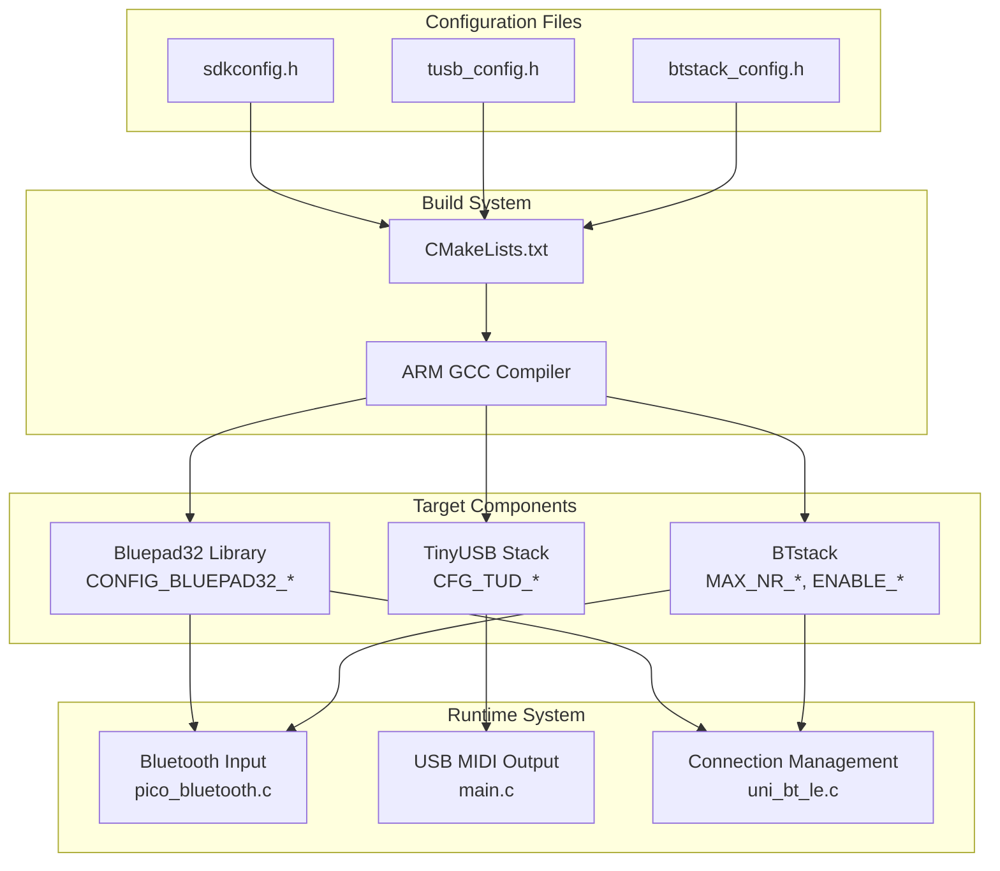
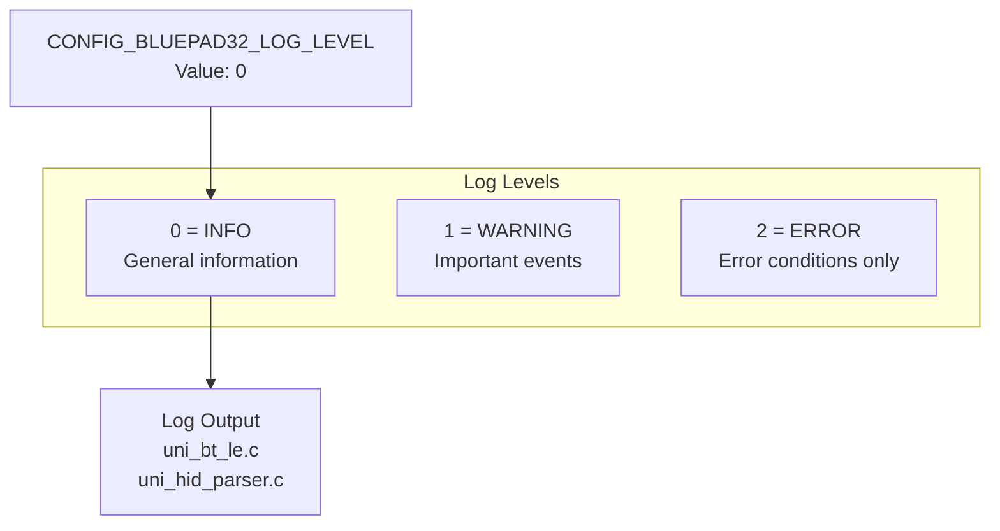
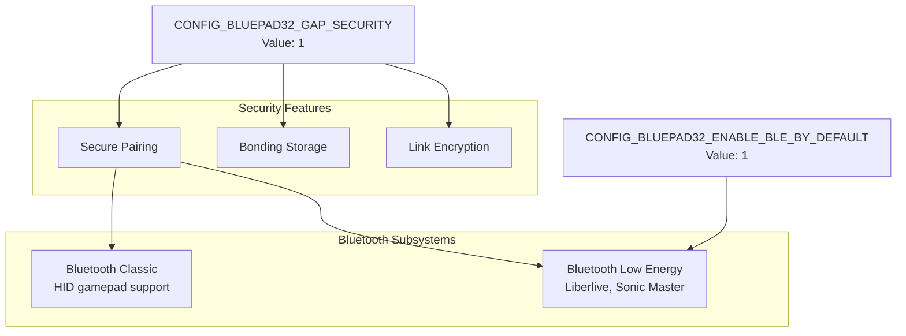
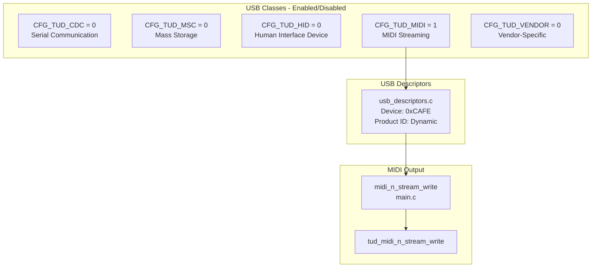
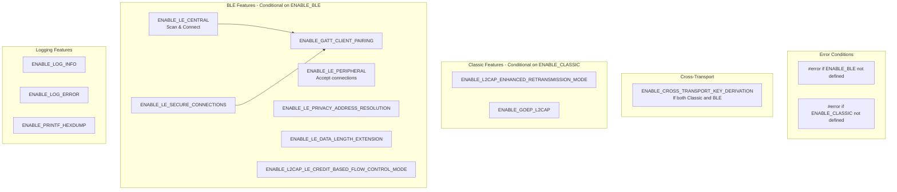
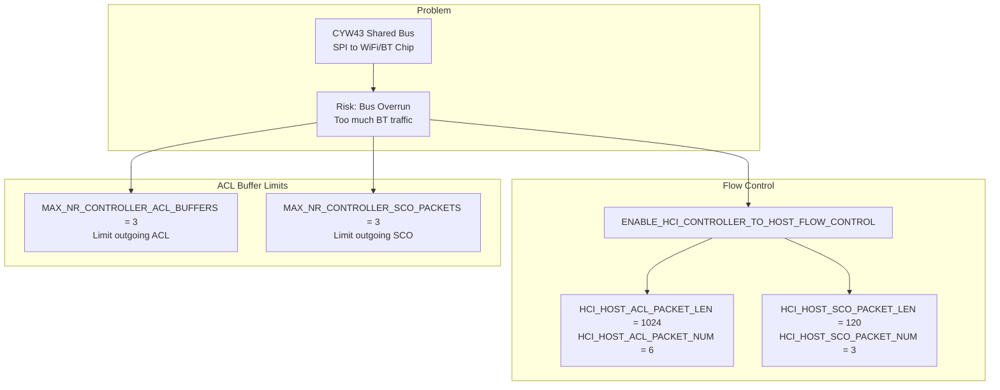
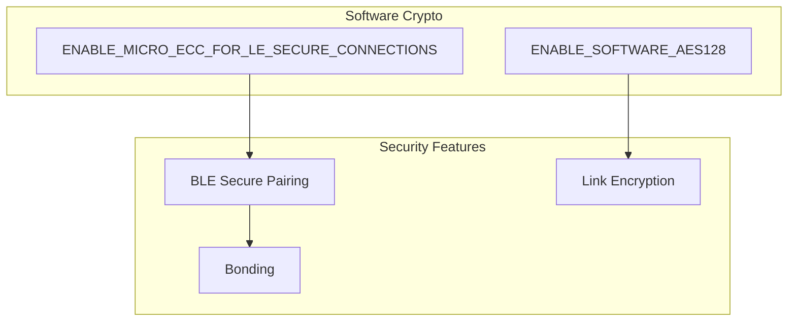
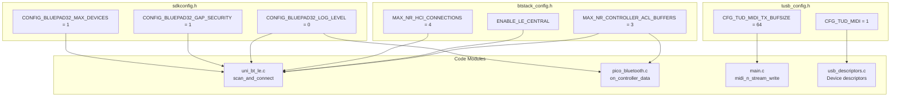

# Configuration

> **Relevant source files**
> * [.github/workflows/build.yml](https://github.com/Jus-Be/orinayo-pico/blob/122fa496/.github/workflows/build.yml)
> * [bluepad32/include/btstack_config.h](https://github.com/Jus-Be/orinayo-pico/blob/122fa496/bluepad32/include/btstack_config.h)
> * [pico_bluetooth.h](https://github.com/Jus-Be/orinayo-pico/blob/122fa496/pico_bluetooth.h)
> * [sdkconfig.h](https://github.com/Jus-Be/orinayo-pico/blob/122fa496/sdkconfig.h)
> * [seqlock.h](https://github.com/Jus-Be/orinayo-pico/blob/122fa496/seqlock.h)
> * [tusb_config.h](https://github.com/Jus-Be/orinayo-pico/blob/122fa496/tusb_config.h)

This page documents the three primary configuration files that control the behavior of the Orinayo system: `sdkconfig.h` (Bluepad32 settings), `tusb_config.h` (USB MIDI settings), and `btstack_config.h` (Bluetooth stack settings). These files define compile-time constants that control resource allocation, feature enablement, and system limits.

For hardware setup and flashing procedures, see [Building and Flashing](./2.2-building-and-flashing.md). For runtime operational modes that change system behavior without recompilation, see [Operational Modes](./4.4-operational-modes.md).

## Configuration File Overview

The Orinayo build system uses three configuration headers to configure different subsystems at compile time. These files must be present before CMake generates the build:



**Sources:** [sdkconfig.h L1-L12](https://github.com/Jus-Be/orinayo-pico/blob/122fa496/sdkconfig.h#L1-L12)

 [tusb_config.h L1-L94](https://github.com/Jus-Be/orinayo-pico/blob/122fa496/tusb_config.h#L1-L94)

 [btstack_config.h L1-L96](https://github.com/Jus-Be/orinayo-pico/blob/122fa496/btstack_config.h#L1-L96)

## Bluepad32 Configuration (sdkconfig.h)

The `sdkconfig.h` file configures the Bluepad32 controller library, which handles gamepad HID device discovery and input processing. All macros use the `CONFIG_BLUEPAD32_` prefix.

### Platform and Target Settings

| Macro | Value | Purpose |
| --- | --- | --- |
| `CONFIG_BLUEPAD32_PLATFORM_CUSTOM` | defined | Indicates custom platform implementation (not ESP32) |
| `CONFIG_TARGET_PICO_W` | defined | Specifies Raspberry Pi Pico W as target hardware |

These settings tell Bluepad32 to use the custom platform adapter located in the `bluepad32/` directory rather than the default ESP-IDF platform.

**Sources:** [sdkconfig.h L4-L5](https://github.com/Jus-Be/orinayo-pico/blob/122fa496/sdkconfig.h#L4-L5)

### Logging Configuration



The log level is set to `0` (INFO), providing detailed operational information during Bluetooth operations. Higher values reduce verbosity.

**Sources:** [sdkconfig.h L6](https://github.com/Jus-Be/orinayo-pico/blob/122fa496/sdkconfig.h#L6-L6)

### Resource Limits

| Macro | Value | Description |
| --- | --- | --- |
| `CONFIG_BLUEPAD32_MAX_DEVICES` | 1 | Maximum simultaneous Bluetooth devices |
| `CONFIG_BLUEPAD32_MAX_ALLOWLIST` | 1 | Maximum allowlist entries for pairing |

These limits are intentionally set to 1 because Orinayo is designed as a single-controller gateway. This reduces memory usage and simplifies the state machine in [pico_bluetooth.c](https://github.com/Jus-Be/orinayo-pico/blob/122fa496/pico_bluetooth.c)

**Sources:** [sdkconfig.h L8-L9](https://github.com/Jus-Be/orinayo-pico/blob/122fa496/sdkconfig.h#L8-L9)

### Security and BLE Settings



* `CONFIG_BLUEPAD32_GAP_SECURITY = 1` enables authenticated pairing and encryption
* `CONFIG_BLUEPAD32_ENABLE_BLE_BY_DEFAULT = 1` activates BLE alongside Classic Bluetooth

**Sources:** [sdkconfig.h L10-L11](https://github.com/Jus-Be/orinayo-pico/blob/122fa496/sdkconfig.h#L10-L11)

## TinyUSB Configuration (tusb_config.h)

The `tusb_config.h` file configures the USB device stack for MIDI output. This file follows the standard TinyUSB configuration format.

### Core USB Settings

| Macro | Value | Description |
| --- | --- | --- |
| `CFG_TUSB_MCU` | (compiler flag) | Must be defined by build system to specify MCU type |
| `CFG_TUSB_RHPORT0_MODE` | `OPT_MODE_DEVICE` | USB operates in device mode (not host) |
| `CFG_TUSB_OS` | `OPT_OS_PICO` | Integration with Pico SDK |
| `CFG_TUD_ENDPOINT0_SIZE` | 64 | Control endpoint buffer size in bytes |

The `CFG_TUSB_MCU` is set by CMake based on the target platform. For Pico W, this is typically `OPT_MCU_RP2040`.

**Sources:** [tusb_config.h L38-L76](https://github.com/Jus-Be/orinayo-pico/blob/122fa496/tusb_config.h#L38-L76)

### USB Device Class Configuration



Only the MIDI class is enabled (`CFG_TUD_MIDI = 1`). All other USB classes are disabled to minimize firmware size and complexity. This configuration results in the device enumerating as a pure USB MIDI device.

**Sources:** [tusb_config.h L80-L84](https://github.com/Jus-Be/orinayo-pico/blob/122fa496/tusb_config.h#L80-L84)

### MIDI Buffer Sizes

| Macro | Value | Purpose |
| --- | --- | --- |
| `CFG_TUD_MIDI_RX_BUFSIZE` | 512 (high-speed) or 64 (full-speed) | USB to Pico MIDI buffer |
| `CFG_TUD_MIDI_TX_BUFSIZE` | 512 (high-speed) or 64 (full-speed) | Pico to USB MIDI buffer |

The buffer sizes are conditional based on USB speed capabilities of the target MCU. The RP2040 in Pico W operates at full-speed (12 Mbps), so the actual value used is 64 bytes.

**Sources:** [tusb_config.h L87-L88](https://github.com/Jus-Be/orinayo-pico/blob/122fa496/tusb_config.h#L87-L88)

## BTstack Configuration (btstack_config.h)

The `btstack_config.h` file located at [bluepad32/include/btstack_config.h](https://github.com/Jus-Be/orinayo-pico/blob/122fa496/bluepad32/include/btstack_config.h)

 configures the BTstack Bluetooth library. This is the most complex configuration file due to the extensive resource management required for Bluetooth operations.

### Feature Enablement



Both `ENABLE_BLE` and `ENABLE_CLASSIC` must be defined before including this header, otherwise compilation fails with explicit error messages at [btstack_config.h L22](https://github.com/Jus-Be/orinayo-pico/blob/122fa496/btstack_config.h#L22-L22)

 and [btstack_config.h L29](https://github.com/Jus-Be/orinayo-pico/blob/122fa496/btstack_config.h#L29-L29)

**Sources:** [btstack_config.h L8-L34](https://github.com/Jus-Be/orinayo-pico/blob/122fa496/btstack_config.h#L8-L34)

### Connection and Resource Limits

The following table shows the most critical resource limits that control memory allocation:

| Macro | Value | Purpose |
| --- | --- | --- |
| `MAX_NR_HCI_CONNECTIONS` | 4 | Total simultaneous Bluetooth connections |
| `MAX_NR_GATT_CLIENTS` | 4 | Active GATT client contexts for BLE |
| `MAX_NR_HID_HOST_CONNECTIONS` | 4 | HID device connections (gamepads) |
| `MAX_NR_HIDS_CLIENTS` | 4 | HID service clients |
| `MAX_NR_L2CAP_CHANNELS` | 6 | Logical link control channels |
| `MAX_NR_L2CAP_SERVICES` | 5 | Registered L2CAP services |
| `MAX_NR_SM_LOOKUP_ENTRIES` | 3 | Security Manager pairing entries |
| `MAX_NR_LE_DEVICE_DB_ENTRIES` | 16 | BLE device database capacity |
| `MAX_NR_BTSTACK_LINK_KEY_DB_MEMORY_ENTRIES` | 2 | Classic Bluetooth bonding storage |

These values are tuned for the Pico W's memory constraints while supporting the expected workload of 1-2 simultaneous controllers.

**Sources:** [btstack_config.h L45-L59](https://github.com/Jus-Be/orinayo-pico/blob/122fa496/btstack_config.h#L45-L59)

### CYW43 Bus Protection



The CYW43 wireless chip shares a single SPI bus for both WiFi and Bluetooth. To prevent buffer overruns, BTstack is configured with:

1. **Limited outgoing buffers** ([btstack_config.h L62-L63](https://github.com/Jus-Be/orinayo-pico/blob/122fa496/btstack_config.h#L62-L63) ): Only 3 ACL and 3 SCO packets queued at once
2. **Controller-to-host flow control** ([btstack_config.h L66-L70](https://github.com/Jus-Be/orinayo-pico/blob/122fa496/btstack_config.h#L66-L70) ): The CYW43 can throttle incoming data when the host is busy

This configuration is critical for maintaining stable Bluetooth connections during high MIDI traffic periods.

**Sources:** [btstack_config.h L61-L70](https://github.com/Jus-Be/orinayo-pico/blob/122fa496/btstack_config.h#L61-L70)

### Storage and Persistence

| Macro | Value | Purpose |
| --- | --- | --- |
| `NVM_NUM_DEVICE_DB_ENTRIES` | 16 | BLE device records in flash |
| `NVM_NUM_LINK_KEYS` | 16 | Classic Bluetooth pairing keys |
| `MAX_ATT_DB_SIZE` | 512 | Static ATT database for GATT |

These settings control the flash-based persistent storage for bonded devices. The system uses the "TLV on top of Flash Sector interface" mentioned at [btstack_config.h L72-L74](https://github.com/Jus-Be/orinayo-pico/blob/122fa496/btstack_config.h#L72-L74)

 allowing bonded controllers to reconnect without re-pairing.

**Sources:** [btstack_config.h L73-L77](https://github.com/Jus-Be/orinayo-pico/blob/122fa496/btstack_config.h#L73-L77)

### Cryptography Configuration



Since the RP2040 lacks hardware crypto acceleration, BTstack is configured to use software implementations:

* `ENABLE_SOFTWARE_AES128` for symmetric encryption
* `ENABLE_MICRO_ECC_FOR_LE_SECURE_CONNECTIONS` for elliptic curve cryptography used in BLE pairing

**Sources:** [btstack_config.h L88-L89](https://github.com/Jus-Be/orinayo-pico/blob/122fa496/btstack_config.h#L88-L89)

## Configuration Interaction Map

The following diagram shows how configuration macros flow through the build system into specific code modules:



**Sources:** [sdkconfig.h L1-L12](https://github.com/Jus-Be/orinayo-pico/blob/122fa496/sdkconfig.h#L1-L12)

 [tusb_config.h L1-L94](https://github.com/Jus-Be/orinayo-pico/blob/122fa496/tusb_config.h#L1-L94)

 [btstack_config.h L1-L96](https://github.com/Jus-Be/orinayo-pico/blob/122fa496/btstack_config.h#L1-L96)

## Common Configuration Changes

### Increasing Maximum Devices

To support multiple simultaneous Bluetooth controllers, modify [sdkconfig.h L8](https://github.com/Jus-Be/orinayo-pico/blob/122fa496/sdkconfig.h#L8-L8)

:

```python
#define CONFIG_BLUEPAD32_MAX_DEVICES 2  // Changed from 1
#define CONFIG_BLUEPAD32_MAX_ALLOWLIST 2  // Changed from 1
```

Also adjust BTstack limits in [btstack_config.h](https://github.com/Jus-Be/orinayo-pico/blob/122fa496/btstack_config.h)

:

* Increase `MAX_NR_HCI_CONNECTIONS` to accommodate more devices
* Increase `MAX_NR_L2CAP_CHANNELS` proportionally (add 1-2 per device)

### Adjusting Log Verbosity

To reduce console output during operation, change [sdkconfig.h L6](https://github.com/Jus-Be/orinayo-pico/blob/122fa496/sdkconfig.h#L6-L6)

:

```
#define CONFIG_BLUEPAD32_LOG_LEVEL 2  // ERROR only (was 0 = INFO)
```

This is useful for production deployments where diagnostic output is not needed.

### USB MIDI Buffer Tuning

If experiencing USB MIDI buffer overruns during high-throughput scenarios (e.g., dense drum patterns), increase the buffer at [tusb_config.h L88](https://github.com/Jus-Be/orinayo-pico/blob/122fa496/tusb_config.h#L88-L88)

:

```python
#define CFG_TUD_MIDI_TX_BUFSIZE   128  // Increased from 64
```

Note that this consumes additional RAM and may require adjusting other buffers to maintain stability.

## Build-Time Validation

The configuration files include compile-time assertions that catch common errors:

| File | Assertion | Purpose |
| --- | --- | --- |
| `tusb_config.h` | Lines 38-40 | Ensures `CFG_TUSB_MCU` is defined by build system |
| `btstack_config.h` | Line 22 | Fails if `ENABLE_BLE` is not defined |
| `btstack_config.h` | Line 29 | Fails if `ENABLE_CLASSIC` is not defined |

These preprocessor checks prevent silent misconfigurations that would cause runtime failures.

**Sources:** [tusb_config.h L38-L40](https://github.com/Jus-Be/orinayo-pico/blob/122fa496/tusb_config.h#L38-L40)

 [btstack_config.h L21-L30](https://github.com/Jus-Be/orinayo-pico/blob/122fa496/btstack_config.h#L21-L30)

## Configuration Summary Table

| Subsystem | File | Key Settings | Primary Impact |
| --- | --- | --- | --- |
| Bluepad32 | `sdkconfig.h` | Max devices, security, BLE enable | Controller connection limits |
| USB MIDI | `tusb_config.h` | MIDI class, buffer sizes | USB enumeration, throughput |
| BTstack | `btstack_config.h` | Connection limits, flow control, crypto | Bluetooth stability, memory usage |

All three configuration files must be present and consistent before running CMake to generate the build system. For build system details, see [CMake Configuration](./9.1-cmake-configuration.md).

**Sources:** [sdkconfig.h L1-L12](https://github.com/Jus-Be/orinayo-pico/blob/122fa496/sdkconfig.h#L1-L12)

 [tusb_config.h L1-L94](https://github.com/Jus-Be/orinayo-pico/blob/122fa496/tusb_config.h#L1-L94)

 [btstack_config.h L1-L96](https://github.com/Jus-Be/orinayo-pico/blob/122fa496/btstack_config.h#L1-L96)