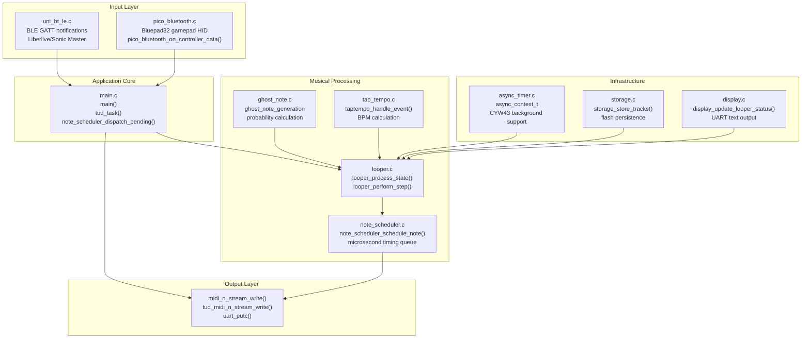
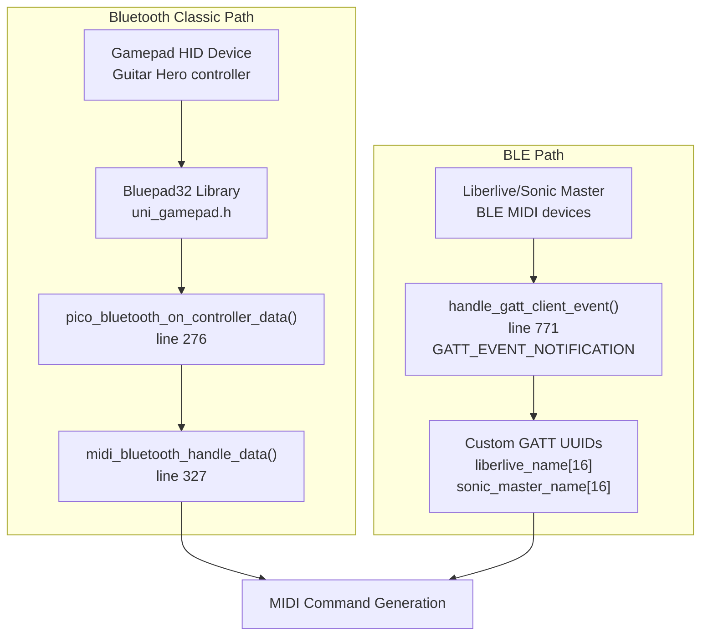
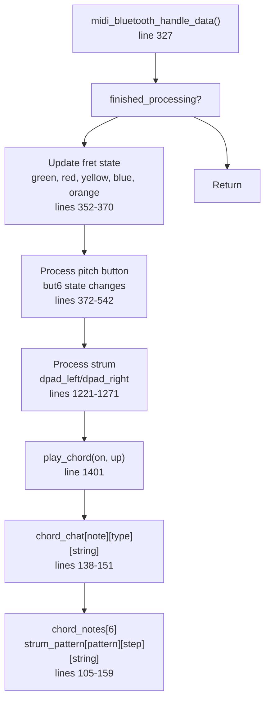
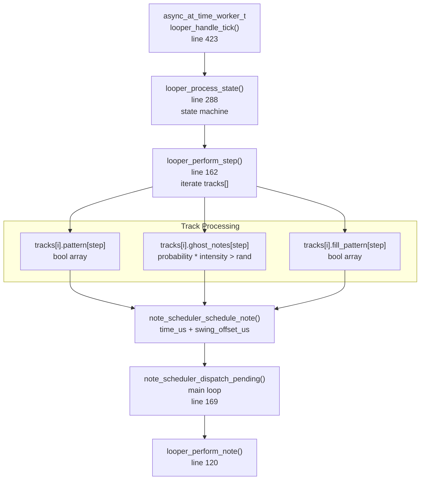
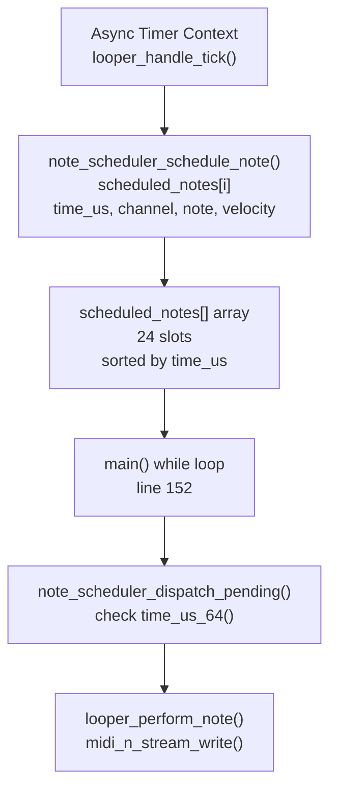
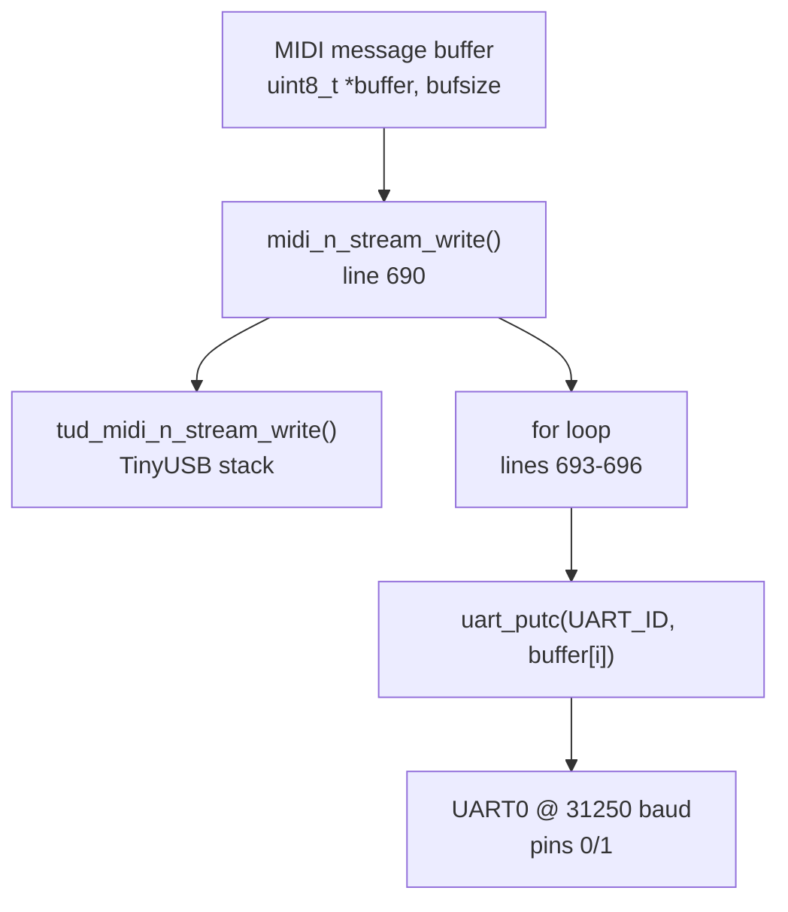
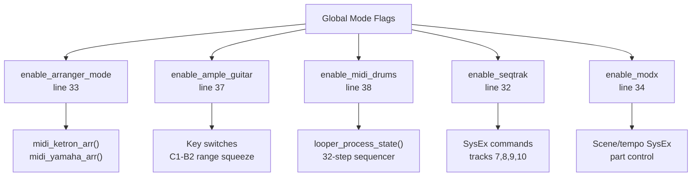

# Architecture

> **Relevant source files**
> * [bluepad32/bt/uni_bt_le.c](https://github.com/Jus-Be/orinayo-pico/blob/122fa496/bluepad32/bt/uni_bt_le.c)
> * [looper.c](https://github.com/Jus-Be/orinayo-pico/blob/122fa496/looper.c)
> * [main.c](https://github.com/Jus-Be/orinayo-pico/blob/122fa496/main.c)
> * [pico_bluetooth.c](https://github.com/Jus-Be/orinayo-pico/blob/122fa496/pico_bluetooth.c)

## Purpose and Scope

This document describes the overall system architecture of the Orinayo Bluetooth-to-MIDI gateway, detailing how the major subsystems interact to process Bluetooth controller input and generate MIDI output. It covers the structural organization of components, their dependencies, and the primary data flow paths through the system.

For specific implementation details of individual subsystems, see [System Components](./3.1-system-components.md). For end-to-end data processing, see [Data Flow Pipeline](./3.2-data-flow-pipeline.md). For hardware-level interfaces, see [Hardware Interfaces](./3.3-hardware-interfaces.md).

## System Overview

The system implements a layered architecture with three primary domains: input processing, musical transformation, and output generation. The Raspberry Pi Pico W hardware provides dual-core RP2350 processing with an integrated CYW43 wireless chip handling Bluetooth connectivity.

### High-Level Component Diagram



**Sources:** [pico_bluetooth.c L1-L2300](https://github.com/Jus-Be/orinayo-pico/blob/122fa496/pico_bluetooth.c#L1-L2300)

 [uni_bt_le.c L1-L1500](https://github.com/Jus-Be/orinayo-pico/blob/122fa496/uni_bt_le.c#L1-L1500)

 [main.c L1-L697](https://github.com/Jus-Be/orinayo-pico/blob/122fa496/main.c#L1-L697)

 [looper.c L1-L527](https://github.com/Jus-Be/orinayo-pico/blob/122fa496/looper.c#L1-L527)

### Component Responsibilities

| Component | Primary Function | Key Data Structures |
| --- | --- | --- |
| `pico_bluetooth.c` | HID button mapping, chord generation, mode management | `chord_chat[12][3][6]`, `strum_pattern[5][12][6]` |
| `uni_bt_le.c` | BLE connection lifecycle, GATT characteristic handling | `server_characteristic`, `connection_handle` |
| `main.c` | System initialization, USB task processing, MIDI output | `old_p1/p2/p3/p4` chord state |
| `looper.c` | 32-step sequencer, pattern playback, state machine | `tracks[]`, `looper_status_t` |
| `note_scheduler.c` | Microsecond-precision note timing queue | `scheduled_notes[]` queue |
| `async_timer.c` | Async context for timer callbacks | `async_context_t` |

**Sources:** [pico_bluetooth.c L1-L50](https://github.com/Jus-Be/orinayo-pico/blob/122fa496/pico_bluetooth.c#L1-L50)

 [uni_bt_le.c L56-L102](https://github.com/Jus-Be/orinayo-pico/blob/122fa496/uni_bt_le.c#L56-L102)

 [main.c L1-L173](https://github.com/Jus-Be/orinayo-pico/blob/122fa496/main.c#L1-L173)

 [looper.c L1-L67](https://github.com/Jus-Be/orinayo-pico/blob/122fa496/looper.c#L1-L67)

## Core Subsystems

### Bluetooth Input Processing

The system supports two Bluetooth input paths that converge at the MIDI generation stage:



**Sources:** [pico_bluetooth.c L276-L325](https://github.com/Jus-Be/orinayo-pico/blob/122fa496/pico_bluetooth.c#L276-L325)

 [uni_bt_le.c L771-L1046](https://github.com/Jus-Be/orinayo-pico/blob/122fa496/uni_bt_le.c#L771-L1046)

#### Button State Management

The `pico_bluetooth.c` module maintains global button state variables that are updated by the Bluepad32 callback:

* **Fret buttons:** `green`, `red`, `yellow`, `blue`, `orange` [pico_bluetooth.c L66-L70](https://github.com/Jus-Be/orinayo-pico/blob/122fa496/pico_bluetooth.c#L66-L70)
* **Strum inputs:** `dpad_left`, `dpad_right` [pico_bluetooth.c L56-L57](https://github.com/Jus-Be/orinayo-pico/blob/122fa496/pico_bluetooth.c#L56-L57)
* **Mode buttons:** `mbut0`, `mbut1`, `mbut2`, `mbut3` [pico_bluetooth.c L51-L54](https://github.com/Jus-Be/orinayo-pico/blob/122fa496/pico_bluetooth.c#L51-L54)
* **Configuration:** `pitch`, `song_key`, `start` [pico_bluetooth.c L72-L80](https://github.com/Jus-Be/orinayo-pico/blob/122fa496/pico_bluetooth.c#L72-L80)

The BLE path sets these same global variables in `handle_gatt_client_event()` [uni_bt_le.c L892-L909](https://github.com/Jus-Be/orinayo-pico/blob/122fa496/uni_bt_le.c#L892-L909)

 allowing both input paths to use identical downstream processing logic.

**Sources:** [pico_bluetooth.c L42-L88](https://github.com/Jus-Be/orinayo-pico/blob/122fa496/pico_bluetooth.c#L42-L88)

 [uni_bt_le.c L882-L924](https://github.com/Jus-Be/orinayo-pico/blob/122fa496/uni_bt_le.c#L882-L924)

### Chord Generation System

The `midi_bluetooth_handle_data()` function [pico_bluetooth.c L327-L1274](https://github.com/Jus-Be/orinayo-pico/blob/122fa496/pico_bluetooth.c#L327-L1274)

 implements a decision tree that maps button combinations to chord selection and strum execution:



The `chord_chat` lookup table [pico_bluetooth.c L138-L151](https://github.com/Jus-Be/orinayo-pico/blob/122fa496/pico_bluetooth.c#L138-L151)

 stores guitar fret positions for 12 root notes × 3 chord types (major, minor, suspended), with `-1` indicating muted strings.

**Sources:** [pico_bluetooth.c L327-L1274](https://github.com/Jus-Be/orinayo-pico/blob/122fa496/pico_bluetooth.c#L327-L1274)

 [pico_bluetooth.c L138-L151](https://github.com/Jus-Be/orinayo-pico/blob/122fa496/pico_bluetooth.c#L138-L151)

 [pico_bluetooth.c L153-L159](https://github.com/Jus-Be/orinayo-pico/blob/122fa496/pico_bluetooth.c#L153-L159)

### Musical Processing Pipeline

The looper subsystem implements a 32-step (2-bar) sequencer with 14 drum tracks:



**Sources:** [looper.c L423-L435](https://github.com/Jus-Be/orinayo-pico/blob/122fa496/looper.c#L423-L435)

 [looper.c L288-L344](https://github.com/Jus-Be/orinayo-pico/blob/122fa496/looper.c#L288-L344)

 [looper.c L162-L194](https://github.com/Jus-Be/orinayo-pico/blob/122fa496/looper.c#L162-L194)

 [note_scheduler.c](https://github.com/Jus-Be/orinayo-pico/blob/122fa496/note_scheduler.c)

#### State Machine

The `looper_status.state` field drives the sequencer behavior:

| State | Enum Value | Behavior |
| --- | --- | --- |
| `LOOPER_STATE_WAITING` | 0 | Idle, advance step counter only |
| `LOOPER_STATE_PLAYING` | 1 | Play all track patterns with ghost notes |
| `LOOPER_STATE_RECORDING` | 2 | Record button presses, play click track |
| `LOOPER_STATE_TAP_TEMPO` | 4 | Estimate BPM from button taps |
| `LOOPER_STATE_SYNC_PLAYING` | 5 | External MIDI clock synchronized playback |
| `LOOPER_STATE_SYNC_MUTE` | 6 | External clock sync, muted output |

**Sources:** [looper.c L288-L344](https://github.com/Jus-Be/orinayo-pico/blob/122fa496/looper.c#L288-L344)

 [looper.h](https://github.com/Jus-Be/orinayo-pico/blob/122fa496/looper.h)

### Note Scheduler

The note scheduler decouples note event generation (in async timer context) from MIDI transmission (in main loop) to avoid USB mutex contention:



The scheduler maintains a queue of up to 24 pending note events [note_scheduler.c](https://github.com/Jus-Be/orinayo-pico/blob/122fa496/note_scheduler.c)

 each with microsecond-precision timestamps. The `note_scheduler_dispatch_pending()` function [main.c L169](https://github.com/Jus-Be/orinayo-pico/blob/122fa496/main.c#L169-L169)

 is called from the main loop to safely transmit notes via USB without holding locks.

**Sources:** [note_scheduler.c](https://github.com/Jus-Be/orinayo-pico/blob/122fa496/note_scheduler.c)

 [main.c L152-L170](https://github.com/Jus-Be/orinayo-pico/blob/122fa496/main.c#L152-L170)

 [looper.c L131-L134](https://github.com/Jus-Be/orinayo-pico/blob/122fa496/looper.c#L131-L134)

## Data Flow Pipeline

### Input to Output Sequence

The following diagram traces a complete strum event from button press to MIDI transmission:

```mermaid
sequenceDiagram
  participant Bluetooth Controller
  participant pico_bluetooth_on_controller_data()
  participant midi_bluetooth_handle_data()
  participant play_chord()
  participant main.c
  participant midi_n_stream_write()
  participant TinyUSB
  participant uart_putc()

  Bluetooth Controller->>pico_bluetooth_on_controller_data(): HID report
  pico_bluetooth_on_controller_data()->>pico_bluetooth_on_controller_data(): Extract button bits
  pico_bluetooth_on_controller_data()->>midi_bluetooth_handle_data(): lines 289-306
  midi_bluetooth_handle_data()->>midi_bluetooth_handle_data(): Call handler
  midi_bluetooth_handle_data()->>midi_bluetooth_handle_data(): Update button state
  midi_bluetooth_handle_data()->>play_chord(): lines 352-370
  play_chord()->>play_chord(): Check dpad_left/right
  play_chord()->>main.c: lines 1221-1271
  main.c->>midi_n_stream_write(): play_chord(on=true, up=false)
  midi_n_stream_write()->>TinyUSB: Lookup chord_chat[note][type]
  midi_n_stream_write()->>uart_putc(): line 1401+
```

**Sources:** [pico_bluetooth.c L276-L325](https://github.com/Jus-Be/orinayo-pico/blob/122fa496/pico_bluetooth.c#L276-L325)

 [pico_bluetooth.c L327-L1274](https://github.com/Jus-Be/orinayo-pico/blob/122fa496/pico_bluetooth.c#L327-L1274)

 [pico_bluetooth.c L1401-L1688](https://github.com/Jus-Be/orinayo-pico/blob/122fa496/pico_bluetooth.c#L1401-L1688)

 [main.c L690-L697](https://github.com/Jus-Be/orinayo-pico/blob/122fa496/main.c#L690-L697)

### Looper Step Processing

When the step timer fires, the system processes all active tracks:

```mermaid
sequenceDiagram
  participant async_at_time_worker_t
  participant looper_process_state()
  participant looper_perform_step()
  participant ghost_note calculation
  participant note_scheduler
  participant main() loop
  participant looper_perform_note()

  async_at_time_worker_t->>looper_process_state(): Timer callback
  looper_process_state()->>looper_process_state(): Switch on state
  looper_process_state()->>looper_perform_step(): LOOPER_STATE_PLAYING
  loop [For each track i]
    looper_perform_step()->>looper_perform_step(): Check pattern[step]
    looper_perform_step()->>ghost_note calculation: Calculate probability
    ghost_note calculation-->>looper_perform_step(): ghost_note_on bool
    looper_perform_step()->>note_scheduler: schedule_note(time_us + swing)
  end
  looper_process_state()->>looper_process_state(): Advance step counter
  note over main() loop: Later in main loop
  main() loop->>note_scheduler: dispatch_pending()
  note_scheduler->>looper_perform_note(): If now >= time_us
  looper_perform_note()->>looper_perform_note(): midi_n_stream_write()
```

**Sources:** [looper.c L423-L435](https://github.com/Jus-Be/orinayo-pico/blob/122fa496/looper.c#L423-L435)

 [looper.c L288-L344](https://github.com/Jus-Be/orinayo-pico/blob/122fa496/looper.c#L288-L344)

 [looper.c L162-L194](https://github.com/Jus-Be/orinayo-pico/blob/122fa496/looper.c#L162-L194)

 [note_scheduler.c](https://github.com/Jus-Be/orinayo-pico/blob/122fa496/note_scheduler.c)

 [main.c L169](https://github.com/Jus-Be/orinayo-pico/blob/122fa496/main.c#L169-L169)

## Thread Model and Timing

### Execution Contexts

The system operates primarily on a single core with two execution contexts:

| Context | Trigger | Functions | Constraints |
| --- | --- | --- | --- |
| Main Loop | Continuous | `main()`, `tud_task()`, `note_scheduler_dispatch_pending()` | Safe to call USB/UART functions |
| Async Timer | Periodic callback | `looper_handle_tick()`, `looper_process_state()` | Must not block, avoid USB mutex |

The `async_timer.c` module [async_timer.c](https://github.com/Jus-Be/orinayo-pico/blob/122fa496/async_timer.c)

 provides the async context, conditionally using `cyw43_arch_async_context()` if Bluetooth is enabled, or creating a custom polled context otherwise.

**Sources:** [main.c L152-L170](https://github.com/Jus-Be/orinayo-pico/blob/122fa496/main.c#L152-L170)

 [looper.c L423-L435](https://github.com/Jus-Be/orinayo-pico/blob/122fa496/looper.c#L423-L435)

 [async_timer.c](https://github.com/Jus-Be/orinayo-pico/blob/122fa496/async_timer.c)

### Timing Precision

Step timing is calculated from BPM:

```
step_period_ms = 60000 / (bpm × LOOPER_STEPS_PER_BEAT)
                = 60000 / (bpm × 16)
```

At 120 BPM: `60000 / (120 × 16) = 31.25 ms` per 16th note.

Swing offset adds microsecond-level delays based on `ghost_note_parameters()->swing_ratio` [looper.c L148-L158](https://github.com/Jus-Be/orinayo-pico/blob/122fa496/looper.c#L148-L158)

:

```
uint64_t swing_offset_us = 0;
if (step_index % 2 == 1) {
    float offset_ms = pair_length * (swing_ratio - 0.5f);
    swing_offset_us = (uint64_t)(offset_ms * 1000.0f);
}
```

**Sources:** [looper.c L281-L285](https://github.com/Jus-Be/orinayo-pico/blob/122fa496/looper.c#L281-L285)

 [looper.c L148-L158](https://github.com/Jus-Be/orinayo-pico/blob/122fa496/looper.c#L148-L158)

## Output Architecture

### Dual MIDI Output

The `midi_n_stream_write()` function [main.c L690-L697](https://github.com/Jus-Be/orinayo-pico/blob/122fa496/main.c#L690-L697)

 implements simultaneous USB and UART transmission:



This ensures every MIDI message is sent to both interfaces, maintaining synchronization for DAW recording (USB) and hardware synthesizer control (UART) simultaneously.

**Sources:** [main.c L690-L697](https://github.com/Jus-Be/orinayo-pico/blob/122fa496/main.c#L690-L697)

 [main.c L57-L62](https://github.com/Jus-Be/orinayo-pico/blob/122fa496/main.c#L57-L62)

### Synthesizer-Specific Commands

The `main.c` module contains SysEx generation functions for specific hardware:

| Function | Target Device | Message Format |
| --- | --- | --- |
| `midi_modx_tempo()` [main.c L333-L352](https://github.com/Jus-Be/orinayo-pico/blob/122fa496/main.c#L333-L352) | Yamaha MODX | `F0 43 10 7F 1C 0D ...` |
| `midi_modx_key()` [main.c L231-L249](https://github.com/Jus-Be/orinayo-pico/blob/122fa496/main.c#L231-L249) | Yamaha MODX | `F0 43 10 7F 1C 0D 00 00 02 00 ...` |
| `midi_seqtrak_tempo()` [main.c L373-L391](https://github.com/Jus-Be/orinayo-pico/blob/122fa496/main.c#L373-L391) | Yamaha SeqTrak | `F0 43 10 7F 1C 0C 30 40 76 ...` |
| `midi_seqtrak_pattern()` [main.c L431-L451](https://github.com/Jus-Be/orinayo-pico/blob/122fa496/main.c#L431-L451) | Yamaha SeqTrak | Pattern select across 7 tracks |
| `midi_ketron_arr()` [main.c L552-L566](https://github.com/Jus-Be/orinayo-pico/blob/122fa496/main.c#L552-L566) | Ketron arranger | `F0 26 79 05 00 ...` |
| `midi_yamaha_arr()` [main.c L537-L550](https://github.com/Jus-Be/orinayo-pico/blob/122fa496/main.c#L537-L550) | Yamaha arranger | `F0 43 7E 00 ...` |

**Sources:** [main.c L210-L582](https://github.com/Jus-Be/orinayo-pico/blob/122fa496/main.c#L210-L582)

### Operational Mode Flags

Five global boolean flags control output behavior:



These flags are toggled by the `config_guitar()` function [pico_bluetooth.c L1309-L1399](https://github.com/Jus-Be/orinayo-pico/blob/122fa496/pico_bluetooth.c#L1309-L1399)

 when specific button combinations are pressed, allowing runtime mode switching without reflashing firmware.

**Sources:** [pico_bluetooth.c L28-L38](https://github.com/Jus-Be/orinayo-pico/blob/122fa496/pico_bluetooth.c#L28-L38)

 [pico_bluetooth.c L1309-L1399](https://github.com/Jus-Be/orinayo-pico/blob/122fa496/pico_bluetooth.c#L1309-L1399)

 [main.c L480-L686](https://github.com/Jus-Be/orinayo-pico/blob/122fa496/main.c#L480-L686)