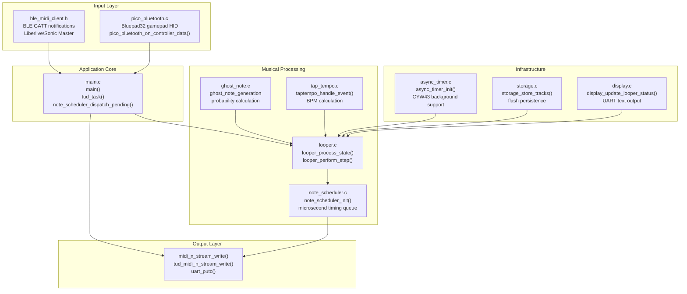
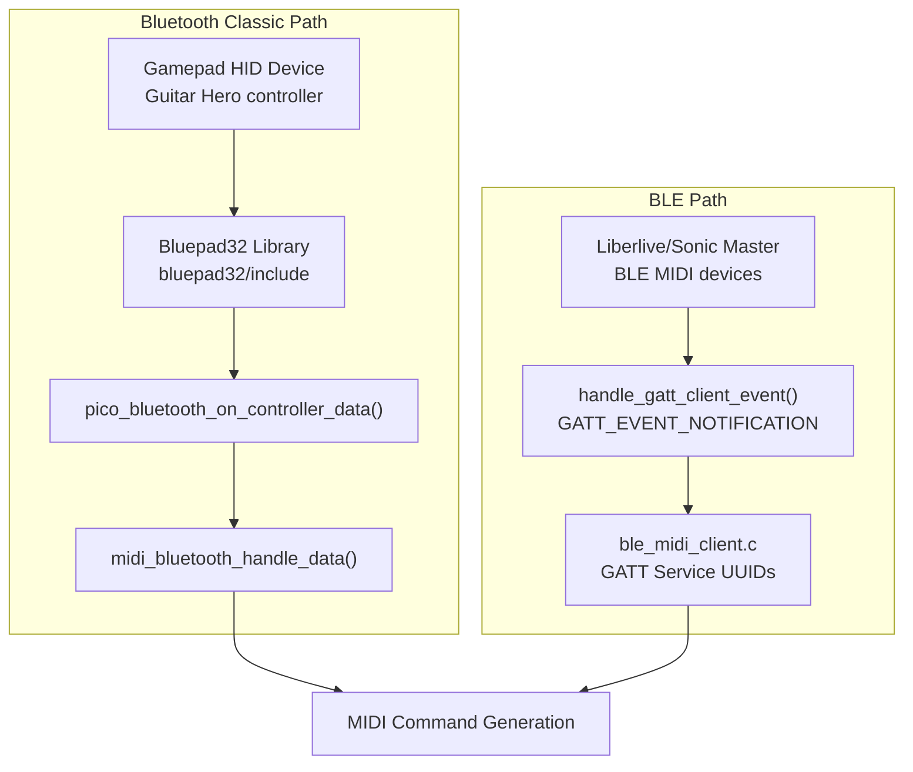
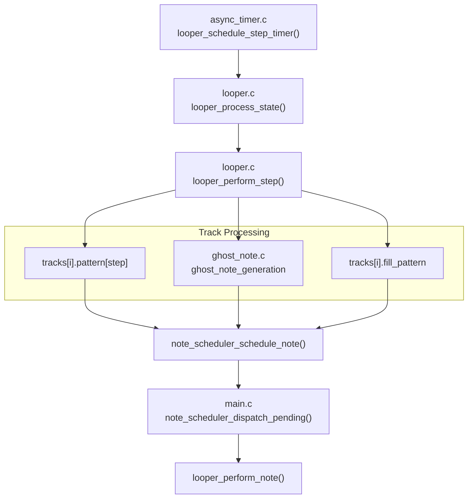
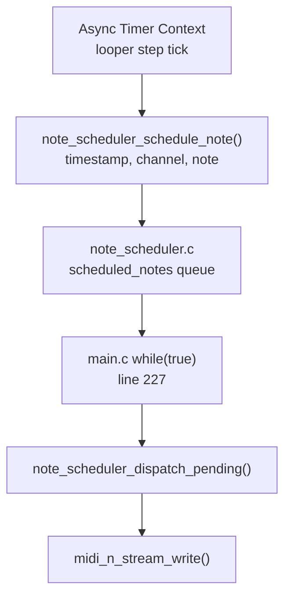
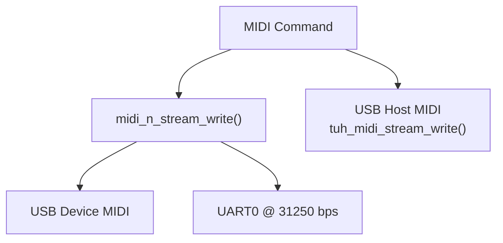

# Architecture

> **Relevant source files**
> * [CMakeLists.txt](https://github.com/Jus-Be/orinayo-pico/blob/6dde5a75/CMakeLists.txt)
> * [Hiroyuki_OYAMA_license.md](https://github.com/Jus-Be/orinayo-pico/blob/6dde5a75/Hiroyuki_OYAMA_license.md?plain=1)
> * [README.md](https://github.com/Jus-Be/orinayo-pico/blob/6dde5a75/README.md?plain=1)
> * [main.c](https://github.com/Jus-Be/orinayo-pico/blob/6dde5a75/main.c)
> * [tusb_config.h](https://github.com/Jus-Be/orinayo-pico/blob/6dde5a75/tusb_config.h)
> * [usb_descriptors.c](https://github.com/Jus-Be/orinayo-pico/blob/6dde5a75/usb_descriptors.c)

## Purpose and Scope

This document describes the overall system architecture of the Orinayo Bluetooth-to-MIDI gateway, detailing how the major subsystems interact to process Bluetooth controller input and generate MIDI output. It covers the structural organization of components, their dependencies, and the primary data flow paths through the system.

For specific implementation details of individual subsystems, see [System Components](./3.1-system-components.md). For end-to-end data processing, see [Data Flow Pipeline](./3.2-data-flow-pipeline.md). For hardware-level interfaces, see [Hardware Interfaces](./3.3-hardware-interfaces.md).

## System Overview

The system implements a layered architecture with three primary domains: input processing, musical transformation, and output generation. The Raspberry Pi Pico 2 W hardware provides dual-core RP2350 processing [CMakeLists.txt L23-L24](https://github.com/Jus-Be/orinayo-pico/blob/6dde5a75/CMakeLists.txt#L23-L24)

 with an integrated CYW43 wireless chip handling Bluetooth connectivity.

### High-Level Component Diagram

```mermaid
flowchart TD

BLE["ble_midi_client.h<br>BLE GATT notifications<br>Liberlive/Sonic Master"]
Bluepad32["pico_bluetooth.c<br>Bluepad32 gamepad HID<br>pico_bluetooth_on_controller_data()"]
Main["main.c<br>main()<br>tud_task()<br>note_scheduler_dispatch_pending()"]
Looper["looper.c<br>looper_process_state()<br>looper_perform_step()"]
GhostNote["ghost_note.c<br>ghost_note_generation<br>probability calculation"]
NoteScheduler["note_scheduler.c<br>note_scheduler_init()<br>microsecond timing queue"]
TapTempo["tap_tempo.c<br>taptempo_handle_event()<br>BPM calculation"]
AsyncTimer["async_timer.c<br>async_timer_init()<br>CYW43 background support"]
Storage["storage.c<br>storage_store_tracks()<br>flash persistence"]
Display["display.c<br>display_update_looper_status()<br>UART text output"]
MIDIOut["midi_n_stream_write()<br>tud_midi_n_stream_write()<br>uart_putc()"]

BLE --> Main
Bluepad32 --> Main
Main --> Looper
NoteScheduler --> MIDIOut
Main --> MIDIOut
AsyncTimer --> Looper
Storage --> Looper
Display --> Looper

subgraph Output ["Output Layer"]
    MIDIOut
end

subgraph Infrastructure ["Infrastructure"]
    AsyncTimer
    Storage
    Display
end

subgraph Musical ["Musical Processing"]
    Looper
    GhostNote
    NoteScheduler
    TapTempo
    Looper --> NoteScheduler
    GhostNote --> Looper
    TapTempo --> Looper
end

subgraph Core ["Application Core"]
    Main
end

subgraph InputLayer ["Input Layer"]
    BLE
    Bluepad32
end
```

**Sources:** [main.c L194-L225](https://github.com/Jus-Be/orinayo-pico/blob/6dde5a75/main.c#L194-L225)

 [CMakeLists.txt L68-L73](https://github.com/Jus-Be/orinayo-pico/blob/6dde5a75/CMakeLists.txt#L68-L73)

 [tusb_config.h L41-L51](https://github.com/Jus-Be/orinayo-pico/blob/6dde5a75/tusb_config.h#L41-L51)

### Component Responsibilities

| Component | Primary Function | Key Data Structures |
| --- | --- | --- |
| `pico_bluetooth.c` | HID button mapping, chord generation, mode management | `chord_chat`, `strum_pattern` |
| `main.c` | System initialization, USB task processing, MIDI output | `held_notes_mask`, `midi_running_status` |
| `looper.c` | 32-step sequencer, pattern playback, state machine | `tracks[]`, `looper_status_t` |
| `note_scheduler.c` | Microsecond-precision note timing queue | `scheduled_notes[]` queue |
| `async_timer.c` | Async context for timer callbacks | `async_context_t` |
| `storage.c` | Persistent flash storage for preferences and patterns | `preferences_t`, `pattern_t` |

**Sources:** [main.c L117-L123](https://github.com/Jus-Be/orinayo-pico/blob/6dde5a75/main.c#L117-L123)

 [main.c L209-L218](https://github.com/Jus-Be/orinayo-pico/blob/6dde5a75/main.c#L209-L218)

 [CMakeLists.txt L68-L73](https://github.com/Jus-Be/orinayo-pico/blob/6dde5a75/CMakeLists.txt#L68-L73)

## Core Subsystems

### Bluetooth Input Processing

The system supports two Bluetooth input paths that converge at the MIDI generation stage:

```mermaid
flowchart TD

GamepadHID["Gamepad HID Device<br>Guitar Hero controller"]
Bluepad32Lib["Bluepad32 Library<br>bluepad32/include"]
OnController["pico_bluetooth_on_controller_data()"]
HandleData["midi_bluetooth_handle_data()"]
BLEDevice["Liberlive/Sonic Master<br>BLE MIDI devices"]
GATTNotify["handle_gatt_client_event()<br>GATT_EVENT_NOTIFICATION"]
CustomUUID["ble_midi_client.c<br>GATT Service UUIDs"]
MIDIGen["MIDI Command Generation"]

HandleData --> MIDIGen
CustomUUID --> MIDIGen

subgraph BLE ["BLE Path"]
    BLEDevice
    GATTNotify
    CustomUUID
    BLEDevice --> GATTNotify
    GATTNotify --> CustomUUID
end

subgraph Classic ["Bluetooth Classic Path"]
    GamepadHID
    Bluepad32Lib
    OnController
    HandleData
    GamepadHID --> Bluepad32Lib
    Bluepad32Lib --> OnController
    OnController --> HandleData
end
```

**Sources:** [main.c L210](https://github.com/Jus-Be/orinayo-pico/blob/6dde5a75/main.c#L210-L210)

 [CMakeLists.txt L68-L70](https://github.com/Jus-Be/orinayo-pico/blob/6dde5a75/CMakeLists.txt#L68-L70)

 [README.md L25-L31](https://github.com/Jus-Be/orinayo-pico/blob/6dde5a75/README.md?plain=1#L25-L31)

#### Button State Management

The system maintains global button state variables updated by controller inputs to drive the chord and looper logic:

* **Fret/Button inputs:** `but4`, `mbut0`, `orange` [main.c L102-L107](https://github.com/Jus-Be/orinayo-pico/blob/6dde5a75/main.c#L102-L107)
* **Navigation:** `dpad_down`, `joystick_up`, `joy_up` [main.c L104-L109](https://github.com/Jus-Be/orinayo-pico/blob/6dde5a75/main.c#L104-L109)
* **Special:** `logo`, `starpower` [main.c L105-L106](https://github.com/Jus-Be/orinayo-pico/blob/6dde5a75/main.c#L105-L106)

**Sources:** [main.c L102-L110](https://github.com/Jus-Be/orinayo-pico/blob/6dde5a75/main.c#L102-L110)

### Musical Processing Pipeline

The looper subsystem implements a 32-step (2-bar) sequencer with 14 drum tracks. It is driven by the `async_timer` to ensure timing consistency regardless of USB task load.

```mermaid
flowchart TD

Timer["async_timer.c<br>looper_schedule_step_timer()"]
ProcessState["looper.c<br>looper_process_state()"]
PerformStep["looper.c<br>looper_perform_step()"]
Track1["tracks[i].pattern[step]"]
Ghost["ghost_note.c<br>ghost_note_generation"]
Fill["tracks[i].fill_pattern"]
Schedule["note_scheduler_schedule_note()"]
Dispatch["main.c<br>note_scheduler_dispatch_pending()"]
Output["looper_perform_note()"]

Timer --> ProcessState
ProcessState --> PerformStep
PerformStep --> Track1
PerformStep --> Ghost
PerformStep --> Fill
Track1 --> Schedule
Ghost --> Schedule
Fill --> Schedule
Schedule --> Dispatch
Dispatch --> Output

subgraph Tracks ["Track Processing"]
    Track1
    Ghost
    Fill
end
```

**Sources:** [main.c L215-L217](https://github.com/Jus-Be/orinayo-pico/blob/6dde5a75/main.c#L215-L217)

 [looper.c L1-L20](https://github.com/Jus-Be/orinayo-pico/blob/6dde5a75/looper.c#L1-L20)

### Note Scheduler

The note scheduler decouples note event generation (in async timer context) from MIDI transmission (in main loop) to avoid USB mutex contention and ensure microsecond precision.

```mermaid
flowchart TD

AsyncContext["Async Timer Context<br>looper step tick"]
Schedule["note_scheduler_schedule_note()<br>timestamp, channel, note"]
Queue["note_scheduler.c<br>scheduled_notes queue"]
MainLoop["main.c while(true)<br>line 227"]
Dispatch["note_scheduler_dispatch_pending()"]
Perform["midi_n_stream_write()"]

AsyncContext --> Schedule
Schedule --> Queue
Queue --> MainLoop
MainLoop --> Dispatch
Dispatch --> Perform
```

**Sources:** [main.c L217](https://github.com/Jus-Be/orinayo-pico/blob/6dde5a75/main.c#L217-L217)

 [main.c L227-L231](https://github.com/Jus-Be/orinayo-pico/blob/6dde5a75/main.c#L227-L231)

 [note_scheduler.c L1-L10](https://github.com/Jus-Be/orinayo-pico/blob/6dde5a75/note_scheduler.c#L1-L10)

## Data Flow Pipeline

### Input to Output Sequence

The following diagram traces a complete strum event from button press to MIDI transmission:

```mermaid
sequenceDiagram
  participant Bluetooth Controller
  participant pico_bluetooth.c
  participant main.c
  participant midi_n_stream_write()
  participant TinyUSB (tud_midi)
  participant UART0 (Hardware)

  Bluetooth Controller->>pico_bluetooth.c: HID report
  pico_bluetooth.c->>pico_bluetooth.c: midi_bluetooth_handle_data()
  pico_bluetooth.c->>main.c: midi_send_chord_note()
  main.c->>midi_n_stream_write(): midi_n_stream_write()
  midi_n_stream_write()->>TinyUSB (tud_midi): tud_midi_packet_write()
  midi_n_stream_write()->>UART0 (Hardware): uart_putc() loop
```

**Sources:** [main.c L165](https://github.com/Jus-Be/orinayo-pico/blob/6dde5a75/main.c#L165-L165)

 [main.c L220-L224](https://github.com/Jus-Be/orinayo-pico/blob/6dde5a75/main.c#L220-L224)

 [pico_bluetooth.c L1-L50](https://github.com/Jus-Be/orinayo-pico/blob/6dde5a75/pico_bluetooth.c#L1-L50)

## Thread Model and Timing

### Execution Contexts

The system utilizes the RP2350 dual-core capability to separate USB Host tasks from the main application logic:

| Context | Trigger | Functions | Core |
| --- | --- | --- | --- |
| **Core 0 Main** | Continuous | `main()`, `tud_task()`, `bluetooth_init()` | Core 0 [main.c L194](https://github.com/Jus-Be/orinayo-pico/blob/6dde5a75/main.c#L194-L194) |
| **Core 1 Host** | Continuous | `core1_main()`, `tuh_task()` | Core 1 [main.c L185-L192](https://github.com/Jus-Be/orinayo-pico/blob/6dde5a75/main.c#L185-L192) |
| **Async Timer** | Periodic | `looper_schedule_step_timer()` | Core 0 (Interrupt/Alarm) [main.c L215](https://github.com/Jus-Be/orinayo-pico/blob/6dde5a75/main.c#L215-L215) |

**Sources:** [main.c L185-L215](https://github.com/Jus-Be/orinayo-pico/blob/6dde5a75/main.c#L185-L215)

 [main.c L227-L228](https://github.com/Jus-Be/orinayo-pico/blob/6dde5a75/main.c#L227-L228)

## Output Architecture

### Dual MIDI Output

The system transmits MIDI data simultaneously across three interfaces:

1. **USB Device:** For connection to DAWs [tusb_config.h L41](https://github.com/Jus-Be/orinayo-pico/blob/6dde5a75/tusb_config.h#L41-L41)
2. **USB Host:** For connection to MIDI-compliant hardware via PIO USB [tusb_config.h L42](https://github.com/Jus-Be/orinayo-pico/blob/6dde5a75/tusb_config.h#L42-L42)
3. **Hardware UART:** For connection to synthesizers at 31,250 baud [main.c L66-L70](https://github.com/Jus-Be/orinayo-pico/blob/6dde5a75/main.c#L66-L70)

```mermaid
flowchart TD

Input["MIDI Command"]
Function["midi_n_stream_write()"]
USB_D["USB Device MIDI"]
USB_H["USB Host MIDI<br>tuh_midi_stream_write()"]
UART["UART0 @ 31250 bps"]

Input --> Function
Function --> USB_D
Function --> UART
Input --> USB_H
```

**Sources:** [main.c L66-L70](https://github.com/Jus-Be/orinayo-pico/blob/6dde5a75/main.c#L66-L70)

 [main.c L165](https://github.com/Jus-Be/orinayo-pico/blob/6dde5a75/main.c#L165-L165)

 [main.c L236-L239](https://github.com/Jus-Be/orinayo-pico/blob/6dde5a75/main.c#L236-L239)

 [tusb_config.h L41-L44](https://github.com/Jus-Be/orinayo-pico/blob/6dde5a75/tusb_config.h#L41-L44)