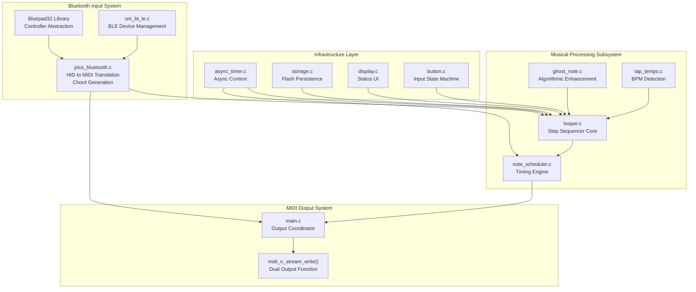
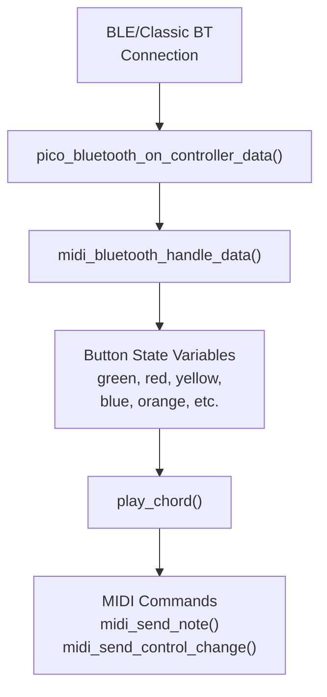
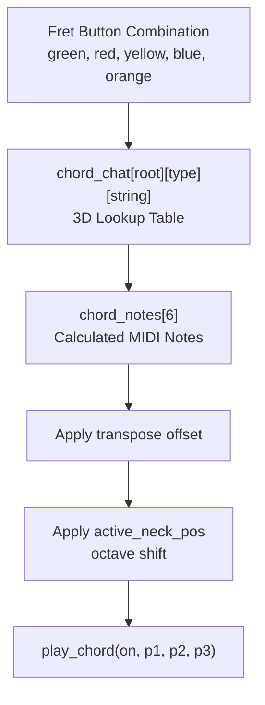
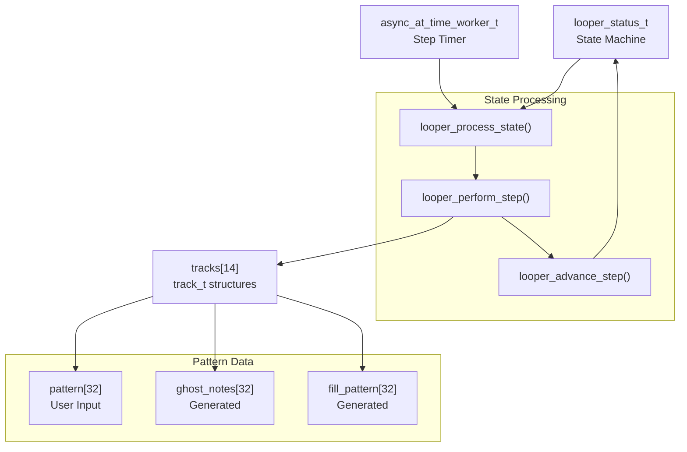
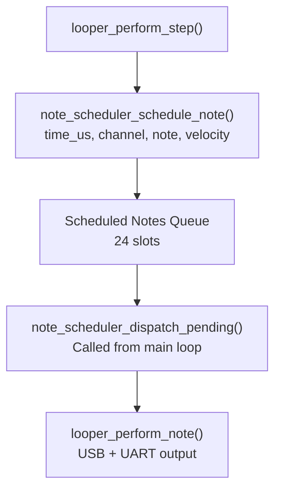
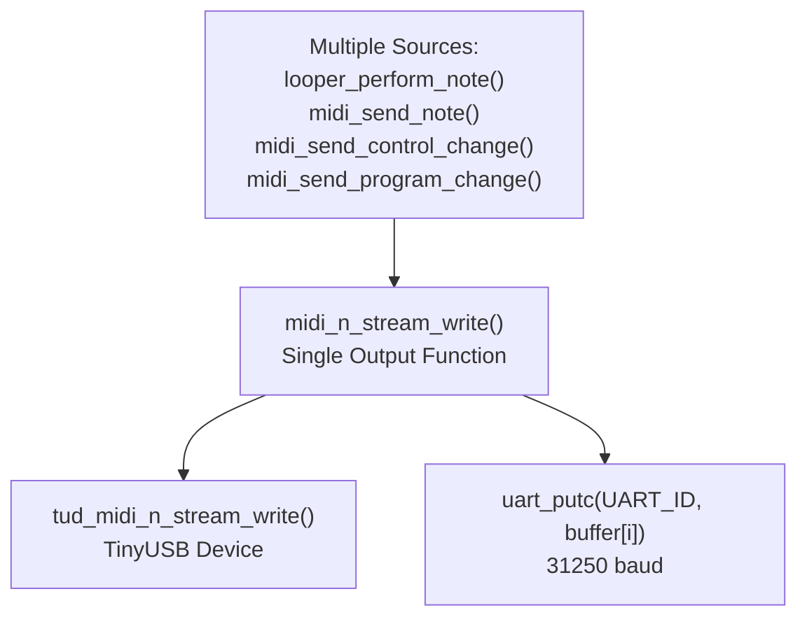
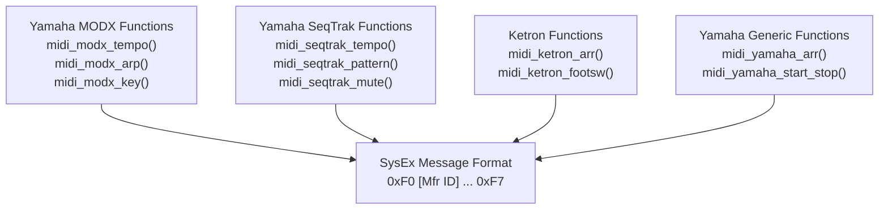
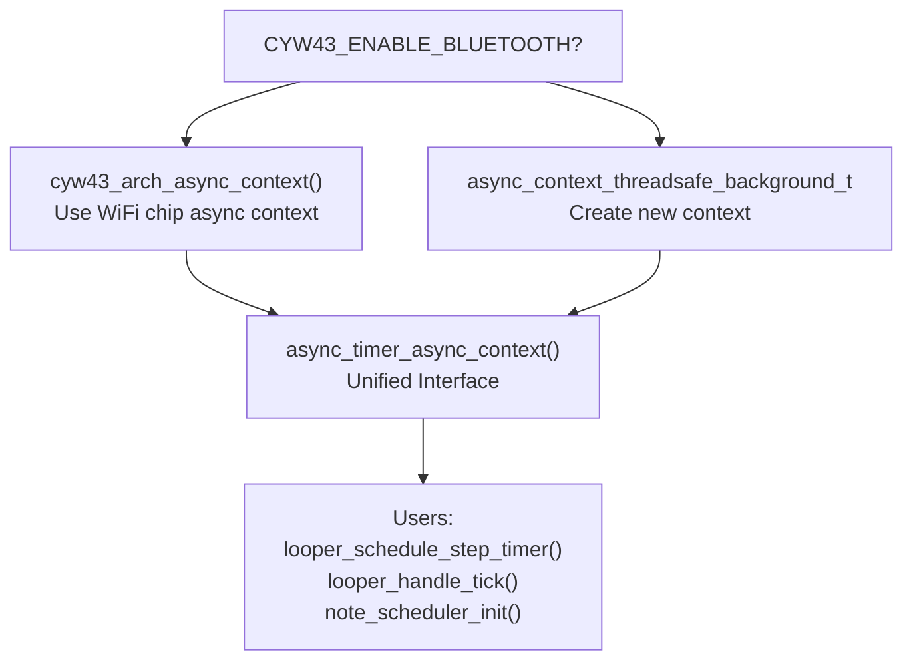
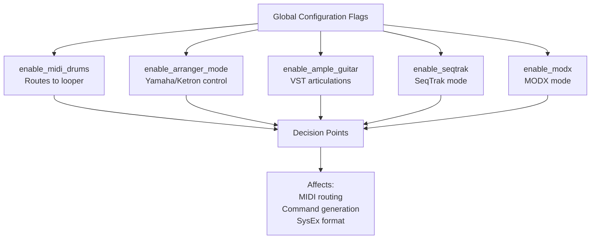

# System Components

> **Relevant source files**
> * [async_timer.c](https://github.com/Jus-Be/orinayo-pico/blob/122fa496/async_timer.c)
> * [async_timer.h](https://github.com/Jus-Be/orinayo-pico/blob/122fa496/async_timer.h)
> * [looper.c](https://github.com/Jus-Be/orinayo-pico/blob/122fa496/looper.c)
> * [main.c](https://github.com/Jus-Be/orinayo-pico/blob/122fa496/main.c)
> * [pico_bluetooth.c](https://github.com/Jus-Be/orinayo-pico/blob/122fa496/pico_bluetooth.c)

This document describes the major subsystems that comprise the Orinayo system: the Bluetooth input system, musical processing subsystem, MIDI output system, and supporting infrastructure. Each subsystem is presented with its key source files, primary functions, and role in the overall architecture.

For detailed information about how data flows through these components, see [Data Flow Pipeline](./3.2-data-flow-pipeline.md). For hardware-specific interfaces, see [Hardware Interfaces](./3.3-hardware-interfaces.md).

---

## Component Architecture Overview

The Orinayo system consists of four primary subsystems that work together to translate Bluetooth controller input into MIDI output with musical processing:



**Sources:** [pico_bluetooth.c L1-L2656](https://github.com/Jus-Be/orinayo-pico/blob/122fa496/pico_bluetooth.c#L1-L2656)

 [main.c L1-L697](https://github.com/Jus-Be/orinayo-pico/blob/122fa496/main.c#L1-L697)

 [looper.c L1-L527](https://github.com/Jus-Be/orinayo-pico/blob/122fa496/looper.c#L1-L527)

 [async_timer.c L1-L34](https://github.com/Jus-Be/orinayo-pico/blob/122fa496/async_timer.c#L1-L34)

---

## Bluetooth Input System

The Bluetooth Input System handles device discovery, connection management, HID report parsing, and translation of controller button states into musical commands. This subsystem has the highest importance rating (646.46) due to its critical role as the system's input interface.

### Key Components

| Component | File | Primary Responsibilities |
| --- | --- | --- |
| HID-to-MIDI Gateway | `pico_bluetooth.c` | Button state parsing, chord generation, operational mode selection |
| BLE Device Manager | `uni_bt_le.c` | Device discovery, pairing, GATT notifications for BLE MIDI devices |
| Controller Abstraction | Bluepad32 library | Standardized gamepad/controller interface |

### Core Data Flow



**Sources:** [pico_bluetooth.c L276-L325](https://github.com/Jus-Be/orinayo-pico/blob/122fa496/pico_bluetooth.c#L276-L325)

 [pico_bluetooth.c L327-L1219](https://github.com/Jus-Be/orinayo-pico/blob/122fa496/pico_bluetooth.c#L327-L1219)

### Button State Management

The system maintains global state variables for all controller inputs:

* **Fret buttons**: `green`, `red`, `yellow`, `blue`, `orange` [pico_bluetooth.c L66-L70](https://github.com/Jus-Be/orinayo-pico/blob/122fa496/pico_bluetooth.c#L66-L70)
* **Strum inputs**: `dpad_left`, `dpad_right` [pico_bluetooth.c L56-L57](https://github.com/Jus-Be/orinayo-pico/blob/122fa496/pico_bluetooth.c#L56-L57)
* **Action buttons**: `mbut0` (start/stop), `mbut1` (style), `mbut2` (menu), `mbut3` (config) [pico_bluetooth.c L51-L54](https://github.com/Jus-Be/orinayo-pico/blob/122fa496/pico_bluetooth.c#L51-L54)
* **Modifiers**: `pitch`, `song_key`, `start` [pico_bluetooth.c L72-L80](https://github.com/Jus-Be/orinayo-pico/blob/122fa496/pico_bluetooth.c#L72-L80)

The `pico_bluetooth_on_controller_data()` function [pico_bluetooth.c L276-L325](https://github.com/Jus-Be/orinayo-pico/blob/122fa496/pico_bluetooth.c#L276-L325)

 extracts button states from the `uni_controller_t` structure provided by Bluepad32 and updates these global variables. The `midi_bluetooth_handle_data()` function [pico_bluetooth.c L327-L1219](https://github.com/Jus-Be/orinayo-pico/blob/122fa496/pico_bluetooth.c#L327-L1219)

 then processes state changes sequentially with early returns to handle one button change per invocation.

### Chord Generation System

The chord generation system uses a 3D lookup table `chord_chat[12][3][6]` [pico_bluetooth.c L138-L151](https://github.com/Jus-Be/orinayo-pico/blob/122fa496/pico_bluetooth.c#L138-L151)

 to map fret button combinations to guitar chord fingerings:

* **Dimension 1**: 12 root notes (C through B)
* **Dimension 2**: 3 chord types (major, minor, seventh)
* **Dimension 3**: 6 guitar strings with fret positions



**Sources:** [pico_bluetooth.c L138-L151](https://github.com/Jus-Be/orinayo-pico/blob/122fa496/pico_bluetooth.c#L138-L151)

 [pico_bluetooth.c L1221-L1385](https://github.com/Jus-Be/orinayo-pico/blob/122fa496/pico_bluetooth.c#L1221-L1385)

### Operational Modes

The system supports five distinct operational modes controlled by configuration flags:

| Mode | Enable Flag | Target Device | Primary Functions |
| --- | --- | --- | --- |
| Arranger | `enable_arranger_mode` | Yamaha/Ketron keyboards | `midi_yamaha_arr()`, `midi_ketron_arr()` |
| Ample Guitar | `enable_ample_guitar` | Ample Guitar VST | Key switches, special articulations |
| MIDI Drums | `enable_midi_drums` | Looper subsystem | Routes to step sequencer |
| SeqTrak | `enable_seqtrak` | Yamaha SeqTrak | `midi_seqtrak_pattern()`, `midi_seqtrak_mute()` |
| MODX | `enable_modx` | Yamaha MODX | `midi_modx_arp()`, scene switching |

**Sources:** [pico_bluetooth.c L32-L38](https://github.com/Jus-Be/orinayo-pico/blob/122fa496/pico_bluetooth.c#L32-L38)

---

## Musical Processing Subsystem

The Musical Processing Subsystem implements the looper, ghost note generation, tap tempo detection, and note scheduling. This subsystem transforms simple button input into complex rhythmic patterns with humanization.

### Looper Architecture



**Sources:** [looper.c L49-L67](https://github.com/Jus-Be/orinayo-pico/blob/122fa496/looper.c#L49-L67)

 [looper.c L287-L344](https://github.com/Jus-Be/orinayo-pico/blob/122fa496/looper.c#L287-L344)

### Track Structure

Each of the 14 drum tracks is represented by a `track_t` structure containing:

```yaml
track_t {
    name: string          // Display name (e.g., "Bass", "Snare")
    note: uint8_t         // MIDI note number (e.g., 36 for bass drum)
    channel: uint8_t      // MIDI channel (typically channel 10)
    pattern[32]: bool     // User-recorded pattern
    ghost_notes[32]: struct // Algorithmic enhancement data
    fill_pattern[32]: bool  // Fill-in pattern
}
```

**Sources:** [looper.c L51-L66](https://github.com/Jus-Be/orinayo-pico/blob/122fa496/looper.c#L51-L66)

### State Machine

The looper operates as a state machine with the following states:

| State | Enum Value | Behavior |
| --- | --- | --- |
| WAITING | `LOOPER_STATE_WAITING` | Idle, waiting for enable_midi_drums |
| PLAYING | `LOOPER_STATE_PLAYING` | Playback with ghost notes and fills |
| RECORDING | `LOOPER_STATE_RECORDING` | Capturing user input with click track |
| TRACK_SWITCH | `LOOPER_STATE_TRACK_SWITCH` | Switch to next track |
| TAP_TEMPO | `LOOPER_STATE_TAP_TEMPO` | BPM detection mode |
| CLEAR_TRACKS | `LOOPER_STATE_CLEAR_TRACKS` | Erase all patterns |
| SYNC_PLAYING | `LOOPER_STATE_SYNC_PLAYING` | External MIDI clock playback |
| SYNC_MUTE | `LOOPER_STATE_SYNC_MUTE` | External MIDI clock muted |

**Sources:** [looper.c L287-L344](https://github.com/Jus-Be/orinayo-pico/blob/122fa496/looper.c#L287-L344)

### Timer-Driven Processing

The looper's main processing occurs in `looper_handle_tick()` [looper.c L423-L435](https://github.com/Jus-Be/orinayo-pico/blob/122fa496/looper.c#L423-L435)

 which:

1. Calls `midi_process_state()` to handle Bluetooth input
2. Calls `looper_process_state()` to advance the sequencer
3. Calculates the next tick delay based on BPM: `step_period_ms = 60000 / (bpm * LOOPER_STEPS_PER_BEAT)`
4. Reschedules itself via `async_context_add_at_time_worker_in_ms()`

**Sources:** [looper.c L423-L435](https://github.com/Jus-Be/orinayo-pico/blob/122fa496/looper.c#L423-L435)

 [looper.c L281-L285](https://github.com/Jus-Be/orinayo-pico/blob/122fa496/looper.c#L281-L285)

### Note Scheduling



The note scheduler separates scheduling (in async timer context) from dispatch (in main loop) to avoid USB mutex contention. Notes are scheduled with microsecond timestamps and dispatched when `time_us_64() >= scheduled_time`.

**Sources:** [looper.c L131-L134](https://github.com/Jus-Be/orinayo-pico/blob/122fa496/looper.c#L131-L134)

 [looper.c L162-L194](https://github.com/Jus-Be/orinayo-pico/blob/122fa496/looper.c#L162-L194)

 [main.c L169](https://github.com/Jus-Be/orinayo-pico/blob/122fa496/main.c#L169-L169)

---

## MIDI Output System

The MIDI Output System coordinates all MIDI output through a single bottleneck function that simultaneously transmits to USB and UART interfaces.

### Output Architecture



**Sources:** [main.c L690-L697](https://github.com/Jus-Be/orinayo-pico/blob/122fa496/main.c#L690-L697)

### Dual Output Implementation

The `midi_n_stream_write()` function [main.c L690-L697](https://github.com/Jus-Be/orinayo-pico/blob/122fa496/main.c#L690-L697)

 implements the dual-output strategy:

```javascript
uint32_t midi_n_stream_write(uint8_t itf, uint8_t cable_num, 
                              const uint8_t *buffer, uint32_t bufsize) {
    tud_midi_n_stream_write(itf, cable_num, buffer, bufsize);
    
    for (int i=0; i<bufsize; i++) {
        while (!uart_is_writable(UART_ID)){ }  
        uart_putc(UART_ID, buffer[i]);     
    }
}
```

This ensures every MIDI message is sent to both interfaces atomically.

**Sources:** [main.c L690-L697](https://github.com/Jus-Be/orinayo-pico/blob/122fa496/main.c#L690-L697)

### MIDI Message Types

The system generates four categories of MIDI messages:

| Category | Functions | Usage |
| --- | --- | --- |
| Note Messages | `midi_send_note()`, `looper_perform_note()` | Note On/Off (0x90/0x80) |
| Control Changes | `midi_send_control_change()` | CC messages (0xB0) for parameters |
| Program Changes | `midi_send_program_change()` | PC messages (0xC0) for sound selection |
| System Exclusive | `midi_modx_tempo()`, `midi_seqtrak_key()`, etc. | Device-specific SysEx (0xF0...0xF7) |

**Sources:** [main.c L480-L512](https://github.com/Jus-Be/orinayo-pico/blob/122fa496/main.c#L480-L512)

 [main.c L493-L502](https://github.com/Jus-Be/orinayo-pico/blob/122fa496/main.c#L493-L502)

 [main.c L504-L512](https://github.com/Jus-Be/orinayo-pico/blob/122fa496/main.c#L504-L512)

### Synthesizer-Specific Control

The system implements dedicated control functions for specific synthesizer models:



**Sources:** [main.c L231-L352](https://github.com/Jus-Be/orinayo-pico/blob/122fa496/main.c#L231-L352)

 [main.c L373-L451](https://github.com/Jus-Be/orinayo-pico/blob/122fa496/main.c#L373-L451)

 [main.c L537-L582](https://github.com/Jus-Be/orinayo-pico/blob/122fa496/main.c#L537-L582)

---

## Infrastructure Layer

The Infrastructure Layer provides supporting functionality for timing, persistence, display, and button input handling.

### Asynchronous Timer System



The `async_timer.c` module [async_timer.c L1-L34](https://github.com/Jus-Be/orinayo-pico/blob/122fa496/async_timer.c#L1-L34)

 provides a unified asynchronous context abstraction:

* **Pico W with CYW43 Bluetooth**: Returns `cyw43_arch_async_context()` to use the WiFi chip's built-in async context [async_timer.c L28-L29](https://github.com/Jus-Be/orinayo-pico/blob/122fa496/async_timer.c#L28-L29)
* **Other Pico boards**: Initializes and returns a `async_context_threadsafe_background_t` [async_timer.c L14-L32](https://github.com/Jus-Be/orinayo-pico/blob/122fa496/async_timer.c#L14-L32)

This abstraction allows the same code to work across different Pico hardware variants.

**Sources:** [async_timer.c L1-L34](https://github.com/Jus-Be/orinayo-pico/blob/122fa496/async_timer.c#L1-L34)

 [async_timer.h L1-L13](https://github.com/Jus-Be/orinayo-pico/blob/122fa496/async_timer.h#L1-L13)

### Component Interaction Summary

The following table summarizes how the major subsystems interact:

| From Component | To Component | Interface | Purpose |
| --- | --- | --- | --- |
| Bluetooth Input | Musical Processing | `looper_status.state` modification | Control looper state |
| Bluetooth Input | MIDI Output | `midi_send_*()` functions | Direct chord/note output |
| Musical Processing | MIDI Output | `looper_perform_note()` | Sequenced drum output |
| Musical Processing | Musical Processing | `note_scheduler_schedule_note()` | Deferred note dispatch |
| Infrastructure | Musical Processing | `async_context_add_at_time_worker_in_ms()` | Timer scheduling |
| Infrastructure | Musical Processing | `storage_load_tracks()`, `storage_store_tracks()` | Pattern persistence |

**Sources:** [pico_bluetooth.c L606-L623](https://github.com/Jus-Be/orinayo-pico/blob/122fa496/pico_bluetooth.c#L606-L623)

 [main.c L125-L171](https://github.com/Jus-Be/orinayo-pico/blob/122fa496/main.c#L125-L171)

 [looper.c L516-L526](https://github.com/Jus-Be/orinayo-pico/blob/122fa496/looper.c#L516-L526)

---

## Configuration and Mode Selection

System behavior is controlled by global boolean flags that enable/disable subsystems:



These flags are toggled by specific button combinations in `midi_bluetooth_handle_data()` [pico_bluetooth.c L977-L994](https://github.com/Jus-Be/orinayo-pico/blob/122fa496/pico_bluetooth.c#L977-L994)

 and checked throughout the codebase to alter behavior.

**Sources:** [pico_bluetooth.c L32-L38](https://github.com/Jus-Be/orinayo-pico/blob/122fa496/pico_bluetooth.c#L32-L38)

 [pico_bluetooth.c L977-L994](https://github.com/Jus-Be/orinayo-pico/blob/122fa496/pico_bluetooth.c#L977-L994)