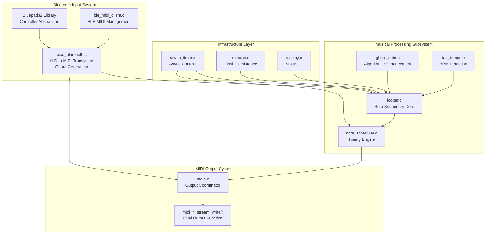
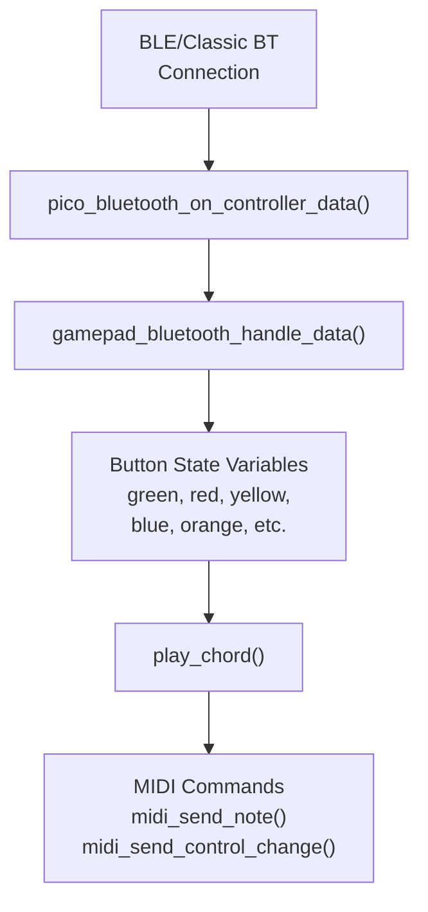
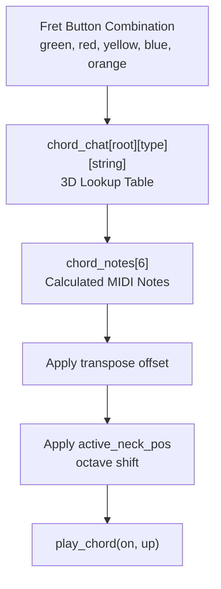
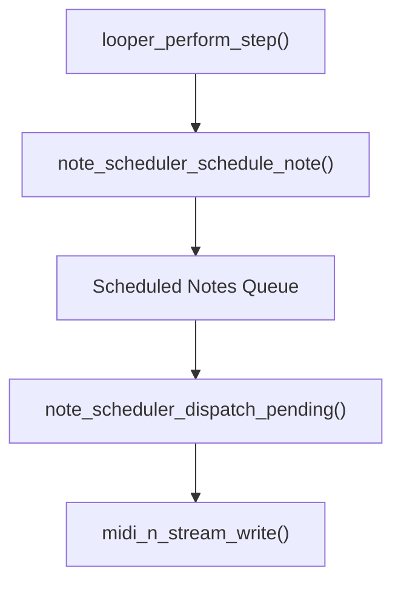
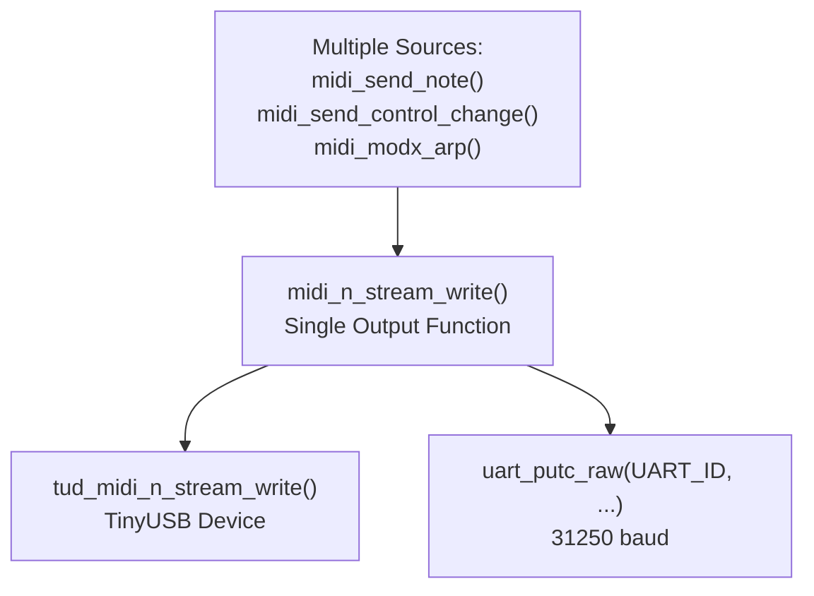
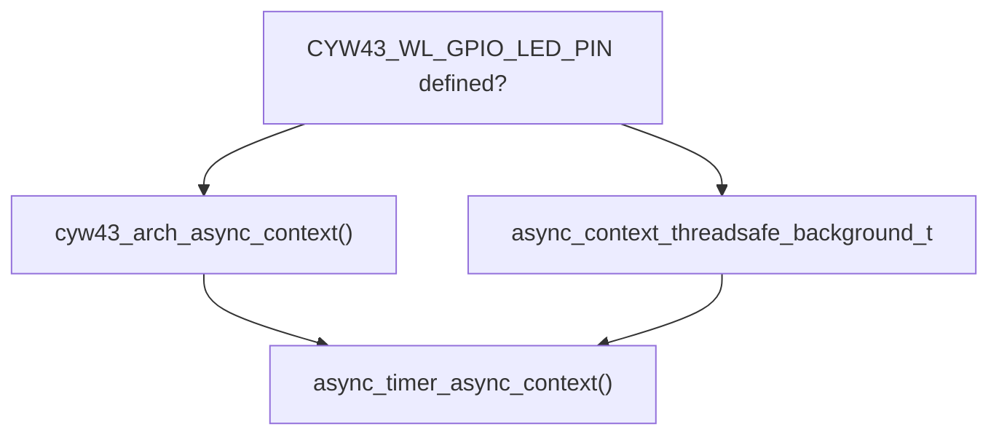

# System Components

> **Relevant source files**
> * [CMakeLists.txt](https://github.com/Jus-Be/orinayo-pico/blob/6dde5a75/CMakeLists.txt)
> * [main.c](https://github.com/Jus-Be/orinayo-pico/blob/6dde5a75/main.c)
> * [pico_bluetooth.c](https://github.com/Jus-Be/orinayo-pico/blob/6dde5a75/pico_bluetooth.c)
> * [tusb_config.h](https://github.com/Jus-Be/orinayo-pico/blob/6dde5a75/tusb_config.h)
> * [usb_descriptors.c](https://github.com/Jus-Be/orinayo-pico/blob/6dde5a75/usb_descriptors.c)

This document describes the major subsystems that comprise the Orinayo system: the Bluetooth input system, musical processing subsystem, MIDI output system, and supporting infrastructure. Each subsystem is presented with its key source files, primary functions, and role in the overall architecture.

For detailed information about how data flows through these components, see [Data Flow Pipeline](https://github.com/Jus-Be/orinayo-pico/blob/6dde5a75/Data Flow Pipeline)

 For hardware-specific interfaces, see [Hardware Interfaces](https://github.com/Jus-Be/orinayo-pico/blob/6dde5a75/Hardware Interfaces)

---

## Component Architecture Overview

The Orinayo system consists of four primary subsystems that work together to translate Bluetooth controller input into MIDI output with musical processing:

```mermaid
flowchart TD

PicoBT["pico_bluetooth.c<br>HID to MIDI Translation<br>Chord Generation"]
BLE_MIDI["ble_midi_client.c<br>BLE MIDI Management"]
BP32["Bluepad32 Library<br>Controller Abstraction"]
Looper["looper.c<br>Step Sequencer Core"]
GhostNote["ghost_note.c<br>Algorithmic Enhancement"]
TapTempo["tap_tempo.c<br>BPM Detection"]
NoteScheduler["note_scheduler.c<br>Timing Engine"]
Main["main.c<br>Output Coordinator"]
MidiStream["midi_n_stream_write()<br>Dual Output Function"]
AsyncTimer["async_timer.c<br>Async Context"]
Storage["storage.c<br>Flash Persistence"]
Display["display.c<br>Status UI"]

PicoBT --> Looper
PicoBT --> Main
NoteScheduler --> Main
AsyncTimer --> Looper
AsyncTimer --> NoteScheduler
Storage --> Looper
Display --> Looper

subgraph subGraph3 ["Infrastructure Layer"]
    AsyncTimer
    Storage
    Display
end

subgraph subGraph2 ["MIDI Output System"]
    Main
    MidiStream
    Main --> MidiStream
end

subgraph subGraph1 ["Musical Processing Subsystem"]
    Looper
    GhostNote
    TapTempo
    NoteScheduler
    Looper --> NoteScheduler
    GhostNote --> Looper
    TapTempo --> Looper
end

subgraph subGraph0 ["Bluetooth Input System"]
    PicoBT
    BLE_MIDI
    BP32
    BP32 --> PicoBT
    BLE_MIDI --> PicoBT
end
```

**Sources:** [pico_bluetooth.c L1-L230](https://github.com/Jus-Be/orinayo-pico/blob/6dde5a75/pico_bluetooth.c#L1-L230)

 [main.c L1-L226](https://github.com/Jus-Be/orinayo-pico/blob/6dde5a75/main.c#L1-L226)

 [CMakeLists.txt L68-L73](https://github.com/Jus-Be/orinayo-pico/blob/6dde5a75/CMakeLists.txt#L68-L73)

 [async_timer.c L1-L34](https://github.com/Jus-Be/orinayo-pico/blob/6dde5a75/async_timer.c#L1-L34)

---

## Bluetooth Input System

The Bluetooth Input System handles device discovery, connection management, HID report parsing, and translation of controller button states into musical commands.

### Key Components

| Component | File | Primary Responsibilities |
| --- | --- | --- |
| HID-to-MIDI Gateway | `pico_bluetooth.c` | Button state parsing, chord generation, operational mode selection |
| BLE MIDI Client | `ble_midi_client.c` | Connection and GATT handling for specialized MIDI controllers |
| Controller Abstraction | Bluepad32 library | Standardized gamepad/controller interface via BTstack |

### Core Data Flow

```mermaid
flowchart TD

BLE["BLE/Classic BT<br>Connection"]
OnController["pico_bluetooth_on_controller_data()"]
HandleData["gamepad_bluetooth_handle_data()"]
ButtonState["Button State Variables<br>green, red, yellow,<br>blue, orange, etc."]
PlayChord["play_chord()"]
MidiCommands["MIDI Commands<br>midi_send_note()<br>midi_send_control_change()"]

BLE --> OnController
OnController --> HandleData
HandleData --> ButtonState
ButtonState --> PlayChord
PlayChord --> MidiCommands
```

**Sources:** [pico_bluetooth.c L198-L199](https://github.com/Jus-Be/orinayo-pico/blob/6dde5a75/pico_bluetooth.c#L198-L199)

 [pico_bluetooth.c L214-L215](https://github.com/Jus-Be/orinayo-pico/blob/6dde5a75/pico_bluetooth.c#L214-L215)

### Button State Management

The system maintains global state variables for all controller inputs:

* **Fret buttons**: `green`, `red`, `yellow`, `blue`, `orange` [pico_bluetooth.c L96-L100](https://github.com/Jus-Be/orinayo-pico/blob/6dde5a75/pico_bluetooth.c#L96-L100)
* **Strum/D-Pad inputs**: `dpad_left`, `dpad_right`, `up`, `down` [pico_bluetooth.c L86-L106](https://github.com/Jus-Be/orinayo-pico/blob/6dde5a75/pico_bluetooth.c#L86-L106)
* **Action buttons**: `mbut0` (start/stop), `mbut1` (style), `mbut2` (menu), `mbut3` (config) [pico_bluetooth.c L81-L84](https://github.com/Jus-Be/orinayo-pico/blob/6dde5a75/pico_bluetooth.c#L81-L84)
* **Modifiers**: `pitch`, `song_key`, `start` [pico_bluetooth.c L102-L110](https://github.com/Jus-Be/orinayo-pico/blob/6dde5a75/pico_bluetooth.c#L102-L110)

The system extracts button states from the controller structures provided by Bluepad32 and updates these global variables. The `gamepad_bluetooth_handle_data()` function [pico_bluetooth.c L199](https://github.com/Jus-Be/orinayo-pico/blob/6dde5a75/pico_bluetooth.c#L199-L199)

 processes these state changes.

### Chord Generation System

The chord generation system uses a 3D lookup table `chord_chat[12][3][6]` [pico_bluetooth.c L231-L244](https://github.com/Jus-Be/orinayo-pico/blob/6dde5a75/pico_bluetooth.c#L231-L244)

 to map fret button combinations to guitar chord fingerings.

```mermaid
flowchart TD

FretCombo["Fret Button Combination<br>green, red, yellow, blue, orange"]
ChordLookup["chord_chat[root][type][string]<br>3D Lookup Table"]
ChordNotes["chord_notes[6]<br>Calculated MIDI Notes"]
Transpose["Apply transpose offset"]
NeckPos["Apply active_neck_pos<br>octave shift"]
PlayChord["play_chord(on, up)"]

FretCombo --> ChordLookup
ChordLookup --> ChordNotes
ChordNotes --> Transpose
Transpose --> NeckPos
NeckPos --> PlayChord
```

**Sources:** [pico_bluetooth.c L231-L244](https://github.com/Jus-Be/orinayo-pico/blob/6dde5a75/pico_bluetooth.c#L231-L244)

 [pico_bluetooth.c L214-L215](https://github.com/Jus-Be/orinayo-pico/blob/6dde5a75/pico_bluetooth.c#L214-L215)

---

## Musical Processing Subsystem

The Musical Processing Subsystem implements the looper, ghost note generation, tap tempo detection, and note scheduler.

### Looper and Scheduler Interaction

The looper coordinates with the note scheduler to ensure timing precision. Notes generated by the step sequencer are not sent directly to the hardware; instead, they are queued via the `note_scheduler` to ensure timing precision and USB safety.

```mermaid
flowchart TD

Perform["looper_perform_step()"]
Schedule["note_scheduler_schedule_note()"]
Queue["Scheduled Notes Queue"]
Dispatch["note_scheduler_dispatch_pending()"]
Output["midi_n_stream_write()"]

Perform --> Schedule
Schedule --> Queue
Queue --> Dispatch
Dispatch --> Output
```

The `note_scheduler_dispatch_pending()` function is called within the `main` loop [main.c L244](https://github.com/Jus-Be/orinayo-pico/blob/6dde5a75/main.c#L244-L244)

 to flush pending MIDI messages.

**Sources:** [main.c L215-L217](https://github.com/Jus-Be/orinayo-pico/blob/6dde5a75/main.c#L215-L217)

 [main.c L244](https://github.com/Jus-Be/orinayo-pico/blob/6dde5a75/main.c#L244-L244)

 [CMakeLists.txt L73](https://github.com/Jus-Be/orinayo-pico/blob/6dde5a75/CMakeLists.txt#L73-L73)

---

## MIDI Output System

The MIDI Output System coordinates all MIDI output through a single bottleneck function that simultaneously transmits to USB and UART interfaces.

### Output Architecture

```mermaid
flowchart TD

Sources["Multiple Sources:<br>midi_send_note()<br>midi_send_control_change()<br>midi_modx_arp()"]
Bottleneck["midi_n_stream_write()<br>Single Output Function"]
USB["tud_midi_n_stream_write()<br>TinyUSB Device"]
UART["uart_putc_raw(UART_ID, ...)<br>31250 baud"]

Sources --> Bottleneck
Bottleneck --> USB
Bottleneck --> UART
```

**Sources:** [main.c L165](https://github.com/Jus-Be/orinayo-pico/blob/6dde5a75/main.c#L165-L165)

 [main.c L66-L70](https://github.com/Jus-Be/orinayo-pico/blob/6dde5a75/main.c#L66-L70)

 [main.c L220-L224](https://github.com/Jus-Be/orinayo-pico/blob/6dde5a75/main.c#L220-L224)

### Dual Output Implementation

The `midi_n_stream_write()` function [main.c L165](https://github.com/Jus-Be/orinayo-pico/blob/6dde5a75/main.c#L165-L165)

 implements the dual-output strategy, ensuring that every MIDI message is sent to both the TinyUSB stack and the hardware UART. The UART is initialized to the standard MIDI baud rate of 31250 [main.c L67](https://github.com/Jus-Be/orinayo-pico/blob/6dde5a75/main.c#L67-L67)

---

## Infrastructure Layer

The Infrastructure Layer provides supporting functionality for timing, persistence, and hardware abstraction.

### Asynchronous Timer System

The `async_timer.c` module [async_timer.c L1-L34](https://github.com/Jus-Be/orinayo-pico/blob/6dde5a75/async_timer.c#L1-L34)

 provides a unified asynchronous context abstraction. This is critical for the Pico W architecture where the Bluetooth stack (CYW43) requires specific context handling.

* **Pico W with CYW43 Bluetooth**: Returns `cyw43_arch_async_context()` to use the WiFi chip's built-in async context [async_timer.c L28-L29](https://github.com/Jus-Be/orinayo-pico/blob/6dde5a75/async_timer.c#L28-L29)
* **Other Pico boards**: Initializes and returns a `async_context_threadsafe_background_t` [async_timer.c L14-L32](https://github.com/Jus-Be/orinayo-pico/blob/6dde5a75/async_timer.c#L14-L32)

```mermaid
flowchart TD

Check["CYW43_WL_GPIO_LED_PIN defined?"]
CYW43["cyw43_arch_async_context()"]
Threadsafe["async_context_threadsafe_background_t"]
Interface["async_timer_async_context()"]

Check --> CYW43
Check --> Threadsafe
CYW43 --> Interface
Threadsafe --> Interface
```

**Sources:** [async_timer.c L1-L34](https://github.com/Jus-Be/orinayo-pico/blob/6dde5a75/async_timer.c#L1-L34)

 [main.c L215](https://github.com/Jus-Be/orinayo-pico/blob/6dde5a75/main.c#L215-L215)

### Persistent Storage

The system utilizes flash storage via `storage.c` to persist looper patterns and user preferences. When `preferences_changed` is flagged [main.c L100](https://github.com/Jus-Be/orinayo-pico/blob/6dde5a75/main.c#L100-L100)

 the system handles the data persistence and can trigger a watchdog reboot [main.c L27-L28](https://github.com/Jus-Be/orinayo-pico/blob/6dde5a75/main.c#L27-L28)

**Sources:** [main.c L100](https://github.com/Jus-Be/orinayo-pico/blob/6dde5a75/main.c#L100-L100)

 [main.c L23-L24](https://github.com/Jus-Be/orinayo-pico/blob/6dde5a75/main.c#L23-L24)

 [CMakeLists.txt L68](https://github.com/Jus-Be/orinayo-pico/blob/6dde5a75/CMakeLists.txt#L68-L68)