# Data Flow Pipeline

> **Relevant source files**
> * [bluepad32/bt/uni_bt_le.c](https://github.com/Jus-Be/orinayo-pico/blob/122fa496/bluepad32/bt/uni_bt_le.c)
> * [looper.c](https://github.com/Jus-Be/orinayo-pico/blob/122fa496/looper.c)
> * [main.c](https://github.com/Jus-Be/orinayo-pico/blob/122fa496/main.c)
> * [pico_bluetooth.c](https://github.com/Jus-Be/orinayo-pico/blob/122fa496/pico_bluetooth.c)

This page traces the complete data flow from Bluetooth input through musical processing to dual MIDI output. It documents how raw controller inputs are transformed into MIDI messages through multiple processing stages, including the critical decision points that route data through different processing paths.

For information about specific operational modes (Arranger, MODX, SeqTrak, etc.), see [Operational Modes](./4.4-operational-modes.md). For details on the looper's internal workings, see [Step Sequencer](./5.2-step-sequencer.md). For Bluetooth connection establishment, see [BLE Device Management](./4.1-ble-device-management.md).

## Overview

The system implements a multi-stage pipeline that processes data from Bluetooth controllers and translates it into MIDI output. Data flows through six major stages:

| Stage | Purpose | Key Components |
| --- | --- | --- |
| 1. Connection & Discovery | Establish BLE/Classic BT connection | `uni_bt_le.c`, Bluepad32 |
| 2. Input Acquisition | Receive HID reports or GATT notifications | `pico_bluetooth_on_controller_data`, `handle_gatt_client_event` |
| 3. Button Mapping | Parse raw input into button states | `midi_bluetooth_handle_data` |
| 4. Mode Selection | Route to appropriate handler | Mode flags (enable_*) |
| 5. Musical Translation | Convert buttons to MIDI concepts | `play_chord`, chord lookup tables |
| 6. Output Generation | Create and transmit MIDI messages | `midi_n_stream_write` |

An optional seventh stage, **Sequencer Processing**, is inserted when `enable_midi_drums` is true, adding algorithmic enhancement via the looper subsystem.

Sources: [pico_bluetooth.c L1-L2220](https://github.com/Jus-Be/orinayo-pico/blob/122fa496/pico_bluetooth.c#L1-L2220)

 [uni_bt_le.c L1-L1446](https://github.com/Jus-Be/orinayo-pico/blob/122fa496/uni_bt_le.c#L1-L1446)

 [main.c L1-L697](https://github.com/Jus-Be/orinayo-pico/blob/122fa496/main.c#L1-L697)

## Stage 1: Connection & Discovery

### BLE Connection Flow

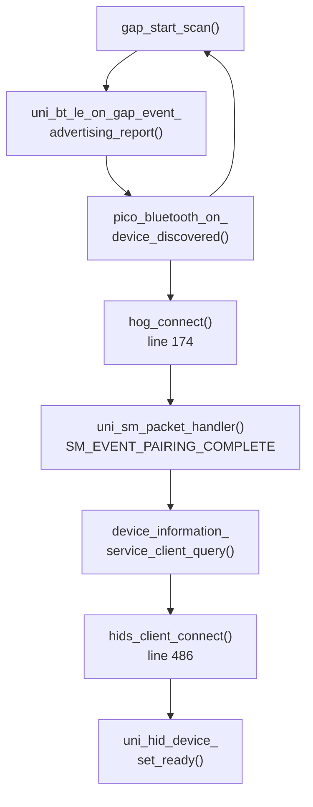

The connection process begins with GAP scanning and proceeds through multiple stages of service discovery and security pairing. The system filters devices based on Class of Device (CoD) values, rejecting keyboards but accepting gamepads.

For Liberlive and Sonic Master devices, the flow diverges to custom GATT service discovery using UUIDs defined at [uni_bt_le.c L786-L787](https://github.com/Jus-Be/orinayo-pico/blob/122fa496/uni_bt_le.c#L786-L787)

Sources: [uni_bt_le.c L174-L768](https://github.com/Jus-Be/orinayo-pico/blob/122fa496/uni_bt_le.c#L174-L768)

 [pico_bluetooth.c L220-L269](https://github.com/Jus-Be/orinayo-pico/blob/122fa496/pico_bluetooth.c#L220-L269)

### Bluepad32 HID Connection

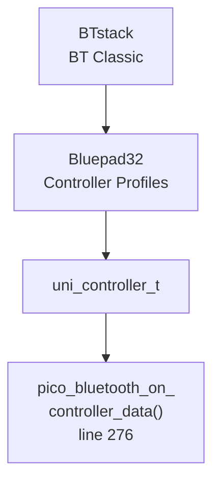

For standard game controllers, Bluepad32 handles the HID protocol and provides a unified `uni_controller_t` structure containing gamepad state.

Sources: [pico_bluetooth.c L276-L325](https://github.com/Jus-Be/orinayo-pico/blob/122fa496/pico_bluetooth.c#L276-L325)

## Stage 2: Input Acquisition

### Dual Input Paths

The system supports two distinct input paths that converge on the same button state variables:

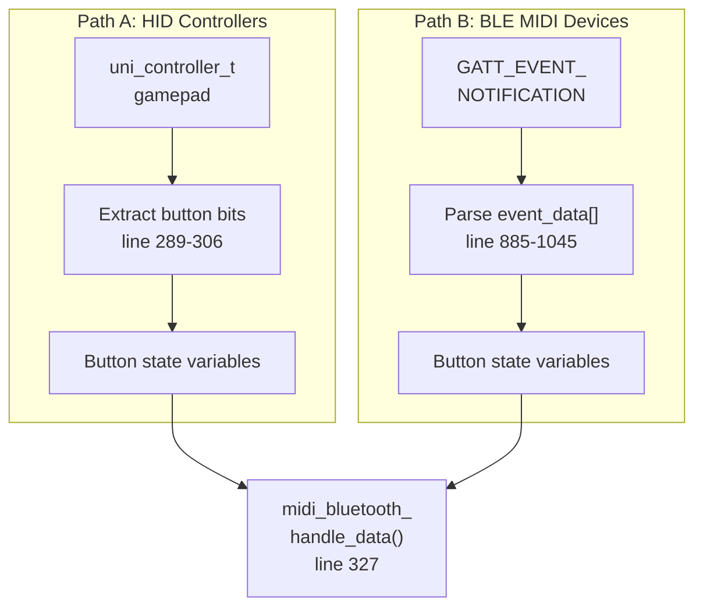

**Path A** processes standard gamepads through Bluepad32, extracting button states from `ctl->gamepad.buttons`, `ctl->gamepad.dpad`, and `ctl->gamepad.misc_buttons`.

**Path B** processes specialized BLE MIDI controllers (Liberlive, Sonic Master) by parsing custom GATT notification packets into equivalent button states.

Sources: [pico_bluetooth.c L276-L325](https://github.com/Jus-Be/orinayo-pico/blob/122fa496/pico_bluetooth.c#L276-L325)

 [uni_bt_le.c L771-L1084](https://github.com/Jus-Be/orinayo-pico/blob/122fa496/uni_bt_le.c#L771-L1084)

### Button State Variables

The following global variables store the current input state:

| Variable Group | Purpose | Mapping |
| --- | --- | --- |
| `but0-4, but6-7, but9` | Face buttons | Green/Red/Yellow/Blue/Orange frets |
| `mbut0-3` | Misc buttons | Logo/StarPower/Menu/Config |
| `dpad_left, dpad_right, dpad_up, dpad_down` | D-pad | Strum down/up, Transpose |
| `green, red, yellow, blue, orange` | Fret state | Chord formation |
| `joy_up, joy_down, knob_up, knob_down` | Analog inputs | Tempo, Fill, effects |

These variables are defined at [pico_bluetooth.c L42-L88](https://github.com/Jus-Be/orinayo-pico/blob/122fa496/pico_bluetooth.c#L42-L88)

 and populated during input processing.

Sources: [pico_bluetooth.c L42-L306](https://github.com/Jus-Be/orinayo-pico/blob/122fa496/pico_bluetooth.c#L42-L306)

 [uni_bt_le.c L892-L909](https://github.com/Jus-Be/orinayo-pico/blob/122fa496/uni_bt_le.c#L892-L909)

## Stage 3: Button Mapping and State Machine

### Main Input Processing Loop

```css
#mermaid-av7md9e00mc{font-family:ui-sans-serif,-apple-system,system-ui,Segoe UI,Helvetica;font-size:16px;fill:#333;}@keyframes edge-animation-frame{from{stroke-dashoffset:0;}}@keyframes dash{to{stroke-dashoffset:0;}}#mermaid-av7md9e00mc .edge-animation-slow{stroke-dasharray:9,5!important;stroke-dashoffset:900;animation:dash 50s linear infinite;stroke-linecap:round;}#mermaid-av7md9e00mc .edge-animation-fast{stroke-dasharray:9,5!important;stroke-dashoffset:900;animation:dash 20s linear infinite;stroke-linecap:round;}#mermaid-av7md9e00mc .error-icon{fill:#dddddd;}#mermaid-av7md9e00mc .error-text{fill:#222222;stroke:#222222;}#mermaid-av7md9e00mc .edge-thickness-normal{stroke-width:1px;}#mermaid-av7md9e00mc .edge-thickness-thick{stroke-width:3.5px;}#mermaid-av7md9e00mc .edge-pattern-solid{stroke-dasharray:0;}#mermaid-av7md9e00mc .edge-thickness-invisible{stroke-width:0;fill:none;}#mermaid-av7md9e00mc .edge-pattern-dashed{stroke-dasharray:3;}#mermaid-av7md9e00mc .edge-pattern-dotted{stroke-dasharray:2;}#mermaid-av7md9e00mc .marker{fill:#999;stroke:#999;}#mermaid-av7md9e00mc .marker.cross{stroke:#999;}#mermaid-av7md9e00mc svg{font-family:ui-sans-serif,-apple-system,system-ui,Segoe UI,Helvetica;font-size:16px;}#mermaid-av7md9e00mc p{margin:0;}#mermaid-av7md9e00mc defs #statediagram-barbEnd{fill:#999;stroke:#999;}#mermaid-av7md9e00mc g.stateGroup text{fill:#dddddd;stroke:none;font-size:10px;}#mermaid-av7md9e00mc g.stateGroup text{fill:#333;stroke:none;font-size:10px;}#mermaid-av7md9e00mc g.stateGroup .state-title{font-weight:bolder;fill:#333;}#mermaid-av7md9e00mc g.stateGroup rect{fill:#ffffff;stroke:#dddddd;}#mermaid-av7md9e00mc g.stateGroup line{stroke:#999;stroke-width:1;}#mermaid-av7md9e00mc .transition{stroke:#999;stroke-width:1;fill:none;}#mermaid-av7md9e00mc .stateGroup .composit{fill:#f4f4f4;border-bottom:1px;}#mermaid-av7md9e00mc .stateGroup .alt-composit{fill:#e0e0e0;border-bottom:1px;}#mermaid-av7md9e00mc .state-note{stroke:#e6d280;fill:#fff5ad;}#mermaid-av7md9e00mc .state-note text{fill:#333;stroke:none;font-size:10px;}#mermaid-av7md9e00mc .stateLabel .box{stroke:none;stroke-width:0;fill:#ffffff;opacity:0.5;}#mermaid-av7md9e00mc .edgeLabel .label rect{fill:#ffffff;opacity:0.5;}#mermaid-av7md9e00mc .edgeLabel{background-color:#ffffff;text-align:center;}#mermaid-av7md9e00mc .edgeLabel p{background-color:#ffffff;}#mermaid-av7md9e00mc .edgeLabel rect{opacity:0.5;background-color:#ffffff;fill:#ffffff;}#mermaid-av7md9e00mc .edgeLabel .label text{fill:#333;}#mermaid-av7md9e00mc .label div .edgeLabel{color:#333;}#mermaid-av7md9e00mc .stateLabel text{fill:#333;font-size:10px;font-weight:bold;}#mermaid-av7md9e00mc .node circle.state-start{fill:#999;stroke:#999;}#mermaid-av7md9e00mc .node .fork-join{fill:#999;stroke:#999;}#mermaid-av7md9e00mc .node circle.state-end{fill:#dddddd;stroke:#f4f4f4;stroke-width:1.5;}#mermaid-av7md9e00mc .end-state-inner{fill:#f4f4f4;stroke-width:1.5;}#mermaid-av7md9e00mc .node rect{fill:#ffffff;stroke:#dddddd;stroke-width:1px;}#mermaid-av7md9e00mc .node polygon{fill:#ffffff;stroke:#dddddd;stroke-width:1px;}#mermaid-av7md9e00mc #statediagram-barbEnd{fill:#999;}#mermaid-av7md9e00mc .statediagram-cluster rect{fill:#ffffff;stroke:#dddddd;stroke-width:1px;}#mermaid-av7md9e00mc .cluster-label,#mermaid-av7md9e00mc .nodeLabel{color:#333;}#mermaid-av7md9e00mc .statediagram-cluster rect.outer{rx:5px;ry:5px;}#mermaid-av7md9e00mc .statediagram-state .divider{stroke:#dddddd;}#mermaid-av7md9e00mc .statediagram-state .title-state{rx:5px;ry:5px;}#mermaid-av7md9e00mc .statediagram-cluster.statediagram-cluster .inner{fill:#f4f4f4;}#mermaid-av7md9e00mc .statediagram-cluster.statediagram-cluster-alt .inner{fill:#f8f8f8;}#mermaid-av7md9e00mc .statediagram-cluster .inner{rx:0;ry:0;}#mermaid-av7md9e00mc .statediagram-state rect.basic{rx:5px;ry:5px;}#mermaid-av7md9e00mc .statediagram-state rect.divider{stroke-dasharray:10,10;fill:#f8f8f8;}#mermaid-av7md9e00mc .note-edge{stroke-dasharray:5;}#mermaid-av7md9e00mc .statediagram-note rect{fill:#fff5ad;stroke:#e6d280;stroke-width:1px;rx:0;ry:0;}#mermaid-av7md9e00mc .statediagram-note rect{fill:#fff5ad;stroke:#e6d280;stroke-width:1px;rx:0;ry:0;}#mermaid-av7md9e00mc .statediagram-note text{fill:#333;}#mermaid-av7md9e00mc .statediagram-note .nodeLabel{color:#333;}#mermaid-av7md9e00mc .statediagram .edgeLabel{color:red;}#mermaid-av7md9e00mc #dependencyStart,#mermaid-av7md9e00mc #dependencyEnd{fill:#999;stroke:#999;stroke-width:1;}#mermaid-av7md9e00mc .statediagramTitleText{text-anchor:middle;font-size:18px;fill:#333;}#mermaid-av7md9e00mc :root{--mermaid-font-family:"trebuchet ms",verdana,arial,sans-serif;}finished_processing == falsefinished_processing == trueCheckProcessingExitGetTimestampProcessFretsProcessPitchProcessSongKeyProcessMbut0ProcessMbut1ProcessMbut2ProcessMbut3ProcessJoystickProcessKnobsProcessStrumSetFinished
```

The `midi_bluetooth_handle_data()` function at [pico_bluetooth.c L327-L1274](https://github.com/Jus-Be/orinayo-pico/blob/122fa496/pico_bluetooth.c#L327-L1274)

 implements a large state machine that processes button changes sequentially. Each button or button combination triggers specific MIDI actions based on the current operational mode.

The function uses early returns with `finished_processing = true` to ensure only one action is processed per call, preventing cascading effects from simultaneous button presses.

Sources: [pico_bluetooth.c L327-L1274](https://github.com/Jus-Be/orinayo-pico/blob/122fa496/pico_bluetooth.c#L327-L1274)

### Fret and Strum Button Processing

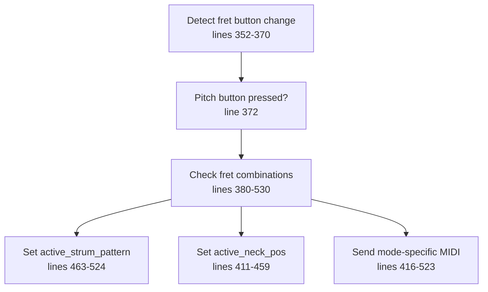

Fret buttons (green, red, yellow, blue, orange) serve dual purposes:

1. When pressed alone with strum: form chords
2. When pressed with pitch button: configure modes and strum patterns

The pitch button (but6) acts as a modifier, enabling configuration mode. Specific fret combinations select:

* **Strum patterns** (-1 to 4): Control how chords are arpeggiated
* **Neck positions** (1-3): Set octave range (Low/Normal/High)
* **Track toggles**: Enable/disable chord and bass tracks

Sources: [pico_bluetooth.c L352-L542](https://github.com/Jus-Be/orinayo-pico/blob/122fa496/pico_bluetooth.c#L352-L542)

## Stage 4: Mode-Based Routing

### Mode Selection Flags

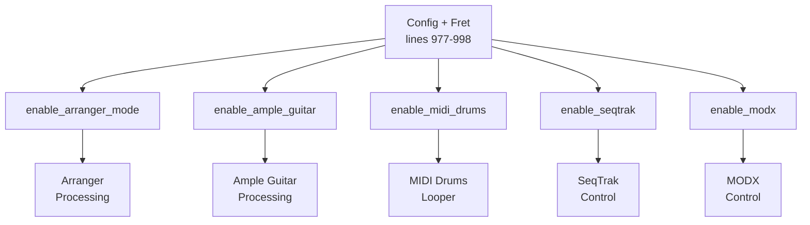

Five boolean flags control operational modes:

* `enable_arranger_mode`: Yamaha/Ketron arranger keyboard control
* `enable_ample_guitar`: Ample Guitar VST plugin mode
* `enable_midi_drums`: Step sequencer mode with 14 drum tracks
* `enable_seqtrak`: Yamaha SeqTrak control
* `enable_modx`: Yamaha MODX control

These flags are toggled via the config button (mbut3) plus fret combinations in `config_guitar()` at [pico_bluetooth.c L1309-L1399](https://github.com/Jus-Be/orinayo-pico/blob/122fa496/pico_bluetooth.c#L1309-L1399)

**Critical Decision Point**: The `enable_midi_drums` flag at [pico_bluetooth.c L38](https://github.com/Jus-Be/orinayo-pico/blob/122fa496/pico_bluetooth.c#L38-L38)

 determines whether notes flow directly to output or through the sequencer pipeline.

Sources: [pico_bluetooth.c L33-L1399](https://github.com/Jus-Be/orinayo-pico/blob/122fa496/pico_bluetooth.c#L33-L1399)

### Mode-Specific Processing Branches

Throughout the codebase, conditional logic routes MIDI generation based on active modes:

```
if (enable_seqtrak) {
    midi_seqtrak_tempo(bpm);
} else if (enable_modx) {
    midi_modx_tempo(bpm);
} else if (enable_arranger_mode) {
    midi_yamaha_arr(code, on);
}
```

This pattern appears in strum processing [pico_bluetooth.c L1221-L1271](https://github.com/Jus-Be/orinayo-pico/blob/122fa496/pico_bluetooth.c#L1221-L1271)

 logo button handling [pico_bluetooth.c L601-L738](https://github.com/Jus-Be/orinayo-pico/blob/122fa496/pico_bluetooth.c#L601-L738)

 and numerous other locations.

Sources: [pico_bluetooth.c L420-L1092](https://github.com/Jus-Be/orinayo-pico/blob/122fa496/pico_bluetooth.c#L420-L1092)

## Stage 5: Musical Translation

### Chord Detection System

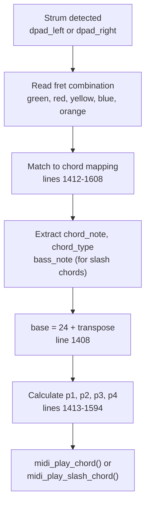

The `play_chord()` function at [pico_bluetooth.c L1401-L1888](https://github.com/Jus-Be/orinayo-pico/blob/122fa496/pico_bluetooth.c#L1401-L1888)

 implements chord detection using a large series of if-else statements that match fret combinations to specific chords.

#### Chord Examples

| Fret Combination | Chord | Notes Sent |
| --- | --- | --- |
| Yellow | C major | base, base+4, base+7 |
| Green + Red | G/B (slash) | base-13, base+7, base+11, base+14 |
| Red + Yellow + Blue | A major | base-3, base+13, base+16 |
| Yellow + Orange | Csus | base, base+5, base+7 |

The `chord_chat` lookup table at [pico_bluetooth.c L138-L151](https://github.com/Jus-Be/orinayo-pico/blob/122fa496/pico_bluetooth.c#L138-L151)

 provides guitar fret positions for 12 root notes × 3 chord types, but this is only used for arpeggio generation, not the main chord detection logic.

Sources: [pico_bluetooth.c L138-L1888](https://github.com/Jus-Be/orinayo-pico/blob/122fa496/pico_bluetooth.c#L138-L1888)

### Strum Pattern Application

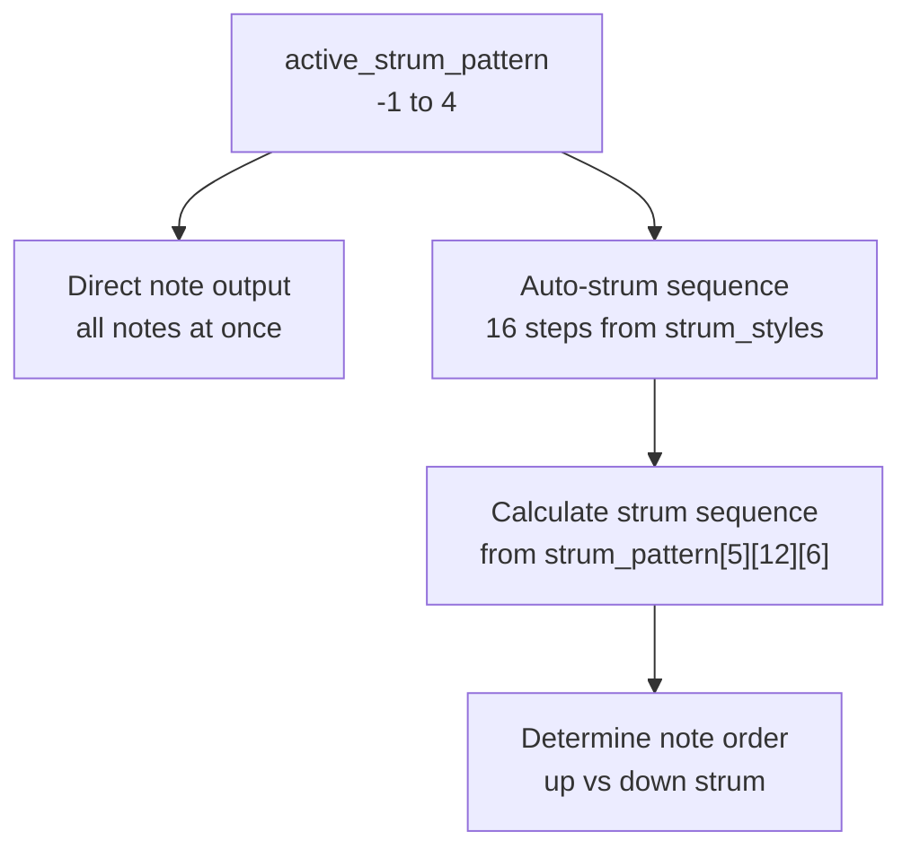

When `active_strum_pattern` is -1, all chord notes play simultaneously. For patterns 0-4, the system uses:

* `strum_pattern[5][12][6]` at [pico_bluetooth.c L153-L159](https://github.com/Jus-Be/orinayo-pico/blob/122fa496/pico_bluetooth.c#L153-L159) : Defines which strings to play
* `strum_styles[5][5][16][3]` at [pico_bluetooth.c L161-L197](https://github.com/Jus-Be/orinayo-pico/blob/122fa496/pico_bluetooth.c#L161-L197) : 16-step velocity/timing patterns

The auto-strum feature (referenced but not shown fully implemented in provided code) would use these patterns to create realistic guitar strumming.

Sources: [pico_bluetooth.c L153-L524](https://github.com/Jus-Be/orinayo-pico/blob/122fa496/pico_bluetooth.c#L153-L524)

## Stage 6: Sequencer Processing (MIDI Drums Mode)

### Looper State Machine

When `enable_midi_drums` is true, the system enters step sequencer mode:

```go
#mermaid-p147lddhb{font-family:ui-sans-serif,-apple-system,system-ui,Segoe UI,Helvetica;font-size:16px;fill:#333;}@keyframes edge-animation-frame{from{stroke-dashoffset:0;}}@keyframes dash{to{stroke-dashoffset:0;}}#mermaid-p147lddhb .edge-animation-slow{stroke-dasharray:9,5!important;stroke-dashoffset:900;animation:dash 50s linear infinite;stroke-linecap:round;}#mermaid-p147lddhb .edge-animation-fast{stroke-dasharray:9,5!important;stroke-dashoffset:900;animation:dash 20s linear infinite;stroke-linecap:round;}#mermaid-p147lddhb .error-icon{fill:#dddddd;}#mermaid-p147lddhb .error-text{fill:#222222;stroke:#222222;}#mermaid-p147lddhb .edge-thickness-normal{stroke-width:1px;}#mermaid-p147lddhb .edge-thickness-thick{stroke-width:3.5px;}#mermaid-p147lddhb .edge-pattern-solid{stroke-dasharray:0;}#mermaid-p147lddhb .edge-thickness-invisible{stroke-width:0;fill:none;}#mermaid-p147lddhb .edge-pattern-dashed{stroke-dasharray:3;}#mermaid-p147lddhb .edge-pattern-dotted{stroke-dasharray:2;}#mermaid-p147lddhb .marker{fill:#999;stroke:#999;}#mermaid-p147lddhb .marker.cross{stroke:#999;}#mermaid-p147lddhb svg{font-family:ui-sans-serif,-apple-system,system-ui,Segoe UI,Helvetica;font-size:16px;}#mermaid-p147lddhb p{margin:0;}#mermaid-p147lddhb defs #statediagram-barbEnd{fill:#999;stroke:#999;}#mermaid-p147lddhb g.stateGroup text{fill:#dddddd;stroke:none;font-size:10px;}#mermaid-p147lddhb g.stateGroup text{fill:#333;stroke:none;font-size:10px;}#mermaid-p147lddhb g.stateGroup .state-title{font-weight:bolder;fill:#333;}#mermaid-p147lddhb g.stateGroup rect{fill:#ffffff;stroke:#dddddd;}#mermaid-p147lddhb g.stateGroup line{stroke:#999;stroke-width:1;}#mermaid-p147lddhb .transition{stroke:#999;stroke-width:1;fill:none;}#mermaid-p147lddhb .stateGroup .composit{fill:#f4f4f4;border-bottom:1px;}#mermaid-p147lddhb .stateGroup .alt-composit{fill:#e0e0e0;border-bottom:1px;}#mermaid-p147lddhb .state-note{stroke:#e6d280;fill:#fff5ad;}#mermaid-p147lddhb .state-note text{fill:#333;stroke:none;font-size:10px;}#mermaid-p147lddhb .stateLabel .box{stroke:none;stroke-width:0;fill:#ffffff;opacity:0.5;}#mermaid-p147lddhb .edgeLabel .label rect{fill:#ffffff;opacity:0.5;}#mermaid-p147lddhb .edgeLabel{background-color:#ffffff;text-align:center;}#mermaid-p147lddhb .edgeLabel p{background-color:#ffffff;}#mermaid-p147lddhb .edgeLabel rect{opacity:0.5;background-color:#ffffff;fill:#ffffff;}#mermaid-p147lddhb .edgeLabel .label text{fill:#333;}#mermaid-p147lddhb .label div .edgeLabel{color:#333;}#mermaid-p147lddhb .stateLabel text{fill:#333;font-size:10px;font-weight:bold;}#mermaid-p147lddhb .node circle.state-start{fill:#999;stroke:#999;}#mermaid-p147lddhb .node .fork-join{fill:#999;stroke:#999;}#mermaid-p147lddhb .node circle.state-end{fill:#dddddd;stroke:#f4f4f4;stroke-width:1.5;}#mermaid-p147lddhb .end-state-inner{fill:#f4f4f4;stroke-width:1.5;}#mermaid-p147lddhb .node rect{fill:#ffffff;stroke:#dddddd;stroke-width:1px;}#mermaid-p147lddhb .node polygon{fill:#ffffff;stroke:#dddddd;stroke-width:1px;}#mermaid-p147lddhb #statediagram-barbEnd{fill:#999;}#mermaid-p147lddhb .statediagram-cluster rect{fill:#ffffff;stroke:#dddddd;stroke-width:1px;}#mermaid-p147lddhb .cluster-label,#mermaid-p147lddhb .nodeLabel{color:#333;}#mermaid-p147lddhb .statediagram-cluster rect.outer{rx:5px;ry:5px;}#mermaid-p147lddhb .statediagram-state .divider{stroke:#dddddd;}#mermaid-p147lddhb .statediagram-state .title-state{rx:5px;ry:5px;}#mermaid-p147lddhb .statediagram-cluster.statediagram-cluster .inner{fill:#f4f4f4;}#mermaid-p147lddhb .statediagram-cluster.statediagram-cluster-alt .inner{fill:#f8f8f8;}#mermaid-p147lddhb .statediagram-cluster .inner{rx:0;ry:0;}#mermaid-p147lddhb .statediagram-state rect.basic{rx:5px;ry:5px;}#mermaid-p147lddhb .statediagram-state rect.divider{stroke-dasharray:10,10;fill:#f8f8f8;}#mermaid-p147lddhb .note-edge{stroke-dasharray:5;}#mermaid-p147lddhb .statediagram-note rect{fill:#fff5ad;stroke:#e6d280;stroke-width:1px;rx:0;ry:0;}#mermaid-p147lddhb .statediagram-note rect{fill:#fff5ad;stroke:#e6d280;stroke-width:1px;rx:0;ry:0;}#mermaid-p147lddhb .statediagram-note text{fill:#333;}#mermaid-p147lddhb .statediagram-note .nodeLabel{color:#333;}#mermaid-p147lddhb .statediagram .edgeLabel{color:red;}#mermaid-p147lddhb #dependencyStart,#mermaid-p147lddhb #dependencyEnd{fill:#999;stroke:#999;stroke-width:1;}#mermaid-p147lddhb .statediagramTitleText{text-anchor:middle;font-size:18px;fill:#333;}#mermaid-p147lddhb :root{--mermaid-font-family:"trebuchet ms",verdana,arial,sans-serif;}Logo button pressLogo button pressLogo button pressHold knob_up + orangeStrum 4 timesWAITINGRECORDINGPLAYINGTAP_TEMPO
```

The looper state machine at [looper.c L288-L344](https://github.com/Jus-Be/orinayo-pico/blob/122fa496/looper.c#L288-L344)

 processes sequencer steps on a timer, supporting:

* **WAITING**: Idle state, clock running
* **RECORDING**: Capturing button presses to pattern memory
* **PLAYING**: Playing back recorded patterns
* **TAP_TEMPO**: Detecting tempo from button taps

Sources: [looper.c L49-L344](https://github.com/Jus-Be/orinayo-pico/blob/122fa496/looper.c#L49-L344)

### Track Structure and Pattern Storage

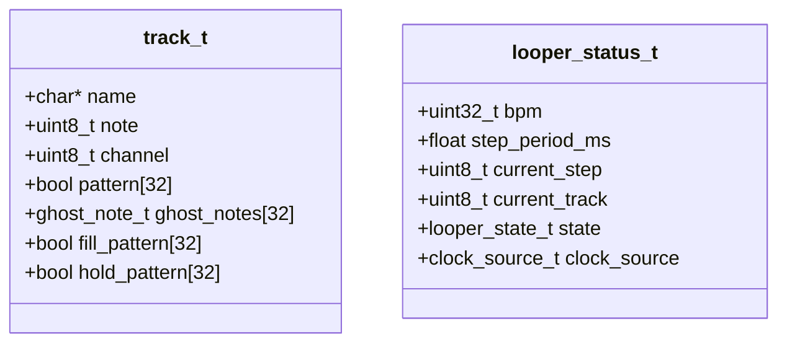

The system defines 14 drum tracks at [looper.c L51-L66](https://github.com/Jus-Be/orinayo-pico/blob/122fa496/looper.c#L51-L66)

:

| Index | Instrument | MIDI Note | Purpose |
| --- | --- | --- | --- |
| 0 | Bass Drum | 36 | Kick |
| 1 | Snare Drum | 38 | Snare |
| 2 | Closed Hi-hat | 42 | Hi-hat |
| 3-13 | Various | 41-64 | Toms, cymbals, percussion |

Each track has:

* `pattern[32]`: User-recorded note pattern (2 bars, 16th notes)
* `ghost_notes[32]`: Algorithmically generated notes
* `fill_pattern[32]`: Fill-in notes at phrase boundaries

Sources: [looper.c L51-L67](https://github.com/Jus-Be/orinayo-pico/blob/122fa496/looper.c#L51-L67)

 [looper.h L1-L100](https://github.com/Jus-Be/orinayo-pico/blob/122fa496/looper.h#L1-L100)

### Step Processing Pipeline

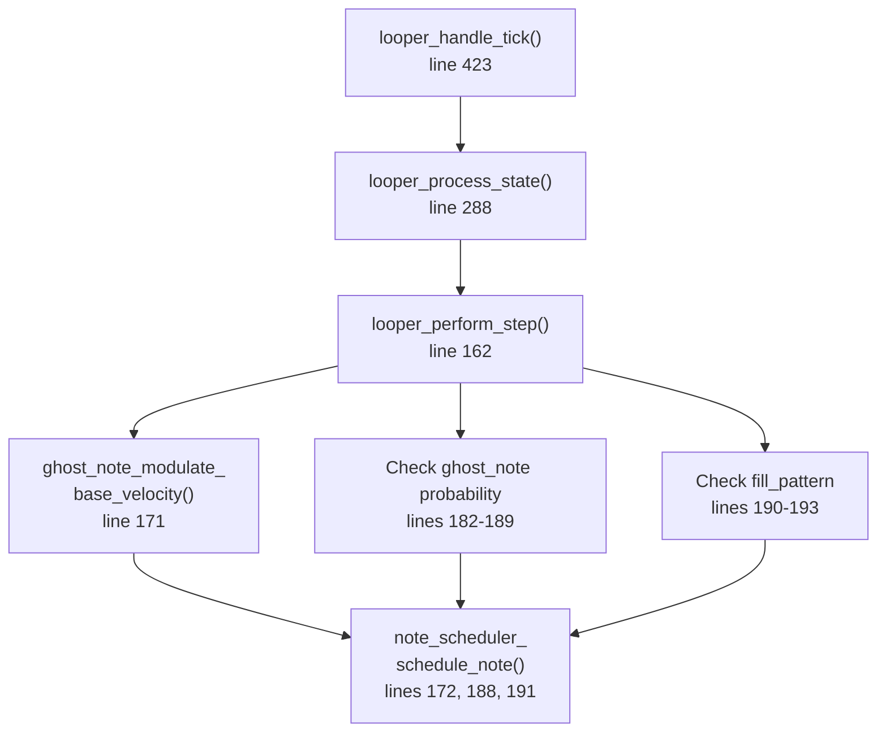

For each step, the looper:

1. Checks user pattern: `tracks[i].pattern[current_step]`
2. Applies velocity modulation with LFO
3. Evaluates ghost note probability with intensity factor
4. Checks fill pattern
5. Schedules all active notes with swing offset

The swing calculation at [looper.c L148-L158](https://github.com/Jus-Be/orinayo-pico/blob/122fa496/looper.c#L148-L158)

 adds microsecond-level timing offsets to create groove.

Sources: [looper.c L148-L435](https://github.com/Jus-Be/orinayo-pico/blob/122fa496/looper.c#L148-L435)

### Note Scheduler

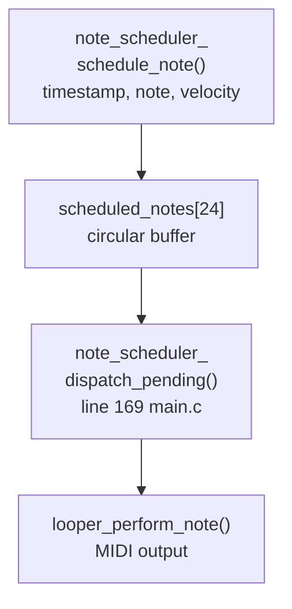

The note scheduler at [note_scheduler.c](https://github.com/Jus-Be/orinayo-pico/blob/122fa496/note_scheduler.c)

 (not fully shown in provided files) implements a two-stage approach:

1. **Schedule** in async/timer context: Add notes to queue with timestamps
2. **Dispatch** in main loop: Send notes when timestamp is reached

This design avoids USB mutex contention mentioned in code comments. The scheduler supports up to 24 simultaneous scheduled notes.

Sources: [looper.c L131-L134](https://github.com/Jus-Be/orinayo-pico/blob/122fa496/looper.c#L131-L134)

 [main.c L169](https://github.com/Jus-Be/orinayo-pico/blob/122fa496/main.c#L169-L169)

 [note_scheduler.h L1-L50](https://github.com/Jus-Be/orinayo-pico/blob/122fa496/note_scheduler.h#L1-L50)

## Stage 7: MIDI Message Generation

### Direct MIDI Output Functions

The system provides multiple MIDI message generators in [main.c L480-L688](https://github.com/Jus-Be/orinayo-pico/blob/122fa496/main.c#L480-L688)

:

| Function | Purpose | Message Type |
| --- | --- | --- |
| `midi_send_note()` | Note On/Off | 0x90/0x80 + channel |
| `midi_send_control_change()` | CC messages | 0xB0 + controller + value |
| `midi_send_program_change()` | PC messages | 0xC0 + program |
| `midi_start_stop()` | Transport control | 0xFA (start), 0xFC (stop) |

All functions call `midi_n_stream_write()` as the final output stage.

Sources: [main.c L480-L522](https://github.com/Jus-Be/orinayo-pico/blob/122fa496/main.c#L480-L522)

### Chord Note Distribution

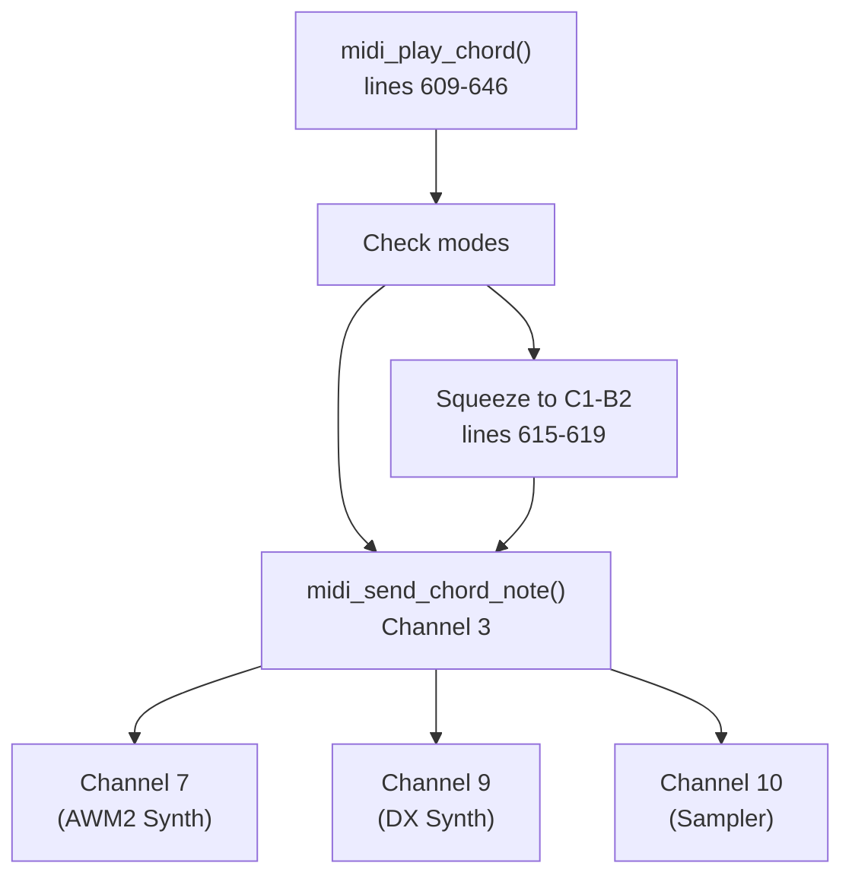

The `midi_play_chord()` function at [main.c L609-L646](https://github.com/Jus-Be/orinayo-pico/blob/122fa496/main.c#L609-L646)

 implements intelligent channel routing:

* **Ample Guitar/MODX**: Squeezes chord voicings into C1-B2 range (MIDI notes 36-47)
* **SeqTrak mode**: Distributes notes across channels 7 (bass), 9 (chords), 10 (sampler)
* **Standard mode**: Sends to channel 3

This allows simultaneous control of multiple synthesizer parts.

Sources: [main.c L584-L688](https://github.com/Jus-Be/orinayo-pico/blob/122fa496/main.c#L584-L688)

### SysEx Message Generation

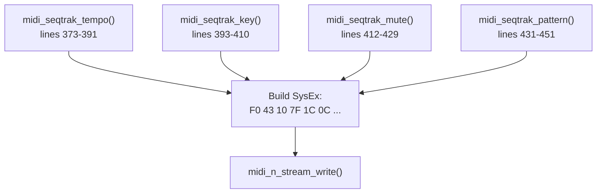

Synthesizer-specific control is implemented via SysEx messages:

* **Yamaha SeqTrak**: [main.c L373-L451](https://github.com/Jus-Be/orinayo-pico/blob/122fa496/main.c#L373-L451)  - Tempo, key, mute, pattern control
* **Yamaha MODX**: [main.c L231-L352](https://github.com/Jus-Be/orinayo-pico/blob/122fa496/main.c#L231-L352)  - Arp control, octave, hold, tempo
* **Ketron arrangers**: [main.c L552-L582](https://github.com/Jus-Be/orinayo-pico/blob/122fa496/main.c#L552-L582)  - Style sections, footswitch
* **Yamaha arrangers**: [main.c L524-L550](https://github.com/Jus-Be/orinayo-pico/blob/122fa496/main.c#L524-L550)  - Style control, start/stop

Each function constructs manufacturer-specific SysEx messages following documented specifications.

Sources: [main.c L210-L582](https://github.com/Jus-Be/orinayo-pico/blob/122fa496/main.c#L210-L582)

## Stage 8: Dual Output Transmission

### The Output Bottleneck

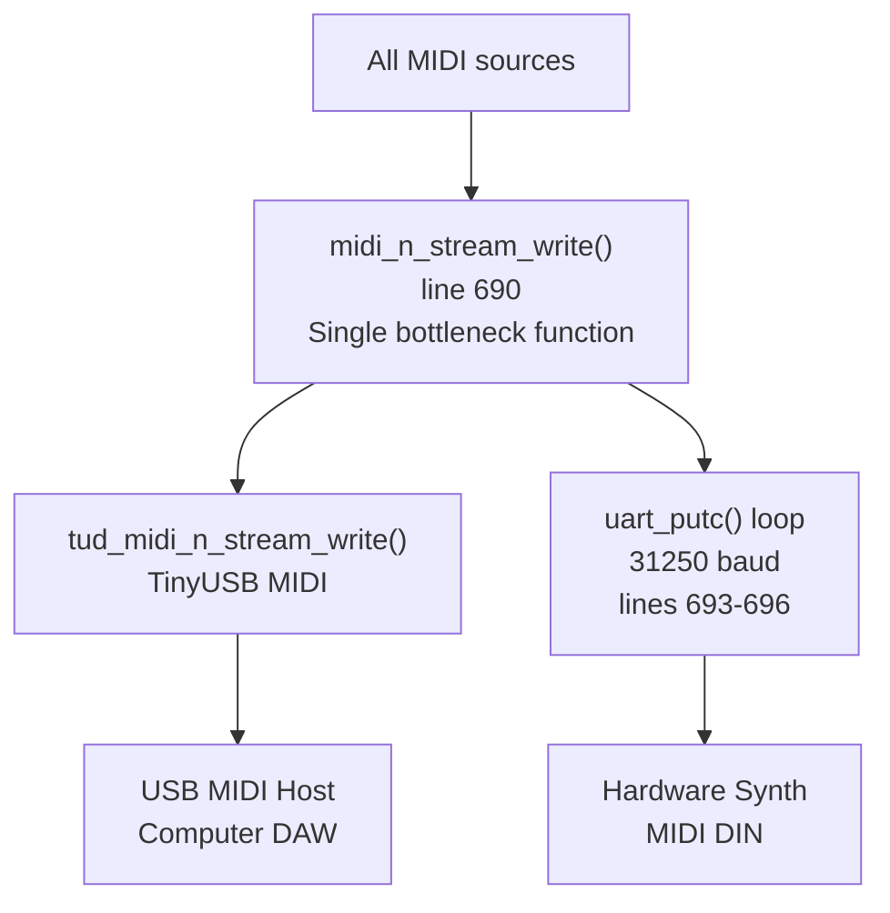

The `midi_n_stream_write()` function at [main.c L690-L697](https://github.com/Jus-Be/orinayo-pico/blob/122fa496/main.c#L690-L697)

 is the **sole output point** for all MIDI data:

```javascript
uint32_t midi_n_stream_write(uint8_t itf, uint8_t cable_num, 
                              const uint8_t *buffer, uint32_t bufsize) {
    tud_midi_n_stream_write(itf, cable_num, buffer, bufsize);
    
    for (int i=0; i<bufsize; i++) {
        while (!uart_is_writable(UART_ID)){ }	
        uart_putc(UART_ID, buffer[i]);		
    }
}
```

This design ensures **perfect synchronization** between USB and UART outputs - the same byte buffer is sent to both destinations sequentially.

Sources: [main.c L690-L697](https://github.com/Jus-Be/orinayo-pico/blob/122fa496/main.c#L690-L697)

### UART Configuration

UART is configured at [main.c L145-L150](https://github.com/Jus-Be/orinayo-pico/blob/122fa496/main.c#L145-L150)

 for standard MIDI electrical specification:

* **Baud rate**: 31,250 bps (MIDI standard)
* **Pins**: TX=GPIO0, RX=GPIO1
* **Mode**: No FIFO translation, raw byte output
* **Function**: `GPIO_FUNC_UART` (value 2)

The code uses blocking writes with `uart_is_writable()` checks to ensure reliable transmission.

Sources: [main.c L57-L150](https://github.com/Jus-Be/orinayo-pico/blob/122fa496/main.c#L57-L150)

### USB MIDI Configuration

USB MIDI is handled by TinyUSB library with configuration in [tusb_config.h](https://github.com/Jus-Be/orinayo-pico/blob/122fa496/tusb_config.h)

 (not shown). The system uses:

* **VID**: 0xCAFE (configured in USB descriptors)
* **PID**: Dynamic based on enabled features
* **Class**: MIDI Device Class (0x01)
* **Endpoints**: Bulk IN/OUT for bidirectional MIDI

The `tud_task()` call at [main.c L153](https://github.com/Jus-Be/orinayo-pico/blob/122fa496/main.c#L153-L153)

 services USB transfers in the main loop.

Sources: [main.c L129-L153](https://github.com/Jus-Be/orinayo-pico/blob/122fa496/main.c#L129-L153)

 [tusb_config.h L1-L50](https://github.com/Jus-Be/orinayo-pico/blob/122fa496/tusb_config.h#L1-L50)

## Data Flow Summary

### Complete Pipeline Path

**Typical gamepad input flow:**

1. Bluetooth Classic connection via Bluepad32
2. `pico_bluetooth_on_controller_data()` receives `uni_controller_t`
3. Button bits extracted to global variables (but0-4, dpad_*, etc.)
4. `midi_bluetooth_handle_data()` processes state machine
5. Fret combination detected in `play_chord()`
6. Chord notes calculated with transpose
7. **Branch point**: Check `enable_midi_drums` * **If false**: Direct to `midi_play_chord()` * **If true**: Button maps to looper track recording
8. `midi_send_chord_note()` or `looper_perform_note()` generates MIDI bytes
9. `midi_n_stream_write()` sends to USB and UART simultaneously

**BLE MIDI device flow:**

1. BLE connection via `hog_connect()`
2. GATT notifications arrive at `handle_gatt_client_event()`
3. Event data parsed to extract button states
4. Same button variables populated as gamepad path
5. Converges at `midi_bluetooth_handle_data()`
6. Continues through same pipeline as above

Sources: [pico_bluetooth.c L276-L1888](https://github.com/Jus-Be/orinayo-pico/blob/122fa496/pico_bluetooth.c#L276-L1888)

 [uni_bt_le.c L771-L1084](https://github.com/Jus-Be/orinayo-pico/blob/122fa496/uni_bt_le.c#L771-L1084)

 [main.c L152-L697](https://github.com/Jus-Be/orinayo-pico/blob/122fa496/main.c#L152-L697)

 [looper.c L115-L193](https://github.com/Jus-Be/orinayo-pico/blob/122fa496/looper.c#L115-L193)

### Performance Characteristics

| Metric | Value | Location |
| --- | --- | --- |
| Main loop frequency | ~1ms per iteration | [main.c L152-L170](https://github.com/Jus-Be/orinayo-pico/blob/122fa496/main.c#L152-L170) |
| Looper step resolution | 16th notes (BPM-dependent) | [looper.c L283](https://github.com/Jus-Be/orinayo-pico/blob/122fa496/looper.c#L283-L283) |
| Swing offset precision | Microsecond | [looper.c L148-L158](https://github.com/Jus-Be/orinayo-pico/blob/122fa496/looper.c#L148-L158) |
| Note scheduler slots | 24 simultaneous notes | Referenced in architecture |
| UART transmission | Blocking, byte-by-byte | [main.c L693-L696](https://github.com/Jus-Be/orinayo-pico/blob/122fa496/main.c#L693-L696) |
| USB transmission | Non-blocking via TinyUSB | [main.c L691](https://github.com/Jus-Be/orinayo-pico/blob/122fa496/main.c#L691-L691) |
| Ghost note probability | 0.0-1.0 (intensity factor) | [looper.c L182-L189](https://github.com/Jus-Be/orinayo-pico/blob/122fa496/looper.c#L182-L189) |

The system processes controller input at Bluetooth report rates (typically 10-100Hz), with the looper running independently on a timer at the configured BPM step rate.

Sources: [main.c L152-L170](https://github.com/Jus-Be/orinayo-pico/blob/122fa496/main.c#L152-L170)

 [looper.c L148-L284](https://github.com/Jus-Be/orinayo-pico/blob/122fa496/looper.c#L148-L284)