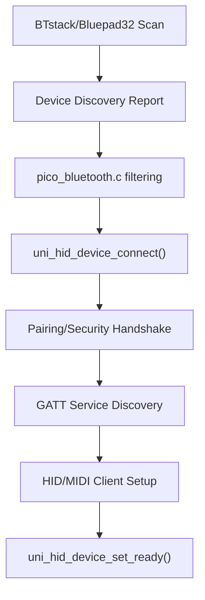
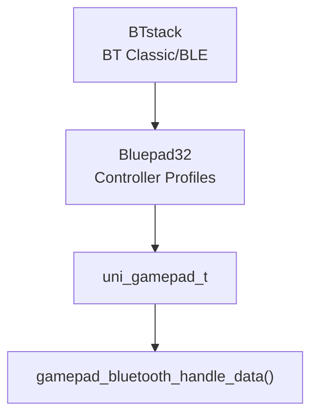
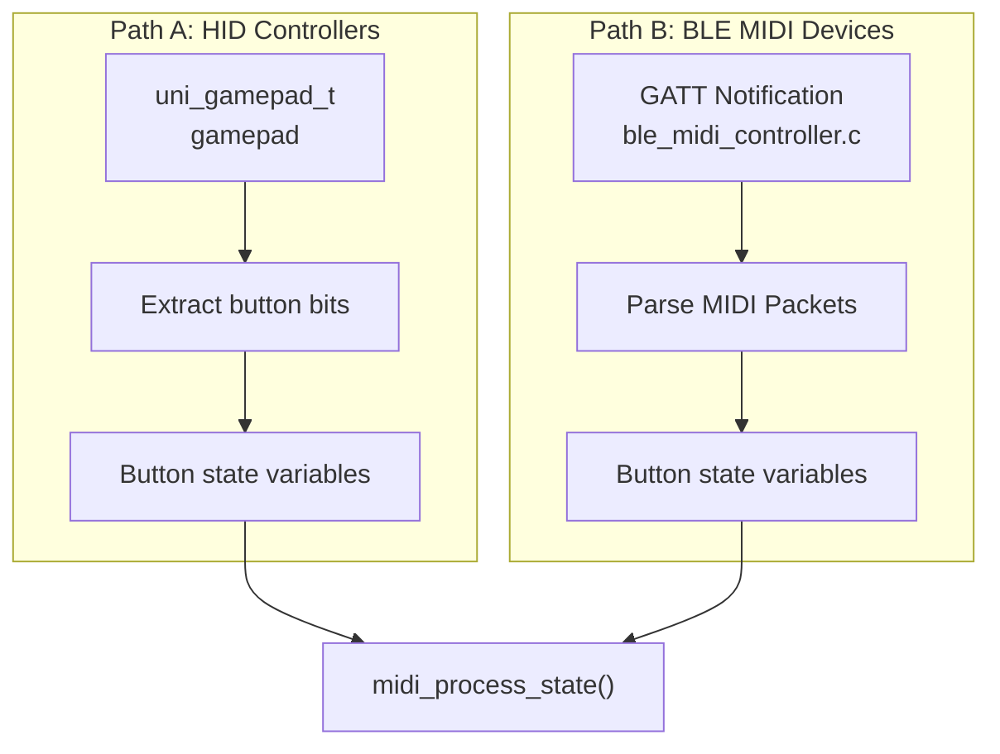
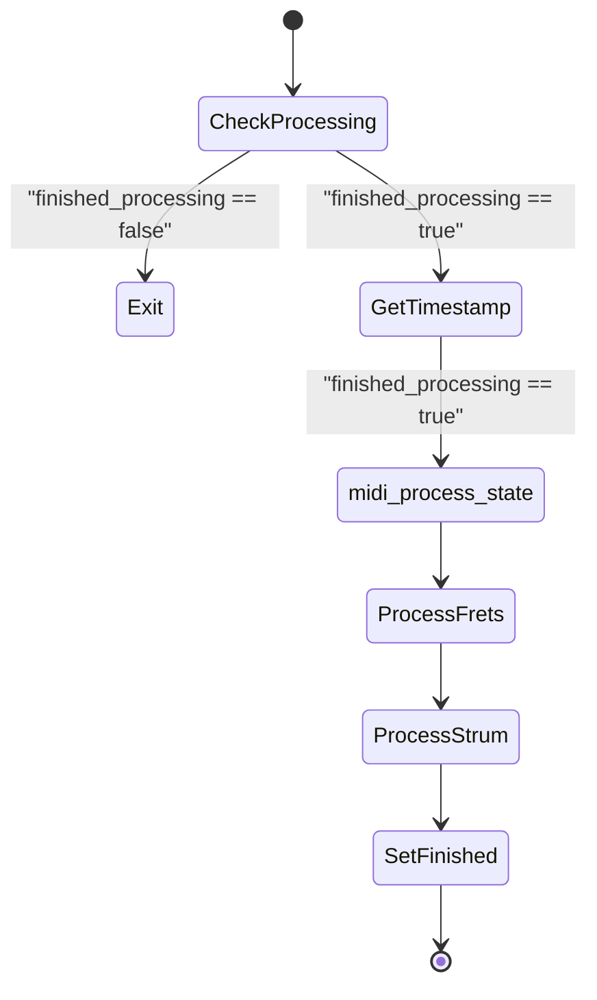
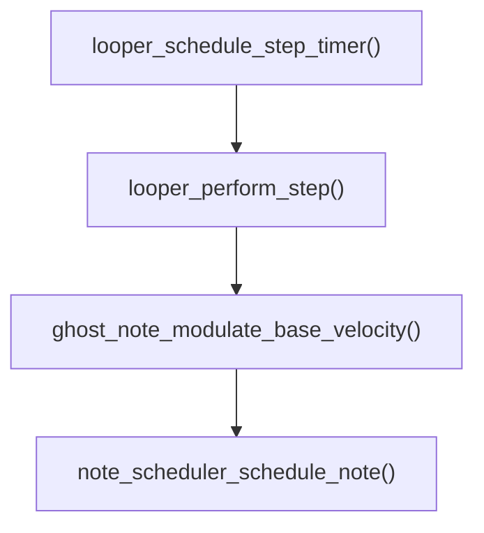

# Data Flow Pipeline

> **Relevant source files**
> * [looper.c](https://github.com/Jus-Be/orinayo-pico/blob/6dde5a75/looper.c)
> * [main.c](https://github.com/Jus-Be/orinayo-pico/blob/6dde5a75/main.c)
> * [pico_bluetooth.c](https://github.com/Jus-Be/orinayo-pico/blob/6dde5a75/pico_bluetooth.c)

This page traces the complete data flow from Bluetooth input through musical processing to dual MIDI output. It documents how raw controller inputs are transformed into MIDI messages through multiple processing stages, including the critical decision points that route data through different processing paths.

For information about specific operational modes (Arranger, MODX, SeqTrak, etc.), see [Operational Modes](./4.4-operational-modes.md). For details on the looper's internal workings, see [Step Sequencer](./5.2-step-sequencer.md). For Bluetooth connection establishment, see [BLE Device Management](./4.1-ble-device-management.md).

## Overview

The system implements a multi-stage pipeline that processes data from Bluetooth controllers and translates it into MIDI output. Data flows through six major stages:

| Stage | Purpose | Key Components |
| --- | --- | --- |
| 1. Connection & Discovery | Establish BLE/Classic BT connection | `uni_bt.h`, `uni_hid_device.h` |
| 2. Input Acquisition | Receive HID reports or GATT notifications | `gamepad_bluetooth_handle_data`, `ble_midi_controller.c` |
| 3. Button Mapping | Parse raw input into button states | `pico_bluetooth.c` state variables |
| 4. Mode Selection | Route to appropriate handler | Mode flags (`enable_*`) |
| 5. Musical Translation | Convert buttons to MIDI concepts | `play_chord`, `chord_chat` lookup table |
| 6. Output Generation | Create and transmit MIDI messages | `midi_n_stream_write` |

An optional seventh stage, **Sequencer Processing**, is inserted when `enable_midi_drums` is true, adding algorithmic enhancement via the looper subsystem.

Sources: [pico_bluetooth.c L1-L200](https://github.com/Jus-Be/orinayo-pico/blob/6dde5a75/pico_bluetooth.c#L1-L200)

 [main.c L1-L228](https://github.com/Jus-Be/orinayo-pico/blob/6dde5a75/main.c#L1-L228)

## Stage 1: Connection & Discovery

### BLE Connection Flow

```mermaid
flowchart TD

Start["BTstack/Bluepad32 Scan"]
Adv["Device Discovery Report"]
Filter["pico_bluetooth.c filtering"]
Connect["uni_hid_device_connect()"]
SecMgr["Pairing/Security Handshake"]
DevInfo["GATT Service Discovery"]
HIDS["HID/MIDI Client Setup"]
Ready["uni_hid_device_set_ready()"]

Start --> Adv
Adv --> Filter
Filter --> Connect
Connect --> SecMgr
SecMgr --> DevInfo
DevInfo --> HIDS
HIDS --> Ready
```

The connection process begins with GAP scanning and proceeds through multiple stages of service discovery and security pairing. The system handles standard gamepads via Bluepad32 and specialized BLE MIDI devices (Liberlive, Sonic Master) via custom GATT handling.

Sources: [pico_bluetooth.c L1-L25](https://github.com/Jus-Be/orinayo-pico/blob/6dde5a75/pico_bluetooth.c#L1-L25)

 [main.c L210](https://github.com/Jus-Be/orinayo-pico/blob/6dde5a75/main.c#L210-L210)

### Bluepad32 HID Connection

```mermaid
flowchart TD

BTStack["BTstack<br>BT Classic/BLE"]
BP32["Bluepad32<br>Controller Profiles"]
UniCtl["uni_gamepad_t"]
OnData["gamepad_bluetooth_handle_data()"]

BTStack --> BP32
BP32 --> UniCtl
UniCtl --> OnData
```

For standard game controllers, Bluepad32 handles the HID protocol and provides a unified `uni_gamepad_t` structure containing gamepad state.

Sources: [pico_bluetooth.c L7-L14](https://github.com/Jus-Be/orinayo-pico/blob/6dde5a75/pico_bluetooth.c#L7-L14)

## Stage 2: Input Acquisition

### Dual Input Paths

The system supports two distinct input paths that converge on the same button state variables:

```mermaid
flowchart TD

CtlData["uni_gamepad_t<br>gamepad"]
ExtractA["Extract button bits"]
VarsA["Button state variables"]
GATT["GATT Notification<br>ble_midi_controller.c"]
ParseB["Parse MIDI Packets"]
VarsB["Button state variables"]
Converge["midi_process_state()"]

VarsA --> Converge
VarsB --> Converge

subgraph subGraph1 ["Path B: BLE MIDI Devices"]
    GATT
    ParseB
    VarsB
    GATT --> ParseB
    ParseB --> VarsB
end

subgraph subGraph0 ["Path A: HID Controllers"]
    CtlData
    ExtractA
    VarsA
    CtlData --> ExtractA
    ExtractA --> VarsA
end
```

**Path A** processes standard gamepads, extracting states into variables like `but0` through `but9` and `dpad_*`.

**Path B** processes specialized BLE MIDI controllers (Liberlive, Sonic Master) by parsing MIDI data into equivalent fret and strum states.

Sources: [pico_bluetooth.c L70-L118](https://github.com/Jus-Be/orinayo-pico/blob/6dde5a75/pico_bluetooth.c#L70-L118)

 [main.c L20-L21](https://github.com/Jus-Be/orinayo-pico/blob/6dde5a75/main.c#L20-L21)

### Button State Variables

The following global variables store the current input state:

| Variable Group | Purpose | Mapping |
| --- | --- | --- |
| `but0-9` | Face buttons | Fret and Function buttons [pico_bluetooth.c L70-L79](https://github.com/Jus-Be/orinayo-pico/blob/6dde5a75/pico_bluetooth.c#L70-L79) |
| `mbut0-3` | Misc buttons | Logo/Menu/Config [pico_bluetooth.c L81-L84](https://github.com/Jus-Be/orinayo-pico/blob/6dde5a75/pico_bluetooth.c#L81-L84) |
| `dpad_left/right/up/down` | D-pad | Navigation and Transpose [pico_bluetooth.c L86-L89](https://github.com/Jus-Be/orinayo-pico/blob/6dde5a75/pico_bluetooth.c#L86-L89) |
| `green, red, yellow, blue, orange` | Fret state | Chord formation [pico_bluetooth.c L96-L100](https://github.com/Jus-Be/orinayo-pico/blob/6dde5a75/pico_bluetooth.c#L96-L100) |
| `joy_up, joy_down, knob_up, knob_down` | Analog inputs | Tempo and Effects [pico_bluetooth.c L91-L94](https://github.com/Jus-Be/orinayo-pico/blob/6dde5a75/pico_bluetooth.c#L91-L94) |

Sources: [pico_bluetooth.c L70-L101](https://github.com/Jus-Be/orinayo-pico/blob/6dde5a75/pico_bluetooth.c#L70-L101)

## Stage 3: Button Mapping and State Machine

### Main Input Processing Loop

```mermaid
stateDiagram-v2
    [*] --> CheckProcessing
    CheckProcessing --> Exit : "finished_processing == false"
    CheckProcessing --> GetTimestamp : "finished_processing == true"
    GetTimestamp --> midi_process_state : "finished_processing == true"
    midi_process_state --> ProcessFrets
    ProcessFrets --> ProcessStrum
    ProcessStrum --> SetFinished
    SetFinished --> [*]
```

The `midi_process_state()` function [pico_bluetooth.c L198](https://github.com/Jus-Be/orinayo-pico/blob/6dde5a75/pico_bluetooth.c#L198-L198)

 coordinates the transformation of raw button states into musical events. It relies on `finished_processing` [pico_bluetooth.c L65](https://github.com/Jus-Be/orinayo-pico/blob/6dde5a75/pico_bluetooth.c#L65-L65)

 to synchronize state transitions across the main loop.

Sources: [pico_bluetooth.c L65-L199](https://github.com/Jus-Be/orinayo-pico/blob/6dde5a75/pico_bluetooth.c#L65-L199)

### Fret and Strum Button Processing

Fret buttons (green, red, yellow, blue, orange) are used to determine the active chord. The system tracks:

* **Strum patterns**: `active_strum_pattern` [pico_bluetooth.c L122](https://github.com/Jus-Be/orinayo-pico/blob/6dde5a75/pico_bluetooth.c#L122-L122)  selects arpeggio sequences.
* **Neck positions**: `active_neck_pos` [pico_bluetooth.c L123](https://github.com/Jus-Be/orinayo-pico/blob/6dde5a75/pico_bluetooth.c#L123-L123)  determines the octave/voicing.

Sources: [pico_bluetooth.c L96-L123](https://github.com/Jus-Be/orinayo-pico/blob/6dde5a75/pico_bluetooth.c#L96-L123)

## Stage 4: Mode-Based Routing

### Mode Selection Flags

Operational modes are controlled by boolean flags:

* `enable_arranger_mode`: Arranger keyboard control [pico_bluetooth.c L55](https://github.com/Jus-Be/orinayo-pico/blob/6dde5a75/pico_bluetooth.c#L55-L55)
* `enable_ample_guitar`: Ample Guitar VST mode [pico_bluetooth.c L60](https://github.com/Jus-Be/orinayo-pico/blob/6dde5a75/pico_bluetooth.c#L60-L60)
* `enable_midi_drums`: Sequencer/Looper mode [pico_bluetooth.c L61](https://github.com/Jus-Be/orinayo-pico/blob/6dde5a75/pico_bluetooth.c#L61-L61)
* `enable_seqtrak`: Yamaha SeqTrak mode [pico_bluetooth.c L46](https://github.com/Jus-Be/orinayo-pico/blob/6dde5a75/pico_bluetooth.c#L46-L46)
* `enable_modx`: Yamaha MODX mode [pico_bluetooth.c L56](https://github.com/Jus-Be/orinayo-pico/blob/6dde5a75/pico_bluetooth.c#L56-L56)

These are configured via `config_guitar()` and specific configuration functions like `config_arranger()` or `config_modx()` [pico_bluetooth.c L201-L205](https://github.com/Jus-Be/orinayo-pico/blob/6dde5a75/pico_bluetooth.c#L201-L205)

Sources: [pico_bluetooth.c L46-L213](https://github.com/Jus-Be/orinayo-pico/blob/6dde5a75/pico_bluetooth.c#L46-L213)

## Stage 5: Musical Translation

### Chord Detection System

The `play_chord()` function [pico_bluetooth.c L214](https://github.com/Jus-Be/orinayo-pico/blob/6dde5a75/pico_bluetooth.c#L214-L214)

 translates fret combinations into MIDI notes. It uses the `chord_chat` lookup table [pico_bluetooth.c L231-L244](https://github.com/Jus-Be/orinayo-pico/blob/6dde5a75/pico_bluetooth.c#L231-L244)

 to determine specific guitar fingerings (Root, Type, Fret Positions).

#### Chord Matrix Structure

`chord_chat[12][3][6]` represents:

* 12 Root notes (C, C#, D...)
* 3 Types (Major, Minor, 7th)
* 6 Strings (Fret number per string)

Sources: [pico_bluetooth.c L214-L244](https://github.com/Jus-Be/orinayo-pico/blob/6dde5a75/pico_bluetooth.c#L214-L244)

### Strum Pattern Application

The `strum_pattern[14][12][6]` [pico_bluetooth.c L246](https://github.com/Jus-Be/orinayo-pico/blob/6dde5a75/pico_bluetooth.c#L246-L246)

 table defines how chords are arpeggiated when a strum action occurs, mapping specific steps in a pattern to chord notes.

Sources: [pico_bluetooth.c L122-L246](https://github.com/Jus-Be/orinayo-pico/blob/6dde5a75/pico_bluetooth.c#L122-L246)

## Stage 6: Sequencer Processing (MIDI Drums Mode)

### Looper State Machine

When `enable_midi_drums` [looper.c L106](https://github.com/Jus-Be/orinayo-pico/blob/6dde5a75/looper.c#L106-L106)

 is true, the system routes drum inputs through the `looper_status` state machine [looper.c L49](https://github.com/Jus-Be/orinayo-pico/blob/6dde5a75/looper.c#L49-L49)

Sources: [looper.c L49-L106](https://github.com/Jus-Be/orinayo-pico/blob/6dde5a75/looper.c#L49-L106)

### Track Structure and Pattern Storage

The system manages 14 drum tracks [looper.c L51-L66](https://github.com/Jus-Be/orinayo-pico/blob/6dde5a75/looper.c#L51-L66)

 including `BASS_DRUM` (36), `SNARE_DRUM` (38), and `CLOSED_HIHAT` (42). Each track contains a 32-step pattern and ghost note buffer.

Sources: [looper.c L30-L67](https://github.com/Jus-Be/orinayo-pico/blob/6dde5a75/looper.c#L30-L67)

### Step Processing Pipeline

```mermaid
flowchart TD

Timer["looper_schedule_step_timer()"]
Perform["looper_perform_step()"]
CheckGhost["ghost_note_modulate_base_velocity()"]
Schedule["note_scheduler_schedule_note()"]

Timer --> Perform
Perform --> CheckGhost
CheckGhost --> Schedule
```

For each step:

1. `looper_perform_step()` [looper.c L163](https://github.com/Jus-Be/orinayo-pico/blob/6dde5a75/looper.c#L163-L163)  checks the active track patterns.
2. `ghost_note_modulate_base_velocity()` [looper.c L172](https://github.com/Jus-Be/orinayo-pico/blob/6dde5a75/looper.c#L172-L172)  calculates dynamic velocity.
3. `note_scheduler_schedule_note()` [looper.c L173](https://github.com/Jus-Be/orinayo-pico/blob/6dde5a75/looper.c#L173-L173)  queues the event with microsecond precision.

Sources: [looper.c L163-L175](https://github.com/Jus-Be/orinayo-pico/blob/6dde5a75/looper.c#L163-L175)

 [note_scheduler.h L1-L25](https://github.com/Jus-Be/orinayo-pico/blob/6dde5a75/note_scheduler.h#L1-L25)

## Stage 7: MIDI Message Generation

### MIDI Output Functions

The system provides specialized generators for different MIDI message types:

| Function | Purpose | Message Type |
| --- | --- | --- |
| `midi_send_note()` | Note On/Off | 0x90/0x80 [pico_bluetooth.c L189](https://github.com/Jus-Be/orinayo-pico/blob/6dde5a75/pico_bluetooth.c#L189-L189) |
| `midi_send_control_change()` | CC messages | 0xB0 [pico_bluetooth.c L191](https://github.com/Jus-Be/orinayo-pico/blob/6dde5a75/pico_bluetooth.c#L191-L191) |
| `midi_send_program_change()` | PC messages | 0xC0 [pico_bluetooth.c L190](https://github.com/Jus-Be/orinayo-pico/blob/6dde5a75/pico_bluetooth.c#L190-L190) |
| `midi_start_stop()` | Transport control | 0xFA/0xFC [pico_bluetooth.c L188](https://github.com/Jus-Be/orinayo-pico/blob/6dde5a75/pico_bluetooth.c#L188-L188) |

Sources: [pico_bluetooth.c L188-L191](https://github.com/Jus-Be/orinayo-pico/blob/6dde5a75/pico_bluetooth.c#L188-L191)

 [main.c L131-L135](https://github.com/Jus-Be/orinayo-pico/blob/6dde5a75/main.c#L131-L135)

### Synthesizer Integration

Synthesizer-specific commands are generated via:

* `midi_seqtrak_*`: SeqTrak pattern/mute/tempo [pico_bluetooth.c L183-L187](https://github.com/Jus-Be/orinayo-pico/blob/6dde5a75/pico_bluetooth.c#L183-L187)
* `midi_modx_*`: MODX arp/tempo/octave [pico_bluetooth.c L177-L182](https://github.com/Jus-Be/orinayo-pico/blob/6dde5a75/pico_bluetooth.c#L177-L182)
* `midi_ketron_*` / `midi_yamaha_*`: Arranger style control [pico_bluetooth.c L194-L197](https://github.com/Jus-Be/orinayo-pico/blob/6dde5a75/pico_bluetooth.c#L194-L197)

Sources: [pico_bluetooth.c L177-L197](https://github.com/Jus-Be/orinayo-pico/blob/6dde5a75/pico_bluetooth.c#L177-L197)

## Stage 8: Dual Output Transmission

### The Output Bottleneck

The `midi_n_stream_write()` function [main.c L165](https://github.com/Jus-Be/orinayo-pico/blob/6dde5a75/main.c#L165-L165)

 is the central dispatcher for all MIDI data. It simultaneously writes to:

1. **USB MIDI**: via TinyUSB `tud_midi_n_stream_write`.
2. **UART MIDI**: via `uart_write_blocking`.

Sources: [main.c L165](https://github.com/Jus-Be/orinayo-pico/blob/6dde5a75/main.c#L165-L165)

 [looper.c L113-L129](https://github.com/Jus-Be/orinayo-pico/blob/6dde5a75/looper.c#L113-L129)

### Hardware Configuration

* **UART**: Configured for 31,250 baud on `uart0` (TX: GPIO 0, RX: GPIO 1) [main.c L66-L222](https://github.com/Jus-Be/orinayo-pico/blob/6dde5a75/main.c#L66-L222)
* **USB**: Initialized via `tud_init()` [main.c L209](https://github.com/Jus-Be/orinayo-pico/blob/6dde5a75/main.c#L209-L209)  and serviced by `tud_task()` [main.c L228](https://github.com/Jus-Be/orinayo-pico/blob/6dde5a75/main.c#L228-L228)  in the main loop.

Sources: [main.c L66-L228](https://github.com/Jus-Be/orinayo-pico/blob/6dde5a75/main.c#L66-L228)