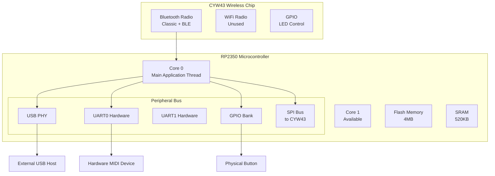
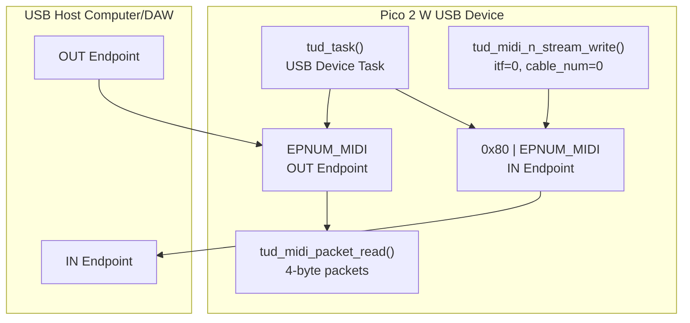
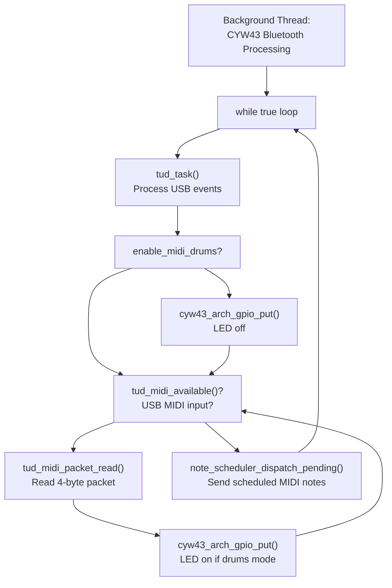

# Hardware Interfaces

> **Relevant source files**
> * [.gitignore](https://github.com/Jus-Be/orinayo-pico/blob/122fa496/.gitignore)
> * [CMakeLists.txt](https://github.com/Jus-Be/orinayo-pico/blob/122fa496/CMakeLists.txt)
> * [main.c](https://github.com/Jus-Be/orinayo-pico/blob/122fa496/main.c)
> * [usb_descriptors.c](https://github.com/Jus-Be/orinayo-pico/blob/122fa496/usb_descriptors.c)

## Purpose and Scope

This page documents the hardware interfaces available on the Raspberry Pi Pico 2 W platform and how the Orinayo system utilizes them. It covers the physical layer configuration, initialization sequences, and interface-specific functions for USB, UART, Bluetooth, and GPIO.

For information about higher-level system architecture, see [System Components](./3.1-system-components.md). For USB MIDI descriptor configuration, see [USB MIDI Configuration](./6.2-usb-midi-configuration.md). For details on MIDI output logic, see [Dual Output Architecture](./6.1-dual-output-architecture.md).

## Hardware Platform

The Orinayo system runs on the **Raspberry Pi Pico 2 W**, which provides the following hardware capabilities:

| Component | Specification | Usage in Orinayo |
| --- | --- | --- |
| Microcontroller | RP2350 dual-core ARM Cortex-M33 | Core 0: Application logic, USB, UARTCore 1: Available for future use |
| Wireless Chip | CYW43 (Bluetooth + WiFi) | Bluetooth Classic + BLEWiFi unused |
| Flash Storage | 4MB | Firmware + pattern storage |
| GPIO Pins | 26 digital I/O | Button input, LED output, UART |
| USB | USB 1.1 Device | MIDI device interface |
| UART | 2 hardware UARTs | UART0 for MIDI output |

The system is configured for the `rp2350-arm-s` platform and `pico2_w` board in the build system.

**Sources:** [CMakeLists.txt L23-L24](https://github.com/Jus-Be/orinayo-pico/blob/122fa496/CMakeLists.txt#L23-L24)

---

## RP2350 Core Architecture



**Sources:** [main.c L1-L173](https://github.com/Jus-Be/orinayo-pico/blob/122fa496/main.c#L1-L173)

 [CMakeLists.txt L23-L24](https://github.com/Jus-Be/orinayo-pico/blob/122fa496/CMakeLists.txt#L23-L24)

---

## USB Interface

### USB Device Configuration

The Orinayo system presents itself as a **USB MIDI device** using the TinyUSB library. The USB configuration is statically defined in descriptors.

**Key USB Identifiers:**

| Parameter | Value | Description |
| --- | --- | --- |
| Vendor ID | `0xCafe` | Fixed identifier |
| Product ID | `USB_PID` | Dynamic, bit-mapped based on enabled interfaces |
| Device Class | `0x00` | Composite device |
| USB Version | `0x0200` | USB 2.0 |
| Max Packet Size | `64` (Full Speed)`512` (High Speed) | MIDI endpoint size |

The Product ID is automatically calculated using a bitmap of enabled TinyUSB interfaces:

```
PID = 0x4000 | (CDC << 0) | (MSC << 1) | (HID << 2) | (MIDI << 3) | (VENDOR << 4)
```

**Sources:** [usb_descriptors.c L34-L60](https://github.com/Jus-Be/orinayo-pico/blob/122fa496/usb_descriptors.c#L34-L60)

### USB MIDI Endpoints



**Endpoint Numbers:**

* `EPNUM_MIDI = 0x01` (for most MCUs)
* `EPNUM_MIDI = 0x02` (for LPC17xx/40xx series)

The system uses interface number `ITF_NUM_MIDI = 0` with a streaming sub-interface `ITF_NUM_MIDI_STREAMING = 1`.

**Sources:** [usb_descriptors.c L74-L98](https://github.com/Jus-Be/orinayo-pico/blob/122fa496/usb_descriptors.c#L74-L98)

### USB Initialization and Lifecycle

The USB device lifecycle is managed through TinyUSB callbacks:

| Function | Location | Purpose |
| --- | --- | --- |
| `tusb_init()` | [main.c L130](https://github.com/Jus-Be/orinayo-pico/blob/122fa496/main.c#L130-L130) | Initialize TinyUSB device stack |
| `tud_task()` | [main.c L136](https://github.com/Jus-Be/orinayo-pico/blob/122fa496/main.c#L136-L136) <br>  [main.c L153](https://github.com/Jus-Be/orinayo-pico/blob/122fa496/main.c#L153-L153) | Process USB events in main loop |
| `tud_mount_cb()` | [main.c L180-L183](https://github.com/Jus-Be/orinayo-pico/blob/122fa496/main.c#L180-L183) | Called when USB device is mounted |
| `tud_umount_cb()` | [main.c L186-L189](https://github.com/Jus-Be/orinayo-pico/blob/122fa496/main.c#L186-L189) | Called when USB device is unmounted |
| `tud_suspend_cb()` | [main.c L194-L198](https://github.com/Jus-Be/orinayo-pico/blob/122fa496/main.c#L194-L198) | Called when USB bus is suspended |
| `tud_resume_cb()` | [main.c L201-L204](https://github.com/Jus-Be/orinayo-pico/blob/122fa496/main.c#L201-L204) | Called when USB bus is resumed |

The LED provides visual feedback for USB connection status, turning on when mounted and off when unmounted or suspended.

**Sources:** [main.c L125-L204](https://github.com/Jus-Be/orinayo-pico/blob/122fa496/main.c#L125-L204)

### USB MIDI Write Function

The primary USB MIDI output function is wrapped in `midi_n_stream_write()`:

```javascript
uint32_t midi_n_stream_write(uint8_t itf, uint8_t cable_num, 
                              const uint8_t *buffer, uint32_t bufsize)
```

This function simultaneously writes to both USB and UART interfaces. See [Dual Output Architecture](./6.1-dual-output-architecture.md) for details.

**Sources:** [main.c L109](https://github.com/Jus-Be/orinayo-pico/blob/122fa496/main.c#L109-L109)

 [main.c L690-L697](https://github.com/Jus-Be/orinayo-pico/blob/122fa496/main.c#L690-L697)

---

## UART Interface

### UART Hardware Configuration

The system uses **UART0** configured for standard MIDI serial communication:

| Parameter | Value | Macro/Constant |
| --- | --- | --- |
| UART Instance | `uart0` | `UART_ID` |
| Baud Rate | 31250 | `BAUD_RATE` |
| TX Pin | GPIO 0 | `UART_TX_PIN` |
| RX Pin | GPIO 1 | `UART_RX_PIN` |
| GPIO Function | UART | `GPIO_FUNC_UART` (2) |
| FIFO | Enabled | - |
| CRLF Translation | Disabled | - |

The 31,250 baud rate is the MIDI 1.0 specification standard for serial MIDI transmission.

**Sources:** [main.c L57-L62](https://github.com/Jus-Be/orinayo-pico/blob/122fa496/main.c#L57-L62)

### UART Initialization Sequence

```mermaid
sequenceDiagram
  participant main() in main.c
  participant Pico SDK
  participant UART0 Hardware

  main() in main.c->>Pico SDK: uart_init(UART_ID, 31250)
  Pico SDK->>UART0 Hardware: Configure baud rate generator
  main() in main.c->>Pico SDK: gpio_set_function(0, GPIO_FUNC_UART)
  Pico SDK->>UART0 Hardware: Set GPIO 0 to UART TX
  main() in main.c->>Pico SDK: gpio_set_function(1, GPIO_FUNC_UART)
  Pico SDK->>UART0 Hardware: Set GPIO 1 to UART RX
  main() in main.c->>Pico SDK: uart_set_fifo_enabled(UART_ID, true)
  Pico SDK->>UART0 Hardware: Enable TX/RX FIFOs
  main() in main.c->>Pico SDK: uart_set_translate_crlf(UART_ID, false)
  note over Pico SDK,UART0 Hardware: Disable CRLF translation
```

This initialization occurs after USB initialization but before the main event loop.

**Sources:** [main.c L145-L150](https://github.com/Jus-Be/orinayo-pico/blob/122fa496/main.c#L145-L150)

### UART Output Implementation

UART output is performed byte-by-byte with blocking wait for transmit ready:

```
// From midi_n_stream_write() in main.c:693-696
for (int i=0; i<bufsize; i++) {
    while (!uart_is_writable(UART_ID)){ }  // Block until TX FIFO has space
    uart_putc(UART_ID, buffer[i]);         // Write single byte
}
```

This ensures reliable transmission by waiting for hardware FIFO availability before each byte. The FIFO buffering allows the CPU to continue processing while the UART transmits.

**Sources:** [main.c L690-L697](https://github.com/Jus-Be/orinayo-pico/blob/122fa496/main.c#L690-L697)

---

## Bluetooth Interface

### CYW43 Wireless Chip Integration

The CYW43 chip on the Pico 2 W provides Bluetooth Classic and BLE capabilities. The system uses **threadsafe background operations** to allow Bluetooth processing to occur asynchronously without blocking the main application.

**Build Configuration:**

| Library | Purpose |
| --- | --- |
| `pico_cyw43_arch_threadsafe_background` | Threadsafe async Bluetooth operations |
| `pico_btstack_classic` | Bluetooth Classic stack |
| `pico_btstack_ble` | Bluetooth Low Energy stack |
| `pico_btstack_cyw43` | BTstack integration with CYW43 |
| `bluepad32` | Game controller support library |

**Sources:** [CMakeLists.txt L41-L42](https://github.com/Jus-Be/orinayo-pico/blob/122fa496/CMakeLists.txt#L41-L42)

 [CMakeLists.txt L56](https://github.com/Jus-Be/orinayo-pico/blob/122fa496/CMakeLists.txt#L56-L56)

### Bluetooth Initialization

```mermaid
sequenceDiagram
  participant main() in main.c
  participant CYW43 Architecture
  participant bluetooth_init()
  participant in pico_bluetooth.c
  participant BTstack

  main() in main.c->>CYW43 Architecture: pico_led_init()
  note over CYW43 Architecture: Calls cyw43_arch_init()
  CYW43 Architecture->>CYW43 Architecture: Initialize SPI to CYW43
  CYW43 Architecture->>CYW43 Architecture: Start background thread
  main() in main.c->>main() in main.c: sleep_ms(1000)
  note over main() in main.c: Wait for CYW43 ready
  main() in main.c->>bluetooth_init(): bluetooth_init()
  bluetooth_init()->>BTstack: Initialize BTstack
  bluetooth_init()->>BTstack: Configure BLE/Classic
  bluetooth_init()->>BTstack: Start device discovery
  note over BTstack: Background processing
```

The `cyw43_arch_init()` call is abstracted through the LED initialization function, which handles the CYW43 setup for both LED control and wireless functionality.

**Sources:** [main.c L33-L44](https://github.com/Jus-Be/orinayo-pico/blob/122fa496/main.c#L33-L44)

 [main.c L125-L134](https://github.com/Jus-Be/orinayo-pico/blob/122fa496/main.c#L125-L134)

### Bluetooth Processing Model

The Bluetooth stack operates in a **background thread** managed by the `pico_cyw43_arch_threadsafe_background` library. This allows:

1. **Non-blocking Bluetooth events**: Connection, pairing, and data reception occur asynchronously
2. **Concurrent USB/UART operation**: Main loop continues processing MIDI output
3. **Mutex-protected access**: BTstack functions are automatically serialized

The main application interacts with Bluetooth through function calls in `pico_bluetooth.c`, which are thread-safe wrappers around BTstack operations.

**Sources:** [CMakeLists.txt L42](https://github.com/Jus-Be/orinayo-pico/blob/122fa496/CMakeLists.txt#L42-L42)

### Bluetooth Device Types Supported

The system handles two categories of Bluetooth input devices:

1. **Generic HID Controllers** (via Bluepad32): * Guitar Hero controllers * Game controllers with standard HID reports * Button mappings handled by `pico_bluetooth.c`
2. **Specialized BLE MIDI Devices** (via custom GATT): * Liberlive BLE MIDI controller * Sonic Master BLE MIDI controller * Custom GATT UUID handling in `uni_bt_le.c`

For detailed information on Bluetooth device discovery and connection, see [BLE Device Management](./4.1-ble-device-management.md). For HID-to-MIDI translation, see [HID to MIDI Translation](./4.2-hid-to-midi-translation.md).

**Sources:** High-level architecture diagrams

---

## GPIO Interface

### LED Control

The system uses the onboard LED for status indication. The LED is controlled differently depending on the hardware variant:

**Standard Pico (GPIO LED):**

```
gpio_init(PICO_DEFAULT_LED_PIN);
gpio_set_dir(PICO_DEFAULT_LED_PIN, GPIO_OUT);
gpio_put(PICO_DEFAULT_LED_PIN, led_on);
```

**Pico W (CYW43 LED):**

```
cyw43_arch_init();  // Initialize CYW43 driver
cyw43_arch_gpio_put(CYW43_WL_GPIO_LED_PIN, led_on);
```

The Pico 2 W uses the CYW43 variant, where the LED is connected to a GPIO on the wireless chip itself, requiring communication over the SPI bus.

**Sources:** [main.c L33-L55](https://github.com/Jus-Be/orinayo-pico/blob/122fa496/main.c#L33-L55)

### LED Status Indicators

```css
#mermaid-jfxxvqecto8{font-family:ui-sans-serif,-apple-system,system-ui,Segoe UI,Helvetica;font-size:16px;fill:#333;}@keyframes edge-animation-frame{from{stroke-dashoffset:0;}}@keyframes dash{to{stroke-dashoffset:0;}}#mermaid-jfxxvqecto8 .edge-animation-slow{stroke-dasharray:9,5!important;stroke-dashoffset:900;animation:dash 50s linear infinite;stroke-linecap:round;}#mermaid-jfxxvqecto8 .edge-animation-fast{stroke-dasharray:9,5!important;stroke-dashoffset:900;animation:dash 20s linear infinite;stroke-linecap:round;}#mermaid-jfxxvqecto8 .error-icon{fill:#dddddd;}#mermaid-jfxxvqecto8 .error-text{fill:#222222;stroke:#222222;}#mermaid-jfxxvqecto8 .edge-thickness-normal{stroke-width:1px;}#mermaid-jfxxvqecto8 .edge-thickness-thick{stroke-width:3.5px;}#mermaid-jfxxvqecto8 .edge-pattern-solid{stroke-dasharray:0;}#mermaid-jfxxvqecto8 .edge-thickness-invisible{stroke-width:0;fill:none;}#mermaid-jfxxvqecto8 .edge-pattern-dashed{stroke-dasharray:3;}#mermaid-jfxxvqecto8 .edge-pattern-dotted{stroke-dasharray:2;}#mermaid-jfxxvqecto8 .marker{fill:#999;stroke:#999;}#mermaid-jfxxvqecto8 .marker.cross{stroke:#999;}#mermaid-jfxxvqecto8 svg{font-family:ui-sans-serif,-apple-system,system-ui,Segoe UI,Helvetica;font-size:16px;}#mermaid-jfxxvqecto8 p{margin:0;}#mermaid-jfxxvqecto8 defs #statediagram-barbEnd{fill:#999;stroke:#999;}#mermaid-jfxxvqecto8 g.stateGroup text{fill:#dddddd;stroke:none;font-size:10px;}#mermaid-jfxxvqecto8 g.stateGroup text{fill:#333;stroke:none;font-size:10px;}#mermaid-jfxxvqecto8 g.stateGroup .state-title{font-weight:bolder;fill:#333;}#mermaid-jfxxvqecto8 g.stateGroup rect{fill:#ffffff;stroke:#dddddd;}#mermaid-jfxxvqecto8 g.stateGroup line{stroke:#999;stroke-width:1;}#mermaid-jfxxvqecto8 .transition{stroke:#999;stroke-width:1;fill:none;}#mermaid-jfxxvqecto8 .stateGroup .composit{fill:#f4f4f4;border-bottom:1px;}#mermaid-jfxxvqecto8 .stateGroup .alt-composit{fill:#e0e0e0;border-bottom:1px;}#mermaid-jfxxvqecto8 .state-note{stroke:#e6d280;fill:#fff5ad;}#mermaid-jfxxvqecto8 .state-note text{fill:#333;stroke:none;font-size:10px;}#mermaid-jfxxvqecto8 .stateLabel .box{stroke:none;stroke-width:0;fill:#ffffff;opacity:0.5;}#mermaid-jfxxvqecto8 .edgeLabel .label rect{fill:#ffffff;opacity:0.5;}#mermaid-jfxxvqecto8 .edgeLabel{background-color:#ffffff;text-align:center;}#mermaid-jfxxvqecto8 .edgeLabel p{background-color:#ffffff;}#mermaid-jfxxvqecto8 .edgeLabel rect{opacity:0.5;background-color:#ffffff;fill:#ffffff;}#mermaid-jfxxvqecto8 .edgeLabel .label text{fill:#333;}#mermaid-jfxxvqecto8 .label div .edgeLabel{color:#333;}#mermaid-jfxxvqecto8 .stateLabel text{fill:#333;font-size:10px;font-weight:bold;}#mermaid-jfxxvqecto8 .node circle.state-start{fill:#999;stroke:#999;}#mermaid-jfxxvqecto8 .node .fork-join{fill:#999;stroke:#999;}#mermaid-jfxxvqecto8 .node circle.state-end{fill:#dddddd;stroke:#f4f4f4;stroke-width:1.5;}#mermaid-jfxxvqecto8 .end-state-inner{fill:#f4f4f4;stroke-width:1.5;}#mermaid-jfxxvqecto8 .node rect{fill:#ffffff;stroke:#dddddd;stroke-width:1px;}#mermaid-jfxxvqecto8 .node polygon{fill:#ffffff;stroke:#dddddd;stroke-width:1px;}#mermaid-jfxxvqecto8 #statediagram-barbEnd{fill:#999;}#mermaid-jfxxvqecto8 .statediagram-cluster rect{fill:#ffffff;stroke:#dddddd;stroke-width:1px;}#mermaid-jfxxvqecto8 .cluster-label,#mermaid-jfxxvqecto8 .nodeLabel{color:#333;}#mermaid-jfxxvqecto8 .statediagram-cluster rect.outer{rx:5px;ry:5px;}#mermaid-jfxxvqecto8 .statediagram-state .divider{stroke:#dddddd;}#mermaid-jfxxvqecto8 .statediagram-state .title-state{rx:5px;ry:5px;}#mermaid-jfxxvqecto8 .statediagram-cluster.statediagram-cluster .inner{fill:#f4f4f4;}#mermaid-jfxxvqecto8 .statediagram-cluster.statediagram-cluster-alt .inner{fill:#f8f8f8;}#mermaid-jfxxvqecto8 .statediagram-cluster .inner{rx:0;ry:0;}#mermaid-jfxxvqecto8 .statediagram-state rect.basic{rx:5px;ry:5px;}#mermaid-jfxxvqecto8 .statediagram-state rect.divider{stroke-dasharray:10,10;fill:#f8f8f8;}#mermaid-jfxxvqecto8 .note-edge{stroke-dasharray:5;}#mermaid-jfxxvqecto8 .statediagram-note rect{fill:#fff5ad;stroke:#e6d280;stroke-width:1px;rx:0;ry:0;}#mermaid-jfxxvqecto8 .statediagram-note rect{fill:#fff5ad;stroke:#e6d280;stroke-width:1px;rx:0;ry:0;}#mermaid-jfxxvqecto8 .statediagram-note text{fill:#333;}#mermaid-jfxxvqecto8 .statediagram-note .nodeLabel{color:#333;}#mermaid-jfxxvqecto8 .statediagram .edgeLabel{color:red;}#mermaid-jfxxvqecto8 #dependencyStart,#mermaid-jfxxvqecto8 #dependencyEnd{fill:#999;stroke:#999;stroke-width:1;}#mermaid-jfxxvqecto8 .statediagramTitleText{text-anchor:middle;font-size:18px;fill:#333;}#mermaid-jfxxvqecto8 :root{--mermaid-font-family:"trebuchet ms",verdana,arial,sans-serif;}System BootUSB MountedUSB UnmountedUSB SuspendedUSB ResumedMIDI Drums ModeMIDI Input ReceivedOffOnBlinkLED controlled by:- tud_mount_cb()- tud_resume_cb()LED controlled by:- tud_umount_cb()- tud_suspend_cb()LED blinks in main loopwhen enable_midi_drums=truelines 155, 166 in main.c
```

**Sources:** [main.c L155](https://github.com/Jus-Be/orinayo-pico/blob/122fa496/main.c#L155-L155)

 [main.c L166](https://github.com/Jus-Be/orinayo-pico/blob/122fa496/main.c#L166-L166)

 [main.c L180-L204](https://github.com/Jus-Be/orinayo-pico/blob/122fa496/main.c#L180-L204)

### Button Input GPIO

While button input GPIO configuration is referenced in the system (used by looper and tap tempo), the specific GPIO pin assignments are handled in files not provided. The button input processing is documented in [Button Input](./7.1-button-input.md).

---

## Interface Initialization Sequence

The complete hardware initialization occurs in `main()` with specific ordering requirements:

```mermaid
sequenceDiagram
  participant main()
  participant LED (CYW43)
  participant Board Support
  participant TinyUSB
  participant Bluetooth
  participant UART0
  participant Application

  main()->>LED (CYW43): pico_led_init()
  note over LED (CYW43): Initializes CYW43 SPI
  main()->>Board Support: board_init()
  note over Board Support: Initialize USB pins
  main()->>TinyUSB: tusb_init()
  note over TinyUSB: Initialize USB device stack
  main()->>main(): stdio_init_all()
  note over main(): Initialize standard I/O
  main()->>main(): sleep_ms(1000)
  note over main(): Wait for CYW43 stabilization
  main()->>Bluetooth: bluetooth_init()
  note over Bluetooth: Initialize BTstack
  main()->>TinyUSB: tud_task()
  note over TinyUSB: First USB enumeration attempt
  main()->>Application: storage_load_tracks()
  note over Application: Load saved patterns from flash
  main()->>Application: async_timer_init()
  main()->>Application: looper_schedule_step_timer()
  main()->>Application: note_scheduler_init()
  main()->>UART0: uart_init(UART_ID, 31250)
  main()->>UART0: gpio_set_function(0, UART TX)
  main()->>UART0: gpio_set_function(1, UART RX)
  main()->>UART0: uart_set_fifo_enabled(true)
  main()->>UART0: uart_set_translate_crlf(false)
  main()->>main(): Enter main loop
  note over main(): while(true) loop at line 152
```

**Critical Timing Requirements:**

1. **CYW43 before Bluetooth**: The CYW43 chip must be initialized and stabilized before Bluetooth operations
2. **USB before application**: TinyUSB must be initialized before any USB-dependent operations
3. **Bluetooth after delay**: 1-second delay ensures CYW43 wireless chip is ready
4. **UART after application setup**: UART initialization can occur late as it's independent

**Sources:** [main.c L125-L150](https://github.com/Jus-Be/orinayo-pico/blob/122fa496/main.c#L125-L150)

---

## Main Event Loop Integration

The main event loop coordinates all hardware interfaces:



**Key Points:**

1. **`tud_task()`** must be called frequently (every iteration) to maintain USB communication
2. **LED feedback** is provided when MIDI drums mode is active
3. **`note_scheduler_dispatch_pending()`** is called from main loop to avoid USB mutex issues (see [Note Scheduler](./5.5-note-scheduler.md))
4. **Bluetooth processing** occurs in background thread, not in main loop

**Sources:** [main.c L152-L170](https://github.com/Jus-Be/orinayo-pico/blob/122fa496/main.c#L152-L170)

---

## Hardware Interface Summary Table

| Interface | Hardware | Pins/Resources | Initialization Function | Primary I/O Functions | Notes |
| --- | --- | --- | --- | --- | --- |
| **USB** | RP2350 USB PHY | USB D+/D- | `tusb_init()` | `tud_task()``tud_midi_n_stream_write()` | Must poll `tud_task()` regularly |
| **UART** | UART0 | GPIO 0 (TX)GPIO 1 (RX) | `uart_init()``gpio_set_function()` | `uart_putc()``uart_is_writable()` | 31250 baud MIDI standard |
| **Bluetooth** | CYW43 via SPI | Internal SPI bus | `cyw43_arch_init()``bluetooth_init()` | BTstack callbacks | Background thread processing |
| **LED** | CYW43 GPIO | `CYW43_WL_GPIO_LED_PIN` | `cyw43_arch_init()` | `cyw43_arch_gpio_put()` | On wireless chip, not RP2350 |
| **Button** | RP2350 GPIO | (Not specified in files) | `gpio_init()` | `gpio_get()` | See [Button Input](./7.1-button-input.md) |

**Sources:** [main.c L1-L173](https://github.com/Jus-Be/orinayo-pico/blob/122fa496/main.c#L1-L173)

 [usb_descriptors.c L1-L180](https://github.com/Jus-Be/orinayo-pico/blob/122fa496/usb_descriptors.c#L1-L180)

 [CMakeLists.txt L1-L67](https://github.com/Jus-Be/orinayo-pico/blob/122fa496/CMakeLists.txt#L1-L67)