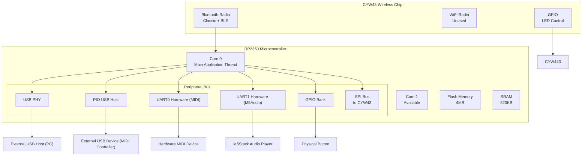
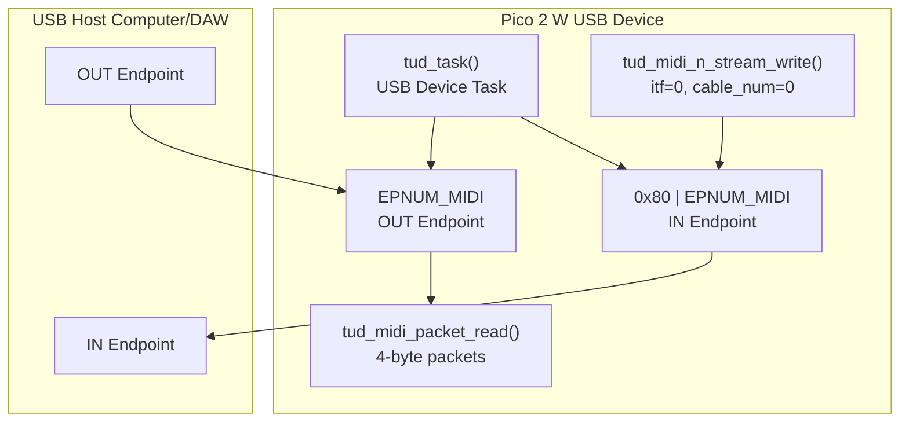
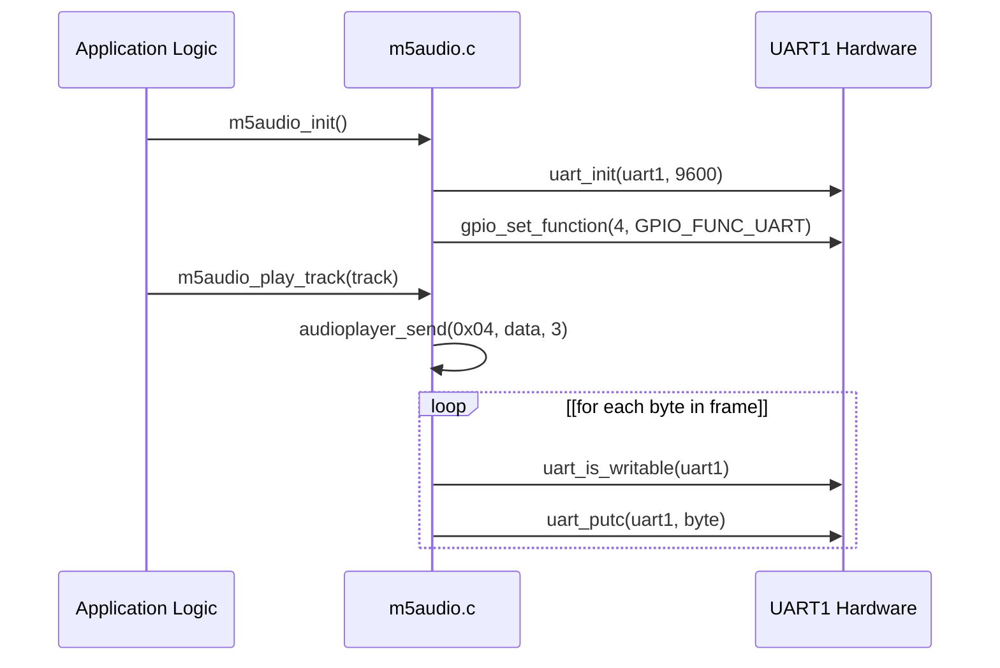

# Hardware Interfaces

> **Relevant source files**
> * [CMakeLists.txt](https://github.com/Jus-Be/orinayo-pico/blob/6dde5a75/CMakeLists.txt)
> * [pico_pio_usb/src/pio_usb.c](https://github.com/Jus-Be/orinayo-pico/blob/6dde5a75/pico_pio_usb/src/pio_usb.c)
> * [pico_pio_usb/src/pio_usb_configuration.h](https://github.com/Jus-Be/orinayo-pico/blob/6dde5a75/pico_pio_usb/src/pio_usb_configuration.h)
> * [tinyusb/hw/bsp/rp2040/family.c](https://github.com/Jus-Be/orinayo-pico/blob/6dde5a75/tinyusb/hw/bsp/rp2040/family.c)
> * [tusb_config.h](https://github.com/Jus-Be/orinayo-pico/blob/6dde5a75/tusb_config.h)
> * [usb_descriptors.c](https://github.com/Jus-Be/orinayo-pico/blob/6dde5a75/usb_descriptors.c)

## Purpose and Scope

This page documents the hardware interfaces available on the Raspberry Pi Pico 2 W platform and how the Orinayo system utilizes them. It covers the physical layer configuration, initialization sequences, and interface-specific functions for USB, UART, Bluetooth, and GPIO.

For information about higher-level system architecture, see [System Components](./3.1-system-components.md). For USB MIDI descriptor configuration, see [USB MIDI Configuration](./6.2-usb-midi-configuration.md). For details on MIDI output logic, see [Dual Output Architecture](./6.1-dual-output-architecture.md).

## Hardware Platform

The Orinayo system runs on the **Raspberry Pi Pico 2 W**, which provides the following hardware capabilities:

| Component | Specification | Usage in Orinayo |
| --- | --- | --- |
| Microcontroller | RP2350 dual-core ARM Cortex-M33 | Core 0: Application logic, USB, UARTCore 1: Available for future use |
| Wireless Chip | CYW43 (Bluetooth + WiFi) | Bluetooth Classic + BLEWiFi unused |
| Flash Storage | 4MB | Firmware + pattern storage |
| GPIO Pins | 26 digital I/O | Button input, LED output, UART |
| USB | USB 1.1 Device | MIDI device interface |
| UART | 2 hardware UARTs | UART0 for MIDI output, UART1 for M5Audio |

The system is configured for the `rp2350-arm-s` platform and `pico2_w` board in the build system.

**Sources:** [CMakeLists.txt L23-L24](https://github.com/Jus-Be/orinayo-pico/blob/6dde5a75/CMakeLists.txt#L23-L24)

---

## RP2350 Core Architecture


```mermaid
flowchart TD

CORE0["Core 0<br>Main Application Thread"]
CORE1["Core 1<br>Available"]
FLASH["Flash Memory<br>4MB"]
SRAM["SRAM<br>520KB"]
USB_PHY["USB PHY"]
PIO_USB_HOST["PIO USB Host"]
UART0_HW["UART0 Hardware (MIDI)"]
UART1_HW["UART1 Hardware (M5Audio)"]
GPIO_BANK["GPIO Bank"]
SPI_BUS["SPI Bus<br>to CYW43"]
BT_RADIO["Bluetooth Radio<br>Classic + BLE"]
WIFI_RADIO["WiFi Radio<br>Unused"]
CYW_GPIO["GPIO<br>LED Control"]
CYW443["CYW443"]
EXT_USB_DEV["External USB Host (PC)"]
EXT_USB_HOST["External USB Device (MIDI Controller)"]
EXT_MIDI["Hardware MIDI Device"]
M5_AUDIO["M5Stack Audio Player"]
EXT_BTN["Physical Button"]

BT_RADIO --> CORE0
CYW_GPIO --> CYW443
USB_PHY --> EXT_USB_DEV
PIO_USB_HOST --> EXT_USB_HOST
UART0_HW --> EXT_MIDI
UART1_HW --> M5_AUDIO
GPIO_BANK --> EXT_BTN

subgraph CYW43 ["CYW43 Wireless Chip"]
    BT_RADIO
    WIFI_RADIO
    CYW_GPIO
end

subgraph RP2350 ["RP2350 Microcontroller"]
    CORE0
    CORE1
    FLASH
    SRAM
    CORE0 --> USB_PHY
    CORE0 --> PIO_USB_HOST
    CORE0 --> UART0_HW
    CORE0 --> UART1_HW
    CORE0 --> GPIO_BANK
    CORE0 --> SPI_BUS

subgraph Peripherals ["Peripheral Bus"]
    USB_PHY
    PIO_USB_HOST
    UART0_HW
    UART1_HW
    GPIO_BANK
    SPI_BUS
end
end
```

**Sources:** [main.c L1-L173](https://github.com/Jus-Be/orinayo-pico/blob/6dde5a75/main.c#L1-L173)

 [m5audio.c L62-L70](https://github.com/Jus-Be/orinayo-pico/blob/6dde5a75/m5audio.c#L62-L70)

 [CMakeLists.txt L23-L24](https://github.com/Jus-Be/orinayo-pico/blob/6dde5a75/CMakeLists.txt#L23-L24)

---

## USB Interface

The Orinayo system operates in a **USB dual-role mode**, acting as both a USB device and a USB host.

* **USB Device:** The native USB port on the Pico W (Port 0) functions as a USB MIDI device, allowing connection to a computer or other USB host.
* **USB Host:** A PIO-based USB host (Port 1) is implemented to connect to external USB MIDI controllers.

This dual-role functionality is enabled by defining `CFG_TUD_ENABLED` and `CFG_TUH_ENABLED` as `1` in `tusb_config.h`. [tusb_config.h L50-L51](https://github.com/Jus-Be/orinayo-pico/blob/6dde5a75/tusb_config.h#L50-L51)

### USB Device Configuration

The Orinayo system presents itself as a **USB MIDI device** using the TinyUSB library. The USB configuration is statically defined in descriptors.

**Key USB Identifiers:**

| Parameter | Value | Description |
| --- | --- | --- |
| Vendor ID | `0xCafe` | Fixed identifier |
| Product ID | `USB_PID` | Dynamic, bit-mapped based on enabled interfaces |
| Device Class | `0x00` | Composite device |
| USB Version | `0x0200` | USB 2.0 |
| Max Packet Size | `64` (Full Speed)`512` (High Speed) | MIDI endpoint size |

The Product ID is automatically calculated using a bitmap of enabled TinyUSB interfaces. In `tusb_config.h`, `CFG_TUD_MIDI` is set to 1. [tusb_config.h L90](https://github.com/Jus-Be/orinayo-pico/blob/6dde5a75/tusb_config.h#L90-L90)

```
// From usb_descriptors.c:34-36#define _PID_MAP(itf, n)  ( (CFG_TUD_##itf) << (n) )#define USB_PID           (0x4000 | _PID_MAP(CDC, 0) | _PID_MAP(MSC, 1) | _PID_MAP(HID, 2) | \                           _PID_MAP(MIDI, 3) | _PID_MAP(VENDOR, 4) )
```

**Sources:** [usb_descriptors.c L34-L60](https://github.com/Jus-Be/orinayo-pico/blob/6dde5a75/usb_descriptors.c#L34-L60)

 [tusb_config.h L80-L84](https://github.com/Jus-Be/orinayo-pico/blob/6dde5a75/tusb_config.h#L80-L84)

### USB MIDI Endpoints (Device Role)


```mermaid
flowchart TD

HOST_OUT["OUT Endpoint"]
HOST_IN["IN Endpoint"]
EP_OUT["EPNUM_MIDI<br>OUT Endpoint"]
EP_IN["0x80 | EPNUM_MIDI<br>IN Endpoint"]
TUD_TASK["tud_task()<br>USB Device Task"]
TUD_MIDI_WRITE["tud_midi_n_stream_write()<br>itf=0, cable_num=0"]
TUD_MIDI_READ["tud_midi_packet_read()<br>4-byte packets"]

HOST_OUT --> EP_OUT
EP_IN --> HOST_IN

subgraph PICO ["Pico 2 W USB Device"]
    EP_OUT
    EP_IN
    TUD_TASK
    TUD_MIDI_WRITE
    TUD_MIDI_READ
    EP_OUT --> TUD_MIDI_READ
    TUD_MIDI_WRITE --> EP_IN
    TUD_TASK --> EP_OUT
    TUD_TASK --> EP_IN
end

subgraph HOST ["USB Host Computer/DAW"]
    HOST_OUT
    HOST_IN
end
```

**Endpoint Numbers:**

* `EPNUM_MIDI = 0x01` (for most MCUs) [usb_descriptors.c L88](https://github.com/Jus-Be/orinayo-pico/blob/6dde5a75/usb_descriptors.c#L88-L88)
* `EPNUM_MIDI = 0x02` (for LPC17xx/40xx series) [usb_descriptors.c L86](https://github.com/Jus-Be/orinayo-pico/blob/6dde5a75/usb_descriptors.c#L86-L86)

The system uses interface number `ITF_NUM_MIDI = 0` with a streaming sub-interface `ITF_NUM_MIDI_STREAMING = 1`. [usb_descriptors.c L76-L77](https://github.com/Jus-Be/orinayo-pico/blob/6dde5a75/usb_descriptors.c#L76-L77)

**Sources:** [usb_descriptors.c L74-L98](https://github.com/Jus-Be/orinayo-pico/blob/6dde5a75/usb_descriptors.c#L74-L98)

### USB Host Configuration (PIO USB)

The Pico W's second Programmable I/O (PIO) block is utilized to implement a USB host controller. This allows the Orinayo system to connect to and receive MIDI data from external USB MIDI devices.

**Key Configuration Macros:**

* `BOARD_TUH_RHPORT = 1`: Designates PIO USB as root hub port 1 for host functionality. [tusb_config.h L41](https://github.com/Jus-Be/orinayo-pico/blob/6dde5a75/tusb_config.h#L41-L41)
* `CFG_TUSB_RHPORT1_MODE = OPT_MODE_HOST`: Configures root hub port 1 for host mode. [tusb_config.h L43](https://github.com/Jus-Be/orinayo-pico/blob/6dde5a75/tusb_config.h#L43-L43)
* `CFG_TUH_RPI_PIO_USB = 1`: Enables PIO-USB as the host controller. [tusb_config.h L103](https://github.com/Jus-Be/orinayo-pico/blob/6dde5a75/tusb_config.h#L103-L103)
* `PICO_DEFAULT_PIO_USB_DP_PIN = 17`: Specifies GPIO 17 as the D+ pin for the PIO USB host. [CMakeLists.txt L52](https://github.com/Jus-Be/orinayo-pico/blob/6dde5a75/CMakeLists.txt#L52-L52)

The `pio_usb_configuration_t` struct is used to pass PIO-specific settings to the TinyUSB host stack during initialization. [tinyusb/hw/bsp/rp2040/family.c L188-L190](https://github.com/Jus-Be/orinayo-pico/blob/6dde5a75/tinyusb/hw/bsp/rp2040/family.c#L188-L190)

**Sources:** [tusb_config.h L41-L44](https://github.com/Jus-Be/orinayo-pico/blob/6dde5a75/tusb_config.h#L41-L44)

 [tusb_config.h L103](https://github.com/Jus-Be/orinayo-pico/blob/6dde5a75/tusb_config.h#L103-L103)

 [CMakeLists.txt L52](https://github.com/Jus-Be/orinayo-pico/blob/6dde5a75/CMakeLists.txt#L52-L52)

 [tinyusb/hw/bsp/rp2040/family.c L188-L190](https://github.com/Jus-Be/orinayo-pico/blob/6dde5a75/tinyusb/hw/bsp/rp2040/family.c#L188-L190)

### USB Initialization and Lifecycle

The USB device and host lifecycles are managed through TinyUSB callbacks and tasks:

| Function | Location | Purpose |
| --- | --- | --- |
| `tusb_init()` | [main.c L130](https://github.com/Jus-Be/orinayo-pico/blob/6dde5a75/main.c#L130-L130) | Initialize TinyUSB device stack |
| `tuh_init()` | [main.c L131](https://github.com/Jus-Be/orinayo-pico/blob/6dde5a75/main.c#L131-L131) | Initialize TinyUSB host stack |
| `tud_task()` | [main.c L136](https://github.com/Jus-Be/orinayo-pico/blob/6dde5a75/main.c#L136-L136) <br>  [main.c L153](https://github.com/Jus-Be/orinayo-pico/blob/6dde5a75/main.c#L153-L153) | Process USB device events in main loop |
| `tuh_task()` | [main.c L137](https://github.com/Jus-Be/orinayo-pico/blob/6dde5a75/main.c#L137-L137) <br>  [main.c L154](https://github.com/Jus-Be/orinayo-pico/blob/6dde5a75/main.c#L154-L154) | Process USB host events in main loop |
| `tud_mount_cb()` | [main.c L180-L183](https://github.com/Jus-Be/orinayo-pico/blob/6dde5a75/main.c#L180-L183) | Called when USB device is mounted |
| `tud_umount_cb()` | [main.c L186-L189](https://github.com/Jus-Be/orinayo-pico/blob/6dde5a75/main.c#L186-L189) | Called when USB device is unmounted |
| `tud_suspend_cb()` | [main.c L194-L198](https://github.com/Jus-Be/orinayo-pico/blob/6dde5a75/main.c#L194-L198) | Called when USB bus is suspended |
| `tud_resume_cb()` | [main.c L201-L204](https://github.com/Jus-Be/orinayo-pico/blob/6dde5a75/main.c#L201-L204) | Called when USB bus is resumed |

**Sources:** [main.c L125-L204](https://github.com/Jus-Be/orinayo-pico/blob/6dde5a75/main.c#L125-L204)

---

## UART Interface

### MIDI UART (UART0)

The system uses **UART0** configured for standard MIDI serial communication at 31,250 baud.

| Parameter | Value | Macro/Constant |
| --- | --- | --- |
| UART Instance | `uart0` | `UART_ID` |
| Baud Rate | 31250 | `BAUD_RATE` |
| TX Pin | GPIO 0 | `UART_TX_PIN` |
| RX Pin | GPIO 1 | `UART_RX_PIN` |

**Sources:** [main.c L57-L62](https://github.com/Jus-Be/orinayo-pico/blob/6dde5a75/main.c#L57-L62)

### M5Stack Audio UART (UART1)

The system uses **UART1** to communicate with the M5Stack Audio Player (U197).

| Parameter | Value | Macro/Constant |
| --- | --- | --- |
| UART Instance | `uart1` | `M5AUDIO_UART_ID` |
| Baud Rate | 9600 | `M5AUDIO_BAUD_RATE` |
| TX Pin | GPIO 4 | `M5AUDIO_UART_TX_PIN` |
| RX Pin | GPIO 5 | `M5AUDIO_UART_RX_PIN` |

**Sources:** [m5audio.h L14-L17](https://github.com/Jus-Be/orinayo-pico/blob/6dde5a75/m5audio.h#L14-L17)

### UART Initialization and Transmission


```mermaid
sequenceDiagram
  participant Application Logic
  participant m5audio.c
  participant UART1 Hardware

  Application Logic->>m5audio.c: m5audio_init()
  m5audio.c->>UART1 Hardware: uart_init(uart1, 9600)
  m5audio.c->>UART1 Hardware: gpio_set_function(4, GPIO_FUNC_UART)
  Application Logic->>m5audio.c: m5audio_play_track(track)
  m5audio.c->>m5audio.c: audioplayer_send(0x04, data, 3)
  loop [for each byte in frame]
    m5audio.c->>UART1 Hardware: uart_is_writable(uart1)
    m5audio.c->>UART1 Hardware: uart_putc(uart1, byte)
  end
```

The `audioplayer_send` function builds a frame consisting of a command, its complement, length, data, and a checksum before transmitting over UART1.

**Sources:** [m5audio.c L35-L58](https://github.com/Jus-Be/orinayo-pico/blob/6dde5a75/m5audio.c#L35-L58)

 [m5audio.c L62-L70](https://github.com/Jus-Be/orinayo-pico/blob/6dde5a75/m5audio.c#L62-L70)

---

## Bluetooth Interface

### CYW43 Wireless Chip Integration

The CYW43 chip on the Pico 2 W provides Bluetooth Classic and BLE capabilities. The system uses **threadsafe background operations** to allow Bluetooth processing to occur asynchronously.

**Build Configuration:**

| Library | Purpose |
| --- | --- |
| `pico_cyw43_arch_threadsafe_background` | Threadsafe async Bluetooth operations |
| `pico_btstack_classic` | Bluetooth Classic stack |
| `pico_btstack_ble` | Bluetooth Low Energy stack |
| `bluepad32` | Game controller support library |

**Sources:** [CMakeLists.txt L70-L71](https://github.com/Jus-Be/orinayo-pico/blob/6dde5a75/CMakeLists.txt#L70-L71)

 [CMakeLists.txt L85](https://github.com/Jus-Be/orinayo-pico/blob/6dde5a75/CMakeLists.txt#L85-L85)

### Bluetooth Initialization

The `cyw43_arch_init()` call is abstracted through the LED initialization function, which handles the CYW43 setup for both LED control and wireless functionality.

**Sources:** [main.c L33-L44](https://github.com/Jus-Be/orinayo-pico/blob/6dde5a75/main.c#L33-L44)

 [main.c L125-L134](https://github.com/Jus-Be/orinayo-pico/blob/6dde5a75/main.c#L125-L134)

---

## GPIO Interface

### LED Control

The Pico 2 W uses the CYW43 variant, where the LED is connected to a GPIO on the wireless chip itself, requiring communication over the SPI bus.

**Sources:** [main.c L33-L55](https://github.com/Jus-Be/orinayo-pico/blob/6dde5a75/main.c#L33-L55)

### LED Status Indicators

```

```

**Sources:** [main.c L155](https://github.com/Jus-Be/orinayo-pico/blob/6dde5a75/main.c#L155-L155)

 [main.c L166](https://github.com/Jus-Be/orinayo-pico/blob/6dde5a75/main.c#L166-L166)

 [main.c L180-L204](https://github.com/Jus-Be/orinayo-pico/blob/6dde5a75/main.c#L180-L204)

---

## Hardware Interface Summary Table

| Interface | Hardware | Pins/Resources | Initialization Function | Primary I/O Functions | Notes |
| --- | --- | --- | --- | --- | --- |
| **USB Device** | RP2350 USB PHY | USB D+/D- (Native Port 0) | `tusb_init()` | `tud_task()``tud_midi_n_stream_write()` | MIDI Device Class |
| **USB Host** | RP2350 PIO | GPIO 17 (D+) | `tuh_init()``pio_usb_configuration_t` | `tuh_task()``pio_usb_bus_usb_transfer()` | PIO-based USB Host for external MIDI devices |
| **UART0** | UART0 | GPIO 0 (TX)GPIO 1 (RX) | `uart_init()` | `uart_putc()` | 31250 baud MIDI |
| **UART1** | UART1 | GPIO 4 (TX)GPIO 5 (RX) | `m5audio_init()` | `audioplayer_send()` | 9600 baud Audio Player |
| **Bluetooth** | CYW43 via SPI | Internal SPI bus | `bluetooth_init()` | BTstack callbacks | Background thread |
| **LED** | CYW43 GPIO | `WL_GPIO_LED_PIN` | `pico_led_init()` | `cyw43_arch_gpio_put()` | Status indicator |

**Sources:** [main.c L1-L173](https://github.com/Jus-Be/orinayo-pico/blob/6dde5a75/main.c#L1-L173)

 [m5audio.h L14-L17](https://github.com/Jus-Be/orinayo-pico/blob/6dde5a75/m5audio.h#L14-L17)

 [usb_descriptors.c L1-L180](https://github.com/Jus-Be/orinayo-pico/blob/6dde5a75/usb_descriptors.c#L1-L180)

 [tusb_config.h L41-L44](https://github.com/Jus-Be/orinayo-pico/blob/6dde5a75/tusb_config.h#L41-L44)

 [tusb_config.h L103](https://github.com/Jus-Be/orinayo-pico/blob/6dde5a75/tusb_config.h#L103-L103)

 [CMakeLists.txt L52](https://github.com/Jus-Be/orinayo-pico/blob/6dde5a75/CMakeLists.txt#L52-L52)