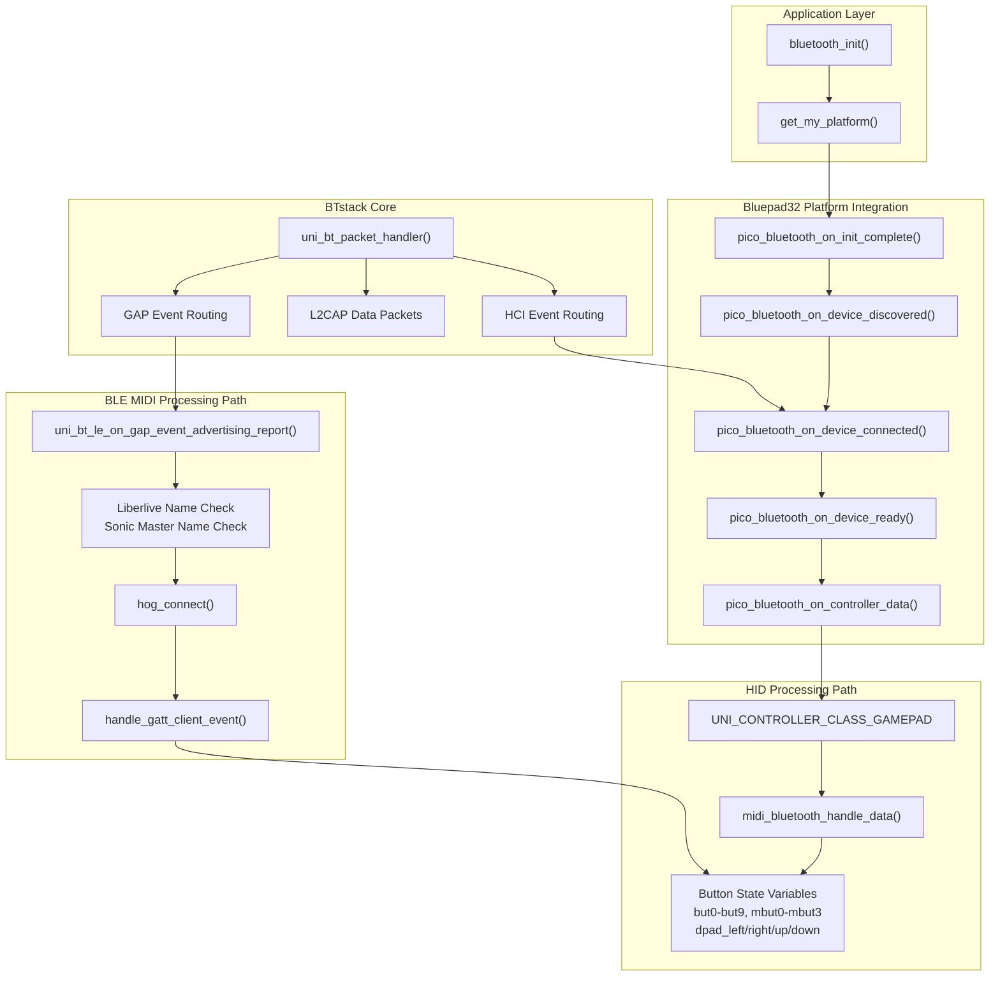
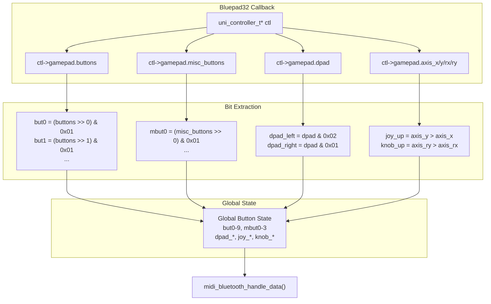
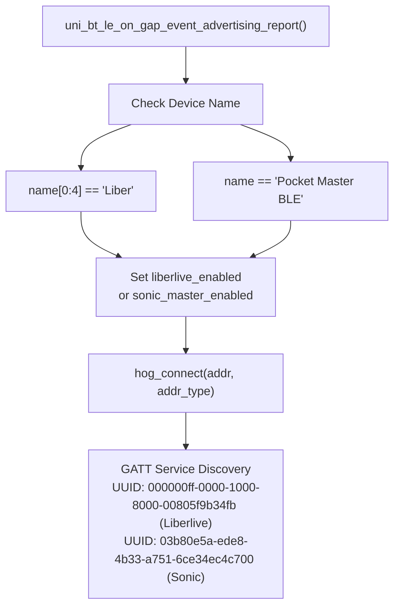
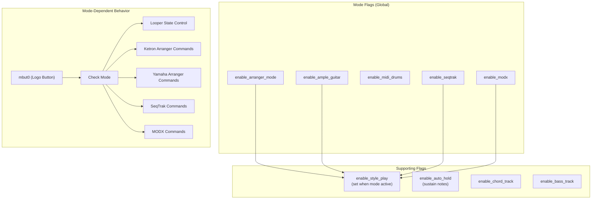
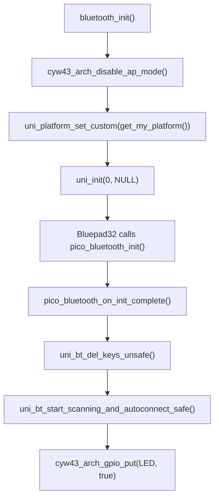

# Bluetooth Input System

> **Relevant source files**
> * [bluepad32/bt/uni_bt.c](https://github.com/Jus-Be/orinayo-pico/blob/122fa496/bluepad32/bt/uni_bt.c)
> * [bluepad32/bt/uni_bt_le.c](https://github.com/Jus-Be/orinayo-pico/blob/122fa496/bluepad32/bt/uni_bt_le.c)
> * [pico_bluetooth.c](https://github.com/Jus-Be/orinayo-pico/blob/122fa496/pico_bluetooth.c)

## Purpose and Scope

The Bluetooth Input System manages discovery, connection, pairing, and data reception from Bluetooth controllers. It supports two distinct input pathways: **generic HID controllers** (Guitar Hero controllers, standard gamepads) via the Bluepad32 library, and **specialized BLE MIDI devices** (Liberlive, Sonic Master) via custom GATT protocol handling. This system translates raw Bluetooth HID reports into internal button state representations that drive the musical processing pipeline.

For information about how button states are translated into MIDI commands, see [HID to MIDI Translation](./4.2-hid-to-midi-translation.md). For details on the musical chord generation logic, see [Chord Generation System](./4.3-chord-generation-system.md). For MIDI output configuration, see [MIDI Output System](./6-midi-output-system.md).

---

## System Architecture

The Bluetooth subsystem operates in two parallel paths depending on the device type. The architecture provides device lifecycle management (discovery, connection, disconnection) and protocol-specific data parsing.

### Bluetooth Stack Components



Sources: [pico_bluetooth.c L200-L218](https://github.com/Jus-Be/orinayo-pico/blob/122fa496/pico_bluetooth.c#L200-L218)

 [pico_bluetooth.c L1857-L1872](https://github.com/Jus-Be/orinayo-pico/blob/122fa496/pico_bluetooth.c#L1857-L1872)

 [pico_bluetooth.c L1874-L1888](https://github.com/Jus-Be/orinayo-pico/blob/122fa496/pico_bluetooth.c#L1874-L1888)

 [uni_bt.c L333-L543](https://github.com/Jus-Be/orinayo-pico/blob/122fa496/uni_bt.c#L333-L543)

 [uni_bt_le.c L1298-L1390](https://github.com/Jus-Be/orinayo-pico/blob/122fa496/uni_bt_le.c#L1298-L1390)

---

## Device Discovery and Connection

### Discovery Flow

The system continuously scans for Bluetooth devices when enabled. Discovery happens through two mechanisms: BR/EDR inquiry (for classic Bluetooth) and BLE advertising reports (for Bluetooth Low Energy).

```mermaid
sequenceDiagram
  participant Application
  participant pico_bluetooth_on_init_complete()
  participant BTstack Scanner
  participant pico_bluetooth_on_device_discovered()
  participant uni_bt_le_on_gap_event_advertising_report()
  participant Connection Handler

  Application->>pico_bluetooth_on_init_complete(): System Startup
  pico_bluetooth_on_init_complete()->>pico_bluetooth_on_init_complete(): uni_bt_del_keys_unsafe()
  pico_bluetooth_on_init_complete()->>pico_bluetooth_on_init_complete(): uni_bt_start_scanning_and_autoconnect_safe()
  pico_bluetooth_on_init_complete()->>BTstack Scanner: Start BT/BLE Scanning
  loop [Generic HID Controller]
    BTstack Scanner->>pico_bluetooth_on_device_discovered(): GAP_EVENT with device info
    pico_bluetooth_on_device_discovered()->>pico_bluetooth_on_device_discovered(): Check name for "STANDARD GAMEPAD"
    pico_bluetooth_on_device_discovered()->>pico_bluetooth_on_device_discovered(): Filter keyboards (UNI_BT_COD_MINOR_KEYBOARD)
    pico_bluetooth_on_device_discovered()-->>Connection Handler: Return UNI_ERROR_SUCCESS
    Connection Handler->>Connection Handler: pico_bluetooth_on_device_connected()
    Connection Handler->>BTstack Scanner: uni_bt_stop_scanning_safe()
    BTstack Scanner->>uni_bt_le_on_gap_event_advertising_report(): GAP_EVENT_ADVERTISING_REPORT
    uni_bt_le_on_gap_event_advertising_report()->>uni_bt_le_on_gap_event_advertising_report(): Check name == "Liber"
    uni_bt_le_on_gap_event_advertising_report()->>uni_bt_le_on_gap_event_advertising_report(): Check name == "Pocket Master BLE"
    uni_bt_le_on_gap_event_advertising_report()->>uni_bt_le_on_gap_event_advertising_report(): Set liberlive_enabled or sonic_master_enabled
    uni_bt_le_on_gap_event_advertising_report()->>Connection Handler: hog_connect(addr, addr_type)
    Connection Handler->>Connection Handler: GATT Service Discovery
  end
```

Sources: [pico_bluetooth.c L205-L218](https://github.com/Jus-Be/orinayo-pico/blob/122fa496/pico_bluetooth.c#L205-L218)

 [pico_bluetooth.c L220-L243](https://github.com/Jus-Be/orinayo-pico/blob/122fa496/pico_bluetooth.c#L220-L243)

 [pico_bluetooth.c L245-L252](https://github.com/Jus-Be/orinayo-pico/blob/122fa496/pico_bluetooth.c#L245-L252)

 [uni_bt_le.c L1298-L1390](https://github.com/Jus-Be/orinayo-pico/blob/122fa496/uni_bt_le.c#L1298-L1390)

### Connection Lifecycle

Device connections follow a state machine with security/pairing phases for BLE devices and a simpler flow for BR/EDR HID devices.

| State | HID Controller Path | BLE MIDI Path |
| --- | --- | --- |
| **Discovery** | `pico_bluetooth_on_device_discovered()` filters by name/CoD | `uni_bt_le_on_gap_event_advertising_report()` matches device name |
| **Connection** | `pico_bluetooth_on_device_connected()` sets `gamepad_guitar_connected = true` | `hog_connect()` initiates GATT connection |
| **Security** | N/A (no pairing required) | `uni_sm_packet_handler()` handles SM_EVENT_PAIRING_COMPLETE |
| **Service Query** | Bluepad32 handles internally | `handle_gatt_client_event()` discovers services by UUID128 |
| **Ready** | `pico_bluetooth_on_device_ready()` returns UNI_ERROR_SUCCESS | GATT notification listener registered |
| **Data Flow** | `pico_bluetooth_on_controller_data()` receives `uni_controller_t` | `handle_gatt_client_event()` receives GATT_EVENT_NOTIFICATION |
| **Disconnection** | `pico_bluetooth_on_device_disconnected()` sets flag false, resumes scan | `uni_bt_le_on_hci_disconnection_complete()` clears enabled flags |

Sources: [pico_bluetooth.c L245-L263](https://github.com/Jus-Be/orinayo-pico/blob/122fa496/pico_bluetooth.c#L245-L263)

 [pico_bluetooth.c L265-L269](https://github.com/Jus-Be/orinayo-pico/blob/122fa496/pico_bluetooth.c#L265-L269)

 [uni_bt_le.c L632-L768](https://github.com/Jus-Be/orinayo-pico/blob/122fa496/uni_bt_le.c#L632-L768)

 [uni_bt_le.c L1219-L1256](https://github.com/Jus-Be/orinayo-pico/blob/122fa496/uni_bt_le.c#L1219-L1256)

 [uni_bt_le.c L1392-L1400](https://github.com/Jus-Be/orinayo-pico/blob/122fa496/uni_bt_le.c#L1392-L1400)

---

## HID Controller Input Mapping

### Button State Variables

Generic HID controllers (Guitar Hero, gamepads) send button/axis data through the Bluepad32 library as `uni_controller_t` structures. The `pico_bluetooth_on_controller_data()` function extracts bit fields and joystick axes into individual state variables.

**Primary Buttons** (Fret Buttons on Guitar Hero controllers):

* `but0` (bit 0) → Red fret
* `but1` (bit 1) → Green fret
* `but2` (bit 2) → Yellow fret
* `but3` (bit 3) → Blue fret
* `but4` (bit 4) → Orange fret
* `but6` (bit 6) → Pitch/Select button (strumming style selector)
* `but7` (bit 7) → Song key selector
* `but9` (bit 9) → Start button

**Miscellaneous Buttons** (Menu/Config buttons):

* `mbut0` (misc bit 0) → Logo button (start/stop playback)
* `mbut1` (misc bit 1) → Star Power (style section selector)
* `mbut2` (misc bit 2) → Menu button (registration/group selector)
* `mbut3` (misc bit 3) → Config button (mode configuration)

**D-Pad** (Strum bar mapping):

* `dpad_left` → Strum down
* `dpad_right` → Strum up
* `dpad_up` → Transpose down
* `dpad_down` → Transpose up

**Analog Axes**:

* `axis_x`, `axis_y` → Analyzed for `joy_up`/`joy_down` (fill/break actions)
* `axis_rx`, `axis_ry` → Analyzed for `knob_up`/`knob_down` (tempo/recording controls)

Sources: [pico_bluetooth.c L276-L325](https://github.com/Jus-Be/orinayo-pico/blob/122fa496/pico_bluetooth.c#L276-L325)

 [pico_bluetooth.c L42-L88](https://github.com/Jus-Be/orinayo-pico/blob/122fa496/pico_bluetooth.c#L42-L88)

 [pico_bluetooth.c L289-L306](https://github.com/Jus-Be/orinayo-pico/blob/122fa496/pico_bluetooth.c#L289-L306)

### Data Extraction Process



Sources: [pico_bluetooth.c L279-L306](https://github.com/Jus-Be/orinayo-pico/blob/122fa496/pico_bluetooth.c#L279-L306)

 [pico_bluetooth.c L327-L346](https://github.com/Jus-Be/orinayo-pico/blob/122fa496/pico_bluetooth.c#L327-L346)

---

## BLE MIDI Device Input Processing

### Liberlive and Sonic Master Protocol

BLE MIDI devices use custom GATT characteristics to send button/paddle data. The system detects devices by name during advertising and establishes GATT notification listeners.

**Device Detection**:



Sources: [uni_bt_le.c L1298-L1390](https://github.com/Jus-Be/orinayo-pico/blob/122fa496/uni_bt_le.c#L1298-L1390)

 [uni_bt_le.c L1219-L1256](https://github.com/Jus-Be/orinayo-pico/blob/122fa496/uni_bt_le.c#L1219-L1256)

### GATT Event Processing

GATT notifications arrive in `handle_gatt_client_event()` with multi-byte event data encoding paddle positions, button states, tempo, and key changes.

**Event Data Structure** (Liberlive example):

* `event_data[1]` → Key index (0=C, 1=D, 2=E, 3=F, 4=G, 5=A, 6=B)
* `event_data[4]` → Button bit field
* `event_data[5]` → Paddle state (0=neutral, 12=Paddle A, 3=Paddle B, 15=Both)
* `event_data[7]` → Tempo (BPM)
* `event_data[9]`, `event_data[10]` → Paddle position (velocity)

**Chord Mapping Table** (subset):

| event_data[2] | event_data[3] | event_data[4] | Chord | Mapped Buttons |
| --- | --- | --- | --- | --- |
| 8 | - | - | 7 | green, red, yellow, blue |
| - | 4 | - | 5♭ | yellow, green, red |
| - | - | 4 | 6m | red |
| 16 or 8 | - | - | 6 | red, yellow, blue |
| - | - | 8 | 5 | green |
| 32 | - | - | 5sus | green, yellow |

The system translates these patterns into the same `but0-4` variables used by HID controllers, allowing unified processing by `midi_bluetooth_handle_data()`.

Sources: [uni_bt_le.c L771-L1203](https://github.com/Jus-Be/orinayo-pico/blob/122fa496/uni_bt_le.c#L771-L1203)

 [uni_bt_le.c L882-L1121](https://github.com/Jus-Be/orinayo-pico/blob/122fa496/uni_bt_le.c#L882-L1121)

### Paddle Velocity and Direction

Paddle movements generate strum events with velocity based on position:

```
Paddle UP (event_data[9/10] < 48):
    applied_velocity = (50 - position) / 50
    → triggers dpad_right (strum up)

Paddle DOWN (event_data[9/10] > 58):
    applied_velocity = position / 50
    → triggers dpad_left (strum down)
```

The `ll_cannot_fire` and `ll_have_fired` flags implement edge detection to ensure one strum per paddle motion. When the paddle returns to neutral (`event_data[5] == 0`), the system sends a note-off event.

Sources: [uni_bt_le.c L913-L923](https://github.com/Jus-Be/orinayo-pico/blob/122fa496/uni_bt_le.c#L913-L923)

 [uni_bt_le.c L1140-L1193](https://github.com/Jus-Be/orinayo-pico/blob/122fa496/uni_bt_le.c#L1140-L1193)

---

## State Machine and Event Processing

### Main Processing Loop

The `midi_bluetooth_handle_data()` function implements a large state machine that processes button state changes in priority order. It uses a flag-based early-return mechanism where each button handler sets `finished_processing = true` and returns after handling.

```css
#mermaid-auur7heskk{font-family:ui-sans-serif,-apple-system,system-ui,Segoe UI,Helvetica;font-size:16px;fill:#333;}@keyframes edge-animation-frame{from{stroke-dashoffset:0;}}@keyframes dash{to{stroke-dashoffset:0;}}#mermaid-auur7heskk .edge-animation-slow{stroke-dasharray:9,5!important;stroke-dashoffset:900;animation:dash 50s linear infinite;stroke-linecap:round;}#mermaid-auur7heskk .edge-animation-fast{stroke-dasharray:9,5!important;stroke-dashoffset:900;animation:dash 20s linear infinite;stroke-linecap:round;}#mermaid-auur7heskk .error-icon{fill:#dddddd;}#mermaid-auur7heskk .error-text{fill:#222222;stroke:#222222;}#mermaid-auur7heskk .edge-thickness-normal{stroke-width:1px;}#mermaid-auur7heskk .edge-thickness-thick{stroke-width:3.5px;}#mermaid-auur7heskk .edge-pattern-solid{stroke-dasharray:0;}#mermaid-auur7heskk .edge-thickness-invisible{stroke-width:0;fill:none;}#mermaid-auur7heskk .edge-pattern-dashed{stroke-dasharray:3;}#mermaid-auur7heskk .edge-pattern-dotted{stroke-dasharray:2;}#mermaid-auur7heskk .marker{fill:#999;stroke:#999;}#mermaid-auur7heskk .marker.cross{stroke:#999;}#mermaid-auur7heskk svg{font-family:ui-sans-serif,-apple-system,system-ui,Segoe UI,Helvetica;font-size:16px;}#mermaid-auur7heskk p{margin:0;}#mermaid-auur7heskk defs #statediagram-barbEnd{fill:#999;stroke:#999;}#mermaid-auur7heskk g.stateGroup text{fill:#dddddd;stroke:none;font-size:10px;}#mermaid-auur7heskk g.stateGroup text{fill:#333;stroke:none;font-size:10px;}#mermaid-auur7heskk g.stateGroup .state-title{font-weight:bolder;fill:#333;}#mermaid-auur7heskk g.stateGroup rect{fill:#ffffff;stroke:#dddddd;}#mermaid-auur7heskk g.stateGroup line{stroke:#999;stroke-width:1;}#mermaid-auur7heskk .transition{stroke:#999;stroke-width:1;fill:none;}#mermaid-auur7heskk .stateGroup .composit{fill:#f4f4f4;border-bottom:1px;}#mermaid-auur7heskk .stateGroup .alt-composit{fill:#e0e0e0;border-bottom:1px;}#mermaid-auur7heskk .state-note{stroke:#e6d280;fill:#fff5ad;}#mermaid-auur7heskk .state-note text{fill:#333;stroke:none;font-size:10px;}#mermaid-auur7heskk .stateLabel .box{stroke:none;stroke-width:0;fill:#ffffff;opacity:0.5;}#mermaid-auur7heskk .edgeLabel .label rect{fill:#ffffff;opacity:0.5;}#mermaid-auur7heskk .edgeLabel{background-color:#ffffff;text-align:center;}#mermaid-auur7heskk .edgeLabel p{background-color:#ffffff;}#mermaid-auur7heskk .edgeLabel rect{opacity:0.5;background-color:#ffffff;fill:#ffffff;}#mermaid-auur7heskk .edgeLabel .label text{fill:#333;}#mermaid-auur7heskk .label div .edgeLabel{color:#333;}#mermaid-auur7heskk .stateLabel text{fill:#333;font-size:10px;font-weight:bold;}#mermaid-auur7heskk .node circle.state-start{fill:#999;stroke:#999;}#mermaid-auur7heskk .node .fork-join{fill:#999;stroke:#999;}#mermaid-auur7heskk .node circle.state-end{fill:#dddddd;stroke:#f4f4f4;stroke-width:1.5;}#mermaid-auur7heskk .end-state-inner{fill:#f4f4f4;stroke-width:1.5;}#mermaid-auur7heskk .node rect{fill:#ffffff;stroke:#dddddd;stroke-width:1px;}#mermaid-auur7heskk .node polygon{fill:#ffffff;stroke:#dddddd;stroke-width:1px;}#mermaid-auur7heskk #statediagram-barbEnd{fill:#999;}#mermaid-auur7heskk .statediagram-cluster rect{fill:#ffffff;stroke:#dddddd;stroke-width:1px;}#mermaid-auur7heskk .cluster-label,#mermaid-auur7heskk .nodeLabel{color:#333;}#mermaid-auur7heskk .statediagram-cluster rect.outer{rx:5px;ry:5px;}#mermaid-auur7heskk .statediagram-state .divider{stroke:#dddddd;}#mermaid-auur7heskk .statediagram-state .title-state{rx:5px;ry:5px;}#mermaid-auur7heskk .statediagram-cluster.statediagram-cluster .inner{fill:#f4f4f4;}#mermaid-auur7heskk .statediagram-cluster.statediagram-cluster-alt .inner{fill:#f8f8f8;}#mermaid-auur7heskk .statediagram-cluster .inner{rx:0;ry:0;}#mermaid-auur7heskk .statediagram-state rect.basic{rx:5px;ry:5px;}#mermaid-auur7heskk .statediagram-state rect.divider{stroke-dasharray:10,10;fill:#f8f8f8;}#mermaid-auur7heskk .note-edge{stroke-dasharray:5;}#mermaid-auur7heskk .statediagram-note rect{fill:#fff5ad;stroke:#e6d280;stroke-width:1px;rx:0;ry:0;}#mermaid-auur7heskk .statediagram-note rect{fill:#fff5ad;stroke:#e6d280;stroke-width:1px;rx:0;ry:0;}#mermaid-auur7heskk .statediagram-note text{fill:#333;}#mermaid-auur7heskk .statediagram-note .nodeLabel{color:#333;}#mermaid-auur7heskk .statediagram .edgeLabel{color:red;}#mermaid-auur7heskk #dependencyStart,#mermaid-auur7heskk #dependencyEnd{fill:#999;stroke:#999;stroke-width:1;}#mermaid-auur7heskk .statediagramTitleText{text-anchor:middle;font-size:18px;fill:#333;}#mermaid-auur7heskk :root{--mermaid-font-family:"trebuchet ms",verdana,arial,sans-serif;}finished_processing == truefinished_processing == false (skip)but6 changedbut6 unchangedbut7 changedbut7 unchangedbut9 unchangeddpad_up unchangeddpad_down unchangedmbut0 changedmbut0 unchangedenable_midi_drumsenable_arranger_modeenable_seqtrakenable_modxmbut1 changedmbut1 unchangedmbut2 unchangedmbut3 unchangedjoystick_up unchangeddpad_right unchangeddpad_left changedall buttons processedCheckProcessingExtractButtonStateCheckPitchButtonHandleStrumStyleCheckSongKeySetActiveStrumPatternSetActiveNeckPosSendModeCommandsReturnHandleKeyChangeCheckStartButtonSetTransposeCheckDpadUpCheckDpadDownCheckLogoButtonHandleStartStopCheckStarpowerButtonLooperControlArrangerControlSeqtrakControlModxControlHandleStyleSectionCheckMenuButtonCheckConfigButtonCheckJoystickUpCheckStrumRightCheckStrumLeft
```

Sources: [pico_bluetooth.c L327-L1274](https://github.com/Jus-Be/orinayo-pico/blob/122fa496/pico_bluetooth.c#L327-L1274)

### Button Priority Order

The state machine processes buttons in this strict order:

1. **Pitch button** (`but6`) - Strum pattern and neck position selection [372-542](https://github.com/Jus-Be/orinayo-pico/blob/122fa496/372-542)
2. **Song key button** (`but7`) - Direct key changes [546-560](https://github.com/Jus-Be/orinayo-pico/blob/122fa496/546-560)
3. **Start button** (`but9`) - Unused in current implementation [564-568](https://github.com/Jus-Be/orinayo-pico/blob/122fa496/564-568)
4. **D-pad up/down** - Transpose controls [570-596](https://github.com/Jus-Be/orinayo-pico/blob/122fa496/570-596)
5. **Logo button** (`mbut0`) - Start/stop playback [601-739](https://github.com/Jus-Be/orinayo-pico/blob/122fa496/601-739)
6. **Star power button** (`mbut1`) - Style section selection [741-839](https://github.com/Jus-Be/orinayo-pico/blob/122fa496/741-839)
7. **Menu button** (`mbut2`) - Registration/group selection [841-975](https://github.com/Jus-Be/orinayo-pico/blob/122fa496/841-975)
8. **Config button** (`mbut3`) - Mode configuration [977-998](https://github.com/Jus-Be/orinayo-pico/blob/122fa496/977-998)
9. **Joystick up/down** - Tempo/fill controls [1000-1099](https://github.com/Jus-Be/orinayo-pico/blob/122fa496/1000-1099)
10. **Knob up/down** - Recording/break controls [1101-1219](https://github.com/Jus-Be/orinayo-pico/blob/122fa496/1101-1219)
11. **Strum right/left** - Chord playback [1221-1271](https://github.com/Jus-Be/orinayo-pico/blob/122fa496/1221-1271)

This priority system ensures that mode-switching buttons are handled before performance buttons.

Sources: [pico_bluetooth.c L327-L1274](https://github.com/Jus-Be/orinayo-pico/blob/122fa496/pico_bluetooth.c#L327-L1274)

---

## Mode Configuration System

### Operational Modes

The system supports five mutually-exclusive operational modes controlled by boolean flags. Only one primary mode can be active at a time (excluding `enable_midi_drums` which overlays drum sequencing).

| Mode Flag | Mode Name | Target Device | Configuration Function |
| --- | --- | --- | --- |
| `enable_arranger_mode` | Arranger Mode | Yamaha/Ketron arrangers | `config_guitar(1)` |
| `enable_ample_guitar` | Ample Guitar VST | Ample Guitar plugin | `config_guitar(2)` |
| `enable_midi_drums` | MIDI Drums Looper | Drum sequencer | `config_guitar(3)` |
| `enable_seqtrak` | SeqTrak Mode | Yamaha SeqTrak | `config_guitar(4)` |
| `enable_modx` | MODX Mode | Yamaha MODX | `config_guitar(5)` |

**Mode Switching**: Hold **Config button** (`mbut3`) and press a **fret button**:

* Green → Toggle Arranger Mode
* Red → Toggle Ample Guitar
* Yellow → Toggle MIDI Drums
* Blue → Toggle SeqTrak
* Orange → Toggle MODX

Sources: [pico_bluetooth.c L977-L998](https://github.com/Jus-Be/orinayo-pico/blob/122fa496/pico_bluetooth.c#L977-L998)

 [pico_bluetooth.c L1309-L1399](https://github.com/Jus-Be/orinayo-pico/blob/122fa496/pico_bluetooth.c#L1309-L1399)

### Mode State Variables



Sources: [pico_bluetooth.c L28-L40](https://github.com/Jus-Be/orinayo-pico/blob/122fa496/pico_bluetooth.c#L28-L40)

 [pico_bluetooth.c L604-L735](https://github.com/Jus-Be/orinayo-pico/blob/122fa496/pico_bluetooth.c#L604-L735)

 [pico_bluetooth.c L1349-L1398](https://github.com/Jus-Be/orinayo-pico/blob/122fa496/pico_bluetooth.c#L1349-L1398)

### Configuration Sequence

When a mode is activated via `config_guitar()`:

**Arranger Mode** (mode=1):

1. Toggles `enable_arranger_mode`
2. Sets `enable_style_play = enable_arranger_mode`
3. Sends Program Change 0xC3/89 (warm pad on channel 4)
4. Sends Control Change 0xB3/7/0 (mute pads by default)
5. Sends Program Change 0xC0/guitar_pc_code (jazz guitar on channel 1)

**Ample Guitar** (mode=2):

1. Toggles `enable_ample_guitar`
2. Sets `enable_style_play = enable_ample_guitar`
3. Sends Note 0x90/97/127 (strum mode keyswitch)
4. Sends Note 0x90/86/127 (chord detection enable)

**MIDI Drums** (mode=3):

1. Calls `looper_clear_all_tracks()` if currently enabled
2. Toggles `enable_midi_drums`
3. No MIDI commands sent (internal mode only)

**SeqTrak** (mode=4):

1. Toggles `enable_seqtrak`
2. Sets `enable_style_play = enable_seqtrak`
3. Sends mute commands for tracks 7 and 9 (arpeggiator muted initially)

**MODX** (mode=5):

1. Toggles `enable_modx`
2. Sets `enable_style_play = enable_modx`
3. Sends Control Change 0xB3/92/0 (scene 1 selection)

Sources: [pico_bluetooth.c L1349-L1398](https://github.com/Jus-Be/orinayo-pico/blob/122fa496/pico_bluetooth.c#L1349-L1398)

---

## Performance Parameters

### Neck Position and Octave Control

The `active_neck_pos` variable (1=Low, 2=Normal, 3=High) controls the octave range for chord voicings. It's set by pressing **Pitch button** + **fret combination**:

* Green + Red → Low (1)
* Yellow + Red → Normal (2)
* Yellow + Blue → High (3)

The neck position affects the base MIDI note calculation:

```
base = 24 + transpose
octave = O * (active_neck_pos + 2)  // where O = 12

Example (C major chord, Normal position):
  String 6 (E): E + 12*(2+2) = E + 48 = note 52
  String 5 (A): A + 12*(2+2) = A + 48 = note 57
  ...
```

Sources: [pico_bluetooth.c L93](https://github.com/Jus-Be/orinayo-pico/blob/122fa496/pico_bluetooth.c#L93-L93)

 [pico_bluetooth.c L411-L459](https://github.com/Jus-Be/orinayo-pico/blob/122fa496/pico_bluetooth.c#L411-L459)

 [pico_bluetooth.c L1635-L1638](https://github.com/Jus-Be/orinayo-pico/blob/122fa496/pico_bluetooth.c#L1635-L1638)

### Strum Patterns

The `active_strum_pattern` variable (-1 to 4) selects how strumming triggers notes:

| Pattern | Name | Behavior |
| --- | --- | --- |
| -1 | None | No strumming (manual note control) |
| 0 | Full Chord | All strings, up/down motion |
| 1 | Chord Up / Root Down | Chord on upstroke, bass on downstroke |
| 2 | Root Note | Single root note alternating |
| 3 | Arpeggio | Third note up / root down |
| 4 | Fifth Note | Fifth note up / root down |

Set by pressing **Pitch button** + **single fret**:

* Green → Pattern 0
* Red → Pattern 1
* Yellow → Pattern 2
* Blue → Pattern 3
* Orange → Pattern 4

The pattern index selects from the `strum_pattern[5][12][6]` array, which defines string sequences for sequential note playback.

Sources: [pico_bluetooth.c L92](https://github.com/Jus-Be/orinayo-pico/blob/122fa496/pico_bluetooth.c#L92-L92)

 [pico_bluetooth.c L153-L159](https://github.com/Jus-Be/orinayo-pico/blob/122fa496/pico_bluetooth.c#L153-L159)

 [pico_bluetooth.c L468-L525](https://github.com/Jus-Be/orinayo-pico/blob/122fa496/pico_bluetooth.c#L468-L525)

### Transpose System

The global `transpose` variable (0-11 semitones) shifts all chord root notes. It can be set three ways:

1. **Direct key selection**: Hold **Song Key button** (`but7`) + fret: * Green → D (transpose = 2) * Red → E (transpose = 4) * Yellow → F (transpose = 5) * Blue → G (transpose = 7) * Orange → A (transpose = 9)
2. **Incremental**: Press **D-pad up/down**: * Up → transpose--; wraps 0→11 * Down → transpose++; wraps 11→0
3. **BLE MIDI**: Liberlive sends key directly in `event_data[1]`

The transpose value is used in chord calculation: `chord_note + transpose`

Sources: [pico_bluetooth.c L101](https://github.com/Jus-Be/orinayo-pico/blob/122fa496/pico_bluetooth.c#L101-L101)

 [pico_bluetooth.c L546-L596](https://github.com/Jus-Be/orinayo-pico/blob/122fa496/pico_bluetooth.c#L546-L596)

 [uni_bt_le.c L936-L949](https://github.com/Jus-Be/orinayo-pico/blob/122fa496/uni_bt_le.c#L936-L949)

---

## Auto-Strum System

### MIDI Current Step Sequencer

When `enable_midi_drums` is active and `active_strum_pattern == 0`, the system uses a 16-step auto-strum sequencer driven by `midi_process_state()`. This function is called from the main loop at each 16th note timing tick.

```mermaid
sequenceDiagram
  participant Main Loop
  participant midi_process_state()
  participant strum_styles[5][5][16][3]
  participant midi_send_note()

  Main Loop->>midi_process_state(): Called every 16th note
  midi_process_state()->>midi_process_state(): midi_current_step = (step + 1) % 16
  midi_process_state()->>strum_styles[5][5][16][3]: Read [style_group][style_section][step]
  strum_styles[5][5][16][3]-->>midi_process_state(): {start_action, stop_action, velocity}
  loop [stop_action is chord strum]
    midi_process_state()->>midi_send_note(): 0x80 for chord_notes[0-5]
    midi_process_state()->>midi_send_note(): 0x80 for voice_note
    midi_process_state()->>midi_process_state(): Calculate string note from chord_chat[]
    midi_process_state()->>midi_send_note(): 0x90 single string note
    midi_process_state()->>midi_process_state(): Sort mute_midinotes[] (up/down)
    midi_process_state()->>midi_send_note(): 0x90 for all 6 chord notes
    midi_process_state()->>midi_process_state(): Play root note
    midi_process_state()->>midi_send_note(): 0x90 voice note
  end
```

Sources: [pico_bluetooth.c L1890-L2006](https://github.com/Jus-Be/orinayo-pico/blob/122fa496/pico_bluetooth.c#L1890-L2006)

 [pico_bluetooth.c L102](https://github.com/Jus-Be/orinayo-pico/blob/122fa496/pico_bluetooth.c#L102-L102)

### Strum Styles Array

The `strum_styles[5][5][16][3]` array defines 16-step patterns for 5 style groups, each with 5 style sections. Each step contains:

* `[0]` start_action (MIDI note or action code)
* `[1]` stop_action (note to stop)
* `[2]` velocity (0-127)

**Action Codes**:

* **62-71**: Single string notes (62=string 6, 64=string 5, 65=string 4, 67=string 3, 69=string 2, 71=string 1)
* **72, 74**: Chord strum down
* **76, 83**: Chord strum up (83 uses muted guitar PC 28)
* **77, 78**: Root voice note
* **79, 81**: Muted chord strum down
* **0**: Rest (no action)

Only `strum_styles[0][*][*][*]` is populated in the current codebase; other groups are zero-filled for future expansion.

Sources: [pico_bluetooth.c L161-L197](https://github.com/Jus-Be/orinayo-pico/blob/122fa496/pico_bluetooth.c#L161-L197)

 [pico_bluetooth.c L1902-L2005](https://github.com/Jus-Be/orinayo-pico/blob/122fa496/pico_bluetooth.c#L1902-L2005)

---

## Initialization and Lifecycle

### Startup Sequence



Sources: [pico_bluetooth.c L1874-L1888](https://github.com/Jus-Be/orinayo-pico/blob/122fa496/pico_bluetooth.c#L1874-L1888)

 [pico_bluetooth.c L200-L218](https://github.com/Jus-Be/orinayo-pico/blob/122fa496/pico_bluetooth.c#L200-L218)

### Connection State Management

The `gamepad_guitar_connected` flag controls whether `pico_bluetooth_on_controller_data()` processes incoming data. For BLE MIDI devices, `liberlive_enabled` and `sonic_master_enabled` flags gate GATT event processing.

**Connection**:

```
pico_bluetooth_on_device_connected():
  gamepad_guitar_connected = true
  uni_bt_stop_scanning_safe()  // Save power
  
uni_bt_le_on_gap_event_advertising_report():
  if name == "Liber": liberlive_enabled = true
  if name == "Pocket Master BLE": sonic_master_enabled = true
  hog_connect()
```

**Disconnection**:

```
pico_bluetooth_on_device_disconnected():
  gamepad_guitar_connected = false
  uni_bt_start_scanning_and_autoconnect_safe()  // Resume scanning
  cyw43_arch_gpio_put(LED, true)

uni_bt_le_on_hci_disconnection_complete():
  liberlive_enabled = false
  sonic_master_enabled = false
  resume_scanning_hint()
```

Sources: [pico_bluetooth.c L245-L263](https://github.com/Jus-Be/orinayo-pico/blob/122fa496/pico_bluetooth.c#L245-L263)

 [pico_bluetooth.c L39](https://github.com/Jus-Be/orinayo-pico/blob/122fa496/pico_bluetooth.c#L39-L39)

 [uni_bt_le.c L78-L79](https://github.com/Jus-Be/orinayo-pico/blob/122fa496/uni_bt_le.c#L78-L79)

 [uni_bt_le.c L1315-L1331](https://github.com/Jus-Be/orinayo-pico/blob/122fa496/uni_bt_le.c#L1315-L1331)

 [uni_bt_le.c L1392-L1400](https://github.com/Jus-Be/orinayo-pico/blob/122fa496/uni_bt_le.c#L1392-L1400)

---

## Security and Pairing

### BLE Security Events

The `uni_sm_packet_handler()` function processes Security Manager events for BLE devices. The system uses `SM_AUTHREQ_BONDING` authentication requirements (bonding enabled, secure connections optional).

**Event Flow**:

1. **SM_EVENT_JUST_WORKS_REQUEST** → Auto-confirm with `sm_just_works_confirm()`
2. **SM_EVENT_NUMERIC_COMPARISON_REQUEST** → Auto-confirm comparison
3. **SM_EVENT_PAIRING_COMPLETE** → Status checked, device information query initiated
4. **SM_EVENT_REENCRYPTION_COMPLETE** → Bonding restored, continue to device info query

If re-encryption fails with `ERROR_CODE_PIN_OR_KEY_MISSING`, the system deletes local bonding and requests new pairing.

Sources: [uni_bt_le.c L632-L768](https://github.com/Jus-Be/orinayo-pico/blob/122fa496/uni_bt_le.c#L632-L768)

 [uni_bt_le.c L1447-L1490](https://github.com/Jus-Be/orinayo-pico/blob/122fa496/uni_bt_le.c#L1447-L1490)

### Key Management

Bonded device keys are stored by BTstack's `le_device_db`. The system deletes all stored keys on startup to ensure fresh pairing:

```
pico_bluetooth_on_init_complete():
  uni_bt_del_keys_unsafe()  // Calls gap_delete_bonding() for all entries
```

This improves connection reliability for controllers that frequently lose pairing state (e.g., Xbox Wireless).

Sources: [pico_bluetooth.c L210](https://github.com/Jus-Be/orinayo-pico/blob/122fa496/pico_bluetooth.c#L210-L210)

 [uni_bt_le.c L1424-L1445](https://github.com/Jus-Be/orinayo-pico/blob/122fa496/uni_bt_le.c#L1424-L1445)

---

## Thread Safety and Timing

### Async Context Isolation

Button state extraction happens in the CYW43 async context (Bluetooth radio interrupt), while `midi_bluetooth_handle_data()` processes state changes. The `finished_processing` flag prevents re-entrant processing:

```
void midi_bluetooth_handle_data() {
  if (!finished_processing) return;  // Skip if still processing previous event
  finished_processing = false;
  
  // ... process button state changes ...
  
  finished_processing = true;
}
```

This ensures one button event completes before the next begins, avoiding MIDI command interleaving.

Sources: [pico_bluetooth.c L40](https://github.com/Jus-Be/orinayo-pico/blob/122fa496/pico_bluetooth.c#L40-L40)

 [pico_bluetooth.c L328-L329](https://github.com/Jus-Be/orinayo-pico/blob/122fa496/pico_bluetooth.c#L328-L329)

 [pico_bluetooth.c L540-L541](https://github.com/Jus-Be/orinayo-pico/blob/122fa496/pico_bluetooth.c#L540-L541)

### GATT Notification Handling

BLE MIDI notifications from Liberlive/Sonic Master bypass `finished_processing` checks temporarily, directly setting button states and calling `midi_bluetooth_handle_data()` within the GATT callback context. This is safe because BLE MIDI devices and HID controllers never connect simultaneously (enforced by the `if (gamepad_guitar_connected) return;` check at the start of GATT notification handling).

Sources: [uni_bt_le.c L882-L883](https://github.com/Jus-Be/orinayo-pico/blob/122fa496/uni_bt_le.c#L882-L883)

 [uni_bt_le.c L1195-L1201](https://github.com/Jus-Be/orinayo-pico/blob/122fa496/uni_bt_le.c#L1195-L1201)

---

## Error Handling and Recovery

### Device Discovery Filters

The `pico_bluetooth_on_device_discovered()` callback filters devices by Class of Device (CoD) to prevent connection attempts to unsupported devices:

```
if (((cod & UNI_BT_COD_MINOR_MASK) & UNI_BT_COD_MINOR_KEYBOARD) == UNI_BT_COD_MINOR_KEYBOARD) {
  return UNI_ERROR_IGNORE_DEVICE;  // Ignore keyboards
}
```

This reduces spurious connections and improves discovery reliability for target controllers.

Sources: [pico_bluetooth.c L237-L240](https://github.com/Jus-Be/orinayo-pico/blob/122fa496/pico_bluetooth.c#L237-L240)

### Connection Timeout

If a BLE connection fails during pairing or service discovery, the system calls `hog_disconnect()`, which triggers `gap_disconnect()` and resumes scanning. This prevents hanging on devices with incomplete GATT services.

Sources: [uni_bt_le.c L192-L210](https://github.com/Jus-Be/orinayo-pico/blob/122fa496/uni_bt_le.c#L192-L210)

 [uni_bt_le.c L496-L497](https://github.com/Jus-Be/orinayo-pico/blob/122fa496/uni_bt_le.c#L496-L497)

 [uni_bt_le.c L696-L697](https://github.com/Jus-Be/orinayo-pico/blob/122fa496/uni_bt_le.c#L696-L697)

### LED Status Indicator

The onboard LED (CYW43_WL_GPIO_LED_PIN) indicates system state:

* **ON** during initialization and when idle (scanning)
* **OFF** when BLE MIDI device is ready for input
* **Toggled** during strumming (HID controller mode)
* **Toggled** when style playback is running

Sources: [pico_bluetooth.c L217](https://github.com/Jus-Be/orinayo-pico/blob/122fa496/pico_bluetooth.c#L217-L217)

 [pico_bluetooth.c L735](https://github.com/Jus-Be/orinayo-pico/blob/122fa496/pico_bluetooth.c#L735-L735)

 [pico_bluetooth.c L1241](https://github.com/Jus-Be/orinayo-pico/blob/122fa496/pico_bluetooth.c#L1241-L1241)

 [uni_bt_le.c L825](https://github.com/Jus-Be/orinayo-pico/blob/122fa496/uni_bt_le.c#L825-L825)

 [uni_bt_le.c L870](https://github.com/Jus-Be/orinayo-pico/blob/122fa496/uni_bt_le.c#L870-L870)