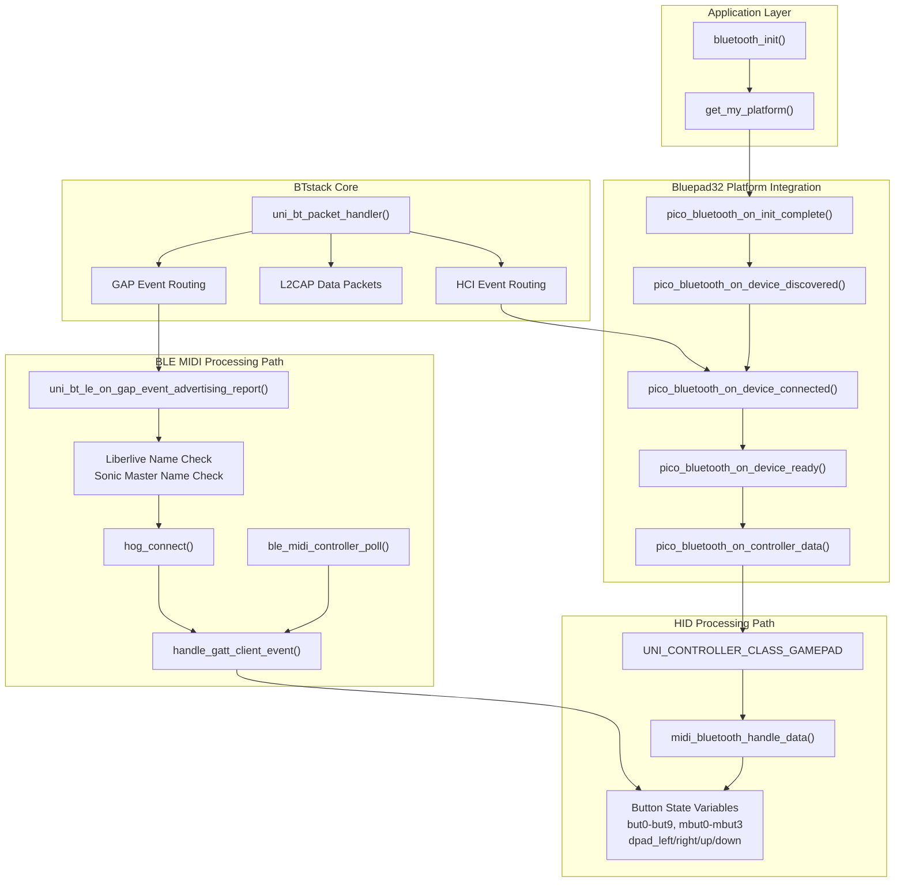
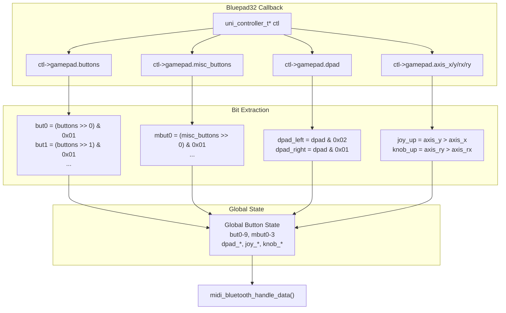
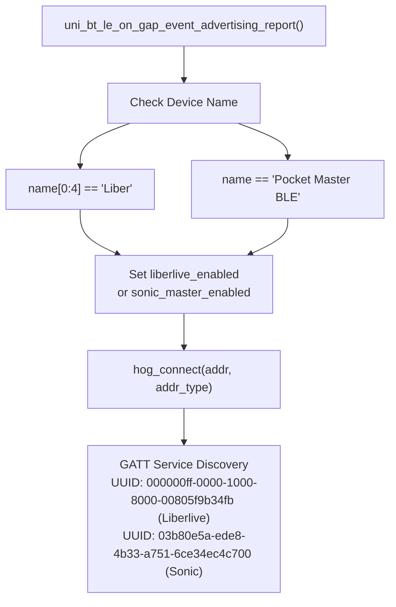
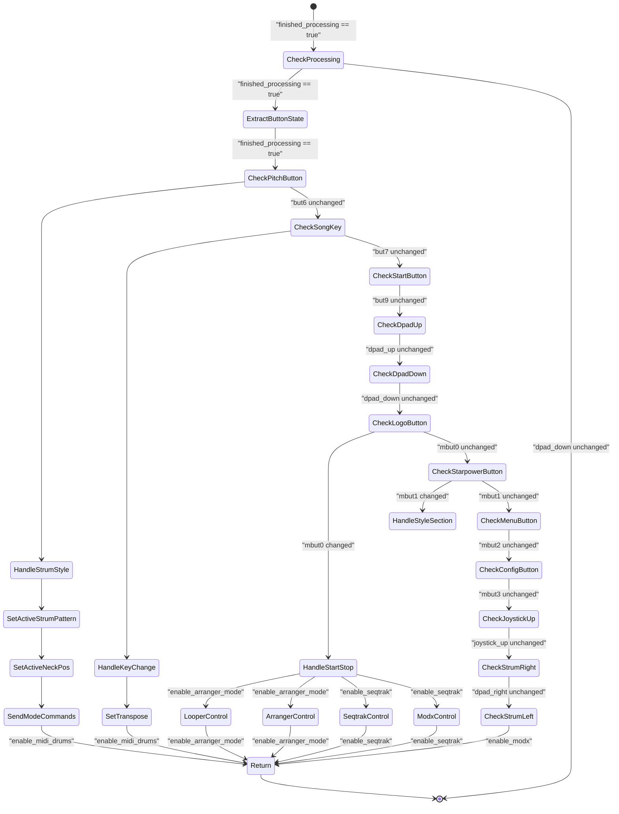
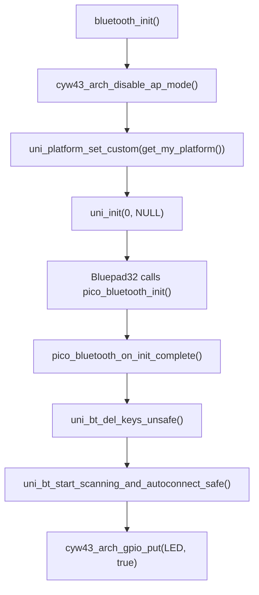

# Bluetooth Input System

> **Relevant source files**
> * [ble_midi_controller.c](https://github.com/Jus-Be/orinayo-pico/blob/6dde5a75/ble_midi_controller.c)
> * [ble_midi_controller.h](https://github.com/Jus-Be/orinayo-pico/blob/6dde5a75/ble_midi_controller.h)
> * [bluepad32/bt/uni_bt.c](https://github.com/Jus-Be/orinayo-pico/blob/6dde5a75/bluepad32/bt/uni_bt.c)
> * [bluepad32/bt/uni_bt_le.c](https://github.com/Jus-Be/orinayo-pico/blob/6dde5a75/bluepad32/bt/uni_bt_le.c)
> * [bluepad32/bt/uni_bt_setup.c](https://github.com/Jus-Be/orinayo-pico/blob/6dde5a75/bluepad32/bt/uni_bt_setup.c)
> * [pico-w-ble-midi-lib/ble_midi_client.c](https://github.com/Jus-Be/orinayo-pico/blob/6dde5a75/pico-w-ble-midi-lib/ble_midi_client.c)
> * [pico-w-ble-midi-lib/ble_midi_client.h](https://github.com/Jus-Be/orinayo-pico/blob/6dde5a75/pico-w-ble-midi-lib/ble_midi_client.h)
> * [pico_bluetooth.c](https://github.com/Jus-Be/orinayo-pico/blob/6dde5a75/pico_bluetooth.c)

## Purpose and Scope

The Bluetooth Input System manages discovery, connection, pairing, and data reception from Bluetooth controllers. It supports two distinct input pathways: **generic HID controllers** (Guitar Hero controllers, standard gamepads) via the Bluepad32 library, and **specialized BLE MIDI devices** (Liberlive, Sonic Master) via custom GATT protocol handling. This system translates raw Bluetooth HID reports into internal button state representations that drive the musical processing pipeline.

For information about how button states are translated into MIDI commands, see [HID to MIDI Translation](./4.2-hid-to-midi-translation.md). For details on the musical chord generation logic, see [Chord Generation System](./4.3-chord-generation-system.md). For MIDI output configuration, see [MIDI Output System](./6-midi-output-system.md).

---

## System Architecture

The Bluetooth subsystem operates in two parallel paths depending on the device type. The architecture provides device lifecycle management (discovery, connection, disconnection) and protocol-specific data parsing.

### Bluetooth Stack Components


```mermaid
flowchart TD

BT_INIT["bluetooth_init()"]
PLATFORM["get_my_platform()"]
ON_INIT["pico_bluetooth_on_init_complete()"]
ON_DISC["pico_bluetooth_on_device_discovered()"]
ON_CONN["pico_bluetooth_on_device_connected()"]
ON_DATA["pico_bluetooth_on_controller_data()"]
ON_READY["pico_bluetooth_on_device_ready()"]
GAMEPAD["UNI_CONTROLLER_CLASS_GAMEPAD"]
HANDLE_DATA["midi_bluetooth_handle_data()"]
BUTTON_MAP["Button State Variables<br>but0-but9, mbut0-mbut3<br>dpad_left/right/up/down"]
BLE_ADV["uni_bt_le_on_gap_event_advertising_report()"]
GATT_EVENT["handle_gatt_client_event()"]
LL_CHECK["Liberlive Name Check<br>Sonic Master Name Check"]
HOG_CONNECT["hog_connect()"]
BLE_MIDI_CONTROLLER["ble_midi_controller_poll()"]
PACKET_HANDLER["uni_bt_packet_handler()"]
HCI_EVENTS["HCI Event Routing"]
L2CAP["L2CAP Data Packets"]
GAP_EVENTS["GAP Event Routing"]

PLATFORM --> ON_INIT
ON_DATA --> GAMEPAD
GATT_EVENT --> BUTTON_MAP
GAP_EVENTS --> BLE_ADV
HCI_EVENTS --> ON_CONN

subgraph subGraph4 ["BTstack Core"]
    PACKET_HANDLER
    HCI_EVENTS
    L2CAP
    GAP_EVENTS
    PACKET_HANDLER --> HCI_EVENTS
    PACKET_HANDLER --> L2CAP
    PACKET_HANDLER --> GAP_EVENTS
end

subgraph subGraph3 ["BLE MIDI Processing Path"]
    BLE_ADV
    GATT_EVENT
    LL_CHECK
    HOG_CONNECT
    BLE_MIDI_CONTROLLER
    BLE_ADV --> LL_CHECK
    LL_CHECK --> HOG_CONNECT
    HOG_CONNECT --> GATT_EVENT
    BLE_MIDI_CONTROLLER --> GATT_EVENT
end

subgraph subGraph2 ["HID Processing Path"]
    GAMEPAD
    HANDLE_DATA
    BUTTON_MAP
    GAMEPAD --> HANDLE_DATA
    HANDLE_DATA --> BUTTON_MAP
end

subgraph subGraph1 ["Bluepad32 Platform Integration"]
    ON_INIT
    ON_DISC
    ON_CONN
    ON_DATA
    ON_READY
    ON_INIT --> ON_DISC
    ON_DISC --> ON_CONN
    ON_CONN --> ON_READY
    ON_READY --> ON_DATA
end

subgraph subGraph0 ["Application Layer"]
    BT_INIT
    PLATFORM
    BT_INIT --> PLATFORM
end
```

Sources: [pico_bluetooth.c L199](https://github.com/Jus-Be/orinayo-pico/blob/6dde5a75/pico_bluetooth.c#L199-L199)

 [pico_bluetooth.c L201-L213](https://github.com/Jus-Be/orinayo-pico/blob/6dde5a75/pico_bluetooth.c#L201-L213)

 [bluepad32/bt/uni_bt.c L91](https://github.com/Jus-Be/orinayo-pico/blob/6dde5a75/bluepad32/bt/uni_bt.c#L91-L91)

 [bluepad32/bt/uni_bt.c L149-L184](https://github.com/Jus-Be/orinayo-pico/blob/6dde5a75/bluepad32/bt/uni_bt.c#L149-L184)

 [bluepad32/bt/uni_bt_le.c L1298-L1390](https://github.com/Jus-Be/orinayo-pico/blob/6dde5a75/bluepad32/bt/uni_bt_le.c#L1298-L1390)

 [ble_midi_controller.h L46-L56](https://github.com/Jus-Be/orinayo-pico/blob/6dde5a75/ble_midi_controller.h#L46-L56)

---

## Device Discovery and Connection

### Discovery Flow

The system continuously scans for Bluetooth devices when enabled. Discovery happens through two mechanisms: BR/EDR inquiry (for classic Bluetooth) and BLE advertising reports (for Bluetooth Low Energy).

```mermaid
sequenceDiagram
  participant Application
  participant pico_bluetooth_on_init_complete()
  participant BTstack Scanner
  participant pico_bluetooth_on_device_discovered()
  participant uni_bt_le_on_gap_event_advertising_report()
  participant ble_midi_client_scan_begin()
  participant Connection Handler

  Application->>pico_bluetooth_on_init_complete(): System Startup
  pico_bluetooth_on_init_complete()->>pico_bluetooth_on_init_complete(): uni_bt_del_keys_unsafe()
  pico_bluetooth_on_init_complete()->>pico_bluetooth_on_init_complete(): uni_bt_start_scanning_and_autoconnect_safe()
  pico_bluetooth_on_init_complete()->>BTstack Scanner: Start BT/BLE Scanning (Bluepad32)
  Application->>ble_midi_client_scan_begin(): ble_midi_controller_scan_begin()
  ble_midi_client_scan_begin()->>BTstack Scanner: Start BLE MIDI Scanning (ble_midi_client)
  loop [Generic HID Controller]
    BTstack Scanner->>pico_bluetooth_on_device_discovered(): GAP_EVENT with device info
    pico_bluetooth_on_device_discovered()->>pico_bluetooth_on_device_discovered(): Check name for "STANDARD GAMEPAD"
    pico_bluetooth_on_device_discovered()->>pico_bluetooth_on_device_discovered(): Filter keyboards (UNI_BT_COD_MINOR_KEYBOARD)
    pico_bluetooth_on_device_discovered()-->>Connection Handler: Return UNI_ERROR_SUCCESS
    Connection Handler->>Connection Handler: pico_bluetooth_on_device_connected()
    Connection Handler->>BTstack Scanner: uni_bt_stop_scanning_safe()
    BTstack Scanner->>uni_bt_le_on_gap_event_advertising_report(): GAP_EVENT_ADVERTISING_REPORT
    uni_bt_le_on_gap_event_advertising_report()->>uni_bt_le_on_gap_event_advertising_report(): Check name == "Liber"
    uni_bt_le_on_gap_event_advertising_report()->>uni_bt_le_on_gap_event_advertising_report(): Check name == "Pocket Master BLE"
    uni_bt_le_on_gap_event_advertising_report()->>uni_bt_le_on_gap_event_advertising_report(): Set liberlive_enabled or sonic_master_enabled
    uni_bt_le_on_gap_event_advertising_report()->>Connection Handler: hog_connect(addr, addr_type)
    Connection Handler->>Connection Handler: GATT Service Discovery
    BTstack Scanner->>ble_midi_client_scan_begin(): GAP_EVENT_ADVERTISING_REPORT (via ble_midi_client)
    ble_midi_client_scan_begin()->>ble_midi_client_scan_begin(): Add to internal list of MIDI peripherals
    ble_midi_client_scan_begin()->>Connection Handler: ble_midi_client_request_connect(idx)
    Connection Handler->>Connection Handler: GATT Service Discovery
  end
```

Sources: [pico_bluetooth.c L205-L218](https://github.com/Jus-Be/orinayo-pico/blob/6dde5a75/pico_bluetooth.c#L205-L218)

 [pico_bluetooth.c L220-L243](https://github.com/Jus-Be/orinayo-pico/blob/6dde5a75/pico_bluetooth.c#L220-L243)

 [pico_bluetooth.c L245-L252](https://github.com/Jus-Be/orinayo-pico/blob/6dde5a75/pico_bluetooth.c#L245-L252)

 [bluepad32/bt/uni_bt_le.c L1298-L1390](https://github.com/Jus-Be/orinayo-pico/blob/6dde5a75/bluepad32/bt/uni_bt_le.c#L1298-L1390)

 [ble_midi_controller.h L38-L43](https://github.com/Jus-Be/orinayo-pico/blob/6dde5a75/ble_midi_controller.h#L38-L43)

 [ble_midi_controller.h L46-L56](https://github.com/Jus-Be/orinayo-pico/blob/6dde5a75/ble_midi_controller.h#L46-L56)

 [ble_midi_client.h L118-L125](https://github.com/Jus-Be/orinayo-pico/blob/6dde5a75/ble_midi_client.h#L118-L125)

 [ble_midi_client.h L139-L141](https://github.com/Jus-Be/orinayo-pico/blob/6dde5a75/ble_midi_client.h#L139-L141)

### Connection Lifecycle

Device connections follow a state machine with security/pairing phases for BLE devices and a simpler flow for BR/EDR HID devices.

| State | HID Controller Path | Specialized BLE MIDI Path | Generic BLE MIDI Path |
| --- | --- | --- | --- |
| **Discovery** | `pico_bluetooth_on_device_discovered()` filters by name/CoD | `uni_bt_le_on_gap_event_advertising_report()` matches device name | `ble_midi_client_scan_begin()` finds devices |
| **Connection** | `pico_bluetooth_on_device_connected()` sets `gamepad_guitar_connected = true` | `hog_connect()` initiates GATT connection | `ble_midi_client_request_connect()` initiates GATT connection |
| **Security** | N/A (no pairing required) | `uni_sm_packet_handler()` handles `SM_EVENT_PAIRING_COMPLETE` | `ble_midi_client.c` handles `SM_EVENT_PAIRING_COMPLETE` [pico-w-ble-midi-lib/ble_midi_client.c L121-L122](https://github.com/Jus-Be/orinayo-pico/blob/6dde5a75/pico-w-ble-midi-lib/ble_midi_client.c#L121-L122) |
| **Service Query** | Bluepad32 handles internally | `handle_gatt_client_event()` discovers services by UUID128 | `handle_gatt_client_event()` discovers services by UUID128 [pico-w-ble-midi-lib/ble_midi_client.c L131-L171](https://github.com/Jus-Be/orinayo-pico/blob/6dde5a75/pico-w-ble-midi-lib/ble_midi_client.c#L131-L171) |
| **Ready** | `pico_bluetooth_on_device_ready()` returns `UNI_ERROR_SUCCESS` | GATT notification listener registered | `ble_midi_client_is_connected()` returns true [pico-w-ble-midi-lib/ble_midi_client.h L185-L188](https://github.com/Jus-Be/orinayo-pico/blob/6dde5a75/pico-w-ble-midi-lib/ble_midi_client.h#L185-L188) |
| **Data Flow** | `pico_bluetooth_on_controller_data()` receives `uni_controller_t` | `handle_gatt_client_event()` receives `GATT_EVENT_NOTIFICATION` | `ble_midi_controller_poll()` drains `ble_midi_client_stream_read()` [ble_midi_controller.h L46-L56](https://github.com/Jus-Be/orinayo-pico/blob/6dde5a75/ble_midi_controller.h#L46-L56) |
| **Disconnection** | `pico_bluetooth_on_device_disconnected()` sets flag false, resumes scan | `uni_bt_le_on_hci_disconnection_complete()` clears enabled flags | `ble_midi_client_request_disconnect()` [pico-w-ble-midi-lib/ble_midi_client.h L144-L147](https://github.com/Jus-Be/orinayo-pico/blob/6dde5a75/pico-w-ble-midi-lib/ble_midi_client.h#L144-L147) |

Sources: [pico_bluetooth.c L245-L263](https://github.com/Jus-Be/orinayo-pico/blob/6dde5a75/pico_bluetooth.c#L245-L263)

 [pico_bluetooth.c L265-L269](https://github.com/Jus-Be/orinayo-pico/blob/6dde5a75/pico_bluetooth.c#L265-L269)

 [bluepad32/bt/uni_bt_le.c L632-L768](https://github.com/Jus-Be/orinayo-pico/blob/6dde5a75/bluepad32/bt/uni_bt_le.c#L632-L768)

 [bluepad32/bt/uni_bt_le.c L1219-L1256](https://github.com/Jus-Be/orinayo-pico/blob/6dde5a75/bluepad32/bt/uni_bt_le.c#L1219-L1256)

 [bluepad32/bt/uni_bt_le.c L1392-L1400](https://github.com/Jus-Be/orinayo-pico/blob/6dde5a75/bluepad32/bt/uni_bt_le.c#L1392-L1400)

 [pico-w-ble-midi-lib/ble_midi_client.c L121-L122](https://github.com/Jus-Be/orinayo-pico/blob/6dde5a75/pico-w-ble-midi-lib/ble_midi_client.c#L121-L122)

 [pico-w-ble-midi-lib/ble_midi_client.c L131-L171](https://github.com/Jus-Be/orinayo-pico/blob/6dde5a75/pico-w-ble-midi-lib/ble_midi_client.c#L131-L171)

 [pico-w-ble-midi-lib/ble_midi_client.h L144-L147](https://github.com/Jus-Be/orinayo-pico/blob/6dde5a75/pico-w-ble-midi-lib/ble_midi_client.h#L144-L147)

 [pico-w-ble-midi-lib/ble_midi_client.h L185-L188](https://github.com/Jus-Be/orinayo-pico/blob/6dde5a75/pico-w-ble-midi-lib/ble_midi_client.h#L185-L188)

 [ble_midi_controller.h L46-L56](https://github.com/Jus-Be/orinayo-pico/blob/6dde5a75/ble_midi_controller.h#L46-L56)

---

## HID Controller Input Mapping

### Button State Variables

Generic HID controllers (Guitar Hero, gamepads) send button/axis data through the Bluepad32 library as `uni_controller_t` structures. The `pico_bluetooth_on_controller_data()` function extracts bit fields and joystick axes into individual state variables.

**Primary Buttons** (Fret Buttons on Guitar Hero controllers):

* `but0` [pico_bluetooth.c L70](https://github.com/Jus-Be/orinayo-pico/blob/6dde5a75/pico_bluetooth.c#L70-L70)  → Red fret
* `but1` [pico_bluetooth.c L71](https://github.com/Jus-Be/orinayo-pico/blob/6dde5a75/pico_bluetooth.c#L71-L71)  → Green fret
* `but2` [pico_bluetooth.c L72](https://github.com/Jus-Be/orinayo-pico/blob/6dde5a75/pico_bluetooth.c#L72-L72)  → Yellow fret
* `but3` [pico_bluetooth.c L73](https://github.com/Jus-Be/orinayo-pico/blob/6dde5a75/pico_bluetooth.c#L73-L73)  → Blue fret
* `but4` [pico_bluetooth.c L74](https://github.com/Jus-Be/orinayo-pico/blob/6dde5a75/pico_bluetooth.c#L74-L74)  → Orange fret
* `but6` [pico_bluetooth.c L76](https://github.com/Jus-Be/orinayo-pico/blob/6dde5a75/pico_bluetooth.c#L76-L76)  → Pitch/Select button (strumming style selector)
* `but7` [pico_bluetooth.c L77](https://github.com/Jus-Be/orinayo-pico/blob/6dde5a75/pico_bluetooth.c#L77-L77)  → Song key selector
* `but9` [pico_bluetooth.c L79](https://github.com/Jus-Be/orinayo-pico/blob/6dde5a75/pico_bluetooth.c#L79-L79)  → Start button

**Miscellaneous Buttons** (Menu/Config buttons):

* `mbut0` [pico_bluetooth.c L81](https://github.com/Jus-Be/orinayo-pico/blob/6dde5a75/pico_bluetooth.c#L81-L81)  → Logo button (start/stop playback)
* `mbut1` [pico_bluetooth.c L82](https://github.com/Jus-Be/orinayo-pico/blob/6dde5a75/pico_bluetooth.c#L82-L82)  → Star Power (style section selector)
* `mbut2` [pico_bluetooth.c L83](https://github.com/Jus-Be/orinayo-pico/blob/6dde5a75/pico_bluetooth.c#L83-L83)  → Menu button (registration/group selector)
* `mbut3` [pico_bluetooth.c L84](https://github.com/Jus-Be/orinayo-pico/blob/6dde5a75/pico_bluetooth.c#L84-L84)  → Config button (mode configuration)

**D-Pad** (Strum bar mapping):

* `dpad_left` [pico_bluetooth.c L86](https://github.com/Jus-Be/orinayo-pico/blob/6dde5a75/pico_bluetooth.c#L86-L86)  → Strum down
* `dpad_right` [pico_bluetooth.c L87](https://github.com/Jus-Be/orinayo-pico/blob/6dde5a75/pico_bluetooth.c#L87-L87)  → Strum up
* `dpad_up` [pico_bluetooth.c L88](https://github.com/Jus-Be/orinayo-pico/blob/6dde5a75/pico_bluetooth.c#L88-L88)  → Transpose down
* `dpad_down` [pico_bluetooth.c L89](https://github.com/Jus-Be/orinayo-pico/blob/6dde5a75/pico_bluetooth.c#L89-L89)  → Transpose up

Sources: [pico_bluetooth.c L70-L89](https://github.com/Jus-Be/orinayo-pico/blob/6dde5a75/pico_bluetooth.c#L70-L89)

 [pico_bluetooth.c L279-L306](https://github.com/Jus-Be/orinayo-pico/blob/6dde5a75/pico_bluetooth.c#L279-L306)

### Data Extraction Process


```mermaid
flowchart TD

CTL_DATA["uni_controller_t* ctl"]
BUTTONS["ctl->gamepad.buttons"]
MISC["ctl->gamepad.misc_buttons"]
DPAD["ctl->gamepad.dpad"]
AXES["ctl->gamepad.axis_x/y/rx/ry"]
BUT_EXTRACT["but0 = (buttons >> 0) & 0x01<br>but1 = (buttons >> 1) & 0x01<br>..."]
MBUT_EXTRACT["mbut0 = (misc_buttons >> 0) & 0x01<br>..."]
DPAD_EXTRACT["dpad_left = dpad & 0x02<br>dpad_right = dpad & 0x01"]
AXIS_CALC["joy_up = axis_y > axis_x<br>knob_up = axis_ry > axis_rx"]
STATE_VARS["Global Button State<br>but0-9, mbut0-3<br>dpad_*, joy_*, knob_*"]
HANDLE["midi_bluetooth_handle_data()"]

BUTTONS --> BUT_EXTRACT
MISC --> MBUT_EXTRACT
DPAD --> DPAD_EXTRACT
AXES --> AXIS_CALC
BUT_EXTRACT --> STATE_VARS
MBUT_EXTRACT --> STATE_VARS
DPAD_EXTRACT --> STATE_VARS
AXIS_CALC --> STATE_VARS
STATE_VARS --> HANDLE

subgraph subGraph2 ["Global State"]
    STATE_VARS
end

subgraph subGraph1 ["Bit Extraction"]
    BUT_EXTRACT
    MBUT_EXTRACT
    DPAD_EXTRACT
    AXIS_CALC
end

subgraph subGraph0 ["Bluepad32 Callback"]
    CTL_DATA
    BUTTONS
    MISC
    DPAD
    AXES
    CTL_DATA --> BUTTONS
    CTL_DATA --> MISC
    CTL_DATA --> DPAD
    CTL_DATA --> AXES
end
```

Sources: [pico_bluetooth.c L279-L306](https://github.com/Jus-Be/orinayo-pico/blob/6dde5a75/pico_bluetooth.c#L279-L306)

 [pico_bluetooth.c L327-L346](https://github.com/Jus-Be/orinayo-pico/blob/6dde5a75/pico_bluetooth.c#L327-L346)

---

## BLE MIDI Device Input Processing

### Liberlive and Sonic Master Protocol

BLE MIDI devices use custom GATT characteristics to send button/paddle data. The system detects devices by name during advertising and establishes GATT notification listeners.

**Device Detection**:


```mermaid
flowchart TD

ADV_REPORT["uni_bt_le_on_gap_event_advertising_report()"]
NAME_CHECK["Check Device Name"]
LIBER["name[0:4] == 'Liber'"]
SONIC["name == 'Pocket Master BLE'"]
SET_FLAG["Set liberlive_enabled<br>or sonic_master_enabled"]
HOG["hog_connect(addr, addr_type)"]
GATT_DISC["GATT Service Discovery<br>UUID: 000000ff-0000-1000-8000-00805f9b34fb (Liberlive)<br>UUID: 03b80e5a-ede8-4b33-a751-6ce34ec4c700 (Sonic)"]

ADV_REPORT --> NAME_CHECK
NAME_CHECK --> LIBER
NAME_CHECK --> SONIC
LIBER --> SET_FLAG
SONIC --> SET_FLAG
SET_FLAG --> HOG
HOG --> GATT_DISC
```

Sources: [bluepad32/bt/uni_bt_le.c L1298-L1390](https://github.com/Jus-Be/orinayo-pico/blob/6dde5a75/bluepad32/bt/uni_bt_le.c#L1298-L1390)

 [bluepad32/bt/uni_bt_le.c L1219-L1256](https://github.com/Jus-Be/orinayo-pico/blob/6dde5a75/bluepad32/bt/uni_bt_le.c#L1219-L1256)

### GATT Event Processing

GATT notifications arrive in `handle_gatt_client_event()` with multi-byte event data encoding paddle positions, button states, tempo, and key changes.

**Event Data Structure** (Liberlive example):

* `event_data[1]` → Key index (0=C, 1=D, 2=E, 3=F, 4=G, 5=A, 6=B)
* `event_data[4]` → Button bit field
* `event_data[5]` → Paddle state (0=neutral, 12=Paddle A, 3=Paddle B, 15=Both)
* `event_data[7]` → Tempo (BPM)
* `event_data[9]`, `event_data[10]` → Paddle position (velocity)

The system translates these patterns into the same `but0-4` variables used by HID controllers, allowing unified processing by `midi_bluetooth_handle_data()`.

Sources: [bluepad32/bt/uni_bt_le.c L771-L1203](https://github.com/Jus-Be/orinayo-pico/blob/6dde5a75/bluepad32/bt/uni_bt_le.c#L771-L1203)

 [bluepad32/bt/uni_bt_le.c L882-L1121](https://github.com/Jus-Be/orinayo-pico/blob/6dde5a75/bluepad32/bt/uni_bt_le.c#L882-L1121)

### Paddle Velocity and Direction

Paddle movements generate strum events with velocity based on position:

```
Paddle UP (event_data[9/10] < 48):
    applied_velocity = (50 - position) / 50
    → triggers dpad_right (strum up)

Paddle DOWN (event_data[9/10] > 58):
    applied_velocity = position / 50
    → triggers dpad_left (strum down)
```

The `ll_cannot_fire` and `ll_have_fired` flags implement edge detection to ensure one strum per paddle motion. When the paddle returns to neutral (`event_data[5] == 0`), the system sends a note-off event.

Sources: [bluepad32/bt/uni_bt_le.c L913-L923](https://github.com/Jus-Be/orinayo-pico/blob/6dde5a75/bluepad32/bt/uni_bt_le.c#L913-L923)

 [bluepad32/bt/uni_bt_le.c L1140-L1193](https://github.com/Jus-Be/orinayo-pico/blob/6dde5a75/bluepad32/bt/uni_bt_le.c#L1140-L1193)

---

## State Machine and Event Processing

### Main Processing Loop

The `midi_bluetooth_handle_data()` function implements a large state machine that processes button state changes in priority order. It uses a flag-based early-return mechanism where each button handler sets `finished_processing = true` and returns after handling.


```mermaid
stateDiagram-v2
    [*] --> CheckProcessing : "finished_processing == true"
    CheckProcessing --> ExtractButtonState : "finished_processing == true"
    CheckProcessing --> [*] : "dpad_down unchanged"
    ExtractButtonState --> CheckPitchButton : "finished_processing == true"
    CheckPitchButton --> HandleStrumStyle
    CheckPitchButton --> CheckSongKey : "but6 unchanged"
    HandleStrumStyle --> SetActiveStrumPattern
    SetActiveStrumPattern --> SetActiveNeckPos
    SetActiveNeckPos --> SendModeCommands
    SendModeCommands --> Return : "enable_midi_drums"
    CheckSongKey --> HandleKeyChange
    CheckSongKey --> CheckStartButton : "but7 unchanged"
    HandleKeyChange --> SetTranspose
    SetTranspose --> Return : "enable_midi_drums"
    CheckStartButton --> CheckDpadUp : "but9 unchanged"
    CheckDpadUp --> CheckDpadDown : "dpad_up unchanged"
    CheckDpadDown --> CheckLogoButton : "dpad_down unchanged"
    CheckLogoButton --> HandleStartStop : "mbut0 changed"
    CheckLogoButton --> CheckStarpowerButton : "mbut0 unchanged"
    HandleStartStop --> LooperControl : "enable_arranger_mode"
    HandleStartStop --> ArrangerControl : "enable_arranger_mode"
    HandleStartStop --> SeqtrakControl : "enable_seqtrak"
    HandleStartStop --> ModxControl : "enable_seqtrak"
    LooperControl --> Return : "enable_arranger_mode"
    ArrangerControl --> Return : "enable_arranger_mode"
    SeqtrakControl --> Return : "enable_seqtrak"
    ModxControl --> Return : "enable_seqtrak"
    CheckStarpowerButton --> HandleStyleSection : "mbut1 changed"
    CheckStarpowerButton --> CheckMenuButton : "mbut1 unchanged"
    CheckMenuButton --> CheckConfigButton : "mbut2 unchanged"
    CheckConfigButton --> CheckJoystickUp : "mbut3 unchanged"
    CheckJoystickUp --> CheckStrumRight : "joystick_up unchanged"
    CheckStrumRight --> CheckStrumLeft : "dpad_right unchanged"
    CheckStrumLeft --> Return : "enable_modx"
    Return --> [*]
```

Sources: [pico_bluetooth.c L327-L1274](https://github.com/Jus-Be/orinayo-pico/blob/6dde5a75/pico_bluetooth.c#L327-L1274)

### Button Priority Order

The state machine processes buttons in this strict order:

1. **Pitch button** (`but6`) - Strum pattern and neck position selection [pico_bluetooth.c L372-L542](https://github.com/Jus-Be/orinayo-pico/blob/6dde5a75/pico_bluetooth.c#L372-L542)
2. **Song key button** (`but7`) - Direct key changes [pico_bluetooth.c L546-L560](https://github.com/Jus-Be/orinayo-pico/blob/6dde5a75/pico_bluetooth.c#L546-L560)
3. **Start button** (`but9`) - Unused in current implementation [pico_bluetooth.c L564-L568](https://github.com/Jus-Be/orinayo-pico/blob/6dde5a75/pico_bluetooth.c#L564-L568)
4. **D-pad up/down** - Transpose controls [pico_bluetooth.c L570-L596](https://github.com/Jus-Be/orinayo-pico/blob/6dde5a75/pico_bluetooth.c#L570-L596)
5. **Logo button** (`mbut0`) - Start/stop playback [pico_bluetooth.c L601-L739](https://github.com/Jus-Be/orinayo-pico/blob/6dde5a75/pico_bluetooth.c#L601-L739)
6. **Star power button** (`mbut1`) - Style section selection [pico_bluetooth.c L741-L839](https://github.com/Jus-Be/orinayo-pico/blob/6dde5a75/pico_bluetooth.c#L741-L839)
7. **Menu button** (`mbut2`) - Registration/group selection [pico_bluetooth.c L841-L975](https://github.com/Jus-Be/orinayo-pico/blob/6dde5a75/pico_bluetooth.c#L841-L975)
8. **Config button** (`mbut3`) - Mode configuration [pico_bluetooth.c L977-L998](https://github.com/Jus-Be/orinayo-pico/blob/6dde5a75/pico_bluetooth.c#L977-L998)
9. **Joystick up/down** - Tempo/fill controls [pico_bluetooth.c L1000-L1099](https://github.com/Jus-Be/orinayo-pico/blob/6dde5a75/pico_bluetooth.c#L1000-L1099)
10. **Knob up/down** - Recording/break controls [pico_bluetooth.c L1101-L1219](https://github.com/Jus-Be/orinayo-pico/blob/6dde5a75/pico_bluetooth.c#L1101-L1219)
11. **Strum right/left** - Chord playback [pico_bluetooth.c L1221-L1271](https://github.com/Jus-Be/orinayo-pico/blob/6dde5a75/pico_bluetooth.c#L1221-L1271)

Sources: [pico_bluetooth.c L327-L1274](https://github.com/Jus-Be/orinayo-pico/blob/6dde5a75/pico_bluetooth.c#L327-L1274)

---

## Mode Configuration System

### Operational Modes

The system supports five mutually-exclusive operational modes controlled by boolean flags.

| Mode Flag | Mode Name | Target Device | Configuration Function |
| --- | --- | --- | --- |
| `enable_arranger_mode` | Arranger Mode | Yamaha/Ketron arrangers | `config_guitar(1)` [pico_bluetooth.c L201](https://github.com/Jus-Be/orinayo-pico/blob/6dde5a75/pico_bluetooth.c#L201-L201) |
| `enable_ample_guitar` | Ample Guitar VST | Ample Guitar plugin | `config_guitar(2)` [pico_bluetooth.c L201](https://github.com/Jus-Be/orinayo-pico/blob/6dde5a75/pico_bluetooth.c#L201-L201) |
| `enable_midi_drums` | MIDI Drums Looper | Drum sequencer | `config_guitar(3)` [pico_bluetooth.c L201](https://github.com/Jus-Be/orinayo-pico/blob/6dde5a75/pico_bluetooth.c#L201-L201) |
| `enable_seqtrak` | SeqTrak Mode | Yamaha SeqTrak | `config_guitar(4)` [pico_bluetooth.c L201](https://github.com/Jus-Be/orinayo-pico/blob/6dde5a75/pico_bluetooth.c#L201-L201) |
| `enable_modx` | MODX Mode | Yamaha MODX | `config_guitar(5)` [pico_bluetooth.c L201](https://github.com/Jus-Be/orinayo-pico/blob/6dde5a75/pico_bluetooth.c#L201-L201) |

Sources: [pico_bluetooth.c L977-L998](https://github.com/Jus-Be/orinayo-pico/blob/6dde5a75/pico_bluetooth.c#L977-L998)

 [pico_bluetooth.c L1309-L1399](https://github.com/Jus-Be/orinayo-pico/blob/6dde5a75/pico_bluetooth.c#L1309-L1399)

 [pico_bluetooth.c L201](https://github.com/Jus-Be/orinayo-pico/blob/6dde5a75/pico_bluetooth.c#L201-L201)

---

## Performance Parameters

### Neck Position and Octave Control

The `active_neck_pos` [pico_bluetooth.c L123](https://github.com/Jus-Be/orinayo-pico/blob/6dde5a75/pico_bluetooth.c#L123-L123)

 variable (1=Low, 2=Normal, 3=High) controls the octave range for chord voicings. It's set by pressing **Pitch button** + **fret combination**.

Sources: [pico_bluetooth.c L123](https://github.com/Jus-Be/orinayo-pico/blob/6dde5a75/pico_bluetooth.c#L123-L123)

 [pico_bluetooth.c L411-L459](https://github.com/Jus-Be/orinayo-pico/blob/6dde5a75/pico_bluetooth.c#L411-L459)

### Strum Patterns

The `active_strum_pattern` [pico_bluetooth.c L122](https://github.com/Jus-Be/orinayo-pico/blob/6dde5a75/pico_bluetooth.c#L122-L122)

 variable (-1 to 4) selects how strumming triggers notes. The pattern index selects from the `strum_pattern` [pico_bluetooth.c L246](https://github.com/Jus-Be/orinayo-pico/blob/6dde5a75/pico_bluetooth.c#L246-L246)

 array.

Sources: [pico_bluetooth.c L122](https://github.com/Jus-Be/orinayo-pico/blob/6dde5a75/pico_bluetooth.c#L122-L122)

 [pico_bluetooth.c L246](https://github.com/Jus-Be/orinayo-pico/blob/6dde5a75/pico_bluetooth.c#L246-L246)

 [pico_bluetooth.c L468-L525](https://github.com/Jus-Be/orinayo-pico/blob/6dde5a75/pico_bluetooth.c#L468-L525)

---

## Initialization and Lifecycle

### Startup Sequence


```mermaid
flowchart TD

START["bluetooth_init()"]
DISABLE_AP["cyw43_arch_disable_ap_mode()"]
SET_PLATFORM["uni_platform_set_custom(get_my_platform())"]
UNI_INIT["uni_init(0, NULL)"]
BP32_INIT["Bluepad32 calls pico_bluetooth_init()"]
ON_COMPLETE["pico_bluetooth_on_init_complete()"]
DEL_KEYS["uni_bt_del_keys_unsafe()"]
START_SCAN["uni_bt_start_scanning_and_autoconnect_safe()"]
LED_ON["cyw43_arch_gpio_put(LED, true)"]

START --> DISABLE_AP
DISABLE_AP --> SET_PLATFORM
SET_PLATFORM --> UNI_INIT
UNI_INIT --> BP32_INIT
BP32_INIT --> ON_COMPLETE
ON_COMPLETE --> DEL_KEYS
DEL_KEYS --> START_SCAN
START_SCAN --> LED_ON
```

Sources: [pico_bluetooth.c L1874-L1888](https://github.com/Jus-Be/orinayo-pico/blob/6dde5a75/pico_bluetooth.c#L1874-L1888)

 [pico_bluetooth.c L200-L218](https://github.com/Jus-Be/orinayo-pico/blob/6dde5a75/pico_bluetooth.c#L200-L218)

---

## Security and Pairing

### BLE Security Events

The `uni_sm_packet_handler()` function processes Security Manager events for BLE devices. If re-encryption fails with `ERROR_CODE_PIN_OR_KEY_MISSING`, the system deletes local bonding and requests new pairing. The `ble_midi_client.c` also registers a Security Manager event handler [pico-w-ble-midi-lib/ble_midi_client.c L42](https://github.com/Jus-Be/orinayo-pico/blob/6dde5a75/pico-w-ble-midi-lib/ble_midi_client.c#L42-L42)

 to manage pairing and encryption for BLE MIDI devices.

Sources: [bluepad32/bt/uni_bt_le.c L632-L768](https://github.com/Jus-Be/orinayo-pico/blob/6dde5a75/bluepad32/bt/uni_bt_le.c#L632-L768)

 [bluepad32/bt/uni_bt_le.c L1447-L1490](https://github.com/Jus-Be/orinayo-pico/blob/6dde5a75/bluepad32/bt/uni_bt_le.c#L1447-L1490)

 [pico-w-ble-midi-lib/ble_midi_client.c L42](https://github.com/Jus-Be/orinayo-pico/blob/6dde5a75/pico-w-ble-midi-lib/ble_midi_client.c#L42-L42)

---

## Thread Safety and Timing

### Async Context Isolation

Button state extraction happens in the CYW43 async context, while `midi_bluetooth_handle_data()` processes state changes. The `finished_processing` [pico_bluetooth.c L65](https://github.com/Jus-Be/orinayo-pico/blob/6dde5a75/pico_bluetooth.c#L65-L65)

 flag prevents re-entrant processing.

Sources: [pico_bluetooth.c L65](https://github.com/Jus-Be/orinayo-pico/blob/6dde5a75/pico_bluetooth.c#L65-L65)

 [pico_bluetooth.c L328-L329](https://github.com/Jus-Be/orinayo-pico/blob/6dde5a75/pico_bluetooth.c#L328-L329)

 [pico_bluetooth.c L540-L541](https://github.com/Jus-Be/orinayo-pico/blob/6dde5a75/pico_bluetooth.c#L540-L541)