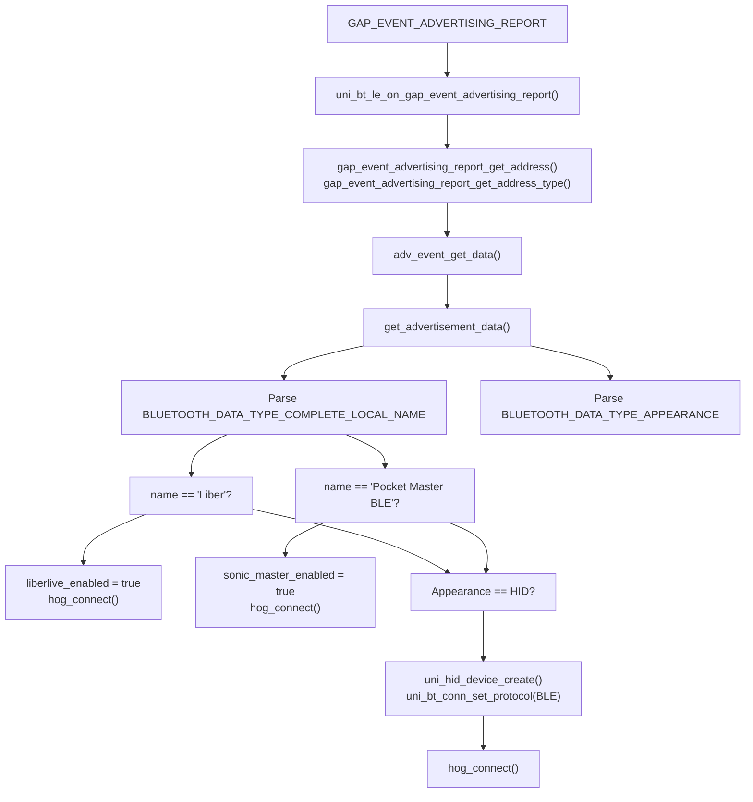
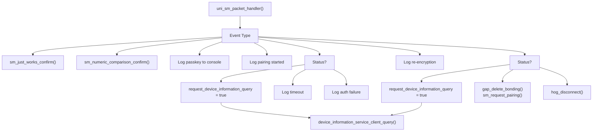
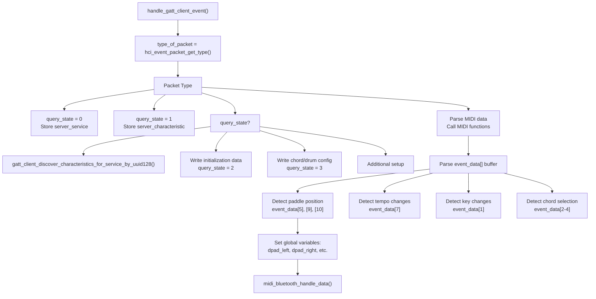
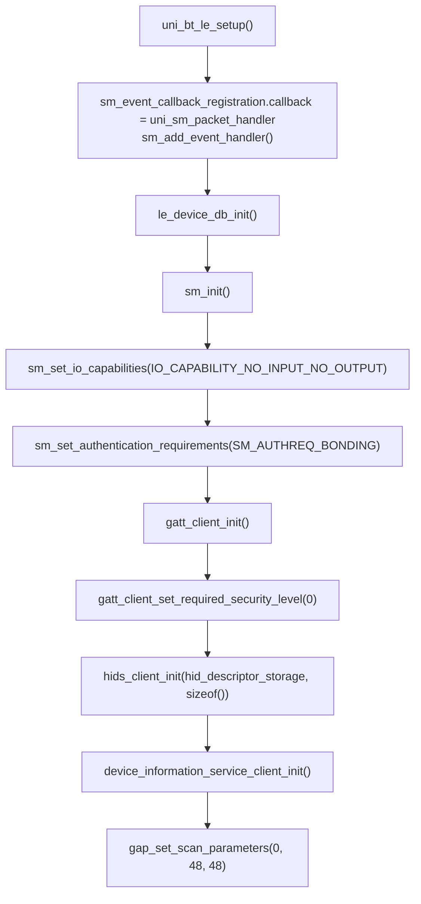

# BLE Device Management

> **Relevant source files**
> * [bluepad32/bt/uni_bt.c](https://github.com/Jus-Be/orinayo-pico/blob/122fa496/bluepad32/bt/uni_bt.c)
> * [bluepad32/bt/uni_bt_le.c](https://github.com/Jus-Be/orinayo-pico/blob/122fa496/bluepad32/bt/uni_bt_le.c)

## Purpose and Scope

This document describes the Bluetooth Low Energy (BLE) device management subsystem, covering device scanning, discovery, connection establishment, pairing, security, and connection lifecycle management. The system is implemented primarily in [bluepad32/bt/uni_bt_le.c](https://github.com/Jus-Be/orinayo-pico/blob/122fa496/bluepad32/bt/uni_bt_le.c)

 and handles both generic HID over GATT (HoG) devices and specialized BLE MIDI devices (Liberlive and Sonic Master).

For information about HID-to-MIDI translation after devices are connected, see [HID to MIDI Translation](./4.2-hid-to-midi-translation.md). For specialized MIDI device protocols, see [Specialized MIDI Devices](./4.5-specialized-midi-devices.md).

---

## Connection Lifecycle Overview

The BLE connection lifecycle follows a specific sequence of states and events, coordinated by multiple packet handlers.

### Connection State Machine

```css
#mermaid-bozap7dx7kg{font-family:ui-sans-serif,-apple-system,system-ui,Segoe UI,Helvetica;font-size:16px;fill:#333;}@keyframes edge-animation-frame{from{stroke-dashoffset:0;}}@keyframes dash{to{stroke-dashoffset:0;}}#mermaid-bozap7dx7kg .edge-animation-slow{stroke-dasharray:9,5!important;stroke-dashoffset:900;animation:dash 50s linear infinite;stroke-linecap:round;}#mermaid-bozap7dx7kg .edge-animation-fast{stroke-dasharray:9,5!important;stroke-dashoffset:900;animation:dash 20s linear infinite;stroke-linecap:round;}#mermaid-bozap7dx7kg .error-icon{fill:#dddddd;}#mermaid-bozap7dx7kg .error-text{fill:#222222;stroke:#222222;}#mermaid-bozap7dx7kg .edge-thickness-normal{stroke-width:1px;}#mermaid-bozap7dx7kg .edge-thickness-thick{stroke-width:3.5px;}#mermaid-bozap7dx7kg .edge-pattern-solid{stroke-dasharray:0;}#mermaid-bozap7dx7kg .edge-thickness-invisible{stroke-width:0;fill:none;}#mermaid-bozap7dx7kg .edge-pattern-dashed{stroke-dasharray:3;}#mermaid-bozap7dx7kg .edge-pattern-dotted{stroke-dasharray:2;}#mermaid-bozap7dx7kg .marker{fill:#999;stroke:#999;}#mermaid-bozap7dx7kg .marker.cross{stroke:#999;}#mermaid-bozap7dx7kg svg{font-family:ui-sans-serif,-apple-system,system-ui,Segoe UI,Helvetica;font-size:16px;}#mermaid-bozap7dx7kg p{margin:0;}#mermaid-bozap7dx7kg defs #statediagram-barbEnd{fill:#999;stroke:#999;}#mermaid-bozap7dx7kg g.stateGroup text{fill:#dddddd;stroke:none;font-size:10px;}#mermaid-bozap7dx7kg g.stateGroup text{fill:#333;stroke:none;font-size:10px;}#mermaid-bozap7dx7kg g.stateGroup .state-title{font-weight:bolder;fill:#333;}#mermaid-bozap7dx7kg g.stateGroup rect{fill:#ffffff;stroke:#dddddd;}#mermaid-bozap7dx7kg g.stateGroup line{stroke:#999;stroke-width:1;}#mermaid-bozap7dx7kg .transition{stroke:#999;stroke-width:1;fill:none;}#mermaid-bozap7dx7kg .stateGroup .composit{fill:#f4f4f4;border-bottom:1px;}#mermaid-bozap7dx7kg .stateGroup .alt-composit{fill:#e0e0e0;border-bottom:1px;}#mermaid-bozap7dx7kg .state-note{stroke:#e6d280;fill:#fff5ad;}#mermaid-bozap7dx7kg .state-note text{fill:#333;stroke:none;font-size:10px;}#mermaid-bozap7dx7kg .stateLabel .box{stroke:none;stroke-width:0;fill:#ffffff;opacity:0.5;}#mermaid-bozap7dx7kg .edgeLabel .label rect{fill:#ffffff;opacity:0.5;}#mermaid-bozap7dx7kg .edgeLabel{background-color:#ffffff;text-align:center;}#mermaid-bozap7dx7kg .edgeLabel p{background-color:#ffffff;}#mermaid-bozap7dx7kg .edgeLabel rect{opacity:0.5;background-color:#ffffff;fill:#ffffff;}#mermaid-bozap7dx7kg .edgeLabel .label text{fill:#333;}#mermaid-bozap7dx7kg .label div .edgeLabel{color:#333;}#mermaid-bozap7dx7kg .stateLabel text{fill:#333;font-size:10px;font-weight:bold;}#mermaid-bozap7dx7kg .node circle.state-start{fill:#999;stroke:#999;}#mermaid-bozap7dx7kg .node .fork-join{fill:#999;stroke:#999;}#mermaid-bozap7dx7kg .node circle.state-end{fill:#dddddd;stroke:#f4f4f4;stroke-width:1.5;}#mermaid-bozap7dx7kg .end-state-inner{fill:#f4f4f4;stroke-width:1.5;}#mermaid-bozap7dx7kg .node rect{fill:#ffffff;stroke:#dddddd;stroke-width:1px;}#mermaid-bozap7dx7kg .node polygon{fill:#ffffff;stroke:#dddddd;stroke-width:1px;}#mermaid-bozap7dx7kg #statediagram-barbEnd{fill:#999;}#mermaid-bozap7dx7kg .statediagram-cluster rect{fill:#ffffff;stroke:#dddddd;stroke-width:1px;}#mermaid-bozap7dx7kg .cluster-label,#mermaid-bozap7dx7kg .nodeLabel{color:#333;}#mermaid-bozap7dx7kg .statediagram-cluster rect.outer{rx:5px;ry:5px;}#mermaid-bozap7dx7kg .statediagram-state .divider{stroke:#dddddd;}#mermaid-bozap7dx7kg .statediagram-state .title-state{rx:5px;ry:5px;}#mermaid-bozap7dx7kg .statediagram-cluster.statediagram-cluster .inner{fill:#f4f4f4;}#mermaid-bozap7dx7kg .statediagram-cluster.statediagram-cluster-alt .inner{fill:#f8f8f8;}#mermaid-bozap7dx7kg .statediagram-cluster .inner{rx:0;ry:0;}#mermaid-bozap7dx7kg .statediagram-state rect.basic{rx:5px;ry:5px;}#mermaid-bozap7dx7kg .statediagram-state rect.divider{stroke-dasharray:10,10;fill:#f8f8f8;}#mermaid-bozap7dx7kg .note-edge{stroke-dasharray:5;}#mermaid-bozap7dx7kg .statediagram-note rect{fill:#fff5ad;stroke:#e6d280;stroke-width:1px;rx:0;ry:0;}#mermaid-bozap7dx7kg .statediagram-note rect{fill:#fff5ad;stroke:#e6d280;stroke-width:1px;rx:0;ry:0;}#mermaid-bozap7dx7kg .statediagram-note text{fill:#333;}#mermaid-bozap7dx7kg .statediagram-note .nodeLabel{color:#333;}#mermaid-bozap7dx7kg .statediagram .edgeLabel{color:red;}#mermaid-bozap7dx7kg #dependencyStart,#mermaid-bozap7dx7kg #dependencyEnd{fill:#999;stroke:#999;stroke-width:1;}#mermaid-bozap7dx7kg .statediagramTitleText{text-anchor:middle;font-size:18px;fill:#333;}#mermaid-bozap7dx7kg :root{--mermaid-font-family:"trebuchet ms",verdana,arial,sans-serif;}uni_bt_le_scan_start()GAP_EVENT_ADVERTISING_REPORThog_connect()HCI_SUBEVENT_LE_CONNECTION_COMPLETEsm_request_pairing()SM_EVENT_REENCRYPTION_STARTEDSM_EVENT_PAIRING_COMPLETESM_EVENT_REENCRYPTION_COMPLETEdevice_information_service_client_query()GATTSERVICE_SUBEVENT_DEVICE_INFORMATION_DONEGATTSERVICE_SUBEVENT_HID_SERVICE_CONNECTEDHCI_EVENT_DISCONNECTION_COMPLETEScanningDeviceFoundConnectingConnectedPairingReencryptionPairingCompleteReencryptCompleteDeviceInfoHIDSConnectReadyis_scanning = truegap_start_scan()uni_hid_device_set_ready()resume_scanning_hint()
```

**Sources:** [bluepad32/bt/uni_bt_le.c L44-L54](https://github.com/Jus-Be/orinayo-pico/blob/122fa496/bluepad32/bt/uni_bt_le.c#L44-L54)

 [bluepad32/bt/uni_bt_le.c L1209-L1266](https://github.com/Jus-Be/orinayo-pico/blob/122fa496/bluepad32/bt/uni_bt_le.c#L1209-L1266)

 [bluepad32/bt/uni_bt_le.c L632-L768](https://github.com/Jus-Be/orinayo-pico/blob/122fa496/bluepad32/bt/uni_bt_le.c#L632-L768)

---

## Device Scanning and Discovery

### Scan Control

The system manages scanning state through several functions and global flags:

| Function | Purpose | File Location |
| --- | --- | --- |
| `uni_bt_le_scan_start()` | Initiates BLE scanning | [bluepad32/bt/uni_bt_le.c L1498-L1505](https://github.com/Jus-Be/orinayo-pico/blob/122fa496/bluepad32/bt/uni_bt_le.c#L1498-L1505) |
| `uni_bt_le_scan_stop()` | Stops BLE scanning | [bluepad32/bt/uni_bt_le.c L1507-L1514](https://github.com/Jus-Be/orinayo-pico/blob/122fa496/bluepad32/bt/uni_bt_le.c#L1507-L1514) |
| `gap_start_scan()` | Low-level BTstack scan start | Called from uni_bt_le_scan_start() |
| `gap_stop_scan()` | Low-level BTstack scan stop | Called in hog_connect() and scan_stop() |

**Global State Variables:**

* `is_scanning` - Tracks whether scanning is active [bluepad32/bt/uni_bt_le.c L81](https://github.com/Jus-Be/orinayo-pico/blob/122fa496/bluepad32/bt/uni_bt_le.c#L81-L81)
* `ble_enabled` - Master enable flag for BLE functionality [bluepad32/bt/uni_bt_le.c L82](https://github.com/Jus-Be/orinayo-pico/blob/122fa496/bluepad32/bt/uni_bt_le.c#L82-L82)

**Scan Parameters:**

The scan is configured with passive scanning parameters in `uni_bt_le_setup()`:

```
gap_set_scan_parameters(0 /* type: passive */, 48 /* interval */, 48 /* window */)
```

[bluepad32/bt/uni_bt_le.c L1495](https://github.com/Jus-Be/orinayo-pico/blob/122fa496/bluepad32/bt/uni_bt_le.c#L1495-L1495)

**Sources:** [bluepad32/bt/uni_bt_le.c L1498-L1514](https://github.com/Jus-Be/orinayo-pico/blob/122fa496/bluepad32/bt/uni_bt_le.c#L1498-L1514)

 [bluepad32/bt/uni_bt_le.c L81-L84](https://github.com/Jus-Be/orinayo-pico/blob/122fa496/bluepad32/bt/uni_bt_le.c#L81-L84)

 [bluepad32/bt/uni_bt_le.c L1447-L1496](https://github.com/Jus-Be/orinayo-pico/blob/122fa496/bluepad32/bt/uni_bt_le.c#L1447-L1496)

### Advertisement Processing



**Key Data Structures:**

The advertisement parsing extracts:

* **Device Name**: From `BLUETOOTH_DATA_TYPE_COMPLETE_LOCAL_NAME` or `BLUETOOTH_DATA_TYPE_SHORTENED_LOCAL_NAME`
* **Appearance**: 16-bit value indicating device type (gamepad, joystick, mouse, keyboard)
* **Address and Type**: `bd_addr_t` and `bd_addr_type_t` for connection

**Device Type Detection:**

| Device Name Pattern | Action | Global Flag |
| --- | --- | --- |
| "Liber" (first 5 chars) | Liberlive MIDI device | `liberlive_enabled = true` |
| "Pocket Master BLE" (exact match) | Sonic Master MIDI device | `sonic_master_enabled = true` |
| Other with HID appearance | Generic HoG device | Standard connection path |

**Sources:** [bluepad32/bt/uni_bt_le.c L1298-L1390](https://github.com/Jus-Be/orinayo-pico/blob/122fa496/bluepad32/bt/uni_bt_le.c#L1298-L1390)

 [bluepad32/bt/uni_bt_le.c L212-L296](https://github.com/Jus-Be/orinayo-pico/blob/122fa496/bluepad32/bt/uni_bt_le.c#L212-L296)

 [bluepad32/bt/uni_bt_le.c L287-L296](https://github.com/Jus-Be/orinayo-pico/blob/122fa496/bluepad32/bt/uni_bt_le.c#L287-L296)

 [bluepad32/bt/uni_bt_le.c L78-L79](https://github.com/Jus-Be/orinayo-pico/blob/122fa496/bluepad32/bt/uni_bt_le.c#L78-L79)

---

## Connection Establishment

### Connection Initiation

```mermaid
sequenceDiagram
  participant Scanning Loop
  participant uni_bt_le_on_gap_event_advertising_report()
  participant hog_connect()
  participant GAP Layer
  participant uni_bt_le_on_hci_event_le_meta()
  participant Device State

  Scanning Loop->>uni_bt_le_on_gap_event_advertising_report(): GAP_EVENT_ADVERTISING_REPORT
  uni_bt_le_on_gap_event_advertising_report()->>uni_bt_le_on_gap_event_advertising_report(): Parse advertisement data
  uni_bt_le_on_gap_event_advertising_report()->>hog_connect(): hog_connect(addr, addr_type)
  hog_connect()->>GAP Layer: gap_stop_scan()
  note over hog_connect(): Stop scanning during connection
  hog_connect()->>GAP Layer: gap_connect(addr, addr_type)
  GAP Layer-->>uni_bt_le_on_hci_event_le_meta(): HCI_SUBEVENT_LE_CONNECTION_COMPLETE
  uni_bt_le_on_hci_event_le_meta()->>uni_bt_le_on_hci_event_le_meta(): connection_handle = get_connection_handle()
  loop [Liberlive Device]
    uni_bt_le_on_hci_event_le_meta()->>Device State: gatt_client_discover_primary_services_by_uuid128()
    uni_bt_le_on_hci_event_le_meta()->>Device State: gatt_client_listen_for_characteristic_value_updates()
    uni_bt_le_on_hci_event_le_meta()->>Device State: gatt_client_discover_primary_services_by_uuid128()
    uni_bt_le_on_hci_event_le_meta()->>Device State: uni_hid_device_set_connection_handle()
    uni_bt_le_on_hci_event_le_meta()->>Device State: sm_request_pairing()
  end
```

**Connection Handle Management:**

The connection handle is stored globally and per-device:

* **Global**: `connection_handle` variable [bluepad32/bt/uni_bt_le.c L168](https://github.com/Jus-Be/orinayo-pico/blob/122fa496/bluepad32/bt/uni_bt_le.c#L168-L168)
* **Per-Device**: `device->conn.handle` in `uni_hid_device_t` structure

**Scan Resume Logic:**

The `resume_scanning_hint()` function conditionally restarts scanning after connection events:

```
static void resume_scanning_hint(void) {
    // Resume scanning, only if it was scanning before connecting
    if (is_scanning) {
        gap_start_scan();
        logi("BLE scan -> 1\n");
    }
}
```

This is called from:

* `hog_disconnect()` after disconnection [bluepad32/bt/uni_bt_le.c L209](https://github.com/Jus-Be/orinayo-pico/blob/122fa496/bluepad32/bt/uni_bt_le.c#L209-L209)
* `uni_hids_client_packet_handler()` after successful HID service connection [bluepad32/bt/uni_bt_le.c L388](https://github.com/Jus-Be/orinayo-pico/blob/122fa496/bluepad32/bt/uni_bt_le.c#L388-L388)

**Sources:** [bluepad32/bt/uni_bt_le.c L174-L182](https://github.com/Jus-Be/orinayo-pico/blob/122fa496/bluepad32/bt/uni_bt_le.c#L174-L182)

 [bluepad32/bt/uni_bt_le.c L184-L190](https://github.com/Jus-Be/orinayo-pico/blob/122fa496/bluepad32/bt/uni_bt_le.c#L184-L190)

 [bluepad32/bt/uni_bt_le.c L1209-L1266](https://github.com/Jus-Be/orinayo-pico/blob/122fa496/bluepad32/bt/uni_bt_le.c#L1209-L1266)

---

## Security and Pairing

### Security Manager (SM) Event Handling

The Security Manager handles authentication, pairing, and encryption through `uni_sm_packet_handler()`.



**Authentication Configuration:**

The system is configured in `uni_bt_le_setup()` with the following settings:

| Setting | Value | Purpose |
| --- | --- | --- |
| IO Capabilities | `IO_CAPABILITY_NO_INPUT_NO_OUTPUT` | No display or keyboard |
| Authentication Requirements | `SM_AUTHREQ_BONDING` | Enable bonding for persistent pairing |
| Security Level | `0` (via `gatt_client_set_required_security_level`) | No encryption required for GATT |

[bluepad32/bt/uni_bt_le.c L1456-L1489](https://github.com/Jus-Be/orinayo-pico/blob/122fa496/bluepad32/bt/uni_bt_le.c#L1456-L1489)

**Pairing Event Sequence:**

1. **New Device Pairing:** * `SM_EVENT_PAIRING_STARTED` → Begin pairing process * `SM_EVENT_JUST_WORKS_REQUEST` or `SM_EVENT_NUMERIC_COMPARISON_REQUEST` → Auto-confirm * `SM_EVENT_IDENTITY_CREATED` → Generate identity for bonding * `SM_EVENT_PAIRING_COMPLETE` → Pairing finished
2. **Bonded Device Reconnection:** * `SM_EVENT_IDENTITY_RESOLVING_STARTED` → Resolve identity from bonded keys * `SM_EVENT_IDENTITY_RESOLVING_SUCCEEDED` → Identity matched * `SM_EVENT_REENCRYPTION_STARTED` → Begin re-encryption with stored keys * `SM_EVENT_REENCRYPTION_COMPLETE` → Ready to communicate

**Bond Management Functions:**

| Function | Purpose | Location |
| --- | --- | --- |
| `uni_bt_le_list_bonded_keys()` | List all stored BLE bonding information | [bluepad32/bt/uni_bt_le.c L1402-L1422](https://github.com/Jus-Be/orinayo-pico/blob/122fa496/bluepad32/bt/uni_bt_le.c#L1402-L1422) |
| `uni_bt_le_delete_bonded_keys()` | Delete all stored BLE bonds | [bluepad32/bt/uni_bt_le.c L1424-L1445](https://github.com/Jus-Be/orinayo-pico/blob/122fa496/bluepad32/bt/uni_bt_le.c#L1424-L1445) |
| `gap_delete_bonding()` | Delete specific device bond | Called from SM handler |

**Sources:** [bluepad32/bt/uni_bt_le.c L632-L768](https://github.com/Jus-Be/orinayo-pico/blob/122fa496/bluepad32/bt/uni_bt_le.c#L632-L768)

 [bluepad32/bt/uni_bt_le.c L1447-L1496](https://github.com/Jus-Be/orinayo-pico/blob/122fa496/bluepad32/bt/uni_bt_le.c#L1447-L1496)

 [bluepad32/bt/uni_bt_le.c L1402-L1445](https://github.com/Jus-Be/orinayo-pico/blob/122fa496/bluepad32/bt/uni_bt_le.c#L1402-L1445)

---

## Service Discovery

After successful pairing or re-encryption, the system queries GATT services in a specific order.

### Service Discovery Flow

```mermaid
sequenceDiagram
  participant uni_sm_packet_handler()
  participant uni_device_information_packet_handler()
  participant uni_hids_client_packet_handler()
  participant uni_hid_device_t

  uni_sm_packet_handler()->>uni_sm_packet_handler(): SM_EVENT_PAIRING_COMPLETE or
  uni_sm_packet_handler()->>uni_device_information_packet_handler(): SM_EVENT_REENCRYPTION_COMPLETE
  note over uni_device_information_packet_handler(): Query Device Information Service
  uni_device_information_packet_handler()->>uni_device_information_packet_handler(): device_information_service_client_query()
  uni_device_information_packet_handler()->>uni_device_information_packet_handler(): Receive PnP ID, manufacturer, model, etc.
  uni_device_information_packet_handler()->>uni_hid_device_t: GATTSERVICE_SUBEVENT_DEVICE_INFORMATION_PNP_ID
  uni_device_information_packet_handler()->>uni_hid_device_t: uni_hid_device_set_vendor_id()
  uni_device_information_packet_handler()->>uni_device_information_packet_handler(): uni_hid_device_set_product_id()
  uni_device_information_packet_handler()->>uni_hids_client_packet_handler(): GATTSERVICE_SUBEVENT_DEVICE_INFORMATION_DONE
  note over uni_hids_client_packet_handler(): Query HID Service
  uni_hids_client_packet_handler()->>uni_hids_client_packet_handler(): hids_client_connect()
  uni_hids_client_packet_handler()->>uni_hid_device_t: GATTSERVICE_SUBEVENT_HID_SERVICE_CONNECTED
  uni_hids_client_packet_handler()->>uni_hid_device_t: uni_hid_device_guess_controller_type_from_pid_vid()
  uni_hids_client_packet_handler()->>uni_hid_device_t: uni_hid_device_connect()
  uni_hids_client_packet_handler()->>uni_sm_packet_handler(): uni_hid_device_set_ready()
```

**Device Information Service:**

The `uni_device_information_packet_handler()` processes these GATT subevents:

| Subevent | Data Extracted | Storage |
| --- | --- | --- |
| `GATTSERVICE_SUBEVENT_DEVICE_INFORMATION_MANUFACTURER_NAME` | Manufacturer string | Logged only |
| `GATTSERVICE_SUBEVENT_DEVICE_INFORMATION_MODEL_NUMBER` | Model string | Logged only |
| `GATTSERVICE_SUBEVENT_DEVICE_INFORMATION_SERIAL_NUMBER` | Serial string | Logged only |
| `GATTSERVICE_SUBEVENT_DEVICE_INFORMATION_PNP_ID` | Vendor ID, Product ID, Version | `device->vendor_id`, `device->product_id` |
| `GATTSERVICE_SUBEVENT_DEVICE_INFORMATION_DONE` | Query complete | Triggers HIDS connection |

[bluepad32/bt/uni_bt_le.c L436-L624](https://github.com/Jus-Be/orinayo-pico/blob/122fa496/bluepad32/bt/uni_bt_le.c#L436-L624)

**HID Service Connection:**

The `uni_hids_client_packet_handler()` manages the HID over GATT service:

| Subevent | Action | Location |
| --- | --- | --- |
| `GATTSERVICE_SUBEVENT_HID_SERVICE_CONNECTED` | Store `hids_cid`, connect device, set ready | [bluepad32/bt/uni_bt_le.c L360-L394](https://github.com/Jus-Be/orinayo-pico/blob/122fa496/bluepad32/bt/uni_bt_le.c#L360-L394) |
| `GATTSERVICE_SUBEVENT_HID_REPORT` | Parse and process HID report | [bluepad32/bt/uni_bt_le.c L396-L399](https://github.com/Jus-Be/orinayo-pico/blob/122fa496/bluepad32/bt/uni_bt_le.c#L396-L399) |
| `GATTSERVICE_SUBEVENT_HID_INFORMATION` | Log HID version, country code | [bluepad32/bt/uni_bt_le.c L400-L409](https://github.com/Jus-Be/orinayo-pico/blob/122fa496/bluepad32/bt/uni_bt_le.c#L400-L409) |
| `GATTSERVICE_SUBEVENT_HID_PROTOCOL_MODE` | Log boot/report mode | [bluepad32/bt/uni_bt_le.c L411-L416](https://github.com/Jus-Be/orinayo-pico/blob/122fa496/bluepad32/bt/uni_bt_le.c#L411-L416) |

**HID Descriptor Storage:**

HID descriptors are stored in a static buffer shared across devices:

```
static uint8_t hid_descriptor_storage[HID_MAX_DESCRIPTOR_LEN * CONFIG_BLUEPAD32_MAX_DEVICES];
```

[bluepad32/bt/uni_bt_le.c L162](https://github.com/Jus-Be/orinayo-pico/blob/122fa496/bluepad32/bt/uni_bt_le.c#L162-L162)

The descriptor is retrieved and copied when the first report arrives: [bluepad32/bt/uni_bt_le.c L321-L326](https://github.com/Jus-Be/orinayo-pico/blob/122fa496/bluepad32/bt/uni_bt_le.c#L321-L326)

**Sources:** [bluepad32/bt/uni_bt_le.c L436-L624](https://github.com/Jus-Be/orinayo-pico/blob/122fa496/bluepad32/bt/uni_bt_le.c#L436-L624)

 [bluepad32/bt/uni_bt_le.c L334-L434](https://github.com/Jus-Be/orinayo-pico/blob/122fa496/bluepad32/bt/uni_bt_le.c#L334-L434)

 [bluepad32/bt/uni_bt_le.c L298-L332](https://github.com/Jus-Be/orinayo-pico/blob/122fa496/bluepad32/bt/uni_bt_le.c#L298-L332)

---

## Specialized MIDI Device Handling

Liberlive and Sonic Master devices use custom GATT services instead of standard HID over GATT.

### GATT State Machine for MIDI Devices

```css
#mermaid-yho19oaofdf{font-family:ui-sans-serif,-apple-system,system-ui,Segoe UI,Helvetica;font-size:16px;fill:#333;}@keyframes edge-animation-frame{from{stroke-dashoffset:0;}}@keyframes dash{to{stroke-dashoffset:0;}}#mermaid-yho19oaofdf .edge-animation-slow{stroke-dasharray:9,5!important;stroke-dashoffset:900;animation:dash 50s linear infinite;stroke-linecap:round;}#mermaid-yho19oaofdf .edge-animation-fast{stroke-dasharray:9,5!important;stroke-dashoffset:900;animation:dash 20s linear infinite;stroke-linecap:round;}#mermaid-yho19oaofdf .error-icon{fill:#dddddd;}#mermaid-yho19oaofdf .error-text{fill:#222222;stroke:#222222;}#mermaid-yho19oaofdf .edge-thickness-normal{stroke-width:1px;}#mermaid-yho19oaofdf .edge-thickness-thick{stroke-width:3.5px;}#mermaid-yho19oaofdf .edge-pattern-solid{stroke-dasharray:0;}#mermaid-yho19oaofdf .edge-thickness-invisible{stroke-width:0;fill:none;}#mermaid-yho19oaofdf .edge-pattern-dashed{stroke-dasharray:3;}#mermaid-yho19oaofdf .edge-pattern-dotted{stroke-dasharray:2;}#mermaid-yho19oaofdf .marker{fill:#999;stroke:#999;}#mermaid-yho19oaofdf .marker.cross{stroke:#999;}#mermaid-yho19oaofdf svg{font-family:ui-sans-serif,-apple-system,system-ui,Segoe UI,Helvetica;font-size:16px;}#mermaid-yho19oaofdf p{margin:0;}#mermaid-yho19oaofdf defs #statediagram-barbEnd{fill:#999;stroke:#999;}#mermaid-yho19oaofdf g.stateGroup text{fill:#dddddd;stroke:none;font-size:10px;}#mermaid-yho19oaofdf g.stateGroup text{fill:#333;stroke:none;font-size:10px;}#mermaid-yho19oaofdf g.stateGroup .state-title{font-weight:bolder;fill:#333;}#mermaid-yho19oaofdf g.stateGroup rect{fill:#ffffff;stroke:#dddddd;}#mermaid-yho19oaofdf g.stateGroup line{stroke:#999;stroke-width:1;}#mermaid-yho19oaofdf .transition{stroke:#999;stroke-width:1;fill:none;}#mermaid-yho19oaofdf .stateGroup .composit{fill:#f4f4f4;border-bottom:1px;}#mermaid-yho19oaofdf .stateGroup .alt-composit{fill:#e0e0e0;border-bottom:1px;}#mermaid-yho19oaofdf .state-note{stroke:#e6d280;fill:#fff5ad;}#mermaid-yho19oaofdf .state-note text{fill:#333;stroke:none;font-size:10px;}#mermaid-yho19oaofdf .stateLabel .box{stroke:none;stroke-width:0;fill:#ffffff;opacity:0.5;}#mermaid-yho19oaofdf .edgeLabel .label rect{fill:#ffffff;opacity:0.5;}#mermaid-yho19oaofdf .edgeLabel{background-color:#ffffff;text-align:center;}#mermaid-yho19oaofdf .edgeLabel p{background-color:#ffffff;}#mermaid-yho19oaofdf .edgeLabel rect{opacity:0.5;background-color:#ffffff;fill:#ffffff;}#mermaid-yho19oaofdf .edgeLabel .label text{fill:#333;}#mermaid-yho19oaofdf .label div .edgeLabel{color:#333;}#mermaid-yho19oaofdf .stateLabel text{fill:#333;font-size:10px;font-weight:bold;}#mermaid-yho19oaofdf .node circle.state-start{fill:#999;stroke:#999;}#mermaid-yho19oaofdf .node .fork-join{fill:#999;stroke:#999;}#mermaid-yho19oaofdf .node circle.state-end{fill:#dddddd;stroke:#f4f4f4;stroke-width:1.5;}#mermaid-yho19oaofdf .end-state-inner{fill:#f4f4f4;stroke-width:1.5;}#mermaid-yho19oaofdf .node rect{fill:#ffffff;stroke:#dddddd;stroke-width:1px;}#mermaid-yho19oaofdf .node polygon{fill:#ffffff;stroke:#dddddd;stroke-width:1px;}#mermaid-yho19oaofdf #statediagram-barbEnd{fill:#999;}#mermaid-yho19oaofdf .statediagram-cluster rect{fill:#ffffff;stroke:#dddddd;stroke-width:1px;}#mermaid-yho19oaofdf .cluster-label,#mermaid-yho19oaofdf .nodeLabel{color:#333;}#mermaid-yho19oaofdf .statediagram-cluster rect.outer{rx:5px;ry:5px;}#mermaid-yho19oaofdf .statediagram-state .divider{stroke:#dddddd;}#mermaid-yho19oaofdf .statediagram-state .title-state{rx:5px;ry:5px;}#mermaid-yho19oaofdf .statediagram-cluster.statediagram-cluster .inner{fill:#f4f4f4;}#mermaid-yho19oaofdf .statediagram-cluster.statediagram-cluster-alt .inner{fill:#f8f8f8;}#mermaid-yho19oaofdf .statediagram-cluster .inner{rx:0;ry:0;}#mermaid-yho19oaofdf .statediagram-state rect.basic{rx:5px;ry:5px;}#mermaid-yho19oaofdf .statediagram-state rect.divider{stroke-dasharray:10,10;fill:#f8f8f8;}#mermaid-yho19oaofdf .note-edge{stroke-dasharray:5;}#mermaid-yho19oaofdf .statediagram-note rect{fill:#fff5ad;stroke:#e6d280;stroke-width:1px;rx:0;ry:0;}#mermaid-yho19oaofdf .statediagram-note rect{fill:#fff5ad;stroke:#e6d280;stroke-width:1px;rx:0;ry:0;}#mermaid-yho19oaofdf .statediagram-note text{fill:#333;}#mermaid-yho19oaofdf .statediagram-note .nodeLabel{color:#333;}#mermaid-yho19oaofdf .statediagram .edgeLabel{color:red;}#mermaid-yho19oaofdf #dependencyStart,#mermaid-yho19oaofdf #dependencyEnd{fill:#999;stroke:#999;stroke-width:1;}#mermaid-yho19oaofdf .statediagramTitleText{text-anchor:middle;font-size:18px;fill:#333;}#mermaid-yho19oaofdf :root{--mermaid-font-family:"trebuchet ms",verdana,arial,sans-serif;}HCI_SUBEVENT_LE_CONNECTION_COMPLETEgatt_client_discover_primary_services_by_uuid128()GATT_EVENT_SERVICE_QUERY_RESULTquery_state = 0GATT_EVENT_CHARACTERISTIC_QUERY_RESULTquery_state = 1GATT_EVENT_QUERY_COMPLETEGATT_EVENT_QUERY_COMPLETEquery_state = 2GATT_EVENT_NOTIFICATIONHandle MIDI eventsConnectedServiceQueryCharQueryQueryCompleteWriteConfigNotifyReadyOperationalliberlive_enabled orsonic_master_enabled = trueLiberlive: Write chord mappingsSonic Master: Configure deviceParse event_data[]Extract chord/note infoCall midi functions
```

### UUID Definitions

**Liberlive UUIDs:**

| Service/Characteristic | UUID | Array Representation |
| --- | --- | --- |
| Service | `000000ff-0000-1000-8000-00805f9b34fb` | `{0x00, 0x00, 0x00, 0xff, ...}` |
| Characteristic | `000000ff-0300-1000-8000-00805f9b34fb` | `{0x00, 0x00, 0xff, 0x03, ...}` |

[bluepad32/bt/uni_bt_le.c L786](https://github.com/Jus-Be/orinayo-pico/blob/122fa496/bluepad32/bt/uni_bt_le.c#L786-L786)

 [bluepad32/bt/uni_bt_le.c L1226](https://github.com/Jus-Be/orinayo-pico/blob/122fa496/bluepad32/bt/uni_bt_le.c#L1226-L1226)

**Sonic Master UUIDs:**

| Service/Characteristic | UUID | Array Representation |
| --- | --- | --- |
| Service | `03b80e5a-ede8-4b33-a751-6ce34ec4c700` | `{0x03, 0xB8, 0x0E, 0x5A, ...}` |
| Characteristic | `7772e5db-3868-4112-a1a9-f2669d106bf3` | `{0x77, 0x72, 0xE5, 0xDB, ...}` |

[bluepad32/bt/uni_bt_le.c L787](https://github.com/Jus-Be/orinayo-pico/blob/122fa496/bluepad32/bt/uni_bt_le.c#L787-L787)

 [bluepad32/bt/uni_bt_le.c L1237](https://github.com/Jus-Be/orinayo-pico/blob/122fa496/bluepad32/bt/uni_bt_le.c#L1237-L1237)

### GATT Event Handler Structure

The `handle_gatt_client_event()` function processes GATT events for specialized MIDI devices using a state machine:



**GATT Client Structures:**

Three global structures maintain GATT state:

* `gatt_client_service_t server_service` - Discovered service [bluepad32/bt/uni_bt_le.c L167](https://github.com/Jus-Be/orinayo-pico/blob/122fa496/bluepad32/bt/uni_bt_le.c#L167-L167)
* `gatt_client_characteristic_t server_characteristic` - Discovered characteristic [bluepad32/bt/uni_bt_le.c L165](https://github.com/Jus-Be/orinayo-pico/blob/122fa496/bluepad32/bt/uni_bt_le.c#L165-L165)
* `gatt_client_notification_t notification_listener` - Notification handler [bluepad32/bt/uni_bt_le.c L166](https://github.com/Jus-Be/orinayo-pico/blob/122fa496/bluepad32/bt/uni_bt_le.c#L166-L166)

**Data Packet Structure:**

MIDI device notifications arrive in `event_data[]` buffer with this structure:

| Byte Index | Liberlive Usage | Purpose |
| --- | --- | --- |
| `[1]` | Key/Mode | Key signature (0-6 for C-B) or mode indicator |
| `[2-4]` | Chord Bits | Chord selection flags |
| `[5]` | Paddle State | 0=neutral, 3=B, 12=A, 15=A+B, 64=stop/config |
| `[7]` | Tempo | Current tempo value |
| `[9]` | Paddle A Position | Velocity/direction for paddle A |
| `[10]` | Paddle B Position | Velocity/direction for paddle B |

[bluepad32/bt/uni_bt_le.c L785-L1203](https://github.com/Jus-Be/orinayo-pico/blob/122fa496/bluepad32/bt/uni_bt_le.c#L785-L1203)

**Paddle Fire Logic:**

To prevent duplicate events, the system tracks paddle state with two flags:

```
static bool ll_cannot_fire;  // True when paddle is in neutral position
static bool ll_have_fired;   // True when event has been sent
```

Events are only sent when:

1. `!ll_have_fired` (haven't sent event yet)
2. Paddle moves from neutral (`ll_cannot_fire` set on neutral detection)

[bluepad32/bt/uni_bt_le.c L83-L84](https://github.com/Jus-Be/orinayo-pico/blob/122fa496/bluepad32/bt/uni_bt_le.c#L83-L84)

 [bluepad32/bt/uni_bt_le.c L913-L923](https://github.com/Jus-Be/orinayo-pico/blob/122fa496/bluepad32/bt/uni_bt_le.c#L913-L923)

**BLE MIDI Output:**

The `send_ble_midi()` function sends MIDI data back to the device:

```
void send_ble_midi(uint8_t* midi_data, int len) {
    gatt_client_write_value_of_characteristic_without_response(
        connection_handle, 
        server_characteristic.value_handle, 
        len, 
        midi_data
    );
}
```

[bluepad32/bt/uni_bt_le.c L1205-L1207](https://github.com/Jus-Be/orinayo-pico/blob/122fa496/bluepad32/bt/uni_bt_le.c#L1205-L1207)

**Sources:** [bluepad32/bt/uni_bt_le.c L770-L1203](https://github.com/Jus-Be/orinayo-pico/blob/122fa496/bluepad32/bt/uni_bt_le.c#L770-L1203)

 [bluepad32/bt/uni_bt_le.c L1219-L1266](https://github.com/Jus-Be/orinayo-pico/blob/122fa496/bluepad32/bt/uni_bt_le.c#L1219-L1266)

 [bluepad32/bt/uni_bt_le.c L78-L84](https://github.com/Jus-Be/orinayo-pico/blob/122fa496/bluepad32/bt/uni_bt_le.c#L78-L84)

---

## Connection Termination

### Disconnection Handling

```mermaid
sequenceDiagram
  participant Remote Device
  participant HCI Layer
  participant uni_bt_packet_handler()
  participant uni_bt_le_on_hci_disconnection_complete()
  participant uni_hid_device_t

  Remote Device->>HCI Layer: Disconnect
  HCI Layer->>uni_bt_packet_handler(): HCI_EVENT_DISCONNECTION_COMPLETE
  uni_bt_packet_handler()->>uni_bt_packet_handler(): uni_hid_device_get_instance_for_connection_handle()
  uni_bt_packet_handler()->>uni_hid_device_t: uni_hid_device_disconnect()
  uni_bt_packet_handler()->>uni_hid_device_t: uni_hid_device_delete()
  uni_bt_packet_handler()->>uni_bt_le_on_hci_disconnection_complete(): uni_bt_le_on_hci_disconnection_complete()
  uni_bt_le_on_hci_disconnection_complete()->>uni_bt_le_on_hci_disconnection_complete(): liberlive_enabled = false
  uni_bt_le_on_hci_disconnection_complete()->>uni_bt_le_on_hci_disconnection_complete(): sonic_master_enabled = false
  uni_bt_le_on_hci_disconnection_complete()->>uni_bt_le_on_hci_disconnection_complete(): resume_scanning_hint()
```

**Disconnection Event Processing:**

The main disconnection handler in `uni_bt.c` extracts information and routes to BLE-specific handler:

```
handle = hci_event_disconnection_complete_get_connection_handle(packet);
reason = hci_event_disconnection_complete_get_reason(packet);
status = hci_event_disconnection_complete_get_status(packet);
```

Common disconnection reasons:

* `ERROR_CODE_CONNECTION_TIMEOUT` (0x08) - Connection supervision timeout
* `ERROR_CODE_REMOTE_USER_TERMINATED_CONNECTION` (0x13) - Remote initiated disconnect
* `ERROR_CODE_CONNECTION_TERMINATED_BY_LOCAL_HOST` (0x16) - Local disconnect

[bluepad32/bt/uni_bt.c L149-L184](https://github.com/Jus-Be/orinayo-pico/blob/122fa496/bluepad32/bt/uni_bt.c#L149-L184)

**BLE-Specific Cleanup:**

`uni_bt_le_on_hci_disconnection_complete()` performs minimal cleanup:

1. Clears `liberlive_enabled` flag
2. Clears `sonic_master_enabled` flag
3. Calls `resume_scanning_hint()` to restart scanning

[bluepad32/bt/uni_bt_le.c L1392-L1400](https://github.com/Jus-Be/orinayo-pico/blob/122fa496/bluepad32/bt/uni_bt_le.c#L1392-L1400)

**Forced Disconnection:**

The `hog_disconnect()` function can force disconnection:

```
static void hog_disconnect(hci_con_handle_t con_handle) {
    // Get device and disconnect HIDS client
    device = uni_hid_device_get_instance_for_connection_handle(con_handle);
    if (device) {
        hids_client_disconnect(device->hids_cid);
    }
    
    // Disconnect GAP connection
    if (gap_get_connection_type(con_handle) != GAP_CONNECTION_INVALID)
        gap_disconnect(con_handle);
    
    // Resume scanning
    resume_scanning_hint();
}
```

[bluepad32/bt/uni_bt_le.c L192-L210](https://github.com/Jus-Be/orinayo-pico/blob/122fa496/bluepad32/bt/uni_bt_le.c#L192-L210)

**Public Disconnection API:**

External code can request disconnection via:

```
void uni_bt_le_disconnect(uni_hid_device_t* d) {
    hog_disconnect(d->conn.handle);
}
```

[bluepad32/bt/uni_bt_le.c L1516-L1520](https://github.com/Jus-Be/orinayo-pico/blob/122fa496/bluepad32/bt/uni_bt_le.c#L1516-L1520)

**Sources:** [bluepad32/bt/uni_bt_le.c L1392-L1400](https://github.com/Jus-Be/orinayo-pico/blob/122fa496/bluepad32/bt/uni_bt_le.c#L1392-L1400)

 [bluepad32/bt/uni_bt_le.c L192-L210](https://github.com/Jus-Be/orinayo-pico/blob/122fa496/bluepad32/bt/uni_bt_le.c#L192-L210)

 [bluepad32/bt/uni_bt.c L149-L184](https://github.com/Jus-Be/orinayo-pico/blob/122fa496/bluepad32/bt/uni_bt.c#L149-L184)

 [bluepad32/bt/uni_bt_le.c L1516-L1520](https://github.com/Jus-Be/orinayo-pico/blob/122fa496/bluepad32/bt/uni_bt_le.c#L1516-L1520)

---

## Configuration and Setup

### Initialization Sequence

The BLE subsystem is initialized through `uni_bt_le_setup()`:



**Configuration Constants:**

| Constant | Value | Purpose | Source |
| --- | --- | --- | --- |
| `HID_MAX_DESCRIPTOR_LEN` | Variable | Max HID descriptor size | BTstack header |
| `CONFIG_BLUEPAD32_MAX_DEVICES` | Variable | Max simultaneous BLE devices | sdkconfig.h |
| `UNI_BT_CONN_PROTOCOL_BLE` | Enum value | Protocol identifier for BLE | uni_bt_conn.h |

**Security Level Configuration:**

The call to `gatt_client_set_required_security_level(0)` disables encryption requirements for GATT. This is noted in the code comment as "BAO no encryption needed" [bluepad32/bt/uni_bt_le.c L1489](https://github.com/Jus-Be/orinayo-pico/blob/122fa496/bluepad32/bt/uni_bt_le.c#L1489-L1489)

**Sources:** [bluepad32/bt/uni_bt_le.c L1447-L1496](https://github.com/Jus-Be/orinayo-pico/blob/122fa496/bluepad32/bt/uni_bt_le.c#L1447-L1496)

 [bluepad32/bt/uni_bt_le.c L162](https://github.com/Jus-Be/orinayo-pico/blob/122fa496/bluepad32/bt/uni_bt_le.c#L162-L162)

### Enable/Disable Control

BLE can be enabled or disabled at runtime through property storage:

**Enable/Disable API:**

| Function | Purpose | Storage |
| --- | --- | --- |
| `uni_bt_le_set_enabled(bool enabled)` | Set BLE enabled state | Writes to `UNI_PROPERTY_IDX_BLE_ENABLED` property |
| `uni_bt_le_is_enabled()` | Query BLE enabled state | Reads from `UNI_PROPERTY_IDX_BLE_ENABLED` property |

[bluepad32/bt/uni_bt_le.c L1522-L1542](https://github.com/Jus-Be/orinayo-pico/blob/122fa496/bluepad32/bt/uni_bt_le.c#L1522-L1542)

**Global State:**

The `ble_enabled` static variable caches the property value:

```
static bool ble_enabled;
```

[bluepad32/bt/uni_bt_le.c L82](https://github.com/Jus-Be/orinayo-pico/blob/122fa496/bluepad32/bt/uni_bt_le.c#L82-L82)

This flag is checked by scanning functions before calling BTstack APIs:

```
void uni_bt_le_scan_start(void) {
    if (!ble_enabled)
        return;
    
    gap_start_scan();
    // ...
}
```

**Integration with General Bluetooth Control:**

The general Bluetooth module (`uni_bt.c`) coordinates BLE and BR/EDR scanning:

```
static void start_scan(void) {
    if (IS_ENABLED(UNI_ENABLE_BREDR))
        uni_bt_bredr_scan_start();
    if (IS_ENABLED(UNI_ENABLE_BLE))
        uni_bt_le_scan_start();  // Calls BLE scan start
}
```

[bluepad32/bt/uni_bt.c L118-L125](https://github.com/Jus-Be/orinayo-pico/blob/122fa496/bluepad32/bt/uni_bt.c#L118-L125)

**Sources:** [bluepad32/bt/uni_bt_le.c L1522-L1542](https://github.com/Jus-Be/orinayo-pico/blob/122fa496/bluepad32/bt/uni_bt_le.c#L1522-L1542)

 [bluepad32/bt/uni_bt_le.c L1498-L1514](https://github.com/Jus-Be/orinayo-pico/blob/122fa496/bluepad32/bt/uni_bt_le.c#L1498-L1514)

 [bluepad32/bt/uni_bt.c L118-L134](https://github.com/Jus-Be/orinayo-pico/blob/122fa496/bluepad32/bt/uni_bt.c#L118-L134)

---

## Summary Reference Table

### Key Functions by Category

| Category | Function | Purpose |
| --- | --- | --- |
| **Scanning** | `uni_bt_le_scan_start()` | Start BLE device scanning |
|  | `uni_bt_le_scan_stop()` | Stop BLE device scanning |
| **Connection** | `hog_connect()` | Initiate connection to discovered device |
|  | `uni_bt_le_on_hci_event_le_meta()` | Handle connection complete event |
|  | `hog_disconnect()` | Disconnect device |
| **Security** | `uni_sm_packet_handler()` | Handle pairing, re-encryption, bonding |
|  | `uni_bt_le_list_bonded_keys()` | List stored bond information |
|  | `uni_bt_le_delete_bonded_keys()` | Delete all stored bonds |
| **Discovery** | `uni_bt_le_on_gap_event_advertising_report()` | Process advertisement packets |
|  | `uni_device_information_packet_handler()` | Query device information service |
|  | `uni_hids_client_packet_handler()` | Connect to HID over GATT service |
| **MIDI Devices** | `handle_gatt_client_event()` | Handle Liberlive/Sonic Master GATT events |
|  | `send_ble_midi()` | Send MIDI data to BLE MIDI device |
| **Setup** | `uni_bt_le_setup()` | Initialize BLE subsystem |
|  | `uni_bt_le_set_enabled()` | Enable/disable BLE at runtime |

**Sources:** All sections above.