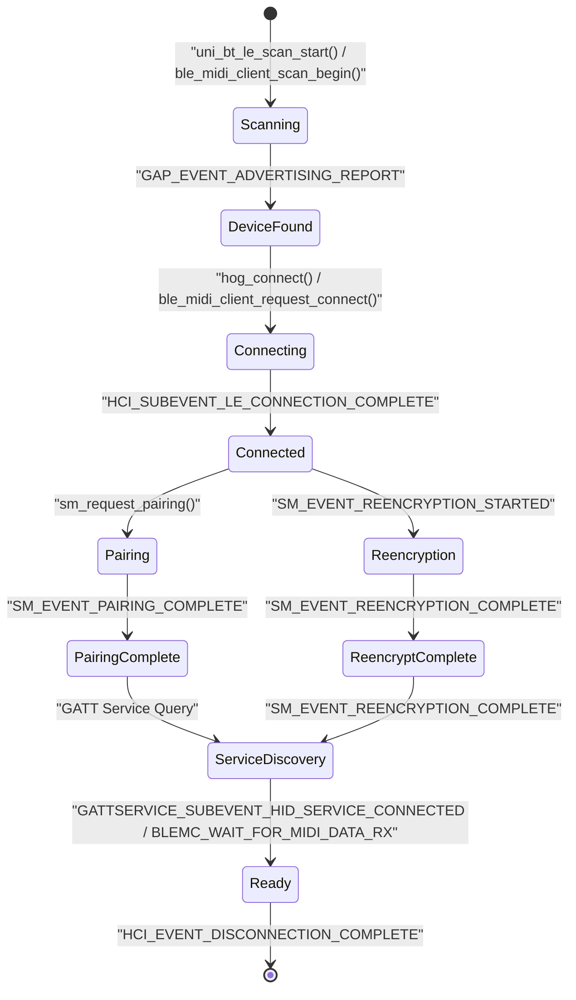
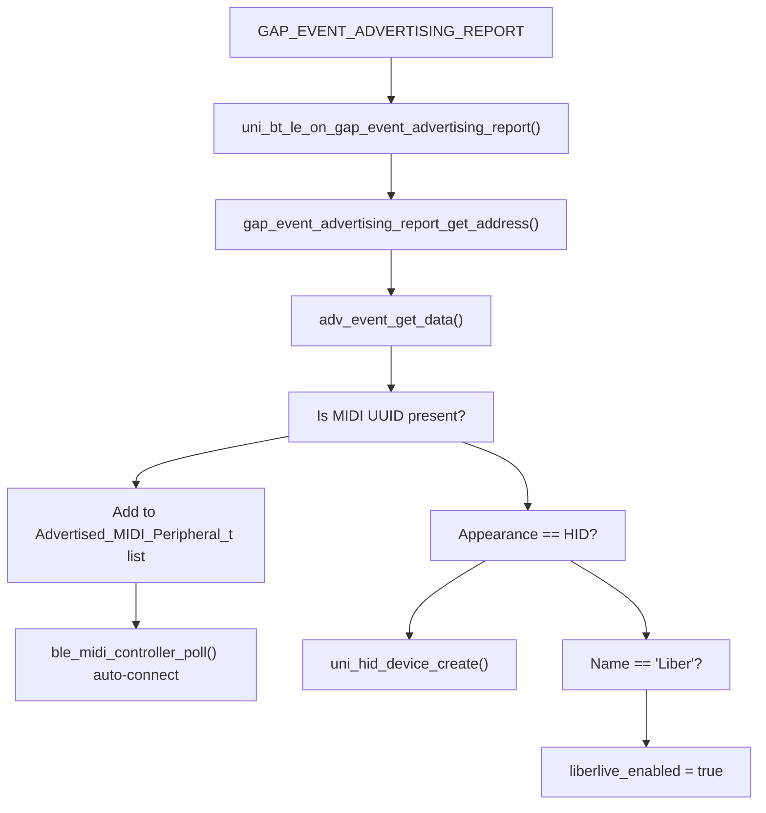
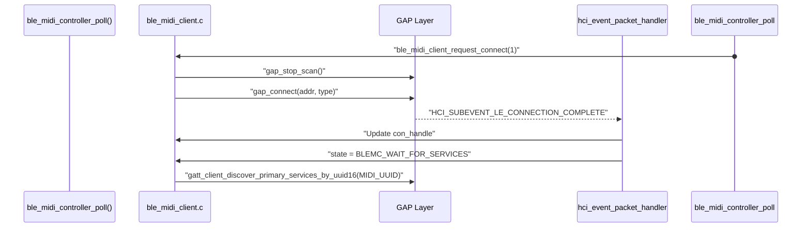
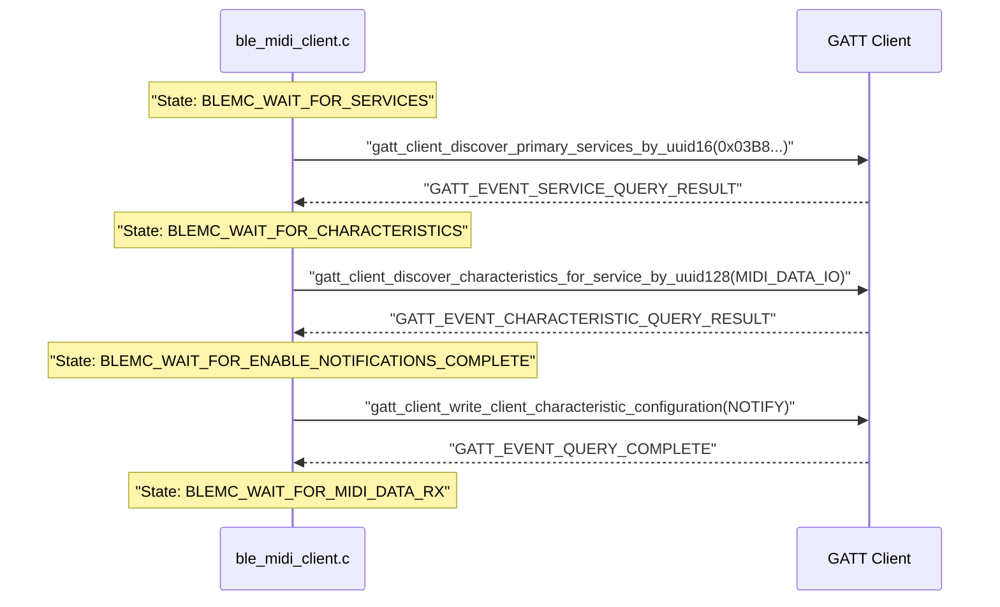

# BLE Device Management

> **Relevant source files**
> * [ble_midi_controller.c](https://github.com/Jus-Be/orinayo-pico/blob/6dde5a75/ble_midi_controller.c)
> * [ble_midi_controller.h](https://github.com/Jus-Be/orinayo-pico/blob/6dde5a75/ble_midi_controller.h)
> * [bluepad32/bt/uni_bt.c](https://github.com/Jus-Be/orinayo-pico/blob/6dde5a75/bluepad32/bt/uni_bt.c)
> * [bluepad32/bt/uni_bt_le.c](https://github.com/Jus-Be/orinayo-pico/blob/6dde5a75/bluepad32/bt/uni_bt_le.c)
> * [bluepad32/bt/uni_bt_setup.c](https://github.com/Jus-Be/orinayo-pico/blob/6dde5a75/bluepad32/bt/uni_bt_setup.c)
> * [pico-w-ble-midi-lib/ble_midi_client.c](https://github.com/Jus-Be/orinayo-pico/blob/6dde5a75/pico-w-ble-midi-lib/ble_midi_client.c)
> * [pico-w-ble-midi-lib/ble_midi_client.h](https://github.com/Jus-Be/orinayo-pico/blob/6dde5a75/pico-w-ble-midi-lib/ble_midi_client.h)

## Purpose and Scope

This document describes the Bluetooth Low Energy (BLE) device management subsystem, covering device scanning, discovery, connection establishment, pairing, security, and connection lifecycle management. The system supports two primary classes of devices:

1. **HID over GATT (HoG)**: Generic gamepads and controllers managed via Bluepad32 in [bluepad32/bt/uni_bt_le.c](https://github.com/Jus-Be/orinayo-pico/blob/6dde5a75/bluepad32/bt/uni_bt_le.c)
2. **BLE MIDI Peripherals**: Standards-compliant MIDI devices (e.g., keyboards, wind controllers) managed by a specialized client library in [pico-w-ble-midi-lib/ble_midi_client.c](https://github.com/Jus-Be/orinayo-pico/blob/6dde5a75/pico-w-ble-midi-lib/ble_midi_client.c)  and integrated via [ble_midi_controller.c](https://github.com/Jus-Be/orinayo-pico/blob/6dde5a75/ble_midi_controller.c)

For information about HID-to-MIDI translation after devices are connected, see [HID to MIDI Translation](./4.2-hid-to-midi-translation.md). For specialized MIDI device protocols, see [Specialized MIDI Devices](./4.5-specialized-midi-devices.md).

---

## Connection Lifecycle Overview

The BLE connection lifecycle follows a specific sequence of states and events, coordinated by multiple packet handlers.

### Connection State Machine

The following diagram illustrates the transition from initial scanning to a "Ready" device state for both HID and MIDI devices.

```mermaid
stateDiagram-v2
    [*] --> Scanning : "uni_bt_le_scan_start() / ble_midi_client_scan_begin()"
    Scanning --> DeviceFound : "GAP_EVENT_ADVERTISING_REPORT"
    DeviceFound --> Connecting : "hog_connect() / ble_midi_client_request_connect()"
    Connecting --> Connected : "HCI_SUBEVENT_LE_CONNECTION_COMPLETE"
    Connected --> Pairing : "sm_request_pairing()"
    Connected --> Reencryption : "SM_EVENT_REENCRYPTION_STARTED"
    Pairing --> PairingComplete : "SM_EVENT_PAIRING_COMPLETE"
    Reencryption --> ReencryptComplete : "SM_EVENT_REENCRYPTION_COMPLETE"
    PairingComplete --> ServiceDiscovery : "GATT Service Query"
    ReencryptComplete --> ServiceDiscovery : "SM_EVENT_REENCRYPTION_COMPLETE"
    ServiceDiscovery --> Ready : "GATTSERVICE_SUBEVENT_HID_SERVICE_CONNECTED / BLEMC_WAIT_FOR_MIDI_DATA_RX"
    Ready --> [*] : "HCI_EVENT_DISCONNECTION_COMPLETE"
```

**Sources:** [bluepad32/bt/uni_bt_le.c L44-L54](https://github.com/Jus-Be/orinayo-pico/blob/6dde5a75/bluepad32/bt/uni_bt_le.c#L44-L54)

 [pico-w-ble-midi-lib/ble_midi_client.c L11-L21](https://github.com/Jus-Be/orinayo-pico/blob/6dde5a75/pico-w-ble-midi-lib/ble_midi_client.c#L11-L21)

 [ble_midi_controller.c L67-L72](https://github.com/Jus-Be/orinayo-pico/blob/6dde5a75/ble_midi_controller.c#L67-L72)

---

## Device Scanning and Discovery

### Scan Control

The system manages scanning state through several parallel mechanisms to accommodate different device types:

| Function | Purpose | File Location |
| --- | --- | --- |
| `uni_bt_le_scan_start()` | Initiates BLE scanning for HID | [bluepad32/bt/uni_bt_le.c L1498-L1505](https://github.com/Jus-Be/orinayo-pico/blob/6dde5a75/bluepad32/bt/uni_bt_le.c#L1498-L1505) |
| `ble_midi_client_scan_begin()` | Initiates BLE scanning for MIDI | [pico-w-ble-midi-lib/ble_midi_client.c L119-L125](https://github.com/Jus-Be/orinayo-pico/blob/6dde5a75/pico-w-ble-midi-lib/ble_midi_client.c#L119-L125) |
| `gap_start_scan()` | Low-level BTstack scan start | [bluepad32/bt/uni_bt_le.c L1501](https://github.com/Jus-Be/orinayo-pico/blob/6dde5a75/bluepad32/bt/uni_bt_le.c#L1501-L1501) |
| `hog_connect()` | Stops scan before connecting HID | [bluepad32/bt/uni_bt_le.c L177-L181](https://github.com/Jus-Be/orinayo-pico/blob/6dde5a75/bluepad32/bt/uni_bt_le.c#L177-L181) |

**Scan Parameters:**
The HID scan is configured with passive scanning in `uni_bt_le_setup()` [bluepad32/bt/uni_bt_le.c L1495](https://github.com/Jus-Be/orinayo-pico/blob/6dde5a75/bluepad32/bt/uni_bt_le.c#L1495-L1495)

 while the MIDI client uses active scanning (type 1) set during state transitions in `uni_bt_setup_packet_handler()` [bluepad32/bt/uni_bt_setup.c L115-L116](https://github.com/Jus-Be/orinayo-pico/blob/6dde5a75/bluepad32/bt/uni_bt_setup.c#L115-L116)

**Sources:** [bluepad32/bt/uni_bt_le.c L1498-L1514](https://github.com/Jus-Be/orinayo-pico/blob/6dde5a75/bluepad32/bt/uni_bt_le.c#L1498-L1514)

 [pico-w-ble-midi-lib/ble_midi_client.c L94-L119](https://github.com/Jus-Be/orinayo-pico/blob/6dde5a75/pico-w-ble-midi-lib/ble_midi_client.c#L94-L119)

 [bluepad32/bt/uni_bt_setup.c L108-L118](https://github.com/Jus-Be/orinayo-pico/blob/6dde5a75/bluepad32/bt/uni_bt_setup.c#L108-L118)

### Advertisement Processing

When a device is found, the system parses advertisement data to identify specific hardware.

```mermaid
flowchart TD

GAP["GAP_EVENT_ADVERTISING_REPORT"]
Handler["uni_bt_le_on_gap_event_advertising_report()"]
Extract["gap_event_advertising_report_get_address()"]
ParseAd["adv_event_get_data()"]
CheckMIDI["Is MIDI UUID present?"]
MIDIList["Add to Advertised_MIDI_Peripheral_t list"]
CheckHID["Appearance == HID?"]
MIDIAuto["ble_midi_controller_poll() auto-connect"]
CreateHID["uni_hid_device_create()"]
CheckCustom["Name == 'Liber'?"]
SetLiber["liberlive_enabled = true"]

GAP --> Handler
Handler --> Extract
Extract --> ParseAd
ParseAd --> CheckMIDI
CheckMIDI --> MIDIList
CheckMIDI --> CheckHID
MIDIList --> MIDIAuto
CheckHID --> CreateHID
CheckHID --> CheckCustom
CheckCustom --> SetLiber
```

**Device Type Detection:**

| Device Name/UUID Pattern | Action | Implementation |
| --- | --- | --- |
| "Liber" (first 5 chars) | Liberlive MIDI device | [bluepad32/bt/uni_bt_le.c L283-L287](https://github.com/Jus-Be/orinayo-pico/blob/6dde5a75/bluepad32/bt/uni_bt_le.c#L283-L287) |
| UUID `03B80E5A-...` | Standard BLE MIDI | [pico-w-ble-midi-lib/ble_midi_client.c L220-L222](https://github.com/Jus-Be/orinayo-pico/blob/6dde5a75/pico-w-ble-midi-lib/ble_midi_client.c#L220-L222) |
| HID Appearance | Generic HoG device | [bluepad32/bt/uni_bt_le.c L293-L295](https://github.com/Jus-Be/orinayo-pico/blob/6dde5a75/bluepad32/bt/uni_bt_le.c#L293-L295) |

**Sources:** [bluepad32/bt/uni_bt_le.c L212-L296](https://github.com/Jus-Be/orinayo-pico/blob/6dde5a75/bluepad32/bt/uni_bt_le.c#L212-L296)

 [pico-w-ble-midi-lib/ble_midi_client.c L212-L250](https://github.com/Jus-Be/orinayo-pico/blob/6dde5a75/pico-w-ble-midi-lib/ble_midi_client.c#L212-L250)

 [ble_midi_controller.c L31-L37](https://github.com/Jus-Be/orinayo-pico/blob/6dde5a75/ble_midi_controller.c#L31-L37)

---

## Connection Establishment

### Connection Initiation

The system stops scanning before initiating a connection to improve reliability.

```mermaid
sequenceDiagram
  participant ble_midi_controller_poll()
  participant ble_midi_client.c
  participant GAP Layer
  participant hci_event_packet_handler

  ble_midi_controller_poll()->>ble_midi_client.c: "ble_midi_client_request_connect(1)"
  ble_midi_client.c->>GAP Layer: "gap_stop_scan()"
  ble_midi_client.c->>GAP Layer: "gap_connect(addr, type)"
  GAP Layer-->>hci_event_packet_handler: "HCI_SUBEVENT_LE_CONNECTION_COMPLETE"
  hci_event_packet_handler->>ble_midi_client.c: "Update con_handle"
  hci_event_packet_handler->>ble_midi_client.c: "state = BLEMC_WAIT_FOR_SERVICES"
  ble_midi_client.c->>GAP Layer: "gatt_client_discover_primary_services_by_uuid16(MIDI_UUID)"
```

**Scan Resume Logic:**
For HID devices, `resume_scanning_hint()` restarts scanning if it was active before the connection [bluepad32/bt/uni_bt_le.c L184-L190](https://github.com/Jus-Be/orinayo-pico/blob/6dde5a75/bluepad32/bt/uni_bt_le.c#L184-L190)

 For MIDI, the `ble_midi_controller_poll()` function manages reconnection every `BMC_RECONNECT_INTERVAL_MS` if the state is not `BMC_STATE_READY` [ble_midi_controller.c L56-L72](https://github.com/Jus-Be/orinayo-pico/blob/6dde5a75/ble_midi_controller.c#L56-L72)

**Sources:** [bluepad32/bt/uni_bt_le.c L174-L182](https://github.com/Jus-Be/orinayo-pico/blob/6dde5a75/bluepad32/bt/uni_bt_le.c#L174-L182)

 [pico-w-ble-midi-lib/ble_midi_client.c L140-L165](https://github.com/Jus-Be/orinayo-pico/blob/6dde5a75/pico-w-ble-midi-lib/ble_midi_client.c#L140-L165)

 [ble_midi_controller.c L237-L268](https://github.com/Jus-Be/orinayo-pico/blob/6dde5a75/ble_midi_controller.c#L237-L268)

---

## Security and Pairing

### Security Manager (SM) Event Handling

Authentication is handled via `uni_sm_packet_handler()` for HID [bluepad32/bt/uni_bt_le.c L632](https://github.com/Jus-Be/orinayo-pico/blob/6dde5a75/bluepad32/bt/uni_bt_le.c#L632-L632)

 and within the MIDI client's packet handler for MIDI devices [pico-w-ble-midi-lib/ble_midi_client.c L338](https://github.com/Jus-Be/orinayo-pico/blob/6dde5a75/pico-w-ble-midi-lib/ble_midi_client.c#L338-L338)

**Authentication Configuration:**

* **HID IO Capabilities**: `IO_CAPABILITY_NO_INPUT_NO_OUTPUT` [bluepad32/bt/uni_bt_le.c L1456](https://github.com/Jus-Be/orinayo-pico/blob/6dde5a75/bluepad32/bt/uni_bt_le.c#L1456-L1456)
* **MIDI IO Capabilities**: Configurable via `iocaps` in `ble_midi_client_init()` [pico-w-ble-midi-lib/ble_midi_client.c L91](https://github.com/Jus-Be/orinayo-pico/blob/6dde5a75/pico-w-ble-midi-lib/ble_midi_client.c#L91-L91)
* **Fixed Passkey**: Used for specific peripheral pairings [pico-w-ble-midi-lib/ble_midi_client.c L8-L9](https://github.com/Jus-Be/orinayo-pico/blob/6dde5a75/pico-w-ble-midi-lib/ble_midi_client.c#L8-L9)

**Bond Management:**

* `uni_bt_le_delete_bonded_keys()`: Clears stored BLE bonds [bluepad32/bt/uni_bt_le.c L1424-L1445](https://github.com/Jus-Be/orinayo-pico/blob/6dde5a75/bluepad32/bt/uni_bt_le.c#L1424-L1445)
* `gap_delete_bonding()`: Used when re-encryption fails due to missing keys [bluepad32/bt/uni_bt_le.c L686](https://github.com/Jus-Be/orinayo-pico/blob/6dde5a75/bluepad32/bt/uni_bt_le.c#L686-L686)

**Sources:** [bluepad32/bt/uni_bt_le.c L632-L768](https://github.com/Jus-Be/orinayo-pico/blob/6dde5a75/bluepad32/bt/uni_bt_le.c#L632-L768)

 [pico-w-ble-midi-lib/ble_midi_client.c L338-L360](https://github.com/Jus-Be/orinayo-pico/blob/6dde5a75/pico-w-ble-midi-lib/ble_midi_client.c#L338-L360)

 [bluepad32/bt/uni_bt_le.c L1424-L1445](https://github.com/Jus-Be/orinayo-pico/blob/6dde5a75/bluepad32/bt/uni_bt_le.c#L1424-L1445)

---

## Service Discovery

### MIDI Service Flow

For standard MIDI devices, the discovery process is strictly sequenced via a state machine in `ble_midi_client.c`.

```mermaid
sequenceDiagram
  participant ble_midi_client.c
  participant GATT Client

  note over ble_midi_client.c: "State: BLEMC_WAIT_FOR_SERVICES"
  ble_midi_client.c->>GATT Client: "gatt_client_discover_primary_services_by_uuid16(0x03B8...)"
  GATT Client-->>ble_midi_client.c: "GATT_EVENT_SERVICE_QUERY_RESULT"
  note over ble_midi_client.c: "State: BLEMC_WAIT_FOR_CHARACTERISTICS"
  ble_midi_client.c->>GATT Client: "gatt_client_discover_characteristics_for_service_by_uuid128(MIDI_DATA_IO)"
  GATT Client-->>ble_midi_client.c: "GATT_EVENT_CHARACTERISTIC_QUERY_RESULT"
  note over ble_midi_client.c: "State: BLEMC_WAIT_FOR_ENABLE_NOTIFICATIONS_COMPLETE"
  ble_midi_client.c->>GATT Client: "gatt_client_write_client_characteristic_configuration(NOTIFY)"
  GATT Client-->>ble_midi_client.c: "GATT_EVENT_QUERY_COMPLETE"
  note over ble_midi_client.c: "State: BLEMC_WAIT_FOR_MIDI_DATA_RX"
```

**Characteristic Identification:**
The MIDI client specifically searches for the MIDI Data I/O characteristic UUID: `7772E5DB-3868-4112-A1A9-F2669D106BF3` [pico-w-ble-midi-lib/ble_midi_client.c L126](https://github.com/Jus-Be/orinayo-pico/blob/6dde5a75/pico-w-ble-midi-lib/ble_midi_client.c#L126-L126)

**Sources:** [pico-w-ble-midi-lib/ble_midi_client.c L121-L171](https://github.com/Jus-Be/orinayo-pico/blob/6dde5a75/pico-w-ble-midi-lib/ble_midi_client.c#L121-L171)

 [pico-w-ble-midi-lib/ble_midi_client.c L11-L21](https://github.com/Jus-Be/orinayo-pico/blob/6dde5a75/pico-w-ble-midi-lib/ble_midi_client.c#L11-L21)

---

## Connection Termination

### Disconnection and Cleanup

Disconnections trigger cleanup across multiple layers.

| Layer | Action | Code Entity |
| --- | --- | --- |
| HCI | Detects link loss | `HCI_EVENT_DISCONNECTION_COMPLETE` [bluepad32/bt/uni_bt.c L149](https://github.com/Jus-Be/orinayo-pico/blob/6dde5a75/bluepad32/bt/uni_bt.c#L149-L149) |
| HID | Deletes device instance | `uni_hid_device_delete()` [bluepad32/bt/uni_bt.c L173](https://github.com/Jus-Be/orinayo-pico/blob/6dde5a75/bluepad32/bt/uni_bt.c#L173-L173) |
| MIDI | Resets state to IDLE | `state = BLEMC_IDLE` [pico-w-ble-midi-lib/ble_midi_client.c L321](https://github.com/Jus-Be/orinayo-pico/blob/6dde5a75/pico-w-ble-midi-lib/ble_midi_client.c#L321-L321) |
| Controller | Schedules reconnect | `bmc_state = BMC_STATE_SCANNING` [ble_midi_controller.c L264](https://github.com/Jus-Be/orinayo-pico/blob/6dde5a75/ble_midi_controller.c#L264-L264) |

**Cleanup Logic:**
In `uni_bt_le_on_hci_disconnection_complete()`, the system resets global flags like `liberlive_enabled` and calls `resume_scanning_hint()` to allow new connections [bluepad32/bt/uni_bt_le.c L1392-L1400](https://github.com/Jus-Be/orinayo-pico/blob/6dde5a75/bluepad32/bt/uni_bt_le.c#L1392-L1400)

**Sources:** [bluepad32/bt/uni_bt.c L149-L184](https://github.com/Jus-Be/orinayo-pico/blob/6dde5a75/bluepad32/bt/uni_bt.c#L149-L184)

 [pico-w-ble-midi-lib/ble_midi_client.c L310-L330](https://github.com/Jus-Be/orinayo-pico/blob/6dde5a75/pico-w-ble-midi-lib/ble_midi_client.c#L310-L330)

 [ble_midi_controller.c L257-L268](https://github.com/Jus-Be/orinayo-pico/blob/6dde5a75/ble_midi_controller.c#L257-L268)

---

## Configuration and Setup

### Initialization Sequence

The BLE subsystems are initialized through a series of setup calls before the BTstack power-on.

1. **HID Setup**: `uni_bt_le_setup()` registers the HID SM handler and initializes the HIDS client [bluepad32/bt/uni_bt_le.c L1447-L1496](https://github.com/Jus-Be/orinayo-pico/blob/6dde5a75/bluepad32/bt/uni_bt_le.c#L1447-L1496)
2. **MIDI Setup**: `ble_midi_controller_init()` calls `ble_midi_client_init()` with the profile name "Orinayo" [ble_midi_controller.c L49-L50](https://github.com/Jus-Be/orinayo-pico/blob/6dde5a75/ble_midi_controller.c#L49-L50)  [ble_midi_controller.c L215](https://github.com/Jus-Be/orinayo-pico/blob/6dde5a75/ble_midi_controller.c#L215-L215)
3. **HCI Power**: `hci_power_control(HCI_POWER_ON)` starts the stack [bluepad32/bt/uni_bt_setup.c L163](https://github.com/Jus-Be/orinayo-pico/blob/6dde5a75/bluepad32/bt/uni_bt_setup.c#L163-L163)

**Runtime Polling:**
The application must call `ble_midi_controller_poll()` in the main loop [ble_midi_controller.c L237](https://github.com/Jus-Be/orinayo-pico/blob/6dde5a75/ble_midi_controller.c#L237-L237)

 This function drains the MIDI receive buffer using `ble_midi_client_stream_read()` and dispatches events to handlers like `bmc_on_note_on()` [ble_midi_controller.c L270-L300](https://github.com/Jus-Be/orinayo-pico/blob/6dde5a75/ble_midi_controller.c#L270-L300)

**Sources:** [bluepad32/bt/uni_bt_le.c L1447-L1496](https://github.com/Jus-Be/orinayo-pico/blob/6dde5a75/bluepad32/bt/uni_bt_le.c#L1447-L1496)

 [ble_midi_controller.c L210-L235](https://github.com/Jus-Be/orinayo-pico/blob/6dde5a75/ble_midi_controller.c#L210-L235)

 [ble_midi_controller.c L237-L308](https://github.com/Jus-Be/orinayo-pico/blob/6dde5a75/ble_midi_controller.c#L237-L308)