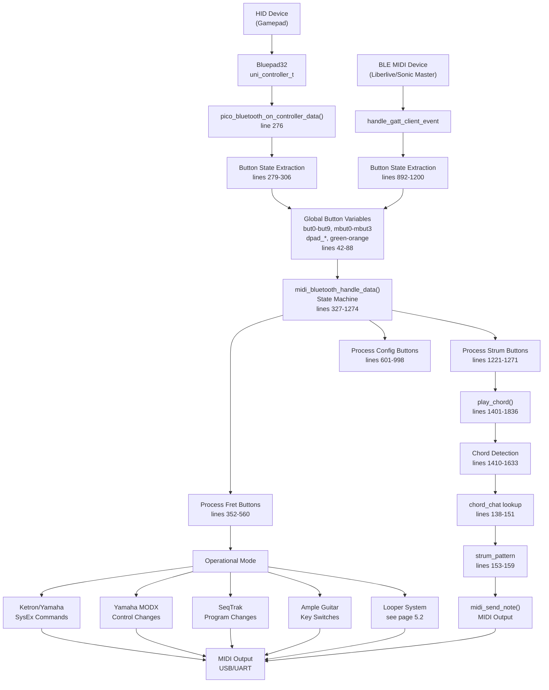
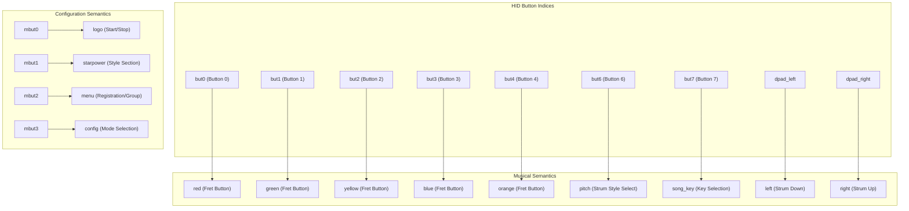
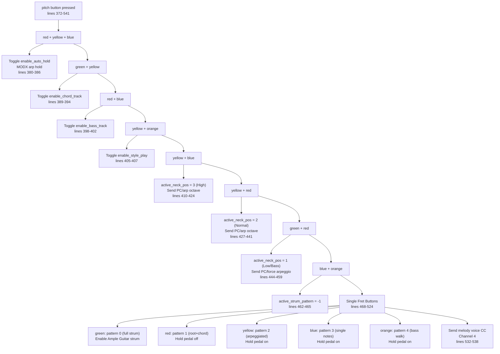
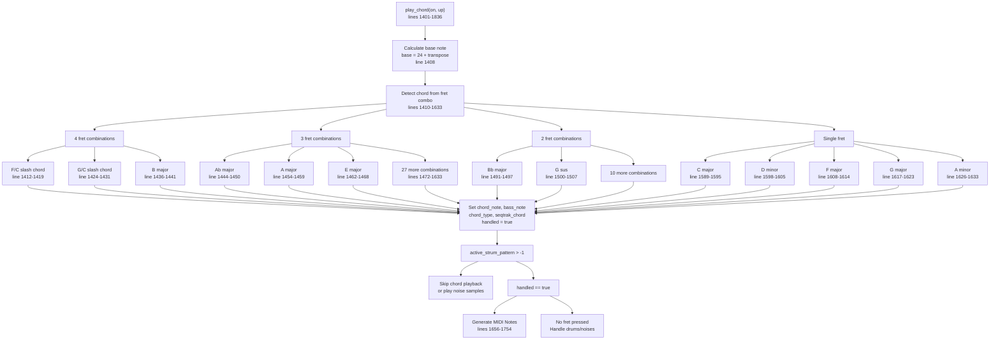
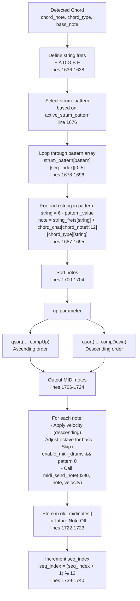
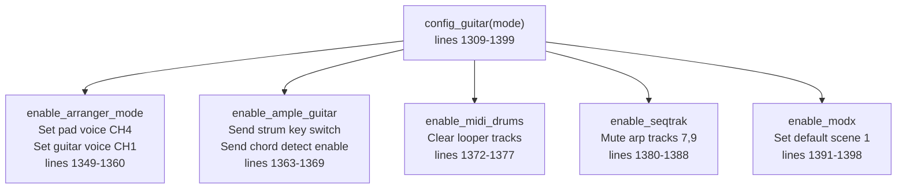
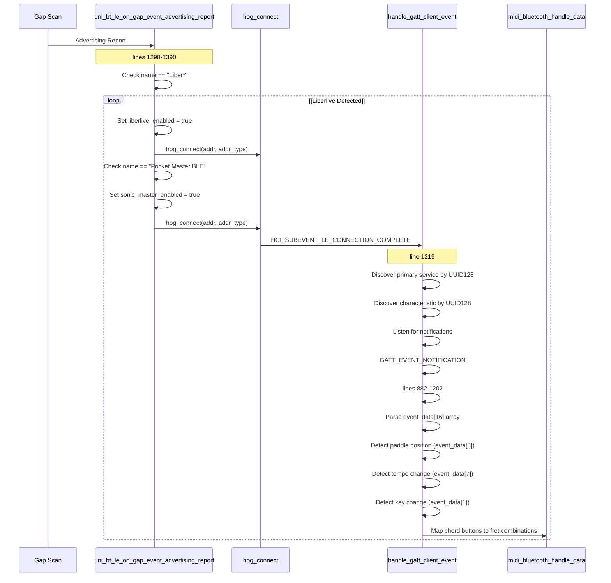
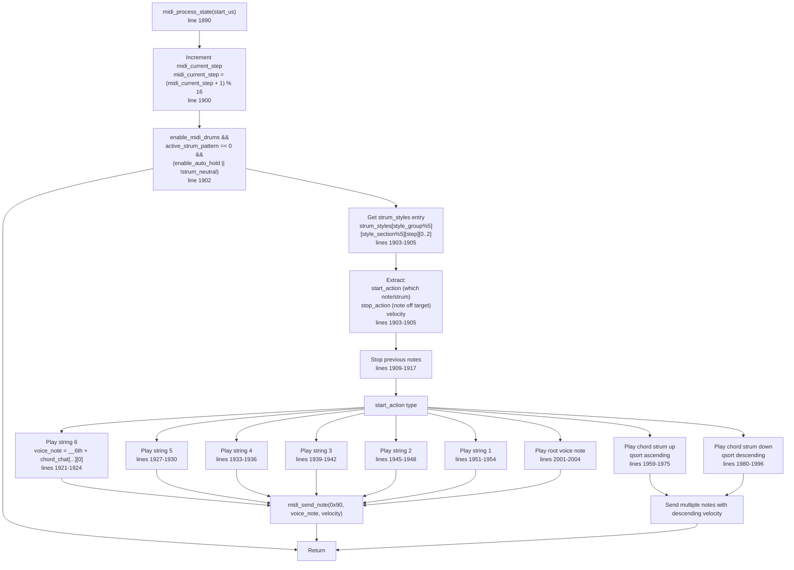

# HID to MIDI Translation

> **Relevant source files**
> * [bluepad32/bt/uni_bt_le.c](https://github.com/Jus-Be/orinayo-pico/blob/122fa496/bluepad32/bt/uni_bt_le.c)
> * [pico_bluetooth.c](https://github.com/Jus-Be/orinayo-pico/blob/122fa496/pico_bluetooth.c)

This page documents how gamepad controller button states are translated into MIDI commands in the Orinayo system. The translation occurs primarily in [pico_bluetooth.c](https://github.com/Jus-Be/orinayo-pico/blob/122fa496/pico_bluetooth.c)

 and handles both standard HID gamepad controllers (via Bluepad32) and specialized BLE MIDI devices (Liberlive, Sonic Master).

For information about chord generation algorithms and the `chord_chat` lookup table, see [Chord Generation System](./4.3-chord-generation-system.md). For details on the five operational modes that affect MIDI output, see [Operational Modes](./4.4-operational-modes.md). For specialized BLE MIDI device handling, see [Specialized MIDI Devices](./4.5-specialized-midi-devices.md).

## Overview

The HID to MIDI translation system acts as an interpreter between physical controller inputs and musical MIDI commands. It maintains button state variables, implements a complex state machine for processing button combinations, and generates appropriate MIDI messages based on the current operational mode.

**Key Components:**

* **Button State Variables**: Global variables tracking current button states
* **State Machine**: `midi_bluetooth_handle_data()` processes button state changes
* **Chord Detection**: `play_chord()` translates fret combinations to MIDI notes
* **Mode Switching**: Configuration system enabling different musical behaviors

Sources: [pico_bluetooth.c L1-L1889](https://github.com/Jus-Be/orinayo-pico/blob/122fa496/pico_bluetooth.c#L1-L1889)

## Data Flow Architecture



Sources: [pico_bluetooth.c L276-L1836](https://github.com/Jus-Be/orinayo-pico/blob/122fa496/pico_bluetooth.c#L276-L1836)

 [bluepad32/bt/uni_bt_le.c L771-L1203](https://github.com/Jus-Be/orinayo-pico/blob/122fa496/bluepad32/bt/uni_bt_le.c#L771-L1203)

## Button State Variables

The system maintains a comprehensive set of global variables to track controller state. These variables are updated from HID reports and read by the state machine.

### Primary Button Variables

| Variable Group | Variables | Purpose | Lines |
| --- | --- | --- | --- |
| **Face Buttons** | `but0` through `but9` | Generic button indices (A, B, X, Y, shoulder buttons, etc.) | 42-49 |
| **Misc Buttons** | `mbut0` through `mbut3` | System buttons (logo, start, menu, config) | 51-54 |
| **D-Pad** | `dpad_left`, `dpad_right`, `dpad_up`, `dpad_down` | Directional pad states | 56-59 |
| **Analog** | `joy_up`, `joy_down`, `knob_up`, `knob_down` | Analog stick/knob directions | 61-64 |
| **Fret Buttons** | `green`, `red`, `yellow`, `blue`, `orange` | Guitar Hero-style fret buttons | 66-70 |
| **Special** | `pitch`, `starpower`, `song_key` | Mode and action triggers | 71-73 |

### Button Semantic Mapping

The system maps generic button indices to semantic meanings:



**Extraction Process:**

In `pico_bluetooth_on_controller_data()` [pico_bluetooth.c L276-L325](https://github.com/Jus-Be/orinayo-pico/blob/122fa496/pico_bluetooth.c#L276-L325)

:

```python
1. Receive uni_controller_t from Bluepad32
2. Extract button bitmask: ctl->gamepad.buttons
3. Bit-shift to isolate individual buttons (lines 289-296)
4. Extract D-pad state: ctl->gamepad.dpad (lines 298-301)
5. Extract misc buttons: ctl->gamepad.misc_buttons (lines 303-306)
6. Derive analog directions from axis values (lines 279-287)
7. Call midi_bluetooth_handle_data() (line 310)
```

Sources: [pico_bluetooth.c L42-L325](https://github.com/Jus-Be/orinayo-pico/blob/122fa496/pico_bluetooth.c#L42-L325)

## Main State Machine

The `midi_bluetooth_handle_data()` function implements a large sequential state machine that processes button state changes in priority order. It uses early returns to ensure only one action is processed per invocation.

```css
#mermaid-zruug11bq3o{font-family:ui-sans-serif,-apple-system,system-ui,Segoe UI,Helvetica;font-size:16px;fill:#333;}@keyframes edge-animation-frame{from{stroke-dashoffset:0;}}@keyframes dash{to{stroke-dashoffset:0;}}#mermaid-zruug11bq3o .edge-animation-slow{stroke-dasharray:9,5!important;stroke-dashoffset:900;animation:dash 50s linear infinite;stroke-linecap:round;}#mermaid-zruug11bq3o .edge-animation-fast{stroke-dasharray:9,5!important;stroke-dashoffset:900;animation:dash 20s linear infinite;stroke-linecap:round;}#mermaid-zruug11bq3o .error-icon{fill:#dddddd;}#mermaid-zruug11bq3o .error-text{fill:#222222;stroke:#222222;}#mermaid-zruug11bq3o .edge-thickness-normal{stroke-width:1px;}#mermaid-zruug11bq3o .edge-thickness-thick{stroke-width:3.5px;}#mermaid-zruug11bq3o .edge-pattern-solid{stroke-dasharray:0;}#mermaid-zruug11bq3o .edge-thickness-invisible{stroke-width:0;fill:none;}#mermaid-zruug11bq3o .edge-pattern-dashed{stroke-dasharray:3;}#mermaid-zruug11bq3o .edge-pattern-dotted{stroke-dasharray:2;}#mermaid-zruug11bq3o .marker{fill:#999;stroke:#999;}#mermaid-zruug11bq3o .marker.cross{stroke:#999;}#mermaid-zruug11bq3o svg{font-family:ui-sans-serif,-apple-system,system-ui,Segoe UI,Helvetica;font-size:16px;}#mermaid-zruug11bq3o p{margin:0;}#mermaid-zruug11bq3o defs #statediagram-barbEnd{fill:#999;stroke:#999;}#mermaid-zruug11bq3o g.stateGroup text{fill:#dddddd;stroke:none;font-size:10px;}#mermaid-zruug11bq3o g.stateGroup text{fill:#333;stroke:none;font-size:10px;}#mermaid-zruug11bq3o g.stateGroup .state-title{font-weight:bolder;fill:#333;}#mermaid-zruug11bq3o g.stateGroup rect{fill:#ffffff;stroke:#dddddd;}#mermaid-zruug11bq3o g.stateGroup line{stroke:#999;stroke-width:1;}#mermaid-zruug11bq3o .transition{stroke:#999;stroke-width:1;fill:none;}#mermaid-zruug11bq3o .stateGroup .composit{fill:#f4f4f4;border-bottom:1px;}#mermaid-zruug11bq3o .stateGroup .alt-composit{fill:#e0e0e0;border-bottom:1px;}#mermaid-zruug11bq3o .state-note{stroke:#e6d280;fill:#fff5ad;}#mermaid-zruug11bq3o .state-note text{fill:#333;stroke:none;font-size:10px;}#mermaid-zruug11bq3o .stateLabel .box{stroke:none;stroke-width:0;fill:#ffffff;opacity:0.5;}#mermaid-zruug11bq3o .edgeLabel .label rect{fill:#ffffff;opacity:0.5;}#mermaid-zruug11bq3o .edgeLabel{background-color:#ffffff;text-align:center;}#mermaid-zruug11bq3o .edgeLabel p{background-color:#ffffff;}#mermaid-zruug11bq3o .edgeLabel rect{opacity:0.5;background-color:#ffffff;fill:#ffffff;}#mermaid-zruug11bq3o .edgeLabel .label text{fill:#333;}#mermaid-zruug11bq3o .label div .edgeLabel{color:#333;}#mermaid-zruug11bq3o .stateLabel text{fill:#333;font-size:10px;font-weight:bold;}#mermaid-zruug11bq3o .node circle.state-start{fill:#999;stroke:#999;}#mermaid-zruug11bq3o .node .fork-join{fill:#999;stroke:#999;}#mermaid-zruug11bq3o .node circle.state-end{fill:#dddddd;stroke:#f4f4f4;stroke-width:1.5;}#mermaid-zruug11bq3o .end-state-inner{fill:#f4f4f4;stroke-width:1.5;}#mermaid-zruug11bq3o .node rect{fill:#ffffff;stroke:#dddddd;stroke-width:1px;}#mermaid-zruug11bq3o .node polygon{fill:#ffffff;stroke:#dddddd;stroke-width:1px;}#mermaid-zruug11bq3o #statediagram-barbEnd{fill:#999;}#mermaid-zruug11bq3o .statediagram-cluster rect{fill:#ffffff;stroke:#dddddd;stroke-width:1px;}#mermaid-zruug11bq3o .cluster-label,#mermaid-zruug11bq3o .nodeLabel{color:#333;}#mermaid-zruug11bq3o .statediagram-cluster rect.outer{rx:5px;ry:5px;}#mermaid-zruug11bq3o .statediagram-state .divider{stroke:#dddddd;}#mermaid-zruug11bq3o .statediagram-state .title-state{rx:5px;ry:5px;}#mermaid-zruug11bq3o .statediagram-cluster.statediagram-cluster .inner{fill:#f4f4f4;}#mermaid-zruug11bq3o .statediagram-cluster.statediagram-cluster-alt .inner{fill:#f8f8f8;}#mermaid-zruug11bq3o .statediagram-cluster .inner{rx:0;ry:0;}#mermaid-zruug11bq3o .statediagram-state rect.basic{rx:5px;ry:5px;}#mermaid-zruug11bq3o .statediagram-state rect.divider{stroke-dasharray:10,10;fill:#f8f8f8;}#mermaid-zruug11bq3o .note-edge{stroke-dasharray:5;}#mermaid-zruug11bq3o .statediagram-note rect{fill:#fff5ad;stroke:#e6d280;stroke-width:1px;rx:0;ry:0;}#mermaid-zruug11bq3o .statediagram-note rect{fill:#fff5ad;stroke:#e6d280;stroke-width:1px;rx:0;ry:0;}#mermaid-zruug11bq3o .statediagram-note text{fill:#333;}#mermaid-zruug11bq3o .statediagram-note .nodeLabel{color:#333;}#mermaid-zruug11bq3o .statediagram .edgeLabel{color:red;}#mermaid-zruug11bq3o #dependencyStart,#mermaid-zruug11bq3o #dependencyEnd{fill:#999;stroke:#999;stroke-width:1;}#mermaid-zruug11bq3o .statediagramTitleText{text-anchor:middle;font-size:18px;fill:#333;}#mermaid-zruug11bq3o :root{--mermaid-font-family:"trebuchet ms",verdana,arial,sans-serif;}Button Eventfinished_processing == falsefinished_processing == trueSet finished_processing = falseFret button changedNo fret changeLines 352-373Fret + pitch combinationsSet finished_processing = truepitch button changedNo pitch changeLines 372-542Set active_strum_patternsong_key button changedNo key changeLines 546-560Lines 564-596Lines 601-739Lines 741-839Lines 841-975Lines 977-998Lines 1000-1092Lines 1101-1219Lines 1221-1244dpad_right changedNo changestop_chord() then play_chord(true, true)dpad_left changedNo changestop_chord() then play_chord(true, false)Return and wait for next eventSet finished_processing = trueSkip processingCheckProcessingExitSetFlagCheckFretsFretChangeCheckPitchProcessFretLogicModeActionsReturnTruePitchChangeCheckSongKeyProcessPitchStrumStylesKeyChangeCheckStartSetTransposeCheckDpadCheckLogoCheckStarpowerCheckMenuCheckConfigCheckJoystickCheckKnobsCheckStrumRightStrumRightChangeCheckStrumLeftPlayChordUpStrumLeftChangeFinalReturnPlayChordDown
```

**Processing Sequence:**

1. **Gate Check** (lines 328-329): Return immediately if previous processing incomplete
2. **Fret Buttons** (lines 352-541): Highest priority - updates `green`, `red`, `yellow`, `blue`, `orange`
3. **Pitch Button** (lines 372-542): Processes strum pattern selection with fret modifiers
4. **Song Key** (lines 546-560): Direct key transposition via fret + but7
5. **Logo Button** (lines 601-739): Start/stop sequencer or arranger
6. **Starpower** (lines 741-839): Style section selection
7. **Menu Button** (lines 841-975): Registration/style group selection
8. **Config Button** (lines 977-998): Operational mode switching
9. **Joystick** (lines 1000-1092): Tempo presets or fill-in triggers
10. **Knobs** (lines 1101-1219): Ghost note intensity, recording mode
11. **Strum Buttons** (lines 1221-1271): Lowest priority - triggers chord playback

**Early Return Pattern:**

Each section follows this pattern:

```
if (button_state != previous_state) {
    previous_state = button_state;
    // Process action
    finished_processing = true;
    return;
}
```

This ensures mutual exclusion - only one button change is processed per call.

Sources: [pico_bluetooth.c L327-L1274](https://github.com/Jus-Be/orinayo-pico/blob/122fa496/pico_bluetooth.c#L327-L1274)

## Fret Button Processing

Fret buttons are the primary musical input mechanism. They are processed with the pitch button to determine strum patterns and chord shapes.

### Fret + Pitch Combinations

When `pitch` (but6) is pressed with fret combinations, various musical actions occur:



**Active Neck Position:**

The `active_neck_pos` variable (lines 93) determines the octave range for chord playback:

* `1`: Low/Bass position (adds lower octave)
* `2`: Normal position (default)
* `3`: High position (higher register)

This affects the base MIDI note calculation in `play_chord()` at line 1408:

```
base = 24 + transpose;
```

Then modified by neck position in string fret calculations (lines 1637):

```
int __6th = E + O*(active_neck_pos+2)  // E string
int __5th = A + O*(active_neck_pos+2)  // A string
// etc.
```

Sources: [pico_bluetooth.c L93-L1637](https://github.com/Jus-Be/orinayo-pico/blob/122fa496/pico_bluetooth.c#L93-L1637)

## Strum Button Processing

Strum buttons (d-pad left/right) trigger chord playback. They are processed last in the state machine to allow fret button changes to take precedence.

```mermaid
sequenceDiagram
  participant User
  participant midi_bluetooth_handle_data
  participant stop_chord()
  participant play_chord()
  participant MIDI Output

  User->>midi_bluetooth_handle_data: dpad_right pressed (strum up)
  note over midi_bluetooth_handle_data: lines 1221-1244
  midi_bluetooth_handle_data->>midi_bluetooth_handle_data: Set strum_neutral = false
  loop [!enable_auto_hold]
    midi_bluetooth_handle_data->>stop_chord(): Stop previous chord
    stop_chord()->>MIDI Output: Note Off messages
    midi_bluetooth_handle_data->>play_chord(): play_chord(true, true)
    note over play_chord(): up = true parameter
    play_chord()->>play_chord(): Chord detection (fret combination)
    play_chord()->>play_chord(): strum_pattern lookup
    play_chord()->>play_chord(): Sort notes ascending (compUp)
    play_chord()->>MIDI Output: Note On (velocity descending)
    User->>midi_bluetooth_handle_data: dpad_right released
    midi_bluetooth_handle_data->>midi_bluetooth_handle_data: Set strum_neutral = true
    note over midi_bluetooth_handle_data: Sustain notes (no stop)
    midi_bluetooth_handle_data->>stop_chord(): Stop chord
    stop_chord()->>MIDI Output: Note Off messages
    User->>midi_bluetooth_handle_data: dpad_left pressed (strum down)
    note over midi_bluetooth_handle_data: lines 1247-1271
    midi_bluetooth_handle_data->>stop_chord(): Stop previous chord
    midi_bluetooth_handle_data->>play_chord(): play_chord(true, false)
    note over play_chord(): up = false parameter
    play_chord()->>play_chord(): Sort notes descending (compDown)
    play_chord()->>MIDI Output: Note On (velocity descending)
  end
```

**Strum Neutral State:**

The `strum_neutral` boolean (line 28) tracks whether the strum paddle is in neutral position:

* Set to `false` when strum pressed (lines 1225, 1251)
* Set to `true` when strum released (lines 1230, 1256)
* Determines whether auto-strum should trigger in `midi_process_state()` (line 1902)

**Note Sustain Logic:**

Notes are sustained (not immediately stopped on release) when:

1. `enable_auto_hold` is enabled (lines 1232, 1258)
2. No fret buttons pressed (lines 1232, 1258)
3. `active_strum_pattern` is 0 or 1 (full chord or root+chord modes)

Otherwise, `stop_chord()` is called to send Note Off messages.

Sources: [pico_bluetooth.c L28-L1902](https://github.com/Jus-Be/orinayo-pico/blob/122fa496/pico_bluetooth.c#L28-L1902)

## Chord Detection and MIDI Generation

The `play_chord()` function translates fret button combinations into MIDI note sequences. It uses the `chord_chat` lookup table (see [Chord Generation System](./4.3-chord-generation-system.md)) and `strum_pattern` arrays.

### Chord Detection Logic



### Note Generation Process

When a valid chord is detected and `active_strum_pattern >= 0`:



**Strum Pattern Array:**

The `strum_pattern` array [pico_bluetooth.c L153-L159](https://github.com/Jus-Be/orinayo-pico/blob/122fa496/pico_bluetooth.c#L153-L159)

 defines which strings to play for each pattern:

* **Pattern 0** (green): Full 6-string strum `{6,5,4,3,2,1}`
* **Pattern 1** (red): 4-string patterns with variations
* **Pattern 2** (yellow): Single string arpeggios
* **Pattern 3** (blue): Sparse arpeggio patterns
* **Pattern 4** (orange): Bass walk patterns

Each pattern has 12 steps (one measure), with each step specifying 6 string values (1-6 for play, 0 for skip).

**Velocity Dynamics:**

Starting velocity is 110 (line 1698), decreased by 10 for each subsequent note in the strum (lines 1706-1708), creating a natural velocity rolloff.

Sources: [pico_bluetooth.c L138-L1836](https://github.com/Jus-Be/orinayo-pico/blob/122fa496/pico_bluetooth.c#L138-L1836)

## Mode-Dependent Behavior

Different operational modes affect how button presses are translated to MIDI. The modes are selected via the config button (mbut3) with fret combinations [pico_bluetooth.c L977-L998](https://github.com/Jus-Be/orinayo-pico/blob/122fa496/pico_bluetooth.c#L977-L998)

### Mode Selection Table

| Fret Combination | Mode | enable_* Variable | Description |
| --- | --- | --- | --- |
| green | Arranger Mode | `enable_arranger_mode` | Ketron/Yamaha arranger keyboards |
| red | Ample Guitar | `enable_ample_guitar` | Ample Guitar VST plugin |
| yellow | MIDI Drums | `enable_midi_drums` | Internal looper/sequencer |
| blue | SeqTrak | `enable_seqtrak` | Yamaha SeqTrak synthesizer |
| orange | MODX | `enable_modx` | Yamaha MODX synthesizer |
| green + red | Guitar Toggle | - | Toggle acoustic/electric guitar |
| red + yellow | Effects 1 | - | Hall reverb + chorus |
| yellow + blue | Effects 2 | - | Hall reverb + chorus off |
| blue + orange | Effects 3 | - | Pan delay reverb |

**Mode Configuration Function:**

The `config_guitar()` function [pico_bluetooth.c L1309-L1399](https://github.com/Jus-Be/orinayo-pico/blob/122fa496/pico_bluetooth.c#L1309-L1399)

 handles mode switching. Each mode enables specific MIDI behaviors:



### Mode-Specific MIDI Output

When `enable_style_play` is true (set automatically with mode selection), the system outputs different MIDI messages based on mode:

**Arranger Mode:**

* Uses `midi_ketron_arr()` and `midi_yamaha_arr()` for style control
* Sends SysEx for section changes
* Controls via start/stop buttons

**Ample Guitar Mode:**

* Key switches on notes 86, 97, 99 control playing techniques
* Note 24 sustains notes
* Note 26 palm mutes notes
* Noise samples on notes 93-95

**SeqTrak Mode:**

* Pattern changes via `midi_seqtrak_pattern()`
* Arpeggiator control via `midi_seqtrak_arp()`
* Track muting via `midi_seqtrak_mute()`

**MODX Mode:**

* Scene switching via CC 92 on channel 4
* Arpeggiator octave control
* Part control for multi-timbral setup

**MIDI Drums Mode:**

* Disables direct chord playback
* Routes to looper system (see [Step Sequencer](./5.2-step-sequencer.md))
* Auto-strum handled by `midi_process_state()` [pico_bluetooth.c L1890-L2006](https://github.com/Jus-Be/orinayo-pico/blob/122fa496/pico_bluetooth.c#L1890-L2006)

Sources: [pico_bluetooth.c L977-L2006](https://github.com/Jus-Be/orinayo-pico/blob/122fa496/pico_bluetooth.c#L977-L2006)

## BLE MIDI Device Handling

Specialized BLE MIDI devices (Liberlive, Sonic Master) bypass the standard HID gamepad path and are handled directly in `handle_gatt_client_event()` [bluepad32/bt/uni_bt_le.c L771-L1203](https://github.com/Jus-Be/orinayo-pico/blob/122fa496/bluepad32/bt/uni_bt_le.c#L771-L1203)

### BLE Device Detection



### Liberlive Chord Mapping

The Liberlive device sends chord information via GATT notifications. The system maps these to fret button combinations [bluepad32/bt/uni_bt_le.c L982-L1121](https://github.com/Jus-Be/orinayo-pico/blob/122fa496/bluepad32/bt/uni_bt_le.c#L982-L1121)

:

**Chord Detection Examples:**

| event_data Condition | Fret Mapping | Chord | Lines |
| --- | --- | --- | --- |
| `[4] == 2` | red + yellow | Bb | 982-986 |
| `[2] == 8` | green + red + yellow + blue | 7th chord | 989-995 |
| `[3] == 4` | green + red + yellow | 5b chord | 998-1003 |
| `[4] == 4` | red | 6m chord | 1006-1009 |
| `[4] == 8` | green | 5th | 1020-1023 |
| `[4] == 16` | yellow | 1st (root) | 1040-1043 |
| `[4] == 32` | orange | 4th | 1060-1063 |
| `[4] == 64` | blue | 2m chord | 1081-1084 |
| `[4] == 128` | green + blue | 3m chord | 1101-1105 |

**Paddle Mapping:**

The Liberlive paddle position is encoded in `event_data[5]`:

* `15`: Both paddles (A+B) → logo button (start/stop)
* `12`: Paddle A → strum or fill based on chord_selected
* `3`: Paddle B → strum or style change

Paddle velocity is derived from `event_data[9]` or `event_data[10]`:

* `< 48`: Upward motion → strum up or fill
* `> 58`: Downward motion → strum down or break

**Neutral Detection:**

Lines 913-923 implement a "paddle neutral" detection mechanism:

```
ll_cannot_fire = (event_data[5] == 0);

if (ll_have_fired && ll_cannot_fire) {
    ll_have_fired = false;
    // Send strum release
}
```

This prevents repeated triggers when the paddle is held.

Sources: [bluepad32/bt/uni_bt_le.c L78-L1390](https://github.com/Jus-Be/orinayo-pico/blob/122fa496/bluepad32/bt/uni_bt_le.c#L78-L1390)

## Auto-Strum System

When `enable_midi_drums` is active with `active_strum_pattern == 0`, the system uses an auto-strum mechanism that plays chord notes on a 16-step grid.

### Auto-Strum State Machine

The `midi_process_state()` function [pico_bluetooth.c L1890-L2006](https://github.com/Jus-Be/orinayo-pico/blob/122fa496/pico_bluetooth.c#L1890-L2006)

 is called periodically from the main loop to handle auto-strum:



### Strum Styles Array

The `strum_styles` array [pico_bluetooth.c L161-L197](https://github.com/Jus-Be/orinayo-pico/blob/122fa496/pico_bluetooth.c#L161-L197)

 defines 16-step patterns with 3 parameters per step:

**Structure:**

```
strum_styles[style_group][style_section][step][action]
```

* **Dimension 1** (5): Style groups (0-4, typically one is populated)
* **Dimension 2** (5): Style sections (Intro, Main A, Main B, Fill, Ending)
* **Dimension 3** (16): 16th-note steps
* **Dimension 4** (3): [start_action, stop_action, velocity]

**Action Codes:**

* `62-71`: Individual string numbers (1-6 on guitar)
* `72-83`: Chord strums (various directions and mutes)
* `77-78`: Root voice notes
* `0`: Rest (no action)

**Example Pattern** (style_group 0, style_section 0, step 0):

```
{74, 77, 114}
```

* Start action 74: Strum down
* Stop action 77: Stop voice note
* Velocity: 114

This creates a rhythmic pattern that plays automatically in sync with the looper's clock.

Sources: [pico_bluetooth.c L102-L2006](https://github.com/Jus-Be/orinayo-pico/blob/122fa496/pico_bluetooth.c#L102-L2006)

## Summary: Key Translation Functions

| Function | Location | Purpose |
| --- | --- | --- |
| `pico_bluetooth_on_controller_data()` | [pico_bluetooth.c L276-L325](https://github.com/Jus-Be/orinayo-pico/blob/122fa496/pico_bluetooth.c#L276-L325) | Entry point for HID gamepad data |
| `midi_bluetooth_handle_data()` | [pico_bluetooth.c L327-L1274](https://github.com/Jus-Be/orinayo-pico/blob/122fa496/pico_bluetooth.c#L327-L1274) | Main state machine for button processing |
| `play_chord()` | [pico_bluetooth.c L1401-L1836](https://github.com/Jus-Be/orinayo-pico/blob/122fa496/pico_bluetooth.c#L1401-L1836) | Chord detection and MIDI note generation |
| `stop_chord()` | [pico_bluetooth.c L1276-L1293](https://github.com/Jus-Be/orinayo-pico/blob/122fa496/pico_bluetooth.c#L1276-L1293) | Send Note Off messages for active chord |
| `clear_chord_notes()` | [pico_bluetooth.c L1295-L1299](https://github.com/Jus-Be/orinayo-pico/blob/122fa496/pico_bluetooth.c#L1295-L1299) | Reset chord state variables |
| `config_guitar()` | [pico_bluetooth.c L1309-L1399](https://github.com/Jus-Be/orinayo-pico/blob/122fa496/pico_bluetooth.c#L1309-L1399) | Switch operational modes |
| `midi_process_state()` | [pico_bluetooth.c L1890-L2006](https://github.com/Jus-Be/orinayo-pico/blob/122fa496/pico_bluetooth.c#L1890-L2006) | Auto-strum for MIDI drums mode |
| `handle_gatt_client_event()` | [bluepad32/bt/uni_bt_le.c L771-L1203](https://github.com/Jus-Be/orinayo-pico/blob/122fa496/bluepad32/bt/uni_bt_le.c#L771-L1203) | BLE MIDI device (Liberlive/Sonic Master) handler |

**Global State Variables:**

* Button states: [pico_bluetooth.c L42-L88](https://github.com/Jus-Be/orinayo-pico/blob/122fa496/pico_bluetooth.c#L42-L88)
* Mode flags: [pico_bluetooth.c L28-L39](https://github.com/Jus-Be/orinayo-pico/blob/122fa496/pico_bluetooth.c#L28-L39)
* Musical parameters: [pico_bluetooth.c L90-L102](https://github.com/Jus-Be/orinayo-pico/blob/122fa496/pico_bluetooth.c#L90-L102)
* Chord lookup table: [pico_bluetooth.c L138-L151](https://github.com/Jus-Be/orinayo-pico/blob/122fa496/pico_bluetooth.c#L138-L151)
* Strum patterns: [pico_bluetooth.c L153-L159](https://github.com/Jus-Be/orinayo-pico/blob/122fa496/pico_bluetooth.c#L153-L159)
* Auto-strum styles: [pico_bluetooth.c L161-L197](https://github.com/Jus-Be/orinayo-pico/blob/122fa496/pico_bluetooth.c#L161-L197)

Sources: [pico_bluetooth.c L1-L1889](https://github.com/Jus-Be/orinayo-pico/blob/122fa496/pico_bluetooth.c#L1-L1889)

 [bluepad32/bt/uni_bt_le.c L1-L1543](https://github.com/Jus-Be/orinayo-pico/blob/122fa496/bluepad32/bt/uni_bt_le.c#L1-L1543)