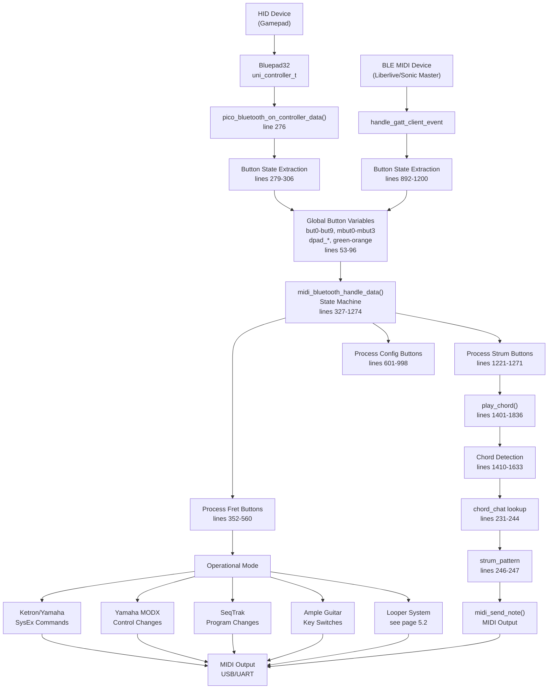
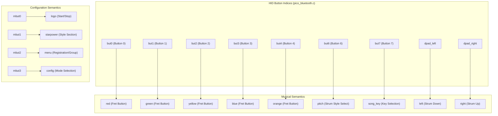
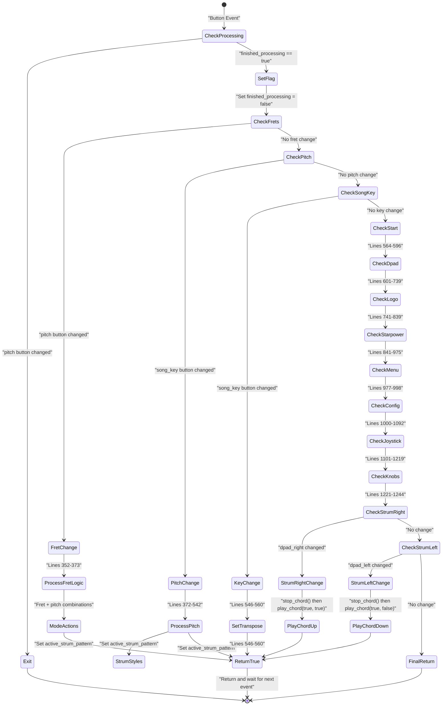
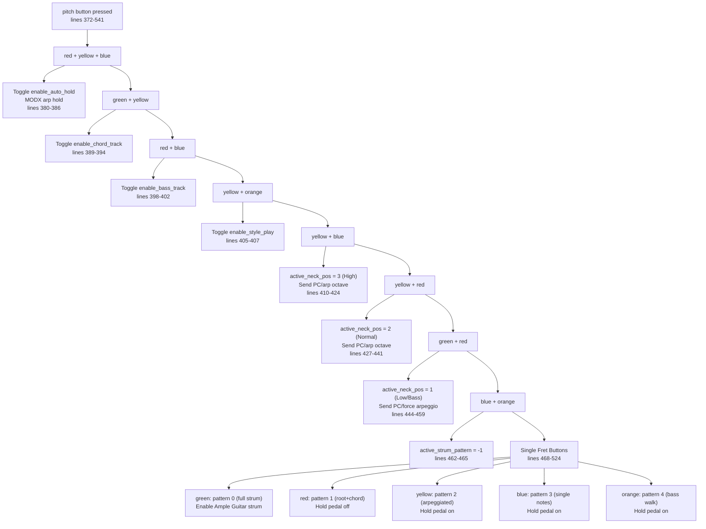
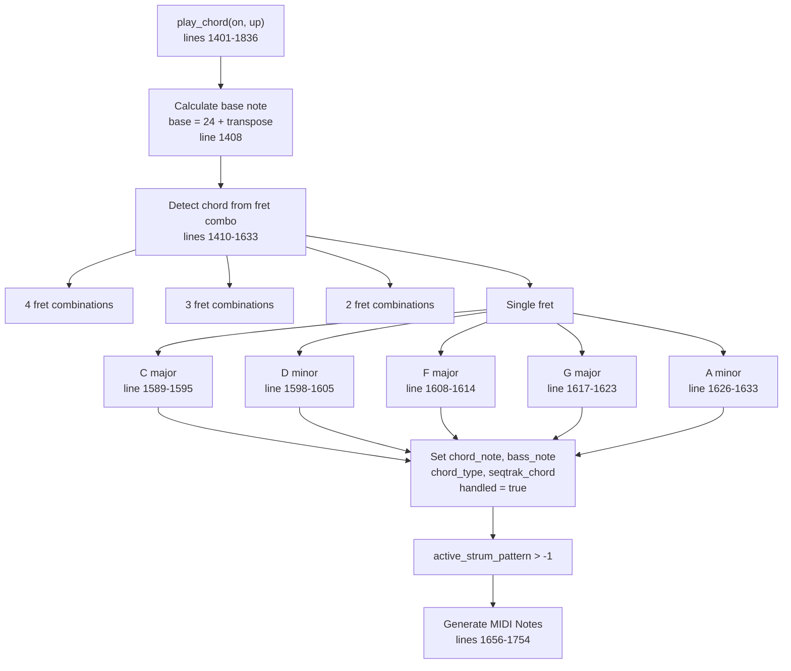

# HID to MIDI Translation

> **Relevant source files**
> * [btstack_config.h](https://github.com/Jus-Be/orinayo-pico/blob/6dde5a75/btstack_config.h)
> * [debug.h](https://github.com/Jus-Be/orinayo-pico/blob/6dde5a75/debug.h)
> * [pico_bluetooth.c](https://github.com/Jus-Be/orinayo-pico/blob/6dde5a75/pico_bluetooth.c)
> * [pico_bluetooth.h](https://github.com/Jus-Be/orinayo-pico/blob/6dde5a75/pico_bluetooth.h)
> * [sdkconfig.h](https://github.com/Jus-Be/orinayo-pico/blob/6dde5a75/sdkconfig.h)
> * [seqlock.h](https://github.com/Jus-Be/orinayo-pico/blob/6dde5a75/seqlock.h)

This page documents how gamepad controller button states are translated into MIDI commands in the Orinayo system. The translation occurs primarily in [pico_bluetooth.c](https://github.com/Jus-Be/orinayo-pico/blob/6dde5a75/pico_bluetooth.c)

 and handles both standard HID gamepad controllers (via Bluepad32) and specialized BLE MIDI devices (Liberlive, Sonic Master).

For information about chord generation algorithms and the `chord_chat` lookup table, see [Chord Generation System](./4.3-chord-generation-system.md). For details on the five operational modes that affect MIDI output, see [Operational Modes](./4.4-operational-modes.md). For specialized BLE MIDI device handling, see [Specialized MIDI Devices](./4.5-specialized-midi-devices.md).

## Overview

The HID to MIDI translation system acts as an interpreter between physical controller inputs and musical MIDI commands. It maintains button state variables, implements a complex state machine for processing button combinations, and generates appropriate MIDI messages based on the current operational mode.

**Key Components:**

* **Button State Variables**: Global variables tracking current button states.
* **State Machine**: `midi_bluetooth_handle_data()` processes button state changes.
* **Chord Detection**: `play_chord()` translates fret combinations to MIDI notes.
* **Mode Switching**: Configuration system enabling different musical behaviors.

Sources: [pico_bluetooth.c L1-L188](https://github.com/Jus-Be/orinayo-pico/blob/6dde5a75/pico_bluetooth.c#L1-L188)

## Data Flow Architecture

```mermaid
flowchart TD

HID["HID Device<br>(Gamepad)"]
BP32["Bluepad32<br>uni_controller_t"]
BLE["BLE MIDI Device<br>(Liberlive/Sonic Master)"]
GATT["handle_gatt_client_event"]
OnCtlData["pico_bluetooth_on_controller_data()<br>line 276"]
ExtractBLE["Button State Extraction<br>lines 892-1200"]
ExtractHID["Button State Extraction<br>lines 279-306"]
ButtonVars["Global Button Variables<br>but0-but9, mbut0-mbut3<br>dpad_*, green-orange<br>lines 53-96"]
StateMachine["midi_bluetooth_handle_data()<br>State Machine<br>lines 327-1274"]
ProcessFrets["Process Fret Buttons<br>lines 352-560"]
ProcessStrum["Process Strum Buttons<br>lines 1221-1271"]
ProcessConfig["Process Config Buttons<br>lines 601-998"]
ModeLogic["Operational Mode"]
PlayChord["play_chord()<br>lines 1401-1836"]
ChordDetect["Chord Detection<br>lines 1410-1633"]
ChordChat["chord_chat lookup<br>lines 231-244"]
StrumPattern["strum_pattern<br>lines 246-247"]
MidiSend["midi_send_note()<br>MIDI Output"]
ArrMidi["Ketron/Yamaha<br>SysEx Commands"]
ModxMidi["Yamaha MODX<br>Control Changes"]
SeqMidi["SeqTrak<br>Program Changes"]
AmpleMidi["Ample Guitar<br>Key Switches"]
DrumMidi["Looper System<br>see page 5.2"]
MidiOutput["MIDI Output<br>USB/UART"]

HID --> BP32
BLE --> GATT
BP32 --> OnCtlData
GATT --> ExtractBLE
OnCtlData --> ExtractHID
ExtractHID --> ButtonVars
ExtractBLE --> ButtonVars
ButtonVars --> StateMachine
StateMachine --> ProcessFrets
StateMachine --> ProcessStrum
StateMachine --> ProcessConfig
ProcessFrets --> ModeLogic
ProcessStrum --> PlayChord
PlayChord --> ChordDetect
ChordDetect --> ChordChat
ChordChat --> StrumPattern
StrumPattern --> MidiSend
ModeLogic --> ArrMidi
ModeLogic --> ModxMidi
ModeLogic --> SeqMidi
ModeLogic --> AmpleMidi
ModeLogic --> DrumMidi
ArrMidi --> MidiOutput
ModxMidi --> MidiOutput
SeqMidi --> MidiOutput
AmpleMidi --> MidiOutput
DrumMidi --> MidiOutput
MidiSend --> MidiOutput
```

Sources: [pico_bluetooth.c L276-L325](https://github.com/Jus-Be/orinayo-pico/blob/6dde5a75/pico_bluetooth.c#L276-L325)

 [pico_bluetooth.c L327-L1274](https://github.com/Jus-Be/orinayo-pico/blob/6dde5a75/pico_bluetooth.c#L327-L1274)

 [pico_bluetooth.c L1401-L1836](https://github.com/Jus-Be/orinayo-pico/blob/6dde5a75/pico_bluetooth.c#L1401-L1836)

 [pico_bluetooth.c L231-L244](https://github.com/Jus-Be/orinayo-pico/blob/6dde5a75/pico_bluetooth.c#L231-L244)

 [pico_bluetooth.c L246-L247](https://github.com/Jus-Be/orinayo-pico/blob/6dde5a75/pico_bluetooth.c#L246-L247)

## Button State Variables

The system maintains a comprehensive set of global variables to track controller state. These variables are updated from HID reports and read by the state machine.

### Primary Button Variables

| Variable Group | Variables | Purpose | Lines |
| --- | --- | --- | --- |
| **Face Buttons** | `but0` through `but9` | Generic button indices (A, B, X, Y, shoulder buttons, etc.) | [pico_bluetooth.c L70-L79](https://github.com/Jus-Be/orinayo-pico/blob/6dde5a75/pico_bluetooth.c#L70-L79) |
| **Misc Buttons** | `mbut0` through `mbut3` | System buttons (logo, start, menu, config) | [pico_bluetooth.c L81-L84](https://github.com/Jus-Be/orinayo-pico/blob/6dde5a75/pico_bluetooth.c#L81-L84) |
| **D-Pad** | `dpad_left`, `dpad_right`, `dpad_up`, `dpad_down` | Directional pad states | [pico_bluetooth.c L86-L89](https://github.com/Jus-Be/orinayo-pico/blob/6dde5a75/pico_bluetooth.c#L86-L89) |
| **Analog** | `joy_up`, `joy_down`, `knob_up`, `knob_down` | Analog stick/knob directions | [pico_bluetooth.c L91-L94](https://github.com/Jus-Be/orinayo-pico/blob/6dde5a75/pico_bluetooth.c#L91-L94) |
| **Fret Buttons** | `green`, `red`, `yellow`, `blue`, `orange` | Guitar Hero-style fret buttons | [pico_bluetooth.c L96-L100](https://github.com/Jus-Be/orinayo-pico/blob/6dde5a75/pico_bluetooth.c#L96-L100) |
| **Special** | `pitch`, `starpower`, `song_key` | Mode and action triggers | [pico_bluetooth.c L101-L103](https://github.com/Jus-Be/orinayo-pico/blob/6dde5a75/pico_bluetooth.c#L101-L103) |

### Button Semantic Mapping

The system maps generic button indices to semantic meanings. This bridges the gap between the `uni_controller_t` data and musical logic.

```mermaid
flowchart TD

mbut0["mbut0"]
logo["logo (Start/Stop)"]
mbut1["mbut1"]
starpower["starpower (Style Section)"]
mbut2["mbut2"]
menu["menu (Registration/Group)"]
mbut3["mbut3"]
config["config (Mode Selection)"]
but0["but0 (Button 0)"]
but1["but1 (Button 1)"]
but2["but2 (Button 2)"]
but3["but3 (Button 3)"]
but4["but4 (Button 4)"]
but6["but6 (Button 6)"]
but7["but7 (Button 7)"]
dpadL["dpad_left"]
dpadR["dpad_right"]
red["red (Fret Button)"]
green["green (Fret Button)"]
yellow["yellow (Fret Button)"]
blue["blue (Fret Button)"]
orange["orange (Fret Button)"]
pitch["pitch (Strum Style Select)"]
songkey["song_key (Key Selection)"]
left["left (Strum Down)"]
right["right (Strum Up)"]

but0 --> red
but1 --> green
but2 --> yellow
but3 --> blue
but4 --> orange
but6 --> pitch
but7 --> songkey
dpadL --> left
dpadR --> right

subgraph subGraph1 ["Musical Semantics"]
    red
    green
    yellow
    blue
    orange
    pitch
    songkey
    left
    right
end

subgraph subGraph0 ["HID Button Indices (pico_bluetooth.c)"]
    but0
    but1
    but2
    but3
    but4
    but6
    but7
    dpadL
    dpadR
end

subgraph subGraph2 ["Configuration Semantics"]
    mbut0
    logo
    mbut1
    starpower
    mbut2
    menu
    mbut3
    config
    mbut0 --> logo
    mbut1 --> starpower
    mbut2 --> menu
    mbut3 --> config
end
```

**Extraction Process:**

In `pico_bluetooth_on_controller_data()` [pico_bluetooth.c L276-L325](https://github.com/Jus-Be/orinayo-pico/blob/6dde5a75/pico_bluetooth.c#L276-L325)

:

1. Receive `uni_controller_t` from Bluepad32.
2. Extract button bitmask: `ctl->gamepad.buttons`.
3. Bit-shift to isolate individual buttons (lines 289-296).
4. Extract D-pad state: `ctl->gamepad.dpad` (lines 298-301).
5. Extract misc buttons: `ctl->gamepad.misc_buttons` (lines 303-306).
6. Derive analog directions from axis values (lines 279-287).
7. Call `midi_bluetooth_handle_data()` (line 310).

Sources: [pico_bluetooth.c L70-L103](https://github.com/Jus-Be/orinayo-pico/blob/6dde5a75/pico_bluetooth.c#L70-L103)

 [pico_bluetooth.c L276-L325](https://github.com/Jus-Be/orinayo-pico/blob/6dde5a75/pico_bluetooth.c#L276-L325)

## Main State Machine

The `midi_bluetooth_handle_data()` function implements a large sequential state machine that processes button state changes in priority order. It uses early returns to ensure only one action is processed per invocation.

```mermaid
stateDiagram-v2
    [*] --> CheckProcessing : "Button Event"
    CheckProcessing --> Exit : "pitch button changed"
    CheckProcessing --> SetFlag : "finished_processing == true"
    SetFlag --> CheckFrets : "Set finished_processing = false"
    CheckFrets --> FretChange : "pitch button changed"
    CheckFrets --> CheckPitch : "No fret change"
    FretChange --> ProcessFretLogic : "Lines 352-373"
    ProcessFretLogic --> ModeActions : "Fret + pitch combinations"
    ModeActions --> ReturnTrue : "Set active_strum_pattern"
    CheckPitch --> PitchChange : "song_key button changed"
    CheckPitch --> CheckSongKey : "No pitch change"
    PitchChange --> ProcessPitch : "Lines 372-542"
    ProcessPitch --> StrumStyles : "Set active_strum_pattern"
    ProcessPitch --> ReturnTrue : "Set active_strum_pattern"
    CheckSongKey --> KeyChange : "song_key button changed"
    CheckSongKey --> CheckStart : "No key change"
    KeyChange --> SetTranspose : "Lines 546-560"
    SetTranspose --> ReturnTrue : "Lines 546-560"
    CheckStart --> CheckDpad : "Lines 564-596"
    CheckDpad --> CheckLogo : "Lines 601-739"
    CheckLogo --> CheckStarpower : "Lines 741-839"
    CheckStarpower --> CheckMenu : "Lines 841-975"
    CheckMenu --> CheckConfig : "Lines 977-998"
    CheckConfig --> CheckJoystick : "Lines 1000-1092"
    CheckJoystick --> CheckKnobs : "Lines 1101-1219"
    CheckKnobs --> CheckStrumRight : "Lines 1221-1244"
    CheckStrumRight --> StrumRightChange : "dpad_right changed"
    CheckStrumRight --> CheckStrumLeft : "No change"
    StrumRightChange --> PlayChordUp : "stop_chord() then play_chord(true, true)"
    PlayChordUp --> ReturnTrue
    CheckStrumLeft --> StrumLeftChange : "dpad_left changed"
    CheckStrumLeft --> FinalReturn : "No change"
    StrumLeftChange --> PlayChordDown : "stop_chord() then play_chord(true, false)"
    PlayChordDown --> ReturnTrue
    ReturnTrue --> [*] : "Return and wait for next event"
    FinalReturn --> [*]
    Exit --> [*]
```

**Processing Sequence:**

1. **Gate Check** (lines 328-329): Return immediately if previous processing incomplete (`finished_processing` flag).
2. **Fret Buttons** (lines 352-541): Highest priority - updates `green`, `red`, `yellow`, `blue`, `orange`.
3. **Pitch Button** (lines 372-542): Processes strum pattern selection with fret modifiers.
4. **Song Key** (lines 546-560): Direct key transposition via fret + `but7`.
5. **Logo Button** (lines 601-739): Start/stop sequencer or arranger.
6. **Starpower** (lines 741-839): Style section selection (Intro, Fill, etc.).
7. **Menu Button** (lines 841-975): Registration/style group selection.
8. **Config Button** (lines 977-998): Operational mode switching.
9. **Joystick** (lines 1000-1092): Tempo presets or fill-in triggers.
10. **Knobs** (lines 1101-1219): Ghost note intensity, recording mode.
11. **Strum Buttons** (lines 1221-1271): Lowest priority - triggers chord playback via `play_chord()`.

Sources: [pico_bluetooth.c L327-L1274](https://github.com/Jus-Be/orinayo-pico/blob/6dde5a75/pico_bluetooth.c#L327-L1274)

## Fret Button Processing

Fret buttons are the primary musical input mechanism. They are processed with the pitch button to determine strum patterns and chord shapes.

### Fret + Pitch Combinations

When `pitch` (`but6`) is pressed with fret combinations, various musical actions occur:

```mermaid
flowchart TD

PitchPress["pitch button pressed<br>lines 372-541"]
CheckRYB["red + yellow + blue"]
AutoHold["Toggle enable_auto_hold<br>MODX arp hold<br>lines 380-386"]
CheckGY["green + yellow"]
ChordTrack["Toggle enable_chord_track<br>lines 389-394"]
CheckRB["red + blue"]
BassTrack["Toggle enable_bass_track<br>lines 398-402"]
CheckYO["yellow + orange"]
StylePlay["Toggle enable_style_play<br>lines 405-407"]
CheckYB["yellow + blue"]
High["active_neck_pos = 3 (High)<br>Send PC/arp octave<br>lines 410-424"]
CheckYR["yellow + red"]
Normal["active_neck_pos = 2 (Normal)<br>Send PC/arp octave<br>lines 427-441"]
CheckGR["green + red"]
Low["active_neck_pos = 1 (Low/Bass)<br>Send PC/force arpeggio<br>lines 444-459"]
CheckBO["blue + orange"]
SpecialStrum["active_strum_pattern = -1<br>lines 462-465"]
SingleFret["Single Fret Buttons<br>lines 468-524"]
Green["green: pattern 0 (full strum)<br>Enable Ample Guitar strum"]
Red["red: pattern 1 (root+chord)<br>Hold pedal off"]
Yellow["yellow: pattern 2 (arpeggiated)<br>Hold pedal on"]
Blue["blue: pattern 3 (single notes)<br>Hold pedal on"]
Orange["orange: pattern 4 (bass walk)<br>Hold pedal on"]

PitchPress --> CheckRYB
CheckRYB --> AutoHold
CheckRYB --> CheckGY
CheckGY --> ChordTrack
CheckGY --> CheckRB
CheckRB --> BassTrack
CheckRB --> CheckYO
CheckYO --> StylePlay
CheckYO --> CheckYB
CheckYB --> High
CheckYB --> CheckYR
CheckYR --> Normal
CheckYR --> CheckGR
CheckGR --> Low
CheckGR --> CheckBO
CheckBO --> SpecialStrum
CheckBO --> SingleFret
SingleFret --> Green
SingleFret --> Red
SingleFret --> Yellow
SingleFret --> Blue
SingleFret --> Orange
```

**Active Neck Position:**

The `active_neck_pos` variable [pico_bluetooth.c L123](https://github.com/Jus-Be/orinayo-pico/blob/6dde5a75/pico_bluetooth.c#L123-L123)

 determines the octave range for chord playback:

* `1`: Low/Bass position.
* `2`: Normal position (default).
* `3`: High position.

Sources: [pico_bluetooth.c L372-L541](https://github.com/Jus-Be/orinayo-pico/blob/6dde5a75/pico_bluetooth.c#L372-L541)

 [pico_bluetooth.c L123](https://github.com/Jus-Be/orinayo-pico/blob/6dde5a75/pico_bluetooth.c#L123-L123)

## Strum Button Processing

Strum buttons (d-pad left/right) trigger chord playback. They are processed last in the state machine to allow fret button changes to take precedence.

```mermaid
sequenceDiagram
  participant User
  participant midi_bluetooth_handle_data
  participant stop_chord()
  participant play_chord()
  participant MIDI Output

  User->>midi_bluetooth_handle_data: dpad_right pressed (strum up)
  note over midi_bluetooth_handle_data: lines 1221-1244
  midi_bluetooth_handle_data->>midi_bluetooth_handle_data: Set strum_neutral = false
  loop [!enable_auto_hold]
    midi_bluetooth_handle_data->>stop_chord(): Stop previous chord
    stop_chord()->>MIDI Output: Note Off messages
    midi_bluetooth_handle_data->>play_chord(): play_chord(true, true)
    note over play_chord(): up = true parameter
    play_chord()->>play_chord(): Chord detection (fret combination)
    play_chord()->>play_chord(): strum_pattern lookup
    play_chord()->>MIDI Output: Note On (velocity descending)
  end
  User->>midi_bluetooth_handle_data: dpad_right released
  midi_bluetooth_handle_data->>midi_bluetooth_handle_data: Set strum_neutral = true
```

**Strum Neutral State:**

The `strum_neutral` boolean [pico_bluetooth.c L41](https://github.com/Jus-Be/orinayo-pico/blob/6dde5a75/pico_bluetooth.c#L41-L41)

 tracks whether the strum paddle is in neutral position:

* Set to `false` when strum pressed (lines 1225, 1251).
* Set to `true` when strum released (lines 1230, 1256).

Sources: [pico_bluetooth.c L1221-L1271](https://github.com/Jus-Be/orinayo-pico/blob/6dde5a75/pico_bluetooth.c#L1221-L1271)

 [pico_bluetooth.c L41](https://github.com/Jus-Be/orinayo-pico/blob/6dde5a75/pico_bluetooth.c#L41-L41)

## Chord Detection and MIDI Generation

The `play_chord()` function translates fret button combinations into MIDI note sequences. It uses the `chord_chat` lookup table and `strum_pattern` arrays.

### Chord Detection Logic

```mermaid
flowchart TD

PlayChord["play_chord(on, up)<br>lines 1401-1836"]
CalcBase["Calculate base note<br>base = 24 + transpose<br>line 1408"]
DetectChord["Detect chord from fret combo<br>lines 1410-1633"]
FourFret["4 fret combinations"]
ThreeFret["3 fret combinations"]
TwoFret["2 fret combinations"]
OneFret["Single fret"]
C["C major<br>line 1589-1595"]
Dm["D minor<br>line 1598-1605"]
F["F major<br>line 1608-1614"]
G["G major<br>line 1617-1623"]
Am["A minor<br>line 1626-1633"]
SetVars["Set chord_note, bass_note<br>chord_type, seqtrak_chord<br>handled = true"]
CheckPattern["active_strum_pattern > -1"]
GenerateNotes["Generate MIDI Notes<br>lines 1656-1754"]

PlayChord --> CalcBase
CalcBase --> DetectChord
DetectChord --> FourFret
DetectChord --> ThreeFret
DetectChord --> TwoFret
DetectChord --> OneFret
OneFret --> C
OneFret --> Dm
OneFret --> F
OneFret --> G
OneFret --> Am
C --> SetVars
Dm --> SetVars
F --> SetVars
G --> SetVars
Am --> SetVars
SetVars --> CheckPattern
CheckPattern --> GenerateNotes
```

**Strum Pattern Array:**

The `strum_pattern` array [pico_bluetooth.c L246-L247](https://github.com/Jus-Be/orinayo-pico/blob/6dde5a75/pico_bluetooth.c#L246-L247)

 defines which strings to play for each pattern:

* **Pattern 0** (green): Full 6-string strum `{6,5,4,3,2,1}`.
* **Pattern 1** (red): Root+chord patterns.
* **Pattern 2** (yellow): Arpeggiated patterns.

Sources: [pico_bluetooth.c L1401-L1836](https://github.com/Jus-Be/orinayo-pico/blob/6dde5a75/pico_bluetooth.c#L1401-L1836)

 [pico_bluetooth.c L246-L247](https://github.com/Jus-Be/orinayo-pico/blob/6dde5a75/pico_bluetooth.c#L246-L247)

 [pico_bluetooth.c L231-L244](https://github.com/Jus-Be/orinayo-pico/blob/6dde5a75/pico_bluetooth.c#L231-L244)

## BLE MIDI Device Handling

Specialized BLE MIDI devices (Liberlive, Sonic Master) bypass the standard HID gamepad path and are handled directly in `ble_midi_controller.c`. The `pico_bluetooth.c` file does not directly contain the GATT client event handling logic for these devices. Instead, it relies on the `ble_midi_controller.h` [pico_bluetooth.c L2](https://github.com/Jus-Be/orinayo-pico/blob/6dde5a75/pico_bluetooth.c#L2-L2)

 module.

Sources: [pico_bluetooth.c L2](https://github.com/Jus-Be/orinayo-pico/blob/6dde5a75/pico_bluetooth.c#L2-L2)

## Summary: Key Translation Functions

| Function | Location | Purpose |
| --- | --- | --- |
| `pico_bluetooth_on_controller_data()` | [pico_bluetooth.c L276-L325](https://github.com/Jus-Be/orinayo-pico/blob/6dde5a75/pico_bluetooth.c#L276-L325) | Entry point for HID gamepad data. |
| `midi_bluetooth_handle_data()` | [pico_bluetooth.c L327-L1274](https://github.com/Jus-Be/orinayo-pico/blob/6dde5a75/pico_bluetooth.c#L327-L1274) | Main state machine for button processing. |
| `play_chord()` | [pico_bluetooth.c L1401-L1836](https://github.com/Jus-Be/orinayo-pico/blob/6dde5a75/pico_bluetooth.c#L1401-L1836) | Chord detection and MIDI note generation. |
| `stop_chord()` | [pico_bluetooth.c L216](https://github.com/Jus-Be/orinayo-pico/blob/6dde5a75/pico_bluetooth.c#L216-L216) | Send Note Off messages for active chord. |
| `config_guitar()` | [pico_bluetooth.c L201](https://github.com/Jus-Be/orinayo-pico/blob/6dde5a75/pico_bluetooth.c#L201-L201) | Switch operational modes. |
| `ble_midi_client_scan_end()` | [pico_bluetooth.c L228](https://github.com/Jus-Be/orinayo-pico/blob/6dde5a75/pico_bluetooth.c#L228-L228) | Placeholder for BLE MIDI client interaction. Actual GATT event handling is in `ble_midi_controller.c`. |

Sources: [pico_bluetooth.c L1-L2006](https://github.com/Jus-Be/orinayo-pico/blob/6dde5a75/pico_bluetooth.c#L1-L2006)