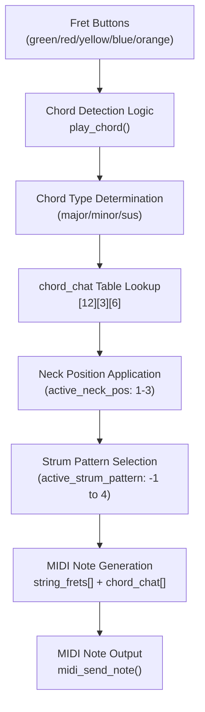
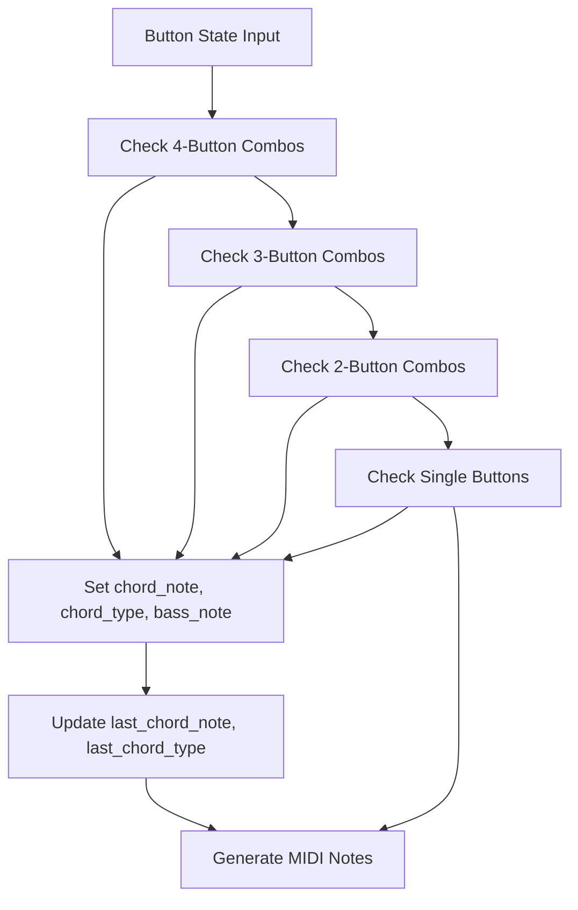
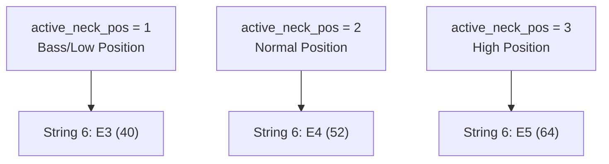
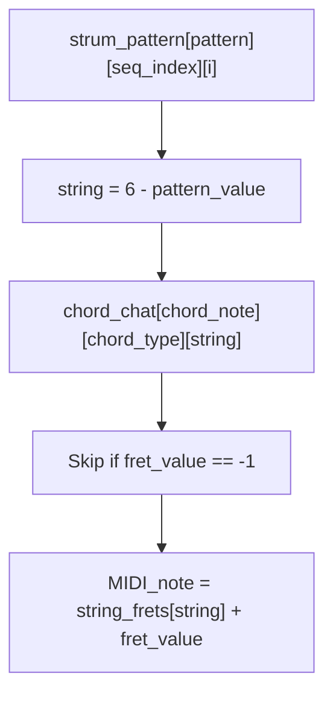
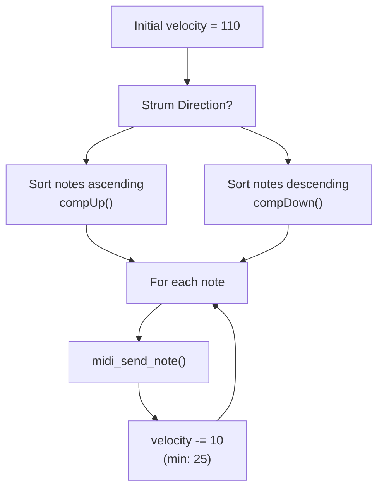
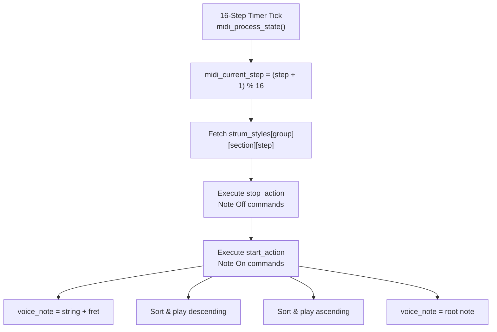
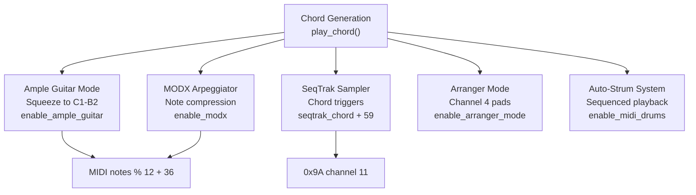

# Chord Generation System

> **Relevant source files**
> * [main.c](https://github.com/Jus-Be/orinayo-pico/blob/122fa496/main.c)
> * [pico_bluetooth.c](https://github.com/Jus-Be/orinayo-pico/blob/122fa496/pico_bluetooth.c)

## Purpose and Scope

This document describes the chord generation system in `pico_bluetooth.c`, which translates guitar controller fret button combinations into MIDI chord notes. The system uses a lookup table (`chord_chat`) to map guitar fingering patterns to actual note values, supports multiple chord types (major, minor, suspended), and adapts output based on neck position and strum pattern selections.

For information about how button states are captured from the controller, see [HID to MIDI Translation](./4.2-hid-to-midi-translation.md). For details on the different operational modes that consume chord data, see [Operational Modes](./4.4-operational-modes.md).

---

## System Overview

The chord generation system operates as a multi-stage pipeline that converts button combinations into precise MIDI note sequences:



**Sources:** [pico_bluetooth.c L1401-L1836](https://github.com/Jus-Be/orinayo-pico/blob/122fa496/pico_bluetooth.c#L1401-L1836)

---

## Chord Detection Logic

The `play_chord()` function maps button combinations to specific chords. The system recognizes 31 different chord fingerings, including slash chords and suspended chords.

### Button Combination Mappings

The following table shows the primary chord mappings:

| Buttons | Chord | Notes (relative to base) | Chord Type | seqtrak_chord |
| --- | --- | --- | --- | --- |
| yellow | C | base, base+4, base+7 | Major (0) | 1 |
| blue | Dm | base+2, base+5, base+9 | Minor (1) | 2 |
| orange | F | base-7, base+9, base+12 | Major (0) | 4 |
| green | G | base-5, base+11, base+14 | Major (0) | 5 |
| red | Am | base-3, base+12, base+16 | Minor (1) | 6 |
| red+blue | D | base+2, base+6, base+9 | Major (0) | 0 |
| green+red | G/B | base-13, base+7, base+11, base+14 | Slash | 5 |
| green+blue | Em | base-8, base+7, base+11 | Minor (1) | 3 |
| yellow+blue | C/E | base-20, base, base+4, base+7 | Slash | 1 |
| green+yellow | Gsus | base-5, base+12, base+14 | Sus (2) | 5 |
| orange+yellow | Csus | base, base+5, base+7 | Sus (2) | 1 |
| red+yellow | Bb | base-2, base+2, base+5 | Major (0) | 7 |

Complex four-button combinations support additional slash chords like F/C, G/C, and others.

**Sources:** [pico_bluetooth.c L1401-L1633](https://github.com/Jus-Be/orinayo-pico/blob/122fa496/pico_bluetooth.c#L1401-L1633)

### Chord Detection Flow



**Sources:** [pico_bluetooth.c L1401-L1654](https://github.com/Jus-Be/orinayo-pico/blob/122fa496/pico_bluetooth.c#L1401-L1654)

---

## The chord_chat Lookup Table

The `chord_chat` table is a three-dimensional array that stores guitar fingering positions: `[12][3][6]`, representing [root note][chord type][string].

### Table Structure

```
int chord_chat[12][3][6]
```

* **Dimension 1 (12):** Root note (0=C, 1=C#/Db, 2=D, ..., 11=B)
* **Dimension 2 (3):** Chord type (0=Major, 1=Minor, 2=Suspended)
* **Dimension 3 (6):** Guitar string (0=6th/low E, 5=1st/high E)

Each value represents the fret number to press on that string, or `-1` if the string is not played.

### Example: C Major Chord

```
chord_chat[0][0] = {3, 3, 2, 0, 1, 0}
```

This represents:

* String 6 (E): Fret 3 (G)
* String 5 (A): Fret 3 (C)
* String 4 (D): Fret 2 (E)
* String 3 (G): Fret 0 (G)
* String 2 (B): Fret 1 (C)
* String 1 (E): Fret 0 (E)

### Chord Type Index Mapping

| Index | Type | Description |
| --- | --- | --- |
| 0 | Major | Standard major triad |
| 1 | Minor | Minor triad (flattened 3rd) |
| 2 | Suspended | Suspended 4th chord |

**Sources:** [pico_bluetooth.c L138-L151](https://github.com/Jus-Be/orinayo-pico/blob/122fa496/pico_bluetooth.c#L138-L151)

---

## Neck Positions and Octave Ranges

The `active_neck_pos` variable (1-3) controls the octave range of generated notes, simulating different positions on a guitar neck.

### Neck Position Configuration



### String Frequency Calculation

The base string frequencies are calculated using the formula:

```
int O = 12;  // Octave offset (12 semitones)
int E = 4, A = 9, D = 2, G = 7, B = 11;  // Note values

int __6th = E + O*(active_neck_pos+2);  // Low E string
int __5th = A + O*(active_neck_pos+2);  // A string
int __4th = D + O*(active_neck_pos+2);  // D string
int __3rd = G + O*(active_neck_pos+2);  // G string
int __2nd = B + O*(active_neck_pos+2);  // B string
int __1st = E + O*(active_neck_pos+3);  // High E string (one octave higher)
```

### MIDI Note Calculation

The final MIDI note for each string is:

```
MIDI_note = string_base_frequency + chord_chat[chord_note % 12][chord_type][string_index]
```

**Example:** For C major at normal position (active_neck_pos=2):

* String 6: 52 (E4) + 3 = 55 (G4)
* String 5: 57 (A4) + 3 = 60 (C5)
* String 4: 50 (D4) + 2 = 52 (E4)

**Sources:** [pico_bluetooth.c L1635-L1638](https://github.com/Jus-Be/orinayo-pico/blob/122fa496/pico_bluetooth.c#L1635-L1638)

 [pico_bluetooth.c L1891-L1893](https://github.com/Jus-Be/orinayo-pico/blob/122fa496/pico_bluetooth.c#L1891-L1893)

---

## Strum Pattern System

The `strum_pattern` array defines which strings to play in what order for different playing styles.

### Strum Pattern Array Structure

```
uint8_t strum_pattern[5][12][6]
```

* **Dimension 1 (5):** Pattern type (-1 to 4, indexed 0-4)
* **Dimension 2 (12):** Sequence step
* **Dimension 3 (6):** String play order

### Pattern Types

| active_strum_pattern | Description | Use Case |
| --- | --- | --- |
| -1 | No chord data | Pattern-based arpeggiator |
| 0 | Full strum | All 6 strings in sequence |
| 1 | Strum with bass | 4 strings, bass emphasis |
| 2 | Arpeggio up | Individual string picking |
| 3 | Arpeggio down | Reverse picking |
| 4 | Complex arpeggio | Advanced picking pattern |

### Pattern Decoding Logic



### Example: Pattern 0 (Full Strum)

```python
strum_pattern[0][0] = {6,5,4,3,2,1}  // Play all strings from 6th to 1st
```

The system iterates through this pattern, converting each value to a string index:

* `6 - 6 = 0` → String 6 (low E)
* `6 - 5 = 1` → String 5 (A)
* `6 - 4 = 2` → String 4 (D)
* ... and so on

**Sources:** [pico_bluetooth.c L153-L159](https://github.com/Jus-Be/orinayo-pico/blob/122fa496/pico_bluetooth.c#L153-L159)

 [pico_bluetooth.c L1676-L1696](https://github.com/Jus-Be/orinayo-pico/blob/122fa496/pico_bluetooth.c#L1676-L1696)

---

## Note Generation and Velocity Dynamics

The system generates MIDI notes with dynamic velocity based on strum direction and position.

### Velocity Calculation



### Special Note Handling

**Bass Note Generation (Downstroke with Auto-Strum):**

```
if (!up && enable_midi_drums && active_strum_pattern == 0) {
    note = ((bass_note ? bass_note : chord_note) % 12) + (O * (active_neck_pos + 1));
    if ((note % 12) > 4) note = note - 12;  // Lower octave for bass
    
    midi_send_program_change(0xC0, 33);  // Bass program
    midi_send_note(0x90, note, 120);
    midi_send_program_change(0xC0, guitar_pc_code);  // Restore guitar
}
```

**Ample Guitar Compatibility:**
When `enable_ample_guitar` is active and notes are below MIDI 40, they are transposed up one octave:

```
if (enable_ample_guitar && note < 40) note = note + 12;
```

**Sources:** [pico_bluetooth.c L1698-L1741](https://github.com/Jus-Be/orinayo-pico/blob/122fa496/pico_bluetooth.c#L1698-L1741)

 [pico_bluetooth.c L1710-L1714](https://github.com/Jus-Be/orinayo-pico/blob/122fa496/pico_bluetooth.c#L1710-L1714)

 [pico_bluetooth.c L1726-L1737](https://github.com/Jus-Be/orinayo-pico/blob/122fa496/pico_bluetooth.c#L1726-L1737)

---

## Auto-Strum System (Sequenced Playback)

When `enable_midi_drums` is active with `active_strum_pattern == 0`, the system plays pre-programmed strum patterns synchronized to the beat.

### Strum Styles Array

```
uint8_t strum_styles[5][5][16][3]
```

* **Dimension 1 (5):** Style group (0-4)
* **Dimension 2 (5):** Style section (0-4)
* **Dimension 3 (16):** Step in 16-step sequence
* **Dimension 4 (3):** [start_action, stop_action, velocity]

### Action Codes

| Code | Action | Description |
| --- | --- | --- |
| 62-71 | Single string | Play individual strings 6-1 |
| 72, 74 | Strum down | Full chord descending |
| 76 | Strum up | Full chord ascending |
| 77, 78 | Voice note | Play root note |
| 79, 81 | Muted strum down | Muted chord descending |
| 83 | Muted strum up | Muted chord ascending |

### Processing Flow



**Sources:** [pico_bluetooth.c L161-L197](https://github.com/Jus-Be/orinayo-pico/blob/122fa496/pico_bluetooth.c#L161-L197)

 [pico_bluetooth.c L1890-L2006](https://github.com/Jus-Be/orinayo-pico/blob/122fa496/pico_bluetooth.c#L1890-L2006)

---

## Integration with Other Systems

### Chord Data Consumers



**Sources:** [pico_bluetooth.c L1401-L1836](https://github.com/Jus-Be/orinayo-pico/blob/122fa496/pico_bluetooth.c#L1401-L1836)

 [main.c L609-L688](https://github.com/Jus-Be/orinayo-pico/blob/122fa496/main.c#L609-L688)

### State Variables

The system maintains state through several global variables:

| Variable | Type | Purpose |
| --- | --- | --- |
| `last_chord_note` | `int` | Last detected chord root note (0-11) |
| `last_chord_type` | `int` | Last chord type (0=maj, 1=min, 2=sus) |
| `active_neck_pos` | `int` | Current neck position (1-3) |
| `active_strum_pattern` | `int` | Current strum pattern (-1 to 4) |
| `seqtrak_chord` | `int` | SeqTrak chord index (0-7) |
| `old_midinotes[6]` | `uint8_t[]` | Previously played notes for note-off |
| `chord_notes[6]` | `uint8_t[]` | Current chord notes in auto-strum |
| `mute_midinotes[6]` | `uint8_t[]` | Muted notes buffer |
| `voice_note` | `uint8_t` | Single voice note in auto-strum |

**Sources:** [pico_bluetooth.c L90-L108](https://github.com/Jus-Be/orinayo-pico/blob/122fa496/pico_bluetooth.c#L90-L108)

 [pico_bluetooth.c L1635-L1649](https://github.com/Jus-Be/orinayo-pico/blob/122fa496/pico_bluetooth.c#L1635-L1649)

---

## Summary

The chord generation system provides a sophisticated mapping from guitar controller buttons to MIDI note sequences. The `chord_chat` lookup table enables realistic guitar voicings, while the strum pattern system and neck position controls offer flexibility in performance style. The auto-strum feature adds rhythmic playback synchronized with the drum looper, creating a complete backing track system.

**Sources:** [pico_bluetooth.c L1-L2006](https://github.com/Jus-Be/orinayo-pico/blob/122fa496/pico_bluetooth.c#L1-L2006)

 [main.c L1-L697](https://github.com/Jus-Be/orinayo-pico/blob/122fa496/main.c#L1-L697)