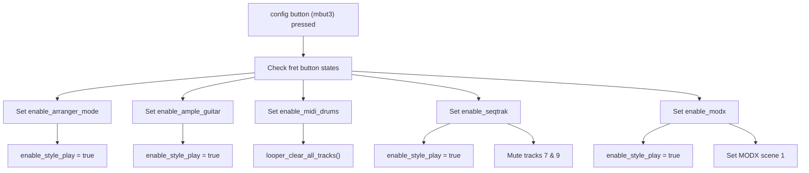
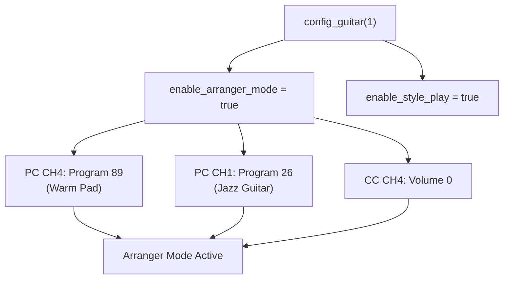
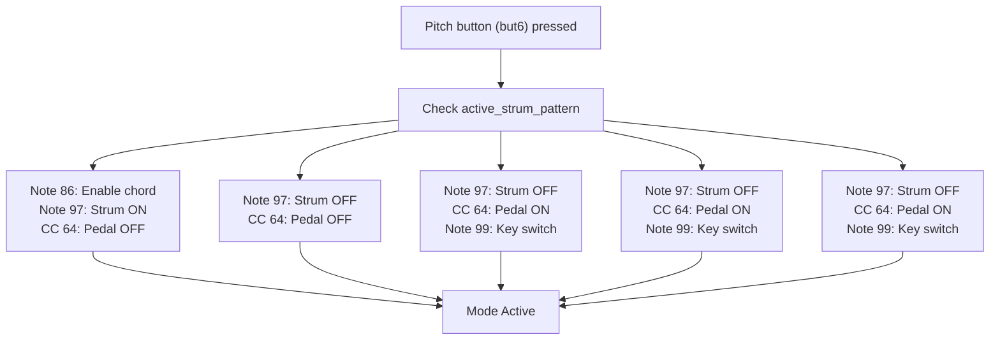
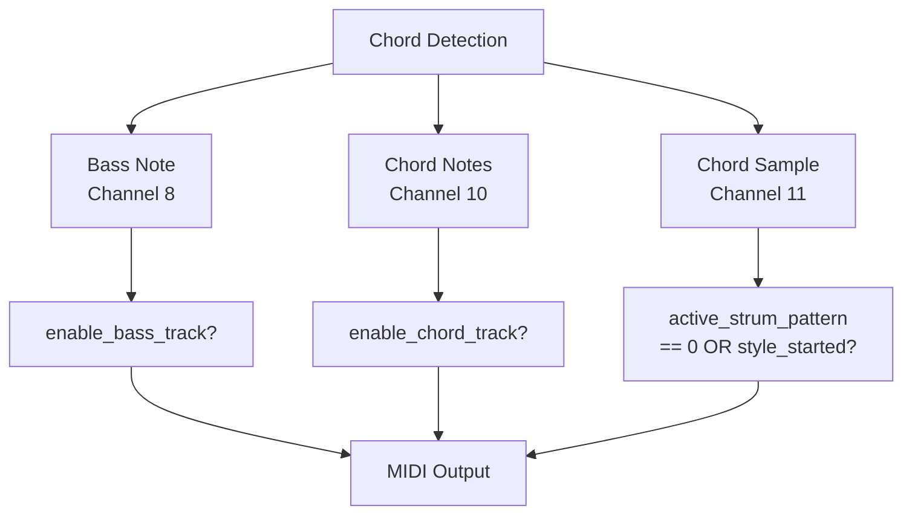
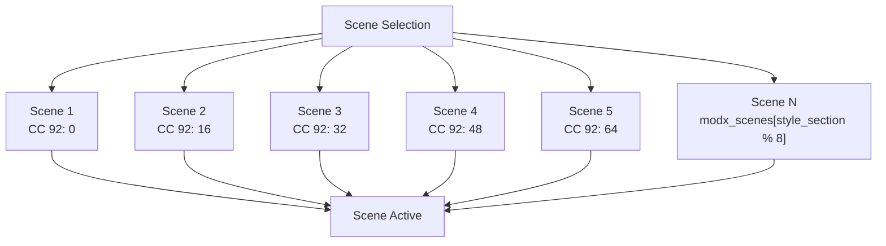
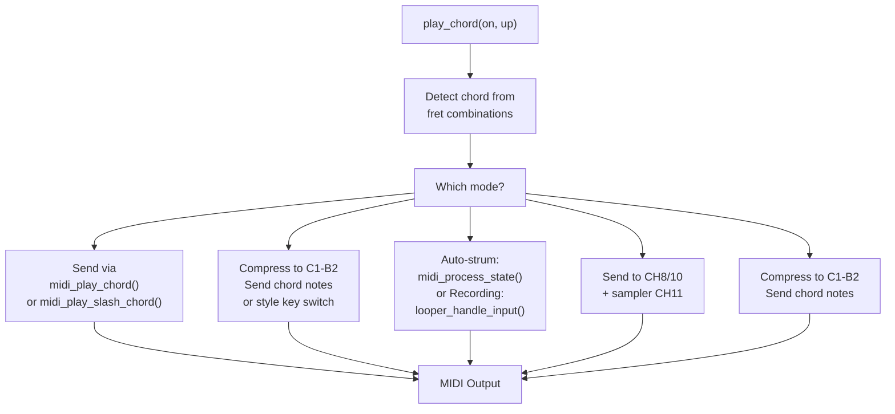

# Operational Modes

> **Relevant source files**
> * [main.c](https://github.com/Jus-Be/orinayo-pico/blob/122fa496/main.c)
> * [pico_bluetooth.c](https://github.com/Jus-Be/orinayo-pico/blob/122fa496/pico_bluetooth.c)

This document describes the five mutually-exclusive operational modes that determine how the Orinayo system interprets button inputs and generates MIDI output. Each mode is optimized for controlling a specific type of synthesizer or software instrument. The mode is selected at runtime by pressing the config button (mbut3) combined with fret buttons.

For information about how button states are mapped to MIDI commands, see [HID to MIDI Translation](./4.2-hid-to-midi-translation.md). For details on the chord generation system used across all modes, see [Chord Generation System](./4.3-chord-generation-system.md).

---

## Mode Selection Mechanism

All five operational modes are controlled by boolean flags that are toggled via the `config_guitar()` function. Pressing the config button (mbut3) with specific fret button combinations activates a mode.



**Sources:** [pico_bluetooth.c L977-L998](https://github.com/Jus-Be/orinayo-pico/blob/122fa496/pico_bluetooth.c#L977-L998)

 [pico_bluetooth.c L1309-L1399](https://github.com/Jus-Be/orinayo-pico/blob/122fa496/pico_bluetooth.c#L1309-L1399)

---

## Mode Comparison Matrix

| Feature | Arranger | Ample Guitar | MIDI Drums | SeqTrak | MODX |
| --- | --- | --- | --- | --- | --- |
| **Flag Variable** | `enable_arranger_mode` | `enable_ample_guitar` | `enable_midi_drums` | `enable_seqtrak` | `enable_modx` |
| **Primary Use Case** | Ketron/Yamaha Arrangers | Guitar VST Plugin | Drum Sequencer | Yamaha SeqTrak | Yamaha MODX Synth |
| **MIDI Channels** | CH1, CH4 | CH1, CH4 | CH1 (drums CH10) | CH8-11 | CH1-4 |
| **Style Control** | Via SysEx | Via Key Switches | Via Looper State | Via SysEx Patterns | Via Scenes |
| **Chord Playback** | `enable_style_play` | `enable_style_play` | Auto-strum only | `enable_style_play` | `enable_style_play` |
| **Activation Code** | Green + Config | Red + Config | Yellow + Config | Blue + Config | Orange + Config |

**Sources:** [pico_bluetooth.c L32-L38](https://github.com/Jus-Be/orinayo-pico/blob/122fa496/pico_bluetooth.c#L32-L38)

 [pico_bluetooth.c L1349-L1398](https://github.com/Jus-Be/orinayo-pico/blob/122fa496/pico_bluetooth.c#L1349-L1398)

---

## Mode 1: Arranger Mode

Arranger mode targets hardware keyboard arrangers from Ketron and Yamaha, sending manufacturer-specific SysEx messages to control accompaniment styles, sections, and fills.

### Configuration and Initialization

When arranger mode is activated via `config_guitar(1)`, the system:

1. Toggles `enable_arranger_mode` flag
2. Sets `enable_style_play = true` to enable chord generation
3. Sends Program Change to CH4 (warm pad, program 89)
4. Sends Program Change to CH1 (jazz guitar, program 26)
5. Sets CH4 volume to 0 (pads silent by default)



**Sources:** [pico_bluetooth.c L1349-L1360](https://github.com/Jus-Be/orinayo-pico/blob/122fa496/pico_bluetooth.c#L1349-L1360)

### Control Messages

Arranger mode uses two primary SysEx message types:

**Ketron Arranger Messages** (`midi_ketron_arr`):

* Format: `F0 26 79 05 00 [code] [value] F7`
* Controls style sections (0x03-0x06), fills (0x07-0x0A), returns (0x0B-0x0E), intro/endings (0x0F-0x11)

**Yamaha Arranger Messages** (`midi_yamaha_arr`):

* Format: `F0 43 7E 00 [code] [value] F7`
* Controls intro/endings (0x00-0x02), style sections (0x10-0x13), return (0x18), break (0x20-0x22)

### Button Mapping in Arranger Mode

| Button Combination | Action | Ketron Code | Yamaha Code |
| --- | --- | --- | --- |
| Logo (mbut0) | Start/Stop | 0x12 | 0x7A/0x7D |
| Logo + Yellow | Intro/End 1 | 0x0F | 0x00/0x20 |
| Logo + Red | Intro/End 2 | 0x10 | 0x01/0x21 |
| Logo + Green | Intro/End 3 | 0x11 | 0x02/0x22 |
| Logo + Blue | To End | 0x17 | 0x01 |
| Logo + Orange | Fade | 0x35 | 0x02 |
| Starpower (mbut1) + Green-Orange | Section A-D | 0x03-0x06 | 0x10-0x13 |
| Joystick Up | Fill | 0x07-0x0A | 0x10-0x13 |
| Knob Up | Return | 0x0B-0x0E | 0x18 |

**Sources:** [pico_bluetooth.c L598-L738](https://github.com/Jus-Be/orinayo-pico/blob/122fa496/pico_bluetooth.c#L598-L738)

 [pico_bluetooth.c L1080-L1088](https://github.com/Jus-Be/orinayo-pico/blob/122fa496/pico_bluetooth.c#L1080-L1088)

 [pico_bluetooth.c L1172-L1180](https://github.com/Jus-Be/orinayo-pico/blob/122fa496/pico_bluetooth.c#L1172-L1180)

 [main.c L524-L550](https://github.com/Jus-Be/orinayo-pico/blob/122fa496/main.c#L524-L550)

 [main.c L552-L582](https://github.com/Jus-Be/orinayo-pico/blob/122fa496/main.c#L552-L582)

---

## Mode 2: Ample Guitar Mode

Ample Guitar mode is designed for Ample Guitar VST plugins, using MIDI key switches and articulation notes to control guitar playing techniques.

### Key Switch System

Ample Guitar mode uses specific MIDI notes as key switches to change playing modes:



**Sources:** [pico_bluetooth.c L472-L524](https://github.com/Jus-Be/orinayo-pico/blob/122fa496/pico_bluetooth.c#L472-L524)

### Articulation Notes

When no fret buttons are pressed (no chord), Ample Guitar mode sends articulation notes based on neck position and strum pattern:

| Condition | Strum Down | Strum Up |
| --- | --- | --- |
| `active_neck_pos == 1` (Bass) | Note 95 | Note 94 |
| `active_strum_pattern == 0` | Note 93 | Note 94 |
| `active_strum_pattern == 1` | Note 95 | Note 94 |
| `active_strum_pattern > 1` | Play last chord | Play last chord |

### Sustain and Palm Mute

* **Joystick Up**: Note 24 (sustain guitar notes)
* **Knob Up**: Note 26 (palm mute guitar notes)

**Sources:** [pico_bluetooth.c L1757-L1781](https://github.com/Jus-Be/orinayo-pico/blob/122fa496/pico_bluetooth.c#L1757-L1781)

 [pico_bluetooth.c L1063-L1078](https://github.com/Jus-Be/orinayo-pico/blob/122fa496/pico_bluetooth.c#L1063-L1078)

 [pico_bluetooth.c L1167-L1180](https://github.com/Jus-Be/orinayo-pico/blob/122fa496/pico_bluetooth.c#L1167-L1180)

### Chord Note Compression

Ample Guitar mode compresses all chord notes into the C1-B2 range (MIDI notes 36-47) for optimal recognition:

```
if (enable_ample_guitar || enable_modx) {
    p1 = (p1 % 12) + 36;
    p2 = (p2 % 12) + ((p2 % 12) < (p1 % 12) ? 48 : 36);
    p3 = (p3 % 12) + ((p3 % 12) < (p1 % 12) ? 48 : 36);
}
```

**Sources:** [main.c L615-L619](https://github.com/Jus-Be/orinayo-pico/blob/122fa496/main.c#L615-L619)

 [main.c L654-L659](https://github.com/Jus-Be/orinayo-pico/blob/122fa496/main.c#L654-L659)

---

## Mode 3: MIDI Drums Mode

MIDI Drums mode transforms the controller into a drum pattern recorder and sequencer, using the looper system for pattern storage and the auto-strum engine for playback.

### Mode Activation Flow

```go
#mermaid-2kcbsjha6m3{font-family:ui-sans-serif,-apple-system,system-ui,Segoe UI,Helvetica;font-size:16px;fill:#333;}@keyframes edge-animation-frame{from{stroke-dashoffset:0;}}@keyframes dash{to{stroke-dashoffset:0;}}#mermaid-2kcbsjha6m3 .edge-animation-slow{stroke-dasharray:9,5!important;stroke-dashoffset:900;animation:dash 50s linear infinite;stroke-linecap:round;}#mermaid-2kcbsjha6m3 .edge-animation-fast{stroke-dasharray:9,5!important;stroke-dashoffset:900;animation:dash 20s linear infinite;stroke-linecap:round;}#mermaid-2kcbsjha6m3 .error-icon{fill:#dddddd;}#mermaid-2kcbsjha6m3 .error-text{fill:#222222;stroke:#222222;}#mermaid-2kcbsjha6m3 .edge-thickness-normal{stroke-width:1px;}#mermaid-2kcbsjha6m3 .edge-thickness-thick{stroke-width:3.5px;}#mermaid-2kcbsjha6m3 .edge-pattern-solid{stroke-dasharray:0;}#mermaid-2kcbsjha6m3 .edge-thickness-invisible{stroke-width:0;fill:none;}#mermaid-2kcbsjha6m3 .edge-pattern-dashed{stroke-dasharray:3;}#mermaid-2kcbsjha6m3 .edge-pattern-dotted{stroke-dasharray:2;}#mermaid-2kcbsjha6m3 .marker{fill:#999;stroke:#999;}#mermaid-2kcbsjha6m3 .marker.cross{stroke:#999;}#mermaid-2kcbsjha6m3 svg{font-family:ui-sans-serif,-apple-system,system-ui,Segoe UI,Helvetica;font-size:16px;}#mermaid-2kcbsjha6m3 p{margin:0;}#mermaid-2kcbsjha6m3 defs #statediagram-barbEnd{fill:#999;stroke:#999;}#mermaid-2kcbsjha6m3 g.stateGroup text{fill:#dddddd;stroke:none;font-size:10px;}#mermaid-2kcbsjha6m3 g.stateGroup text{fill:#333;stroke:none;font-size:10px;}#mermaid-2kcbsjha6m3 g.stateGroup .state-title{font-weight:bolder;fill:#333;}#mermaid-2kcbsjha6m3 g.stateGroup rect{fill:#ffffff;stroke:#dddddd;}#mermaid-2kcbsjha6m3 g.stateGroup line{stroke:#999;stroke-width:1;}#mermaid-2kcbsjha6m3 .transition{stroke:#999;stroke-width:1;fill:none;}#mermaid-2kcbsjha6m3 .stateGroup .composit{fill:#f4f4f4;border-bottom:1px;}#mermaid-2kcbsjha6m3 .stateGroup .alt-composit{fill:#e0e0e0;border-bottom:1px;}#mermaid-2kcbsjha6m3 .state-note{stroke:#e6d280;fill:#fff5ad;}#mermaid-2kcbsjha6m3 .state-note text{fill:#333;stroke:none;font-size:10px;}#mermaid-2kcbsjha6m3 .stateLabel .box{stroke:none;stroke-width:0;fill:#ffffff;opacity:0.5;}#mermaid-2kcbsjha6m3 .edgeLabel .label rect{fill:#ffffff;opacity:0.5;}#mermaid-2kcbsjha6m3 .edgeLabel{background-color:#ffffff;text-align:center;}#mermaid-2kcbsjha6m3 .edgeLabel p{background-color:#ffffff;}#mermaid-2kcbsjha6m3 .edgeLabel rect{opacity:0.5;background-color:#ffffff;fill:#ffffff;}#mermaid-2kcbsjha6m3 .edgeLabel .label text{fill:#333;}#mermaid-2kcbsjha6m3 .label div .edgeLabel{color:#333;}#mermaid-2kcbsjha6m3 .stateLabel text{fill:#333;font-size:10px;font-weight:bold;}#mermaid-2kcbsjha6m3 .node circle.state-start{fill:#999;stroke:#999;}#mermaid-2kcbsjha6m3 .node .fork-join{fill:#999;stroke:#999;}#mermaid-2kcbsjha6m3 .node circle.state-end{fill:#dddddd;stroke:#f4f4f4;stroke-width:1.5;}#mermaid-2kcbsjha6m3 .end-state-inner{fill:#f4f4f4;stroke-width:1.5;}#mermaid-2kcbsjha6m3 .node rect{fill:#ffffff;stroke:#dddddd;stroke-width:1px;}#mermaid-2kcbsjha6m3 .node polygon{fill:#ffffff;stroke:#dddddd;stroke-width:1px;}#mermaid-2kcbsjha6m3 #statediagram-barbEnd{fill:#999;}#mermaid-2kcbsjha6m3 .statediagram-cluster rect{fill:#ffffff;stroke:#dddddd;stroke-width:1px;}#mermaid-2kcbsjha6m3 .cluster-label,#mermaid-2kcbsjha6m3 .nodeLabel{color:#333;}#mermaid-2kcbsjha6m3 .statediagram-cluster rect.outer{rx:5px;ry:5px;}#mermaid-2kcbsjha6m3 .statediagram-state .divider{stroke:#dddddd;}#mermaid-2kcbsjha6m3 .statediagram-state .title-state{rx:5px;ry:5px;}#mermaid-2kcbsjha6m3 .statediagram-cluster.statediagram-cluster .inner{fill:#f4f4f4;}#mermaid-2kcbsjha6m3 .statediagram-cluster.statediagram-cluster-alt .inner{fill:#f8f8f8;}#mermaid-2kcbsjha6m3 .statediagram-cluster .inner{rx:0;ry:0;}#mermaid-2kcbsjha6m3 .statediagram-state rect.basic{rx:5px;ry:5px;}#mermaid-2kcbsjha6m3 .statediagram-state rect.divider{stroke-dasharray:10,10;fill:#f8f8f8;}#mermaid-2kcbsjha6m3 .note-edge{stroke-dasharray:5;}#mermaid-2kcbsjha6m3 .statediagram-note rect{fill:#fff5ad;stroke:#e6d280;stroke-width:1px;rx:0;ry:0;}#mermaid-2kcbsjha6m3 .statediagram-note rect{fill:#fff5ad;stroke:#e6d280;stroke-width:1px;rx:0;ry:0;}#mermaid-2kcbsjha6m3 .statediagram-note text{fill:#333;}#mermaid-2kcbsjha6m3 .statediagram-note .nodeLabel{color:#333;}#mermaid-2kcbsjha6m3 .statediagram .edgeLabel{color:red;}#mermaid-2kcbsjha6m3 #dependencyStart,#mermaid-2kcbsjha6m3 #dependencyEnd{fill:#999;stroke:#999;stroke-width:1;}#mermaid-2kcbsjha6m3 .statediagramTitleText{text-anchor:middle;font-size:18px;fill:#333;}#mermaid-2kcbsjha6m3 :root{--mermaid-font-family:"trebuchet ms",verdana,arial,sans-serif;}enable_midi_drums = falseKnob Up + Blue(while !style_started)Knob Up + Orange(while !style_started)Logo button pressLogo button pressLogo button pressKnob Up + BlueKnob Up + OrangeLogo button pressInactiveRecordingTapTempoPlayingWaiting
```

**Sources:** [pico_bluetooth.c L604-L623](https://github.com/Jus-Be/orinayo-pico/blob/122fa496/pico_bluetooth.c#L604-L623)

 [pico_bluetooth.c L1134-L1163](https://github.com/Jus-Be/orinayo-pico/blob/122fa496/pico_bluetooth.c#L1134-L1163)

### Drum Track Recording Mapping

When `looper_status.state == LOOPER_STATE_RECORDING`, strum inputs without fret buttons map to drum tracks based on `style_section`:

| Style Section | Strum Down | Strum Up |
| --- | --- | --- |
| 0 | Track 0 (Bass Drum) | Track 1 (Snare) |
| 1 | Track 2 (Closed Hi-Hat) | Track 5 (Open Hi-Hat) |
| 2 | Track 3 (Low Floor Tom) | Track 6 (High Tom) |
| 3 | Track 7 (Crash Cymbals) | Track 8 (Ride Cymbals) |
| 4 | Track 10 (Hi Bongo) | Track 11 (Low Bongo) |

**Sources:** [pico_bluetooth.c L1784-L1819](https://github.com/Jus-Be/orinayo-pico/blob/122fa496/pico_bluetooth.c#L1784-L1819)

### Auto-Strum Pattern Playback

When MIDI Drums mode is active with `active_strum_pattern == 0` and either `enable_auto_hold` or `!strum_neutral`, the system plays pre-programmed strum patterns from the `strum_styles` array via `midi_process_state()`:

The `strum_styles[5][5][16][3]` array contains:

* 5 style groups
* 5 style sections per group
* 16 steps per pattern
* 3 values per step: [start_action, stop_action, velocity]

**Action Codes:**

* `62-71`: Individual string notes (6th-1st string)
* `72,74,76`: Chord strum down (different variations)
* `79,81,83`: Chord strum with mute
* `77,78`: Voice note (root note)

**Sources:** [pico_bluetooth.c L161-L197](https://github.com/Jus-Be/orinayo-pico/blob/122fa496/pico_bluetooth.c#L161-L197)

 [pico_bluetooth.c L1890-L2006](https://github.com/Jus-Be/orinayo-pico/blob/122fa496/pico_bluetooth.c#L1890-L2006)

### Ghost Note Integration

MIDI Drums mode integrates with the ghost note system to add algorithmic variation. The ghost intensity can be controlled:

* **Knob Up + Red**: Set `ghost_intensity = 0.843` (high)
* **Knob Up/Down + Yellow**: Set `ghost_intensity = 0.0` (disabled)

**Sources:** [pico_bluetooth.c L1104-L1130](https://github.com/Jus-Be/orinayo-pico/blob/122fa496/pico_bluetooth.c#L1104-L1130)

 [pico_bluetooth.c L1189-L1216](https://github.com/Jus-Be/orinayo-pico/blob/122fa496/pico_bluetooth.c#L1189-L1216)

---

## Mode 4: SeqTrak Mode

SeqTrak mode controls the Yamaha SeqTrak hardware sequencer/synthesizer, sending SysEx messages for pattern selection, arpeggiator control, and track muting.

### MIDI Channel Allocation

SeqTrak mode uses specific MIDI channels:

* **CH8 (7)**: AWM2 Synth (bass track)
* **CH9 (8)**: MIDI notes sent from `midi_send_note()`
* **CH10 (9)**: DX Synth (chord track)
* **CH11 (10)**: Sampler (chord samples)



**Sources:** [main.c L592-L606](https://github.com/Jus-Be/orinayo-pico/blob/122fa496/main.c#L592-L606)

 [main.c L629-L632](https://github.com/Jus-Be/orinayo-pico/blob/122fa496/main.c#L629-L632)

 [main.c L640-L643](https://github.com/Jus-Be/orinayo-pico/blob/122fa496/main.c#L640-L643)

 [main.c L671-L674](https://github.com/Jus-Be/orinayo-pico/blob/122fa496/main.c#L671-L674)

 [main.c L682-L685](https://github.com/Jus-Be/orinayo-pico/blob/122fa496/main.c#L682-L685)

 [pico_bluetooth.c L482](https://github.com/Jus-Be/orinayo-pico/blob/122fa496/pico_bluetooth.c#L482-L482)

### SysEx Message Format

All SeqTrak SysEx messages follow the format:

```
F0 43 10 7F 1C 0C [address bytes] [data] F7
```

**Key Functions:**

| Function | Address | Purpose |
| --- | --- | --- |
| `midi_seqtrak_tempo()` | 30 40 76 | Set tempo (split into MSB/LSB) |
| `midi_seqtrak_key()` | 30 40 7F | Set key/transpose (0-11) |
| `midi_seqtrak_pattern()` | 30 50-56 0F | Set pattern for tracks 1-7 |
| `midi_seqtrak_mute()` | 30 50+track 29 | Mute/unmute track |
| `midi_seqtrak_arp_octave()` | 31 50+track 1C | Set arp octave (-3 to +3) |

**Sources:** [main.c L373-L467](https://github.com/Jus-Be/orinayo-pico/blob/122fa496/main.c#L373-L467)

### Arpeggiator Configuration

The `midi_seqtrak_arp()` function configures two arpeggiator tracks based on current settings:

**Track 8 (Bass):**

* Type: UP (CC 27 = 8 for normal, 2 for bass neck)
* Gate: 200% (CC 28 = 127)
* Speed: 25% or 50% based on style section (CC 29 = 9 or 6)
* Octave: -2 (`midi_seqtrak_arp_octave(7, -2)`)

**Track 10 (Keys):**

* Template from `get_arp_template()` (CC 27)
* Gate: 200% (CC 28 = 127)
* Speed: Opposite of bass (50% or 25%)

**Template Selection:**

| Strum Pattern | Template | Description |
| --- | --- | --- |
| -1 | 15 | Pattern data |
| 0 | 13/14 | Chord strum |
| 1 | 6/7 | Random |
| 2 | 2/3 | Up |
| 3 | 4/5 | Down |
| 4 | 8-11 | Up/Down (varies by neck pos) |

**Sources:** [main.c L453-L477](https://github.com/Jus-Be/orinayo-pico/blob/122fa496/main.c#L453-L477)

 [pico_bluetooth.c L420](https://github.com/Jus-Be/orinayo-pico/blob/122fa496/pico_bluetooth.c#L420-L420)

 [pico_bluetooth.c L437](https://github.com/Jus-Be/orinayo-pico/blob/122fa496/pico_bluetooth.c#L437-L437)

 [pico_bluetooth.c L455](https://github.com/Jus-Be/orinayo-pico/blob/122fa496/pico_bluetooth.c#L455-L455)

### Pattern and Project Selection

* **Starpower (mbut1) + Frets**: Select pattern 0-7 for all tracks
* **Menu (mbut2) + Frets**: Select project 0-7 with Program Change and Bank Select

**Sources:** [pico_bluetooth.c L803-L812](https://github.com/Jus-Be/orinayo-pico/blob/122fa496/pico_bluetooth.c#L803-L812)

 [pico_bluetooth.c L948-L956](https://github.com/Jus-Be/orinayo-pico/blob/122fa496/pico_bluetooth.c#L948-L956)

---

## Mode 5: MODX Mode

MODX mode targets the Yamaha MODX synthesizer, controlling its scene system, arpeggiator, and performance parameters via SysEx.

### Scene System

MODX mode uses 8 scenes (0, 16, 32, 48, 64, 80, 96, 112) controlled via CC 92 on CH4:



**Sources:** [pico_bluetooth.c L815-L821](https://github.com/Jus-Be/orinayo-pico/blob/122fa496/pico_bluetooth.c#L815-L821)

 [pico_bluetooth.c L672-L677](https://github.com/Jus-Be/orinayo-pico/blob/122fa496/pico_bluetooth.c#L672-L677)

### SysEx Message Format

All MODX SysEx messages follow the format:

```
F0 43 10 7F 1C 0D [address bytes] [data] F7
```

**Key Functions:**

| Function | Address | Purpose |
| --- | --- | --- |
| `midi_modx_tempo()` | 06 00 02 1E | Set tempo (MSB/LSB split) |
| `midi_modx_key()` | 00 00 02 00 | Set key/transpose (0x40+key) |
| `midi_modx_arp()` | 06 00 01 09 | Enable/disable arp (1/0) |
| `midi_modx_arp_hold()` | 10+part 00 06 00 00 | Set hold (2=on, 1=off) |
| `midi_modx_arp_realtime()` | 10+part 00 06 10 00 | Set realtime (0=on, 1=off) |
| `midi_modx_arp_octave()` | 00 00 02 02 | Set octave (0x40+octave) |

**Sources:** [main.c L231-L352](https://github.com/Jus-Be/orinayo-pico/blob/122fa496/main.c#L231-L352)

### Arpeggiator Control

MODX arpeggiator is controlled by:

* **Logo (mbut0) + Frets**: Start with specific scene, then enable arp
* **Logo (release)**: Transition to scene 8, then disable arp after 3s delay
* **Pitch (but6) + Fret combinations**: Set octave based on neck position

**Auto-Hold Control:**
When pitch button is pressed with red + yellow + blue frets:

```
if (but6) {
    enable_auto_hold = !enable_auto_hold;
    midi_modx_arp_hold(0, enable_auto_hold);  // only control part 1
}
```

**Sources:** [pico_bluetooth.c L380-L386](https://github.com/Jus-Be/orinayo-pico/blob/122fa496/pico_bluetooth.c#L380-L386)

 [pico_bluetooth.c L671-L716](https://github.com/Jus-Be/orinayo-pico/blob/122fa496/pico_bluetooth.c#L671-L716)

 [pico_bluetooth.c L422](https://github.com/Jus-Be/orinayo-pico/blob/122fa496/pico_bluetooth.c#L422-L422)

 [pico_bluetooth.c L439](https://github.com/Jus-Be/orinayo-pico/blob/122fa496/pico_bluetooth.c#L439-L439)

 [pico_bluetooth.c L457](https://github.com/Jus-Be/orinayo-pico/blob/122fa496/pico_bluetooth.c#L457-L457)

### Performance and Registration Selection

MODX mode supports performance/set list selection via:

* **Menu (mbut2) + Frets**: Program Change 0-15 with MSB 62, LSB 0

**Sources:** [pico_bluetooth.c L958-L966](https://github.com/Jus-Be/orinayo-pico/blob/122fa496/pico_bluetooth.c#L958-L966)

---

## Mode Interaction with Chord System

All modes except MIDI Drums (during recording) use the `play_chord()` function to generate chord notes based on fret button combinations. The behavior varies by mode:



**Sources:** [pico_bluetooth.c L1401-L1836](https://github.com/Jus-Be/orinayo-pico/blob/122fa496/pico_bluetooth.c#L1401-L1836)

 [main.c L609-L688](https://github.com/Jus-Be/orinayo-pico/blob/122fa496/main.c#L609-L688)

---

## Mode State Variables Summary

All operational modes are tracked by global boolean flags defined at the top of `pico_bluetooth.c`:

```
bool enable_arranger_mode = false;    // Line 33
bool enable_ample_guitar = false;     // Line 37
bool enable_midi_drums = false;       // Line 38
bool enable_seqtrak = false;          // Line 32
bool enable_modx = false;             // Line 34
```

These flags are checked throughout the codebase to conditionally execute mode-specific behavior. The flags are typically mutually exclusive in practice, though the code does not enforce this constraint.

**Related State Variables:**

* `enable_style_play`: Enables chord generation (set true for all modes except MIDI Drums)
* `style_started`: Tracks whether accompaniment/sequencer is running
* `active_strum_pattern`: Determines chord voicing style (-1 to 4)
* `active_neck_pos`: Guitar neck position (1=Low, 2=Normal, 3=High)
* `style_section`: Current style section/pattern (0-7)
* `style_group`: Current style group/registration (0-12)

**Sources:** [pico_bluetooth.c L28-L41](https://github.com/Jus-Be/orinayo-pico/blob/122fa496/pico_bluetooth.c#L28-L41)

 [pico_bluetooth.c L90-L96](https://github.com/Jus-Be/orinayo-pico/blob/122fa496/pico_bluetooth.c#L90-L96)