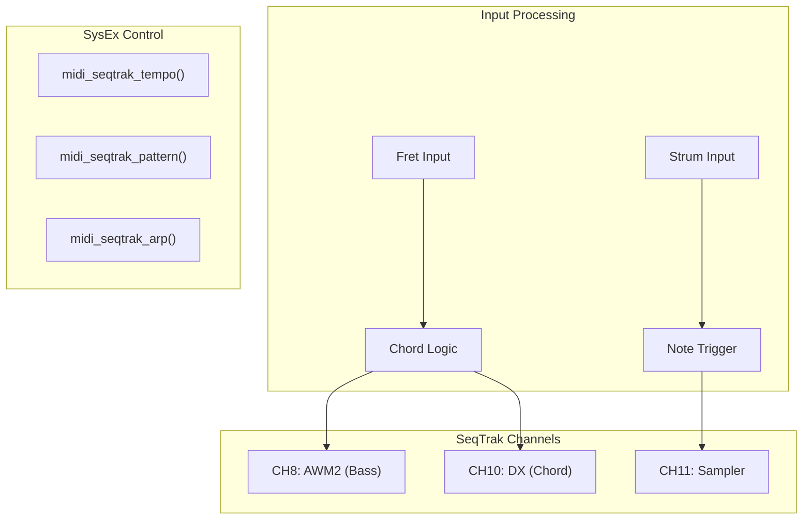

# Operational Modes

> **Relevant source files**
> * [pico_bluetooth.c](https://github.com/Jus-Be/orinayo-pico/blob/6dde5a75/pico_bluetooth.c)
> * [storage.c](https://github.com/Jus-Be/orinayo-pico/blob/6dde5a75/storage.c)
> * [storage.h](https://github.com/Jus-Be/orinayo-pico/blob/6dde5a75/storage.h)

This document details the five operational modes of the Orinayo system. Each mode defines a specific interpretation of Bluetooth HID controller inputs (gamepad buttons and frets) and maps them to specialized MIDI outputs, including Note On/Off, Control Change (CC), Program Change (PC), and manufacturer-specific System Exclusive (SysEx) messages.

## Mode Selection Mechanism

Operational modes are mutually exclusive and controlled by boolean flags. These flags are toggled via the `config_guitar()` function [pico_bluetooth.c L201](https://github.com/Jus-Be/orinayo-pico/blob/6dde5a75/pico_bluetooth.c#L201-L201)

 which is triggered when the **Config button (mbut3)** is pressed in combination with specific fret buttons.

The system uses the `storage_store_preferences()` function [storage.h L14](https://github.com/Jus-Be/orinayo-pico/blob/6dde5a75/storage.h#L14-L14)

 to persist the selected mode to the Pico's flash memory, ensuring the mode is retained across power cycles. The `storage_load_preferences()` function [storage.h L15](https://github.com/Jus-Be/orinayo-pico/blob/6dde5a75/storage.h#L15-L15)

 loads these preferences at startup.

### Mode Activation Logic

```

```

**Sources:** [pico_bluetooth.c L201](https://github.com/Jus-Be/orinayo-pico/blob/6dde5a75/pico_bluetooth.c#L201-L201)

 [pico_bluetooth.c L1309-L1399](https://github.com/Jus-Be/orinayo-pico/blob/6dde5a75/pico_bluetooth.c#L1309-L1399)

 [storage.c L72-L98](https://github.com/Jus-Be/orinayo-pico/blob/6dde5a75/storage.c#L72-L98)

 [storage.c L106-L124](https://github.com/Jus-Be/orinayo-pico/blob/6dde5a75/storage.c#L106-L124)

---

## Mode Comparison Matrix

| Feature | Arranger | Ample Guitar | MIDI Drums | SeqTrak | MODX |
| --- | --- | --- | --- | --- | --- |
| **Flag Variable** | `enable_arranger_mode` | `enable_ample_guitar` | `enable_midi_drums` | `enable_seqtrak` | `enable_modx` |
| **Primary Target** | Ketron/Yamaha | VST Plugins | Drum Sequencer | Yamaha SeqTrak | Yamaha MODX |
| **Default MIDI CH** | CH1 (Melody), CH4 (Pad) | CH1 | CH1 (Drum CH10) | CH8-11 | CH1-4 |
| **Control Method** | SysEx (Arranger) | Key Switches | Looper/Auto-Strum | SysEx (Pattern) | SysEx (Scene) |
| **Chord Playback** | `enable_style_play` | `enable_style_play` | Auto-strum only | `enable_style_play` | `enable_style_play` |
| **Activation** | Green + Config | Red + Config | Yellow + Config | Blue + Config | Orange + Config |

**Sources:** [pico_bluetooth.c L32-L63](https://github.com/Jus-Be/orinayo-pico/blob/6dde5a75/pico_bluetooth.c#L32-L63)

 [pico_bluetooth.c L1349-L1398](https://github.com/Jus-Be/orinayo-pico/blob/6dde5a75/pico_bluetooth.c#L1349-L1398)

---

## Mode 1: Arranger Mode

Arranger mode is designed for hardware accompaniment keyboards. It translates controller inputs into complex SysEx strings that trigger fills, variations, and intros/endings. The `enable_arranger_mode` flag [pico_bluetooth.c L56](https://github.com/Jus-Be/orinayo-pico/blob/6dde5a75/pico_bluetooth.c#L56-L56)

 controls this mode.

### Control Implementation

The system implements two distinct SysEx protocols:

1. **Ketron Protocol**: Handled by `midi_ketron_arr()` [pico_bluetooth.c L194](https://github.com/Jus-Be/orinayo-pico/blob/6dde5a75/pico_bluetooth.c#L194-L194)  Format: `F0 26 79 05 00 [code] [value] F7`. [pico_bluetooth.c L604-L623](https://github.com/Jus-Be/orinayo-pico/blob/6dde5a75/pico_bluetooth.c#L604-L623)
2. **Yamaha Protocol**: Handled by `midi_yamaha_arr()` [pico_bluetooth.c L197](https://github.com/Jus-Be/orinayo-pico/blob/6dde5a75/pico_bluetooth.c#L197-L197)  Format: `F0 43 7E 00 [code] [value] F7`. [pico_bluetooth.c L632-L650](https://github.com/Jus-Be/orinayo-pico/blob/6dde5a75/pico_bluetooth.c#L632-L650)

### Button Mapping

| Controller Input | Action | Ketron Code | Yamaha Code |
| --- | --- | --- | --- |
| **Logo (mbut0)** | Start/Stop | 0x12 | 0x7A / 0x7D |
| **Logo + Yellow** | Intro 1 | 0x0F | 0x00 / 0x20 |
| **Logo + Red** | Intro 2 | 0x10 | 0x01 / 0x21 |
| **Logo + Green** | Intro 3 | 0x11 | 0x02 / 0x22 |
| **Starpower + Frets** | Variation A-D | 0x03-0x06 | 0x10-0x13 |

**Sources:** [pico_bluetooth.c L1080-L1088](https://github.com/Jus-Be/orinayo-pico/blob/6dde5a75/pico_bluetooth.c#L1080-L1088)

 [pico_bluetooth.c L1172-L1180](https://github.com/Jus-Be/orinayo-pico/blob/6dde5a75/pico_bluetooth.c#L1172-L1180)

 [pico_bluetooth.c L194](https://github.com/Jus-Be/orinayo-pico/blob/6dde5a75/pico_bluetooth.c#L194-L194)

 [pico_bluetooth.c L197](https://github.com/Jus-Be/orinayo-pico/blob/6dde5a75/pico_bluetooth.c#L197-L197)

---

## Mode 2: Ample Guitar Mode

This mode optimizes the controller for Ample Guitar VSTs. It uses MIDI Key Switches (very low or very high MIDI notes) to toggle articulations like palm muting or legato. The `enable_ample_guitar` flag [pico_bluetooth.c L60](https://github.com/Jus-Be/orinayo-pico/blob/6dde5a75/pico_bluetooth.c#L60-L60)

 controls this mode.

### Chord Note Compression

To ensure the VST recognizes chords correctly, notes are compressed into a specific two-octave range (C1-B2):

```
if (enable_ample_guitar || enable_modx) {    p1 = (p1 % 12) + 36; // Force root to octave 3    p2 = (p2 % 12) + ((p2 % 12) < (p1 % 12) ? 48 : 36);    p3 = (p3 % 12) + ((p3 % 12) < (p1 % 12) ? 48 : 36);}
```

**Sources:** [pico_bluetooth.c L615-L619](https://github.com/Jus-Be/orinayo-pico/blob/6dde5a75/pico_bluetooth.c#L615-L619)

 [pico_bluetooth.c L654-L659](https://github.com/Jus-Be/orinayo-pico/blob/6dde5a75/pico_bluetooth.c#L654-L659)

### Articulation Triggers

* **Joystick Up**: Sends MIDI Note 24 (Sustain). [pico_bluetooth.c L1063-L1078](https://github.com/Jus-Be/orinayo-pico/blob/6dde5a75/pico_bluetooth.c#L1063-L1078)
* **Knob Up**: Sends MIDI Note 26 (Palm Mute). [pico_bluetooth.c L1167-L1180](https://github.com/Jus-Be/orinayo-pico/blob/6dde5a75/pico_bluetooth.c#L1167-L1180)
* **Pitch (but6)**: Sends Note 86 (Enable Chord) and Note 97 (Strum ON). [pico_bluetooth.c L472-L524](https://github.com/Jus-Be/orinayo-pico/blob/6dde5a75/pico_bluetooth.c#L472-L524)

---

## Mode 3: MIDI Drums Mode

MIDI Drums mode utilizes the internal 32-step looper (`looper.c`) to sequence drum hits. The `enable_midi_drums` flag [pico_bluetooth.c L61](https://github.com/Jus-Be/orinayo-pico/blob/6dde5a75/pico_bluetooth.c#L61-L61)

 controls this mode.

### Drum Mapping (Recording)

When `LOOPER_STATE_RECORDING` is active, strumming the controller without frets maps to specific drum tracks based on the `style_section`:

| Section | Strum Down (Track) | Strum Up (Track) | MIDI Note |
| --- | --- | --- | --- |
| 0 | 0 (Bass Drum) | 1 (Snare) | 36 / 38 |
| 1 | 2 (Closed Hat) | 5 (Open Hat) | 42 / 46 |
| 2 | 3 (Floor Tom) | 6 (High Tom) | 41 / 50 |

**Sources:** [pico_bluetooth.c L1784-L1819](https://github.com/Jus-Be/orinayo-pico/blob/6dde5a75/pico_bluetooth.c#L1784-L1819)

 [looper.h L1-L50](https://github.com/Jus-Be/orinayo-pico/blob/6dde5a75/looper.h#L1-L50)

---

## Mode 4: SeqTrak Mode

This mode targets the Yamaha SeqTrak, providing deep integration via SysEx for pattern switching and arpeggiator control. The `enable_seqtrak` flag [pico_bluetooth.c L45](https://github.com/Jus-Be/orinayo-pico/blob/6dde5a75/pico_bluetooth.c#L45-L45)

 controls this mode.

### Multi-Channel Data Flow


```mermaid
flowchart TD

M_Tempo["midi_seqtrak_tempo()"]
M_Pattern["midi_seqtrak_pattern()"]
M_Arp["midi_seqtrak_arp()"]
Fret["Fret Input"]
Chord["Chord Logic"]
Strum["Strum Input"]
Action["Note Trigger"]
CH8["CH8: AWM2 (Bass)"]
CH10["CH10: DX (Chord)"]
CH11["CH11: Sampler"]

Chord --> CH8
Chord --> CH10
Action --> CH11

subgraph subGraph1 ["SeqTrak Channels"]
    CH8
    CH10
    CH11
end

subgraph subGraph0 ["Input Processing"]
    Fret
    Chord
    Strum
    Action
    Fret --> Chord
    Strum --> Action
end

subgraph subGraph2 ["SysEx Control"]
    M_Tempo
    M_Pattern
    M_Arp
end
```

### Key Functions

* **`midi_seqtrak_arp()`**: Configures the SeqTrak arpeggiator (Type, Gate, Speed) using CC 27, 28, and 29. [pico_bluetooth.c L183](https://github.com/Jus-Be/orinayo-pico/blob/6dde5a75/pico_bluetooth.c#L183-L183)
* **`midi_seqtrak_pattern()`**: Switches patterns for all tracks simultaneously using SysEx `30 50..56 0F`. [pico_bluetooth.c L186](https://github.com/Jus-Be/orinayo-pico/blob/6dde5a75/pico_bluetooth.c#L186-L186)

**Sources:** [pico_bluetooth.c L183](https://github.com/Jus-Be/orinayo-pico/blob/6dde5a75/pico_bluetooth.c#L183-L183)

 [pico_bluetooth.c L186](https://github.com/Jus-Be/orinayo-pico/blob/6dde5a75/pico_bluetooth.c#L186-L186)

 [pico_bluetooth.c L803-L812](https://github.com/Jus-Be/orinayo-pico/blob/6dde5a75/pico_bluetooth.c#L803-L812)

---

## Mode 5: MODX Mode

MODX mode provides scene-based control for Yamaha MODX/Montage synthesizers. The `enable_modx` flag [pico_bluetooth.c L56](https://github.com/Jus-Be/orinayo-pico/blob/6dde5a75/pico_bluetooth.c#L56-L56)

 controls this mode.

### Scene Management

The system uses **CC 92 on CH4** to switch between 8 MODX Scenes.

* **Starpower + Fret**: Directly selects Scenes 1-5. [pico_bluetooth.c L815-L821](https://github.com/Jus-Be/orinayo-pico/blob/6dde5a75/pico_bluetooth.c#L815-L821)
* **Logo + Fret**: Starts the arpeggiator and sets a specific scene for performance. [pico_bluetooth.c L671-L716](https://github.com/Jus-Be/orinayo-pico/blob/6dde5a75/pico_bluetooth.c#L671-L716)

### Arpeggiator Control

* **`midi_modx_arp_hold()`**: Toggles the Arp Hold state for specific parts via SysEx `10 [part] 00 06 00 00`. [pico_bluetooth.c L179](https://github.com/Jus-Be/orinayo-pico/blob/6dde5a75/pico_bluetooth.c#L179-L179)
* **`midi_modx_arp_octave()`**: Shifts the arpeggiator range by modifying the MODX common parameter at address `00 00 02 02`. [pico_bluetooth.c L177](https://github.com/Jus-Be/orinayo-pico/blob/6dde5a75/pico_bluetooth.c#L177-L177)

**Sources:** [pico_bluetooth.c L177](https://github.com/Jus-Be/orinayo-pico/blob/6dde5a75/pico_bluetooth.c#L177-L177)

 [pico_bluetooth.c L179](https://github.com/Jus-Be/orinayo-pico/blob/6dde5a75/pico_bluetooth.c#L179-L179)

 [pico_bluetooth.c L380-L386](https://github.com/Jus-Be/orinayo-pico/blob/6dde5a75/pico_bluetooth.c#L380-L386)