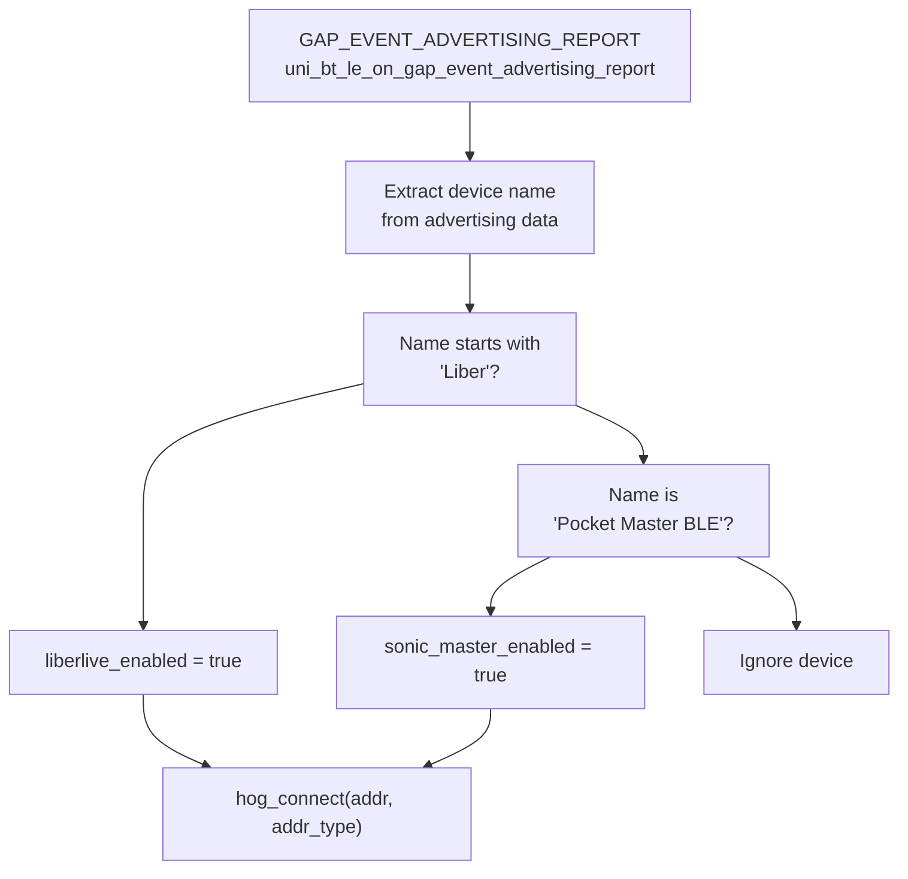
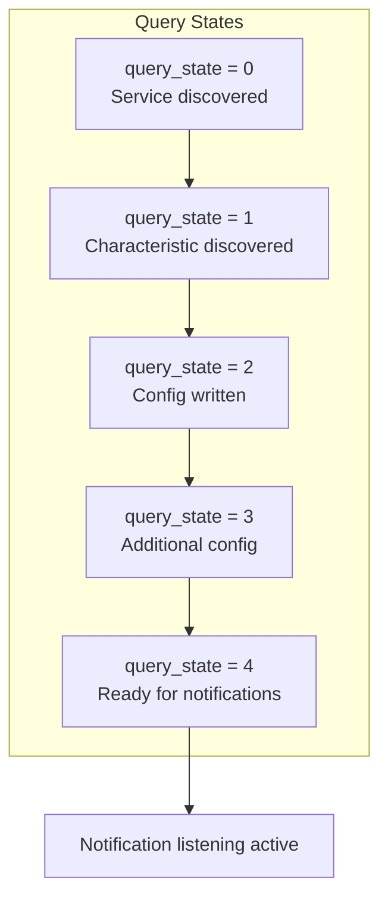
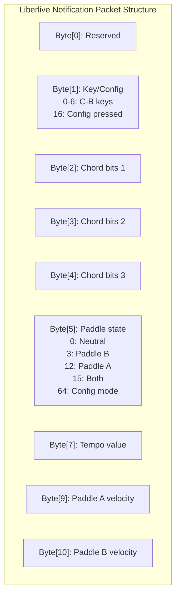
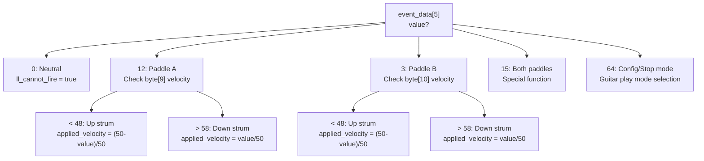
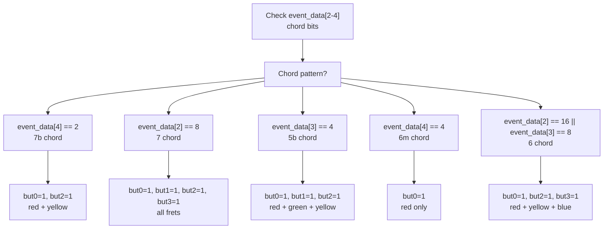
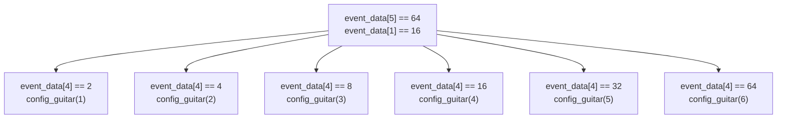
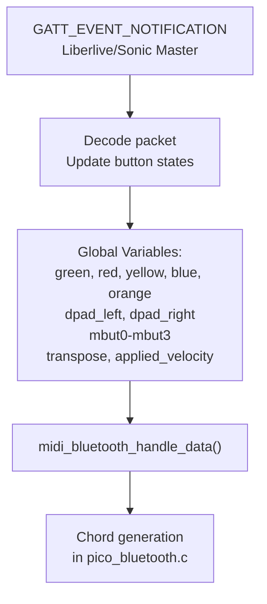

# Specialized MIDI Devices

> **Relevant source files**
> * [bluepad32/bt/uni_bt_le.c](https://github.com/Jus-Be/orinayo-pico/blob/122fa496/bluepad32/bt/uni_bt_le.c)

This document covers the custom BLE GATT protocol implementation for Liberlive and Sonic Master MIDI controller devices. These specialized devices communicate using proprietary GATT characteristics rather than standard HID reports.

For generic gamepad/guitar controller input handling via standard HID, see [HID to MIDI Translation](./4.2-hid-to-midi-translation.md). For BLE device connection management and pairing, see [BLE Device Management](./4.1-ble-device-management.md).

## Overview

The system supports two specialized BLE MIDI devices that use custom GATT services:

| Device Name | Advertising Name | Service UUID | Purpose |
| --- | --- | --- | --- |
| Liberlive | "Liber" (prefix) | `000000ff-0000-1000-8000-00805f9b34fb` | Chord controller with drum/chord pads |
| Sonic Master | "Pocket Master BLE" | `03b80e5a-ede8-4b33-a751-6ce34ec4c700` | Portable MIDI controller |

These devices bypass the standard Bluepad32 HID processing and use a custom GATT notification-based protocol implemented in [bluepad32/bt/uni_bt_le.c L771-L1203](https://github.com/Jus-Be/orinayo-pico/blob/122fa496/bluepad32/bt/uni_bt_le.c#L771-L1203)

**Sources:** [bluepad32/bt/uni_bt_le.c L78-L79](https://github.com/Jus-Be/orinayo-pico/blob/122fa496/bluepad32/bt/uni_bt_le.c#L78-L79)

 [bluepad32/bt/uni_bt_le.c L786-L787](https://github.com/Jus-Be/orinayo-pico/blob/122fa496/bluepad32/bt/uni_bt_le.c#L786-L787)

 [bluepad32/bt/uni_bt_le.c L1315-L1331](https://github.com/Jus-Be/orinayo-pico/blob/122fa496/bluepad32/bt/uni_bt_le.c#L1315-L1331)

## Device Discovery and Connection

### Discovery Process

Device discovery occurs during BLE advertising scanning. The system identifies specialized devices by matching their advertising name against known patterns:



The device name comparison is performed character-by-character to avoid string library dependencies:

```
// Liberlive check
if (name[0] == 'L' && name[1] == 'i' && name[2] == 'b' && 
    name[3] == 'e' && name[4] == 'r')

// Sonic Master check  
if (name[0] == 'P' && name[1] == 'o' && name[2] == 'c' && 
    name[3] == 'k' && name[4] == 'e' && name[5] == 't' && ...)
```

**Sources:** [bluepad32/bt/uni_bt_le.c L1298-L1331](https://github.com/Jus-Be/orinayo-pico/blob/122fa496/bluepad32/bt/uni_bt_le.c#L1298-L1331)

### GATT Service Discovery

Upon BLE connection, the system initiates GATT service and characteristic discovery:

```css
#mermaid-b9l6pyefr8b{font-family:ui-sans-serif,-apple-system,system-ui,Segoe UI,Helvetica;font-size:16px;fill:#333;}@keyframes edge-animation-frame{from{stroke-dashoffset:0;}}@keyframes dash{to{stroke-dashoffset:0;}}#mermaid-b9l6pyefr8b .edge-animation-slow{stroke-dasharray:9,5!important;stroke-dashoffset:900;animation:dash 50s linear infinite;stroke-linecap:round;}#mermaid-b9l6pyefr8b .edge-animation-fast{stroke-dasharray:9,5!important;stroke-dashoffset:900;animation:dash 20s linear infinite;stroke-linecap:round;}#mermaid-b9l6pyefr8b .error-icon{fill:#dddddd;}#mermaid-b9l6pyefr8b .error-text{fill:#222222;stroke:#222222;}#mermaid-b9l6pyefr8b .edge-thickness-normal{stroke-width:1px;}#mermaid-b9l6pyefr8b .edge-thickness-thick{stroke-width:3.5px;}#mermaid-b9l6pyefr8b .edge-pattern-solid{stroke-dasharray:0;}#mermaid-b9l6pyefr8b .edge-thickness-invisible{stroke-width:0;fill:none;}#mermaid-b9l6pyefr8b .edge-pattern-dashed{stroke-dasharray:3;}#mermaid-b9l6pyefr8b .edge-pattern-dotted{stroke-dasharray:2;}#mermaid-b9l6pyefr8b .marker{fill:#999;stroke:#999;}#mermaid-b9l6pyefr8b .marker.cross{stroke:#999;}#mermaid-b9l6pyefr8b svg{font-family:ui-sans-serif,-apple-system,system-ui,Segoe UI,Helvetica;font-size:16px;}#mermaid-b9l6pyefr8b p{margin:0;}#mermaid-b9l6pyefr8b defs #statediagram-barbEnd{fill:#999;stroke:#999;}#mermaid-b9l6pyefr8b g.stateGroup text{fill:#dddddd;stroke:none;font-size:10px;}#mermaid-b9l6pyefr8b g.stateGroup text{fill:#333;stroke:none;font-size:10px;}#mermaid-b9l6pyefr8b g.stateGroup .state-title{font-weight:bolder;fill:#333;}#mermaid-b9l6pyefr8b g.stateGroup rect{fill:#ffffff;stroke:#dddddd;}#mermaid-b9l6pyefr8b g.stateGroup line{stroke:#999;stroke-width:1;}#mermaid-b9l6pyefr8b .transition{stroke:#999;stroke-width:1;fill:none;}#mermaid-b9l6pyefr8b .stateGroup .composit{fill:#f4f4f4;border-bottom:1px;}#mermaid-b9l6pyefr8b .stateGroup .alt-composit{fill:#e0e0e0;border-bottom:1px;}#mermaid-b9l6pyefr8b .state-note{stroke:#e6d280;fill:#fff5ad;}#mermaid-b9l6pyefr8b .state-note text{fill:#333;stroke:none;font-size:10px;}#mermaid-b9l6pyefr8b .stateLabel .box{stroke:none;stroke-width:0;fill:#ffffff;opacity:0.5;}#mermaid-b9l6pyefr8b .edgeLabel .label rect{fill:#ffffff;opacity:0.5;}#mermaid-b9l6pyefr8b .edgeLabel{background-color:#ffffff;text-align:center;}#mermaid-b9l6pyefr8b .edgeLabel p{background-color:#ffffff;}#mermaid-b9l6pyefr8b .edgeLabel rect{opacity:0.5;background-color:#ffffff;fill:#ffffff;}#mermaid-b9l6pyefr8b .edgeLabel .label text{fill:#333;}#mermaid-b9l6pyefr8b .label div .edgeLabel{color:#333;}#mermaid-b9l6pyefr8b .stateLabel text{fill:#333;font-size:10px;font-weight:bold;}#mermaid-b9l6pyefr8b .node circle.state-start{fill:#999;stroke:#999;}#mermaid-b9l6pyefr8b .node .fork-join{fill:#999;stroke:#999;}#mermaid-b9l6pyefr8b .node circle.state-end{fill:#dddddd;stroke:#f4f4f4;stroke-width:1.5;}#mermaid-b9l6pyefr8b .end-state-inner{fill:#f4f4f4;stroke-width:1.5;}#mermaid-b9l6pyefr8b .node rect{fill:#ffffff;stroke:#dddddd;stroke-width:1px;}#mermaid-b9l6pyefr8b .node polygon{fill:#ffffff;stroke:#dddddd;stroke-width:1px;}#mermaid-b9l6pyefr8b #statediagram-barbEnd{fill:#999;}#mermaid-b9l6pyefr8b .statediagram-cluster rect{fill:#ffffff;stroke:#dddddd;stroke-width:1px;}#mermaid-b9l6pyefr8b .cluster-label,#mermaid-b9l6pyefr8b .nodeLabel{color:#333;}#mermaid-b9l6pyefr8b .statediagram-cluster rect.outer{rx:5px;ry:5px;}#mermaid-b9l6pyefr8b .statediagram-state .divider{stroke:#dddddd;}#mermaid-b9l6pyefr8b .statediagram-state .title-state{rx:5px;ry:5px;}#mermaid-b9l6pyefr8b .statediagram-cluster.statediagram-cluster .inner{fill:#f4f4f4;}#mermaid-b9l6pyefr8b .statediagram-cluster.statediagram-cluster-alt .inner{fill:#f8f8f8;}#mermaid-b9l6pyefr8b .statediagram-cluster .inner{rx:0;ry:0;}#mermaid-b9l6pyefr8b .statediagram-state rect.basic{rx:5px;ry:5px;}#mermaid-b9l6pyefr8b .statediagram-state rect.divider{stroke-dasharray:10,10;fill:#f8f8f8;}#mermaid-b9l6pyefr8b .note-edge{stroke-dasharray:5;}#mermaid-b9l6pyefr8b .statediagram-note rect{fill:#fff5ad;stroke:#e6d280;stroke-width:1px;rx:0;ry:0;}#mermaid-b9l6pyefr8b .statediagram-note rect{fill:#fff5ad;stroke:#e6d280;stroke-width:1px;rx:0;ry:0;}#mermaid-b9l6pyefr8b .statediagram-note text{fill:#333;}#mermaid-b9l6pyefr8b .statediagram-note .nodeLabel{color:#333;}#mermaid-b9l6pyefr8b .statediagram .edgeLabel{color:red;}#mermaid-b9l6pyefr8b #dependencyStart,#mermaid-b9l6pyefr8b #dependencyEnd{fill:#999;stroke:#999;stroke-width:1;}#mermaid-b9l6pyefr8b .statediagramTitleText{text-anchor:middle;font-size:18px;fill:#333;}#mermaid-b9l6pyefr8b :root{--mermaid-font-family:"trebuchet ms",verdana,arial,sans-serif;}HCI_SUBEVENT_LE_CONNECTION_COMPLETEgatt_client_discover_primary_services_by_uuid128GATT_EVENT_SERVICE_QUERY_RESULTquery_state = 0gatt_client_discover_characteristics_for_service_by_uuid128GATT_EVENT_CHARACTERISTIC_QUERY_RESULTquery_state = 1GATT_EVENT_QUERY_COMPLETEgatt_client_listen_for_characteristic_value_updatesquery_state = 2-4ConnectionCompleteDiscoverServiceServiceFoundDiscoverCharCharFoundConfigWriteListenNotifyReady
```

The discovery process uses 128-bit UUIDs specific to each device:

| Device | Service UUID (Little-Endian Bytes) | Characteristic UUID |
| --- | --- | --- |
| Liberlive | `{0x00,0x00,0x00,0xff,...,0xFB}` | `{0x00,0x00,0xff,0x03,...,0xfb}` |
| Sonic Master | `{0x03,0xB8,0x0E,0x5A,...,0x00}` | `{0x77,0x72,0xE5,0xDB,...,0xF3}` |

**Sources:** [bluepad32/bt/uni_bt_le.c L1220-L1256](https://github.com/Jus-Be/orinayo-pico/blob/122fa496/bluepad32/bt/uni_bt_le.c#L1220-L1256)

 [bluepad32/bt/uni_bt_le.c L796-L821](https://github.com/Jus-Be/orinayo-pico/blob/122fa496/bluepad32/bt/uni_bt_le.c#L796-L821)

## GATT Event State Machine

The `handle_gatt_client_event` function implements a state machine that manages GATT operations:



**Sources:** [bluepad32/bt/uni_bt_le.c L771-L879](https://github.com/Jus-Be/orinayo-pico/blob/122fa496/bluepad32/bt/uni_bt_le.c#L771-L879)

## Liberlive Configuration

During the GATT setup phase (query_state = 1-4), the system writes configuration data to the Liberlive device using `gatt_client_write_value_of_characteristic`:

### Chord Key Mapping

The chord mapping configuration is a 26-byte array that defines how the device interprets chord inputs:

```
static uint8_t chord_mappings[26] = {
    177, 30, 31, 21, 0, 128, 147, 117, 5, 85, 81, 113, 
    160, 145, 112, 0, 80, 33, 65, 176, 144, 112, 0, 48, 32, 64
};
```

This configuration is written at [bluepad32/bt/uni_bt_le.c L828-L830](https://github.com/Jus-Be/orinayo-pico/blob/122fa496/bluepad32/bt/uni_bt_le.c#L828-L830)

### Optional Configuration Commands

The code includes commented-out configuration options for:

| Configuration | Byte Array | Purpose |
| --- | --- | --- |
| Drum Preview | `{177, 30, 38, 1, 0, 1}` | Enable/disable drum sound preview |
| Chord Preview | `{177, 30, 37, 1, 0, 1}` | Enable/disable chord sound preview |
| Chord Tip | `{177, 30, 12, 3, 0, 2, 2, 1}` | Chord display tip settings |
| Set Chord Type | `{177, 30, 27, 2, 0, 5, 0}` | Define chord type (major/minor/etc) |
| Set Key | `{177, 30, 24, 1, 0, 0}` | Set musical key (C/D/E/etc) |

**Sources:** [bluepad32/bt/uni_bt_le.c L828-L848](https://github.com/Jus-Be/orinayo-pico/blob/122fa496/bluepad32/bt/uni_bt_le.c#L828-L848)

## Notification Packet Format

GATT notifications from Liberlive contain multi-byte packets encoding controller state:



The system extracts this data into a local buffer at [bluepad32/bt/uni_bt_le.c L885](https://github.com/Jus-Be/orinayo-pico/blob/122fa496/bluepad32/bt/uni_bt_le.c#L885-L885)

:

```
memcpy(event_data, value, value_length);
```

**Sources:** [bluepad32/bt/uni_bt_le.c L779-L780](https://github.com/Jus-Be/orinayo-pico/blob/122fa496/bluepad32/bt/uni_bt_le.c#L779-L780)

 [bluepad32/bt/uni_bt_le.c L885-L886](https://github.com/Jus-Be/orinayo-pico/blob/122fa496/bluepad32/bt/uni_bt_le.c#L885-L886)

## Input Decoding

### Paddle State Detection

The paddle state (byte[5]) determines the input mode and velocity calculation:



The paddle velocity bytes map to the `applied_velocity` variable, which affects MIDI note velocity. The thresholds (48 and 58) create a dead zone for the neutral position.

**Sources:** [bluepad32/bt/uni_bt_le.c L912-L916](https://github.com/Jus-Be/orinayo-pico/blob/122fa496/bluepad32/bt/uni_bt_le.c#L912-L916)

 [bluepad32/bt/uni_bt_le.c L1140-L1193](https://github.com/Jus-Be/orinayo-pico/blob/122fa496/bluepad32/bt/uni_bt_le.c#L1140-L1193)

### Chord Decoding

The chord is encoded across bytes 2, 3, and 4 using bit flags. Each chord combination maps to specific button states:



The button mappings correspond to:

* `but0` / `red`: Fret button 1
* `but1` / `green`: Fret button 2
* `but2` / `yellow`: Fret button 3
* `but3` / `blue`: Fret button 4
* `but4` / `orange`: Fret button 5

The complete chord decoding logic spans [bluepad32/bt/uni_bt_le.c L980-L1121](https://github.com/Jus-Be/orinayo-pico/blob/122fa496/bluepad32/bt/uni_bt_le.c#L980-L1121)

 with 20 distinct chord patterns supported.

**Sources:** [bluepad32/bt/uni_bt_le.c L980-L1121](https://github.com/Jus-Be/orinayo-pico/blob/122fa496/bluepad32/bt/uni_bt_le.c#L980-L1121)

### Key and Tempo Tracking

The device can change the musical key and tempo, which are extracted from the notification packet:

**Key Change Detection:**

```
// event_data[1] encodes key (0-6 = C through B)
if (event_data[1] == 0) transpose = 0;   // C
if (event_data[1] == 1) transpose = 2;   // D
if (event_data[1] == 2) transpose = 4;   // E
// ... etc
```

The `transpose` variable is then used to send key information to synthesizers via `midi_seqtrak_key(transpose)`.

**Tempo Change Detection:**

```
if (event_data[7] != current_tempo) {
    current_tempo = event_data[7];
    if (enable_seqtrak) midi_seqtrak_tempo(current_tempo);
    if (enable_modx) midi_modx_tempo(current_tempo);
}
```

**Sources:** [bluepad32/bt/uni_bt_le.c L927-L932](https://github.com/Jus-Be/orinayo-pico/blob/122fa496/bluepad32/bt/uni_bt_le.c#L927-L932)

 [bluepad32/bt/uni_bt_le.c L936-L949](https://github.com/Jus-Be/orinayo-pico/blob/122fa496/bluepad32/bt/uni_bt_le.c#L936-L949)

### Configuration Mode

When byte[5] == 64 and byte[1] == 16, the device is in configuration mode. Byte[4] then selects different configuration options:



The `config_guitar()` function is defined elsewhere and switches between operational modes (Arranger, MODX, etc).

**Sources:** [bluepad32/bt/uni_bt_le.c L952-L962](https://github.com/Jus-Be/orinayo-pico/blob/122fa496/bluepad32/bt/uni_bt_le.c#L952-L962)

## Fire Control Mechanism

The system implements a "fire control" mechanism to prevent duplicate events from a single paddle motion:

```css
#mermaid-i0ku2vlsm8{font-family:ui-sans-serif,-apple-system,system-ui,Segoe UI,Helvetica;font-size:16px;fill:#333;}@keyframes edge-animation-frame{from{stroke-dashoffset:0;}}@keyframes dash{to{stroke-dashoffset:0;}}#mermaid-i0ku2vlsm8 .edge-animation-slow{stroke-dasharray:9,5!important;stroke-dashoffset:900;animation:dash 50s linear infinite;stroke-linecap:round;}#mermaid-i0ku2vlsm8 .edge-animation-fast{stroke-dasharray:9,5!important;stroke-dashoffset:900;animation:dash 20s linear infinite;stroke-linecap:round;}#mermaid-i0ku2vlsm8 .error-icon{fill:#dddddd;}#mermaid-i0ku2vlsm8 .error-text{fill:#222222;stroke:#222222;}#mermaid-i0ku2vlsm8 .edge-thickness-normal{stroke-width:1px;}#mermaid-i0ku2vlsm8 .edge-thickness-thick{stroke-width:3.5px;}#mermaid-i0ku2vlsm8 .edge-pattern-solid{stroke-dasharray:0;}#mermaid-i0ku2vlsm8 .edge-thickness-invisible{stroke-width:0;fill:none;}#mermaid-i0ku2vlsm8 .edge-pattern-dashed{stroke-dasharray:3;}#mermaid-i0ku2vlsm8 .edge-pattern-dotted{stroke-dasharray:2;}#mermaid-i0ku2vlsm8 .marker{fill:#999;stroke:#999;}#mermaid-i0ku2vlsm8 .marker.cross{stroke:#999;}#mermaid-i0ku2vlsm8 svg{font-family:ui-sans-serif,-apple-system,system-ui,Segoe UI,Helvetica;font-size:16px;}#mermaid-i0ku2vlsm8 p{margin:0;}#mermaid-i0ku2vlsm8 defs #statediagram-barbEnd{fill:#999;stroke:#999;}#mermaid-i0ku2vlsm8 g.stateGroup text{fill:#dddddd;stroke:none;font-size:10px;}#mermaid-i0ku2vlsm8 g.stateGroup text{fill:#333;stroke:none;font-size:10px;}#mermaid-i0ku2vlsm8 g.stateGroup .state-title{font-weight:bolder;fill:#333;}#mermaid-i0ku2vlsm8 g.stateGroup rect{fill:#ffffff;stroke:#dddddd;}#mermaid-i0ku2vlsm8 g.stateGroup line{stroke:#999;stroke-width:1;}#mermaid-i0ku2vlsm8 .transition{stroke:#999;stroke-width:1;fill:none;}#mermaid-i0ku2vlsm8 .stateGroup .composit{fill:#f4f4f4;border-bottom:1px;}#mermaid-i0ku2vlsm8 .stateGroup .alt-composit{fill:#e0e0e0;border-bottom:1px;}#mermaid-i0ku2vlsm8 .state-note{stroke:#e6d280;fill:#fff5ad;}#mermaid-i0ku2vlsm8 .state-note text{fill:#333;stroke:none;font-size:10px;}#mermaid-i0ku2vlsm8 .stateLabel .box{stroke:none;stroke-width:0;fill:#ffffff;opacity:0.5;}#mermaid-i0ku2vlsm8 .edgeLabel .label rect{fill:#ffffff;opacity:0.5;}#mermaid-i0ku2vlsm8 .edgeLabel{background-color:#ffffff;text-align:center;}#mermaid-i0ku2vlsm8 .edgeLabel p{background-color:#ffffff;}#mermaid-i0ku2vlsm8 .edgeLabel rect{opacity:0.5;background-color:#ffffff;fill:#ffffff;}#mermaid-i0ku2vlsm8 .edgeLabel .label text{fill:#333;}#mermaid-i0ku2vlsm8 .label div .edgeLabel{color:#333;}#mermaid-i0ku2vlsm8 .stateLabel text{fill:#333;font-size:10px;font-weight:bold;}#mermaid-i0ku2vlsm8 .node circle.state-start{fill:#999;stroke:#999;}#mermaid-i0ku2vlsm8 .node .fork-join{fill:#999;stroke:#999;}#mermaid-i0ku2vlsm8 .node circle.state-end{fill:#dddddd;stroke:#f4f4f4;stroke-width:1.5;}#mermaid-i0ku2vlsm8 .end-state-inner{fill:#f4f4f4;stroke-width:1.5;}#mermaid-i0ku2vlsm8 .node rect{fill:#ffffff;stroke:#dddddd;stroke-width:1px;}#mermaid-i0ku2vlsm8 .node polygon{fill:#ffffff;stroke:#dddddd;stroke-width:1px;}#mermaid-i0ku2vlsm8 #statediagram-barbEnd{fill:#999;}#mermaid-i0ku2vlsm8 .statediagram-cluster rect{fill:#ffffff;stroke:#dddddd;stroke-width:1px;}#mermaid-i0ku2vlsm8 .cluster-label,#mermaid-i0ku2vlsm8 .nodeLabel{color:#333;}#mermaid-i0ku2vlsm8 .statediagram-cluster rect.outer{rx:5px;ry:5px;}#mermaid-i0ku2vlsm8 .statediagram-state .divider{stroke:#dddddd;}#mermaid-i0ku2vlsm8 .statediagram-state .title-state{rx:5px;ry:5px;}#mermaid-i0ku2vlsm8 .statediagram-cluster.statediagram-cluster .inner{fill:#f4f4f4;}#mermaid-i0ku2vlsm8 .statediagram-cluster.statediagram-cluster-alt .inner{fill:#f8f8f8;}#mermaid-i0ku2vlsm8 .statediagram-cluster .inner{rx:0;ry:0;}#mermaid-i0ku2vlsm8 .statediagram-state rect.basic{rx:5px;ry:5px;}#mermaid-i0ku2vlsm8 .statediagram-state rect.divider{stroke-dasharray:10,10;fill:#f8f8f8;}#mermaid-i0ku2vlsm8 .note-edge{stroke-dasharray:5;}#mermaid-i0ku2vlsm8 .statediagram-note rect{fill:#fff5ad;stroke:#e6d280;stroke-width:1px;rx:0;ry:0;}#mermaid-i0ku2vlsm8 .statediagram-note rect{fill:#fff5ad;stroke:#e6d280;stroke-width:1px;rx:0;ry:0;}#mermaid-i0ku2vlsm8 .statediagram-note text{fill:#333;}#mermaid-i0ku2vlsm8 .statediagram-note .nodeLabel{color:#333;}#mermaid-i0ku2vlsm8 .statediagram .edgeLabel{color:red;}#mermaid-i0ku2vlsm8 #dependencyStart,#mermaid-i0ku2vlsm8 #dependencyEnd{fill:#999;stroke:#999;stroke-width:1;}#mermaid-i0ku2vlsm8 .statediagramTitleText{text-anchor:middle;font-size:18px;fill:#333;}#mermaid-i0ku2vlsm8 :root{--mermaid-font-family:"trebuchet ms",verdana,arial,sans-serif;}ll_have_fired = falsell_cannot_fire = falsePaddle strummedll_have_fired = truell_cannot_fire = trueevent_data[5] == 0ll_have_fired = falseSend note-offIdleFiredCannotFireNeutralReset
```

This state machine ensures that:

1. Each paddle motion generates exactly one MIDI event
2. The paddle must return to neutral (byte[5] == 0) before firing again
3. LED feedback indicates when a strum has been registered

Implementation details:

* Fire check: [bluepad32/bt/uni_bt_le.c L913-L923](https://github.com/Jus-Be/orinayo-pico/blob/122fa496/bluepad32/bt/uni_bt_le.c#L913-L923)
* Reset logic: [bluepad32/bt/uni_bt_le.c L915-L923](https://github.com/Jus-Be/orinayo-pico/blob/122fa496/bluepad32/bt/uni_bt_le.c#L915-L923)
* Event trigger: [bluepad32/bt/uni_bt_le.c L1195-L1201](https://github.com/Jus-Be/orinayo-pico/blob/122fa496/bluepad32/bt/uni_bt_le.c#L1195-L1201)

**Sources:** [bluepad32/bt/uni_bt_le.c L83-L84](https://github.com/Jus-Be/orinayo-pico/blob/122fa496/bluepad32/bt/uni_bt_le.c#L83-L84)

 [bluepad32/bt/uni_bt_le.c L913-L923](https://github.com/Jus-Be/orinayo-pico/blob/122fa496/bluepad32/bt/uni_bt_le.c#L913-L923)

 [bluepad32/bt/uni_bt_le.c L1195-L1201](https://github.com/Jus-Be/orinayo-pico/blob/122fa496/bluepad32/bt/uni_bt_le.c#L1195-L1201)

## Integration with Main System

After decoding the notification packet, the system updates global button state variables that are shared with the main MIDI processing code:



The button state variables are declared as external in [bluepad32/bt/uni_bt_le.c L106-L156](https://github.com/Jus-Be/orinayo-pico/blob/122fa496/bluepad32/bt/uni_bt_le.c#L106-L156)

 and updated throughout the notification handler. When `handling_required` is true and a strum hasn't already fired, the system calls `midi_bluetooth_handle_data()` at [bluepad32/bt/uni_bt_le.c L1199](https://github.com/Jus-Be/orinayo-pico/blob/122fa496/bluepad32/bt/uni_bt_le.c#L1199-L1199)

Key global variables set by the decoder:

| Variable | Type | Purpose |
| --- | --- | --- |
| `green`, `red`, `yellow`, `blue`, `orange` | `uint8_t` | Fret button states (0=pressed, 1=released) |
| `dpad_left`, `dpad_right` | `uint8_t` | Strum direction indicators |
| `mbut0`-`mbut3` | `uint8_t` | Menu/modifier button states |
| `transpose` | `int` | Current musical key (0-11 semitones) |
| `applied_velocity` | `int` | MIDI velocity from paddle pressure |
| `but6`, `pitch`, `starpower` | `uint8_t` | Special function buttons |

**Sources:** [bluepad32/bt/uni_bt_le.c L892-L910](https://github.com/Jus-Be/orinayo-pico/blob/122fa496/bluepad32/bt/uni_bt_le.c#L892-L910)

 [bluepad32/bt/uni_bt_le.c L1199](https://github.com/Jus-Be/orinayo-pico/blob/122fa496/bluepad32/bt/uni_bt_le.c#L1199-L1199)

## Disconnection Handling

When a specialized device disconnects, the system clears the device-specific flags to allow reconnection:

```
void uni_bt_le_on_hci_disconnection_complete(...) {
    liberlive_enabled = false;
    sonic_master_enabled = false;
    resume_scanning_hint();
}
```

The `resume_scanning_hint()` function restarts BLE scanning if it was active before connection, allowing the device to be rediscovered.

**Sources:** [bluepad32/bt/uni_bt_le.c L1392-L1400](https://github.com/Jus-Be/orinayo-pico/blob/122fa496/bluepad32/bt/uni_bt_le.c#L1392-L1400)

## Sending MIDI to Specialized Devices

The system can send MIDI data back to Liberlive/Sonic Master devices using GATT characteristic writes:

```
void send_ble_midi(uint8_t* midi_data, int len) {
    gatt_client_write_value_of_characteristic_without_response(
        connection_handle, 
        server_characteristic.value_handle, 
        len, 
        midi_data
    );
}
```

This function is declared at [bluepad32/bt/uni_bt_le.c L86](https://github.com/Jus-Be/orinayo-pico/blob/122fa496/bluepad32/bt/uni_bt_le.c#L86-L86)

 and implemented at [bluepad32/bt/uni_bt_le.c L1205-L1207](https://github.com/Jus-Be/orinayo-pico/blob/122fa496/bluepad32/bt/uni_bt_le.c#L1205-L1207)

 It uses write-without-response for low-latency MIDI transmission.

**Sources:** [bluepad32/bt/uni_bt_le.c L1205-L1207](https://github.com/Jus-Be/orinayo-pico/blob/122fa496/bluepad32/bt/uni_bt_le.c#L1205-L1207)

## Sonic Master Implementation Status

The Sonic Master device support is partially implemented. The connection and GATT discovery work identically to Liberlive, but the notification packet decoding is not yet implemented. The code structure at [bluepad32/bt/uni_bt_le.c L852-L855](https://github.com/Jus-Be/orinayo-pico/blob/122fa496/bluepad32/bt/uni_bt_le.c#L852-L855)

 indicates query_state transitions, but no notification handler logic is present.

**Sources:** [bluepad32/bt/uni_bt_le.c L818-L820](https://github.com/Jus-Be/orinayo-pico/blob/122fa496/bluepad32/bt/uni_bt_le.c#L818-L820)

 [bluepad32/bt/uni_bt_le.c L852-L855](https://github.com/Jus-Be/orinayo-pico/blob/122fa496/bluepad32/bt/uni_bt_le.c#L852-L855)

## Key Differences from HID Processing

The specialized MIDI device handling differs from standard HID processing in several ways:

| Aspect | HID Devices (Bluepad32) | Specialized MIDI Devices |
| --- | --- | --- |
| Discovery | Device class/appearance | Advertising name string match |
| Protocol | Standard HID over GATT | Proprietary GATT notifications |
| Pairing | Security Manager required | Direct GATT connection (no encryption) |
| Data format | HID report descriptors | Custom byte arrays |
| Processing | uni_hid_parse_input_report | handle_gatt_client_event |
| Integration point | uni_hid_device_process_controller | midi_bluetooth_handle_data |

Security level is explicitly set to 0 at [bluepad32/bt/uni_bt_le.c L1489](https://github.com/Jus-Be/orinayo-pico/blob/122fa496/bluepad32/bt/uni_bt_le.c#L1489-L1489)

 bypassing encryption for these devices.

**Sources:** [bluepad32/bt/uni_bt_le.c L1489](https://github.com/Jus-Be/orinayo-pico/blob/122fa496/bluepad32/bt/uni_bt_le.c#L1489-L1489)