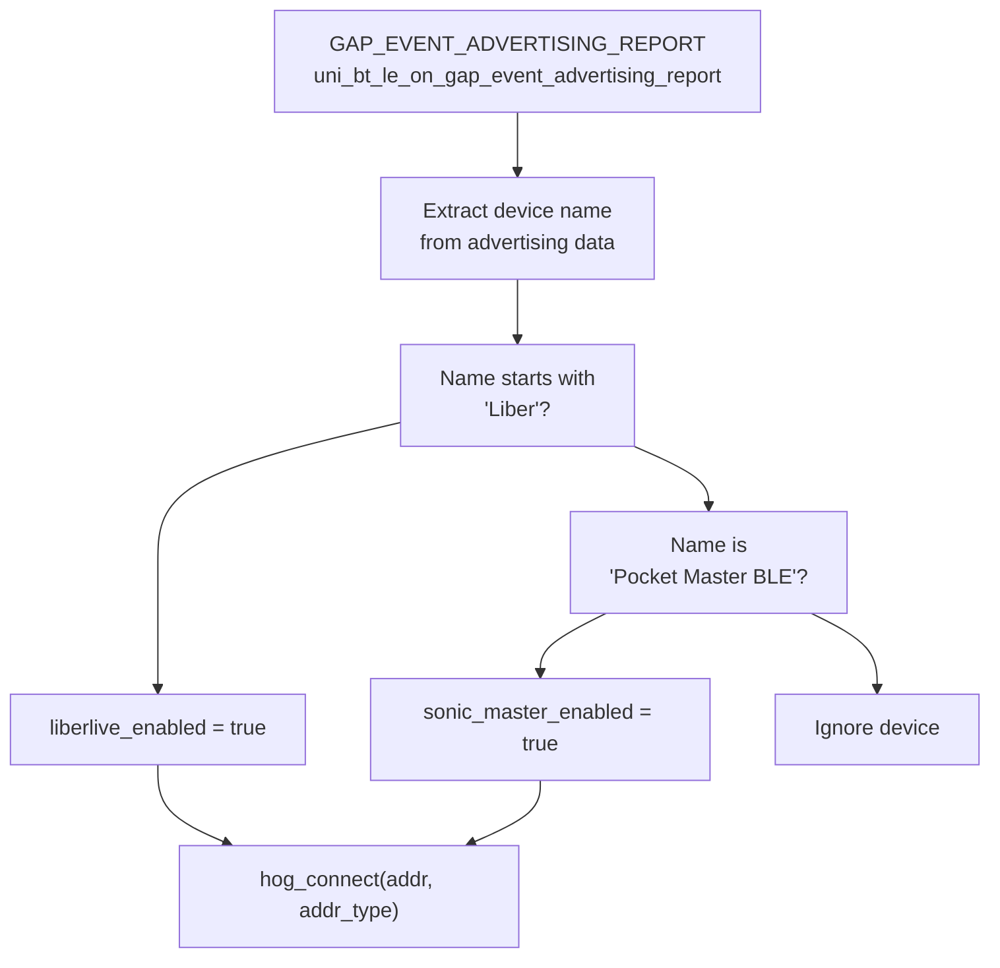
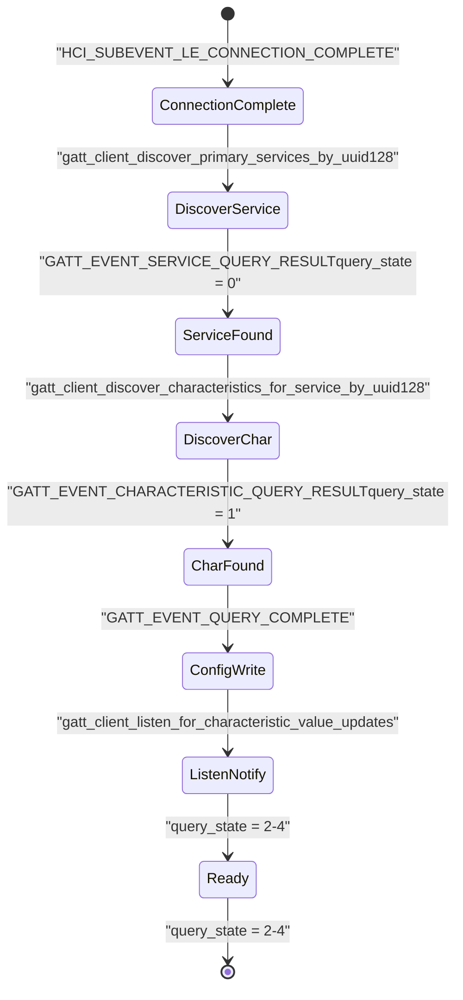
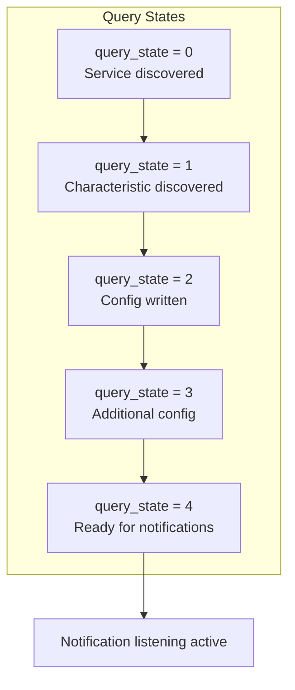
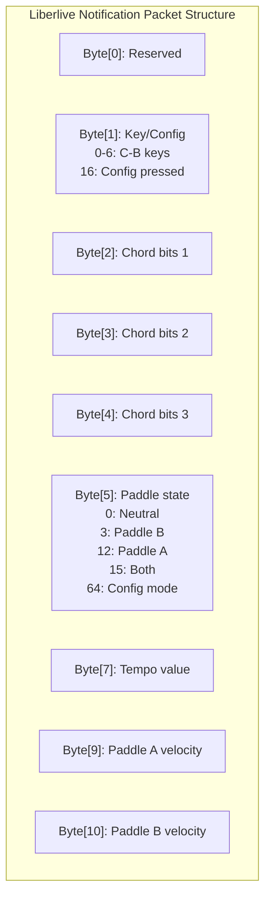
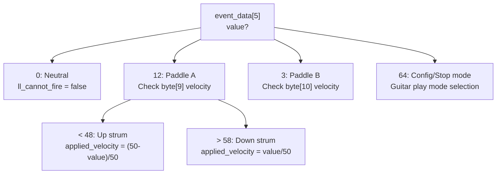
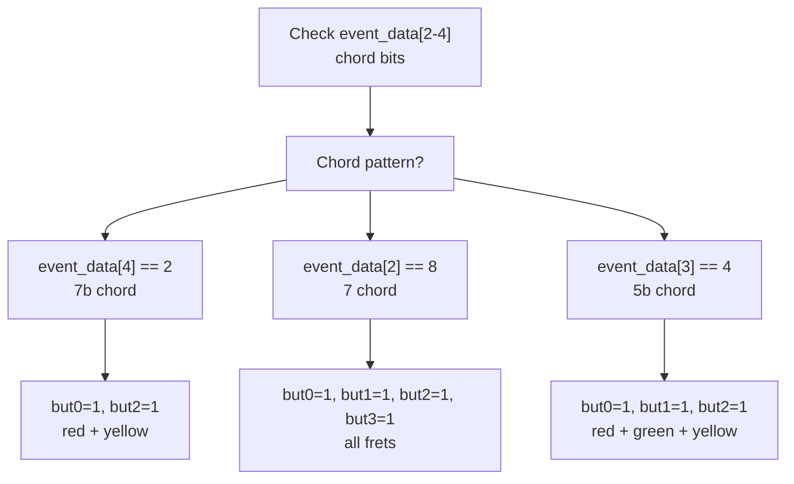
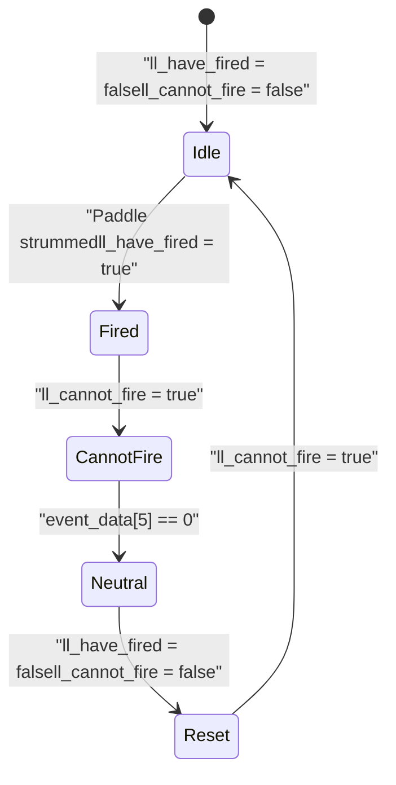
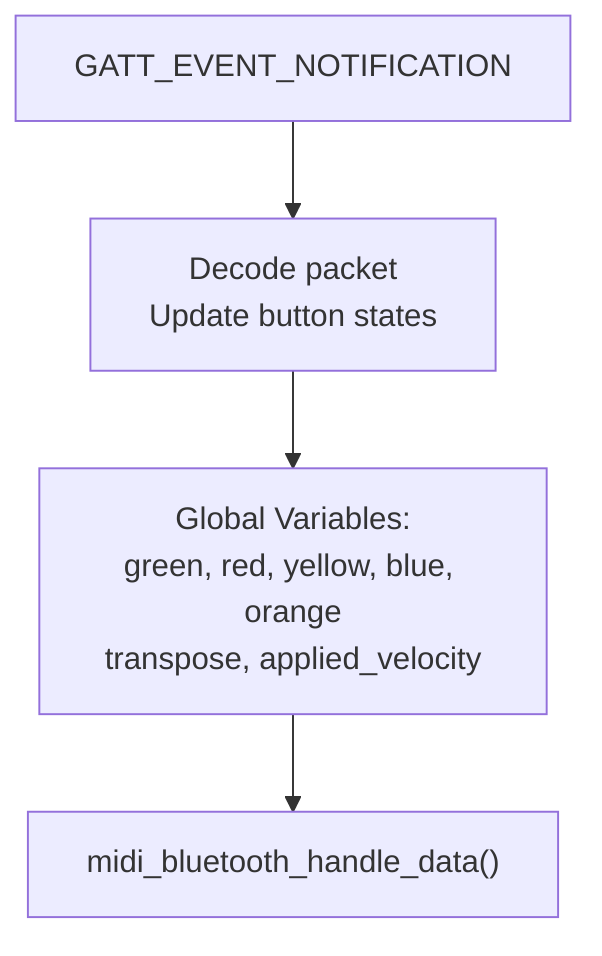

# Specialized MIDI Devices

> **Relevant source files**
> * [ble_midi_controller.c](https://github.com/Jus-Be/orinayo-pico/blob/6dde5a75/ble_midi_controller.c)
> * [ble_midi_controller.h](https://github.com/Jus-Be/orinayo-pico/blob/6dde5a75/ble_midi_controller.h)
> * [bluepad32/bt/uni_bt.c](https://github.com/Jus-Be/orinayo-pico/blob/6dde5a75/bluepad32/bt/uni_bt.c)
> * [bluepad32/bt/uni_bt_le.c](https://github.com/Jus-Be/orinayo-pico/blob/6dde5a75/bluepad32/bt/uni_bt_le.c)
> * [bluepad32/bt/uni_bt_setup.c](https://github.com/Jus-Be/orinayo-pico/blob/6dde5a75/bluepad32/bt/uni_bt_setup.c)
> * [pico-w-ble-midi-lib/CMakeLists.txt](https://github.com/Jus-Be/orinayo-pico/blob/6dde5a75/pico-w-ble-midi-lib/CMakeLists.txt)
> * [pico-w-ble-midi-lib/ble_midi_client.c](https://github.com/Jus-Be/orinayo-pico/blob/6dde5a75/pico-w-ble-midi-lib/ble_midi_client.c)
> * [pico-w-ble-midi-lib/ble_midi_client.h](https://github.com/Jus-Be/orinayo-pico/blob/6dde5a75/pico-w-ble-midi-lib/ble_midi_client.h)
> * [pico-w-ble-midi-lib/ble_midi_pkt_codec.c](https://github.com/Jus-Be/orinayo-pico/blob/6dde5a75/pico-w-ble-midi-lib/ble_midi_pkt_codec.c)
> * [pico-w-ble-midi-lib/ble_midi_pkt_codec.h](https://github.com/Jus-Be/orinayo-pico/blob/6dde5a75/pico-w-ble-midi-lib/ble_midi_pkt_codec.h)
> * [pico-w-ble-midi-lib/ble_midi_server.c](https://github.com/Jus-Be/orinayo-pico/blob/6dde5a75/pico-w-ble-midi-lib/ble_midi_server.c)
> * [pico-w-ble-midi-lib/ble_midi_server.h](https://github.com/Jus-Be/orinayo-pico/blob/6dde5a75/pico-w-ble-midi-lib/ble_midi_server.h)

This document covers the custom BLE GATT protocol implementation for Liberlive and Sonic Master MIDI controller devices. These specialized devices communicate using proprietary GATT characteristics rather than standard HID reports.

For generic gamepad/guitar controller input handling via standard HID, see [4.2 HID to MIDI Translation](https://github.com/Jus-Be/orinayo-pico/blob/6dde5a75/4.2 HID to MIDI Translation)

 For BLE device connection management and pairing, see [4.1 BLE Device Management](https://github.com/Jus-Be/orinayo-pico/blob/6dde5a75/4.1 BLE Device Management)

## Overview

The system supports two specialized BLE MIDI devices that use custom GATT services:

| Device Name | Advertising Name | Service UUID | Purpose |
| --- | --- | --- | --- |
| Liberlive | "Liber" (prefix) | `000000ff-0000-1000-8000-00805f9b34fb` | Chord controller with drum/chord pads |
| Sonic Master | "Pocket Master BLE" | `03b80e5a-ede8-4b33-a751-6ce34ec4c700` | Portable MIDI controller |

These devices bypass the standard Bluepad32 HID processing and use a custom GATT notification-based protocol implemented in `bluepad32/bt/uni_bt_le.c`.

**Sources:** [bluepad32/bt/uni_bt_le.c L78-L79](https://github.com/Jus-Be/orinayo-pico/blob/6dde5a75/bluepad32/bt/uni_bt_le.c#L78-L79)

 [bluepad32/bt/uni_bt_le.c L786-L787](https://github.com/Jus-Be/orinayo-pico/blob/6dde5a75/bluepad32/bt/uni_bt_le.c#L786-L787)

 [bluepad32/bt/uni_bt_le.c L1315-L1331](https://github.com/Jus-Be/orinayo-pico/blob/6dde5a75/bluepad32/bt/uni_bt_le.c#L1315-L1331)

## Device Discovery and Connection

### Discovery Process

Device discovery occurs during BLE advertising scanning. The system identifies specialized devices by matching their advertising name against known patterns in `uni_bt_le_on_gap_event_advertising_report`.


```mermaid
flowchart TD

Start["GAP_EVENT_ADVERTISING_REPORT<br>uni_bt_le_on_gap_event_advertising_report"]
GetName["Extract device name<br>from advertising data"]
CheckLiber["Name starts with<br>'Liber'?"]
CheckSonic["Name is<br>'Pocket Master BLE'?"]
SetLiberFlag["liberlive_enabled = true"]
SetSonicFlag["sonic_master_enabled = true"]
Connect["hog_connect(addr, addr_type)"]
Ignore["Ignore device"]

Start --> GetName
GetName --> CheckLiber
CheckLiber --> SetLiberFlag
CheckLiber --> CheckSonic
CheckSonic --> SetSonicFlag
CheckSonic --> Ignore
SetLiberFlag --> Connect
SetSonicFlag --> Connect
```

The device name comparison is performed character-by-character to avoid string library dependencies:

```xml
// Liberlive check <FileRef file-url="https://github.com/Jus-Be/orinayo-pico/blob/6dde5a75/bluepad32/bt/uni_bt_le.c#L1315-L1320" min=1315 max=1320 file-path="bluepad32/bt/uni_bt_le.c">Hii</FileRef>if (name[0] == 'L' && name[1] == 'i' && name[2] == 'b' &&     name[3] == 'e' && name[4] == 'r') // Sonic Master check <FileRef file-url="https://github.com/Jus-Be/orinayo-pico/blob/6dde5a75/bluepad32/bt/uni_bt_le.c#L1325-L1331" min=1325 max=1331 file-path="bluepad32/bt/uni_bt_le.c">Hii</FileRef>if (name[0] == 'P' && name[1] == 'o' && name[2] == 'c' &&     name[3] == 'k' && name[4] == 'e' && name[5] == 't' && ...)
```

**Sources:** [bluepad32/bt/uni_bt_le.c L1298-L1331](https://github.com/Jus-Be/orinayo-pico/blob/6dde5a75/bluepad32/bt/uni_bt_le.c#L1298-L1331)

### GATT Service Discovery

Upon BLE connection, the system initiates GATT service and characteristic discovery via the `handle_gatt_client_event` callback.


```mermaid
stateDiagram-v2
    [*] --> ConnectionComplete : "HCI_SUBEVENT_LE_CONNECTION_COMPLETE"
    ConnectionComplete --> DiscoverService : "gatt_client_discover_primary_services_by_uuid128"
    DiscoverService --> ServiceFound : "GATT_EVENT_SERVICE_QUERY_RESULTquery_state = 0"
    ServiceFound --> DiscoverChar : "gatt_client_discover_characteristics_for_service_by_uuid128"
    DiscoverChar --> CharFound : "GATT_EVENT_CHARACTERISTIC_QUERY_RESULTquery_state = 1"
    CharFound --> ConfigWrite : "GATT_EVENT_QUERY_COMPLETE"
    ConfigWrite --> ListenNotify : "gatt_client_listen_for_characteristic_value_updates"
    ListenNotify --> Ready : "query_state = 2-4"
    Ready --> [*] : "query_state = 2-4"
```

The discovery process uses 128-bit UUIDs specific to each device:

| Device | Service UUID (Little-Endian Bytes) | Characteristic UUID |
| --- | --- | --- |
| Liberlive | `{0x00,0x00,0x00,0xff,...,0xFB}` | `{0x00,0x00,0xff,0x03,...,0xfb}` |
| Sonic Master | `{0x03,0xB8,0x0E,0x5A,...,0x00}` | `{0x77,0x72,0xE5,0xDB,...,0xF3}` |

**Sources:** [bluepad32/bt/uni_bt_le.c L1220-L1256](https://github.com/Jus-Be/orinayo-pico/blob/6dde5a75/bluepad32/bt/uni_bt_le.c#L1220-L1256)

 [bluepad32/bt/uni_bt_le.c L796-L821](https://github.com/Jus-Be/orinayo-pico/blob/6dde5a75/bluepad32/bt/uni_bt_le.c#L796-L821)

## GATT Event State Machine

The `handle_gatt_client_event` function implements a state machine that manages GATT operations and initial device configuration.


```mermaid
flowchart TD

Q0["query_state = 0<br>Service discovered"]
Q1["query_state = 1<br>Characteristic discovered"]
Q2["query_state = 2<br>Config written"]
Q3["query_state = 3<br>Additional config"]
Q4["query_state = 4<br>Ready for notifications"]
Ready["Notification listening active"]

Q4 --> Ready

subgraph subGraph0 ["Query States"]
    Q0
    Q1
    Q2
    Q3
    Q4
    Q0 --> Q1
    Q1 --> Q2
    Q2 --> Q3
    Q3 --> Q4
end
```

**Sources:** [bluepad32/bt/uni_bt_le.c L771-L879](https://github.com/Jus-Be/orinayo-pico/blob/6dde5a75/bluepad32/bt/uni_bt_le.c#L771-L879)

## Liberlive Configuration

During the GATT setup phase (`query_state` 1-4), the system writes configuration data to the Liberlive device using `gatt_client_write_value_of_characteristic`.

### Chord Key Mapping

The chord mapping configuration is a 26-byte array that defines how the device interprets chord inputs:

```
static uint8_t chord_mappings[26] = {    177, 30, 31, 21, 0, 128, 147, 117, 5, 85, 81, 113,     160, 145, 112, 0, 80, 33, 65, 176, 144, 112, 0, 48, 32, 64};
```

This configuration is written to the device characteristic to initialize its internal mapping engine.

**Sources:** [bluepad32/bt/uni_bt_le.c L828-L830](https://github.com/Jus-Be/orinayo-pico/blob/6dde5a75/bluepad32/bt/uni_bt_le.c#L828-L830)

### Optional Configuration Commands

The code includes commented-out configuration options for fine-tuning the Liberlive hardware:

| Configuration | Byte Array | Purpose |
| --- | --- | --- |
| Drum Preview | `{177, 30, 38, 1, 0, 1}` | Enable/disable drum sound preview |
| Chord Preview | `{177, 30, 37, 1, 0, 1}` | Enable/disable chord sound preview |
| Chord Tip | `{177, 30, 12, 3, 0, 2, 2, 1}` | Chord display tip settings |
| Set Chord Type | `{177, 30, 27, 2, 0, 5, 0}` | Define chord type (major/minor/etc) |
| Set Key | `{177, 30, 24, 1, 0, 0}` | Set musical key (C/D/E/etc) |

**Sources:** [bluepad32/bt/uni_bt_le.c L835-L848](https://github.com/Jus-Be/orinayo-pico/blob/6dde5a75/bluepad32/bt/uni_bt_le.c#L835-L848)

## Notification Packet Format

GATT notifications from Liberlive contain multi-byte packets encoding controller state. These are received in `handle_gatt_client_event` under the `GATT_EVENT_NOTIFICATION` case.


```mermaid
flowchart TD

Byte0["Byte[0]: Reserved"]
Byte1["Byte[1]: Key/Config<br>0-6: C-B keys<br>16: Config pressed"]
Byte2["Byte[2]: Chord bits 1"]
Byte3["Byte[3]: Chord bits 2"]
Byte4["Byte[4]: Chord bits 3"]
Byte5["Byte[5]: Paddle state<br>0: Neutral<br>3: Paddle B<br>12: Paddle A<br>15: Both<br>64: Config mode"]
Byte7["Byte[7]: Tempo value"]
Byte9["Byte[9]: Paddle A velocity"]
Byte10["Byte[10]: Paddle B velocity"]

subgraph subGraph0 ["Liberlive Notification Packet Structure"]
    Byte0
    Byte1
    Byte2
    Byte3
    Byte4
    Byte5
    Byte7
    Byte9
    Byte10
end
```

The system extracts this data into a local buffer `event_data`:

```
memcpy(event_data, value, value_length);
```

**Sources:** [bluepad32/bt/uni_bt_le.c L885-L886](https://github.com/Jus-Be/orinayo-pico/blob/6dde5a75/bluepad32/bt/uni_bt_le.c#L885-L886)

## Input Decoding

### Paddle State Detection

The paddle state (byte 5) determines the input mode and velocity calculation. Strum velocity is derived from bytes 9 and 10.


```mermaid
flowchart TD

CheckPaddle["event_data[5]<br>value?"]
Neutral["0: Neutral<br>ll_cannot_fire = false"]
PaddleA["12: Paddle A<br>Check byte[9] velocity"]
PaddleB["3: Paddle B<br>Check byte[10] velocity"]
ConfigMode["64: Config/Stop mode<br>Guitar play mode selection"]
VelUp["< 48: Up strum<br>applied_velocity = (50-value)/50"]
VelDown["> 58: Down strum<br>applied_velocity = value/50"]

CheckPaddle --> Neutral
CheckPaddle --> PaddleA
CheckPaddle --> PaddleB
CheckPaddle --> ConfigMode
PaddleA --> VelUp
PaddleA --> VelDown
```

The paddle velocity bytes map to the `applied_velocity` variable. Thresholds create a dead zone for the neutral position.

**Sources:** [bluepad32/bt/uni_bt_le.c L912-L916](https://github.com/Jus-Be/orinayo-pico/blob/6dde5a75/bluepad32/bt/uni_bt_le.c#L912-L916)

 [bluepad32/bt/uni_bt_le.c L1140-L1193](https://github.com/Jus-Be/orinayo-pico/blob/6dde5a75/bluepad32/bt/uni_bt_le.c#L1140-L1193)

### Chord Decoding

The chord is encoded across bytes 2, 3, and 4 using bit flags. Each chord combination maps to specific global button states (e.g., `red`, `green`, `yellow`).


```mermaid
flowchart TD

Start["Check event_data[2-4]<br>chord bits"]
Check1["Chord pattern?"]
Chord1["event_data[4] == 2<br>7b chord"]
Chord2["event_data[2] == 8<br>7 chord"]
Chord3["event_data[3] == 4<br>5b chord"]
Map1["but0=1, but2=1<br>red + yellow"]
Map2["but0=1, but1=1, but2=1, but3=1<br>all frets"]
Map3["but0=1, but1=1, but2=1<br>red + green + yellow"]

Start --> Check1
Check1 --> Chord1
Check1 --> Chord2
Check1 --> Chord3
Chord1 --> Map1
Chord2 --> Map2
Chord3 --> Map3
```

The complete chord decoding logic spans [bluepad32/bt/uni_bt_le.c L980-L1121](https://github.com/Jus-Be/orinayo-pico/blob/6dde5a75/bluepad32/bt/uni_bt_le.c#L980-L1121)

 supporting over 20 distinct chord patterns.

**Sources:** [bluepad32/bt/uni_bt_le.c L980-L1121](https://github.com/Jus-Be/orinayo-pico/blob/6dde5a75/bluepad32/bt/uni_bt_le.c#L980-L1121)

### Key and Tempo Tracking

The device can change the musical key and tempo, which are extracted from the notification packet and propagated to connected synthesizers.

**Key Change Detection:**

```xml
// event_data[1] encodes key (0-6 = C through B)if (event_data[1] == 0) transpose = 0;   // Cif (event_data[1] == 1) transpose = 2;   // D// ... <FileRef file-url="https://github.com/Jus-Be/orinayo-pico/blob/6dde5a75/bluepad32/bt/uni_bt_le.c#L936-L949" min=936 max=949 file-path="bluepad32/bt/uni_bt_le.c">Hii</FileRef>
```

**Tempo Change Detection:**

```
if (event_data[7] != current_tempo) {    current_tempo = event_data[7];    if (enable_seqtrak) midi_seqtrak_tempo(current_tempo);    if (enable_modx) midi_modx_tempo(current_tempo);}
```

**Sources:** [bluepad32/bt/uni_bt_le.c L927-L932](https://github.com/Jus-Be/orinayo-pico/blob/6dde5a75/bluepad32/bt/uni_bt_le.c#L927-L932)

 [bluepad32/bt/uni_bt_le.c L936-L949](https://github.com/Jus-Be/orinayo-pico/blob/6dde5a75/bluepad32/bt/uni_bt_le.c#L936-L949)

## Fire Control Mechanism

The system implements a "fire control" mechanism using `ll_have_fired` and `ll_cannot_fire` to prevent duplicate events from a single paddle motion.


```mermaid
stateDiagram-v2
    [*] --> Idle : "ll_have_fired = falsell_cannot_fire = false"
    Idle --> Fired : "Paddle strummedll_have_fired = true"
    Fired --> CannotFire : "ll_cannot_fire = true"
    CannotFire --> Neutral : "event_data[5] == 0"
    Neutral --> Reset : "ll_have_fired = falsell_cannot_fire = false"
    Reset --> Idle : "ll_cannot_fire = true"
```

**Sources:** [bluepad32/bt/uni_bt_le.c L83-L84](https://github.com/Jus-Be/orinayo-pico/blob/6dde5a75/bluepad32/bt/uni_bt_le.c#L83-L84)

 [bluepad32/bt/uni_bt_le.c L913-L923](https://github.com/Jus-Be/orinayo-pico/blob/6dde5a75/bluepad32/bt/uni_bt_le.c#L913-L923)

 [bluepad32/bt/uni_bt_le.c L1195-L1201](https://github.com/Jus-Be/orinayo-pico/blob/6dde5a75/bluepad32/bt/uni_bt_le.c#L1195-L1201)

## Integration with Main System

After decoding the notification packet, the system updates global button state variables and triggers the musical processing pipeline.


```mermaid
flowchart TD

Notification["GATT_EVENT_NOTIFICATION"]
Decode["Decode packet<br>Update button states"]
Globals["Global Variables:<br>green, red, yellow, blue, orange<br>transpose, applied_velocity"]
Process["midi_bluetooth_handle_data()"]

Notification --> Decode
Decode --> Globals
Globals --> Process
```

The system calls `midi_bluetooth_handle_data()` to process the updated state in the context of the current operational mode.

**Sources:** [bluepad32/bt/uni_bt_le.c L1199](https://github.com/Jus-Be/orinayo-pico/blob/6dde5a75/bluepad32/bt/uni_bt_le.c#L1199-L1199)

## Disconnection Handling

When a specialized device disconnects, the system clears flags in `uni_bt_le_on_hci_disconnection_complete`.

```
void uni_bt_le_on_hci_disconnection_complete(hci_con_handle_t con_handle) {    liberlive_enabled = false;    sonic_master_enabled = false;    resume_scanning_hint();}
```

**Sources:** [bluepad32/bt/uni_bt_le.c L1392-L1400](https://github.com/Jus-Be/orinayo-pico/blob/6dde5a75/bluepad32/bt/uni_bt_le.c#L1392-L1400)

## Sending MIDI to Specialized Devices

The system can send MIDI data back to these devices using `send_ble_midi`, which performs a GATT write-without-response.

```
void send_ble_midi(uint8_t* midi_data, int len) {    gatt_client_write_value_of_characteristic_without_response(        connection_handle,         server_characteristic.value_handle,         len,         midi_data    );}
```

**Sources:** [bluepad32/bt/uni_bt_le.c L1205-L1207](https://github.com/Jus-Be/orinayo-pico/blob/6dde5a75/bluepad32/bt/uni_bt_le.c#L1205-L1207)