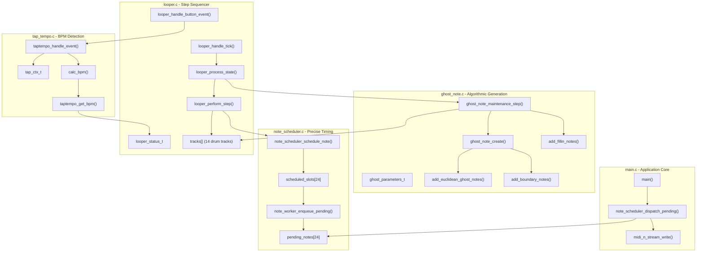
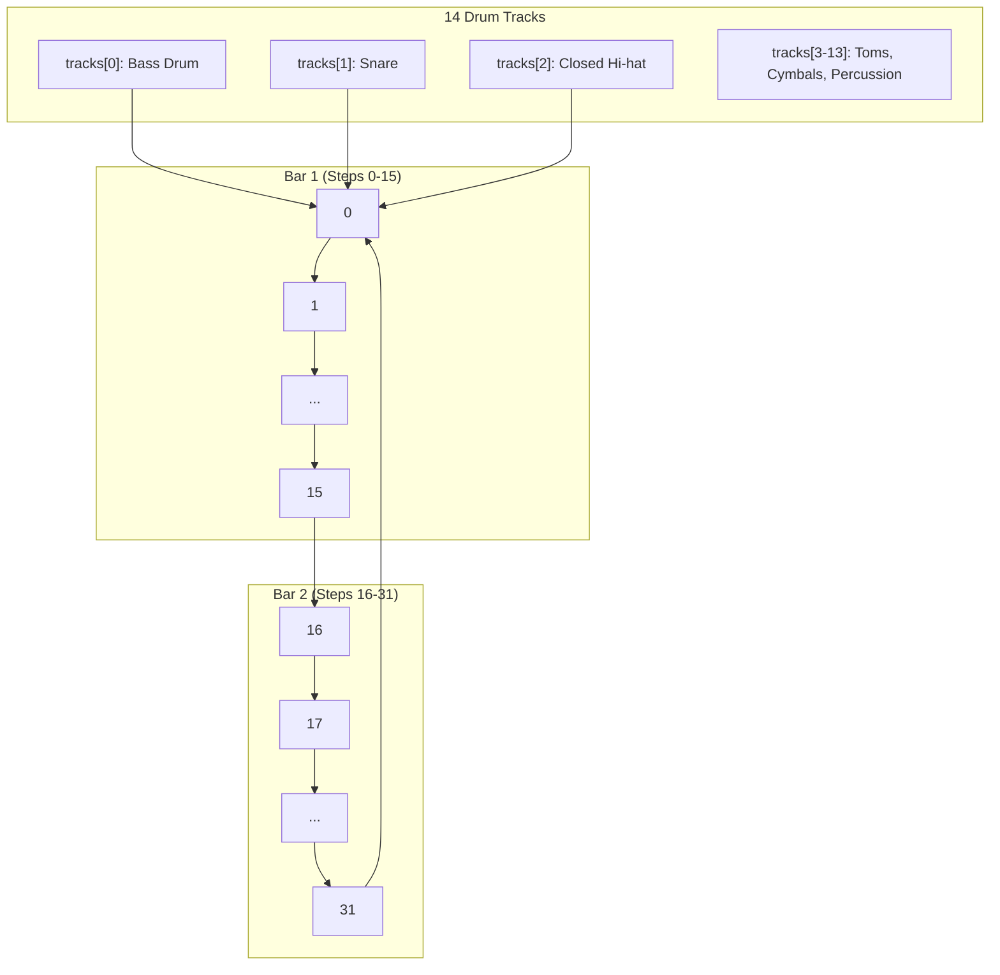
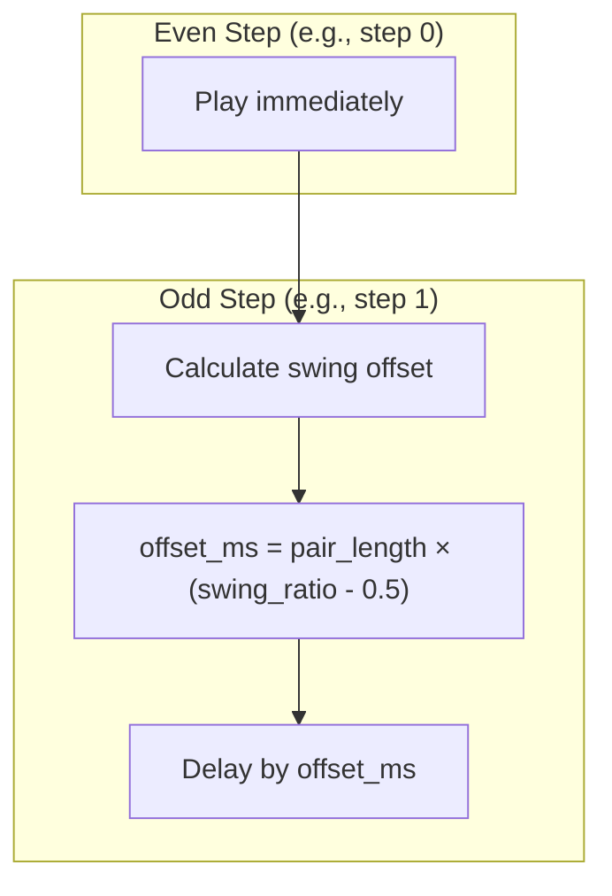
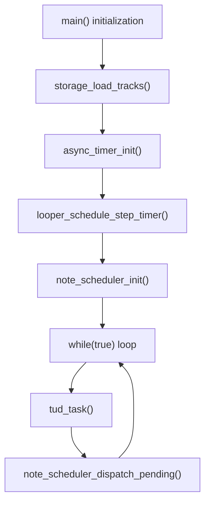
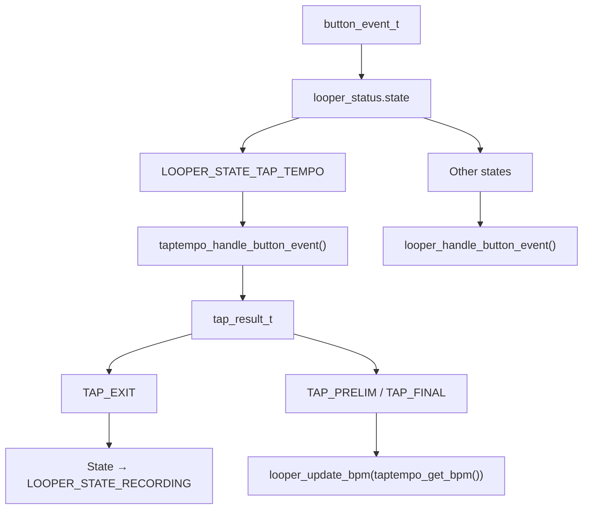

# Musical Processing

> **Relevant source files**
> * [ghost_note.c](https://github.com/Jus-Be/orinayo-pico/blob/122fa496/ghost_note.c)
> * [ghost_note.h](https://github.com/Jus-Be/orinayo-pico/blob/122fa496/ghost_note.h)
> * [looper.c](https://github.com/Jus-Be/orinayo-pico/blob/122fa496/looper.c)
> * [main.c](https://github.com/Jus-Be/orinayo-pico/blob/122fa496/main.c)
> * [note_scheduler.c](https://github.com/Jus-Be/orinayo-pico/blob/122fa496/note_scheduler.c)
> * [note_scheduler.h](https://github.com/Jus-Be/orinayo-pico/blob/122fa496/note_scheduler.h)
> * [tap_tempo.c](https://github.com/Jus-Be/orinayo-pico/blob/122fa496/tap_tempo.c)
> * [tap_tempo.h](https://github.com/Jus-Be/orinayo-pico/blob/122fa496/tap_tempo.h)

## Purpose and Scope

The Musical Processing subsystem transforms input events from the Bluetooth controller into rhythmic MIDI output through a sophisticated 2-bar step sequencer with algorithmic enhancement. This system coordinates timing, pattern storage, note generation, and MIDI transmission across multiple modules.

This page provides an architectural overview of the musical processing components and their interactions. For detailed information about specific subsystems, see:

* Main application coordination and MIDI output: [Main Application Loop](./5.1-main-application-loop.md)
* Pattern recording and playback: [Step Sequencer](./5.2-step-sequencer.md)
* Timing source management: [Clock Synchronization](./5.3-clock-synchronization.md)
* Algorithmic pattern enhancement: [Ghost Note Generation](./5.4-ghost-note-generation.md)
* Microsecond-precision note timing: [Note Scheduler](./5.5-note-scheduler.md)
* BPM detection from user input: [Tap Tempo](./5.6-tap-tempo.md)

For information about the Bluetooth input that drives this system, see [Bluetooth Input System](./4-bluetooth-input-system.md). For MIDI output details, see [MIDI Output System](./6-midi-output-system.md).

## System Architecture

The musical processing subsystem consists of five primary modules that work together to generate rhythmic MIDI patterns:



**Sources:** [main.c L125-L173](https://github.com/Jus-Be/orinayo-pico/blob/122fa496/main.c#L125-L173)

 [looper.c L1-L527](https://github.com/Jus-Be/orinayo-pico/blob/122fa496/looper.c#L1-L527)

 [ghost_note.c L1-L349](https://github.com/Jus-Be/orinayo-pico/blob/122fa496/ghost_note.c#L1-L349)

 [note_scheduler.c L1-L100](https://github.com/Jus-Be/orinayo-pico/blob/122fa496/note_scheduler.c#L1-L100)

 [tap_tempo.c L1-L113](https://github.com/Jus-Be/orinayo-pico/blob/122fa496/tap_tempo.c#L1-L113)

### Core Data Structures

The musical processing subsystem maintains state through several key data structures:

| Structure | Location | Purpose |
| --- | --- | --- |
| `looper_status_t` | looper.c | Current step, BPM, state machine, timing information |
| `track_t[14]` | looper.c | Pattern storage for 14 drum tracks (32 steps each) |
| `ghost_parameters_t` | ghost_note.c | Algorithm configuration for ghost note generation |
| `scheduled_note_slot_t[24]` | note_scheduler.c | Queue of notes awaiting precise-time dispatch |
| `tap_ctx_t` | tap_tempo.c | Tap timing history for BPM calculation |

**Sources:** [looper.c L49-L66](https://github.com/Jus-Be/orinayo-pico/blob/122fa496/looper.c#L49-L66)

 [ghost_note.c L21-L27](https://github.com/Jus-Be/orinayo-pico/blob/122fa496/ghost_note.c#L21-L27)

 [note_scheduler.c L23-L36](https://github.com/Jus-Be/orinayo-pico/blob/122fa496/note_scheduler.c#L23-L36)

 [tap_tempo.c L32-L38](https://github.com/Jus-Be/orinayo-pico/blob/122fa496/tap_tempo.c#L32-L38)

## Processing Pipeline

The musical processing pipeline operates in three distinct phases: timer-driven step advancement, algorithmic enhancement, and USB-safe note dispatch.

```mermaid
sequenceDiagram
  participant async_timer
  participant looper_process_state()
  participant ghost_note_maintenance_step()
  participant note_scheduler_schedule_note()
  participant scheduled_slots[]
  participant note_worker_enqueue_pending()
  participant pending_notes[]
  participant main() loop
  participant note_scheduler_dispatch_pending()
  participant looper_perform_note()

  async_timer->>looper_process_state(): looper_handle_tick() every step_period_ms
  looper_process_state()->>looper_process_state(): looper_advance_step()
  looper_process_state()->>looper_process_state(): looper_perform_step()
  loop [For each track]
    looper_process_state()->>looper_process_state(): Check pattern[current_step]
    looper_process_state()->>ghost_note_maintenance_step(): ghost_note_modulate_base_velocity()
    looper_process_state()->>note_scheduler_schedule_note(): schedule with swing offset
    note_scheduler_schedule_note()->>scheduled_slots[]: Find free slot
    note_scheduler_schedule_note()->>async_timer: async_context_add_at_time_worker_at()
  end
  looper_process_state()->>ghost_note_maintenance_step(): ghost_note_maintenance_step()
  ghost_note_maintenance_step()->>ghost_note_maintenance_step(): Update LFO, swing ratio
  note over async_timer,note_worker_enqueue_pending(): Async context triggers at scheduled time
  async_timer->>note_worker_enqueue_pending(): Callback at precise timestamp
  note_worker_enqueue_pending()->>pending_notes[]: Enqueue note
  note over main() loop,looper_perform_note(): Main loop (no USB mutex)
  main() loop->>note_scheduler_dispatch_pending(): note_scheduler_dispatch_pending()
  note_scheduler_dispatch_pending()->>pending_notes[]: Read all valid entries
  note_scheduler_dispatch_pending()->>looper_perform_note(): looper_perform_note()
  looper_perform_note()->>looper_perform_note(): midi_n_stream_write()
```

**Sources:** [looper.c L422-L435](https://github.com/Jus-Be/orinayo-pico/blob/122fa496/looper.c#L422-L435)

 [looper.c L162-L194](https://github.com/Jus-Be/orinayo-pico/blob/122fa496/looper.c#L162-L194)

 [note_scheduler.c L48-L63](https://github.com/Jus-Be/orinayo-pico/blob/122fa496/note_scheduler.c#L48-L63)

 [note_scheduler.c L87-L99](https://github.com/Jus-Be/orinayo-pico/blob/122fa496/note_scheduler.c#L87-L99)

 [main.c L152-L170](https://github.com/Jus-Be/orinayo-pico/blob/122fa496/main.c#L152-L170)

### Step Sequencer Grid

The looper implements a 2-bar pattern with 32 16th-note steps across 14 simultaneous drum tracks:



Each track maintains three pattern arrays:

* `pattern[32]` - User-recorded or style-loaded notes
* `ghost_notes[32]` - Algorithmically generated enhancement
* `fill_pattern[32]` - Fill-in notes for phrase endings

**Sources:** [looper.c L51-L66](https://github.com/Jus-Be/orinayo-pico/blob/122fa496/looper.c#L51-L66)

 [looper.c L69-L101](https://github.com/Jus-Be/orinayo-pico/blob/122fa496/looper.c#L69-L101)

## State Machine and Clock Modes

The looper operates in two distinct clock modes with different state machines:

### Internal Clock States

```css
#mermaid-sstv1ugm1n8{font-family:ui-sans-serif,-apple-system,system-ui,Segoe UI,Helvetica;font-size:16px;fill:#333;}@keyframes edge-animation-frame{from{stroke-dashoffset:0;}}@keyframes dash{to{stroke-dashoffset:0;}}#mermaid-sstv1ugm1n8 .edge-animation-slow{stroke-dasharray:9,5!important;stroke-dashoffset:900;animation:dash 50s linear infinite;stroke-linecap:round;}#mermaid-sstv1ugm1n8 .edge-animation-fast{stroke-dasharray:9,5!important;stroke-dashoffset:900;animation:dash 20s linear infinite;stroke-linecap:round;}#mermaid-sstv1ugm1n8 .error-icon{fill:#dddddd;}#mermaid-sstv1ugm1n8 .error-text{fill:#222222;stroke:#222222;}#mermaid-sstv1ugm1n8 .edge-thickness-normal{stroke-width:1px;}#mermaid-sstv1ugm1n8 .edge-thickness-thick{stroke-width:3.5px;}#mermaid-sstv1ugm1n8 .edge-pattern-solid{stroke-dasharray:0;}#mermaid-sstv1ugm1n8 .edge-thickness-invisible{stroke-width:0;fill:none;}#mermaid-sstv1ugm1n8 .edge-pattern-dashed{stroke-dasharray:3;}#mermaid-sstv1ugm1n8 .edge-pattern-dotted{stroke-dasharray:2;}#mermaid-sstv1ugm1n8 .marker{fill:#999;stroke:#999;}#mermaid-sstv1ugm1n8 .marker.cross{stroke:#999;}#mermaid-sstv1ugm1n8 svg{font-family:ui-sans-serif,-apple-system,system-ui,Segoe UI,Helvetica;font-size:16px;}#mermaid-sstv1ugm1n8 p{margin:0;}#mermaid-sstv1ugm1n8 defs #statediagram-barbEnd{fill:#999;stroke:#999;}#mermaid-sstv1ugm1n8 g.stateGroup text{fill:#dddddd;stroke:none;font-size:10px;}#mermaid-sstv1ugm1n8 g.stateGroup text{fill:#333;stroke:none;font-size:10px;}#mermaid-sstv1ugm1n8 g.stateGroup .state-title{font-weight:bolder;fill:#333;}#mermaid-sstv1ugm1n8 g.stateGroup rect{fill:#ffffff;stroke:#dddddd;}#mermaid-sstv1ugm1n8 g.stateGroup line{stroke:#999;stroke-width:1;}#mermaid-sstv1ugm1n8 .transition{stroke:#999;stroke-width:1;fill:none;}#mermaid-sstv1ugm1n8 .stateGroup .composit{fill:#f4f4f4;border-bottom:1px;}#mermaid-sstv1ugm1n8 .stateGroup .alt-composit{fill:#e0e0e0;border-bottom:1px;}#mermaid-sstv1ugm1n8 .state-note{stroke:#e6d280;fill:#fff5ad;}#mermaid-sstv1ugm1n8 .state-note text{fill:#333;stroke:none;font-size:10px;}#mermaid-sstv1ugm1n8 .stateLabel .box{stroke:none;stroke-width:0;fill:#ffffff;opacity:0.5;}#mermaid-sstv1ugm1n8 .edgeLabel .label rect{fill:#ffffff;opacity:0.5;}#mermaid-sstv1ugm1n8 .edgeLabel{background-color:#ffffff;text-align:center;}#mermaid-sstv1ugm1n8 .edgeLabel p{background-color:#ffffff;}#mermaid-sstv1ugm1n8 .edgeLabel rect{opacity:0.5;background-color:#ffffff;fill:#ffffff;}#mermaid-sstv1ugm1n8 .edgeLabel .label text{fill:#333;}#mermaid-sstv1ugm1n8 .label div .edgeLabel{color:#333;}#mermaid-sstv1ugm1n8 .stateLabel text{fill:#333;font-size:10px;font-weight:bold;}#mermaid-sstv1ugm1n8 .node circle.state-start{fill:#999;stroke:#999;}#mermaid-sstv1ugm1n8 .node .fork-join{fill:#999;stroke:#999;}#mermaid-sstv1ugm1n8 .node circle.state-end{fill:#dddddd;stroke:#f4f4f4;stroke-width:1.5;}#mermaid-sstv1ugm1n8 .end-state-inner{fill:#f4f4f4;stroke-width:1.5;}#mermaid-sstv1ugm1n8 .node rect{fill:#ffffff;stroke:#dddddd;stroke-width:1px;}#mermaid-sstv1ugm1n8 .node polygon{fill:#ffffff;stroke:#dddddd;stroke-width:1px;}#mermaid-sstv1ugm1n8 #statediagram-barbEnd{fill:#999;}#mermaid-sstv1ugm1n8 .statediagram-cluster rect{fill:#ffffff;stroke:#dddddd;stroke-width:1px;}#mermaid-sstv1ugm1n8 .cluster-label,#mermaid-sstv1ugm1n8 .nodeLabel{color:#333;}#mermaid-sstv1ugm1n8 .statediagram-cluster rect.outer{rx:5px;ry:5px;}#mermaid-sstv1ugm1n8 .statediagram-state .divider{stroke:#dddddd;}#mermaid-sstv1ugm1n8 .statediagram-state .title-state{rx:5px;ry:5px;}#mermaid-sstv1ugm1n8 .statediagram-cluster.statediagram-cluster .inner{fill:#f4f4f4;}#mermaid-sstv1ugm1n8 .statediagram-cluster.statediagram-cluster-alt .inner{fill:#f8f8f8;}#mermaid-sstv1ugm1n8 .statediagram-cluster .inner{rx:0;ry:0;}#mermaid-sstv1ugm1n8 .statediagram-state rect.basic{rx:5px;ry:5px;}#mermaid-sstv1ugm1n8 .statediagram-state rect.divider{stroke-dasharray:10,10;fill:#f8f8f8;}#mermaid-sstv1ugm1n8 .note-edge{stroke-dasharray:5;}#mermaid-sstv1ugm1n8 .statediagram-note rect{fill:#fff5ad;stroke:#e6d280;stroke-width:1px;rx:0;ry:0;}#mermaid-sstv1ugm1n8 .statediagram-note rect{fill:#fff5ad;stroke:#e6d280;stroke-width:1px;rx:0;ry:0;}#mermaid-sstv1ugm1n8 .statediagram-note text{fill:#333;}#mermaid-sstv1ugm1n8 .statediagram-note .nodeLabel{color:#333;}#mermaid-sstv1ugm1n8 .statediagram .edgeLabel{color:red;}#mermaid-sstv1ugm1n8 #dependencyStart,#mermaid-sstv1ugm1n8 #dependencyEnd{fill:#999;stroke:#999;stroke-width:1;}#mermaid-sstv1ugm1n8 .statediagramTitleText{text-anchor:middle;font-size:18px;fill:#333;}#mermaid-sstv1ugm1n8 :root{--mermaid-font-family:"trebuchet ms",verdana,arial,sans-serif;}enable_midi_drums=falseenable_midi_drums=trueBUTTON_EVENT_CLICK_RELEASEContinue recording stepsBUTTON_EVENT_HOLD_RELEASENext stepBUTTON_EVENT_LONG_HOLD_RELEASETAP_EXIT eventBUTTON_EVENT_VERY_LONG_HOLD_RELEASENext stepWAITINGPLAYINGRECORDINGTRACK_SWITCHTAP_TEMPOCLEAR_TRACKS
```

### External Clock States

```css
#mermaid-cqt91je5phq{font-family:ui-sans-serif,-apple-system,system-ui,Segoe UI,Helvetica;font-size:16px;fill:#333;}@keyframes edge-animation-frame{from{stroke-dashoffset:0;}}@keyframes dash{to{stroke-dashoffset:0;}}#mermaid-cqt91je5phq .edge-animation-slow{stroke-dasharray:9,5!important;stroke-dashoffset:900;animation:dash 50s linear infinite;stroke-linecap:round;}#mermaid-cqt91je5phq .edge-animation-fast{stroke-dasharray:9,5!important;stroke-dashoffset:900;animation:dash 20s linear infinite;stroke-linecap:round;}#mermaid-cqt91je5phq .error-icon{fill:#dddddd;}#mermaid-cqt91je5phq .error-text{fill:#222222;stroke:#222222;}#mermaid-cqt91je5phq .edge-thickness-normal{stroke-width:1px;}#mermaid-cqt91je5phq .edge-thickness-thick{stroke-width:3.5px;}#mermaid-cqt91je5phq .edge-pattern-solid{stroke-dasharray:0;}#mermaid-cqt91je5phq .edge-thickness-invisible{stroke-width:0;fill:none;}#mermaid-cqt91je5phq .edge-pattern-dashed{stroke-dasharray:3;}#mermaid-cqt91je5phq .edge-pattern-dotted{stroke-dasharray:2;}#mermaid-cqt91je5phq .marker{fill:#999;stroke:#999;}#mermaid-cqt91je5phq .marker.cross{stroke:#999;}#mermaid-cqt91je5phq svg{font-family:ui-sans-serif,-apple-system,system-ui,Segoe UI,Helvetica;font-size:16px;}#mermaid-cqt91je5phq p{margin:0;}#mermaid-cqt91je5phq defs #statediagram-barbEnd{fill:#999;stroke:#999;}#mermaid-cqt91je5phq g.stateGroup text{fill:#dddddd;stroke:none;font-size:10px;}#mermaid-cqt91je5phq g.stateGroup text{fill:#333;stroke:none;font-size:10px;}#mermaid-cqt91je5phq g.stateGroup .state-title{font-weight:bolder;fill:#333;}#mermaid-cqt91je5phq g.stateGroup rect{fill:#ffffff;stroke:#dddddd;}#mermaid-cqt91je5phq g.stateGroup line{stroke:#999;stroke-width:1;}#mermaid-cqt91je5phq .transition{stroke:#999;stroke-width:1;fill:none;}#mermaid-cqt91je5phq .stateGroup .composit{fill:#f4f4f4;border-bottom:1px;}#mermaid-cqt91je5phq .stateGroup .alt-composit{fill:#e0e0e0;border-bottom:1px;}#mermaid-cqt91je5phq .state-note{stroke:#e6d280;fill:#fff5ad;}#mermaid-cqt91je5phq .state-note text{fill:#333;stroke:none;font-size:10px;}#mermaid-cqt91je5phq .stateLabel .box{stroke:none;stroke-width:0;fill:#ffffff;opacity:0.5;}#mermaid-cqt91je5phq .edgeLabel .label rect{fill:#ffffff;opacity:0.5;}#mermaid-cqt91je5phq .edgeLabel{background-color:#ffffff;text-align:center;}#mermaid-cqt91je5phq .edgeLabel p{background-color:#ffffff;}#mermaid-cqt91je5phq .edgeLabel rect{opacity:0.5;background-color:#ffffff;fill:#ffffff;}#mermaid-cqt91je5phq .edgeLabel .label text{fill:#333;}#mermaid-cqt91je5phq .label div .edgeLabel{color:#333;}#mermaid-cqt91je5phq .stateLabel text{fill:#333;font-size:10px;font-weight:bold;}#mermaid-cqt91je5phq .node circle.state-start{fill:#999;stroke:#999;}#mermaid-cqt91je5phq .node .fork-join{fill:#999;stroke:#999;}#mermaid-cqt91je5phq .node circle.state-end{fill:#dddddd;stroke:#f4f4f4;stroke-width:1.5;}#mermaid-cqt91je5phq .end-state-inner{fill:#f4f4f4;stroke-width:1.5;}#mermaid-cqt91je5phq .node rect{fill:#ffffff;stroke:#dddddd;stroke-width:1px;}#mermaid-cqt91je5phq .node polygon{fill:#ffffff;stroke:#dddddd;stroke-width:1px;}#mermaid-cqt91je5phq #statediagram-barbEnd{fill:#999;}#mermaid-cqt91je5phq .statediagram-cluster rect{fill:#ffffff;stroke:#dddddd;stroke-width:1px;}#mermaid-cqt91je5phq .cluster-label,#mermaid-cqt91je5phq .nodeLabel{color:#333;}#mermaid-cqt91je5phq .statediagram-cluster rect.outer{rx:5px;ry:5px;}#mermaid-cqt91je5phq .statediagram-state .divider{stroke:#dddddd;}#mermaid-cqt91je5phq .statediagram-state .title-state{rx:5px;ry:5px;}#mermaid-cqt91je5phq .statediagram-cluster.statediagram-cluster .inner{fill:#f4f4f4;}#mermaid-cqt91je5phq .statediagram-cluster.statediagram-cluster-alt .inner{fill:#f8f8f8;}#mermaid-cqt91je5phq .statediagram-cluster .inner{rx:0;ry:0;}#mermaid-cqt91je5phq .statediagram-state rect.basic{rx:5px;ry:5px;}#mermaid-cqt91je5phq .statediagram-state rect.divider{stroke-dasharray:10,10;fill:#f8f8f8;}#mermaid-cqt91je5phq .note-edge{stroke-dasharray:5;}#mermaid-cqt91je5phq .statediagram-note rect{fill:#fff5ad;stroke:#e6d280;stroke-width:1px;rx:0;ry:0;}#mermaid-cqt91je5phq .statediagram-note rect{fill:#fff5ad;stroke:#e6d280;stroke-width:1px;rx:0;ry:0;}#mermaid-cqt91je5phq .statediagram-note text{fill:#333;}#mermaid-cqt91je5phq .statediagram-note .nodeLabel{color:#333;}#mermaid-cqt91je5phq .statediagram .edgeLabel{color:red;}#mermaid-cqt91je5phq #dependencyStart,#mermaid-cqt91je5phq #dependencyEnd{fill:#999;stroke:#999;stroke-width:1;}#mermaid-cqt91je5phq .statediagramTitleText{text-anchor:middle;font-size:18px;fill:#333;}#mermaid-cqt91je5phq :root{--mermaid-font-family:"trebuchet ms",verdana,arial,sans-serif;}No MIDI clockMIDI Start + ClockBUTTON_EVENT_HOLD_RELEASEBUTTON_EVENT_HOLD_RELEASEClock timeout (250ms)Clock timeout (250ms)WAITINGSYNC_PLAYINGSYNC_MUTE
```

The system automatically detects and switches between internal and external clock sources based on MIDI clock message reception at [looper.c L457-L472](https://github.com/Jus-Be/orinayo-pico/blob/122fa496/looper.c#L457-L472)

**Sources:** [looper.c L293-L340](https://github.com/Jus-Be/orinayo-pico/blob/122fa496/looper.c#L293-L340)

 [looper.c L346-L374](https://github.com/Jus-Be/orinayo-pico/blob/122fa496/looper.c#L346-L374)

 [looper.c L437-L454](https://github.com/Jus-Be/orinayo-pico/blob/122fa496/looper.c#L437-L454)

## Algorithmic Note Generation

The ghost note system enhances user patterns with three complementary algorithms:

| Algorithm | Implementation | Purpose | Configuration |
| --- | --- | --- | --- |
| **Euclidean** | `add_euclidean_ghost_notes()` | Evenly distribute notes across the pattern | `k_max=16`, `k_sufficient=6`, `probability=0.80` |
| **Boundary** | `add_boundary_notes()` | Add grace notes before/after user notes | `before=0.10`, `after=0.50` |
| **Fill-in** | `add_fillin_notes()` | Generate ending fills based on track density | `interval_bar=4`, `probability=0.40` |

### Ghost Note Probability Model

Ghost notes are generated probabilistically and applied only when:

```
(ghost_note_probability / 100.0) * ghost_intensity > (random_sample / 100.0)
```

The `ghost_intensity` parameter (default: 0.843) acts as a global multiplier, allowing dynamic control of algorithmic enhancement density. Each ghost note stores both a `probability` value (0-100) and a `rand_sample` (0-100) for deterministic playback.

**Sources:** [ghost_note.c L146-L182](https://github.com/Jus-Be/orinayo-pico/blob/122fa496/ghost_note.c#L146-L182)

 [ghost_note.c L185-L204](https://github.com/Jus-Be/orinayo-pico/blob/122fa496/ghost_note.c#L185-L204)

 [ghost_note.c L226-L254](https://github.com/Jus-Be/orinayo-pico/blob/122fa496/ghost_note.c#L226-L254)

 [looper.c L182-L189](https://github.com/Jus-Be/orinayo-pico/blob/122fa496/looper.c#L182-L189)

## Swing and Timing Modulation

The system implements musical swing by delaying odd-numbered steps:



The `swing_ratio` is dynamically modulated based on `ghost_intensity` and an LFO (Low-Frequency Oscillator) for subtle rhythmic variation. When `ghost_intensity < 0.5`, swing is disabled (`swing_ratio = 0.5`). Above 0.5, swing increases exponentially up to a maximum of 0.65.

Velocity modulation is applied to kick drum and hi-hat tracks using sinusoidal LFO patterns at [ghost_note.c L56-L67](https://github.com/Jus-Be/orinayo-pico/blob/122fa496/ghost_note.c#L56-L67)

**Sources:** [looper.c L148-L158](https://github.com/Jus-Be/orinayo-pico/blob/122fa496/looper.c#L148-L158)

 [ghost_note.c L69-L88](https://github.com/Jus-Be/orinayo-pico/blob/122fa496/ghost_note.c#L69-L88)

## Note Scheduler Architecture

The note scheduler implements a two-stage approach to avoid USB mutex contention:

### Stage 1: Async Context Scheduling

Notes are scheduled at precise microsecond timestamps using the async timer system:

```
bool note_scheduler_schedule_note(uint64_t time_us, uint8_t channel, 
                                  uint8_t note, uint8_t velocity)
```

This function:

1. Finds a free slot in `scheduled_slots[24]`
2. Stores note parameters in the slot's `pending` field
3. Registers the slot's worker with `async_context_add_at_time_worker_at()`

**Sources:** [note_scheduler.c L69-L84](https://github.com/Jus-Be/orinayo-pico/blob/122fa496/note_scheduler.c#L69-L84)

### Stage 2: Main Loop Dispatch

When the async context triggers the worker at the scheduled time, `note_worker_enqueue_pending()` moves the note to a thread-safe `pending_notes[]` queue. The main loop then calls `note_scheduler_dispatch_pending()` to transmit all pending notes via `looper_perform_note()`.

This separation ensures MIDI transmission occurs in a context where the USB mutex can be safely acquired.

**Sources:** [note_scheduler.c L48-L63](https://github.com/Jus-Be/orinayo-pico/blob/122fa496/note_scheduler.c#L48-L63)

 [note_scheduler.c L87-L99](https://github.com/Jus-Be/orinayo-pico/blob/122fa496/note_scheduler.c#L87-L99)

## Timing and Synchronization

### BPM Calculation

The step period is calculated as:

```
step_period_ms = 60000 / (bpm × LOOPER_STEPS_PER_BEAT)
```

Where `LOOPER_STEPS_PER_BEAT = 4` (16th notes). For example, at 120 BPM:

```
step_period_ms = 60000 / (120 × 4) = 125 ms
```

**Sources:** [looper.c L281-L285](https://github.com/Jus-Be/orinayo-pico/blob/122fa496/looper.c#L281-L285)

### External MIDI Clock Synchronization

When MIDI Clock messages (0xF8) are received, the system:

1. Detects the transition from internal to external clock
2. Removes the internal tick timer from the async context
3. Advances steps every 6 MIDI clock ticks (1/16th note at 24 PPQN)
4. Calculates BPM from inter-tick intervals: `bpm = 60000000.0 / ((interval_us / 6) × 24)`

If no MIDI clock is received for 250ms, the system automatically reverts to internal clock.

**Sources:** [looper.c L457-L486](https://github.com/Jus-Be/orinayo-pico/blob/122fa496/looper.c#L457-L486)

 [looper.c L437-L454](https://github.com/Jus-Be/orinayo-pico/blob/122fa496/looper.c#L437-L454)

## Integration with Main Application

The main application in `main.c` coordinates the musical processing subsystem:



The main loop runs continuously, calling:

1. `tud_task()` - TinyUSB device task for USB processing
2. `note_scheduler_dispatch_pending()` - Transmit scheduled notes

The looper timer callback (`looper_handle_tick()`) runs asynchronously via the async_timer system, advancing the sequencer and scheduling notes.

**Sources:** [main.c L125-L173](https://github.com/Jus-Be/orinayo-pico/blob/122fa496/main.c#L125-L173)

## MIDI Output Functions

The musical processing subsystem transmits MIDI through several specialized functions in `main.c`:

| Function | Purpose | Usage |
| --- | --- | --- |
| `midi_n_stream_write()` | Dual USB/UART transmission | All MIDI output bottleneck |
| `looper_perform_note()` | Send Note On/Off with 0.75× velocity scaling | Called by note scheduler |
| `midi_seqtrak_tempo()` | Update SeqTrak tempo via SysEx | Called when BPM changes |
| `midi_seqtrak_arp()` | Configure arpeggiator based on strum pattern | Mode-specific control |

All MIDI messages are transmitted simultaneously to both USB (via TinyUSB) and UART (at 31,250 baud) at [main.c L690-L697](https://github.com/Jus-Be/orinayo-pico/blob/122fa496/main.c#L690-L697)

**Sources:** [main.c L690-L697](https://github.com/Jus-Be/orinayo-pico/blob/122fa496/main.c#L690-L697)

 [looper.c L120-L129](https://github.com/Jus-Be/orinayo-pico/blob/122fa496/looper.c#L120-L129)

 [looper.c L281-L285](https://github.com/Jus-Be/orinayo-pico/blob/122fa496/looper.c#L281-L285)

## Configuration and Presets

### Drum Styles

The looper includes 5 preset drum style groups with 5 variations each (ARRA, ARRB, ARRC, ARRD, fill) stored in the `drum_styles[5][5][32]` array. Each entry is a bitmask where each bit represents a drum track. Styles are copied to the pattern memory at the start of each 4-bar phrase when `style_group > -1`.

**Sources:** [looper.c L69-L101](https://github.com/Jus-Be/orinayo-pico/blob/122fa496/looper.c#L69-L101)

 [looper.c L210-L219](https://github.com/Jus-Be/orinayo-pico/blob/122fa496/looper.c#L210-L219)

 [looper.c L302-L304](https://github.com/Jus-Be/orinayo-pico/blob/122fa496/looper.c#L302-L304)

### Ghost Note Parameters

Default ghost note parameters are defined at [ghost_note.c L21-L27](https://github.com/Jus-Be/orinayo-pico/blob/122fa496/ghost_note.c#L21-L27)

:

```
static ghost_parameters_t parameters = {
    .ghost_intensity = 0.843,
    .swing_ratio = 0.5,
    .boundary = {.before_probability = 0.10, .after_probability = 0.50},
    .euclidean = {.k_max = 16, .k_sufficient = 6, .k_intensity = 0.90, .probability = 0.80},
    .fill = {.interval_bar = 4, .start_mean = 15.0, .start_sd = 5.0, .probability = 0.40},
};
```

These parameters can be accessed via `ghost_note_parameters()` for runtime modification.

## Button Input Integration

Button events from the physical input are routed through the looper for different purposes based on the current state:



Button event types handled:

* `BUTTON_EVENT_CLICK_RELEASE` - Record step or tap tempo beat
* `BUTTON_EVENT_HOLD_RELEASE` - Switch track or toggle mute (external clock)
* `BUTTON_EVENT_LONG_HOLD_RELEASE` - Enter tap tempo mode
* `BUTTON_EVENT_VERY_LONG_HOLD_RELEASE` - Clear all tracks

**Sources:** [looper.c L377-L420](https://github.com/Jus-Be/orinayo-pico/blob/122fa496/looper.c#L377-L420)

 [looper.c L495-L514](https://github.com/Jus-Be/orinayo-pico/blob/122fa496/looper.c#L495-L514)

 [looper.c L257-L270](https://github.com/Jus-Be/orinayo-pico/blob/122fa496/looper.c#L257-L270)

## Performance Considerations

The musical processing subsystem is designed for real-time performance with the following characteristics:

1. **Deterministic Timing**: Step advancement occurs at precisely calculated intervals based on BPM
2. **Lock-Free Dispatch**: Note scheduler uses critical sections only for queue access, not MIDI transmission
3. **Async Safety**: Timer callbacks perform minimal work, deferring USB operations to main loop
4. **Memory Efficiency**: Fixed-size arrays (24 note slots, 32 steps, 14 tracks) avoid dynamic allocation
5. **Pattern Density**: Ghost note generation scales with existing pattern density to avoid overcrowding

The system can handle up to 24 simultaneously scheduled notes with microsecond-precision timing, ensuring tight synchronization even under load.

**Sources:** [note_scheduler.c L1-L100](https://github.com/Jus-Be/orinayo-pico/blob/122fa496/note_scheduler.c#L1-L100)

 [looper.c L422-L435](https://github.com/Jus-Be/orinayo-pico/blob/122fa496/looper.c#L422-L435)

 [ghost_note.c L206-L223](https://github.com/Jus-Be/orinayo-pico/blob/122fa496/ghost_note.c#L206-L223)