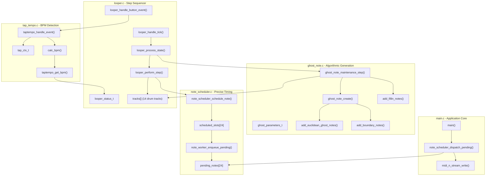
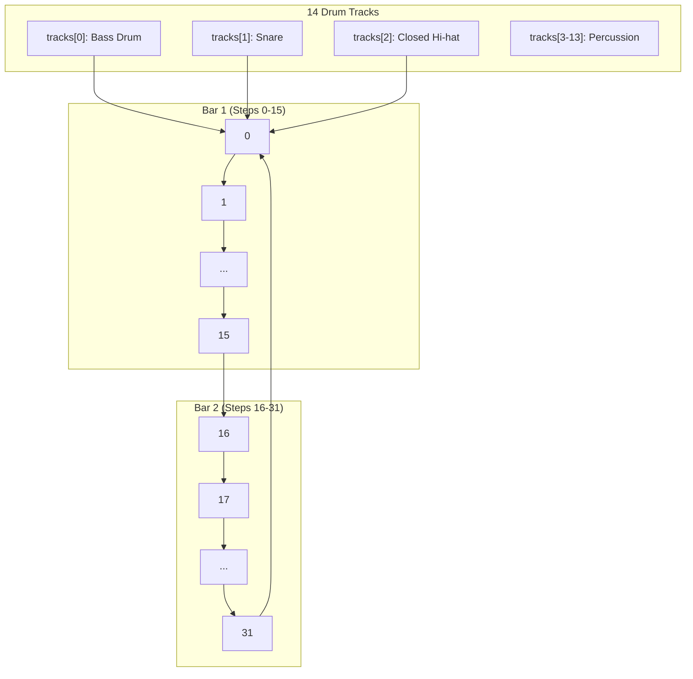
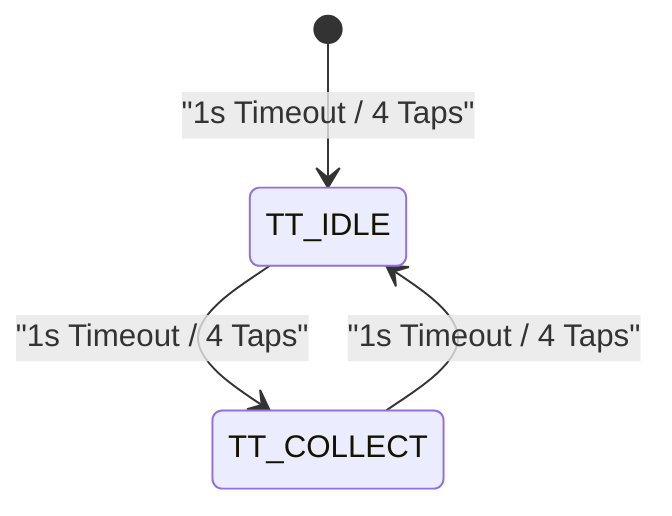

# Musical Processing

> **Relevant source files**
> * [ghost_note.c](https://github.com/Jus-Be/orinayo-pico/blob/6dde5a75/ghost_note.c)
> * [ghost_note.h](https://github.com/Jus-Be/orinayo-pico/blob/6dde5a75/ghost_note.h)
> * [looper.c](https://github.com/Jus-Be/orinayo-pico/blob/6dde5a75/looper.c)
> * [looper.h](https://github.com/Jus-Be/orinayo-pico/blob/6dde5a75/looper.h)
> * [main.c](https://github.com/Jus-Be/orinayo-pico/blob/6dde5a75/main.c)
> * [note_scheduler.c](https://github.com/Jus-Be/orinayo-pico/blob/6dde5a75/note_scheduler.c)
> * [note_scheduler.h](https://github.com/Jus-Be/orinayo-pico/blob/6dde5a75/note_scheduler.h)

## Purpose and Scope

The Musical Processing subsystem transforms input events from the Bluetooth controller into rhythmic MIDI output through a sophisticated 2-bar step sequencer with algorithmic enhancement. This system coordinates timing, pattern storage, note generation, and MIDI transmission across multiple modules.

This page provides an architectural overview of the musical processing components and their interactions. For detailed information about specific subsystems, see:

* Main application coordination and MIDI output: [Main Application Loop](./5.1-main-application-loop.md)
* Pattern recording and playback: [Step Sequencer](./5.2-step-sequencer.md)
* Timing source management: [Clock Synchronization](./5.3-clock-synchronization.md)
* Algorithmic pattern enhancement: [Ghost Note Generation](./5.4-ghost-note-generation.md)
* Microsecond-precision note timing: [Note Scheduler](./5.5-note-scheduler.md)
* BPM detection from user input: [Tap Tempo](./5.6-tap-tempo.md)

For information about the Bluetooth input that drives this system, see [Bluetooth Input System](./4-bluetooth-input-system.md). For MIDI output details, see [MIDI Output System](./6-midi-output-system.md).

## System Architecture

The musical processing subsystem consists of five primary modules that work together to generate rhythmic MIDI patterns:

```mermaid
flowchart TD

MainLoop["main()"]
DispatchNotes["note_scheduler_dispatch_pending()"]
StreamWrite["midi_n_stream_write()"]
LooperState["looper_status_t"]
ProcessState["looper_process_state()"]
PerformStep["looper_perform_step()"]
HandleButton["looper_handle_button_event()"]
HandleTick["looper_handle_tick()"]
Tracks["tracks[] (14 drum tracks)"]
GhostParams["ghost_parameters_t"]
CreateGhost["ghost_note_create()"]
AddEuclidean["add_euclidean_ghost_notes()"]
AddBoundary["add_boundary_notes()"]
AddFillin["add_fillin_notes()"]
Maintenance["ghost_note_maintenance_step()"]
ScheduleNote["note_scheduler_schedule_note()"]
ScheduledSlots["scheduled_slots[24]"]
PendingNotes["pending_notes[24]"]
WorkerEnqueue["note_worker_enqueue_pending()"]
TapHandle["taptempo_handle_event()"]
TapCtx["tap_ctx_t"]
CalcBPM["calc_bpm()"]
GetBPM["taptempo_get_bpm()"]

DispatchNotes --> PendingNotes
PerformStep --> ScheduleNote
ProcessState --> Maintenance
Maintenance --> Tracks
HandleButton --> TapHandle
GetBPM --> LooperState

subgraph subGraph4 ["tap_tempo.c - BPM Detection"]
    TapHandle
    TapCtx
    CalcBPM
    GetBPM
    TapHandle --> TapCtx
    TapHandle --> CalcBPM
    CalcBPM --> GetBPM
end

subgraph subGraph3 ["note_scheduler.c - Precise Timing"]
    ScheduleNote
    ScheduledSlots
    PendingNotes
    WorkerEnqueue
    ScheduleNote --> ScheduledSlots
    ScheduledSlots --> WorkerEnqueue
    WorkerEnqueue --> PendingNotes
end

subgraph subGraph2 ["ghost_note.c - Algorithmic Generation"]
    GhostParams
    CreateGhost
    AddEuclidean
    AddBoundary
    AddFillin
    Maintenance
    Maintenance --> CreateGhost
    CreateGhost --> AddEuclidean
    CreateGhost --> AddBoundary
    Maintenance --> AddFillin
end

subgraph subGraph1 ["looper.c - Step Sequencer"]
    LooperState
    ProcessState
    PerformStep
    HandleButton
    HandleTick
    Tracks
    HandleTick --> ProcessState
    ProcessState --> PerformStep
    PerformStep --> Tracks
end

subgraph subGraph0 ["main.c - Application Core"]
    MainLoop
    DispatchNotes
    StreamWrite
    MainLoop --> DispatchNotes
    DispatchNotes --> StreamWrite
end
```

**Sources:** [looper.c L1-L1400](https://github.com/Jus-Be/orinayo-pico/blob/6dde5a75/looper.c#L1-L1400)

 [ghost_note.c L1-L349](https://github.com/Jus-Be/orinayo-pico/blob/6dde5a75/ghost_note.c#L1-L349)

 [note_scheduler.c L1-L100](https://github.com/Jus-Be/orinayo-pico/blob/6dde5a75/note_scheduler.c#L1-L100)

 [tap_tempo.c L1-L113](https://github.com/Jus-Be/orinayo-pico/blob/6dde5a75/tap_tempo.c#L1-L113)

### Core Data Structures

The musical processing subsystem maintains state through several key data structures:

| Structure | Location | Purpose |
| --- | --- | --- |
| `looper_status_t` | `looper.h` | Current step, BPM, state machine, timing information |
| `track_t[14]` | `looper.c` | Pattern storage for 14 drum tracks (32 steps each) |
| `ghost_parameters_t` | `ghost_note.h` | Algorithm configuration for ghost note generation |
| `scheduled_note_slot_t[24]` | `note_scheduler.c` | Queue of notes awaiting precise-time dispatch |
| `tap_ctx_t` | `tap_tempo.c` | Tap timing history for BPM calculation |

**Sources:** [looper.h L48-L61](https://github.com/Jus-Be/orinayo-pico/blob/6dde5a75/looper.h#L48-L61)

 [looper.c L69-L101](https://github.com/Jus-Be/orinayo-pico/blob/6dde5a75/looper.c#L69-L101)

 [ghost_note.h L29-L36](https://github.com/Jus-Be/orinayo-pico/blob/6dde5a75/ghost_note.h#L29-L36)

 [note_scheduler.c L32-L35](https://github.com/Jus-Be/orinayo-pico/blob/6dde5a75/note_scheduler.c#L32-L35)

 [tap_tempo.c L32-L38](https://github.com/Jus-Be/orinayo-pico/blob/6dde5a75/tap_tempo.c#L32-L38)

## Processing Pipeline

The musical processing pipeline operates in three distinct phases: timer-driven step advancement, algorithmic enhancement, and USB-safe note dispatch.

```mermaid
sequenceDiagram
  participant async_timer
  participant looper_process_state()
  participant ghost_note_maintenance_step()
  participant note_scheduler_schedule_note()
  participant scheduled_slots[]
  participant note_worker_enqueue_pending()
  participant pending_notes[]
  participant main() loop
  participant note_scheduler_dispatch_pending()
  participant looper_perform_note()

  async_timer->>looper_process_state(): "looper_handle_tick()" every step_period_ms
  looper_process_state()->>looper_process_state(): "looper_advance_step()"
  looper_process_state()->>looper_process_state(): "looper_perform_step()"
  loop [For each track]
    looper_process_state()->>looper_process_state(): Check pattern[current_step]
    looper_process_state()->>ghost_note_maintenance_step(): "ghost_note_modulate_base_velocity()"
    looper_process_state()->>note_scheduler_schedule_note(): schedule with swing offset
    note_scheduler_schedule_note()->>scheduled_slots[]: Find free slot
    note_scheduler_schedule_note()->>async_timer: "async_context_add_at_time_worker_at()"
  end
  looper_process_state()->>ghost_note_maintenance_step(): "ghost_note_maintenance_step()"
  ghost_note_maintenance_step()->>ghost_note_maintenance_step(): Update LFO, swing ratio
  note over async_timer,note_worker_enqueue_pending(): Async context triggers at scheduled time
  async_timer->>note_worker_enqueue_pending(): Callback at precise timestamp
  note_worker_enqueue_pending()->>pending_notes[]: Enqueue note
  note over main() loop,looper_perform_note(): Main loop (no USB mutex)
  main() loop->>note_scheduler_dispatch_pending(): "note_scheduler_dispatch_pending()"
  note_scheduler_dispatch_pending()->>pending_notes[]: Read all valid entries
  note_scheduler_dispatch_pending()->>looper_perform_note(): "looper_perform_note()"
  looper_perform_note()->>looper_perform_note(): "midi_n_stream_write()"
```

**Sources:** [looper.c L162-L194](https://github.com/Jus-Be/orinayo-pico/blob/6dde5a75/looper.c#L162-L194)

 [note_scheduler.c L48-L63](https://github.com/Jus-Be/orinayo-pico/blob/6dde5a75/note_scheduler.c#L48-L63)

 [note_scheduler.c L87-L99](https://github.com/Jus-Be/orinayo-pico/blob/6dde5a75/note_scheduler.c#L87-L99)

### Step Sequencer Grid

The looper implements a 2-bar pattern with 32 16th-note steps across 14 simultaneous drum tracks:

```mermaid
flowchart TD

B1S0["0"]
B1S1["1"]
B1S2["..."]
B1S15["15"]
B2S16["16"]
B2S17["17"]
B2S18["..."]
B2S31["31"]
T0["tracks[0]: Bass Drum"]
T1["tracks[1]: Snare"]
T2["tracks[2]: Closed Hi-hat"]
T3["tracks[3-13]: Percussion"]

B1S15 --> B2S16
B2S31 --> B1S0
T0 --> B1S0
T1 --> B1S0
T2 --> B1S0

subgraph subGraph2 ["14 Drum Tracks"]
    T0
    T1
    T2
    T3
end

subgraph subGraph1 ["Bar 2 (Steps 16-31)"]
    B2S16
    B2S17
    B2S18
    B2S31
    B2S16 --> B2S17
    B2S17 --> B2S18
    B2S18 --> B2S31
end

subgraph subGraph0 ["Bar 1 (Steps 0-15)"]
    B1S0
    B1S1
    B1S2
    B1S15
    B1S0 --> B1S1
    B1S1 --> B1S2
    B1S2 --> B1S15
end
```

Each track maintains pattern arrays for user-recorded notes, algorithmic ghost notes, and fill-in patterns.

**Sources:** [looper.h L69-L77](https://github.com/Jus-Be/orinayo-pico/blob/6dde5a75/looper.h#L69-L77)

 [looper.c L69-L101](https://github.com/Jus-Be/orinayo-pico/blob/6dde5a75/looper.c#L69-L101)

## Algorithmic Note Generation

The ghost note system enhances user patterns with three complementary algorithms:

| Algorithm | Implementation | Purpose | Configuration |
| --- | --- | --- | --- |
| **Euclidean** | `add_euclidean_ghost_notes()` | Evenly distribute notes across the pattern | `k_max=16`, `k_sufficient=6` |
| **Boundary** | `add_boundary_notes()` | Add grace notes before/after user notes | `before=0.10`, `after=0.50` |
| **Fill-in** | `add_fillin_notes()` | Generate ending fills based on track density | `interval_bar=4`, `probability=0.40` |

Ghost notes are generated probabilistically. Each ghost note stores both a `probability` value (0-100) and a `rand_sample` (0-100) for deterministic playback during a phrase.

**Sources:** [ghost_note.c L146-L162](https://github.com/Jus-Be/orinayo-pico/blob/6dde5a75/ghost_note.c#L146-L162)

 [ghost_note.c L185-L204](https://github.com/Jus-Be/orinayo-pico/blob/6dde5a75/ghost_note.c#L185-L204)

 [ghost_note.c L226-L254](https://github.com/Jus-Be/orinayo-pico/blob/6dde5a75/ghost_note.c#L226-L254)

 [looper.h L64-L66](https://github.com/Jus-Be/orinayo-pico/blob/6dde5a75/looper.h#L64-L66)

## Swing and Timing Modulation

The system implements musical swing by delaying odd-numbered steps using `looper_get_swing_offset_us` [looper.c L148-L158](https://github.com/Jus-Be/orinayo-pico/blob/6dde5a75/looper.c#L148-L158)

The `swing_ratio` is dynamically modulated based on `ghost_intensity` and an LFO for subtle rhythmic variation. Velocity modulation is applied specifically to kick drum and hi-hat tracks using sinusoidal patterns [ghost_note.c L56-L67](https://github.com/Jus-Be/orinayo-pico/blob/6dde5a75/ghost_note.c#L56-L67)

**Sources:** [looper.c L148-L158](https://github.com/Jus-Be/orinayo-pico/blob/6dde5a75/looper.c#L148-L158)

 [ghost_note.c L69-L88](https://github.com/Jus-Be/orinayo-pico/blob/6dde5a75/ghost_note.c#L69-L88)

## Note Scheduler Architecture

The note scheduler implements a two-stage approach to avoid USB mutex contention:

### Stage 1: Async Context Scheduling

Notes are scheduled at precise microsecond timestamps using `note_scheduler_schedule_note` [note_scheduler.c L69-L84](https://github.com/Jus-Be/orinayo-pico/blob/6dde5a75/note_scheduler.c#L69-L84)

 This function finds a free slot in `scheduled_slots[24]` and registers a worker with the async timer system.

### Stage 2: Main Loop Dispatch

When the timer triggers, `note_worker_enqueue_pending` [note_scheduler.c L48-L63](https://github.com/Jus-Be/orinayo-pico/blob/6dde5a75/note_scheduler.c#L48-L63)

 moves the note to a thread-safe `pending_notes[]` queue. The main loop calls `note_scheduler_dispatch_pending` [note_scheduler.c L87-L99](https://github.com/Jus-Be/orinayo-pico/blob/6dde5a75/note_scheduler.c#L87-L99)

 to transmit notes via `looper_perform_note` [looper.c L120-L130](https://github.com/Jus-Be/orinayo-pico/blob/6dde5a75/looper.c#L120-L130)

**Sources:** [note_scheduler.c L69-L84](https://github.com/Jus-Be/orinayo-pico/blob/6dde5a75/note_scheduler.c#L69-L84)

 [note_scheduler.c L48-L63](https://github.com/Jus-Be/orinayo-pico/blob/6dde5a75/note_scheduler.c#L48-L63)

 [note_scheduler.c L87-L99](https://github.com/Jus-Be/orinayo-pico/blob/6dde5a75/note_scheduler.c#L87-L99)

 [looper.c L120-L130](https://github.com/Jus-Be/orinayo-pico/blob/6dde5a75/looper.c#L120-L130)

## Tap Tempo System

The tap tempo system allows users to define the BPM by clicking the controller button.

```mermaid
stateDiagram-v2
    [*] --> TT_IDLE : "1s Timeout / 4 Taps"
    TT_IDLE --> TT_COLLECT : "1s Timeout / 4 Taps"
    TT_COLLECT --> TT_IDLE : "1s Timeout / 4 Taps"
```

The system calculates BPM using integer math in `calc_bpm` [tap_tempo.c L43-L59](https://github.com/Jus-Be/orinayo-pico/blob/6dde5a75/tap_tempo.c#L43-L59)

 and provides preliminary (2 taps) and final (3-4 taps) results.

**Sources:** [tap_tempo.c L62-L109](https://github.com/Jus-Be/orinayo-pico/blob/6dde5a75/tap_tempo.c#L62-L109)

 [tap_tempo.h L12-L17](https://github.com/Jus-Be/orinayo-pico/blob/6dde5a75/tap_tempo.h#L12-L17)

## Performance Considerations

The musical processing subsystem is designed for real-time performance:

1. **Microsecond Precision**: Note timing is handled via `absolute_time_t` and hardware-backed timers.
2. **Thread Safety**: Uses `critical_section_t` to protect shared note queues [note_scheduler.c L39-L42](https://github.com/Jus-Be/orinayo-pico/blob/6dde5a75/note_scheduler.c#L39-L42)
3. **Lock-Free MIDI**: MIDI transmission is deferred to the main loop to prevent blocking high-priority timer callbacks.

**Sources:** [note_scheduler.c L1-L100](https://github.com/Jus-Be/orinayo-pico/blob/6dde5a75/note_scheduler.c#L1-L100)

 [main.c L227-L228](https://github.com/Jus-Be/orinayo-pico/blob/6dde5a75/main.c#L227-L228)