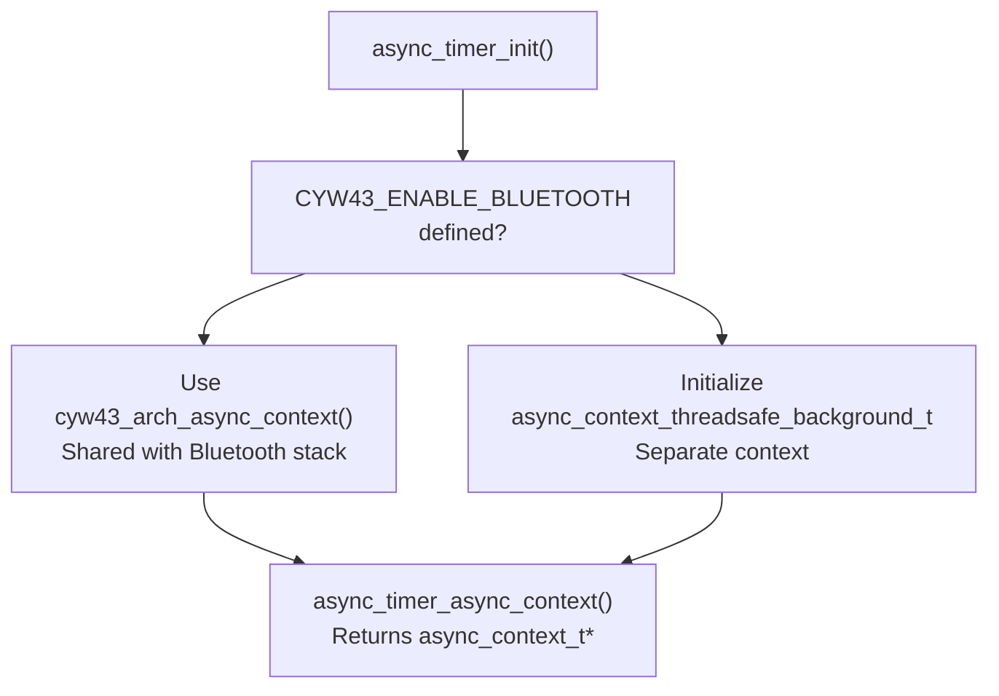
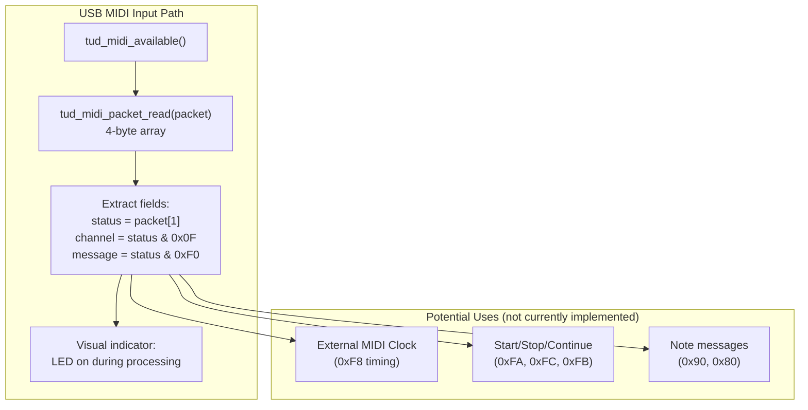
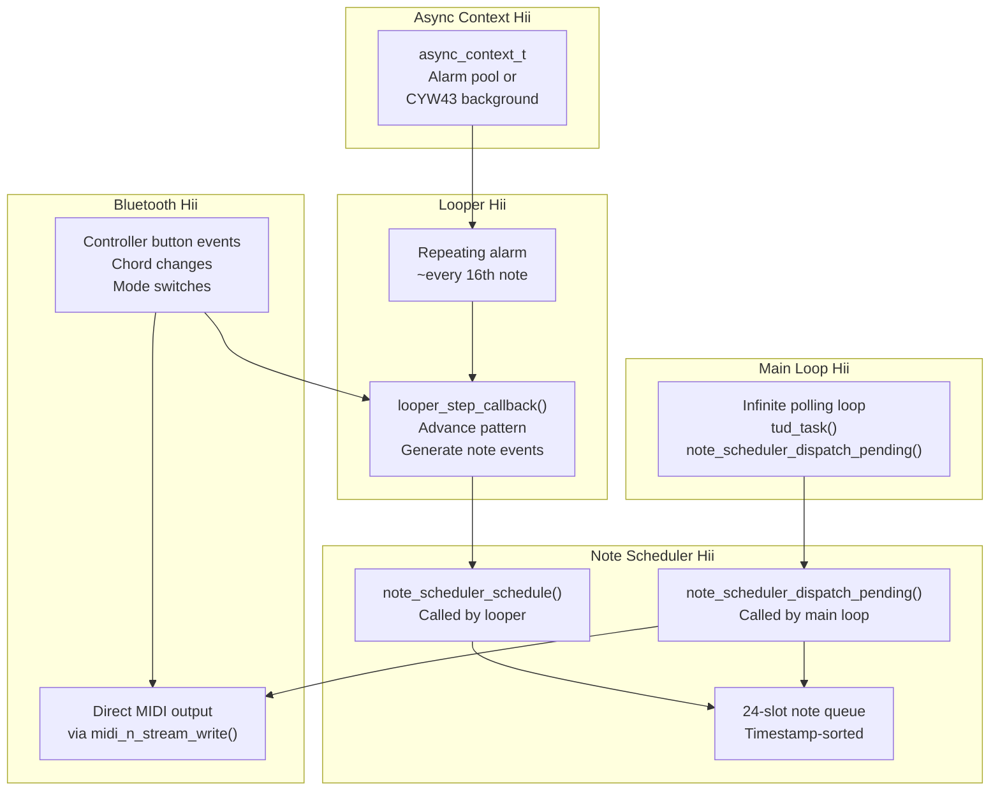

# Main Application Loop

> **Relevant source files**
> * [async_timer.c](https://github.com/Jus-Be/orinayo-pico/blob/122fa496/async_timer.c)
> * [async_timer.h](https://github.com/Jus-Be/orinayo-pico/blob/122fa496/async_timer.h)
> * [main.c](https://github.com/Jus-Be/orinayo-pico/blob/122fa496/main.c)

## Purpose and Scope

This page documents the main application entry point and event loop implemented in [main.c](https://github.com/Jus-Be/orinayo-pico/blob/122fa496/main.c)

 It covers the system initialization sequence, the main event processing loop, coordination of subsystems, and the critical dual-output MIDI transmission mechanism. For details on the musical processing components coordinated by this loop, see [Step Sequencer](./5.2-step-sequencer.md), [Note Scheduler](./5.5-note-scheduler.md), and [Ghost Note Generation](./5.4-ghost-note-generation.md). For Bluetooth initialization and device management, see [BLE Device Management](./4.1-ble-device-management.md).

## System Initialization

The `main()` function orchestrates a multi-stage initialization sequence that prepares hardware peripherals, USB stack, Bluetooth connectivity, and musical processing subsystems.

### Initialization Flow

```

```

**Sources:** [main.c L125-L151](https://github.com/Jus-Be/orinayo-pico/blob/122fa496/main.c#L125-L151)

### Initialization Stages

| Stage | Function | Purpose | Configuration |
| --- | --- | --- | --- |
| 1. Hardware | `pico_led_init()` | Initialize onboard LED (CYW43 GPIO) | Conditional on `CYW43_WL_GPIO_LED_PIN` |
| 2. USB | `board_init()`, `tusb_init()` | Initialize TinyUSB device stack | Uses `tusb_config.h` descriptors |
| 3. I/O | `stdio_init_all()` | Setup standard I/O for debugging | UART/USB CDC |
| 4. Stabilization | `sleep_ms(1000)` | Allow hardware to stabilize | 1 second delay |
| 5. Bluetooth | `bluetooth_init()` | Start BLE scanning and Bluepad32 | From `pico_bluetooth.c` |
| 6. USB Poll | `tud_task()` | First USB device poll | Ensures enumeration starts |
| 7. Storage | `storage_load_tracks()` | Restore looper patterns from flash | Persistent drum patterns |
| 8. Async Timer | `async_timer_init()` | Setup async context for timers | CYW43 or threadsafe background |
| 9. Looper | `looper_schedule_step_timer()` | Start step sequencer clock | Begin musical timing |
| 10. Note Queue | `note_scheduler_init()` | Clear scheduled note queue | Prepare for note dispatch |
| 11. UART | `uart_init()`, GPIO config | Configure UART at 31,250 baud | Standard MIDI serial rate |

**Sources:** [main.c L125-L151](https://github.com/Jus-Be/orinayo-pico/blob/122fa496/main.c#L125-L151)

### Async Context Initialization

The system uses conditional compilation to select the appropriate asynchronous timer context:



**Sources:** [async_timer.c L8-L33](https://github.com/Jus-Be/orinayo-pico/blob/122fa496/async_timer.c#L8-L33)

 [async_timer.h L1-L13](https://github.com/Jus-Be/orinayo-pico/blob/122fa496/async_timer.h#L1-L13)

On Pico W with Bluetooth enabled, the system reuses the CYW43 async context to avoid conflicts with the wireless chip's background operations. This ensures Bluetooth responsiveness is maintained while running periodic timers for the looper and note scheduler.

## Main Event Loop

The main event loop is a tight polling loop that coordinates USB processing, LED status updates, incoming MIDI handling, and note dispatch.

### Event Loop Structure

```

```

**Sources:** [main.c L152-L170](https://github.com/Jus-Be/orinayo-pico/blob/122fa496/main.c#L152-L170)

### Loop Components

| Component | Function | Frequency | Purpose |
| --- | --- | --- | --- |
| `tud_task()` | USB device task | Every iteration | Poll USB events, handle enumeration, process endpoints |
| LED control | `cyw43_arch_gpio_put()` | Conditional | Visual feedback when MIDI drums enabled |
| MIDI input | `tud_midi_available()`, `tud_midi_packet_read()` | When data present | Read incoming USB MIDI (external clock, etc.) |
| Note dispatch | `note_scheduler_dispatch_pending()` | Every iteration | Output scheduled notes with precise timing |

**Sources:** [main.c L152-L170](https://github.com/Jus-Be/orinayo-pico/blob/122fa496/main.c#L152-L170)

### Incoming MIDI Processing



**Sources:** [main.c L157-L167](https://github.com/Jus-Be/orinayo-pico/blob/122fa496/main.c#L157-L167)

The current implementation reads and parses incoming USB MIDI packets but does not process them further. This infrastructure supports future features like external MIDI clock synchronization (see [Clock Synchronization](./5.3-clock-synchronization.md)) or remote control commands.

## Dual MIDI Output Architecture

The system's most critical architectural feature is simultaneous transmission of all MIDI data to both USB and UART interfaces through a single bottleneck function.

### Output Flow Diagram

```

```

**Sources:** [main.c L690-L697](https://github.com/Jus-Be/orinayo-pico/blob/122fa496/main.c#L690-L697)

### midi_n_stream_write() Implementation

The function signature matches TinyUSB's `tud_midi_n_stream_write()` for drop-in replacement:

```javascript
uint32_t midi_n_stream_write(
    uint8_t itf,              // Interface number (always 0)
    uint8_t cable_num,        // Virtual cable (always 0)
    const uint8_t *buffer,    // MIDI data bytes
    uint32_t bufsize          // Number of bytes
)
```

**Implementation details:**

1. **USB transmission** [main.c L691](https://github.com/Jus-Be/orinayo-pico/blob/122fa496/main.c#L691-L691) : Calls `tud_midi_n_stream_write()` to queue data to USB endpoints
2. **UART transmission** [main.c L693-L696](https://github.com/Jus-Be/orinayo-pico/blob/122fa496/main.c#L693-L696) : Byte-by-byte loop with blocking wait on `uart_is_writable()` to prevent FIFO overflow

**Critical design choice:** The UART loop blocks until each byte is written, ensuring synchronization. This prevents USB data from getting ahead of UART data, maintaining timing coherence across both outputs.

**Sources:** [main.c L690-L697](https://github.com/Jus-Be/orinayo-pico/blob/122fa496/main.c#L690-L697)

 [main.c L58-L62](https://github.com/Jus-Be/orinayo-pico/blob/122fa496/main.c#L58-L62)

### UART Configuration

| Parameter | Value | Location |
| --- | --- | --- |
| UART peripheral | `uart0` | [main.c L58](https://github.com/Jus-Be/orinayo-pico/blob/122fa496/main.c#L58-L58) |
| Baud rate | 31,250 | [main.c L59](https://github.com/Jus-Be/orinayo-pico/blob/122fa496/main.c#L59-L59) <br>  (MIDI standard) |
| TX pin | GPIO 0 | [main.c L60](https://github.com/Jus-Be/orinayo-pico/blob/122fa496/main.c#L60-L60) |
| RX pin | GPIO 1 | [main.c L61](https://github.com/Jus-Be/orinayo-pico/blob/122fa496/main.c#L61-L61) <br>  (not used) |
| FIFO | Enabled | [main.c L149](https://github.com/Jus-Be/orinayo-pico/blob/122fa496/main.c#L149-L149) |
| CRLF translation | Disabled | [main.c L150](https://github.com/Jus-Be/orinayo-pico/blob/122fa496/main.c#L150-L150) |

**Sources:** [main.c L58-L62](https://github.com/Jus-Be/orinayo-pico/blob/122fa496/main.c#L58-L62)

 [main.c L146-L150](https://github.com/Jus-Be/orinayo-pico/blob/122fa496/main.c#L146-L150)

## USB Device Lifecycle Callbacks

TinyUSB invokes callback functions during USB device state transitions. These callbacks provide visual feedback via the onboard LED.

```css
#mermaid-1g6ic6akfo6i{font-family:ui-sans-serif,-apple-system,system-ui,Segoe UI,Helvetica;font-size:16px;fill:#333;}@keyframes edge-animation-frame{from{stroke-dashoffset:0;}}@keyframes dash{to{stroke-dashoffset:0;}}#mermaid-1g6ic6akfo6i .edge-animation-slow{stroke-dasharray:9,5!important;stroke-dashoffset:900;animation:dash 50s linear infinite;stroke-linecap:round;}#mermaid-1g6ic6akfo6i .edge-animation-fast{stroke-dasharray:9,5!important;stroke-dashoffset:900;animation:dash 20s linear infinite;stroke-linecap:round;}#mermaid-1g6ic6akfo6i .error-icon{fill:#dddddd;}#mermaid-1g6ic6akfo6i .error-text{fill:#222222;stroke:#222222;}#mermaid-1g6ic6akfo6i .edge-thickness-normal{stroke-width:1px;}#mermaid-1g6ic6akfo6i .edge-thickness-thick{stroke-width:3.5px;}#mermaid-1g6ic6akfo6i .edge-pattern-solid{stroke-dasharray:0;}#mermaid-1g6ic6akfo6i .edge-thickness-invisible{stroke-width:0;fill:none;}#mermaid-1g6ic6akfo6i .edge-pattern-dashed{stroke-dasharray:3;}#mermaid-1g6ic6akfo6i .edge-pattern-dotted{stroke-dasharray:2;}#mermaid-1g6ic6akfo6i .marker{fill:#999;stroke:#999;}#mermaid-1g6ic6akfo6i .marker.cross{stroke:#999;}#mermaid-1g6ic6akfo6i svg{font-family:ui-sans-serif,-apple-system,system-ui,Segoe UI,Helvetica;font-size:16px;}#mermaid-1g6ic6akfo6i p{margin:0;}#mermaid-1g6ic6akfo6i defs #statediagram-barbEnd{fill:#999;stroke:#999;}#mermaid-1g6ic6akfo6i g.stateGroup text{fill:#dddddd;stroke:none;font-size:10px;}#mermaid-1g6ic6akfo6i g.stateGroup text{fill:#333;stroke:none;font-size:10px;}#mermaid-1g6ic6akfo6i g.stateGroup .state-title{font-weight:bolder;fill:#333;}#mermaid-1g6ic6akfo6i g.stateGroup rect{fill:#ffffff;stroke:#dddddd;}#mermaid-1g6ic6akfo6i g.stateGroup line{stroke:#999;stroke-width:1;}#mermaid-1g6ic6akfo6i .transition{stroke:#999;stroke-width:1;fill:none;}#mermaid-1g6ic6akfo6i .stateGroup .composit{fill:#f4f4f4;border-bottom:1px;}#mermaid-1g6ic6akfo6i .stateGroup .alt-composit{fill:#e0e0e0;border-bottom:1px;}#mermaid-1g6ic6akfo6i .state-note{stroke:#e6d280;fill:#fff5ad;}#mermaid-1g6ic6akfo6i .state-note text{fill:#333;stroke:none;font-size:10px;}#mermaid-1g6ic6akfo6i .stateLabel .box{stroke:none;stroke-width:0;fill:#ffffff;opacity:0.5;}#mermaid-1g6ic6akfo6i .edgeLabel .label rect{fill:#ffffff;opacity:0.5;}#mermaid-1g6ic6akfo6i .edgeLabel{background-color:#ffffff;text-align:center;}#mermaid-1g6ic6akfo6i .edgeLabel p{background-color:#ffffff;}#mermaid-1g6ic6akfo6i .edgeLabel rect{opacity:0.5;background-color:#ffffff;fill:#ffffff;}#mermaid-1g6ic6akfo6i .edgeLabel .label text{fill:#333;}#mermaid-1g6ic6akfo6i .label div .edgeLabel{color:#333;}#mermaid-1g6ic6akfo6i .stateLabel text{fill:#333;font-size:10px;font-weight:bold;}#mermaid-1g6ic6akfo6i .node circle.state-start{fill:#999;stroke:#999;}#mermaid-1g6ic6akfo6i .node .fork-join{fill:#999;stroke:#999;}#mermaid-1g6ic6akfo6i .node circle.state-end{fill:#dddddd;stroke:#f4f4f4;stroke-width:1.5;}#mermaid-1g6ic6akfo6i .end-state-inner{fill:#f4f4f4;stroke-width:1.5;}#mermaid-1g6ic6akfo6i .node rect{fill:#ffffff;stroke:#dddddd;stroke-width:1px;}#mermaid-1g6ic6akfo6i .node polygon{fill:#ffffff;stroke:#dddddd;stroke-width:1px;}#mermaid-1g6ic6akfo6i #statediagram-barbEnd{fill:#999;}#mermaid-1g6ic6akfo6i .statediagram-cluster rect{fill:#ffffff;stroke:#dddddd;stroke-width:1px;}#mermaid-1g6ic6akfo6i .cluster-label,#mermaid-1g6ic6akfo6i .nodeLabel{color:#333;}#mermaid-1g6ic6akfo6i .statediagram-cluster rect.outer{rx:5px;ry:5px;}#mermaid-1g6ic6akfo6i .statediagram-state .divider{stroke:#dddddd;}#mermaid-1g6ic6akfo6i .statediagram-state .title-state{rx:5px;ry:5px;}#mermaid-1g6ic6akfo6i .statediagram-cluster.statediagram-cluster .inner{fill:#f4f4f4;}#mermaid-1g6ic6akfo6i .statediagram-cluster.statediagram-cluster-alt .inner{fill:#f8f8f8;}#mermaid-1g6ic6akfo6i .statediagram-cluster .inner{rx:0;ry:0;}#mermaid-1g6ic6akfo6i .statediagram-state rect.basic{rx:5px;ry:5px;}#mermaid-1g6ic6akfo6i .statediagram-state rect.divider{stroke-dasharray:10,10;fill:#f8f8f8;}#mermaid-1g6ic6akfo6i .note-edge{stroke-dasharray:5;}#mermaid-1g6ic6akfo6i .statediagram-note rect{fill:#fff5ad;stroke:#e6d280;stroke-width:1px;rx:0;ry:0;}#mermaid-1g6ic6akfo6i .statediagram-note rect{fill:#fff5ad;stroke:#e6d280;stroke-width:1px;rx:0;ry:0;}#mermaid-1g6ic6akfo6i .statediagram-note text{fill:#333;}#mermaid-1g6ic6akfo6i .statediagram-note .nodeLabel{color:#333;}#mermaid-1g6ic6akfo6i .statediagram .edgeLabel{color:red;}#mermaid-1g6ic6akfo6i #dependencyStart,#mermaid-1g6ic6akfo6i #dependencyEnd{fill:#999;stroke:#999;stroke-width:1;}#mermaid-1g6ic6akfo6i .statediagramTitleText{text-anchor:middle;font-size:18px;fill:#333;}#mermaid-1g6ic6akfo6i :root{--mermaid-font-family:"trebuchet ms",verdana,arial,sans-serif;}tud_mount_cb()tud_suspend_cb()tud_resume_cb()tud_umount_cb()UnmountedMountedSuspendedLED ONcyw43_arch_gpio_put(LED, true)LED OFFcyw43_arch_gpio_put(LED, false)LED OFF (low power)< 2.5mA draw required
```

### Callback Functions

| Callback | Trigger | Action | Location |
| --- | --- | --- | --- |
| `tud_mount_cb()` | USB enumeration complete | LED on | [main.c L180-L183](https://github.com/Jus-Be/orinayo-pico/blob/122fa496/main.c#L180-L183) |
| `tud_umount_cb()` | USB disconnected | LED off | [main.c L186-L189](https://github.com/Jus-Be/orinayo-pico/blob/122fa496/main.c#L186-L189) |
| `tud_suspend_cb()` | Bus suspended (low power) | LED off | [main.c L194-L198](https://github.com/Jus-Be/orinayo-pico/blob/122fa496/main.c#L194-L198) |
| `tud_resume_cb()` | Bus resumed from suspend | LED on | [main.c L201-L204](https://github.com/Jus-Be/orinayo-pico/blob/122fa496/main.c#L201-L204) |

**Sources:** [main.c L179-L204](https://github.com/Jus-Be/orinayo-pico/blob/122fa496/main.c#L179-L204)

The suspend callback includes a `remote_wakeup_en` parameter indicating if the device is permitted to wake the host, though this is not currently utilized. The USB specification requires devices to draw less than 2.5mA average current within 7ms of suspend.

## Subsystem Coordination

The main loop acts as a coordinator, relying on subsystems to manage their own state through callbacks and scheduled timers.

### Coordination Model



**Sources:** [main.c L142-L143](https://github.com/Jus-Be/orinayo-pico/blob/122fa496/main.c#L142-L143)

 [main.c L169](https://github.com/Jus-Be/orinayo-pico/blob/122fa496/main.c#L169-L169)

### Key Coordination Mechanisms

1. **Asynchronous note generation** [main.c L142](https://github.com/Jus-Be/orinayo-pico/blob/122fa496/main.c#L142-L142) : The looper runs on a periodic timer in the async context, generating note events independently of the main loop
2. **Main loop dispatch** [main.c L169](https://github.com/Jus-Be/orinayo-pico/blob/122fa496/main.c#L169-L169) : `note_scheduler_dispatch_pending()` is called every main loop iteration to check for notes ready to play based on microsecond timestamps
3. **USB mutex avoidance**: Notes are scheduled in async callbacks but transmitted in the main loop to avoid contention on TinyUSB mutexes (see [Note Scheduler](./5.5-note-scheduler.md) for details)
4. **Direct Bluetooth output**: Bluetooth input generates immediate MIDI output via `midi_n_stream_write()`, bypassing the note scheduler for real-time responsiveness

**Sources:** [main.c L125-L170](https://github.com/Jus-Be/orinayo-pico/blob/122fa496/main.c#L125-L170)

## External Variables and Global State

The main file declares several external variables that reflect the current operational state, modified by the Bluetooth input subsystem:

| Variable | Type | Purpose | Source Module |
| --- | --- | --- | --- |
| `style_section` | `int` | Current arranger section (A/B/C/D) | `pico_bluetooth.c` |
| `active_strum_pattern` | `int` | Strum pattern index (-1 to 4) | `pico_bluetooth.c` |
| `active_neck_pos` | `int` | Guitar neck position (0-2) | `pico_bluetooth.c` |
| `seqtrak_chord` | `int` | SeqTrak chord sampler number | `pico_bluetooth.c` |
| `style_started` | `bool` | Arranger/drums playing | `pico_bluetooth.c` |
| `enable_ample_guitar` | `bool` | Ample Guitar mode active | `pico_bluetooth.c` |
| `enable_midi_drums` | `bool` | MIDI drums/looper mode | `pico_bluetooth.c` |
| `enable_seqtrak` | `bool` | Yamaha SeqTrak mode | `pico_bluetooth.c` |
| `enable_chord_track` | `bool` | SeqTrak chord track enabled | `pico_bluetooth.c` |
| `enable_bass_track` | `bool` | SeqTrak bass track enabled | `pico_bluetooth.c` |
| `enable_modx` | `bool` | Yamaha MODX mode | `pico_bluetooth.c` |

**Sources:** [main.c L64-L75](https://github.com/Jus-Be/orinayo-pico/blob/122fa496/main.c#L64-L75)

These variables are read by various MIDI output functions to conditionally modify behavior based on the current operational mode (see [Operational Modes](./4.4-operational-modes.md)).

## Helper Functions for Synthesizer Control

The main file implements numerous helper functions for generating SysEx and control messages specific to different synthesizer models. These functions encapsulate device-specific MIDI protocols.

### Function Categories

| Category | Functions | Target Devices |
| --- | --- | --- |
| Yamaha MODX | `midi_modx_tempo()`, `midi_modx_key()`, `midi_modx_arp()`, etc. | Yamaha MODX synthesizers |
| Yamaha SeqTrak | `midi_seqtrak_pattern()`, `midi_seqtrak_mute()`, `midi_seqtrak_arp()`, etc. | Yamaha SeqTrak groovebox |
| Yamaha Arranger | `midi_yamaha_arr()`, `midi_yamaha_start_stop()` | Yamaha keyboard arrangers |
| Ketron | `midi_ketron_arr()`, `midi_ketron_footsw()` | Ketron arrangers |
| Generic | `midi_send_note()`, `midi_send_control_change()`, `midi_send_program_change()` | All MIDI devices |
| Chord | `midi_play_chord()`, `midi_play_slash_chord()` | Multi-note chord transmission |

**Sources:** [main.c L210-L688](https://github.com/Jus-Be/orinayo-pico/blob/122fa496/main.c#L210-L688)

All synthesizer control functions internally call `midi_n_stream_write()`, ensuring consistent dual-output behavior. For detailed SysEx message formats, see [Synthesizer Control](./6.3-synthesizer-control.md).