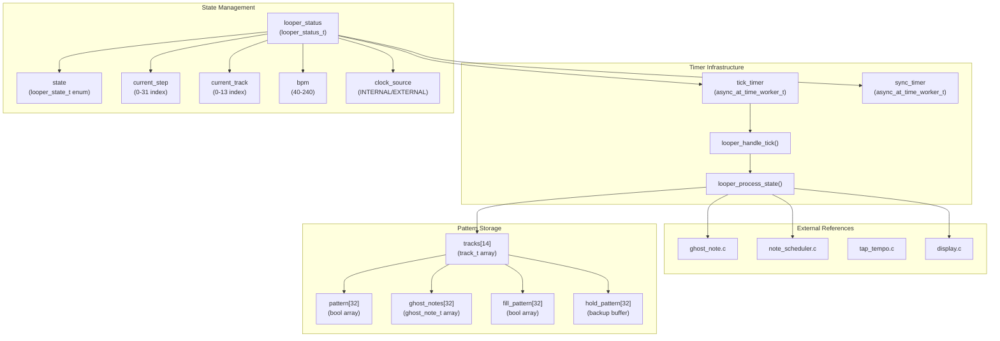
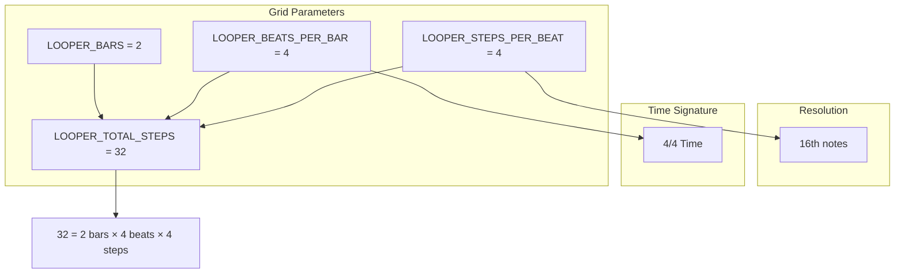
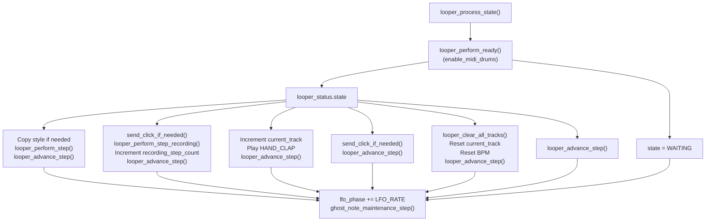
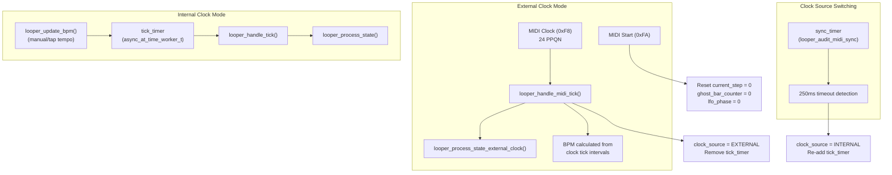

# Step Sequencer

> **Relevant source files**
> * [looper.c](https://github.com/Jus-Be/orinayo-pico/blob/122fa496/looper.c)
> * [looper.h](https://github.com/Jus-Be/orinayo-pico/blob/122fa496/looper.h)

The step sequencer is a 2-bar, 32-step drum pattern engine that manages recording, playback, and algorithmic enhancement of rhythmic patterns. It operates across 14 simultaneous drum tracks and supports both internal timing and external MIDI clock synchronization.

The implementation resides in [looper.c](https://github.com/Jus-Be/orinayo-pico/blob/122fa496/looper.c)

 and [looper.h](https://github.com/Jus-Be/orinayo-pico/blob/122fa496/looper.h)

 For algorithmic pattern generation applied to these sequences, see [Ghost Note Generation](./5.4-ghost-note-generation.md). For timing precision and note dispatch, see [Note Scheduler](./5.5-note-scheduler.md). For clock synchronization details, see [Clock Synchronization](./5.3-clock-synchronization.md).

## Sequencer Architecture

The step sequencer is structured around a global `looper_status` state machine and an array of `track_t` structures that hold pattern data.



**Sources:** [looper.h L23-L61](https://github.com/Jus-Be/orinayo-pico/blob/122fa496/looper.h#L23-L61)

 [looper.h L69-L77](https://github.com/Jus-Be/orinayo-pico/blob/122fa496/looper.h#L69-L77)

 [looper.c L49-L68](https://github.com/Jus-Be/orinayo-pico/blob/122fa496/looper.c#L49-L68)

## Data Structures

### Looper Status

The global `looper_status` variable [looper.c L49](https://github.com/Jus-Be/orinayo-pico/blob/122fa496/looper.c#L49-L49)

 maintains the sequencer's runtime state.

| Field | Type | Purpose |
| --- | --- | --- |
| `bpm` | `uint32_t` | Current tempo (40-240 BPM) |
| `step_period_ms` | `uint32_t` | Duration of each 16th note in milliseconds |
| `state` | `looper_state_t` | Current state machine mode |
| `current_track` | `uint8_t` | Active track index (0-13) for recording/preview |
| `current_step` | `uint8_t` | Current position in 32-step sequence |
| `recording_step_count` | `uint8_t` | Step counter for active recording session |
| `ghost_bar_counter` | `uint8_t` | Bar counter for ghost note regeneration |
| `lfo_phase` | `uint16_t` | Phase accumulator for velocity modulation |
| `clock_source` | `looper_clock_source_t` | `INTERNAL` or `EXTERNAL` (MIDI clock) |
| `tick_timer` | `async_at_time_worker_t` | Internal clock timer worker |
| `sync_timer` | `async_at_time_worker_t` | MIDI sync watchdog timer |

**Sources:** [looper.h L48-L61](https://github.com/Jus-Be/orinayo-pico/blob/122fa496/looper.h#L48-L61)

### Track Structure

Each of the 14 drum tracks is represented by a `track_t` structure [looper.c L51-L66](https://github.com/Jus-Be/orinayo-pico/blob/122fa496/looper.c#L51-L66)

| Field | Type | Purpose |
| --- | --- | --- |
| `name` | `const char*` | Human-readable track name (e.g., "Bass", "Snare") |
| `note` | `uint8_t` | MIDI note number (GM drum map) |
| `channel` | `uint8_t` | MIDI channel (always 9 for drums) |
| `pattern[32]` | `bool` | User-recorded note pattern |
| `hold_pattern[32]` | `bool` | Backup buffer saved on button press |
| `ghost_notes[32]` | `ghost_note_t` | Algorithmic ghost note data per step |
| `fill_pattern[32]` | `bool` | Fill-in pattern flags |

**Sources:** [looper.h L69-L77](https://github.com/Jus-Be/orinayo-pico/blob/122fa496/looper.h#L69-L77)

### Ghost Note Data

Each step can have an associated ghost note with probabilistic triggering.

| Field | Type | Purpose |
| --- | --- | --- |
| `probability` | `uint8_t` | 0-100 likelihood of triggering |
| `rand_sample` | `uint8_t` | Random value (0-100) for comparison |

**Sources:** [looper.h L63-L66](https://github.com/Jus-Be/orinayo-pico/blob/122fa496/looper.h#L63-L66)

## Sequencer Grid Configuration

The sequencer operates on a fixed 2-bar, 32-step grid with 16th-note resolution.



**Calculation:** `LOOPER_TOTAL_STEPS = LOOPER_BARS * LOOPER_BEATS_PER_BAR * LOOPER_STEPS_PER_BEAT = 2 * 4 * 4 = 32`

**Sources:** [looper.h L12-L18](https://github.com/Jus-Be/orinayo-pico/blob/122fa496/looper.h#L12-L18)

## Drum Track Mapping

The 14 drum tracks use General MIDI percussion note numbers on channel 10 (MIDI channel index 9).

| Track Index | Name | MIDI Note | Constant |
| --- | --- | --- | --- |
| 0 | Bass | 36 | `BASS_DRUM` |
| 1 | Snare | 38 | `SNARE_DRUM` |
| 2 | Closed Hi-hat | 42 | `CLOSED_HIHAT` |
| 3 | Low Floor Tom | 41 | `LOW_FLOOR_TOM` |
| 4 | Low Tom | 45 | `LOW_TOM` |
| 5 | Open Hi-hat | 46 | `OPEN_HIHAT` |
| 6 | Hi Mid Tom | 48 | `HI_MID_TOM` |
| 7 | Crash Cymbal | 49 | `CRASH_CYMBAL` |
| 8 | Ride Cymbal | 51 | `RIDE_CYMBAL` |
| 9 | Vibraslap | 58 | `VIBRASLAP` |
| 10 | Hi Bongo | 60 | `HI_BONGO` |
| 11 | Low Bongo | 61 | `LOW_BONGO` |
| 12 | Mute Conga | 62 | `MUTE_CONGA` |
| 13 | Low Conga | 64 | `LOW_CONGA` |

**Sources:** [looper.c L31-L46](https://github.com/Jus-Be/orinayo-pico/blob/122fa496/looper.c#L31-L46)

 [looper.c L51-L66](https://github.com/Jus-Be/orinayo-pico/blob/122fa496/looper.c#L51-L66)

## State Machine

The sequencer operates in one of eight states defined by `looper_state_t`.

```css
#mermaid-dkqfumlep7a{font-family:ui-sans-serif,-apple-system,system-ui,Segoe UI,Helvetica;font-size:16px;fill:#333;}@keyframes edge-animation-frame{from{stroke-dashoffset:0;}}@keyframes dash{to{stroke-dashoffset:0;}}#mermaid-dkqfumlep7a .edge-animation-slow{stroke-dasharray:9,5!important;stroke-dashoffset:900;animation:dash 50s linear infinite;stroke-linecap:round;}#mermaid-dkqfumlep7a .edge-animation-fast{stroke-dasharray:9,5!important;stroke-dashoffset:900;animation:dash 20s linear infinite;stroke-linecap:round;}#mermaid-dkqfumlep7a .error-icon{fill:#dddddd;}#mermaid-dkqfumlep7a .error-text{fill:#222222;stroke:#222222;}#mermaid-dkqfumlep7a .edge-thickness-normal{stroke-width:1px;}#mermaid-dkqfumlep7a .edge-thickness-thick{stroke-width:3.5px;}#mermaid-dkqfumlep7a .edge-pattern-solid{stroke-dasharray:0;}#mermaid-dkqfumlep7a .edge-thickness-invisible{stroke-width:0;fill:none;}#mermaid-dkqfumlep7a .edge-pattern-dashed{stroke-dasharray:3;}#mermaid-dkqfumlep7a .edge-pattern-dotted{stroke-dasharray:2;}#mermaid-dkqfumlep7a .marker{fill:#999;stroke:#999;}#mermaid-dkqfumlep7a .marker.cross{stroke:#999;}#mermaid-dkqfumlep7a svg{font-family:ui-sans-serif,-apple-system,system-ui,Segoe UI,Helvetica;font-size:16px;}#mermaid-dkqfumlep7a p{margin:0;}#mermaid-dkqfumlep7a defs #statediagram-barbEnd{fill:#999;stroke:#999;}#mermaid-dkqfumlep7a g.stateGroup text{fill:#dddddd;stroke:none;font-size:10px;}#mermaid-dkqfumlep7a g.stateGroup text{fill:#333;stroke:none;font-size:10px;}#mermaid-dkqfumlep7a g.stateGroup .state-title{font-weight:bolder;fill:#333;}#mermaid-dkqfumlep7a g.stateGroup rect{fill:#ffffff;stroke:#dddddd;}#mermaid-dkqfumlep7a g.stateGroup line{stroke:#999;stroke-width:1;}#mermaid-dkqfumlep7a .transition{stroke:#999;stroke-width:1;fill:none;}#mermaid-dkqfumlep7a .stateGroup .composit{fill:#f4f4f4;border-bottom:1px;}#mermaid-dkqfumlep7a .stateGroup .alt-composit{fill:#e0e0e0;border-bottom:1px;}#mermaid-dkqfumlep7a .state-note{stroke:#e6d280;fill:#fff5ad;}#mermaid-dkqfumlep7a .state-note text{fill:#333;stroke:none;font-size:10px;}#mermaid-dkqfumlep7a .stateLabel .box{stroke:none;stroke-width:0;fill:#ffffff;opacity:0.5;}#mermaid-dkqfumlep7a .edgeLabel .label rect{fill:#ffffff;opacity:0.5;}#mermaid-dkqfumlep7a .edgeLabel{background-color:#ffffff;text-align:center;}#mermaid-dkqfumlep7a .edgeLabel p{background-color:#ffffff;}#mermaid-dkqfumlep7a .edgeLabel rect{opacity:0.5;background-color:#ffffff;fill:#ffffff;}#mermaid-dkqfumlep7a .edgeLabel .label text{fill:#333;}#mermaid-dkqfumlep7a .label div .edgeLabel{color:#333;}#mermaid-dkqfumlep7a .stateLabel text{fill:#333;font-size:10px;font-weight:bold;}#mermaid-dkqfumlep7a .node circle.state-start{fill:#999;stroke:#999;}#mermaid-dkqfumlep7a .node .fork-join{fill:#999;stroke:#999;}#mermaid-dkqfumlep7a .node circle.state-end{fill:#dddddd;stroke:#f4f4f4;stroke-width:1.5;}#mermaid-dkqfumlep7a .end-state-inner{fill:#f4f4f4;stroke-width:1.5;}#mermaid-dkqfumlep7a .node rect{fill:#ffffff;stroke:#dddddd;stroke-width:1px;}#mermaid-dkqfumlep7a .node polygon{fill:#ffffff;stroke:#dddddd;stroke-width:1px;}#mermaid-dkqfumlep7a #statediagram-barbEnd{fill:#999;}#mermaid-dkqfumlep7a .statediagram-cluster rect{fill:#ffffff;stroke:#dddddd;stroke-width:1px;}#mermaid-dkqfumlep7a .cluster-label,#mermaid-dkqfumlep7a .nodeLabel{color:#333;}#mermaid-dkqfumlep7a .statediagram-cluster rect.outer{rx:5px;ry:5px;}#mermaid-dkqfumlep7a .statediagram-state .divider{stroke:#dddddd;}#mermaid-dkqfumlep7a .statediagram-state .title-state{rx:5px;ry:5px;}#mermaid-dkqfumlep7a .statediagram-cluster.statediagram-cluster .inner{fill:#f4f4f4;}#mermaid-dkqfumlep7a .statediagram-cluster.statediagram-cluster-alt .inner{fill:#f8f8f8;}#mermaid-dkqfumlep7a .statediagram-cluster .inner{rx:0;ry:0;}#mermaid-dkqfumlep7a .statediagram-state rect.basic{rx:5px;ry:5px;}#mermaid-dkqfumlep7a .statediagram-state rect.divider{stroke-dasharray:10,10;fill:#f8f8f8;}#mermaid-dkqfumlep7a .note-edge{stroke-dasharray:5;}#mermaid-dkqfumlep7a .statediagram-note rect{fill:#fff5ad;stroke:#e6d280;stroke-width:1px;rx:0;ry:0;}#mermaid-dkqfumlep7a .statediagram-note rect{fill:#fff5ad;stroke:#e6d280;stroke-width:1px;rx:0;ry:0;}#mermaid-dkqfumlep7a .statediagram-note text{fill:#333;}#mermaid-dkqfumlep7a .statediagram-note .nodeLabel{color:#333;}#mermaid-dkqfumlep7a .statediagram .edgeLabel{color:red;}#mermaid-dkqfumlep7a #dependencyStart,#mermaid-dkqfumlep7a #dependencyEnd{fill:#999;stroke:#999;stroke-width:1;}#mermaid-dkqfumlep7a .statediagramTitleText{text-anchor:middle;font-size:18px;fill:#333;}#mermaid-dkqfumlep7a :root{--mermaid-font-family:"trebuchet ms",verdana,arial,sans-serif;}enable_midi_drums = trueenable_midi_drums = falseBUTTON_EVENT_CLICK_RELEASEBUTTON_EVENT_HOLD_RELEASEBUTTON_EVENT_LONG_HOLD_RELEASEBUTTON_EVENT_VERY_LONG_HOLD_RELEASEMIDI Clock detectedBUTTON_EVENT_CLICK_RELEASE(add step)BUTTON_EVENT_HOLD_RELEASEBUTTON_EVENT_LONG_HOLD_RELEASE32 steps recordedNext stepTAP_EXIT eventMIDI Clock detectedNext stepButton hold/releaseButton hold/releaseMIDI Clock timeoutMIDI Clock timeoutWAITINGPLAYINGRECORDINGTRACK_SWITCHTAP_TEMPOCLEAR_TRACKSSYNC_PLAYINGSYNC_MUTE
```

**State Descriptions:**

| State | Constant | Behavior |
| --- | --- | --- |
| Waiting | `LOOPER_STATE_WAITING` | Awaiting `enable_midi_drums` flag; no playback |
| Playing | `LOOPER_STATE_PLAYING` | Normal playback with ghost notes and fills |
| Recording | `LOOPER_STATE_RECORDING` | User is entering pattern; metronome click enabled |
| Track Switch | `LOOPER_STATE_TRACK_SWITCH` | Increments `current_track` and plays confirmation sound |
| Tap Tempo | `LOOPER_STATE_TAP_TEMPO` | Tempo detection mode via button taps |
| Clear Tracks | `LOOPER_STATE_CLEAR_TRACKS` | Erases all pattern data |
| Sync Mute | `LOOPER_STATE_SYNC_MUTE` | External MIDI clock active, output muted |
| Sync Playing | `LOOPER_STATE_SYNC_PLAYING` | External MIDI clock active, playing patterns |

**Sources:** [looper.h L23-L32](https://github.com/Jus-Be/orinayo-pico/blob/122fa496/looper.h#L23-L32)

 [looper.c L288-L344](https://github.com/Jus-Be/orinayo-pico/blob/122fa496/looper.c#L288-L344)

 [looper.c L346-L374](https://github.com/Jus-Be/orinayo-pico/blob/122fa496/looper.c#L346-L374)

## Pattern Recording

Pattern recording is initiated when the user releases a short button press in any non-recording state [looper.c L388-L401](https://github.com/Jus-Be/orinayo-pico/blob/122fa496/looper.c#L388-L401)

 The process involves:

1. **State Transition:** Set `state = LOOPER_STATE_RECORDING` and reset `recording_step_count = 0`
2. **Pattern Clear:** Erase current track's `pattern[]`, `ghost_notes[]`, and `fill_pattern[]`
3. **Step Quantization:** Calculate nearest step index using `looper_quantize_step()` [looper.c L231-L243](https://github.com/Jus-Be/orinayo-pico/blob/122fa496/looper.c#L231-L243)
4. **Step Recording:** Set `pattern[quantized_step] = true`

### Quantization Algorithm

The quantization function [looper.c L231-L243](https://github.com/Jus-Be/orinayo-pico/blob/122fa496/looper.c#L231-L243)

 calculates the step index closest to the button press timestamp.

```
delta_us = button_press_start_us - last_step_time_us
relative_steps = round(delta_us / 1000.0 / step_period_ms)
quantized_step = (previous_step + relative_steps) % 32
```

This ensures that user input is snapped to the nearest 16th note boundary, accounting for human timing imprecision.

**Sources:** [looper.c L231-L243](https://github.com/Jus-Be/orinayo-pico/blob/122fa496/looper.c#L231-L243)

 [looper.c L377-L420](https://github.com/Jus-Be/orinayo-pico/blob/122fa496/looper.c#L377-L420)

## Pattern Playback

The playback logic differs based on state and clock source.



**Sources:** [looper.c L288-L344](https://github.com/Jus-Be/orinayo-pico/blob/122fa496/looper.c#L288-L344)

### Step Performance

The `looper_perform_step()` function [looper.c L162-L194](https://github.com/Jus-Be/orinayo-pico/blob/122fa496/looper.c#L162-L194)

 executes the following for each track at the current step:

1. **User Pattern:** If `pattern[current_step] == true`, schedule note with modulated velocity
2. **Ghost Notes:** If ghost probability check passes and no fill pattern, schedule ghost note
3. **Fill Pattern:** If `fill_pattern[current_step] == true` and no user note, schedule fill note

All notes are scheduled with swing offset calculated by `looper_get_swing_offset_us()` [looper.c L148-L158](https://github.com/Jus-Be/orinayo-pico/blob/122fa496/looper.c#L148-L158)

**Sources:** [looper.c L162-L194](https://github.com/Jus-Be/orinayo-pico/blob/122fa496/looper.c#L162-L194)

 [looper.c L148-L158](https://github.com/Jus-Be/orinayo-pico/blob/122fa496/looper.c#L148-L158)

### Swing Timing

Odd-numbered steps (1, 3, 5, etc.) are delayed based on `swing_ratio` parameter:

```
if (step_index % 2 == 1):
    offset_ms = (step_period_ms * 2) * (swing_ratio - 0.5)
    return offset_ms * 1000  // Convert to microseconds
```

A `swing_ratio` of 0.5 produces straight timing, while higher values (e.g., 0.65) create a shuffled feel.

**Sources:** [looper.c L148-L158](https://github.com/Jus-Be/orinayo-pico/blob/122fa496/looper.c#L148-L158)

## Preset Drum Styles

The system includes 25 preset drum patterns stored in `drum_styles[5][5][32]` [looper.c L69-L101](https://github.com/Jus-Be/orinayo-pico/blob/122fa496/looper.c#L69-L101)

 The array is indexed as `[group][style][step]`.

* **5 style groups** (e.g., different musical genres)
* **5 variations per group**
* **32 steps per variation**

Each value is a bitmask where bit position indicates which drum track(s) are active:

```
bit 0 = track 0 (Bass Drum)
bit 1 = track 1 (Snare)
bit 2 = track 2 (Closed Hi-hat)
...
bit 13 = track 13 (Low Conga)
```

### Style Copy Function

The `looper_copy_style()` function [looper.c L210-L219](https://github.com/Jus-Be/orinayo-pico/blob/122fa496/looper.c#L210-L219)

 decodes a preset into the active pattern buffers:

```
for (each step s in 0-31):
    for (each track i in 0-13):
        drum_bit = 2^i
        tracks[i].pattern[s] = (drum_styles[group][style][s] & drum_bit) != 0
```

Styles are automatically copied every 4 bars during playback when `style_group > -1` [looper.c L302-L304](https://github.com/Jus-Be/orinayo-pico/blob/122fa496/looper.c#L302-L304)

**Sources:** [looper.c L69-L101](https://github.com/Jus-Be/orinayo-pico/blob/122fa496/looper.c#L69-L101)

 [looper.c L210-L219](https://github.com/Jus-Be/orinayo-pico/blob/122fa496/looper.c#L210-L219)

 [looper.c L302-L304](https://github.com/Jus-Be/orinayo-pico/blob/122fa496/looper.c#L302-L304)

## Clock Source Management

The sequencer supports two timing modes controlled by `looper_status.clock_source`.



**Sources:** [looper.h L39-L42](https://github.com/Jus-Be/orinayo-pico/blob/122fa496/looper.h#L39-L42)

 [looper.c L457-L486](https://github.com/Jus-Be/orinayo-pico/blob/122fa496/looper.c#L457-L486)

 [looper.c L488-L493](https://github.com/Jus-Be/orinayo-pico/blob/122fa496/looper.c#L488-L493)

 [looper.c L437-L454](https://github.com/Jus-Be/orinayo-pico/blob/122fa496/looper.c#L437-L454)

### External Clock Synchronization

MIDI clock messages are received at 24 pulses per quarter note (PPQN). The sequencer processes every 6th tick, advancing one 16th note step [looper.c L477-L483](https://github.com/Jus-Be/orinayo-pico/blob/122fa496/looper.c#L477-L483)

**BPM Calculation:**

```
tick_interval_us = average of last 6 ticks
bpm = 60,000,000 / (tick_interval_us * 24)
```

**Clock Timeout:** If no MIDI clock tick is received for 250ms, the system reverts to `LOOPER_CLOCK_INTERNAL` [looper.c L440-L451](https://github.com/Jus-Be/orinayo-pico/blob/122fa496/looper.c#L440-L451)

**Sources:** [looper.c L457-L486](https://github.com/Jus-Be/orinayo-pico/blob/122fa496/looper.c#L457-L486)

 [looper.c L437-L454](https://github.com/Jus-Be/orinayo-pico/blob/122fa496/looper.c#L437-L454)

## Timing System Integration

The sequencer is driven by the asynchronous timer infrastructure. In internal clock mode, `looper_handle_tick()` [looper.c L423-L435](https://github.com/Jus-Be/orinayo-pico/blob/122fa496/looper.c#L423-L435)

 is called periodically:

```mermaid
sequenceDiagram
  participant async_context
  participant tick_timer
  participant looper_handle_tick()
  participant looper_process_state()
  participant note_scheduler
  participant midi_n_stream_write()

  async_context->>tick_timer: Timer fires
  tick_timer->>looper_handle_tick(): do_work callback
  looper_handle_tick()->>looper_process_state(): Process state machine
  looper_process_state()->>note_scheduler: Schedule notes with swing
  looper_handle_tick()->>async_context: Reschedule in step_period_ms
  note over async_context,midi_n_stream_write(): Main loop (separate thread)
  async_context->>note_scheduler: Check for due notes
  note_scheduler->>midi_n_stream_write(): Dispatch MIDI messages
```

**Timing Precision:** Notes are scheduled with microsecond timestamps but dispatched in the main loop to avoid USB mutex contention. See [Note Scheduler](./5.5-note-scheduler.md) for details.

**Sources:** [looper.c L423-L435](https://github.com/Jus-Be/orinayo-pico/blob/122fa496/looper.c#L423-L435)

 [looper.c L288-L344](https://github.com/Jus-Be/orinayo-pico/blob/122fa496/looper.c#L288-L344)

## Button Event Handling

Button events control recording, track switching, and tempo functions based on press duration.

| Event | Duration | Action |
| --- | --- | --- |
| `BUTTON_EVENT_CLICK_BEGIN` | Press down | Preview current track note, save `hold_pattern` |
| `BUTTON_EVENT_CLICK_RELEASE` | < 1 second | Record quantized step or trigger fill |
| `BUTTON_EVENT_HOLD_RELEASE` | 1-2 seconds | Revert pattern, switch to next track |
| `BUTTON_EVENT_LONG_HOLD_RELEASE` | 2-5 seconds | Enter tap tempo mode |
| `BUTTON_EVENT_VERY_LONG_HOLD_RELEASE` | > 5 seconds | Clear all tracks |

**Implementation:** [looper.c L377-L420](https://github.com/Jus-Be/orinayo-pico/blob/122fa496/looper.c#L377-L420)

### Internal vs External Clock Input Handling

The button handler differs based on clock source:

* **Internal Clock:** `looper_handle_input_internal_clock()` [looper.c L495-L502](https://github.com/Jus-Be/orinayo-pico/blob/122fa496/looper.c#L495-L502) * All button events processed normally * Tap tempo mode transitions handled
* **External Clock:** `looper_handle_input_external_clock()` [looper.c L504-L514](https://github.com/Jus-Be/orinayo-pico/blob/122fa496/looper.c#L504-L514) * Hold releases toggle `SYNC_PLAYING` ↔ `SYNC_MUTE` * Short press triggers fill pattern request

**Sources:** [looper.c L495-L502](https://github.com/Jus-Be/orinayo-pico/blob/122fa496/looper.c#L495-L502)

 [looper.c L504-L514](https://github.com/Jus-Be/orinayo-pico/blob/122fa496/looper.c#L504-L514)

## Metronome Click

During `LOOPER_STATE_RECORDING` and `LOOPER_STATE_TAP_TEMPO`, a metronome click is generated using cowbell (MIDI note 56) [looper.c L137-L146](https://github.com/Jus-Be/orinayo-pico/blob/122fa496/looper.c#L137-L146)

```
if (current_step % LOOPER_CLICK_DIV == 0 && current_step == 0):
    velocity = 0x2F  // Accented (first beat of bar)
else if (current_step % LOOPER_CLICK_DIV == 0):
    velocity = 0x0F  // Unaccented
```

`LOOPER_CLICK_DIV = 4`, so clicks occur on beats (every 4 steps).

**Sources:** [looper.c L137-L146](https://github.com/Jus-Be/orinayo-pico/blob/122fa496/looper.c#L137-L146)

 [looper.h L18](https://github.com/Jus-Be/orinayo-pico/blob/122fa496/looper.h#L18-L18)

## LFO Velocity Modulation

The `lfo_phase` variable [looper.h L57](https://github.com/Jus-Be/orinayo-pico/blob/122fa496/looper.h#L57-L57)

 accumulates each step by `LFO_RATE = 65536 / 32 = 2048` [looper.h L20](https://github.com/Jus-Be/orinayo-pico/blob/122fa496/looper.h#L20-L20)

 This creates a sawtooth wave with period equal to one full loop (32 steps).

The phase is passed to `ghost_note_modulate_base_velocity()` in the ghost note system to create subtle velocity variations.

**Sources:** [looper.h L20](https://github.com/Jus-Be/orinayo-pico/blob/122fa496/looper.h#L20-L20)

 [looper.c L342](https://github.com/Jus-Be/orinayo-pico/blob/122fa496/looper.c#L342-L342)

 [looper.c L372](https://github.com/Jus-Be/orinayo-pico/blob/122fa496/looper.c#L372-L372)

 [looper.c L171](https://github.com/Jus-Be/orinayo-pico/blob/122fa496/looper.c#L171-L171)

## API Reference

### Initialization

```
void looper_schedule_step_timer(void)
```

Initializes BPM to default (96), sets up `tick_timer` and `sync_timer` workers, and schedules first tick.

**Sources:** [looper.c L516-L526](https://github.com/Jus-Be/orinayo-pico/blob/122fa496/looper.c#L516-L526)

### Status Access

```
looper_status_t *looper_status_get(void)
track_t *looper_tracks_get(size_t *num_tracks)
```

Return pointers to global state for display and persistence systems.

**Sources:** [looper.c L273](https://github.com/Jus-Be/orinayo-pico/blob/122fa496/looper.c#L273-L273)

 [looper.c L275-L278](https://github.com/Jus-Be/orinayo-pico/blob/122fa496/looper.c#L275-L278)

### BPM Control

```
void looper_update_bpm(uint32_t bpm)
```

Updates tempo and recalculates `step_period_ms = 60000 / (bpm * 4)`. Also sends tempo to SeqTrak via `midi_seqtrak_tempo()`.

**Sources:** [looper.c L281-L285](https://github.com/Jus-Be/orinayo-pico/blob/122fa496/looper.c#L281-L285)

### MIDI Clock Handlers

```
void looper_handle_midi_tick(void)
void looper_handle_midi_start(void)
```

Process MIDI clock messages (0xF8) and start messages (0xFA). Automatically switch to external clock mode and synchronize step position.

**Sources:** [looper.c L457-L486](https://github.com/Jus-Be/orinayo-pico/blob/122fa496/looper.c#L457-L486)

 [looper.c L488-L493](https://github.com/Jus-Be/orinayo-pico/blob/122fa496/looper.c#L488-L493)

### Pattern Management

```
void looper_copy_style(uint8_t group, uint8_t style)
void looper_clear_all_tracks(void)
```

Load preset patterns from `drum_styles[][]` or erase all pattern data.

**Sources:** [looper.c L210-L219](https://github.com/Jus-Be/orinayo-pico/blob/122fa496/looper.c#L210-L219)

 [looper.c L246-L254](https://github.com/Jus-Be/orinayo-pico/blob/122fa496/looper.c#L246-L254)

### Note Output

```
void looper_perform_note(uint8_t channel, uint8_t note, uint8_t velocity)
```

Immediately send MIDI Note On and Note Off messages. Used for preview sounds and metronome clicks. Velocity is scaled to 75% of input value.

**Sources:** [looper.c L120-L129](https://github.com/Jus-Be/orinayo-pico/blob/122fa496/looper.c#L120-L129)