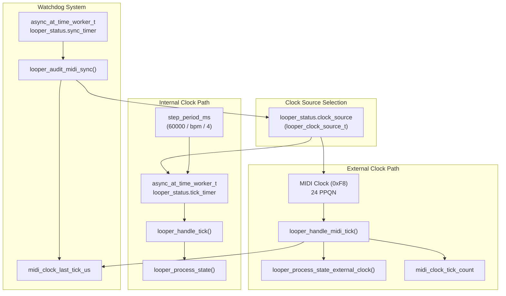
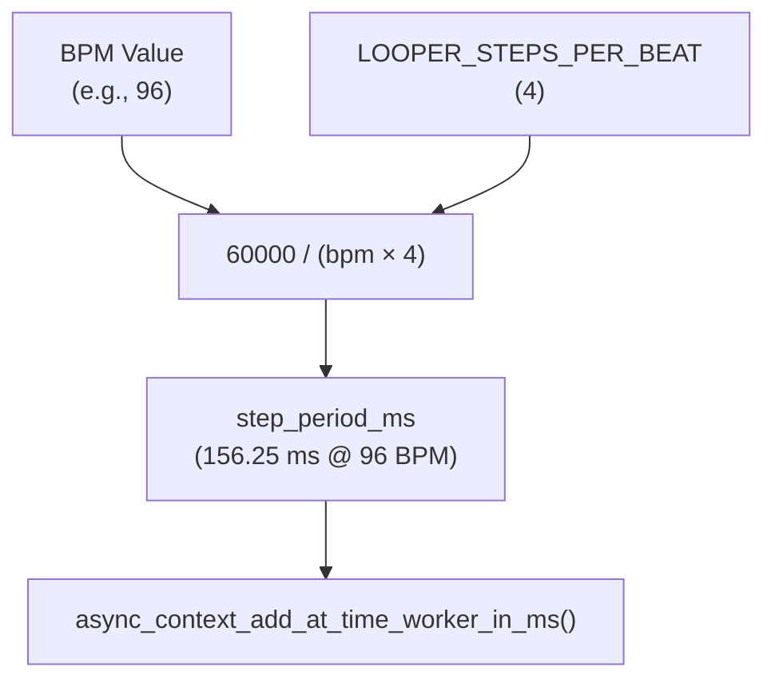
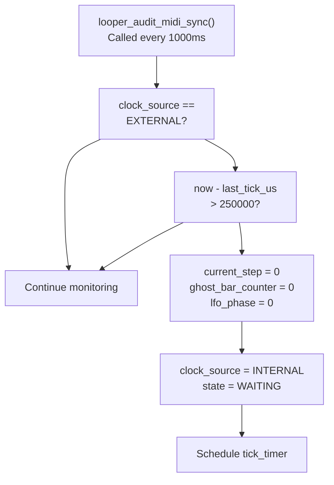
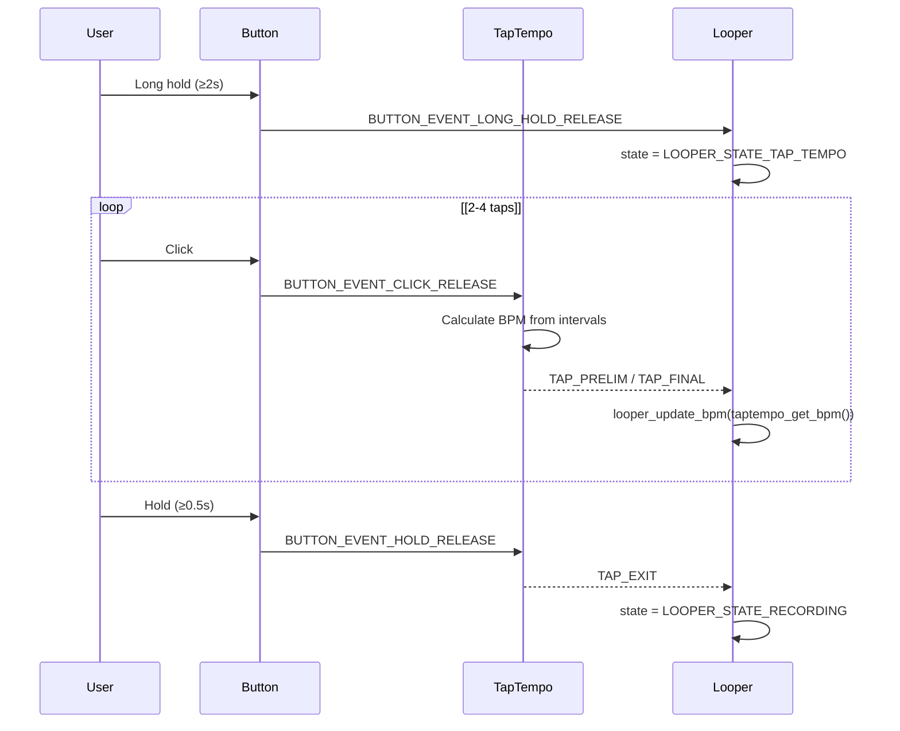

# Clock Synchronization

> **Relevant source files**
> * [looper.c](https://github.com/Jus-Be/orinayo-pico/blob/122fa496/looper.c)
> * [looper.h](https://github.com/Jus-Be/orinayo-pico/blob/122fa496/looper.h)
> * [tap_tempo.c](https://github.com/Jus-Be/orinayo-pico/blob/122fa496/tap_tempo.c)
> * [tap_tempo.h](https://github.com/Jus-Be/orinayo-pico/blob/122fa496/tap_tempo.h)

## Purpose and Scope

This document explains the clock synchronization system in the Orinayo looper, which manages timing for the 2-bar step sequencer. The system supports two clock sources: an internal timer-based clock and an external MIDI clock synchronization mode. The looper automatically detects and switches between these modes, maintaining precise timing for musical playback.

For information about the step sequencer itself, see [Step Sequencer](./5.2-step-sequencer.md). For the note scheduling mechanism that uses these timing signals, see [Note Scheduler](./5.5-note-scheduler.md). For tap tempo BPM detection, see [Tap Tempo](./5.6-tap-tempo.md).

---

## Clock Sources

The looper supports two mutually exclusive clock sources, defined by the `looper_clock_source_t` enumeration:

| Clock Source | Value | Description |
| --- | --- | --- |
| `LOOPER_CLOCK_INTERNAL` | 0 | Local async timer, self-clocking |
| `LOOPER_CLOCK_EXTERNAL` | 1 | MIDI Clock (0xF8) at 24 PPQN |

The active clock source is stored in `looper_status.clock_source` and determines which timing mechanism drives the sequencer's step advancement.

Sources: [looper.h L39-L42](https://github.com/Jus-Be/orinayo-pico/blob/122fa496/looper.h#L39-L42)

 [looper.h L58](https://github.com/Jus-Be/orinayo-pico/blob/122fa496/looper.h#L58-L58)

---

## Clock Source Architecture



Sources: [looper.c L103-L104](https://github.com/Jus-Be/orinayo-pico/blob/122fa496/looper.c#L103-L104)

 [looper.c L288-L344](https://github.com/Jus-Be/orinayo-pico/blob/122fa496/looper.c#L288-L344)

 [looper.c L346-L374](https://github.com/Jus-Be/orinayo-pico/blob/122fa496/looper.c#L346-L374)

 [looper.c L423-L435](https://github.com/Jus-Be/orinayo-pico/blob/122fa496/looper.c#L423-L435)

 [looper.c L437-L454](https://github.com/Jus-Be/orinayo-pico/blob/122fa496/looper.c#L437-L454)

 [looper.c L457-L486](https://github.com/Jus-Be/orinayo-pico/blob/122fa496/looper.c#L457-L486)

 [looper.h L39-L42](https://github.com/Jus-Be/orinayo-pico/blob/122fa496/looper.h#L39-L42)

 [looper.h L58-L60](https://github.com/Jus-Be/orinayo-pico/blob/122fa496/looper.h#L58-L60)

---

## Internal Clock Mode

### Timer-Based Step Advancement

In internal clock mode, the looper uses the Pico SDK's async timer system to schedule periodic callbacks at the step rate. The timer worker `looper_status.tick_timer` is configured during initialization.

**Initialization:**

```python
looper_schedule_step_timer()
  ├─ Sets tick_timer.do_work = looper_handle_tick
  ├─ Calculates initial step_period_ms from default BPM (96)
  └─ Schedules first timer callback
```

The `looper_handle_tick()` function [looper.c L423-L435](https://github.com/Jus-Be/orinayo-pico/blob/122fa496/looper.c#L423-L435)

 executes on each timer expiration and performs three operations:

1. Calls `looper_process_state()` to advance the sequencer
2. Measures handler execution time
3. Reschedules the timer, compensating for processing delay

| Parameter | Formula | Default Value |
| --- | --- | --- |
| BPM | Configurable | 96 |
| Steps per beat | `LOOPER_STEPS_PER_BEAT` | 4 (16th notes) |
| Step period (ms) | `60000 / (bpm * steps_per_beat)` | 156.25 ms |

Sources: [looper.c L423-L435](https://github.com/Jus-Be/orinayo-pico/blob/122fa496/looper.c#L423-L435)

 [looper.c L516-L526](https://github.com/Jus-Be/orinayo-pico/blob/122fa496/looper.c#L516-L526)

 [looper.h L12](https://github.com/Jus-Be/orinayo-pico/blob/122fa496/looper.h#L12-L12)

 [looper.h L15](https://github.com/Jus-Be/orinayo-pico/blob/122fa496/looper.h#L15-L15)

### Step Period Calculation



The step period is recalculated whenever the BPM changes via `looper_update_bpm()` [looper.c L281-L285](https://github.com/Jus-Be/orinayo-pico/blob/122fa496/looper.c#L281-L285)

Sources: [looper.c L281-L285](https://github.com/Jus-Be/orinayo-pico/blob/122fa496/looper.c#L281-L285)

 [looper.h L12-L18](https://github.com/Jus-Be/orinayo-pico/blob/122fa496/looper.h#L12-L18)

---

## External MIDI Clock Mode

### MIDI Clock Protocol

External clock mode synchronizes to incoming MIDI Clock messages (status byte 0xF8), transmitted at 24 pulses per quarter note (PPQN). The looper counts every 6 clock pulses to advance one 16th note step.

**Clock Message Mapping:**

```
24 PPQN ÷ 4 (16th notes per quarter) = 6 clock pulses per step
```

### Automatic Clock Detection

When the first MIDI Clock message arrives, `looper_handle_midi_tick()` [looper.c L462-L472](https://github.com/Jus-Be/orinayo-pico/blob/122fa496/looper.c#L462-L472)

 performs automatic mode switching:

```css
#mermaid-ko683tlk6k{font-family:ui-sans-serif,-apple-system,system-ui,Segoe UI,Helvetica;font-size:16px;fill:#333;}@keyframes edge-animation-frame{from{stroke-dashoffset:0;}}@keyframes dash{to{stroke-dashoffset:0;}}#mermaid-ko683tlk6k .edge-animation-slow{stroke-dasharray:9,5!important;stroke-dashoffset:900;animation:dash 50s linear infinite;stroke-linecap:round;}#mermaid-ko683tlk6k .edge-animation-fast{stroke-dasharray:9,5!important;stroke-dashoffset:900;animation:dash 20s linear infinite;stroke-linecap:round;}#mermaid-ko683tlk6k .error-icon{fill:#dddddd;}#mermaid-ko683tlk6k .error-text{fill:#222222;stroke:#222222;}#mermaid-ko683tlk6k .edge-thickness-normal{stroke-width:1px;}#mermaid-ko683tlk6k .edge-thickness-thick{stroke-width:3.5px;}#mermaid-ko683tlk6k .edge-pattern-solid{stroke-dasharray:0;}#mermaid-ko683tlk6k .edge-thickness-invisible{stroke-width:0;fill:none;}#mermaid-ko683tlk6k .edge-pattern-dashed{stroke-dasharray:3;}#mermaid-ko683tlk6k .edge-pattern-dotted{stroke-dasharray:2;}#mermaid-ko683tlk6k .marker{fill:#999;stroke:#999;}#mermaid-ko683tlk6k .marker.cross{stroke:#999;}#mermaid-ko683tlk6k svg{font-family:ui-sans-serif,-apple-system,system-ui,Segoe UI,Helvetica;font-size:16px;}#mermaid-ko683tlk6k p{margin:0;}#mermaid-ko683tlk6k defs #statediagram-barbEnd{fill:#999;stroke:#999;}#mermaid-ko683tlk6k g.stateGroup text{fill:#dddddd;stroke:none;font-size:10px;}#mermaid-ko683tlk6k g.stateGroup text{fill:#333;stroke:none;font-size:10px;}#mermaid-ko683tlk6k g.stateGroup .state-title{font-weight:bolder;fill:#333;}#mermaid-ko683tlk6k g.stateGroup rect{fill:#ffffff;stroke:#dddddd;}#mermaid-ko683tlk6k g.stateGroup line{stroke:#999;stroke-width:1;}#mermaid-ko683tlk6k .transition{stroke:#999;stroke-width:1;fill:none;}#mermaid-ko683tlk6k .stateGroup .composit{fill:#f4f4f4;border-bottom:1px;}#mermaid-ko683tlk6k .stateGroup .alt-composit{fill:#e0e0e0;border-bottom:1px;}#mermaid-ko683tlk6k .state-note{stroke:#e6d280;fill:#fff5ad;}#mermaid-ko683tlk6k .state-note text{fill:#333;stroke:none;font-size:10px;}#mermaid-ko683tlk6k .stateLabel .box{stroke:none;stroke-width:0;fill:#ffffff;opacity:0.5;}#mermaid-ko683tlk6k .edgeLabel .label rect{fill:#ffffff;opacity:0.5;}#mermaid-ko683tlk6k .edgeLabel{background-color:#ffffff;text-align:center;}#mermaid-ko683tlk6k .edgeLabel p{background-color:#ffffff;}#mermaid-ko683tlk6k .edgeLabel rect{opacity:0.5;background-color:#ffffff;fill:#ffffff;}#mermaid-ko683tlk6k .edgeLabel .label text{fill:#333;}#mermaid-ko683tlk6k .label div .edgeLabel{color:#333;}#mermaid-ko683tlk6k .stateLabel text{fill:#333;font-size:10px;font-weight:bold;}#mermaid-ko683tlk6k .node circle.state-start{fill:#999;stroke:#999;}#mermaid-ko683tlk6k .node .fork-join{fill:#999;stroke:#999;}#mermaid-ko683tlk6k .node circle.state-end{fill:#dddddd;stroke:#f4f4f4;stroke-width:1.5;}#mermaid-ko683tlk6k .end-state-inner{fill:#f4f4f4;stroke-width:1.5;}#mermaid-ko683tlk6k .node rect{fill:#ffffff;stroke:#dddddd;stroke-width:1px;}#mermaid-ko683tlk6k .node polygon{fill:#ffffff;stroke:#dddddd;stroke-width:1px;}#mermaid-ko683tlk6k #statediagram-barbEnd{fill:#999;}#mermaid-ko683tlk6k .statediagram-cluster rect{fill:#ffffff;stroke:#dddddd;stroke-width:1px;}#mermaid-ko683tlk6k .cluster-label,#mermaid-ko683tlk6k .nodeLabel{color:#333;}#mermaid-ko683tlk6k .statediagram-cluster rect.outer{rx:5px;ry:5px;}#mermaid-ko683tlk6k .statediagram-state .divider{stroke:#dddddd;}#mermaid-ko683tlk6k .statediagram-state .title-state{rx:5px;ry:5px;}#mermaid-ko683tlk6k .statediagram-cluster.statediagram-cluster .inner{fill:#f4f4f4;}#mermaid-ko683tlk6k .statediagram-cluster.statediagram-cluster-alt .inner{fill:#f8f8f8;}#mermaid-ko683tlk6k .statediagram-cluster .inner{rx:0;ry:0;}#mermaid-ko683tlk6k .statediagram-state rect.basic{rx:5px;ry:5px;}#mermaid-ko683tlk6k .statediagram-state rect.divider{stroke-dasharray:10,10;fill:#f8f8f8;}#mermaid-ko683tlk6k .note-edge{stroke-dasharray:5;}#mermaid-ko683tlk6k .statediagram-note rect{fill:#fff5ad;stroke:#e6d280;stroke-width:1px;rx:0;ry:0;}#mermaid-ko683tlk6k .statediagram-note rect{fill:#fff5ad;stroke:#e6d280;stroke-width:1px;rx:0;ry:0;}#mermaid-ko683tlk6k .statediagram-note text{fill:#333;}#mermaid-ko683tlk6k .statediagram-note .nodeLabel{color:#333;}#mermaid-ko683tlk6k .statediagram .edgeLabel{color:red;}#mermaid-ko683tlk6k #dependencyStart,#mermaid-ko683tlk6k #dependencyEnd{fill:#999;stroke:#999;stroke-width:1;}#mermaid-ko683tlk6k .statediagramTitleText{text-anchor:middle;font-size:18px;fill:#333;}#mermaid-ko683tlk6k :root{--mermaid-font-family:"trebuchet ms",verdana,arial,sans-serif;}Initial stateMIDI Clock (0xF8) receivedasync_context_remove_at_time_worker()clock_source = EXTERNALUpdate looper stateStart processing external clockWatchdog timeout (250ms)INTERNALDetectClockRemoveTimerSetExternalStateTransitionEXTERNAL
```

The transition logic [looper.c L462-L472](https://github.com/Jus-Be/orinayo-pico/blob/122fa496/looper.c#L462-L472)

:

1. Detects first MIDI clock pulse
2. Removes the internal timer from async context
3. Sets `clock_source` to `LOOPER_CLOCK_EXTERNAL`
4. Transitions state machine (TAP_TEMPO → SYNC_MUTE, others → SYNC_PLAYING)

Sources: [looper.c L457-L486](https://github.com/Jus-Be/orinayo-pico/blob/122fa496/looper.c#L457-L486)

### BPM Calculation from MIDI Clock

The system measures the time between MIDI clock pulses to calculate BPM. Every 6 pulses (one 16th note), it updates the tempo:

```
BPM = 60,000,000 µs/min ÷ (avg_tick_interval_µs × 24)
```

Implementation [looper.c L477-L482](https://github.com/Jus-Be/orinayo-pico/blob/122fa496/looper.c#L477-L482)

:

* Accumulates tick intervals over 6 pulses
* Calculates average interval per tick
* Converts to BPM using the formula above
* Calls `looper_update_bpm()` to apply new tempo

| Variable | Purpose |
| --- | --- |
| `midi_clock_tick_count` | Total clock pulses received |
| `midi_clock_last_tick_us` | Timestamp of last clock pulse |
| `accumulated_tick_interval_us` | Sum of intervals over 6 ticks |

Sources: [looper.c L103-L104](https://github.com/Jus-Be/orinayo-pico/blob/122fa496/looper.c#L103-L104)

 [looper.c L457-L486](https://github.com/Jus-Be/orinayo-pico/blob/122fa496/looper.c#L457-L486)

### MIDI Start Message Handling

The MIDI Start message (0xFA) resets sequencer position [looper.c L488-L493](https://github.com/Jus-Be/orinayo-pico/blob/122fa496/looper.c#L488-L493)

:

```
looper_handle_midi_start()
  ├─ current_step = 0
  ├─ ghost_bar_counter = 0
  ├─ lfo_phase = 0
  └─ midi_clock_tick_count = 0
```

Sources: [looper.c L488-L493](https://github.com/Jus-Be/orinayo-pico/blob/122fa496/looper.c#L488-L493)

---

## Clock Watchdog System

### Automatic Fallback to Internal Clock

A watchdog timer `looper_status.sync_timer` monitors MIDI clock activity. If no clock pulse is received for 250 milliseconds, the system falls back to internal clock mode.



The watchdog ensures graceful degradation when an external clock source becomes unavailable (e.g., MIDI cable disconnected, external device powered off).

Sources: [looper.c L437-L454](https://github.com/Jus-Be/orinayo-pico/blob/122fa496/looper.c#L437-L454)

---

## BPM Management

### BPM Update Function

The `looper_update_bpm()` function [looper.c L281-L285](https://github.com/Jus-Be/orinayo-pico/blob/122fa496/looper.c#L281-L285)

 centralizes tempo changes:

```
void looper_update_bpm(uint32_t bpm) {
    looper_status.bpm = bpm;
    looper_status.step_period_ms = 60000 / (bpm * LOOPER_STEPS_PER_BEAT);
    midi_seqtrak_tempo(bpm);
}
```

This function is called from:

* Tap tempo detection (`taptempo_get_bpm()`)
* External MIDI clock BPM calculation
* Manual BPM changes
* Initialization (default 96 BPM)

Sources: [looper.c L281-L285](https://github.com/Jus-Be/orinayo-pico/blob/122fa496/looper.c#L281-L285)

### Tap Tempo Integration

The tap tempo system provides manual BPM adjustment through button input. When in `LOOPER_STATE_TAP_TEMPO` mode, button events are routed to `taptempo_handle_button_event()` [looper.c L257-L270](https://github.com/Jus-Be/orinayo-pico/blob/122fa496/looper.c#L257-L270)

**Tap Tempo Flow:**



The tap tempo system [tap_tempo.c L43-L59](https://github.com/Jus-Be/orinayo-pico/blob/122fa496/tap_tempo.c#L43-L59)

 measures intervals between 2-4 button presses and calculates BPM:

```
BPM = (60000 ms/min × num_intervals) ÷ total_interval_ms
```

BPM is clamped to the range [40, 240] to prevent unrealistic tempos.

Sources: [looper.c L257-L270](https://github.com/Jus-Be/orinayo-pico/blob/122fa496/looper.c#L257-L270)

 [tap_tempo.c L43-L59](https://github.com/Jus-Be/orinayo-pico/blob/122fa496/tap_tempo.c#L43-L59)

 [tap_tempo.h L1-L23](https://github.com/Jus-Be/orinayo-pico/blob/122fa496/tap_tempo.h#L1-L23)

---

## State Machine Behavior

### Internal Clock States

When using internal clock (`clock_source == LOOPER_CLOCK_INTERNAL`), the sequencer uses these states:

| State | Description | Behavior in `looper_process_state()` |
| --- | --- | --- |
| `LOOPER_STATE_WAITING` | Not ready to play | Advance step, no note output |
| `LOOPER_STATE_PLAYING` | Active playback | Call `looper_perform_step()`, advance |
| `LOOPER_STATE_RECORDING` | Recording input | Send click track, record button input |
| `LOOPER_STATE_TRACK_SWITCH` | Switching active track | Play hand clap, increment track index |
| `LOOPER_STATE_TAP_TEMPO` | Tap tempo mode | Send click track, handle tap input |
| `LOOPER_STATE_CLEAR_TRACKS` | Clear all patterns | Erase pattern data, reset to defaults |

Sources: [looper.c L288-L344](https://github.com/Jus-Be/orinayo-pico/blob/122fa496/looper.c#L288-L344)

 [looper.h L23-L32](https://github.com/Jus-Be/orinayo-pico/blob/122fa496/looper.h#L23-L32)

### External Clock States

When synchronized to MIDI clock (`clock_source == LOOPER_CLOCK_EXTERNAL`), the sequencer uses a simplified state machine [looper.c L346-L374](https://github.com/Jus-Be/orinayo-pico/blob/122fa496/looper.c#L346-L374)

:

| State | Description | LED State | Note Output |
| --- | --- | --- | --- |
| `LOOPER_STATE_SYNC_MUTE` | Synced but muted | Off | None |
| `LOOPER_STATE_SYNC_PLAYING` | Synced and playing | On | Active |

**State Transitions in External Mode:**

Button press (hold or long hold) toggles between `SYNC_MUTE` and `SYNC_PLAYING` [looper.c L504-L514](https://github.com/Jus-Be/orinayo-pico/blob/122fa496/looper.c#L504-L514)

```css
#mermaid-2ayz433816y{font-family:ui-sans-serif,-apple-system,system-ui,Segoe UI,Helvetica;font-size:16px;fill:#333;}@keyframes edge-animation-frame{from{stroke-dashoffset:0;}}@keyframes dash{to{stroke-dashoffset:0;}}#mermaid-2ayz433816y .edge-animation-slow{stroke-dasharray:9,5!important;stroke-dashoffset:900;animation:dash 50s linear infinite;stroke-linecap:round;}#mermaid-2ayz433816y .edge-animation-fast{stroke-dasharray:9,5!important;stroke-dashoffset:900;animation:dash 20s linear infinite;stroke-linecap:round;}#mermaid-2ayz433816y .error-icon{fill:#dddddd;}#mermaid-2ayz433816y .error-text{fill:#222222;stroke:#222222;}#mermaid-2ayz433816y .edge-thickness-normal{stroke-width:1px;}#mermaid-2ayz433816y .edge-thickness-thick{stroke-width:3.5px;}#mermaid-2ayz433816y .edge-pattern-solid{stroke-dasharray:0;}#mermaid-2ayz433816y .edge-thickness-invisible{stroke-width:0;fill:none;}#mermaid-2ayz433816y .edge-pattern-dashed{stroke-dasharray:3;}#mermaid-2ayz433816y .edge-pattern-dotted{stroke-dasharray:2;}#mermaid-2ayz433816y .marker{fill:#999;stroke:#999;}#mermaid-2ayz433816y .marker.cross{stroke:#999;}#mermaid-2ayz433816y svg{font-family:ui-sans-serif,-apple-system,system-ui,Segoe UI,Helvetica;font-size:16px;}#mermaid-2ayz433816y p{margin:0;}#mermaid-2ayz433816y defs #statediagram-barbEnd{fill:#999;stroke:#999;}#mermaid-2ayz433816y g.stateGroup text{fill:#dddddd;stroke:none;font-size:10px;}#mermaid-2ayz433816y g.stateGroup text{fill:#333;stroke:none;font-size:10px;}#mermaid-2ayz433816y g.stateGroup .state-title{font-weight:bolder;fill:#333;}#mermaid-2ayz433816y g.stateGroup rect{fill:#ffffff;stroke:#dddddd;}#mermaid-2ayz433816y g.stateGroup line{stroke:#999;stroke-width:1;}#mermaid-2ayz433816y .transition{stroke:#999;stroke-width:1;fill:none;}#mermaid-2ayz433816y .stateGroup .composit{fill:#f4f4f4;border-bottom:1px;}#mermaid-2ayz433816y .stateGroup .alt-composit{fill:#e0e0e0;border-bottom:1px;}#mermaid-2ayz433816y .state-note{stroke:#e6d280;fill:#fff5ad;}#mermaid-2ayz433816y .state-note text{fill:#333;stroke:none;font-size:10px;}#mermaid-2ayz433816y .stateLabel .box{stroke:none;stroke-width:0;fill:#ffffff;opacity:0.5;}#mermaid-2ayz433816y .edgeLabel .label rect{fill:#ffffff;opacity:0.5;}#mermaid-2ayz433816y .edgeLabel{background-color:#ffffff;text-align:center;}#mermaid-2ayz433816y .edgeLabel p{background-color:#ffffff;}#mermaid-2ayz433816y .edgeLabel rect{opacity:0.5;background-color:#ffffff;fill:#ffffff;}#mermaid-2ayz433816y .edgeLabel .label text{fill:#333;}#mermaid-2ayz433816y .label div .edgeLabel{color:#333;}#mermaid-2ayz433816y .stateLabel text{fill:#333;font-size:10px;font-weight:bold;}#mermaid-2ayz433816y .node circle.state-start{fill:#999;stroke:#999;}#mermaid-2ayz433816y .node .fork-join{fill:#999;stroke:#999;}#mermaid-2ayz433816y .node circle.state-end{fill:#dddddd;stroke:#f4f4f4;stroke-width:1.5;}#mermaid-2ayz433816y .end-state-inner{fill:#f4f4f4;stroke-width:1.5;}#mermaid-2ayz433816y .node rect{fill:#ffffff;stroke:#dddddd;stroke-width:1px;}#mermaid-2ayz433816y .node polygon{fill:#ffffff;stroke:#dddddd;stroke-width:1px;}#mermaid-2ayz433816y #statediagram-barbEnd{fill:#999;}#mermaid-2ayz433816y .statediagram-cluster rect{fill:#ffffff;stroke:#dddddd;stroke-width:1px;}#mermaid-2ayz433816y .cluster-label,#mermaid-2ayz433816y .nodeLabel{color:#333;}#mermaid-2ayz433816y .statediagram-cluster rect.outer{rx:5px;ry:5px;}#mermaid-2ayz433816y .statediagram-state .divider{stroke:#dddddd;}#mermaid-2ayz433816y .statediagram-state .title-state{rx:5px;ry:5px;}#mermaid-2ayz433816y .statediagram-cluster.statediagram-cluster .inner{fill:#f4f4f4;}#mermaid-2ayz433816y .statediagram-cluster.statediagram-cluster-alt .inner{fill:#f8f8f8;}#mermaid-2ayz433816y .statediagram-cluster .inner{rx:0;ry:0;}#mermaid-2ayz433816y .statediagram-state rect.basic{rx:5px;ry:5px;}#mermaid-2ayz433816y .statediagram-state rect.divider{stroke-dasharray:10,10;fill:#f8f8f8;}#mermaid-2ayz433816y .note-edge{stroke-dasharray:5;}#mermaid-2ayz433816y .statediagram-note rect{fill:#fff5ad;stroke:#e6d280;stroke-width:1px;rx:0;ry:0;}#mermaid-2ayz433816y .statediagram-note rect{fill:#fff5ad;stroke:#e6d280;stroke-width:1px;rx:0;ry:0;}#mermaid-2ayz433816y .statediagram-note text{fill:#333;}#mermaid-2ayz433816y .statediagram-note .nodeLabel{color:#333;}#mermaid-2ayz433816y .statediagram .edgeLabel{color:red;}#mermaid-2ayz433816y #dependencyStart,#mermaid-2ayz433816y #dependencyEnd{fill:#999;stroke:#999;stroke-width:1;}#mermaid-2ayz433816y .statediagramTitleText{text-anchor:middle;font-size:18px;fill:#333;}#mermaid-2ayz433816y :root{--mermaid-font-family:"trebuchet ms",verdana,arial,sans-serif;}MIDI Clock detectedButton hold/long holdButton hold/long holdClock timeoutClock timeoutSYNC_MUTESYNC_PLAYING
```

The external clock mode does not support recording or track switching, as timing is controlled by the external source.

Sources: [looper.c L346-L374](https://github.com/Jus-Be/orinayo-pico/blob/122fa496/looper.c#L346-L374)

 [looper.c L504-L514](https://github.com/Jus-Be/orinayo-pico/blob/122fa496/looper.c#L504-L514)

---

## Timing Precision

### Microsecond Timestamping

All timing measurements use the Pico SDK's `time_us_64()` function, which provides microsecond-precision timestamps from system boot. This precision is essential for:

* Accurate BPM calculation from MIDI clock intervals
* Swing timing offsets (typically tens of microseconds)
* Step advancement timing compensation

### Scheduling Compensation

The internal clock timer compensates for handler execution time [looper.c L429-L433](https://github.com/Jus-Be/orinayo-pico/blob/122fa496/looper.c#L429-L433)

:

```
uint64_t handler_delay_ms = (time_us_64() - start_us) / 1000;
uint32_t delay = (handler_delay_ms >= (uint32_t)step_delay) 
    ? 1 
    : (uint32_t)step_delay - handler_delay_ms;
```

If the handler takes longer than the step period (rare), the next tick is scheduled for 1ms in the future to prevent infinite loops.

Sources: [looper.c L423-L435](https://github.com/Jus-Be/orinayo-pico/blob/122fa496/looper.c#L423-L435)

---

## Clock Synchronization API Reference

### Core Functions

| Function | File | Purpose |
| --- | --- | --- |
| `looper_update_bpm(uint32_t bpm)` | looper.c:281-285 | Update BPM and recalculate step period |
| `looper_handle_tick()` | looper.c:423-435 | Internal clock timer callback |
| `looper_handle_midi_tick()` | looper.c:457-486 | External MIDI clock handler |
| `looper_handle_midi_start()` | looper.c:488-493 | Reset position on MIDI Start |
| `looper_audit_midi_sync()` | looper.c:437-454 | Watchdog for external clock timeout |
| `looper_schedule_step_timer()` | looper.c:516-526 | Initialize internal clock timer |

### Data Structures

**Clock Source Enumeration:**

```python
typedef enum {
    LOOPER_CLOCK_INTERNAL = 0,
    LOOPER_CLOCK_EXTERNAL,
} looper_clock_source_t;
```

**Timing State in `looper_status_t`:**

```
uint32_t bpm;                        // Current tempo
uint32_t step_period_ms;             // Calculated step duration
looper_clock_source_t clock_source;  // Active clock source
async_at_time_worker_t tick_timer;   // Internal clock timer
async_at_time_worker_t sync_timer;   // Watchdog timer
```

Sources: [looper.h L39-L42](https://github.com/Jus-Be/orinayo-pico/blob/122fa496/looper.h#L39-L42)

 [looper.h L48-L61](https://github.com/Jus-Be/orinayo-pico/blob/122fa496/looper.h#L48-L61)

### Constants

| Constant | Value | Description |
| --- | --- | --- |
| `LOOPER_DEFAULT_BPM` | 96 | Initial tempo on startup |
| `LOOPER_STEPS_PER_BEAT` | 4 | 16th note resolution |
| Clock watchdog timeout | 250ms | Fallback to internal clock delay |
| Watchdog check interval | 1000ms | Audit timer period |
| MIDI PPQN | 24 | Pulses per quarter note |
| Ticks per step | 6 | Clock messages per 16th note |

Sources: [looper.h L12-L18](https://github.com/Jus-Be/orinayo-pico/blob/122fa496/looper.h#L12-L18)

 [looper.c L437-L454](https://github.com/Jus-Be/orinayo-pico/blob/122fa496/looper.c#L437-L454)

 [looper.c L457-L486](https://github.com/Jus-Be/orinayo-pico/blob/122fa496/looper.c#L457-L486)