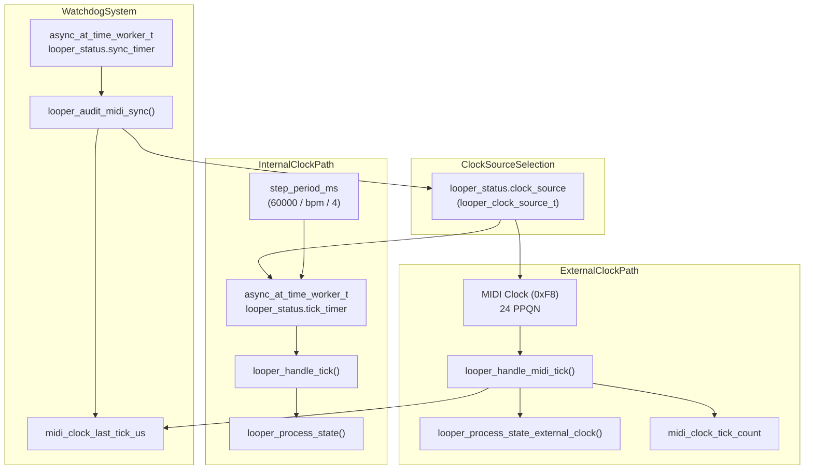
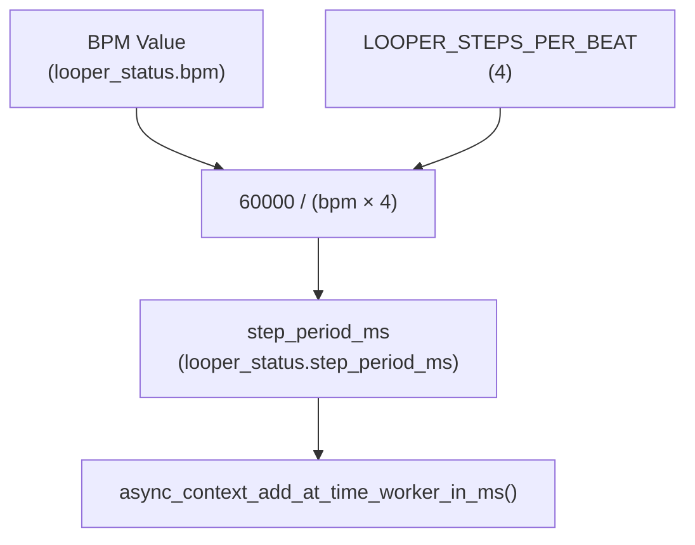
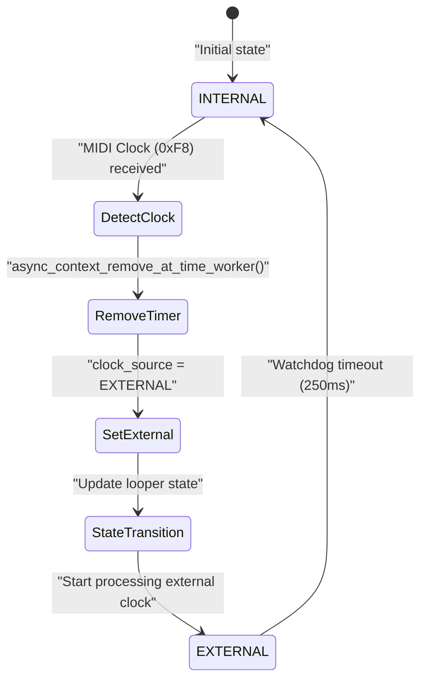
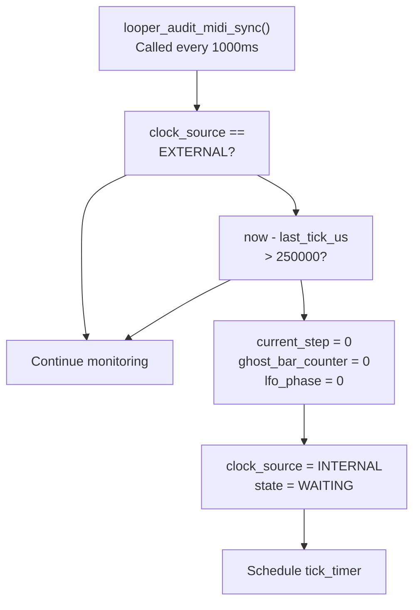
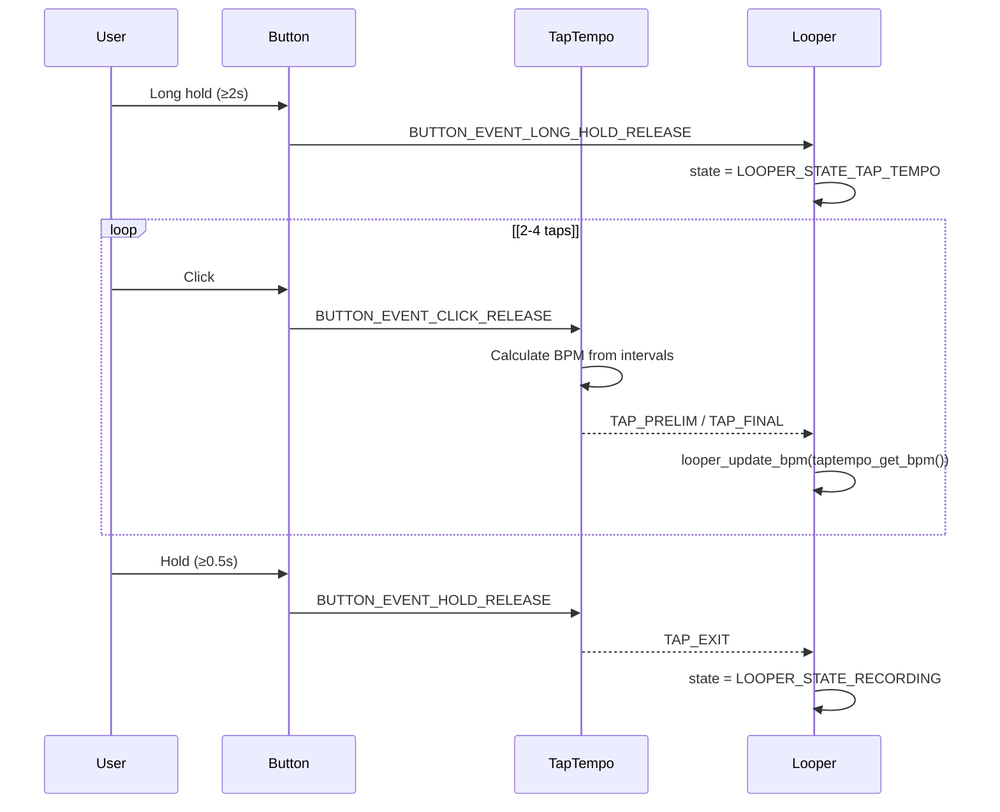

# Clock Synchronization

> **Relevant source files**
> * [async_timer.c](https://github.com/Jus-Be/orinayo-pico/blob/6dde5a75/async_timer.c)
> * [async_timer.h](https://github.com/Jus-Be/orinayo-pico/blob/6dde5a75/async_timer.h)
> * [looper.c](https://github.com/Jus-Be/orinayo-pico/blob/6dde5a75/looper.c)

## Purpose and Scope

This document explains the clock synchronization system in the Orinayo looper, which manages timing for the 2-bar step sequencer. The system supports two clock sources: an internal timer-based clock and an external MIDI clock synchronization mode. The looper automatically detects and switches between these modes, maintaining precise timing for musical playback.

For information about the step sequencer itself, see [Step Sequencer](https://github.com/Jus-Be/orinayo-pico/blob/6dde5a75/Step Sequencer)

 For the note scheduling mechanism that uses these timing signals, see [Note Scheduler](https://github.com/Jus-Be/orinayo-pico/blob/6dde5a75/Note Scheduler)

 For tap tempo BPM detection, see [Tap Tempo](https://github.com/Jus-Be/orinayo-pico/blob/6dde5a75/Tap Tempo)

---

## Clock Sources

The looper supports two mutually exclusive clock sources, defined by the `looper_clock_source_t` enumeration in [looper.h L39-L42](https://github.com/Jus-Be/orinayo-pico/blob/6dde5a75/looper.h#L39-L42)

:

| Clock Source | Value | Description |
| --- | --- | --- |
| `LOOPER_CLOCK_INTERNAL` | 0 | Local async timer, self-clocking |
| `LOOPER_CLOCK_EXTERNAL` | 1 | MIDI Clock (0xF8) at 24 PPQN |

The active clock source is stored in `looper_status.clock_source` [looper.h L58](https://github.com/Jus-Be/orinayo-pico/blob/6dde5a75/looper.h#L58-L58)

 and determines which timing mechanism drives the sequencer's step advancement.

Sources: [looper.h L39-L42](https://github.com/Jus-Be/orinayo-pico/blob/6dde5a75/looper.h#L39-L42)

 [looper.h L58](https://github.com/Jus-Be/orinayo-pico/blob/6dde5a75/looper.h#L58-L58)

---

## Clock Source Architecture

The following diagram illustrates how timing signals flow through the system depending on the selected `clock_source`.


```mermaid
flowchart TD

ClockSource["looper_status.clock_source<br>(looper_clock_source_t)"]
AsyncTimer["async_at_time_worker_t<br>looper_status.tick_timer"]
HandleTick["looper_handle_tick()"]
ProcessState["looper_process_state()"]
StepPeriod["step_period_ms<br>(60000 / bpm / 4)"]
MIDIClock["MIDI Clock (0xF8)<br>24 PPQN"]
HandleMIDITick["looper_handle_midi_tick()"]
ProcessStateExt["looper_process_state_external_clock()"]
TickCount["midi_clock_tick_count"]
SyncTimer["async_at_time_worker_t<br>looper_status.sync_timer"]
AuditSync["looper_audit_midi_sync()"]
LastTick["midi_clock_last_tick_us"]

ClockSource --> AsyncTimer
ClockSource --> MIDIClock
HandleMIDITick --> LastTick
AuditSync --> ClockSource

subgraph WatchdogSystem ["WatchdogSystem"]
    SyncTimer
    AuditSync
    LastTick
    SyncTimer --> AuditSync
    AuditSync --> LastTick
end

subgraph ExternalClockPath ["ExternalClockPath"]
    MIDIClock
    HandleMIDITick
    ProcessStateExt
    TickCount
    MIDIClock --> HandleMIDITick
    HandleMIDITick --> ProcessStateExt
    HandleMIDITick --> TickCount
end

subgraph InternalClockPath ["InternalClockPath"]
    AsyncTimer
    HandleTick
    ProcessState
    StepPeriod
    AsyncTimer --> HandleTick
    HandleTick --> ProcessState
    StepPeriod --> AsyncTimer
end

subgraph ClockSourceSelection ["ClockSourceSelection"]
    ClockSource
end
```

Sources: [looper.c L103-L104](https://github.com/Jus-Be/orinayo-pico/blob/6dde5a75/looper.c#L103-L104)

 [looper.c L288-L344](https://github.com/Jus-Be/orinayo-pico/blob/6dde5a75/looper.c#L288-L344)

 [looper.c L346-L374](https://github.com/Jus-Be/orinayo-pico/blob/6dde5a75/looper.c#L346-L374)

 [looper.c L423-L435](https://github.com/Jus-Be/orinayo-pico/blob/6dde5a75/looper.c#L423-L435)

 [looper.c L437-L454](https://github.com/Jus-Be/orinayo-pico/blob/6dde5a75/looper.c#L437-L454)

 [looper.c L457-L486](https://github.com/Jus-Be/orinayo-pico/blob/6dde5a75/looper.c#L457-L486)

 [looper.h L39-L42](https://github.com/Jus-Be/orinayo-pico/blob/6dde5a75/looper.h#L39-L42)

 [looper.h L58-L60](https://github.com/Jus-Be/orinayo-pico/blob/6dde5a75/looper.h#L58-L60)

---

## Internal Clock Mode

### Timer-Based Step Advancement

In internal clock mode, the looper uses the Pico SDK's `async_context` system [async_timer.c L27-L33](https://github.com/Jus-Be/orinayo-pico/blob/6dde5a75/async_timer.c#L27-L33)

 to schedule periodic callbacks. The timer worker `looper_status.tick_timer` is configured during initialization in `looper_schedule_step_timer()` [looper.c L516-L526](https://github.com/Jus-Be/orinayo-pico/blob/6dde5a75/looper.c#L516-L526)

**Initialization:**

1. Sets `tick_timer.do_work = looper_handle_tick` [looper.c L517](https://github.com/Jus-Be/orinayo-pico/blob/6dde5a75/looper.c#L517-L517)
2. Calculates initial `step_period_ms` from `LOOPER_DEFAULT_BPM` (96) [looper.c L49](https://github.com/Jus-Be/orinayo-pico/blob/6dde5a75/looper.c#L49-L49)
3. Schedules first timer callback using `async_context_add_at_time_worker_in_ms()` [looper.c L524-L525](https://github.com/Jus-Be/orinayo-pico/blob/6dde5a75/looper.c#L524-L525)

The `looper_handle_tick()` function [looper.c L423-L435](https://github.com/Jus-Be/orinayo-pico/blob/6dde5a75/looper.c#L423-L435)

 executes on each timer expiration:

1. Calls `looper_process_state()` to advance the sequencer logic [looper.c L427](https://github.com/Jus-Be/orinayo-pico/blob/6dde5a75/looper.c#L427-L427)
2. Measures handler execution time using `time_us_64()` [looper.c L424-L429](https://github.com/Jus-Be/orinayo-pico/blob/6dde5a75/looper.c#L424-L429)
3. Reschedules the timer, compensating for processing delay to maintain steady tempo [looper.c L430-L434](https://github.com/Jus-Be/orinayo-pico/blob/6dde5a75/looper.c#L430-L434)

| Parameter | Formula | Default Value |
| --- | --- | --- |
| BPM | Configurable | 96 |
| Steps per beat | `LOOPER_STEPS_PER_BEAT` | 4 (16th notes) |
| Step period (ms) | `60000 / (bpm * steps_per_beat)` | 156.25 ms |

Sources: [looper.c L423-L435](https://github.com/Jus-Be/orinayo-pico/blob/6dde5a75/looper.c#L423-L435)

 [looper.c L516-L526](https://github.com/Jus-Be/orinayo-pico/blob/6dde5a75/looper.c#L516-L526)

 [looper.h L12-L15](https://github.com/Jus-Be/orinayo-pico/blob/6dde5a75/looper.h#L12-L15)

 [async_timer.c L27-L33](https://github.com/Jus-Be/orinayo-pico/blob/6dde5a75/async_timer.c#L27-L33)

### Step Period Calculation


```mermaid
flowchart TD

BPM["BPM Value<br>(looper_status.bpm)"]
StepsPerBeat["LOOPER_STEPS_PER_BEAT<br>(4)"]
Formula["60000 / (bpm × 4)"]
StepPeriod["step_period_ms<br>(looper_status.step_period_ms)"]
AsyncTimer["async_context_add_at_time_worker_in_ms()"]

BPM --> Formula
StepsPerBeat --> Formula
Formula --> StepPeriod
StepPeriod --> AsyncTimer
```

The step period is recalculated whenever the BPM changes via `looper_update_bpm()` [looper.c L281-L285](https://github.com/Jus-Be/orinayo-pico/blob/6dde5a75/looper.c#L281-L285)

Sources: [looper.c L281-L285](https://github.com/Jus-Be/orinayo-pico/blob/6dde5a75/looper.c#L281-L285)

 [looper.h L12-L18](https://github.com/Jus-Be/orinayo-pico/blob/6dde5a75/looper.h#L12-L18)

---

## External MIDI Clock Mode

### MIDI Clock Protocol

External clock mode synchronizes to incoming MIDI Clock messages (status byte `0xF8`), transmitted at 24 pulses per quarter note (PPQN). The looper counts every 6 clock pulses to advance one 16th note step [looper.c L474-L476](https://github.com/Jus-Be/orinayo-pico/blob/6dde5a75/looper.c#L474-L476)

**Clock Message Mapping:**
`24 PPQN ÷ 4 (16th notes per quarter) = 6 clock pulses per step`

### Automatic Clock Detection

When a MIDI Clock message arrives, `looper_handle_midi_tick()` [looper.c L462-L472](https://github.com/Jus-Be/orinayo-pico/blob/6dde5a75/looper.c#L462-L472)

 performs automatic mode switching:


```mermaid
stateDiagram-v2
    [*] --> INTERNAL : "Initial state"
    INTERNAL --> DetectClock : "MIDI Clock (0xF8) received"
    DetectClock --> RemoveTimer : "async_context_remove_at_time_worker()"
    RemoveTimer --> SetExternal : "clock_source = EXTERNAL"
    SetExternal --> StateTransition : "Update looper state"
    StateTransition --> EXTERNAL : "Start processing external clock"
    EXTERNAL --> INTERNAL : "Watchdog timeout (250ms)"
```

The transition logic in `looper_handle_midi_tick()` [looper.c L462-L472](https://github.com/Jus-Be/orinayo-pico/blob/6dde5a75/looper.c#L462-L472)

:

1. Detects the first MIDI clock pulse.
2. Removes the internal timer from the async context [looper.c L464](https://github.com/Jus-Be/orinayo-pico/blob/6dde5a75/looper.c#L464-L464)
3. Sets `clock_source` to `LOOPER_CLOCK_EXTERNAL` [looper.c L465](https://github.com/Jus-Be/orinayo-pico/blob/6dde5a75/looper.c#L465-L465)
4. Transitions the state machine: if in `TAP_TEMPO`, it moves to `SYNC_MUTE`; otherwise, it moves to `SYNC_PLAYING` [looper.c L466-L470](https://github.com/Jus-Be/orinayo-pico/blob/6dde5a75/looper.c#L466-L470)

Sources: [looper.c L457-L486](https://github.com/Jus-Be/orinayo-pico/blob/6dde5a75/looper.c#L457-L486)

### BPM Calculation from MIDI Clock

The system measures the time between MIDI clock pulses to calculate BPM. Every 6 pulses (one 16th note), it updates the tempo [looper.c L477-L482](https://github.com/Jus-Be/orinayo-pico/blob/6dde5a75/looper.c#L477-L482)

:

Implementation [looper.c L477-L482](https://github.com/Jus-Be/orinayo-pico/blob/6dde5a75/looper.c#L477-L482)

:

* Accumulates tick intervals over 6 pulses.
* Calculates average interval per tick.
* Converts to BPM: `BPM = 60,000,000 µs/min ÷ (avg_tick_interval_µs × 24)`.
* Calls `looper_update_bpm()` to apply the new tempo [looper.c L482](https://github.com/Jus-Be/orinayo-pico/blob/6dde5a75/looper.c#L482-L482)

| Variable | Purpose |
| --- | --- |
| `midi_clock_tick_count` | Total clock pulses received [looper.c L103](https://github.com/Jus-Be/orinayo-pico/blob/6dde5a75/looper.c#L103-L103) |
| `midi_clock_last_tick_us` | Timestamp of last clock pulse [looper.c L104](https://github.com/Jus-Be/orinayo-pico/blob/6dde5a75/looper.c#L104-L104) |

Sources: [looper.c L103-L104](https://github.com/Jus-Be/orinayo-pico/blob/6dde5a75/looper.c#L103-L104)

 [looper.c L457-L486](https://github.com/Jus-Be/orinayo-pico/blob/6dde5a75/looper.c#L457-L486)

### MIDI Start Message Handling

The MIDI Start message (`0xFA`) resets sequencer position in `looper_handle_midi_start()` [looper.c L488-L493](https://github.com/Jus-Be/orinayo-pico/blob/6dde5a75/looper.c#L488-L493)

:

* `current_step = 0`
* `ghost_bar_counter = 0`
* `lfo_phase = 0`
* `midi_clock_tick_count = 0`

Sources: [looper.c L488-L493](https://github.com/Jus-Be/orinayo-pico/blob/6dde5a75/looper.c#L488-L493)

---

## Clock Watchdog System

### Automatic Fallback to Internal Clock

A watchdog timer `looper_status.sync_timer` monitors MIDI clock activity via `looper_audit_midi_sync()` [looper.c L437-L454](https://github.com/Jus-Be/orinayo-pico/blob/6dde5a75/looper.c#L437-L454)

 If no clock pulse is received for 250,000 microseconds (250ms), the system falls back to internal clock mode.


```mermaid
flowchart TD

Timer["looper_audit_midi_sync()<br>Called every 1000ms"]
CheckMode["clock_source ==<br>EXTERNAL?"]
CheckTimeout["now - last_tick_us<br>> 250000?"]
ResetState["current_step = 0<br>ghost_bar_counter = 0<br>lfo_phase = 0"]
SetInternal["clock_source = INTERNAL<br>state = WAITING"]
RestartTimer["Schedule tick_timer"]
Continue["Continue monitoring"]

Timer --> CheckMode
CheckMode --> Continue
CheckMode --> CheckTimeout
CheckTimeout --> Continue
CheckTimeout --> ResetState
ResetState --> SetInternal
SetInternal --> RestartTimer
```

This ensures graceful degradation when an external clock source becomes unavailable [looper.c L444-L452](https://github.com/Jus-Be/orinayo-pico/blob/6dde5a75/looper.c#L444-L452)

Sources: [looper.c L437-L454](https://github.com/Jus-Be/orinayo-pico/blob/6dde5a75/looper.c#L437-L454)

---

## BPM Management

### BPM Update Function

The `looper_update_bpm()` function [looper.c L281-L285](https://github.com/Jus-Be/orinayo-pico/blob/6dde5a75/looper.c#L281-L285)

 centralizes tempo changes:

```
void looper_update_bpm(uint32_t bpm) {    looper_status.bpm = bpm;    looper_status.step_period_ms = 60000 / (bpm * LOOPER_STEPS_PER_BEAT);    midi_seqtrak_tempo(bpm);}
```

This function is called by tap tempo, MIDI clock calculation, and manual adjustments.

Sources: [looper.c L281-L285](https://github.com/Jus-Be/orinayo-pico/blob/6dde5a75/looper.c#L281-L285)

### Tap Tempo Integration

The tap tempo system provides manual BPM adjustment. When in `LOOPER_STATE_TAP_TEMPO`, button events are routed to `taptempo_handle_button_event()` [looper.c L257-L270](https://github.com/Jus-Be/orinayo-pico/blob/6dde5a75/looper.c#L257-L270)

**Tap Tempo Flow:**


```mermaid
sequenceDiagram
  participant User
  participant Button
  participant TapTempo
  participant Looper

  User->>Button: Long hold (≥2s)
  Button->>Looper: BUTTON_EVENT_LONG_HOLD_RELEASE
  Looper->>Looper: state = LOOPER_STATE_TAP_TEMPO
  loop [2-4 taps]
    User->>Button: Click
    Button->>TapTempo: BUTTON_EVENT_CLICK_RELEASE
    TapTempo->>TapTempo: Calculate BPM from intervals
    TapTempo-->>Looper: TAP_PRELIM / TAP_FINAL
    Looper->>Looper: looper_update_bpm(taptempo_get_bpm())
  end
  User->>Button: Hold (≥0.5s)
  Button->>TapTempo: BUTTON_EVENT_HOLD_RELEASE
  TapTempo-->>Looper: TAP_EXIT
  Looper->>Looper: state = LOOPER_STATE_RECORDING
```

The system measures intervals between button presses in `tap_tempo.c` [tap_tempo.c L43-L59](https://github.com/Jus-Be/orinayo-pico/blob/6dde5a75/tap_tempo.c#L43-L59)

 and clamps BPM to the range [40, 240] [tap_tempo.h L17-L18](https://github.com/Jus-Be/orinayo-pico/blob/6dde5a75/tap_tempo.h#L17-L18)

Sources: [looper.c L257-L270](https://github.com/Jus-Be/orinayo-pico/blob/6dde5a75/looper.c#L257-L270)

 [tap_tempo.c L43-L59](https://github.com/Jus-Be/orinayo-pico/blob/6dde5a75/tap_tempo.c#L43-L59)

 [tap_tempo.h L1-L23](https://github.com/Jus-Be/orinayo-pico/blob/6dde5a75/tap_tempo.h#L1-L23)

---

## State Machine Behavior

### Internal vs External States

| Mode | Active States | Note Output Behavior |
| --- | --- | --- |
| **Internal** | `WAITING`, `PLAYING`, `RECORDING`, `TAP_TEMPO`, etc. [looper.h L23-L32](https://github.com/Jus-Be/orinayo-pico/blob/6dde5a75/looper.h#L23-L32) | Driven by `looper_process_state()` [looper.c L288-L344](https://github.com/Jus-Be/orinayo-pico/blob/6dde5a75/looper.c#L288-L344) |
| **External** | `SYNC_MUTE`, `SYNC_PLAYING` [looper.h L34-L37](https://github.com/Jus-Be/orinayo-pico/blob/6dde5a75/looper.h#L34-L37) | Driven by `looper_process_state_external_clock()` [looper.c L346-L374](https://github.com/Jus-Be/orinayo-pico/blob/6dde5a75/looper.c#L346-L374) |

In External mode, a button hold toggles between `SYNC_MUTE` and `SYNC_PLAYING` [looper.c L504-L514](https://github.com/Jus-Be/orinayo-pico/blob/6dde5a75/looper.c#L504-L514)

Sources: [looper.c L288-L344](https://github.com/Jus-Be/orinayo-pico/blob/6dde5a75/looper.c#L288-L344)

 [looper.c L346-L374](https://github.com/Jus-Be/orinayo-pico/blob/6dde5a75/looper.c#L346-L374)

 [looper.h L23-L37](https://github.com/Jus-Be/orinayo-pico/blob/6dde5a75/looper.h#L23-L37)

---

## Timing Precision

### Microsecond Timestamping

All timing measurements use the Pico SDK's `time_us_64()` function [looper.c L132](https://github.com/Jus-Be/orinayo-pico/blob/6dde5a75/looper.c#L132-L132)

 This precision is used for:

* BPM calculation from MIDI clock intervals [looper.c L478](https://github.com/Jus-Be/orinayo-pico/blob/6dde5a75/looper.c#L478-L478)
* Swing timing offsets [looper.c L155](https://github.com/Jus-Be/orinayo-pico/blob/6dde5a75/looper.c#L155-L155)
* Note scheduling [looper.c L172](https://github.com/Jus-Be/orinayo-pico/blob/6dde5a75/looper.c#L172-L172)

### Scheduling Compensation

The internal clock timer compensates for handler execution time [looper.c L429-L433](https://github.com/Jus-Be/orinayo-pico/blob/6dde5a75/looper.c#L429-L433)

:

```
uint64_t handler_delay_ms = (time_us_64() - start_us) / 1000;uint32_t delay = (handler_delay_ms >= (uint32_t)step_delay)     ? 1     : (uint32_t)step_delay - handler_delay_ms;
```

If processing exceeds the step period, the next tick is scheduled for 1ms in the future to maintain system stability.

Sources: [looper.c L423-L435](https://github.com/Jus-Be/orinayo-pico/blob/6dde5a75/looper.c#L423-L435)