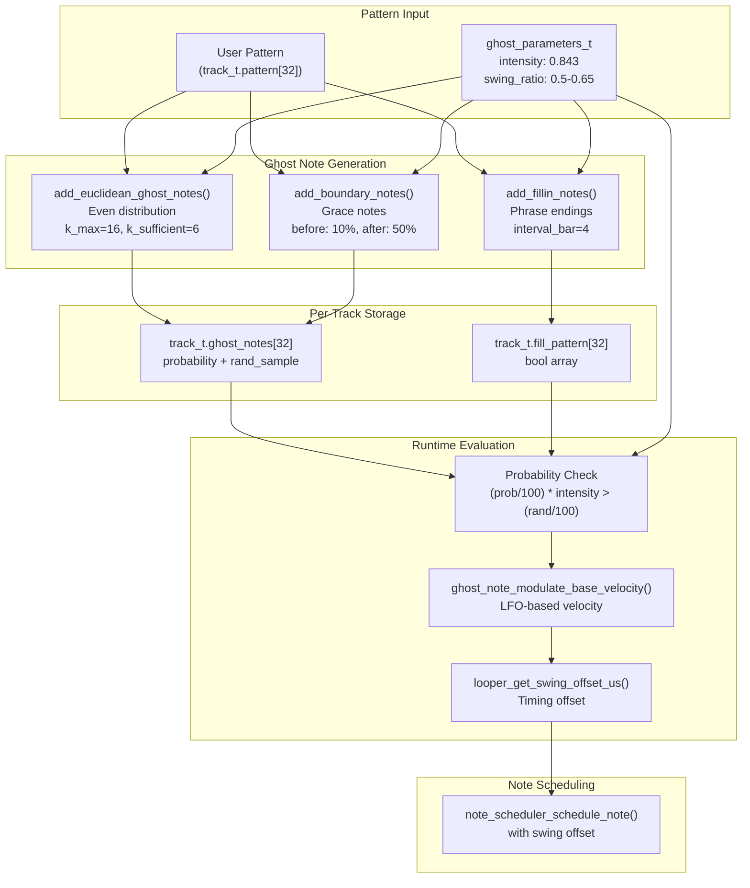
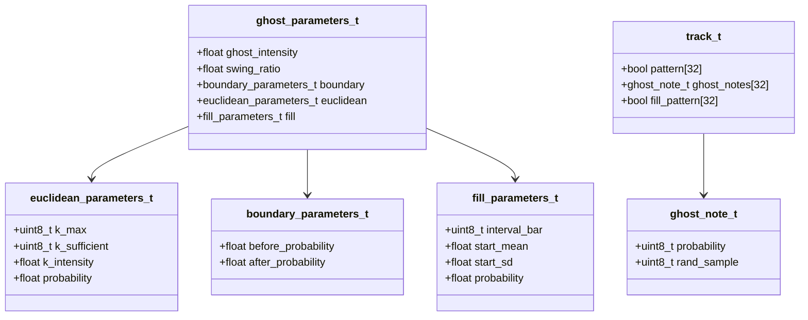
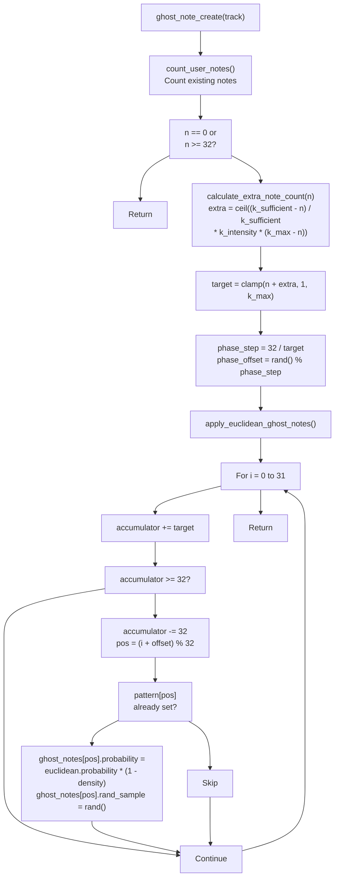
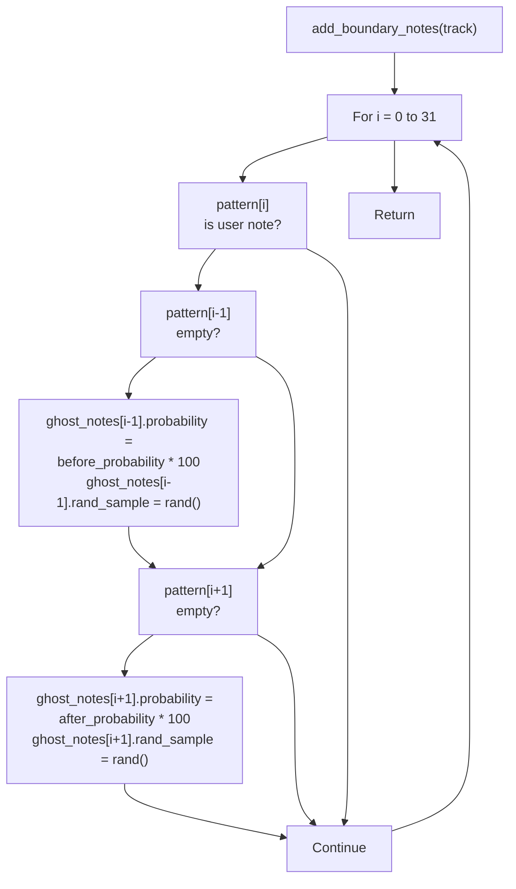
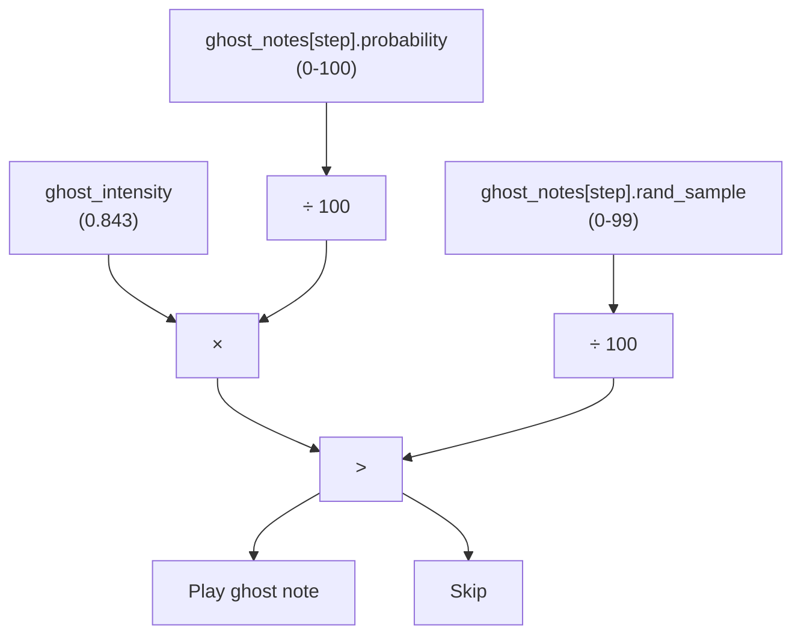
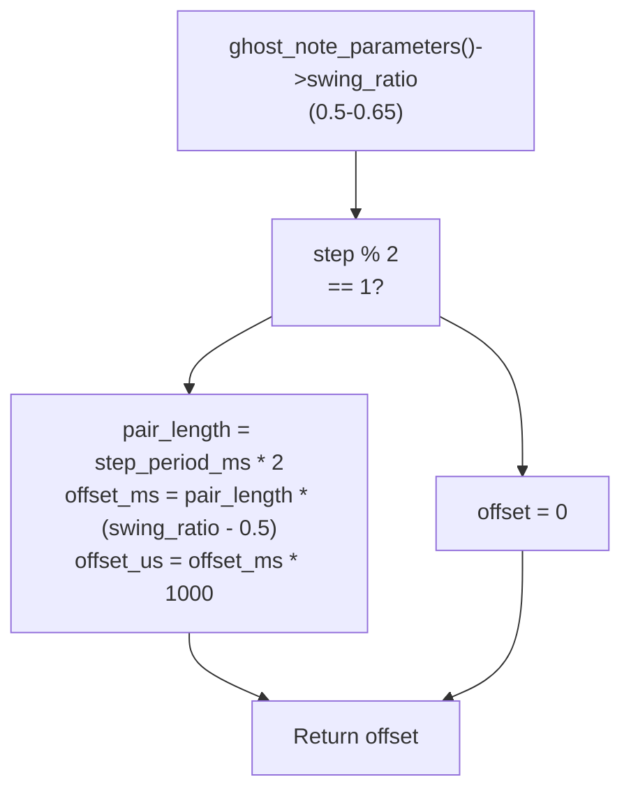
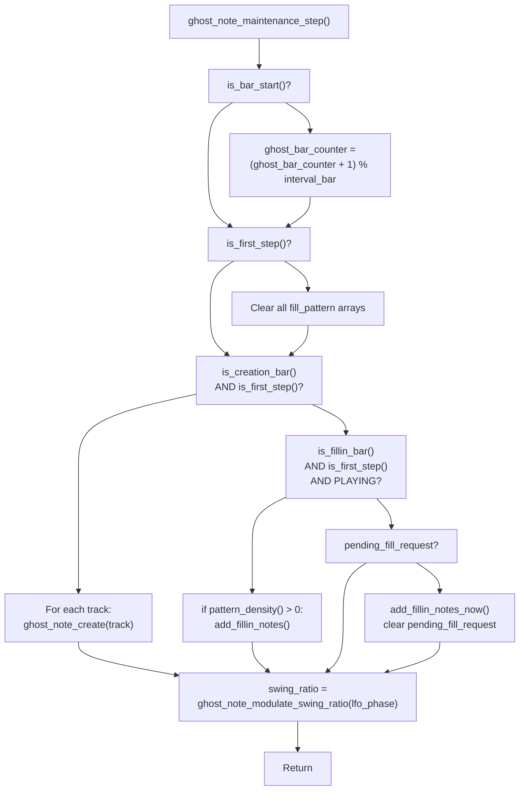

# Ghost Note Generation

> **Relevant source files**
> * [ghost_note.c](https://github.com/Jus-Be/orinayo-pico/blob/122fa496/ghost_note.c)
> * [ghost_note.h](https://github.com/Jus-Be/orinayo-pico/blob/122fa496/ghost_note.h)
> * [looper.c](https://github.com/Jus-Be/orinayo-pico/blob/122fa496/looper.c)
> * [note_scheduler.c](https://github.com/Jus-Be/orinayo-pico/blob/122fa496/note_scheduler.c)
> * [note_scheduler.h](https://github.com/Jus-Be/orinayo-pico/blob/122fa496/note_scheduler.h)

This page documents the algorithmic note generation system that augments user-recorded drum patterns with additional "ghost" notes. These generated notes add humanization, rhythmic complexity, and dynamic fills to the step sequencer patterns.

For information about the step sequencer itself, see [Step Sequencer](./5.2-step-sequencer.md). For note timing and scheduling, see [Note Scheduler](./5.5-note-scheduler.md). For clock synchronization, see [Clock Synchronization](./5.3-clock-synchronization.md).

## Purpose and Scope

The ghost note generation system provides three distinct algorithms that automatically add MIDI note events to the 32-step looper patterns:

1. **Euclidean Distribution** - Evenly spaces additional notes across empty steps
2. **Boundary Notes** - Adds grace notes immediately before/after user notes
3. **Fill-in Patterns** - Generates drum fills at phrase endings based on pattern density

All generated notes are probabilistic and controlled by a master `ghost_intensity` parameter that acts as a global volume control for algorithmic enhancement. The system operates per-track, allowing different drums to have different ghost note characteristics.

**Sources:** [ghost_note.c L1-L348](https://github.com/Jus-Be/orinayo-pico/blob/122fa496/ghost_note.c#L1-L348)

 [ghost_note.h L1-L51](https://github.com/Jus-Be/orinayo-pico/blob/122fa496/ghost_note.h#L1-L51)

## System Architecture



The ghost note system operates in two phases: **generation** (when patterns are created or updated) and **evaluation** (every step during playback). Generation algorithms populate the `ghost_notes` and `fill_pattern` arrays with probability values. During playback, these probabilities are evaluated against the master `ghost_intensity` and a random sample to determine if each ghost note fires.

**Sources:** [ghost_note.c L1-L348](https://github.com/Jus-Be/orinayo-pico/blob/122fa496/ghost_note.c#L1-L348)

 [looper.c L162-L194](https://github.com/Jus-Be/orinayo-pico/blob/122fa496/looper.c#L162-L194)

## Data Structures

The ghost note system uses several interconnected data structures to store parameters and per-step note information:



### Parameter Structure

The global parameters are defined as a static variable initialized with default values:

| Parameter | Default | Range | Purpose |
| --- | --- | --- | --- |
| `ghost_intensity` | 0.843 | 0.0-1.0 | Master probability multiplier for all ghost notes |
| `swing_ratio` | 0.5 | 0.5-0.65 | Timing offset for odd-numbered steps |
| `boundary.before_probability` | 0.10 | 0.0-1.0 | Probability of note before user note |
| `boundary.after_probability` | 0.50 | 0.0-1.0 | Probability of note after user note |
| `euclidean.k_max` | 16 | 1-32 | Maximum total notes (user + ghost) |
| `euclidean.k_sufficient` | 6 | 0-k_max | Threshold below which notes are added |
| `euclidean.k_intensity` | 0.90 | 0.0-1.0 | Aggressiveness of note addition |
| `euclidean.probability` | 0.80 | 0.0-1.0 | Base probability for Euclidean notes |
| `fill.interval_bar` | 4 | 1-16 | Bars between automatic fills |
| `fill.start_mean` | 15.0 | 0.0-32.0 | Mean step for fill start (Gaussian) |
| `fill.start_sd` | 5.0 | 0.0-16.0 | Standard deviation for fill start |
| `fill.probability` | 0.40 | 0.0-1.0 | Probability of each fill note |

### Per-Step Ghost Note Storage

Each track maintains a `ghost_notes[32]` array where each element contains:

* `probability` (0-100): The likelihood this ghost note should fire
* `rand_sample` (0-99): A pre-generated random value for evaluation

The separation of `probability` and `rand_sample` allows deterministic pattern regeneration while maintaining randomness in note placement.

**Sources:** [ghost_note.h L10-L36](https://github.com/Jus-Be/orinayo-pico/blob/122fa496/ghost_note.h#L10-L36)

 [ghost_note.c L21-L27](https://github.com/Jus-Be/orinayo-pico/blob/122fa496/ghost_note.c#L21-L27)

 [looper.h L25-L32](https://github.com/Jus-Be/orinayo-pico/blob/122fa496/looper.h#L25-L32)

## Euclidean Algorithm

The Euclidean algorithm distributes ghost notes evenly across the 32-step pattern, filling sparse tracks to a target density. It is based on Bresenham's line algorithm, commonly used for Euclidean rhythms in music.

### Algorithm Flow



### Implementation Details

The function `add_euclidean_ghost_notes()` [ghost_note.c L168-L182](https://github.com/Jus-Be/orinayo-pico/blob/122fa496/ghost_note.c#L168-L182)

 implements this algorithm:

1. **Count Existing Notes**: Determine how many user notes exist
2. **Calculate Target Density**: Based on `k_sufficient` threshold
3. **Compute Extra Notes**: Use the formula: ``` extra = ceil((k_sufficient - current) / k_sufficient * k_intensity * (k_max - current)) ```
4. **Apply Bresenham Accumulator**: Distribute `target` notes evenly across 32 steps
5. **Set Probabilities**: Each candidate position gets a probability adjusted by pattern density

The algorithm ensures that:

* Sparse patterns (< 6 notes) receive more ghost notes
* Dense patterns (≥ 6 notes) receive few or no ghost notes
* Ghost notes avoid steps where user notes already exist
* Probability decreases as pattern density increases: `probability * (1.0 - density)`

**Sources:** [ghost_note.c L124-L182](https://github.com/Jus-Be/orinayo-pico/blob/122fa496/ghost_note.c#L124-L182)

## Boundary Notes

Boundary notes add grace notes immediately adjacent to user-recorded notes, creating leading and trailing embellishments. This algorithm operates independently from Euclidean distribution.

### Algorithm Logic



### Implementation

The `add_boundary_notes()` function [ghost_note.c L185-L204](https://github.com/Jus-Be/orinayo-pico/blob/122fa496/ghost_note.c#L185-L204)

 scans each user note and attempts to place ghost notes at positions `i-1` and `i+1` (with wraparound for step 0 and 31):

* **Before Note** (10% probability): Creates an anticipation or pickup
* **After Note** (50% probability): Creates a trailing grace note or flam

The function only sets boundary notes if:

1. A user note exists at position `i`
2. The adjacent position has no user note
3. The adjacent position has no existing ghost note (`rand_sample == 0`)

This prevents overwriting Euclidean ghost notes and avoids double-triggering on consecutive user notes.

**Sources:** [ghost_note.c L185-L204](https://github.com/Jus-Be/orinayo-pico/blob/122fa496/ghost_note.c#L185-L204)

## Fill-in Patterns

Fill-in patterns generate drum fills at the end of musical phrases, typically on tracks 0 (kick) and 1 (snare). Unlike Euclidean and boundary notes, fills are stored in a separate `fill_pattern[32]` boolean array.

### Trigger Conditions

```css
#mermaid-mik4as3r8v{font-family:ui-sans-serif,-apple-system,system-ui,Segoe UI,Helvetica;font-size:16px;fill:#333;}@keyframes edge-animation-frame{from{stroke-dashoffset:0;}}@keyframes dash{to{stroke-dashoffset:0;}}#mermaid-mik4as3r8v .edge-animation-slow{stroke-dasharray:9,5!important;stroke-dashoffset:900;animation:dash 50s linear infinite;stroke-linecap:round;}#mermaid-mik4as3r8v .edge-animation-fast{stroke-dasharray:9,5!important;stroke-dashoffset:900;animation:dash 20s linear infinite;stroke-linecap:round;}#mermaid-mik4as3r8v .error-icon{fill:#dddddd;}#mermaid-mik4as3r8v .error-text{fill:#222222;stroke:#222222;}#mermaid-mik4as3r8v .edge-thickness-normal{stroke-width:1px;}#mermaid-mik4as3r8v .edge-thickness-thick{stroke-width:3.5px;}#mermaid-mik4as3r8v .edge-pattern-solid{stroke-dasharray:0;}#mermaid-mik4as3r8v .edge-thickness-invisible{stroke-width:0;fill:none;}#mermaid-mik4as3r8v .edge-pattern-dashed{stroke-dasharray:3;}#mermaid-mik4as3r8v .edge-pattern-dotted{stroke-dasharray:2;}#mermaid-mik4as3r8v .marker{fill:#999;stroke:#999;}#mermaid-mik4as3r8v .marker.cross{stroke:#999;}#mermaid-mik4as3r8v svg{font-family:ui-sans-serif,-apple-system,system-ui,Segoe UI,Helvetica;font-size:16px;}#mermaid-mik4as3r8v p{margin:0;}#mermaid-mik4as3r8v defs #statediagram-barbEnd{fill:#999;stroke:#999;}#mermaid-mik4as3r8v g.stateGroup text{fill:#dddddd;stroke:none;font-size:10px;}#mermaid-mik4as3r8v g.stateGroup text{fill:#333;stroke:none;font-size:10px;}#mermaid-mik4as3r8v g.stateGroup .state-title{font-weight:bolder;fill:#333;}#mermaid-mik4as3r8v g.stateGroup rect{fill:#ffffff;stroke:#dddddd;}#mermaid-mik4as3r8v g.stateGroup line{stroke:#999;stroke-width:1;}#mermaid-mik4as3r8v .transition{stroke:#999;stroke-width:1;fill:none;}#mermaid-mik4as3r8v .stateGroup .composit{fill:#f4f4f4;border-bottom:1px;}#mermaid-mik4as3r8v .stateGroup .alt-composit{fill:#e0e0e0;border-bottom:1px;}#mermaid-mik4as3r8v .state-note{stroke:#e6d280;fill:#fff5ad;}#mermaid-mik4as3r8v .state-note text{fill:#333;stroke:none;font-size:10px;}#mermaid-mik4as3r8v .stateLabel .box{stroke:none;stroke-width:0;fill:#ffffff;opacity:0.5;}#mermaid-mik4as3r8v .edgeLabel .label rect{fill:#ffffff;opacity:0.5;}#mermaid-mik4as3r8v .edgeLabel{background-color:#ffffff;text-align:center;}#mermaid-mik4as3r8v .edgeLabel p{background-color:#ffffff;}#mermaid-mik4as3r8v .edgeLabel rect{opacity:0.5;background-color:#ffffff;fill:#ffffff;}#mermaid-mik4as3r8v .edgeLabel .label text{fill:#333;}#mermaid-mik4as3r8v .label div .edgeLabel{color:#333;}#mermaid-mik4as3r8v .stateLabel text{fill:#333;font-size:10px;font-weight:bold;}#mermaid-mik4as3r8v .node circle.state-start{fill:#999;stroke:#999;}#mermaid-mik4as3r8v .node .fork-join{fill:#999;stroke:#999;}#mermaid-mik4as3r8v .node circle.state-end{fill:#dddddd;stroke:#f4f4f4;stroke-width:1.5;}#mermaid-mik4as3r8v .end-state-inner{fill:#f4f4f4;stroke-width:1.5;}#mermaid-mik4as3r8v .node rect{fill:#ffffff;stroke:#dddddd;stroke-width:1px;}#mermaid-mik4as3r8v .node polygon{fill:#ffffff;stroke:#dddddd;stroke-width:1px;}#mermaid-mik4as3r8v #statediagram-barbEnd{fill:#999;}#mermaid-mik4as3r8v .statediagram-cluster rect{fill:#ffffff;stroke:#dddddd;stroke-width:1px;}#mermaid-mik4as3r8v .cluster-label,#mermaid-mik4as3r8v .nodeLabel{color:#333;}#mermaid-mik4as3r8v .statediagram-cluster rect.outer{rx:5px;ry:5px;}#mermaid-mik4as3r8v .statediagram-state .divider{stroke:#dddddd;}#mermaid-mik4as3r8v .statediagram-state .title-state{rx:5px;ry:5px;}#mermaid-mik4as3r8v .statediagram-cluster.statediagram-cluster .inner{fill:#f4f4f4;}#mermaid-mik4as3r8v .statediagram-cluster.statediagram-cluster-alt .inner{fill:#f8f8f8;}#mermaid-mik4as3r8v .statediagram-cluster .inner{rx:0;ry:0;}#mermaid-mik4as3r8v .statediagram-state rect.basic{rx:5px;ry:5px;}#mermaid-mik4as3r8v .statediagram-state rect.divider{stroke-dasharray:10,10;fill:#f8f8f8;}#mermaid-mik4as3r8v .note-edge{stroke-dasharray:5;}#mermaid-mik4as3r8v .statediagram-note rect{fill:#fff5ad;stroke:#e6d280;stroke-width:1px;rx:0;ry:0;}#mermaid-mik4as3r8v .statediagram-note rect{fill:#fff5ad;stroke:#e6d280;stroke-width:1px;rx:0;ry:0;}#mermaid-mik4as3r8v .statediagram-note text{fill:#333;}#mermaid-mik4as3r8v .statediagram-note .nodeLabel{color:#333;}#mermaid-mik4as3r8v .statediagram .edgeLabel{color:red;}#mermaid-mik4as3r8v #dependencyStart,#mermaid-mik4as3r8v #dependencyEnd{fill:#999;stroke:#999;stroke-width:1;}#mermaid-mik4as3r8v .statediagramTitleText{text-anchor:middle;font-size:18px;fill:#333;}#mermaid-mik4as3r8v :root{--mermaid-font-family:"trebuchet ms",verdana,arial,sans-serif;}ghost_bar_counter == (interval_bar - 2)AND step 0AND pattern_density() > 0pending_fill_request == trueadd_fillin_notes()add_fillin_notes_now()WaitingAutomaticManualGeneratingGeneratingNowComplete
```

Fills are triggered in two ways:

1. **Automatic**: Every N bars (default: 4), starting 2 bars before the cycle completes
2. **Manual**: When `ghost_note_set_pending_fill_request()` is called (e.g., user button press during external clock sync)

### Fill Generation Algorithm

The fill generation process [ghost_note.c L226-L254](https://github.com/Jus-Be/orinayo-pico/blob/122fa496/ghost_note.c#L226-L254)

 involves several steps:

1. **Calculate Fill Start Position**: Use a Gaussian distribution centered at step 15: ``` fill_start = 32 - abs(rand_normal(start_mean, start_sd)) ``` This creates fills that typically start 3/4 through the pattern.
2. **Compute Density Window**: For each position, calculate local note density in a ±8 step window [ghost_note.c L206-L223](https://github.com/Jus-Be/orinayo-pico/blob/122fa496/ghost_note.c#L206-L223)
3. **Set Fill Probabilities**: For tracks 0 and 1, from `fill_start` to step 31: * If no existing ghost note, set probability based on inverse density: `(1.0 - density) * 0.25` * If ghost note probability exceeds threshold, set `fill_pattern[i] = true` with fill probability
4. **Density-Based Placement**: Fills are placed in sparse regions, avoiding dense areas

### Density Window Calculation

The `track_window_density()` function [ghost_note.c L206-L213](https://github.com/Jus-Be/orinayo-pico/blob/122fa496/ghost_note.c#L206-L213)

 computes the ratio of user notes within a 17-step window (±8 steps):

```
density = count_notes_in_window(step - 8, step + 8) / 17
```

This allows fills to intelligently avoid already-busy regions of the pattern.

**Sources:** [ghost_note.c L206-L254](https://github.com/Jus-Be/orinayo-pico/blob/122fa496/ghost_note.c#L206-L254)

 [ghost_note.c L286-L295](https://github.com/Jus-Be/orinayo-pico/blob/122fa496/ghost_note.c#L286-L295)

## Probability Evaluation System

Ghost notes are evaluated during playback using a two-stage probability system that compares stored probability values against the master `ghost_intensity` parameter.

### Evaluation Formula



The evaluation occurs in `looper_perform_step()` [looper.c L182-L189](https://github.com/Jus-Be/orinayo-pico/blob/122fa496/looper.c#L182-L189)

:

```
bool ghost_note_on = ((float)tracks[i].ghost_notes[step].probability / 100.0f) * 
                      params->ghost_intensity > 
                      (float)tracks[i].ghost_notes[step].rand_sample / 100.0f;
```

This formula allows the master `ghost_intensity` to act as a volume control:

* `ghost_intensity = 1.0`: All ghost notes with probability > rand_sample play
* `ghost_intensity = 0.5`: Only ghost notes with 2× probability > rand_sample play
* `ghost_intensity = 0.0`: No ghost notes play

### Fill Pattern Evaluation

Fill patterns use a simpler boolean evaluation [looper.c L190-L192](https://github.com/Jus-Be/orinayo-pico/blob/122fa496/looper.c#L190-L192)

:

```
if (tracks[i].fill_pattern[step] && !note_on)
    note_scheduler_schedule_note(now + swing_offset_us, channel, note, 0x7f);
```

Fills always play at maximum velocity (0x7f) and only fire if no user note exists at that step.

**Sources:** [looper.c L162-L194](https://github.com/Jus-Be/orinayo-pico/blob/122fa496/looper.c#L162-L194)

## Velocity Modulation

Ghost notes use per-track velocity values defined in `velocity_table` [ghost_note.c L31-L46](https://github.com/Jus-Be/orinayo-pico/blob/122fa496/ghost_note.c#L31-L46)

 with additional LFO-based modulation for specific tracks.

### Velocity Table

| Track | Drum | Base Velocity | Notes |
| --- | --- | --- | --- |
| 0 | Bass Drum | 0x20 (32) | LFO modulated |
| 1 | Snare | 0x25 (37) | - |
| 2 | Closed Hi-hat | 0x30 (48) | LFO modulated |
| 3 | Low Floor Tom | 0x20 (32) | - |
| 4 | Low Tom | 0x20 (32) | - |
| 5 | Open Hi-hat | 0x30 (48) | - |
| 6-13 | Various percussion | 0x20-0x25 | - |

### LFO-Based Modulation

The `ghost_note_modulate_base_velocity()` function [ghost_note.c L56-L67](https://github.com/Jus-Be/orinayo-pico/blob/122fa496/ghost_note.c#L56-L67)

 applies sinusoidal modulation to track 0 (kick) and track 2 (hi-hat):

**Kick Drum (Track 0)**:

```
phase = (lfo * 1.25 / 65536) * 2π
velocity = 100 + sin(phase) * 25
```

Range: 75-125

**Closed Hi-hat (Track 2)**:

```
phase = (lfo * 2 / 65536) * 2π
velocity = 107 + sin(phase) * 20
```

Range: 87-127

The LFO phase (`looper_status.lfo_phase`) increments by `LFO_RATE` each step [looper.c L342](https://github.com/Jus-Be/orinayo-pico/blob/122fa496/looper.c#L342-L342)

 creating a slow modulation over multiple bars.

**Sources:** [ghost_note.c L31-L67](https://github.com/Jus-Be/orinayo-pico/blob/122fa496/ghost_note.c#L31-L67)

 [looper.c L171-L173](https://github.com/Jus-Be/orinayo-pico/blob/122fa496/looper.c#L171-L173)

## Swing Timing

Ghost notes participate in the swing timing system, which delays odd-numbered steps to create a "shuffle" feel.

### Swing Offset Calculation



The `looper_get_swing_offset_us()` function [looper.c L148-L158](https://github.com/Jus-Be/orinayo-pico/blob/122fa496/looper.c#L148-L158)

 computes timing offsets for odd steps:

1. Calculate the duration of a 2-step pair (8th note)
2. Compute offset as the excess beyond 50%: `offset = pair_length * (swing_ratio - 0.5)`
3. Convert to microseconds for scheduling

**Example**: At 120 BPM with swing_ratio = 0.625:

* `step_period_ms` = 125 ms (16th note)
* `pair_length` = 250 ms (8th note)
* `offset` = 250 * 0.125 = 31.25 ms
* Odd steps are delayed by 31.25 ms

### Dynamic Swing Modulation

The `ghost_note_modulate_swing_ratio()` function [ghost_note.c L69-L88](https://github.com/Jus-Be/orinayo-pico/blob/122fa496/ghost_note.c#L69-L88)

 dynamically adjusts swing based on `ghost_intensity`:

```
if (ghost_intensity < 0.5)
    swing_ratio = 0.5;  // No swing
else
    t = (ghost_intensity - 0.5) * 2.0;
    base = 0.5 + pow(t, 7.0) * 0.15;
    lfo_amt = sin(lfo_phase + π/2) * 0.01;
    swing_ratio = clamp(base + lfo_amt, 0.5, 0.65);
```

This creates a smooth curve where:

* `ghost_intensity < 0.5`: No swing (straight 16ths)
* `ghost_intensity = 0.5 to 1.0`: Progressive swing from 0.5 to 0.65
* Exponent of 7.0 creates a steep curve near maximum intensity

**Sources:** [ghost_note.c L69-L88](https://github.com/Jus-Be/orinayo-pico/blob/122fa496/ghost_note.c#L69-L88)

 [looper.c L148-L158](https://github.com/Jus-Be/orinayo-pico/blob/122fa496/looper.c#L148-L158)

 [looper.c L166](https://github.com/Jus-Be/orinayo-pico/blob/122fa496/looper.c#L166-L166)

## Maintenance and Lifecycle

The ghost note system integrates with the looper through the `ghost_note_maintenance_step()` function, called every step during playback.

### Maintenance Cycle



### Lifecycle States

The ghost note system operates in a cyclic pattern:

| Step | Bar Counter | Action |
| --- | --- | --- |
| 0 | 0 | Generate Euclidean + boundary ghost notes |
| 0 | 1 | (none) |
| 0 | 2 | Generate fill-in patterns (automatic mode) |
| 0 | 3 | (none) |
| 0 | 0 | Cycle repeats |

The `ghost_bar_counter` tracks position within the 4-bar cycle (default `interval_bar`). Ghost notes are regenerated at the start of each cycle to maintain variety.

### Entry Points

The ghost note system is invoked from:

1. **Pattern Recording**: When recording completes [looper.c L395-L396](https://github.com/Jus-Be/orinayo-pico/blob/122fa496/looper.c#L395-L396) : ``` memset(track->ghost_notes, 0, sizeof(track->ghost_notes)); ```
2. **Each Step**: From `looper_process_state()` [looper.c L343](https://github.com/Jus-Be/orinayo-pico/blob/122fa496/looper.c#L343-L343) : ``` ghost_note_maintenance_step(); ```
3. **Manual Fill Request**: From external clock input [looper.c L512](https://github.com/Jus-Be/orinayo-pico/blob/122fa496/looper.c#L512-L512) : ``` ghost_note_set_pending_fill_request(); ```

**Sources:** [ghost_note.c L319-L348](https://github.com/Jus-Be/orinayo-pico/blob/122fa496/ghost_note.c#L319-L348)

 [looper.c L343](https://github.com/Jus-Be/orinayo-pico/blob/122fa496/looper.c#L343-L343)

 [looper.c L395-L396](https://github.com/Jus-Be/orinayo-pico/blob/122fa496/looper.c#L395-L396)

 [looper.c L512](https://github.com/Jus-Be/orinayo-pico/blob/122fa496/looper.c#L512-L512)

## Integration with Note Scheduler

Ghost notes use the same scheduling mechanism as user notes, with microsecond-precision timing and swing offsets applied.

### Scheduling Flow

```mermaid
sequenceDiagram
  participant looper_perform_step()
  participant ghost_note_parameters()
  participant note_scheduler_schedule_note()
  participant async worker
  participant main loop
  participant midi_n_stream_write()

  looper_perform_step()->>ghost_note_parameters(): Get swing_ratio
  looper_perform_step()->>looper_perform_step(): Calculate swing_offset_us
  looper_perform_step()->>looper_perform_step(): Evaluate ghost probability
  note over looper_perform_step(): (prob/100) * intensity > (rand/100)
  looper_perform_step()->>note_scheduler_schedule_note(): schedule_note(now + swing_offset_us)
  note_scheduler_schedule_note()->>async worker: Add async worker
  note over async worker: Wait until timestamp
  async worker->>async worker: Enqueue to pending_notes[]
  main loop->>main loop: note_scheduler_dispatch_pending()
  main loop->>midi_n_stream_write(): looper_perform_note()
  midi_n_stream_write()->>midi_n_stream_write(): Send Note On + Note Off
```

The two-stage scheduling process ensures:

1. Ghost notes are scheduled from the async timer context with precise timing
2. Actual MIDI transmission occurs in the main loop to avoid USB mutex contention
3. Swing offsets are applied uniformly to user notes, ghost notes, and fill notes

**Sources:** [looper.c L166-L173](https://github.com/Jus-Be/orinayo-pico/blob/122fa496/looper.c#L166-L173)

 [looper.c L182-L192](https://github.com/Jus-Be/orinayo-pico/blob/122fa496/looper.c#L182-L192)

 [note_scheduler.c L69-L84](https://github.com/Jus-Be/orinayo-pico/blob/122fa496/note_scheduler.c#L69-L84)

## Summary

The ghost note generation system provides three complementary algorithms:

* **Euclidean**: Fills sparse patterns to target density
* **Boundary**: Adds grace notes around user input
* **Fill-in**: Creates phrase-ending drum fills

All ghost notes are controlled by a master `ghost_intensity` parameter and evaluated probabilistically at runtime. The system integrates with swing timing and velocity modulation to create humanized, musical drum patterns.

**Sources:** [ghost_note.c L1-L348](https://github.com/Jus-Be/orinayo-pico/blob/122fa496/ghost_note.c#L1-L348)

 [ghost_note.h L1-L51](https://github.com/Jus-Be/orinayo-pico/blob/122fa496/ghost_note.h#L1-L51)

 [looper.c L162-L194](https://github.com/Jus-Be/orinayo-pico/blob/122fa496/looper.c#L162-L194)