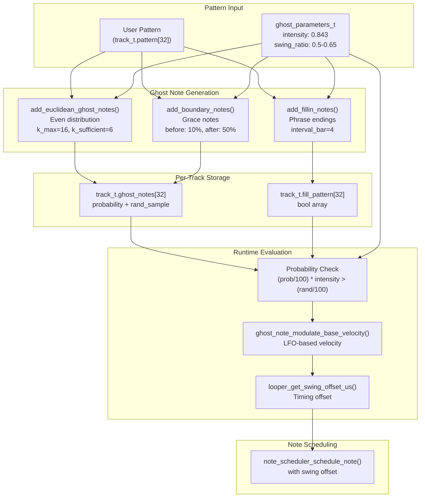
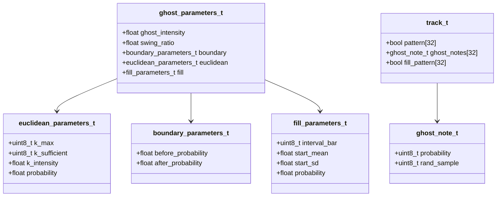
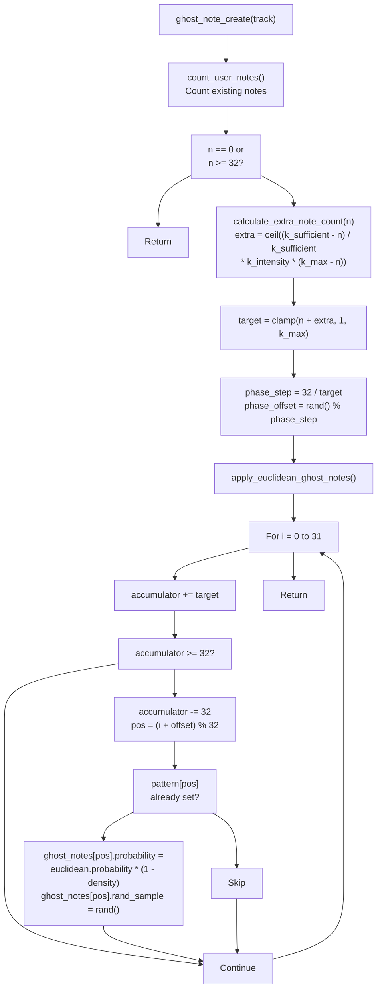
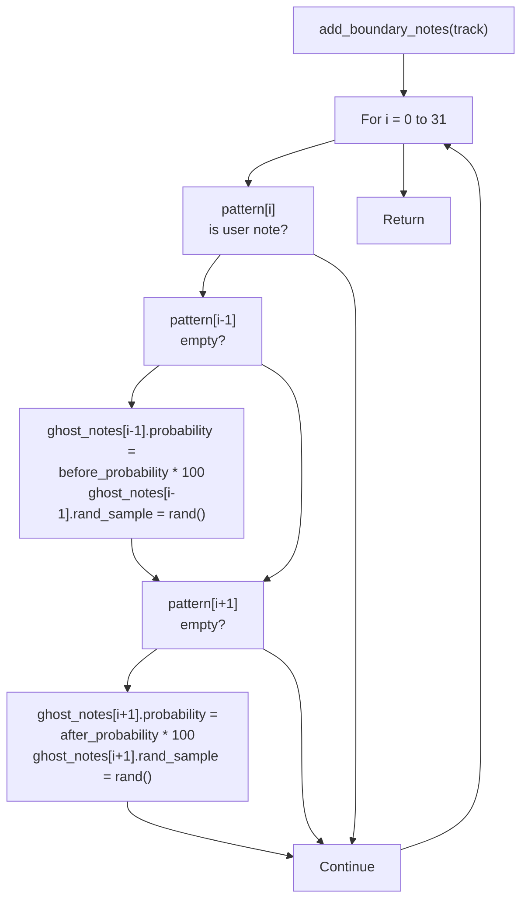
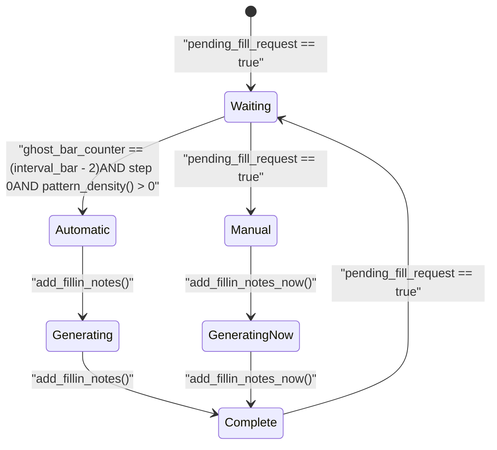
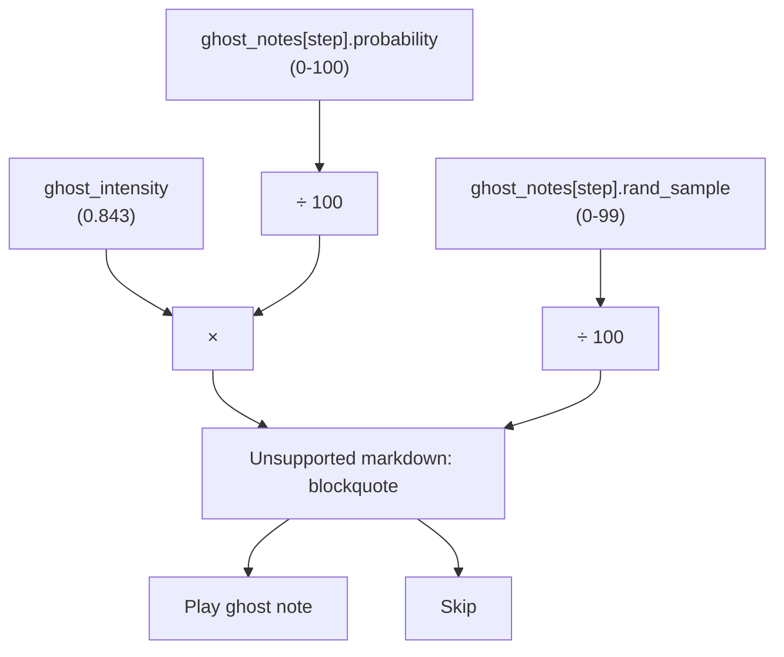

# Ghost Note Generation

> **Relevant source files**
> * [ghost_note.c](https://github.com/Jus-Be/orinayo-pico/blob/6dde5a75/ghost_note.c)
> * [ghost_note.h](https://github.com/Jus-Be/orinayo-pico/blob/6dde5a75/ghost_note.h)
> * [looper.c](https://github.com/Jus-Be/orinayo-pico/blob/6dde5a75/looper.c)
> * [looper.h](https://github.com/Jus-Be/orinayo-pico/blob/6dde5a75/looper.h)
> * [note_scheduler.c](https://github.com/Jus-Be/orinayo-pico/blob/6dde5a75/note_scheduler.c)
> * [note_scheduler.h](https://github.com/Jus-Be/orinayo-pico/blob/6dde5a75/note_scheduler.h)

This page documents the algorithmic note generation system that augments user-recorded drum patterns with additional "ghost" notes. These generated notes add humanization, rhythmic complexity, and dynamic fills to the step sequencer patterns.

For information about the step sequencer itself, see [Step Sequencer](./5.2-step-sequencer.md). For note timing and scheduling, see [Note Scheduler](./5.5-note-scheduler.md). For clock synchronization, see [Clock Synchronization](./5.3-clock-synchronization.md).

## Purpose and Scope

The ghost note generation system provides three distinct algorithms that automatically add MIDI note events to the 32-step looper patterns:

1. **Euclidean Distribution** - Evenly spaces additional notes across empty steps [ghost_note.c L168-L182](https://github.com/Jus-Be/orinayo-pico/blob/6dde5a75/ghost_note.c#L168-L182)
2. **Boundary Notes** - Adds grace notes immediately before/after user notes [ghost_note.c L185-L204](https://github.com/Jus-Be/orinayo-pico/blob/6dde5a75/ghost_note.c#L185-L204)
3. **Fill-in Patterns** - Generates drum fills at phrase endings based on pattern density [ghost_note.c L226-L254](https://github.com/Jus-Be/orinayo-pico/blob/6dde5a75/ghost_note.c#L226-L254)

All generated notes are probabilistic and controlled by a master `ghost_intensity` parameter that acts as a global volume control for algorithmic enhancement [ghost_note.c L21-L27](https://github.com/Jus-Be/orinayo-pico/blob/6dde5a75/ghost_note.c#L21-L27)

 The system operates per-track, allowing different drums to have different ghost note characteristics.

**Sources:** [ghost_note.c L1-L348](https://github.com/Jus-Be/orinayo-pico/blob/6dde5a75/ghost_note.c#L1-L348)

 [ghost_note.h L1-L51](https://github.com/Jus-Be/orinayo-pico/blob/6dde5a75/ghost_note.h#L1-L51)

## System Architecture


```mermaid
flowchart TD

UserPattern["User Pattern<br>(track_t.pattern[32])"]
Params["ghost_parameters_t<br>intensity: 0.843<br>swing_ratio: 0.5-0.65"]
Euclidean["add_euclidean_ghost_notes()<br>Even distribution<br>k_max=16, k_sufficient=6"]
Boundary["add_boundary_notes()<br>Grace notes<br>before: 10%, after: 50%"]
Fillin["add_fillin_notes()<br>Phrase endings<br>interval_bar=4"]
GhostNotes["track_t.ghost_notes[32]<br>probability + rand_sample"]
FillPattern["track_t.fill_pattern[32]<br>bool array"]
ProbCalc["Probability Check<br>(prob/100) * intensity > (rand/100)"]
VelMod["ghost_note_modulate_base_velocity()<br>LFO-based velocity"]
SwingCalc["looper_get_swing_offset_us()<br>Timing offset"]
Scheduler["note_scheduler_schedule_note()<br>with swing offset"]

UserPattern --> Euclidean
UserPattern --> Boundary
UserPattern --> Fillin
Params --> Euclidean
Params --> Boundary
Params --> Fillin
Euclidean --> GhostNotes
Boundary --> GhostNotes
Fillin --> FillPattern
GhostNotes --> ProbCalc
FillPattern --> ProbCalc
Params --> ProbCalc
SwingCalc --> Scheduler

subgraph Output ["Note Scheduling"]
    Scheduler
end

subgraph Evaluation ["Runtime Evaluation"]
    ProbCalc
    VelMod
    SwingCalc
    ProbCalc --> VelMod
    VelMod --> SwingCalc
end

subgraph Storage ["Per-Track Storage"]
    GhostNotes
    FillPattern
end

subgraph Generation ["Ghost Note Generation"]
    Euclidean
    Boundary
    Fillin
end

subgraph Input ["Pattern Input"]
    UserPattern
    Params
end
```

The ghost note system operates in two phases: **generation** (when patterns are created or updated) and **evaluation** (every step during playback). Generation algorithms populate the `ghost_notes` and `fill_pattern` arrays with probability values. During playback, these probabilities are evaluated against the master `ghost_intensity` and a random sample to determine if each ghost note fires.

**Sources:** [ghost_note.c L1-L348](https://github.com/Jus-Be/orinayo-pico/blob/6dde5a75/ghost_note.c#L1-L348)

 [looper.c L162-L194](https://github.com/Jus-Be/orinayo-pico/blob/6dde5a75/looper.c#L162-L194)

## Data Structures

The ghost note system uses several interconnected data structures to store parameters and per-step note information:


```mermaid
classDiagram
    class ghost_parameters_t {
        +float ghost_intensity
        +float swing_ratio
        +boundary_parameters_t boundary
        +euclidean_parameters_t euclidean
        +fill_parameters_t fill
    }
    class euclidean_parameters_t {
        +uint8_t k_max
        +uint8_t k_sufficient
        +float k_intensity
        +float probability
    }
    class boundary_parameters_t {
        +float before_probability
        +float after_probability
    }
    class fill_parameters_t {
        +uint8_t interval_bar
        +float start_mean
        +float start_sd
        +float probability
    }
    class ghost_note_t {
        +uint8_t probability
        +uint8_t rand_sample
    }
    class track_t {
        +bool pattern[32]
        +ghost_note_t ghost_notes[32]
        +bool fill_pattern[32]
    }
    ghost_parameters_t --> euclidean_parameters_t
    ghost_parameters_t --> boundary_parameters_t
    ghost_parameters_t --> fill_parameters_t
    track_t --> ghost_note_t
```

### Parameter Structure

The global parameters are defined as a static variable initialized with default values in `ghost_note.c` [ghost_note.c L21-L27](https://github.com/Jus-Be/orinayo-pico/blob/6dde5a75/ghost_note.c#L21-L27)

:

| Parameter | Default | Range | Purpose |
| --- | --- | --- | --- |
| `ghost_intensity` | 0.843 | 0.0-1.0 | Master probability multiplier for all ghost notes |
| `swing_ratio` | 0.5 | 0.5-0.65 | Timing offset for odd-numbered steps |
| `boundary.before_probability` | 0.10 | 0.0-1.0 | Probability of note before user note |
| `boundary.after_probability` | 0.50 | 0.0-1.0 | Probability of note after user note |
| `euclidean.k_max` | 16 | 1-32 | Maximum total notes (user + ghost) |
| `euclidean.k_sufficient` | 6 | 0-k_max | Threshold below which notes are added |
| `euclidean.k_intensity` | 0.90 | 0.0-1.0 | Aggressiveness of note addition |
| `euclidean.probability` | 0.80 | 0.0-1.0 | Base probability for Euclidean notes |
| `fill.interval_bar` | 4 | 1-16 | Bars between automatic fills |
| `fill.start_mean` | 15.0 | 0.0-32.0 | Mean step for fill start (Gaussian) |
| `fill.start_sd` | 5.0 | 0.0-16.0 | Standard deviation for fill start |
| `fill.probability` | 0.40 | 0.0-1.0 | Probability of each fill note |

### Per-Step Ghost Note Storage

Each track maintains a `ghost_notes[32]` array where each element contains:

* `probability` (0-100): The likelihood this ghost note should fire [looper.h L73](https://github.com/Jus-Be/orinayo-pico/blob/6dde5a75/looper.h#L73-L73)
* `rand_sample` (0-99): A pre-generated random value for evaluation [looper.h L74](https://github.com/Jus-Be/orinayo-pico/blob/6dde5a75/looper.h#L74-L74)

The separation of `probability` and `rand_sample` allows deterministic pattern regeneration while maintaining randomness in note placement.

**Sources:** [ghost_note.h L10-L36](https://github.com/Jus-Be/orinayo-pico/blob/6dde5a75/ghost_note.h#L10-L36)

 [ghost_note.c L21-L27](https://github.com/Jus-Be/orinayo-pico/blob/6dde5a75/ghost_note.c#L21-L27)

 [looper.h L25-L32](https://github.com/Jus-Be/orinayo-pico/blob/6dde5a75/looper.h#L25-L32)

## Euclidean Algorithm

The Euclidean algorithm distributes ghost notes evenly across the 32-step pattern, filling sparse tracks to a target density. It is based on Bresenham's line algorithm, commonly used for Euclidean rhythms in music.

### Algorithm Flow


```mermaid
flowchart TD

Start["ghost_note_create(track)"]
Count["count_user_notes()<br>Count existing notes"]
CheckEmpty["n == 0 or<br>n >= 32?"]
Exit1["Return"]
CalcExtra["calculate_extra_note_count(n)<br>extra = ceil((k_sufficient - n) / k_sufficient<br>* k_intensity * (k_max - n))"]
ClampTarget["target = clamp(n + extra, 1, k_max)"]
CalcPhase["phase_step = 32 / target<br>phase_offset = rand() % phase_step"]
Apply["apply_euclidean_ghost_notes()"]
Loop["For i = 0 to 31"]
Accumulate["accumulator += target"]
CheckAccum["accumulator >= 32?"]
SubAccum["accumulator -= 32<br>pos = (i + offset) % 32"]
CheckEmpty2["pattern[pos]<br>already set?"]
SetGhost["ghost_notes[pos].probability =<br>euclidean.probability * (1 - density)<br>ghost_notes[pos].rand_sample = rand()"]
Skip["Skip"]
Next["Continue"]
Exit2["Return"]

Start --> Count
Count --> CheckEmpty
CheckEmpty --> Exit1
CheckEmpty --> CalcExtra
CalcExtra --> ClampTarget
ClampTarget --> CalcPhase
CalcPhase --> Apply
Apply --> Loop
Loop --> Accumulate
Accumulate --> CheckAccum
CheckAccum --> SubAccum
SubAccum --> CheckEmpty2
CheckEmpty2 --> SetGhost
CheckEmpty2 --> Skip
CheckAccum --> Next
SetGhost --> Next
Skip --> Next
Next --> Loop
Loop --> Exit2
```

### Implementation Details

The function `add_euclidean_ghost_notes()` [ghost_note.c L168-L182](https://github.com/Jus-Be/orinayo-pico/blob/6dde5a75/ghost_note.c#L168-L182)

 implements this algorithm:

1. **Count Existing Notes**: Determine how many user notes exist via `count_user_notes()` [ghost_note.c L125-L132](https://github.com/Jus-Be/orinayo-pico/blob/6dde5a75/ghost_note.c#L125-L132)
2. **Calculate Target Density**: Based on `k_sufficient` threshold.
3. **Compute Extra Notes**: Use the formula in `calculate_extra_note_count()` [ghost_note.c L135-L143](https://github.com/Jus-Be/orinayo-pico/blob/6dde5a75/ghost_note.c#L135-L143)
4. **Apply Bresenham Accumulator**: Distribute `target` notes evenly across 32 steps in `apply_euclidean_ghost_notes()` [ghost_note.c L146-L165](https://github.com/Jus-Be/orinayo-pico/blob/6dde5a75/ghost_note.c#L146-L165)
5. **Set Probabilities**: Each candidate position gets a probability adjusted by pattern density.

The algorithm ensures that:

* Sparse patterns (< 6 notes) receive more ghost notes.
* Dense patterns (≥ 6 notes) receive few or no ghost notes.
* Ghost notes avoid steps where user notes already exist.
* Probability decreases as pattern density increases: `probability * (1.0 - density)` [ghost_note.c L158-L159](https://github.com/Jus-Be/orinayo-pico/blob/6dde5a75/ghost_note.c#L158-L159)

**Sources:** [ghost_note.c L124-L182](https://github.com/Jus-Be/orinayo-pico/blob/6dde5a75/ghost_note.c#L124-L182)

## Boundary Notes

Boundary notes add grace notes immediately adjacent to user-recorded notes, creating leading and trailing embellishments. This algorithm operates independently from Euclidean distribution.

### Algorithm Logic


```mermaid
flowchart TD

Start["add_boundary_notes(track)"]
Loop["For i = 0 to 31"]
CheckUser["pattern[i]<br>is user note?"]
CheckBefore["pattern[i-1]<br>empty?"]
SetBefore["ghost_notes[i-1].probability =<br>before_probability * 100<br>ghost_notes[i-1].rand_sample = rand()"]
CheckAfter["pattern[i+1]<br>empty?"]
SetAfter["ghost_notes[i+1].probability =<br>after_probability * 100<br>ghost_notes[i+1].rand_sample = rand()"]
Next["Continue"]
Done["Return"]

Start --> Loop
Loop --> CheckUser
CheckUser --> CheckBefore
CheckBefore --> SetBefore
CheckBefore --> CheckAfter
SetBefore --> CheckAfter
CheckAfter --> SetAfter
CheckAfter --> Next
CheckUser --> Next
SetAfter --> Next
Next --> Loop
Loop --> Done
```

### Implementation

The `add_boundary_notes()` function [ghost_note.c L185-L204](https://github.com/Jus-Be/orinayo-pico/blob/6dde5a75/ghost_note.c#L185-L204)

 scans each user note and attempts to place ghost notes at positions `i-1` and `i+1` (with wraparound for step 0 and 31):

* **Before Note** (10% probability): Creates an anticipation or pickup [ghost_note.c L192-L195](https://github.com/Jus-Be/orinayo-pico/blob/6dde5a75/ghost_note.c#L192-L195)
* **After Note** (50% probability): Creates a trailing grace note or flam [ghost_note.c L199-L201](https://github.com/Jus-Be/orinayo-pico/blob/6dde5a75/ghost_note.c#L199-L201)

The function only sets boundary notes if:

1. A user note exists at position `i`.
2. The adjacent position has no user note.
3. The adjacent position has no existing ghost note (`rand_sample == 0`).

This prevents overwriting Euclidean ghost notes and avoids double-triggering on consecutive user notes.

**Sources:** [ghost_note.c L185-L204](https://github.com/Jus-Be/orinayo-pico/blob/6dde5a75/ghost_note.c#L185-L204)

## Fill-in Patterns

Fill-in patterns generate drum fills at the end of musical phrases, typically on tracks 0 (kick) and 1 (snare). Unlike Euclidean and boundary notes, fills are stored in a separate `fill_pattern[32]` boolean array.

### Trigger Conditions


```mermaid
stateDiagram-v2
    [*] --> Waiting : "pending_fill_request == true"
    Waiting --> Automatic : "ghost_bar_counter == (interval_bar - 2)AND step 0AND pattern_density() > 0"
    Waiting --> Manual : "pending_fill_request == true"
    Automatic --> Generating : "add_fillin_notes()"
    Manual --> GeneratingNow : "add_fillin_notes_now()"
    Generating --> Complete : "add_fillin_notes()"
    GeneratingNow --> Complete : "add_fillin_notes_now()"
    Complete --> Waiting : "pending_fill_request == true"
```

Fills are triggered in two ways:

1. **Automatic**: Every N bars (default: 4), starting 2 bars before the cycle completes [ghost_note.c L337-L340](https://github.com/Jus-Be/orinayo-pico/blob/6dde5a75/ghost_note.c#L337-L340)
2. **Manual**: When `ghost_note_set_pending_fill_request()` is called (e.g., user button press during external clock sync) [ghost_note.h L50](https://github.com/Jus-Be/orinayo-pico/blob/6dde5a75/ghost_note.h#L50-L50)

### Fill Generation Algorithm

The fill generation process [ghost_note.c L226-L254](https://github.com/Jus-Be/orinayo-pico/blob/6dde5a75/ghost_note.c#L226-L254)

 involves several steps:

1. **Calculate Fill Start Position**: Use a Gaussian distribution centered at step 15 via `rand_normal()` [ghost_note.c L111-L114](https://github.com/Jus-Be/orinayo-pico/blob/6dde5a75/ghost_note.c#L111-L114) : `fill_start = 32 - abs(rand_normal(start_mean, start_sd))` [ghost_note.c L230](https://github.com/Jus-Be/orinayo-pico/blob/6dde5a75/ghost_note.c#L230-L230) This creates fills that typically start 3/4 through the pattern.
2. **Compute Density Window**: For each position, calculate local note density in a ±8 step window via `track_window_density()` [ghost_note.c L206-L213](https://github.com/Jus-Be/orinayo-pico/blob/6dde5a75/ghost_note.c#L206-L213)
3. **Set Fill Probabilities**: For tracks 0 and 1, from `fill_start` to step 31: * If no existing ghost note, set probability based on inverse density: `(1.0 - density) * 0.25` [ghost_note.c L242](https://github.com/Jus-Be/orinayo-pico/blob/6dde5a75/ghost_note.c#L242-L242) * If ghost note probability exceeds threshold, set `fill_pattern[i] = true` with fill probability [ghost_note.c L247-L249](https://github.com/Jus-Be/orinayo-pico/blob/6dde5a75/ghost_note.c#L247-L249)
4. **Density-Based Placement**: Fills are placed in sparse regions, avoiding dense areas.

**Sources:** [ghost_note.c L206-L254](https://github.com/Jus-Be/orinayo-pico/blob/6dde5a75/ghost_note.c#L206-L254)

 [ghost_note.c L286-L295](https://github.com/Jus-Be/orinayo-pico/blob/6dde5a75/ghost_note.c#L286-L295)

## Probability Evaluation System

Ghost notes are evaluated during playback using a two-stage probability system that compares stored probability values against the master `ghost_intensity` parameter.

### Evaluation Formula


```mermaid
flowchart TD

Stored["ghost_notes[step].probability<br>(0-100)"]
Normalize1["÷ 100"]
Intensity["ghost_intensity<br>(0.843)"]
Multiply["×"]
RandSample["ghost_notes[step].rand_sample<br>(0-99)"]
Normalize2["÷ 100"]
Compare["Unsupported markdown: blockquote"]
Play["Play ghost note"]
Skip["Skip"]

Stored --> Normalize1
Intensity --> Multiply
Normalize1 --> Multiply
RandSample --> Normalize2
Multiply --> Compare
Normalize2 --> Compare
Compare --> Play
Compare --> Skip
```

The evaluation occurs in `looper_perform_step()` [looper.c L162-L194](https://github.com/Jus-Be/orinayo-pico/blob/6dde5a75/looper.c#L162-L194)

:

```
bool ghost_note_on = ((float)tracks[i].ghost_notes[looper_status.current_step].probability / 100.0f) *                       params->ghost_intensity >                       (float)tracks[i].ghost_notes[looper_status.current_step].rand_sample / 100.0f;
```

This formula allows the master `ghost_intensity` to act as a volume control:

* `ghost_intensity = 1.0`: All ghost notes with probability > rand_sample play.
* `ghost_intensity = 0.5`: Only ghost notes with 2× probability > rand_sample play.
* `ghost_intensity = 0.0`: No ghost notes play.

### Fill Pattern Evaluation

Fill patterns use a simpler boolean evaluation [looper.h L76](https://github.com/Jus-Be/orinayo-pico/blob/6dde5a75/looper.h#L76-L76)

:

```
if (tracks[i].fill_pattern[looper_status.current_step] && !note_on)    note_scheduler_schedule_note(now + swing_offset_us, tracks[i].channel, tracks[i].note, 0x7f);
```

Fills always play at maximum velocity (0x7f) and only fire if no user note exists at that step.

**Sources:** [looper.c L162-L194](https://github.com/Jus-Be/orinayo-pico/blob/6dde5a75/looper.c#L162-L194)

## Velocity Modulation

Ghost notes use per-track velocity values defined in `velocity_table` [ghost_note.c L31-L46](https://github.com/Jus-Be/orinayo-pico/blob/6dde5a75/ghost_note.c#L31-L46)

 with additional LFO-based modulation for specific tracks.

### Velocity Table

| Track | Drum | Base Velocity | Notes |
| --- | --- | --- | --- |
| 0 | Bass Drum | 0x20 (32) | LFO modulated |
| 1 | Snare | 0x25 (37) | - |
| 2 | Closed Hi-hat | 0x30 (48) | LFO modulated |
| 3-4 | Toms | 0x20 (32) | - |
| 5 | Open Hi-hat | 0x30 (48) | - |
| 6-13 | Various percussion | 0x20-0x25 | - |

### LFO-Based Modulation

The `ghost_note_modulate_base_velocity()` function [ghost_note.c L56-L67](https://github.com/Jus-Be/orinayo-pico/blob/6dde5a75/ghost_note.c#L56-L67)

 applies sinusoidal modulation to track 0 (kick) and track 2 (hi-hat):

**Kick Drum (Track 0)**:
`phase = (lfo * 1.25 / 65536.0f) * 2.0f * M_PI` [ghost_note.c L58](https://github.com/Jus-Be/orinayo-pico/blob/6dde5a75/ghost_note.c#L58-L58)

`velocity = KICK_VEL_BASE + (int)(sinf(phase) * KICK_VEL_DEPTH)` [ghost_note.c L60](https://github.com/Jus-Be/orinayo-pico/blob/6dde5a75/ghost_note.c#L60-L60)

Range: 75-125 (approx)

**Closed Hi-hat (Track 2)**:
`hh_phase = (uint32_t)lfo * HH_FREQ_RATIO` [ghost_note.c L62](https://github.com/Jus-Be/orinayo-pico/blob/6dde5a75/ghost_note.c#L62-L62)

`velocity = HH_VEL_BASE + (int)(sinf(hh_phase_scaled) * HH_VEL_DEPTH)` [ghost_note.c L64](https://github.com/Jus-Be/orinayo-pico/blob/6dde5a75/ghost_note.c#L64-L64)

Range: 87-127 (approx)

**Sources:** [ghost_note.c L31-L67](https://github.com/Jus-Be/orinayo-pico/blob/6dde5a75/ghost_note.c#L31-L67)

 [looper.c L171-L173](https://github.com/Jus-Be/orinayo-pico/blob/6dde5a75/looper.c#L171-L173)

## Swing Timing

Ghost notes participate in the swing timing system, which delays odd-numbered steps to create a "shuffle" feel.

### Swing Offset Calculation

The `looper_get_swing_offset_us()` function [looper.c L148-L158](https://github.com/Jus-Be/orinayo-pico/blob/6dde5a75/looper.c#L148-L158)

 computes timing offsets for odd steps:

1. Calculate the duration of a 2-step pair (8th note): `pair_length = looper_status.step_period_ms * 2.0f` [looper.c L151](https://github.com/Jus-Be/orinayo-pico/blob/6dde5a75/looper.c#L151-L151)
2. Compute offset as the excess beyond 50%: `offset_ms = pair_length * (swing_ratio - 0.5f)` [looper.c L154](https://github.com/Jus-Be/orinayo-pico/blob/6dde5a75/looper.c#L154-L154)
3. Convert to microseconds for scheduling.

### Dynamic Swing Modulation

The `ghost_note_modulate_swing_ratio()` function [ghost_note.c L69-L88](https://github.com/Jus-Be/orinayo-pico/blob/6dde5a75/ghost_note.c#L69-L88)

 dynamically adjusts swing based on `ghost_intensity`:

* `ghost_intensity < 0.5`: No swing (0.5) [ghost_note.c L72-L73](https://github.com/Jus-Be/orinayo-pico/blob/6dde5a75/ghost_note.c#L72-L73)
* `ghost_intensity >= 0.5`: Progressive swing from 0.5 to 0.65 using `powf(t, 7.0f)` [ghost_note.c L76](https://github.com/Jus-Be/orinayo-pico/blob/6dde5a75/ghost_note.c#L76-L76)
* Adds subtle LFO modulation: `sinf(phase + M_PI_2) * 0.01f` [ghost_note.c L79](https://github.com/Jus-Be/orinayo-pico/blob/6dde5a75/ghost_note.c#L79-L79)

**Sources:** [ghost_note.c L69-L88](https://github.com/Jus-Be/orinayo-pico/blob/6dde5a75/ghost_note.c#L69-L88)

 [looper.c L148-L158](https://github.com/Jus-Be/orinayo-pico/blob/6dde5a75/looper.c#L148-L158)

## Maintenance and Lifecycle

The ghost note system integrates with the looper through the `ghost_note_maintenance_step()` function [ghost_note.c L319-L348](https://github.com/Jus-Be/orinayo-pico/blob/6dde5a75/ghost_note.c#L319-L348)

 called every step during playback.

### Maintenance Cycle

1. **Bar Counter**: Increments at step 0 [ghost_note.c L321-L323](https://github.com/Jus-Be/orinayo-pico/blob/6dde5a75/ghost_note.c#L321-L323)
2. **Clear Fills**: `fill_pattern` arrays are cleared at the start of every bar [ghost_note.c L326-L330](https://github.com/Jus-Be/orinayo-pico/blob/6dde5a75/ghost_note.c#L326-L330)
3. **Creation Bar**: Every `interval_bar` bars, Euclidean and boundary notes are regenerated via `ghost_note_create()` [ghost_note.c L332-L335](https://github.com/Jus-Be/orinayo-pico/blob/6dde5a75/ghost_note.c#L332-L335)
4. **Fill Bar**: Automatic fills are generated 2 bars before the end of the cycle [ghost_note.c L337-L340](https://github.com/Jus-Be/orinayo-pico/blob/6dde5a75/ghost_note.c#L337-L340)
5. **Manual Fills**: Processes `pending_fill_request` immediately [ghost_note.c L343-L345](https://github.com/Jus-Be/orinayo-pico/blob/6dde5a75/ghost_note.c#L343-L345)

**Sources:** [ghost_note.c L319-L348](https://github.com/Jus-Be/orinayo-pico/blob/6dde5a75/ghost_note.c#L319-L348)

 [looper.c L343](https://github.com/Jus-Be/orinayo-pico/blob/6dde5a75/looper.c#L343-L343)

## Integration with Note Scheduler

Ghost notes use the `note_scheduler_schedule_note()` function [note_scheduler.c L69-L84](https://github.com/Jus-Be/orinayo-pico/blob/6dde5a75/note_scheduler.c#L69-L84)

 to ensure microsecond-precision timing.

1. **Calculation**: `looper_perform_step()` calculates the target time `now + swing_offset_us` [looper.c L165-L166](https://github.com/Jus-Be/orinayo-pico/blob/6dde5a75/looper.c#L165-L166)
2. **Scheduling**: Notes are added to `scheduled_slots` [note_scheduler.c L75-L77](https://github.com/Jus-Be/orinayo-pico/blob/6dde5a75/note_scheduler.c#L75-L77)
3. **Async Worker**: `note_worker_enqueue_pending()` is triggered by the `async_context` at the exact time [note_scheduler.c L48-L63](https://github.com/Jus-Be/orinayo-pico/blob/6dde5a75/note_scheduler.c#L48-L63)
4. **Dispatch**: The main loop calls `note_scheduler_dispatch_pending()` to send the MIDI data safely [note_scheduler.c L87-L99](https://github.com/Jus-Be/orinayo-pico/blob/6dde5a75/note_scheduler.c#L87-L99)

**Sources:** [looper.c L162-L194](https://github.com/Jus-Be/orinayo-pico/blob/6dde5a75/looper.c#L162-L194)

 [note_scheduler.c L1-L99](https://github.com/Jus-Be/orinayo-pico/blob/6dde5a75/note_scheduler.c#L1-L99)