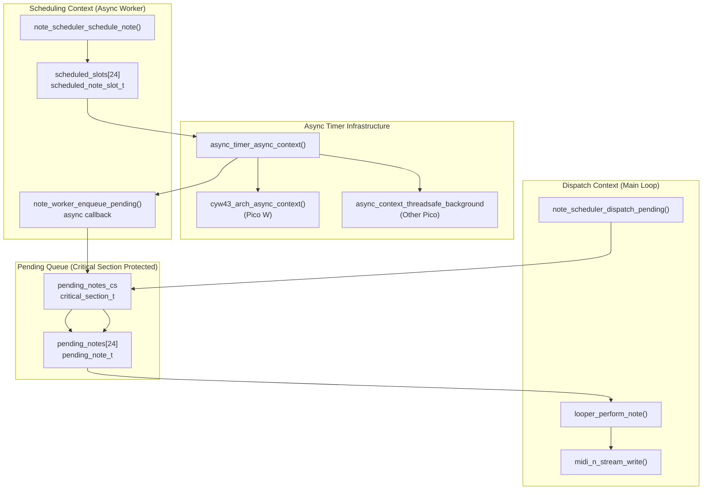
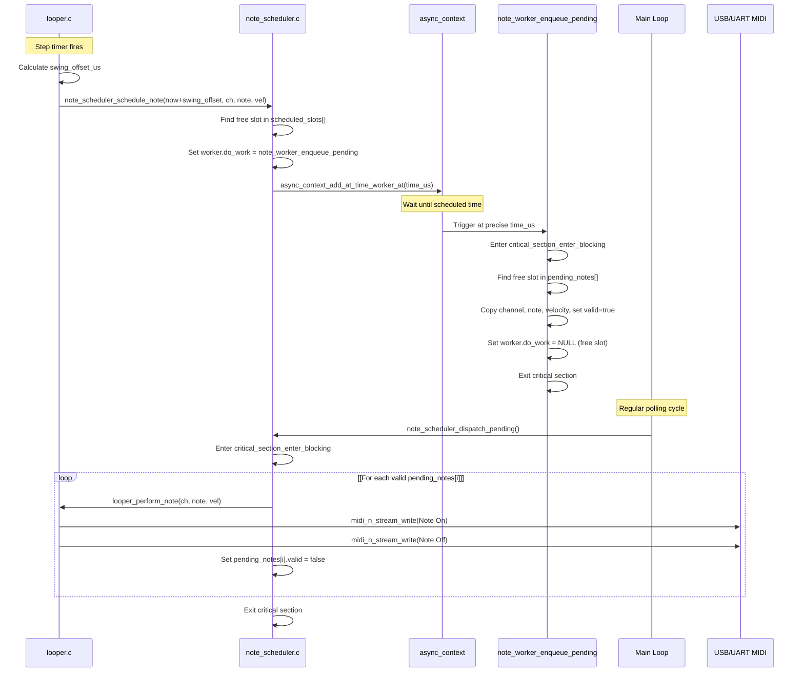
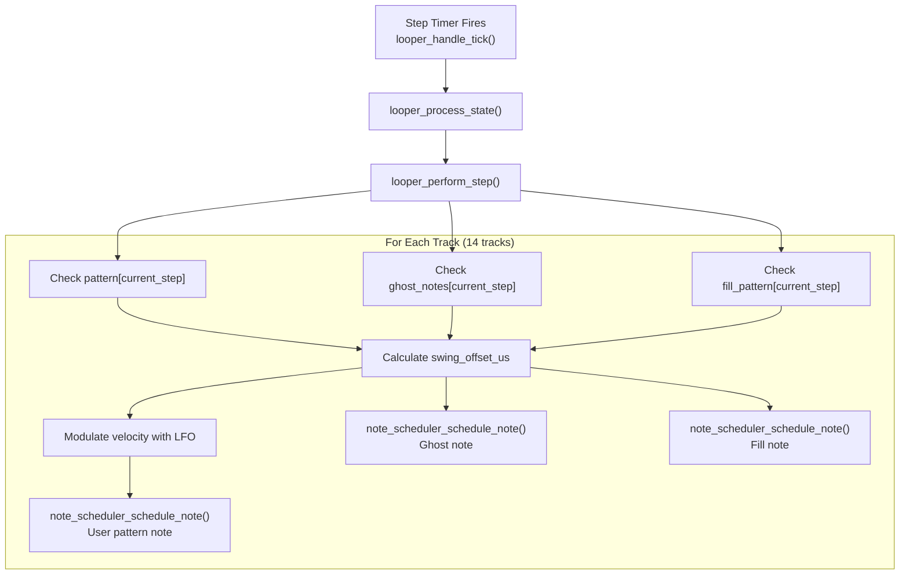
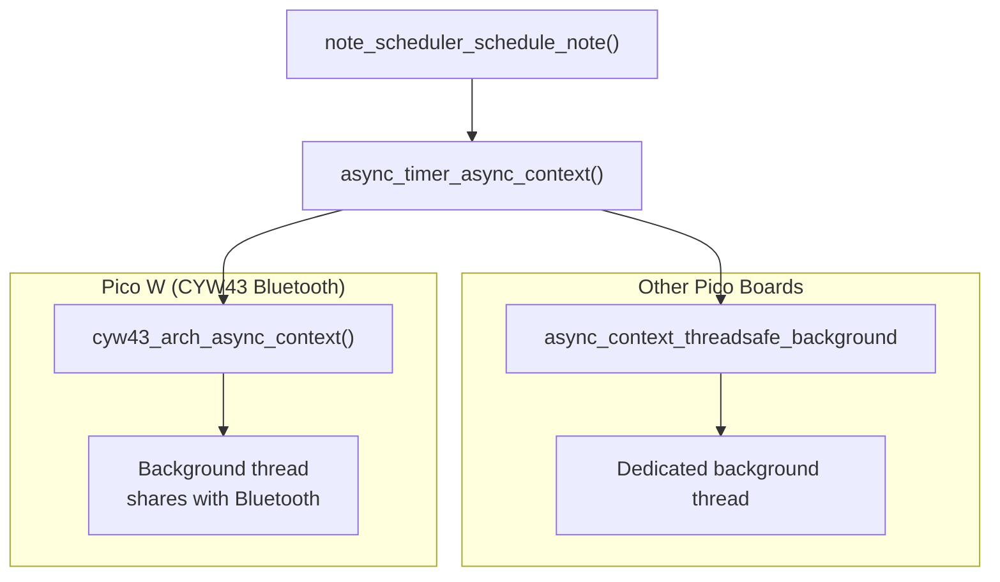

# Note Scheduler

> **Relevant source files**
> * [async_timer.c](https://github.com/Jus-Be/orinayo-pico/blob/122fa496/async_timer.c)
> * [async_timer.h](https://github.com/Jus-Be/orinayo-pico/blob/122fa496/async_timer.h)
> * [ghost_note.c](https://github.com/Jus-Be/orinayo-pico/blob/122fa496/ghost_note.c)
> * [ghost_note.h](https://github.com/Jus-Be/orinayo-pico/blob/122fa496/ghost_note.h)
> * [looper.c](https://github.com/Jus-Be/orinayo-pico/blob/122fa496/looper.c)
> * [note_scheduler.c](https://github.com/Jus-Be/orinayo-pico/blob/122fa496/note_scheduler.c)
> * [note_scheduler.h](https://github.com/Jus-Be/orinayo-pico/blob/122fa496/note_scheduler.h)

The Note Scheduler provides microsecond-precision timing for MIDI note events in the Orinayo system. It implements a two-stage architecture that schedules notes in asynchronous context but dispatches them from the main application loop, avoiding USB mutex contention while maintaining precise timing.

For information about the looper's step sequencer timing, see [Step Sequencer](./5.2-step-sequencer.md). For details on clock synchronization, see [Clock Synchronization](./5.3-clock-synchronization.md). For the ghost note generation algorithms that use this scheduler, see [Ghost Note Generation](./5.4-ghost-note-generation.md).

**Sources:** [note_scheduler.c L1-L14](https://github.com/Jus-Be/orinayo-pico/blob/122fa496/note_scheduler.c#L1-L14)

---

## Purpose and Design Rationale

The Note Scheduler solves a critical timing problem in the Orinayo architecture. MIDI notes must be triggered with microsecond precision to implement musical features like swing timing, but USB MIDI transmission requires mutex locks that cannot be safely acquired from interrupt or async worker contexts. The scheduler bridges this gap by using a two-stage approach:

1. **Schedule Stage**: Notes are scheduled at precise absolute timestamps using the Pico SDK's `async_context` timer mechanism
2. **Dispatch Stage**: When the scheduled time arrives, notes are marked as "pending" and dispatched from the main application loop where USB access is safe

This design is explicitly documented in the source code as avoiding USB mutex contention while ensuring timing consistency without hardware interrupts.

**Sources:** [note_scheduler.c L1-L14](https://github.com/Jus-Be/orinayo-pico/blob/122fa496/note_scheduler.c#L1-L14)

 [looper.c L114-L134](https://github.com/Jus-Be/orinayo-pico/blob/122fa496/looper.c#L114-L134)

---

## System Architecture



**Architecture Overview**

The scheduler maintains two separate data structures:

* `scheduled_slots[24]`: Async worker slots that wait for their scheduled time
* `pending_notes[24]`: FIFO queue of notes ready to be dispatched

The `pending_notes_cs` critical section protects the pending queue from concurrent access between async workers and the main loop.

**Sources:** [note_scheduler.c L21-L39](https://github.com/Jus-Be/orinayo-pico/blob/122fa496/note_scheduler.c#L21-L39)

 [async_timer.c L1-L34](https://github.com/Jus-Be/orinayo-pico/blob/122fa496/async_timer.c#L1-L34)

---

## Data Structures

### pending_note_t

Represents a single MIDI note event ready to be dispatched.

| Field | Type | Purpose |
| --- | --- | --- |
| `channel` | `uint8_t` | MIDI channel (0-15) |
| `note` | `uint8_t` | MIDI note number (0-127) |
| `velocity` | `uint8_t` | MIDI velocity (0-127) |
| `valid` | `bool` | Whether this slot contains a pending note |

**Sources:** [note_scheduler.c L23-L29](https://github.com/Jus-Be/orinayo-pico/blob/122fa496/note_scheduler.c#L23-L29)

### scheduled_note_slot_t

Combines an async worker with note parameters for scheduled execution.

| Field | Type | Purpose |
| --- | --- | --- |
| `worker` | `async_at_time_worker_t` | Pico SDK async worker structure |
| `pending` | `pending_note_t` | Note parameters to enqueue when triggered |

The `worker.do_work` function pointer is set to `note_worker_enqueue_pending` when a slot is in use, and `NULL` when the slot is free. This provides a simple allocation mechanism without requiring additional state tracking.

**Sources:** [note_scheduler.c L31-L35](https://github.com/Jus-Be/orinayo-pico/blob/122fa496/note_scheduler.c#L31-L35)

### Module-Level State

```
static scheduled_note_slot_t scheduled_slots[MAX_SCHEDULED_NOTES];
static pending_note_t pending_notes[MAX_SCHEDULED_NOTES];
static critical_section_t pending_notes_cs;
```

* `MAX_SCHEDULED_NOTES` is set to 24, allowing up to 24 notes to be scheduled simultaneously
* The critical section protects `pending_notes[]` from race conditions
* Both arrays use simple linear search for allocation

**Sources:** [note_scheduler.c L21-L39](https://github.com/Jus-Be/orinayo-pico/blob/122fa496/note_scheduler.c#L21-L39)

---

## Scheduling Pipeline



**Pipeline Stages**

1. **Schedule Request**: Looper calculates target timestamp (current time + swing offset) and calls `note_scheduler_schedule_note()`
2. **Slot Allocation**: Scheduler finds a free slot in `scheduled_slots[]` (identified by `worker.do_work == NULL`)
3. **Async Registration**: Slot's worker is registered with `async_context` at the absolute timestamp
4. **Async Callback**: When time arrives, `note_worker_enqueue_pending()` moves the note to `pending_notes[]` under critical section
5. **Main Loop Dispatch**: `note_scheduler_dispatch_pending()` processes all valid pending notes safely in main loop context
6. **MIDI Transmission**: Each note is sent via `looper_perform_note()` → `midi_n_stream_write()`

**Sources:** [note_scheduler.c L48-L99](https://github.com/Jus-Be/orinayo-pico/blob/122fa496/note_scheduler.c#L48-L99)

 [looper.c L162-L194](https://github.com/Jus-Be/orinayo-pico/blob/122fa496/looper.c#L162-L194)

---

## API Reference

### note_scheduler_init()

```
void note_scheduler_init(void)
```

Initializes the note scheduler's critical section. Must be called once during system initialization before any scheduling operations.

**Implementation:**

```
critical_section_init(&pending_notes_cs);
```

**Sources:** [note_scheduler.c L42](https://github.com/Jus-Be/orinayo-pico/blob/122fa496/note_scheduler.c#L42-L42)

---

### note_scheduler_schedule_note()

```
bool note_scheduler_schedule_note(uint64_t time_us, uint8_t channel, 
                                   uint8_t note, uint8_t velocity)
```

Schedules a MIDI note to be triggered at a specific absolute timestamp.

**Parameters:**

| Parameter | Type | Description |
| --- | --- | --- |
| `time_us` | `uint64_t` | Absolute timestamp in microseconds (from `time_us_64()`) |
| `channel` | `uint8_t` | MIDI channel (0-15) |
| `note` | `uint8_t` | MIDI note number (0-127) |
| `velocity` | `uint8_t` | MIDI velocity (0-127) |

**Returns:** `true` if scheduled successfully, `false` if all 24 slots are in use

**Implementation Details:**

1. Converts `time_us` to `absolute_time_t` using `to_us_since_boot()`
2. Searches `scheduled_slots[]` for a free slot (`worker.do_work == NULL`)
3. Initializes the slot with note parameters and sets `worker.do_work = note_worker_enqueue_pending`
4. Registers the worker with `async_context_add_at_time_worker_at()`

**Usage Example from looper.c:**

```
uint64_t now = time_us_64();
uint64_t swing_offset_us = looper_get_swing_offset_us(step);
note_scheduler_schedule_note(now + swing_offset_us, channel, note, velocity);
```

**Sources:** [note_scheduler.c L69-L84](https://github.com/Jus-Be/orinayo-pico/blob/122fa496/note_scheduler.c#L69-L84)

 [looper.c L172-L173](https://github.com/Jus-Be/orinayo-pico/blob/122fa496/looper.c#L172-L173)

---

### note_scheduler_dispatch_pending()

```
void note_scheduler_dispatch_pending(void)
```

Processes all pending scheduled notes from the main application loop. This function is safe to call from USB context as it performs the actual MIDI transmission.

**Implementation:**

1. Enters critical section to protect `pending_notes[]`
2. Iterates through all slots in `pending_notes[]`
3. For each valid note, calls `looper_perform_note(channel, note, velocity)`
4. Clears the `valid` flag to free the slot
5. Exits critical section

This function must be called regularly from the main loop to ensure timely dispatch of scheduled notes. In the Orinayo system, it is called from the main event loop polling cycle.

**Sources:** [note_scheduler.c L87-L99](https://github.com/Jus-Be/orinayo-pico/blob/122fa496/note_scheduler.c#L87-L99)

---

## Integration with Musical Processing

### Swing Timing

The Note Scheduler is essential for implementing swing timing in the looper. Swing shifts the timing of odd-numbered 16th notes to create a "shuffle" feel.

```
static uint64_t looper_get_swing_offset_us(uint8_t step_index) {
    ghost_parameters_t *params = ghost_note_parameters();
    float swing_ratio = params->swing_ratio;
    float pair_length = looper_status.step_period_ms * 2.0f;
    
    if (step_index % 2 == 1) {
        float offset_ms = pair_length * (swing_ratio - 0.5f);
        return (uint64_t)(offset_ms * 1000.0f);  // ms → us
    }
    return 0;
}
```

**Swing Calculation:**

* Even steps (0, 2, 4, ...) have zero offset (play on the grid)
* Odd steps (1, 3, 5, ...) are delayed by `pair_length × (swing_ratio - 0.5)`
* `swing_ratio` ranges from 0.5 (straight) to 0.65 (heavy swing)
* At ratio 0.5: offset = 0 (straight 16ths)
* At ratio 0.6: odd notes play 20% later in their pair
* At ratio 0.65: odd notes play 30% later (maximum swing)

The swing ratio itself is dynamically modulated by the LFO, as documented in [Ghost Note Generation](./5.4-ghost-note-generation.md).

**Sources:** [looper.c L148-L158](https://github.com/Jus-Be/orinayo-pico/blob/122fa496/looper.c#L148-L158)

 [ghost_note.c L69-L88](https://github.com/Jus-Be/orinayo-pico/blob/122fa496/ghost_note.c#L69-L88)

---

### Track Performance Flow



**Performance Logic:**

The `looper_perform_step()` function processes the current sequencer step by checking three types of notes for each of the 14 drum tracks:

1. **User Pattern Notes** (`pattern[step]`): Notes recorded by the user
2. **Ghost Notes** (`ghost_notes[step]`): Algorithmically generated notes with probability-based triggering
3. **Fill Pattern Notes** (`fill_pattern[step]`): Fill-in notes at phrase endings

Each note type that triggers schedules its MIDI note with the same swing offset, ensuring consistent timing across all note sources.

**Sources:** [looper.c L162-L194](https://github.com/Jus-Be/orinayo-pico/blob/122fa496/looper.c#L162-L194)

---

### Velocity Modulation

The scheduler works in conjunction with the ghost note system to implement dynamic velocity modulation via LFO:

| Track | Modulation | Formula |
| --- | --- | --- |
| Track 0 (Kick) | Sine wave × 1.25 | `base=100, depth=25` |
| Track 2 (Hi-hat) | Sine wave × 2 | `base=107, depth=20` |
| Others | No modulation | Default velocity |

The LFO phase counter (`looper_status.lfo_phase`) increments each step and wraps at 65536, creating continuous velocity variation synchronized to the tempo.

**Sources:** [ghost_note.c L56-L67](https://github.com/Jus-Be/orinayo-pico/blob/122fa496/ghost_note.c#L56-L67)

 [looper.c L171](https://github.com/Jus-Be/orinayo-pico/blob/122fa496/looper.c#L171-L171)

---

## Timing Precision

### Microsecond Resolution

The scheduler uses 64-bit microsecond timestamps throughout:

```
uint64_t now = time_us_64();                    // Current time
uint64_t swing_offset_us = looper_get_swing_offset_us(step);
absolute_time_t note_at = to_us_since_boot(now + swing_offset_us);
```

This provides:

* **Resolution**: 1 microsecond (0.001 milliseconds)
* **Range**: ~584,000 years before overflow
* **Accuracy**: Limited by Pico's crystal oscillator and async_context scheduling jitter

**Sources:** [note_scheduler.c L71](https://github.com/Jus-Be/orinayo-pico/blob/122fa496/note_scheduler.c#L71-L71)

 [looper.c L165-L166](https://github.com/Jus-Be/orinayo-pico/blob/122fa496/looper.c#L165-L166)

---

### Async Context Backend

The scheduler relies on the async timer infrastructure, which adapts to the hardware:



**Platform-Specific Behavior:**

* **Pico W with CYW43 Bluetooth**: Uses the same async context as the Bluetooth stack, ensuring efficient resource sharing
* **Other Pico boards**: Creates a dedicated threadsafe background context

Both backends provide the same API and timing guarantees, making the scheduler portable across Pico variants.

**Sources:** [async_timer.c L8-L33](https://github.com/Jus-Be/orinayo-pico/blob/122fa496/async_timer.c#L8-L33)

---

## Thread Safety

### Critical Section Protection

The `pending_notes[]` array is protected by a critical section to prevent race conditions:

```
critical_section_enter_blocking(&pending_notes_cs);
// ... access pending_notes[] ...
critical_section_exit(&pending_notes_cs);
```

**Critical Section Usage:**

| Location | Purpose | Duration |
| --- | --- | --- |
| `note_worker_enqueue_pending()` | Add note to pending queue | ~10 instructions |
| `note_scheduler_dispatch_pending()` | Read and clear all pending notes | ~100 instructions + USB transmission |

The critical sections are intentionally short to minimize blocking. The async worker only writes to the queue, while the main loop only reads and clears.

**Sources:** [note_scheduler.c L52-L62](https://github.com/Jus-Be/orinayo-pico/blob/122fa496/note_scheduler.c#L52-L62)

 [note_scheduler.c L88-L98](https://github.com/Jus-Be/orinayo-pico/blob/122fa496/note_scheduler.c#L88-L98)

---

### USB Mutex Avoidance

The scheduler's two-stage design exists specifically to avoid USB mutex deadlock:

**Problem Without Scheduler:**

```
Async Worker (High Priority)
  → Try to send MIDI directly
  → Acquire USB mutex
  → DEADLOCK if main loop holds USB mutex
```

**Solution With Scheduler:**

```
Async Worker (High Priority)
  → Only write to pending_notes[] (no USB access)
  → Return immediately
  
Main Loop (Normal Priority)
  → Read pending_notes[]
  → Safely acquire USB mutex
  → Send MIDI
```

This separation is documented in the source as a critical design decision: "This separation avoids USB mutex contention and ensures timing consistency without relying on hardware interrupts."

**Sources:** [note_scheduler.c L1-L14](https://github.com/Jus-Be/orinayo-pico/blob/122fa496/note_scheduler.c#L1-L14)

---

## Capacity and Limits

### Scheduling Capacity

| Limit | Value | Reason |
| --- | --- | --- |
| Max scheduled notes | 24 | `MAX_SCHEDULED_NOTES` constant |
| Max pending notes | 24 | Same array size |
| Allocation strategy | Linear search | Simple, predictable performance |

**Capacity Analysis:**

With 14 drum tracks and up to 3 note types per track (user + ghost + fill), a single step could theoretically trigger up to 42 notes. However:

* Ghost notes are probabilistic (typically 10-30% trigger rate)
* Fill notes only occur near phrase endings
* Typical peak usage is 10-15 notes per step

The 24-slot limit is sufficient for normal operation with margin for bursts. If all slots are exhausted, `note_scheduler_schedule_note()` returns `false`, which the looper currently ignores (notes are silently dropped).

**Sources:** [note_scheduler.c L21](https://github.com/Jus-Be/orinayo-pico/blob/122fa496/note_scheduler.c#L21-L21)

 [looper.c L162-L194](https://github.com/Jus-Be/orinayo-pico/blob/122fa496/looper.c#L162-L194)

---

### Performance Characteristics

**Scheduling Performance:**

```yaml
Allocation: O(24) worst case (linear search of scheduled_slots[])
Registration: O(1) async_context API
Worker Callback: O(24) worst case (linear search of pending_notes[])
Dispatch: O(24) always (iterate all pending_notes[])
```

**Timing Overhead:**

The main loop must call `note_scheduler_dispatch_pending()` frequently enough to avoid accumulated latency. In the Orinayo system, the main loop runs continuously with minimal blocking, providing sub-millisecond dispatch latency.

**Sources:** [note_scheduler.c L69-L99](https://github.com/Jus-Be/orinayo-pico/blob/122fa496/note_scheduler.c#L69-L99)

---

## Related Systems

This module is used by:

* **[Step Sequencer](./5.2-step-sequencer.md)**: Primary consumer, schedules all drum track notes
* **[Ghost Note Generation](./5.4-ghost-note-generation.md)**: Provides swing ratio and probabilistic note triggering
* **[Main Application Loop](./5.1-main-application-loop.md)**: Calls `note_scheduler_dispatch_pending()` each cycle

This module depends on:

* **[Asynchronous Timer](./8.1-asynchronous-timer.md)**: Provides `async_context` abstraction
* **Looper Module**: Provides `looper_perform_note()` for actual MIDI transmission

**Sources:** [note_scheduler.c L1-L100](https://github.com/Jus-Be/orinayo-pico/blob/122fa496/note_scheduler.c#L1-L100)

 [looper.c L22](https://github.com/Jus-Be/orinayo-pico/blob/122fa496/looper.c#L22-L22)

 [async_timer.c L1-L34](https://github.com/Jus-Be/orinayo-pico/blob/122fa496/async_timer.c#L1-L34)