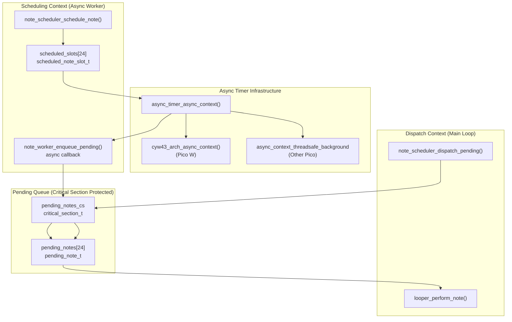
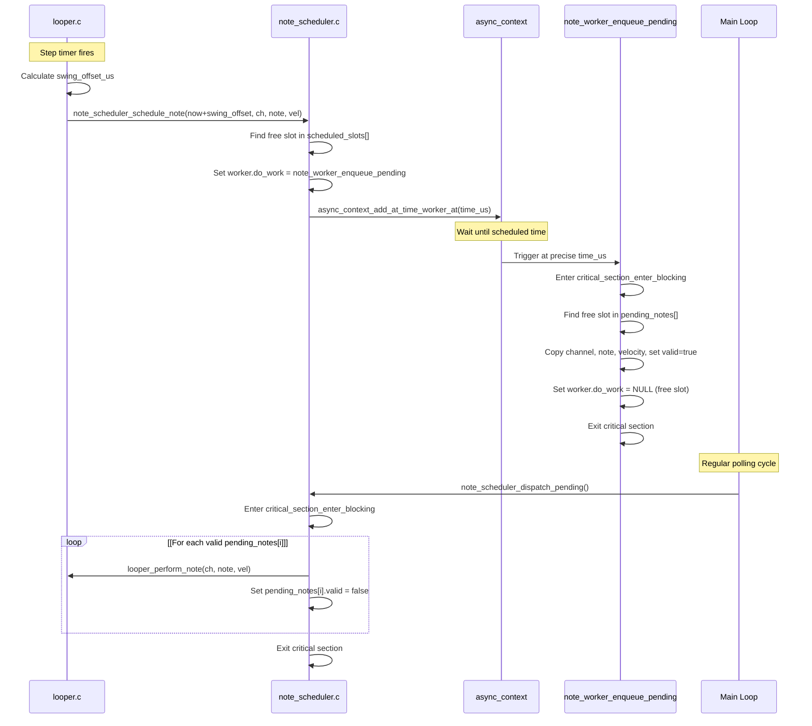
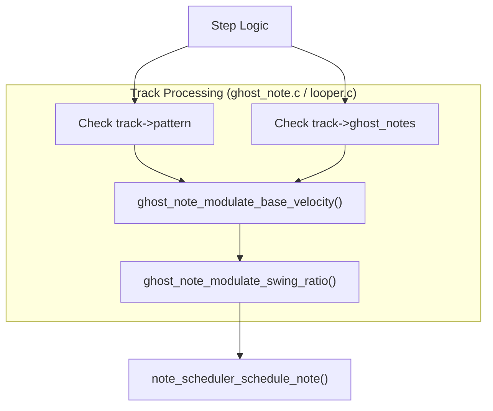

# Note Scheduler

> **Relevant source files**
> * [async_timer.c](https://github.com/Jus-Be/orinayo-pico/blob/6dde5a75/async_timer.c)
> * [async_timer.h](https://github.com/Jus-Be/orinayo-pico/blob/6dde5a75/async_timer.h)
> * [ghost_note.c](https://github.com/Jus-Be/orinayo-pico/blob/6dde5a75/ghost_note.c)
> * [ghost_note.h](https://github.com/Jus-Be/orinayo-pico/blob/6dde5a75/ghost_note.h)
> * [looper.h](https://github.com/Jus-Be/orinayo-pico/blob/6dde5a75/looper.h)
> * [note_scheduler.c](https://github.com/Jus-Be/orinayo-pico/blob/6dde5a75/note_scheduler.c)
> * [note_scheduler.h](https://github.com/Jus-Be/orinayo-pico/blob/6dde5a75/note_scheduler.h)

The Note Scheduler provides microsecond-precision timing for MIDI note events in the Orinayo system. It implements a two-stage architecture that schedules notes in an asynchronous context but dispatches them from the main application loop, avoiding USB mutex contention while maintaining precise timing.

For information about the looper's step sequencer timing, see [Step Sequencer](https://github.com/Jus-Be/orinayo-pico/blob/6dde5a75/Step Sequencer)

 For details on clock synchronization, see [Clock Synchronization](https://github.com/Jus-Be/orinayo-pico/blob/6dde5a75/Clock Synchronization)

 For the ghost note generation algorithms that use this scheduler, see [Ghost Note Generation](https://github.com/Jus-Be/orinayo-pico/blob/6dde5a75/Ghost Note Generation)

**Sources:** [note_scheduler.c L1-L14](https://github.com/Jus-Be/orinayo-pico/blob/6dde5a75/note_scheduler.c#L1-L14)

---

## Purpose and Design Rationale

The Note Scheduler solves a critical timing problem in the Orinayo architecture. MIDI notes must be triggered with microsecond precision to implement musical features like swing timing, but USB MIDI transmission requires mutex locks that cannot be safely acquired from interrupt or async worker contexts. The scheduler bridges this gap by using a two-stage approach:

1. **Schedule Stage**: Notes are scheduled at precise absolute timestamps using the Pico SDK's `async_context` timer mechanism. [note_scheduler.c L69-L84](https://github.com/Jus-Be/orinayo-pico/blob/6dde5a75/note_scheduler.c#L69-L84)
2. **Dispatch Stage**: When the scheduled time arrives, notes are marked as "pending" and dispatched from the main application loop where USB access is safe. [note_scheduler.c L87-L99](https://github.com/Jus-Be/orinayo-pico/blob/6dde5a75/note_scheduler.c#L87-L99)

This design is explicitly documented in the source code as avoiding USB mutex contention while ensuring timing consistency without hardware interrupts. [note_scheduler.c L1-L14](https://github.com/Jus-Be/orinayo-pico/blob/6dde5a75/note_scheduler.c#L1-L14)

**Sources:** [note_scheduler.c L1-L14](https://github.com/Jus-Be/orinayo-pico/blob/6dde5a75/note_scheduler.c#L1-L14)

 [note_scheduler.c L69-L99](https://github.com/Jus-Be/orinayo-pico/blob/6dde5a75/note_scheduler.c#L69-L99)

---

## System Architecture

The following diagram illustrates the relationship between the scheduling logic, the asynchronous timer infrastructure, and the final MIDI dispatch.

### Code Entity Relationship Diagram

```mermaid
flowchart TD

ScheduleCall["note_scheduler_schedule_note()"]
SlotArray["scheduled_slots[24]<br>scheduled_note_slot_t"]
AsyncWorker["note_worker_enqueue_pending()<br>async callback"]
PendingArray["pending_notes[24]<br>pending_note_t"]
CritSect["pending_notes_cs<br>critical_section_t"]
DispatchCall["note_scheduler_dispatch_pending()"]
PerformNote["looper_perform_note()"]
AsyncCtx["async_timer_async_context()"]
CYW43["cyw43_arch_async_context()<br>(Pico W)"]
Threadsafe["async_context_threadsafe_background<br>(Other Pico)"]

SlotArray --> AsyncCtx
AsyncCtx --> AsyncWorker
AsyncWorker --> CritSect
DispatchCall --> CritSect
PendingArray --> PerformNote

subgraph subGraph3 ["Async Timer Infrastructure"]
    AsyncCtx
    CYW43
    Threadsafe
    AsyncCtx --> CYW43
    AsyncCtx --> Threadsafe
end

subgraph subGraph2 ["Dispatch Context (Main Loop)"]
    DispatchCall
    PerformNote
end

subgraph subGraph1 ["Pending Queue (Critical Section Protected)"]
    PendingArray
    CritSect
    CritSect --> PendingArray
    CritSect --> PendingArray
end

subgraph subGraph0 ["Scheduling Context (Async Worker)"]
    ScheduleCall
    SlotArray
    AsyncWorker
    ScheduleCall --> SlotArray
end
```

**Architecture Overview**

The scheduler maintains two separate data structures:

* `scheduled_slots[24]`: Async worker slots that wait for their scheduled time. [note_scheduler.c L37](https://github.com/Jus-Be/orinayo-pico/blob/6dde5a75/note_scheduler.c#L37-L37)
* `pending_notes[24]`: FIFO queue of notes ready to be dispatched. [note_scheduler.c L38](https://github.com/Jus-Be/orinayo-pico/blob/6dde5a75/note_scheduler.c#L38-L38)

The `pending_notes_cs` critical section protects the pending queue from concurrent access between async workers and the main loop. [note_scheduler.c L39](https://github.com/Jus-Be/orinayo-pico/blob/6dde5a75/note_scheduler.c#L39-L39)

**Sources:** [note_scheduler.c L21-L39](https://github.com/Jus-Be/orinayo-pico/blob/6dde5a75/note_scheduler.c#L21-L39)

 [async_timer.c L1-L34](https://github.com/Jus-Be/orinayo-pico/blob/6dde5a75/async_timer.c#L1-L34)

---

## Data Structures

### pending_note_t

Represents a single MIDI note event ready to be dispatched. [note_scheduler.c L24-L29](https://github.com/Jus-Be/orinayo-pico/blob/6dde5a75/note_scheduler.c#L24-L29)

| Field | Type | Purpose |
| --- | --- | --- |
| `channel` | `uint8_t` | MIDI channel (0-15) |
| `note` | `uint8_t` | MIDI note number (0-127) |
| `velocity` | `uint8_t` | MIDI velocity (0-127) |
| `valid` | `bool` | Whether this slot contains a pending note |

**Sources:** [note_scheduler.c L24-L29](https://github.com/Jus-Be/orinayo-pico/blob/6dde5a75/note_scheduler.c#L24-L29)

### scheduled_note_slot_t

Combines an async worker with note parameters for scheduled execution. [note_scheduler.c L32-L35](https://github.com/Jus-Be/orinayo-pico/blob/6dde5a75/note_scheduler.c#L32-L35)

| Field | Type | Purpose |
| --- | --- | --- |
| `worker` | `async_at_time_worker_t` | Pico SDK async worker structure |
| `pending` | `pending_note_t` | Note parameters to enqueue when triggered |

The `worker.do_work` function pointer is set to `note_worker_enqueue_pending` when a slot is in use, and `NULL` when the slot is free. [note_scheduler.c L74-L82](https://github.com/Jus-Be/orinayo-pico/blob/6dde5a75/note_scheduler.c#L74-L82)

 This provides a simple allocation mechanism without requiring additional state tracking.

**Sources:** [note_scheduler.c L31-L35](https://github.com/Jus-Be/orinayo-pico/blob/6dde5a75/note_scheduler.c#L31-L35)

 [note_scheduler.c L74-L82](https://github.com/Jus-Be/orinayo-pico/blob/6dde5a75/note_scheduler.c#L74-L82)

---

## Scheduling Pipeline

### Sequence of Operations

```mermaid
sequenceDiagram
  participant looper.c
  participant note_scheduler.c
  participant async_context
  participant note_worker_enqueue_pending
  participant Main Loop

  note over looper.c: Step timer fires
  looper.c->>looper.c: Calculate swing_offset_us
  looper.c->>note_scheduler.c: note_scheduler_schedule_note(now+swing_offset, ch, note, vel)
  note_scheduler.c->>note_scheduler.c: Find free slot in scheduled_slots[]
  note_scheduler.c->>note_scheduler.c: Set worker.do_work = note_worker_enqueue_pending
  note_scheduler.c->>async_context: async_context_add_at_time_worker_at(time_us)
  note over async_context: Wait until scheduled time
  async_context->>note_worker_enqueue_pending: Trigger at precise time_us
  note_worker_enqueue_pending->>note_worker_enqueue_pending: Enter critical_section_enter_blocking
  note_worker_enqueue_pending->>note_worker_enqueue_pending: Find free slot in pending_notes[]
  note_worker_enqueue_pending->>note_worker_enqueue_pending: Copy channel, note, velocity, set valid=true
  note_worker_enqueue_pending->>note_worker_enqueue_pending: Set worker.do_work = NULL (free slot)
  note_worker_enqueue_pending->>note_worker_enqueue_pending: Exit critical section
  note over Main Loop: Regular polling cycle
  Main Loop->>note_scheduler.c: note_scheduler_dispatch_pending()
  note_scheduler.c->>note_scheduler.c: Enter critical_section_enter_blocking
  loop [For each valid pending_notes[i]]
    note_scheduler.c->>looper.c: looper_perform_note(ch, note, vel)
    note_scheduler.c->>note_scheduler.c: Set pending_notes[i].valid = false
  end
  note_scheduler.c->>note_scheduler.c: Exit critical section
```

**Pipeline Stages**

1. **Schedule Request**: Looper calculates target timestamp and calls `note_scheduler_schedule_note()`. [note_scheduler.c L69-L70](https://github.com/Jus-Be/orinayo-pico/blob/6dde5a75/note_scheduler.c#L69-L70)
2. **Slot Allocation**: Scheduler finds a free slot in `scheduled_slots[]` where `worker.do_work == NULL`. [note_scheduler.c L73-L74](https://github.com/Jus-Be/orinayo-pico/blob/6dde5a75/note_scheduler.c#L73-L74)
3. **Async Registration**: Slot's worker is registered with `async_context` at the absolute timestamp. [note_scheduler.c L78-L79](https://github.com/Jus-Be/orinayo-pico/blob/6dde5a75/note_scheduler.c#L78-L79)
4. **Async Callback**: When time arrives, `note_worker_enqueue_pending()` moves the note to `pending_notes[]` under critical section. [note_scheduler.c L48-L63](https://github.com/Jus-Be/orinayo-pico/blob/6dde5a75/note_scheduler.c#L48-L63)
5. **Main Loop Dispatch**: `note_scheduler_dispatch_pending()` processes all valid pending notes safely in main loop context. [note_scheduler.c L87-L99](https://github.com/Jus-Be/orinayo-pico/blob/6dde5a75/note_scheduler.c#L87-L99)

**Sources:** [note_scheduler.c L48-L99](https://github.com/Jus-Be/orinayo-pico/blob/6dde5a75/note_scheduler.c#L48-L99)

---

## API Reference

### note_scheduler_init()

Initializes the note scheduler's critical section. [note_scheduler.c L42](https://github.com/Jus-Be/orinayo-pico/blob/6dde5a75/note_scheduler.c#L42-L42)

**Sources:** [note_scheduler.c L42](https://github.com/Jus-Be/orinayo-pico/blob/6dde5a75/note_scheduler.c#L42-L42)

### note_scheduler_schedule_note()

Schedules a MIDI note to be triggered at a specific absolute timestamp. [note_scheduler.c L69-L84](https://github.com/Jus-Be/orinayo-pico/blob/6dde5a75/note_scheduler.c#L69-L84)

| Parameter | Type | Description |
| --- | --- | --- |
| `time_us` | `uint64_t` | Absolute timestamp in microseconds |
| `channel` | `uint8_t` | MIDI channel (0-15) |
| `note` | `uint8_t` | MIDI note number (0-127) |
| `velocity` | `uint8_t` | MIDI velocity (0-127) |

**Returns**: `true` if scheduled successfully, `false` if all 24 slots are in use. [note_scheduler.c L83](https://github.com/Jus-Be/orinayo-pico/blob/6dde5a75/note_scheduler.c#L83-L83)

**Sources:** [note_scheduler.c L69-L84](https://github.com/Jus-Be/orinayo-pico/blob/6dde5a75/note_scheduler.c#L69-L84)

### note_scheduler_dispatch_pending()

Processes all pending scheduled notes from the main application loop. [note_scheduler.c L87-L99](https://github.com/Jus-Be/orinayo-pico/blob/6dde5a75/note_scheduler.c#L87-L99)

**Implementation Details:**

1. Enters critical section `pending_notes_cs`. [note_scheduler.c L88](https://github.com/Jus-Be/orinayo-pico/blob/6dde5a75/note_scheduler.c#L88-L88)
2. Iterates through `pending_notes[]`. [note_scheduler.c L90](https://github.com/Jus-Be/orinayo-pico/blob/6dde5a75/note_scheduler.c#L90-L90)
3. For each valid note, calls `looper_perform_note()`. [note_scheduler.c L93-L94](https://github.com/Jus-Be/orinayo-pico/blob/6dde5a75/note_scheduler.c#L93-L94)
4. Clears the `valid` flag. [note_scheduler.c L95](https://github.com/Jus-Be/orinayo-pico/blob/6dde5a75/note_scheduler.c#L95-L95)
5. Exits critical section. [note_scheduler.c L98](https://github.com/Jus-Be/orinayo-pico/blob/6dde5a75/note_scheduler.c#L98-L98)

**Sources:** [note_scheduler.c L87-L99](https://github.com/Jus-Be/orinayo-pico/blob/6dde5a75/note_scheduler.c#L87-L99)

---

## Integration with Musical Processing

### Swing and Velocity Modulation

The Note Scheduler is the execution engine for musical variations generated in `ghost_note.c`.

| Feature | Modulation Logic | Source |
| --- | --- | --- |
| **Swing Timing** | Modulates `swing_ratio` via LFO for microsecond offsets | [ghost_note.c L69-L88](https://github.com/Jus-Be/orinayo-pico/blob/6dde5a75/ghost_note.c#L69-L88) |
| **Velocity LFO** | Modulates Kick (Track 0) and Hi-hat (Track 2) base velocities | [ghost_note.c L56-L67](https://github.com/Jus-Be/orinayo-pico/blob/6dde5a75/ghost_note.c#L56-L67) |

### Track Processing Logic

```mermaid
flowchart TD

StepTimer["Step Logic"]
CheckPattern["Check track->pattern"]
CheckGhost["Check track->ghost_notes"]
ModulateVel["ghost_note_modulate_base_velocity()"]
ModulateSwing["ghost_note_modulate_swing_ratio()"]
ScheduleNote["note_scheduler_schedule_note()"]

StepTimer --> CheckPattern
StepTimer --> CheckGhost
ModulateSwing --> ScheduleNote

subgraph subGraph0 ["Track Processing (ghost_note.c / looper.c)"]
    CheckPattern
    CheckGhost
    ModulateVel
    ModulateSwing
    CheckPattern --> ModulateVel
    CheckGhost --> ModulateVel
    ModulateVel --> ModulateSwing
end
```

**Sources:** [ghost_note.c L56-L88](https://github.com/Jus-Be/orinayo-pico/blob/6dde5a75/ghost_note.c#L56-L88)

 [note_scheduler.c L69-L84](https://github.com/Jus-Be/orinayo-pico/blob/6dde5a75/note_scheduler.c#L69-L84)

---

## Timing Precision

### Microsecond Resolution

The scheduler uses 64-bit microsecond timestamps throughout. It converts the input `time_us` to the Pico SDK's `absolute_time_t` for the worker. [note_scheduler.c L71](https://github.com/Jus-Be/orinayo-pico/blob/6dde5a75/note_scheduler.c#L71-L71)

### Async Context Backend

The scheduler relies on the `async_timer` infrastructure, which adapts to the hardware: [async_timer.c L8-L33](https://github.com/Jus-Be/orinayo-pico/blob/6dde5a75/async_timer.c#L8-L33)

* **Pico W (CYW43 Bluetooth)**: Uses `cyw43_arch_async_context()`. [async_timer.c L29](https://github.com/Jus-Be/orinayo-pico/blob/6dde5a75/async_timer.c#L29-L29)
* **Other Pico Boards**: Creates a dedicated `async_context_threadsafe_background`. [async_timer.c L14-L23](https://github.com/Jus-Be/orinayo-pico/blob/6dde5a75/async_timer.c#L14-L23)

**Sources:** [async_timer.c L1-L34](https://github.com/Jus-Be/orinayo-pico/blob/6dde5a75/async_timer.c#L1-L34)

 [note_scheduler.c L71](https://github.com/Jus-Be/orinayo-pico/blob/6dde5a75/note_scheduler.c#L71-L71)

---

## Thread Safety

### Critical Section Protection

The `pending_notes[]` array is protected by a critical section to prevent race conditions between the asynchronous worker callback and the main loop dispatch. [note_scheduler.c L39](https://github.com/Jus-Be/orinayo-pico/blob/6dde5a75/note_scheduler.c#L39-L39)

| Location | Purpose |
| --- | --- |
| `note_worker_enqueue_pending()` | Enqueue note from async context. [note_scheduler.c L52-L62](https://github.com/Jus-Be/orinayo-pico/blob/6dde5a75/note_scheduler.c#L52-L62) |
| `note_scheduler_dispatch_pending()` | Dequeue and play note from main loop. [note_scheduler.c L88-L98](https://github.com/Jus-Be/orinayo-pico/blob/6dde5a75/note_scheduler.c#L88-L98) |

### USB Mutex Avoidance

By deferring the call to `looper_perform_note()` (which ultimately writes to USB/UART) to the main loop, the system avoids the risk of attempting to acquire USB mutexes from within an interrupt or high-priority async worker context. [note_scheduler.c L5-L9](https://github.com/Jus-Be/orinayo-pico/blob/6dde5a75/note_scheduler.c#L5-L9)

**Sources:** [note_scheduler.c L1-L14](https://github.com/Jus-Be/orinayo-pico/blob/6dde5a75/note_scheduler.c#L1-L14)

 [note_scheduler.c L52-L62](https://github.com/Jus-Be/orinayo-pico/blob/6dde5a75/note_scheduler.c#L52-L62)

 [note_scheduler.c L88-L98](https://github.com/Jus-Be/orinayo-pico/blob/6dde5a75/note_scheduler.c#L88-L98)