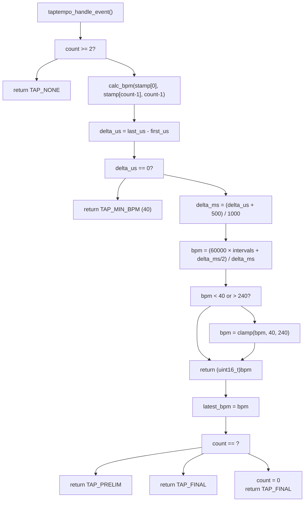
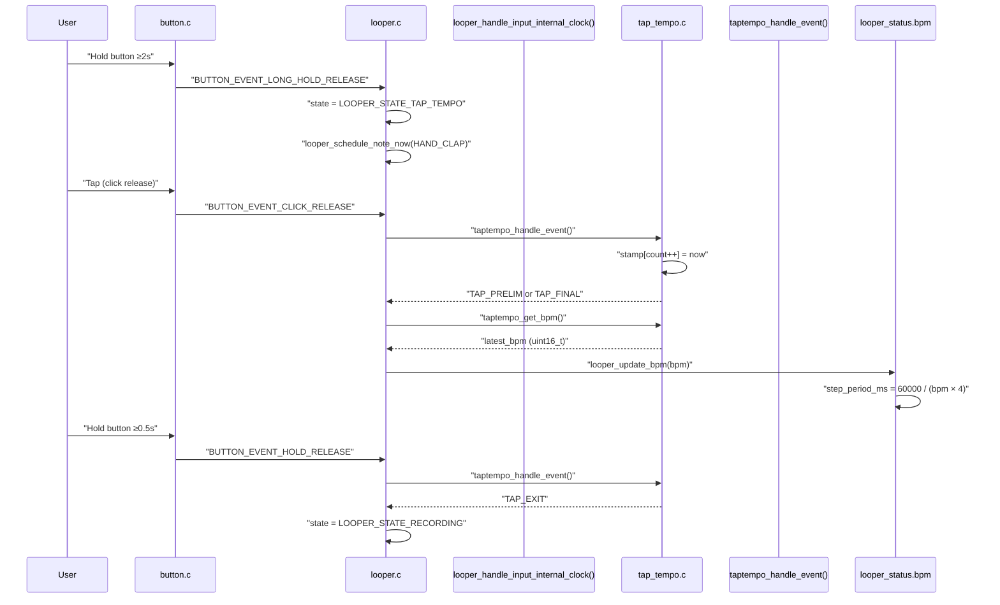
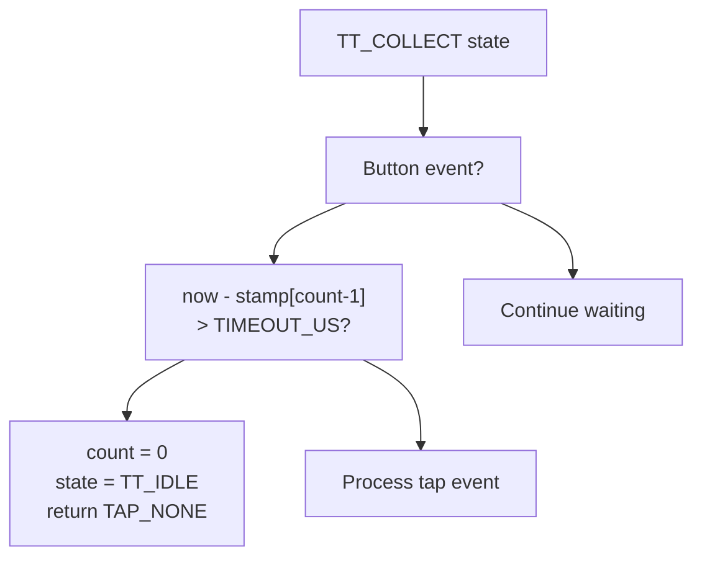

# Tap Tempo

> **Relevant source files**
> * [looper.c](https://github.com/Jus-Be/orinayo-pico/blob/122fa496/looper.c)
> * [tap_tempo.c](https://github.com/Jus-Be/orinayo-pico/blob/122fa496/tap_tempo.c)
> * [tap_tempo.h](https://github.com/Jus-Be/orinayo-pico/blob/122fa496/tap_tempo.h)

This document describes the tap tempo detection system, which allows users to manually set the looper BPM by rhythmically tapping a button. The system captures tap timing, calculates BPM from inter-tap intervals, and updates the looper tempo in real time.

For information about how the looper processes the resulting BPM value to synchronize playback, see [Clock Synchronization](./5.3-clock-synchronization.md). For button input event generation and classification, see [Button Input](./7.1-button-input.md).

**Scope**: This page covers the tap tempo state machine (`TT_IDLE`, `TT_COLLECT`), BPM calculation algorithm, mode entry/exit conditions, timeout handling, and integration with the looper system.

---

## Overview

The tap tempo subsystem is implemented in [tap_tempo.c](https://github.com/Jus-Be/orinayo-pico/blob/122fa496/tap_tempo.c)

 and [tap_tempo.h](https://github.com/Jus-Be/orinayo-pico/blob/122fa496/tap_tempo.h)

 It operates as a finite state machine that collects button press timestamps and computes BPM from the average interval between taps. The system supports 2-4 taps before auto-resetting, with a 1-second inactivity timeout.

**Entry Condition**: User holds the button for ≥2 seconds (`BUTTON_EVENT_LONG_HOLD_RELEASE`), triggering `LOOPER_STATE_TAP_TEMPO` in the looper state machine [looper.c L409-L410](https://github.com/Jus-Be/orinayo-pico/blob/122fa496/looper.c#L409-L410)

**Exit Condition**: User holds the button for ≥0.5 seconds (`BUTTON_EVENT_HOLD_RELEASE`) during tap tempo mode [tap_tempo.c L67-L69](https://github.com/Jus-Be/orinayo-pico/blob/122fa496/tap_tempo.c#L67-L69)

Sources: [tap_tempo.c L1-L13](https://github.com/Jus-Be/orinayo-pico/blob/122fa496/tap_tempo.c#L1-L13)

 [tap_tempo.h L12-L17](https://github.com/Jus-Be/orinayo-pico/blob/122fa496/tap_tempo.h#L12-L17)

 [looper.c L256-L270](https://github.com/Jus-Be/orinayo-pico/blob/122fa496/looper.c#L256-L270)

---

## State Machine

### Tap Tempo State Machine

```css
#mermaid-clyppthsnx{font-family:ui-sans-serif,-apple-system,system-ui,Segoe UI,Helvetica;font-size:16px;fill:#333;}@keyframes edge-animation-frame{from{stroke-dashoffset:0;}}@keyframes dash{to{stroke-dashoffset:0;}}#mermaid-clyppthsnx .edge-animation-slow{stroke-dasharray:9,5!important;stroke-dashoffset:900;animation:dash 50s linear infinite;stroke-linecap:round;}#mermaid-clyppthsnx .edge-animation-fast{stroke-dasharray:9,5!important;stroke-dashoffset:900;animation:dash 20s linear infinite;stroke-linecap:round;}#mermaid-clyppthsnx .error-icon{fill:#dddddd;}#mermaid-clyppthsnx .error-text{fill:#222222;stroke:#222222;}#mermaid-clyppthsnx .edge-thickness-normal{stroke-width:1px;}#mermaid-clyppthsnx .edge-thickness-thick{stroke-width:3.5px;}#mermaid-clyppthsnx .edge-pattern-solid{stroke-dasharray:0;}#mermaid-clyppthsnx .edge-thickness-invisible{stroke-width:0;fill:none;}#mermaid-clyppthsnx .edge-pattern-dashed{stroke-dasharray:3;}#mermaid-clyppthsnx .edge-pattern-dotted{stroke-dasharray:2;}#mermaid-clyppthsnx .marker{fill:#999;stroke:#999;}#mermaid-clyppthsnx .marker.cross{stroke:#999;}#mermaid-clyppthsnx svg{font-family:ui-sans-serif,-apple-system,system-ui,Segoe UI,Helvetica;font-size:16px;}#mermaid-clyppthsnx p{margin:0;}#mermaid-clyppthsnx defs #statediagram-barbEnd{fill:#999;stroke:#999;}#mermaid-clyppthsnx g.stateGroup text{fill:#dddddd;stroke:none;font-size:10px;}#mermaid-clyppthsnx g.stateGroup text{fill:#333;stroke:none;font-size:10px;}#mermaid-clyppthsnx g.stateGroup .state-title{font-weight:bolder;fill:#333;}#mermaid-clyppthsnx g.stateGroup rect{fill:#ffffff;stroke:#dddddd;}#mermaid-clyppthsnx g.stateGroup line{stroke:#999;stroke-width:1;}#mermaid-clyppthsnx .transition{stroke:#999;stroke-width:1;fill:none;}#mermaid-clyppthsnx .stateGroup .composit{fill:#f4f4f4;border-bottom:1px;}#mermaid-clyppthsnx .stateGroup .alt-composit{fill:#e0e0e0;border-bottom:1px;}#mermaid-clyppthsnx .state-note{stroke:#e6d280;fill:#fff5ad;}#mermaid-clyppthsnx .state-note text{fill:#333;stroke:none;font-size:10px;}#mermaid-clyppthsnx .stateLabel .box{stroke:none;stroke-width:0;fill:#ffffff;opacity:0.5;}#mermaid-clyppthsnx .edgeLabel .label rect{fill:#ffffff;opacity:0.5;}#mermaid-clyppthsnx .edgeLabel{background-color:#ffffff;text-align:center;}#mermaid-clyppthsnx .edgeLabel p{background-color:#ffffff;}#mermaid-clyppthsnx .edgeLabel rect{opacity:0.5;background-color:#ffffff;fill:#ffffff;}#mermaid-clyppthsnx .edgeLabel .label text{fill:#333;}#mermaid-clyppthsnx .label div .edgeLabel{color:#333;}#mermaid-clyppthsnx .stateLabel text{fill:#333;font-size:10px;font-weight:bold;}#mermaid-clyppthsnx .node circle.state-start{fill:#999;stroke:#999;}#mermaid-clyppthsnx .node .fork-join{fill:#999;stroke:#999;}#mermaid-clyppthsnx .node circle.state-end{fill:#dddddd;stroke:#f4f4f4;stroke-width:1.5;}#mermaid-clyppthsnx .end-state-inner{fill:#f4f4f4;stroke-width:1.5;}#mermaid-clyppthsnx .node rect{fill:#ffffff;stroke:#dddddd;stroke-width:1px;}#mermaid-clyppthsnx .node polygon{fill:#ffffff;stroke:#dddddd;stroke-width:1px;}#mermaid-clyppthsnx #statediagram-barbEnd{fill:#999;}#mermaid-clyppthsnx .statediagram-cluster rect{fill:#ffffff;stroke:#dddddd;stroke-width:1px;}#mermaid-clyppthsnx .cluster-label,#mermaid-clyppthsnx .nodeLabel{color:#333;}#mermaid-clyppthsnx .statediagram-cluster rect.outer{rx:5px;ry:5px;}#mermaid-clyppthsnx .statediagram-state .divider{stroke:#dddddd;}#mermaid-clyppthsnx .statediagram-state .title-state{rx:5px;ry:5px;}#mermaid-clyppthsnx .statediagram-cluster.statediagram-cluster .inner{fill:#f4f4f4;}#mermaid-clyppthsnx .statediagram-cluster.statediagram-cluster-alt .inner{fill:#f8f8f8;}#mermaid-clyppthsnx .statediagram-cluster .inner{rx:0;ry:0;}#mermaid-clyppthsnx .statediagram-state rect.basic{rx:5px;ry:5px;}#mermaid-clyppthsnx .statediagram-state rect.divider{stroke-dasharray:10,10;fill:#f8f8f8;}#mermaid-clyppthsnx .note-edge{stroke-dasharray:5;}#mermaid-clyppthsnx .statediagram-note rect{fill:#fff5ad;stroke:#e6d280;stroke-width:1px;rx:0;ry:0;}#mermaid-clyppthsnx .statediagram-note rect{fill:#fff5ad;stroke:#e6d280;stroke-width:1px;rx:0;ry:0;}#mermaid-clyppthsnx .statediagram-note text{fill:#333;}#mermaid-clyppthsnx .statediagram-note .nodeLabel{color:#333;}#mermaid-clyppthsnx .statediagram .edgeLabel{color:red;}#mermaid-clyppthsnx #dependencyStart,#mermaid-clyppthsnx #dependencyEnd{fill:#999;stroke:#999;stroke-width:1;}#mermaid-clyppthsnx .statediagramTitleText{text-anchor:middle;font-size:18px;fill:#333;}#mermaid-clyppthsnx :root{--mermaid-font-family:"trebuchet ms",verdana,arial,sans-serif;}"BUTTON_EVENT_CLICK_RELEASE""stamp[0] = now, count = 0""BUTTON_EVENT_HOLD_RELEASE""or LONG_HOLD_RELEASE""return TAP_EXIT""BUTTON_EVENT_HOLD_RELEASE""return TAP_EXIT""Timeout (now - stamp[count-1] > 1s)""count = 0, return TAP_NONE""CLICK_RELEASE (count < 4)""stamp[count++] = now""calc_bpm if count >= 2""CLICK_RELEASE (count == 4)""calc_bpm, count = 0""return TAP_FINAL"TT_IDLETT_COLLECTcount=2: TAP_PRELIMcount=3: TAP_FINALcount=4: TAP_FINAL + reset
```

The state machine has two states defined in [tap_tempo.c L29](https://github.com/Jus-Be/orinayo-pico/blob/122fa496/tap_tempo.c#L29-L29)

:

* **`TT_IDLE`**: Waiting for first tap or exit
* **`TT_COLLECT`**: Actively collecting taps and computing BPM

The `tap_ctx_t` structure [tap_tempo.c L32-L37](https://github.com/Jus-Be/orinayo-pico/blob/122fa496/tap_tempo.c#L32-L37)

 maintains state:

* `state`: Current state (`TT_IDLE` or `TT_COLLECT`)
* `stamp[TAP_MAX_TAPS]`: Array of 4 tap timestamps in microseconds
* `count`: Number of taps collected (0-4)
* `is_active`: Boolean flag indicating `TT_COLLECT` mode

Sources: [tap_tempo.c L29-L39](https://github.com/Jus-Be/orinayo-pico/blob/122fa496/tap_tempo.c#L29-L39)

 [tap_tempo.c L62-L109](https://github.com/Jus-Be/orinayo-pico/blob/122fa496/tap_tempo.c#L62-L109)

---

## BPM Calculation Algorithm

### Calculation Process



The BPM calculation is performed by `calc_bpm()` [tap_tempo.c L43-L59](https://github.com/Jus-Be/orinayo-pico/blob/122fa496/tap_tempo.c#L43-L59)

:

1. **Interval Measurement**: `delta_us = last_us - first_us` measures the total time span across all taps
2. **Conversion to Milliseconds**: `delta_ms = (delta_us + 500) / 1000` with rounding
3. **BPM Computation**: `bpm = (60000 × intervals + delta_ms/2) / delta_ms` * `60000` ms/minute converts interval to BPM * `intervals` = `count - 1` (number of gaps between taps) * `delta_ms/2` provides rounding for integer division
4. **Clamping**: Result is clamped to `[TAP_MIN_BPM, TAP_MAX_BPM]` = `[40, 240]` [tap_tempo.c L53-L56](https://github.com/Jus-Be/orinayo-pico/blob/122fa496/tap_tempo.c#L53-L56)

**Example**: 3 taps at 0ms, 500ms, 1000ms:

* `intervals = 2`, `delta_us = 1,000,000`, `delta_ms = 1000`
* `bpm = (60000 × 2 + 500) / 1000 = 120`

Sources: [tap_tempo.c L43-L59](https://github.com/Jus-Be/orinayo-pico/blob/122fa496/tap_tempo.c#L43-L59)

 [tap_tempo.c L90-L92](https://github.com/Jus-Be/orinayo-pico/blob/122fa496/tap_tempo.c#L90-L92)

---

## Integration with Looper System

### Looper Integration Flow



The integration is coordinated by `taptempo_handle_button_event()` [looper.c L257-L270](https://github.com/Jus-Be/orinayo-pico/blob/122fa496/looper.c#L257-L270)

:

1. **Mode Entry**: When `BUTTON_EVENT_LONG_HOLD_RELEASE` is received in normal operation, looper sets `looper_status.state = LOOPER_STATE_TAP_TEMPO` [looper.c L409](https://github.com/Jus-Be/orinayo-pico/blob/122fa496/looper.c#L409-L409)
2. **Event Routing**: While in `LOOPER_STATE_TAP_TEMPO`, button events are routed to `taptempo_handle_event()` [looper.c L496-L497](https://github.com/Jus-Be/orinayo-pico/blob/122fa496/looper.c#L496-L497)
3. **BPM Update**: On `TAP_PRELIM` or `TAP_FINAL` results, looper calls `taptempo_get_bpm()` and updates via `looper_update_bpm()` [looper.c L262](https://github.com/Jus-Be/orinayo-pico/blob/122fa496/looper.c#L262-L262)
4. **Mode Exit**: On `TAP_EXIT` result, looper transitions to `LOOPER_STATE_RECORDING` [looper.c L498](https://github.com/Jus-Be/orinayo-pico/blob/122fa496/looper.c#L498-L498)

The `tap_result_t` enum [tap_tempo.h L12-L17](https://github.com/Jus-Be/orinayo-pico/blob/122fa496/tap_tempo.h#L12-L17)

 defines return values:

* `TAP_NONE`: No BPM update
* `TAP_PRELIM`: Preliminary BPM (2 taps)
* `TAP_FINAL`: Final averaged BPM (3-4 taps)
* `TAP_EXIT`: Exit tap tempo mode

Sources: [looper.c L257-L270](https://github.com/Jus-Be/orinayo-pico/blob/122fa496/looper.c#L257-L270)

 [looper.c L409-L410](https://github.com/Jus-Be/orinayo-pico/blob/122fa496/looper.c#L409-L410)

 [looper.c L495-L502](https://github.com/Jus-Be/orinayo-pico/blob/122fa496/looper.c#L495-L502)

 [tap_tempo.h L12-L17](https://github.com/Jus-Be/orinayo-pico/blob/122fa496/tap_tempo.h#L12-L17)

---

## Configuration Constants

The tap tempo system uses the following constants defined in [tap_tempo.c L22-L27](https://github.com/Jus-Be/orinayo-pico/blob/122fa496/tap_tempo.c#L22-L27)

:

| Constant | Value | Purpose |
| --- | --- | --- |
| `TAP_MIN_BPM` | 40 | Lower BPM clamp limit |
| `TAP_MAX_BPM` | 240 | Upper BPM clamp limit |
| `TAP_MAX_TAPS` | 4 | Maximum taps before auto-reset |
| `TIMEOUT_US` | 1,000,000 | Inactivity timeout (1 second) |

**BPM Range**: The `[40, 240]` range covers most musical tempos from very slow ballads to fast electronic music. Values outside this range are clamped during calculation [tap_tempo.c L53-L56](https://github.com/Jus-Be/orinayo-pico/blob/122fa496/tap_tempo.c#L53-L56)

**Tap Limit**: After 4 taps, the system automatically resets `count` to 0 and returns `TAP_FINAL` [tap_tempo.c L98-L100](https://github.com/Jus-Be/orinayo-pico/blob/122fa496/tap_tempo.c#L98-L100)

 This prevents unbounded accumulation and allows immediate re-tapping.

Sources: [tap_tempo.c L22-L27](https://github.com/Jus-Be/orinayo-pico/blob/122fa496/tap_tempo.c#L22-L27)

---

## Timeout Behavior

The timeout mechanism prevents stale tap data from affecting BPM calculations:



The timeout check occurs in `TT_COLLECT` state [tap_tempo.c L82-L85](https://github.com/Jus-Be/orinayo-pico/blob/122fa496/tap_tempo.c#L82-L85)

:

1. **Condition**: If `(now - stamp[count ? count - 1 : 0]) > TIMEOUT_US`
2. **Action**: Reset `count = 0`, transition to `TT_IDLE`, return `TAP_NONE`
3. **Purpose**: After 1 second of inactivity, any previous taps are discarded to avoid mixing slow and fast tap sequences

This ensures that users must tap consistently within a 1-second window, preventing accidentally slow taps from corrupting the BPM estimate.

Sources: [tap_tempo.c L82-L85](https://github.com/Jus-Be/orinayo-pico/blob/122fa496/tap_tempo.c#L82-L85)

---

## Public API

The tap tempo module exposes three functions in [tap_tempo.h](https://github.com/Jus-Be/orinayo-pico/blob/122fa496/tap_tempo.h)

:

| Function | Return Type | Purpose |
| --- | --- | --- |
| `taptempo_handle_event(button_event_t ev)` | `tap_result_t` | Main FSM event handler, processes button events |
| `taptempo_get_bpm(void)` | `uint16_t` | Returns the most recently calculated BPM |
| `taptempo_active(void)` | `bool` | Returns true if state is `TT_COLLECT` |

**Static State**: The module maintains a static `tap_ctx_t ctx` [tap_tempo.c L39](https://github.com/Jus-Be/orinayo-pico/blob/122fa496/tap_tempo.c#L39-L39)

 and `latest_bpm` [tap_tempo.c L40](https://github.com/Jus-Be/orinayo-pico/blob/122fa496/tap_tempo.c#L40-L40)

 providing persistent state across calls without requiring external storage.

Sources: [tap_tempo.h L19-L22](https://github.com/Jus-Be/orinayo-pico/blob/122fa496/tap_tempo.h#L19-L22)

 [tap_tempo.c L39-L40](https://github.com/Jus-Be/orinayo-pico/blob/122fa496/tap_tempo.c#L39-L40)

 [tap_tempo.c L111-L112](https://github.com/Jus-Be/orinayo-pico/blob/122fa496/tap_tempo.c#L111-L112)

---

## Example Usage Sequence

A typical tap tempo session follows this pattern:

1. User holds button for 2+ seconds
2. Looper enters `LOOPER_STATE_TAP_TEMPO` [looper.c L409](https://github.com/Jus-Be/orinayo-pico/blob/122fa496/looper.c#L409-L409)
3. User taps button twice (short clicks) * First tap: `count=0→1`, returns `TAP_NONE` * Second tap: `count=1→2`, calculates BPM, returns `TAP_PRELIM`
4. Looper updates BPM via `looper_update_bpm()` [looper.c L262](https://github.com/Jus-Be/orinayo-pico/blob/122fa496/looper.c#L262-L262)
5. User taps third time: `count=2→3`, refines BPM, returns `TAP_FINAL`
6. Looper updates BPM again (more accurate average)
7. User holds button for 0.5+ seconds to exit
8. Tap tempo returns `TAP_EXIT`, looper transitions to `LOOPER_STATE_RECORDING` [looper.c L498](https://github.com/Jus-Be/orinayo-pico/blob/122fa496/looper.c#L498-L498)

The looper simultaneously plays a click track during tap tempo mode [looper.c L327](https://github.com/Jus-Be/orinayo-pico/blob/122fa496/looper.c#L327-L327)

 to provide audible feedback for timing.

Sources: [looper.c L256-L270](https://github.com/Jus-Be/orinayo-pico/blob/122fa496/looper.c#L256-L270)

 [looper.c L326-L329](https://github.com/Jus-Be/orinayo-pico/blob/122fa496/looper.c#L326-L329)

 [looper.c L495-L502](https://github.com/Jus-Be/orinayo-pico/blob/122fa496/looper.c#L495-L502)