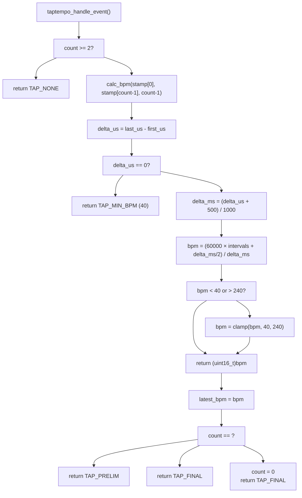
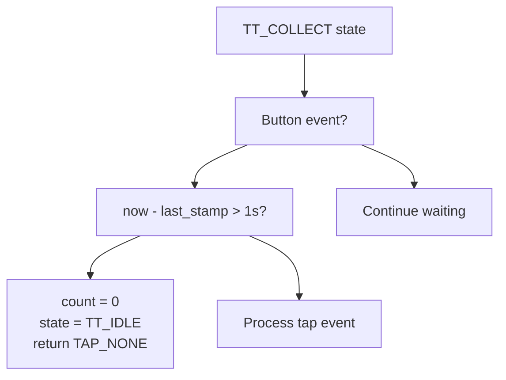

# Tap Tempo

> **Relevant source files**
> * [button.h](https://github.com/Jus-Be/orinayo-pico/blob/6dde5a75/button.h)
> * [looper.c](https://github.com/Jus-Be/orinayo-pico/blob/6dde5a75/looper.c)
> * [tap_tempo.c](https://github.com/Jus-Be/orinayo-pico/blob/6dde5a75/tap_tempo.c)
> * [tap_tempo.h](https://github.com/Jus-Be/orinayo-pico/blob/6dde5a75/tap_tempo.h)

This document describes the tap tempo detection system, which allows users to manually set the looper BPM by rhythmically tapping a button. The system captures tap timing, calculates BPM from inter-tap intervals, and updates the looper tempo in real time.

For information about how the looper processes the resulting BPM value to synchronize playback, see [Clock Synchronization](https://github.com/Jus-Be/orinayo-pico/blob/6dde5a75/Clock Synchronization)

 For button input event generation and classification, see [Button Input](https://github.com/Jus-Be/orinayo-pico/blob/6dde5a75/Button Input)

**Scope**: This page covers the tap tempo state machine (`TT_IDLE`, `TT_COLLECT`), BPM calculation algorithm, mode entry/exit conditions, timeout handling, and integration with the looper system.

---

## Overview

The tap tempo subsystem is implemented in [tap_tempo.c L1-L113](https://github.com/Jus-Be/orinayo-pico/blob/6dde5a75/tap_tempo.c#L1-L113)

 and [tap_tempo.h L1-L23](https://github.com/Jus-Be/orinayo-pico/blob/6dde5a75/tap_tempo.h#L1-L23)

 It operates as a finite state machine that collects button press timestamps and computes BPM from the average interval between taps. The system supports 2-4 taps before auto-resetting, with a 1-second inactivity timeout.

**Entry Condition**: User holds the button for ≥2 seconds (`BUTTON_EVENT_LONG_HOLD_RELEASE`), triggering `LOOPER_STATE_TAP_TEMPO` in the looper state machine.

**Exit Condition**: User holds the button for ≥0.5 seconds (`BUTTON_EVENT_HOLD_RELEASE`) during tap tempo mode [tap_tempo.c L67-L69](https://github.com/Jus-Be/orinayo-pico/blob/6dde5a75/tap_tempo.c#L67-L69)

Sources: [tap_tempo.c L1-L13](https://github.com/Jus-Be/orinayo-pico/blob/6dde5a75/tap_tempo.c#L1-L13)

 [tap_tempo.h L12-L17](https://github.com/Jus-Be/orinayo-pico/blob/6dde5a75/tap_tempo.h#L12-L17)

---

## State Machine

### Tap Tempo State Machine

```

```

The state machine has two states defined in `tt_state_t` [tap_tempo.c L29](https://github.com/Jus-Be/orinayo-pico/blob/6dde5a75/tap_tempo.c#L29-L29)

:

* **`TT_IDLE`**: Waiting for first tap or exit.
* **`TT_COLLECT`**: Actively collecting taps and computing BPM.

The `tap_ctx_t` structure [tap_tempo.c L32-L37](https://github.com/Jus-Be/orinayo-pico/blob/6dde5a75/tap_tempo.c#L32-L37)

 maintains state:

* `state`: Current state (`TT_IDLE` or `TT_COLLECT`).
* `stamp[TAP_MAX_TAPS]`: Array of 4 tap timestamps in microseconds [tap_tempo.c L34](https://github.com/Jus-Be/orinayo-pico/blob/6dde5a75/tap_tempo.c#L34-L34)
* `count`: Number of taps collected (0-4) [tap_tempo.c L35](https://github.com/Jus-Be/orinayo-pico/blob/6dde5a75/tap_tempo.c#L35-L35)

Sources: [tap_tempo.c L29-L39](https://github.com/Jus-Be/orinayo-pico/blob/6dde5a75/tap_tempo.c#L29-L39)

 [tap_tempo.c L62-L109](https://github.com/Jus-Be/orinayo-pico/blob/6dde5a75/tap_tempo.c#L62-L109)

---

## BPM Calculation Algorithm

### Calculation Process


```mermaid
flowchart TD

Start["taptempo_handle_event()"]
CheckCount["count >= 2?"]
Return["return TAP_NONE"]
CalcBPM["calc_bpm(stamp[0], stamp[count-1], count-1)"]
DeltaUS["delta_us = last_us - first_us"]
CheckZero["delta_us == 0?"]
ReturnMin["return TAP_MIN_BPM (40)"]
ConvertMS["delta_ms = (delta_us + 500) / 1000"]
ComputeBPM["bpm = (60000 × intervals + delta_ms/2) / delta_ms"]
Clamp["bpm < 40 or > 240?"]
ClampValue["bpm = clamp(bpm, 40, 240)"]
ReturnBPM["return (uint16_t)bpm"]
UpdateLatest["latest_bpm = bpm"]
CheckTaps["count == ?"]
Prelim["return TAP_PRELIM"]
Final["return TAP_FINAL"]
FinalReset["count = 0<br>return TAP_FINAL"]

Start --> CheckCount
CheckCount --> Return
CheckCount --> CalcBPM
CalcBPM --> DeltaUS
DeltaUS --> CheckZero
CheckZero --> ReturnMin
CheckZero --> ConvertMS
ConvertMS --> ComputeBPM
ComputeBPM --> Clamp
Clamp --> ClampValue
Clamp --> ReturnBPM
ClampValue --> ReturnBPM
ReturnBPM --> UpdateLatest
UpdateLatest --> CheckTaps
CheckTaps --> Prelim
CheckTaps --> Final
CheckTaps --> FinalReset
```

The BPM calculation is performed by `calc_bpm()` [tap_tempo.c L43-L59](https://github.com/Jus-Be/orinayo-pico/blob/6dde5a75/tap_tempo.c#L43-L59)

:

1. **Interval Measurement**: `delta_us = last_us - first_us` measures the total time span across all taps [tap_tempo.c L44](https://github.com/Jus-Be/orinayo-pico/blob/6dde5a75/tap_tempo.c#L44-L44)
2. **Conversion to Milliseconds**: `delta_ms = (delta_us + 500) / 1000` with rounding [tap_tempo.c L49](https://github.com/Jus-Be/orinayo-pico/blob/6dde5a75/tap_tempo.c#L49-L49)
3. **BPM Computation**: `bpm = (60000U * intervals + delta_ms / 2) / delta_ms` [tap_tempo.c L50](https://github.com/Jus-Be/orinayo-pico/blob/6dde5a75/tap_tempo.c#L50-L50) * `60000U` ms/minute converts interval to BPM. * `intervals` = `count - 1` (number of gaps between taps). * `delta_ms/2` provides rounding for integer division.
4. **Clamping**: Result is clamped to `TAP_MIN_BPM` (40) and `TAP_MAX_BPM` (240) [tap_tempo.c L53-L56](https://github.com/Jus-Be/orinayo-pico/blob/6dde5a75/tap_tempo.c#L53-L56)

**Example**: 3 taps at 0ms, 500ms, 1000ms:

* `intervals = 2`, `delta_us = 1,000,000`, `delta_ms = 1000`.
* `bpm = (60000 * 2 + 500) / 1000 = 120`.

Sources: [tap_tempo.c L43-L59](https://github.com/Jus-Be/orinayo-pico/blob/6dde5a75/tap_tempo.c#L43-L59)

 [tap_tempo.c L90-L92](https://github.com/Jus-Be/orinayo-pico/blob/6dde5a75/tap_tempo.c#L90-L92)

---

## Integration with Looper System

### Looper Integration Flow

```mermaid
sequenceDiagram
  participant User
  participant button_poll_event()
  participant looper_handle_button_event()
  participant taptempo_handle_event()
  participant latest_bpm

  User->>button_poll_event(): "Hold button ≥2s"
  button_poll_event()->>looper_handle_button_event(): "BUTTON_EVENT_LONG_HOLD_RELEASE"
  looper_handle_button_event()->>looper_handle_button_event(): "state = LOOPER_STATE_TAP_TEMPO"
  User->>button_poll_event(): "Tap (click release)"
  button_poll_event()->>looper_handle_button_event(): "BUTTON_EVENT_CLICK_RELEASE"
  looper_handle_button_event()->>taptempo_handle_event(): "taptempo_handle_event(ev)"
  taptempo_handle_event()->>taptempo_handle_event(): "stamp[count++] = now"
  taptempo_handle_event()-->>looper_handle_button_event(): "TAP_PRELIM or TAP_FINAL"
  looper_handle_button_event()->>taptempo_handle_event(): "taptempo_get_bpm()"
  taptempo_handle_event()-->>looper_handle_button_event(): "latest_bpm (uint16_t)"
  User->>button_poll_event(): "Hold button ≥0.5s"
  button_poll_event()->>looper_handle_button_event(): "BUTTON_EVENT_HOLD_RELEASE"
  looper_handle_button_event()->>taptempo_handle_event(): "taptempo_handle_event(ev)"
  taptempo_handle_event()-->>looper_handle_button_event(): "TAP_EXIT"
  looper_handle_button_event()->>looper_handle_button_event(): "state = LOOPER_STATE_RECORDING"
```

The integration logic is exposed via `taptempo_handle_event()` [tap_tempo.c L62-L109](https://github.com/Jus-Be/orinayo-pico/blob/6dde5a75/tap_tempo.c#L62-L109)

:

1. **Event Routing**: While the system is in tap tempo mode, button events are routed to `taptempo_handle_event()` [tap_tempo.h L20](https://github.com/Jus-Be/orinayo-pico/blob/6dde5a75/tap_tempo.h#L20-L20)
2. **BPM Retrieval**: On `TAP_PRELIM` or `TAP_FINAL` results, the caller invokes `taptempo_get_bpm()` [tap_tempo.c L111](https://github.com/Jus-Be/orinayo-pico/blob/6dde5a75/tap_tempo.c#L111-L111)  to retrieve the calculated value.
3. **Mode Exit**: On `TAP_EXIT` result, the looper transitions back to recording or idle states [tap_tempo.c L69-L80](https://github.com/Jus-Be/orinayo-pico/blob/6dde5a75/tap_tempo.c#L69-L80)

The `tap_result_t` enum [tap_tempo.h L12-L17](https://github.com/Jus-Be/orinayo-pico/blob/6dde5a75/tap_tempo.h#L12-L17)

 defines return values:

* `TAP_NONE`: No BPM update [tap_tempo.h L13](https://github.com/Jus-Be/orinayo-pico/blob/6dde5a75/tap_tempo.h#L13-L13)
* `TAP_PRELIM`: Preliminary BPM (2 taps) [tap_tempo.h L14](https://github.com/Jus-Be/orinayo-pico/blob/6dde5a75/tap_tempo.h#L14-L14)
* `TAP_FINAL`: Final averaged BPM (3-4 taps) [tap_tempo.h L15](https://github.com/Jus-Be/orinayo-pico/blob/6dde5a75/tap_tempo.h#L15-L15)
* `TAP_EXIT`: Exit tap tempo mode [tap_tempo.h L16](https://github.com/Jus-Be/orinayo-pico/blob/6dde5a75/tap_tempo.h#L16-L16)

Sources: [tap_tempo.h L12-L22](https://github.com/Jus-Be/orinayo-pico/blob/6dde5a75/tap_tempo.h#L12-L22)

 [tap_tempo.c L62-L109](https://github.com/Jus-Be/orinayo-pico/blob/6dde5a75/tap_tempo.c#L62-L109)

---

## Configuration Constants

The tap tempo system uses the following constants defined in [tap_tempo.c L22-L27](https://github.com/Jus-Be/orinayo-pico/blob/6dde5a75/tap_tempo.c#L22-L27)

:

| Constant | Value | Purpose |
| --- | --- | --- |
| `TAP_MIN_BPM` | 40 | Lower BPM clamp limit [tap_tempo.c L23](https://github.com/Jus-Be/orinayo-pico/blob/6dde5a75/tap_tempo.c#L23-L23) |
| `TAP_MAX_BPM` | 240 | Upper BPM clamp limit [tap_tempo.c L24](https://github.com/Jus-Be/orinayo-pico/blob/6dde5a75/tap_tempo.c#L24-L24) |
| `TAP_MAX_TAPS` | 4 | Maximum taps before auto-reset [tap_tempo.c L25](https://github.com/Jus-Be/orinayo-pico/blob/6dde5a75/tap_tempo.c#L25-L25) |
| `TIMEOUT_US` | 1,000,000 | Inactivity timeout (1 second) [tap_tempo.c L26](https://github.com/Jus-Be/orinayo-pico/blob/6dde5a75/tap_tempo.c#L26-L26) |

**BPM Range**: The `[40, 240]` range covers most musical tempos. Values outside this range are clamped during calculation [tap_tempo.c L53-L56](https://github.com/Jus-Be/orinayo-pico/blob/6dde5a75/tap_tempo.c#L53-L56)

**Tap Limit**: After 4 taps, the system automatically resets `count` to 0 and returns `TAP_FINAL` [tap_tempo.c L98-L100](https://github.com/Jus-Be/orinayo-pico/blob/6dde5a75/tap_tempo.c#L98-L100)

 This prevents unbounded accumulation and allows immediate re-tapping.

Sources: [tap_tempo.c L22-L27](https://github.com/Jus-Be/orinayo-pico/blob/6dde5a75/tap_tempo.c#L22-L27)

---

## Timeout Behavior

The timeout mechanism prevents stale tap data from affecting BPM calculations:


```mermaid
flowchart TD

CollectState["TT_COLLECT state"]
CheckEvent["Button event?"]
CheckTimeout["now - last_stamp > 1s?"]
Reset["count = 0<br>state = TT_IDLE<br>return TAP_NONE"]
Wait["Continue waiting"]
ProcessEvent["Process tap event"]

CollectState --> CheckEvent
CheckEvent --> CheckTimeout
CheckTimeout --> Reset
CheckEvent --> Wait
CheckTimeout --> ProcessEvent
```

The timeout check occurs in `TT_COLLECT` state [tap_tempo.c L82-L85](https://github.com/Jus-Be/orinayo-pico/blob/6dde5a75/tap_tempo.c#L82-L85)

:

1. **Condition**: If `(now - ctx.stamp[ctx.count ? ctx.count - 1 : 0]) > TIMEOUT_US` [tap_tempo.c L82](https://github.com/Jus-Be/orinayo-pico/blob/6dde5a75/tap_tempo.c#L82-L82)
2. **Action**: Reset `count = 0`, transition to `TT_IDLE`, return `TAP_NONE` [tap_tempo.c L83-L85](https://github.com/Jus-Be/orinayo-pico/blob/6dde5a75/tap_tempo.c#L83-L85)
3. **Purpose**: After 1 second of inactivity, any previous taps are discarded to avoid mixing slow and fast tap sequences.

This ensures that users must tap consistently within a 1-second window.

Sources: [tap_tempo.c L82-L85](https://github.com/Jus-Be/orinayo-pico/blob/6dde5a75/tap_tempo.c#L82-L85)

---

## Public API

The tap tempo module exposes functions in [tap_tempo.h L19-L22](https://github.com/Jus-Be/orinayo-pico/blob/6dde5a75/tap_tempo.h#L19-L22)

:

| Function | Return Type | Purpose |
| --- | --- | --- |
| `taptempo_handle_event(button_event_t ev)` | `tap_result_t` | Main FSM event handler, processes button events [tap_tempo.c L62](https://github.com/Jus-Be/orinayo-pico/blob/6dde5a75/tap_tempo.c#L62-L62) |
| `taptempo_get_bpm(void)` | `uint16_t` | Returns the most recently calculated BPM [tap_tempo.c L111](https://github.com/Jus-Be/orinayo-pico/blob/6dde5a75/tap_tempo.c#L111-L111) |
| `taptempo_active(void)` | `bool` | Returns true if state is `TT_COLLECT` [tap_tempo.c L112](https://github.com/Jus-Be/orinayo-pico/blob/6dde5a75/tap_tempo.c#L112-L112) |

**Static State**: The module maintains a static `tap_ctx_t ctx` [tap_tempo.c L39](https://github.com/Jus-Be/orinayo-pico/blob/6dde5a75/tap_tempo.c#L39-L39)

 and `latest_bpm` [tap_tempo.c L40](https://github.com/Jus-Be/orinayo-pico/blob/6dde5a75/tap_tempo.c#L40-L40)

 providing persistent state across calls without requiring external storage.

Sources: [tap_tempo.h L19-L22](https://github.com/Jus-Be/orinayo-pico/blob/6dde5a75/tap_tempo.h#L19-L22)

 [tap_tempo.c L39-L40](https://github.com/Jus-Be/orinayo-pico/blob/6dde5a75/tap_tempo.c#L39-L40)

 [tap_tempo.c L111-L112](https://github.com/Jus-Be/orinayo-pico/blob/6dde5a75/tap_tempo.c#L111-L112)