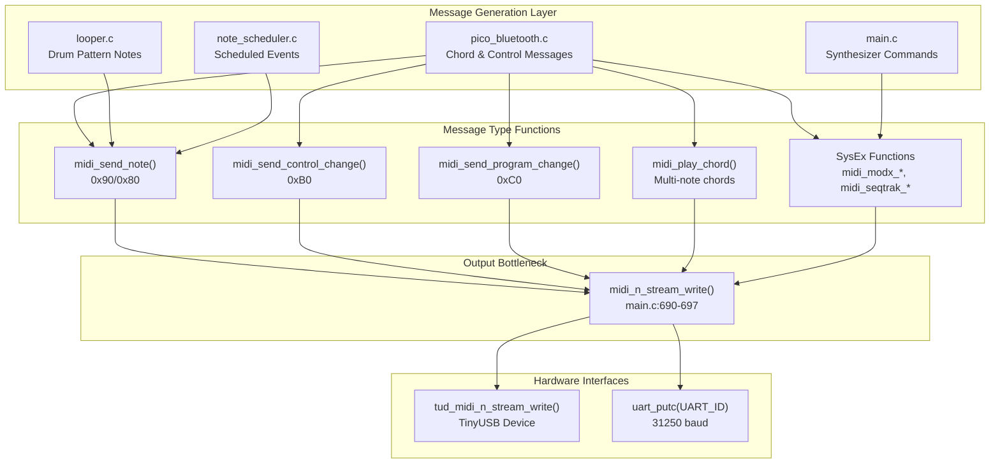
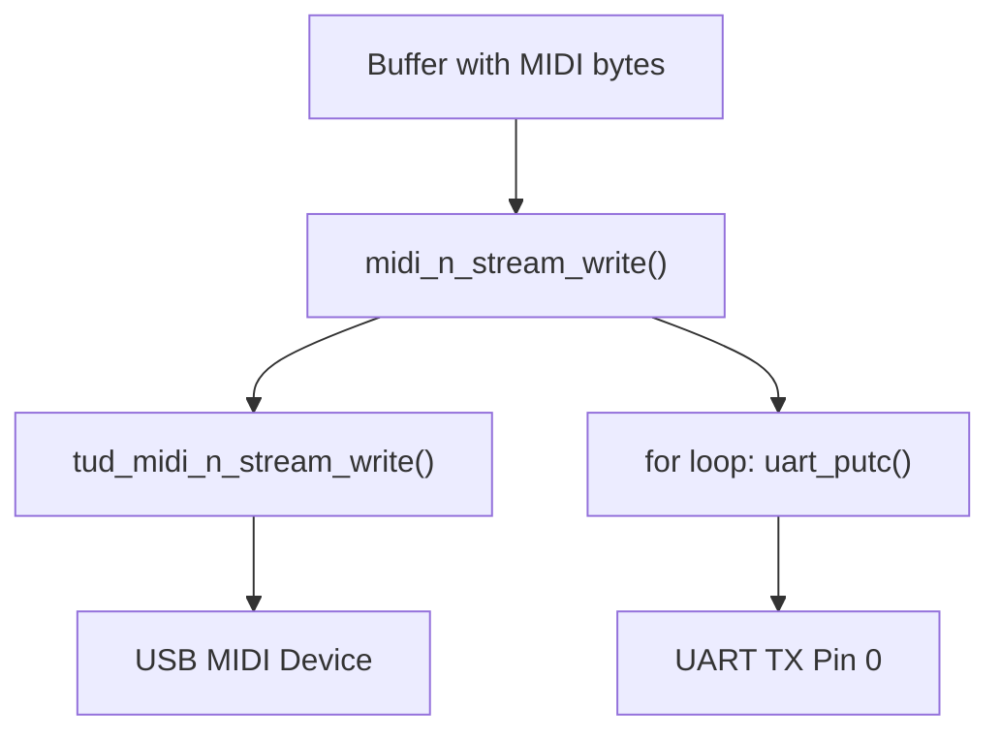
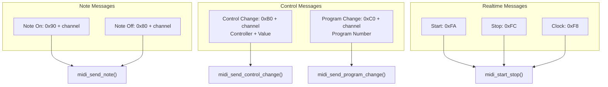
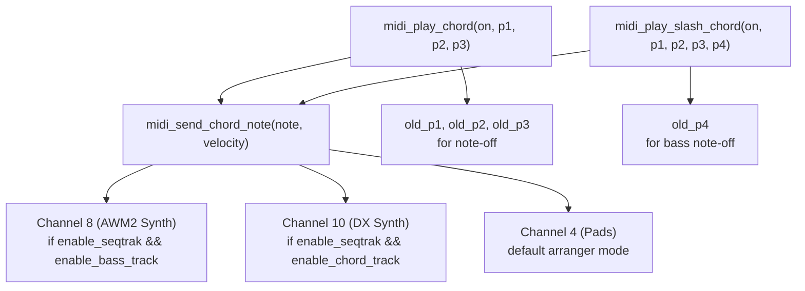
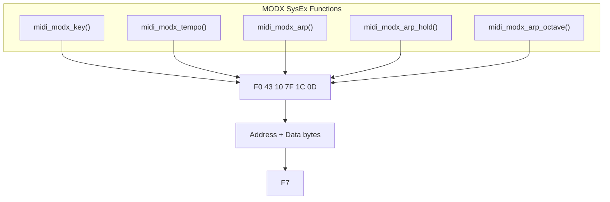
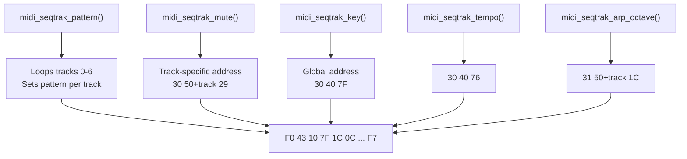
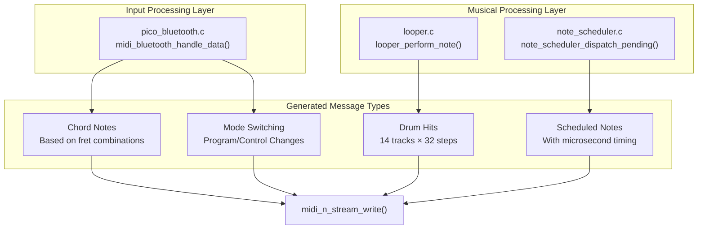
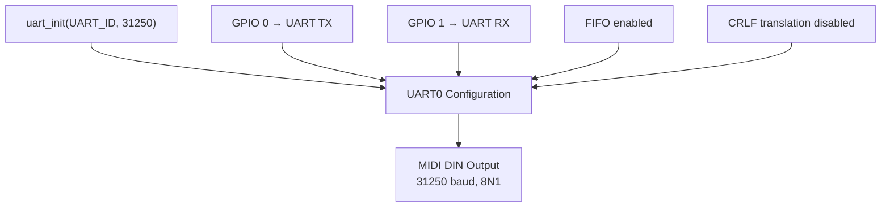

# MIDI Output System

> **Relevant source files**
> * [.gitignore](https://github.com/Jus-Be/orinayo-pico/blob/122fa496/.gitignore)
> * [main.c](https://github.com/Jus-Be/orinayo-pico/blob/122fa496/main.c)
> * [pico_bluetooth.c](https://github.com/Jus-Be/orinayo-pico/blob/122fa496/pico_bluetooth.c)
> * [usb_descriptors.c](https://github.com/Jus-Be/orinayo-pico/blob/122fa496/usb_descriptors.c)

## Purpose and Scope

The MIDI Output System is responsible for transmitting MIDI data from the Raspberry Pi Pico W to external synthesizers, DAWs, and MIDI devices. This page documents the architecture and message generation mechanisms that enable simultaneous output over USB and UART interfaces.

For details on how Bluetooth input is translated into MIDI commands, see [HID to MIDI Translation](./4.2-hid-to-midi-translation.md) and [Chord Generation System](./4.3-chord-generation-system.md). For information about the looper's MIDI generation, see [Step Sequencer](./5.2-step-sequencer.md) and [Note Scheduler](./5.5-note-scheduler.md).

## System Architecture

The MIDI output system implements a dual-transmission architecture where all MIDI data is simultaneously sent via USB (using TinyUSB) and hardware UART (at 31,250 baud). All output flows through a single bottleneck function that ensures synchronization between both interfaces.



**Sources:** [main.c L690-L697](https://github.com/Jus-Be/orinayo-pico/blob/122fa496/main.c#L690-L697)

 [pico_bluetooth.c L121-L136](https://github.com/Jus-Be/orinayo-pico/blob/122fa496/pico_bluetooth.c#L121-L136)

## Central Output Function

The `midi_n_stream_write` function in [main.c L690-L697](https://github.com/Jus-Be/orinayo-pico/blob/122fa496/main.c#L690-L697)

 serves as the single point of convergence for all MIDI output, ensuring that every MIDI message is transmitted identically over both USB and UART interfaces.



**Implementation Details:**

| Aspect | Details |
| --- | --- |
| Function signature | `uint32_t midi_n_stream_write(uint8_t itf, uint8_t cable_num, const uint8_t *buffer, uint32_t bufsize)` |
| USB transmission | Calls `tud_midi_n_stream_write()` from TinyUSB library |
| UART transmission | Byte-by-byte loop writing to `UART_ID` (uart0) using `uart_putc()` |
| Baud rate | 31,250 (standard MIDI rate, defined at [main.c L59](https://github.com/Jus-Be/orinayo-pico/blob/122fa496/main.c#L59-L59) <br> ) |
| UART pins | TX=GPIO0, RX=GPIO1 (configured at [main.c L146-L148](https://github.com/Jus-Be/orinayo-pico/blob/122fa496/main.c#L146-L148) <br> ) |
| Blocking behavior | `while (!uart_is_writable(UART_ID))` ensures bytes are sent completely |

**Sources:** [main.c L690-L697](https://github.com/Jus-Be/orinayo-pico/blob/122fa496/main.c#L690-L697)

 [main.c L58-L62](https://github.com/Jus-Be/orinayo-pico/blob/122fa496/main.c#L58-L62)

 [main.c L146-L150](https://github.com/Jus-Be/orinayo-pico/blob/122fa496/main.c#L146-L150)

## MIDI Message Types

The system generates five primary categories of MIDI messages, each with dedicated wrapper functions that ultimately call `midi_n_stream_write`.

### Standard Channel Messages



**Function Summary:**

| Function | Location | Purpose | Message Format |
| --- | --- | --- | --- |
| `midi_send_note()` | [main.c L480-L491](https://github.com/Jus-Be/orinayo-pico/blob/122fa496/main.c#L480-L491) | Note On/Off events | 3 bytes: status, note, velocity |
| `midi_send_control_change()` | [main.c L493-L502](https://github.com/Jus-Be/orinayo-pico/blob/122fa496/main.c#L493-L502) | CC messages for parameters | 3 bytes: 0xB0+ch, controller, value |
| `midi_send_program_change()` | [main.c L504-L512](https://github.com/Jus-Be/orinayo-pico/blob/122fa496/main.c#L504-L512) | Patch/voice selection | 2 bytes: 0xC0+ch, program |
| `midi_start_stop()` | [main.c L514-L522](https://github.com/Jus-Be/orinayo-pico/blob/122fa496/main.c#L514-L522) | Transport control | 1 byte: 0xFA/0xFC/0xF8 |

**Sources:** [main.c L480-L522](https://github.com/Jus-Be/orinayo-pico/blob/122fa496/main.c#L480-L522)

### Chord Message Functions

The system provides specialized functions for sending multi-note chord structures, which handle voice leading and channel routing for different operational modes.



**Key Behaviors:**

* **Voice Compression:** When `enable_ample_guitar` or `enable_modx` is active, notes are squeezed into the C1-B2 range (MIDI 36-47) via modulo 12 arithmetic ([main.c L615-L619](https://github.com/Jus-Be/orinayo-pico/blob/122fa496/main.c#L615-L619) )
* **Channel Routing:** SeqTrak mode splits chords between channels 8 and 10 based on `enable_bass_track` and `enable_chord_track` flags ([main.c L594-L606](https://github.com/Jus-Be/orinayo-pico/blob/122fa496/main.c#L594-L606) )
* **Note History:** Previous note values are stored in `old_p1-4` static variables to ensure proper note-off messages ([main.c L77-L80](https://github.com/Jus-Be/orinayo-pico/blob/122fa496/main.c#L77-L80) )

**Sources:** [main.c L609-L688](https://github.com/Jus-Be/orinayo-pico/blob/122fa496/main.c#L609-L688)

 [main.c L584-L607](https://github.com/Jus-Be/orinayo-pico/blob/122fa496/main.c#L584-L607)

## Synthesizer-Specific SysEx Commands

The system generates manufacturer-specific System Exclusive (SysEx) messages to control parameters on Yamaha MODX, SeqTrak, Ketron arrangers, and Roland Dream devices. These messages bypass standard MIDI CC/PC mechanisms to access deep synthesis parameters.

### Yamaha MODX Commands



| Function | Location | SysEx Address | Purpose |
| --- | --- | --- | --- |
| `midi_modx_key()` | [main.c L231-L249](https://github.com/Jus-Be/orinayo-pico/blob/122fa496/main.c#L231-L249) | `00 00 02 00 40+key` | Sets global key/transpose |
| `midi_modx_tempo()` | [main.c L333-L352](https://github.com/Jus-Be/orinayo-pico/blob/122fa496/main.c#L333-L352) | `06 00 02 1E` | Sets tempo (MSB/LSB split) |
| `midi_modx_arp()` | [main.c L271-L289](https://github.com/Jus-Be/orinayo-pico/blob/122fa496/main.c#L271-L289) | `06 00 01 09` | Enables/disables arpeggiator |
| `midi_modx_arp_hold()` | [main.c L291-L310](https://github.com/Jus-Be/orinayo-pico/blob/122fa496/main.c#L291-L310) | `10+part 00 06 00 00` | Hold mode (1=off, 2=on) |
| `midi_modx_arp_octave()` | [main.c L251-L269](https://github.com/Jus-Be/orinayo-pico/blob/122fa496/main.c#L251-L269) | `00 00 02 02 40+octave` | Octave range (-3 to +3) |

**Sources:** [main.c L231-L352](https://github.com/Jus-Be/orinayo-pico/blob/122fa496/main.c#L231-L352)

### Yamaha SeqTrak Commands



**Notable SeqTrak Features:**

* **Pattern Selection:** [main.c L431-L451](https://github.com/Jus-Be/orinayo-pico/blob/122fa496/main.c#L431-L451)  iterates through tracks 0-6, setting pattern offset `0x0F` to the same value
* **Mute Implementation:** Uses value `0x7D` for mute, `0x00` for unmute ([main.c L425](https://github.com/Jus-Be/orinayo-pico/blob/122fa496/main.c#L425-L425) )
* **Arpeggio Configuration:** The `get_arp_template()` function ([main.c L469-L477](https://github.com/Jus-Be/orinayo-pico/blob/122fa496/main.c#L469-L477) ) selects from 16 arpeggio types based on `active_strum_pattern` and `style_section`

**Sources:** [main.c L354-L477](https://github.com/Jus-Be/orinayo-pico/blob/122fa496/main.c#L354-L477)

### Ketron Arranger Commands

The Ketron format uses manufacturer ID `0x26` and model ID `0x79` for arranger functions:

| Function | Location | SysEx Format | Purpose |
| --- | --- | --- | --- |
| `midi_ketron_arr()` | [main.c L552-L566](https://github.com/Jus-Be/orinayo-pico/blob/122fa496/main.c#L552-L566) | `F0 26 79 05 00 code on/off F7` | Style sections, fills, intros |
| `midi_ketron_footsw()` | [main.c L568-L582](https://github.com/Jus-Be/orinayo-pico/blob/122fa496/main.c#L568-L582) | `F0 26 7C 05 01 55+code on/off F7` | User-defined footswitch actions |

**Sources:** [main.c L552-L582](https://github.com/Jus-Be/orinayo-pico/blob/122fa496/main.c#L552-L582)

### Roland Dream Delay

The `dream_set_delay()` function ([main.c L210-L229](https://github.com/Jus-Be/orinayo-pico/blob/122fa496/main.c#L210-L229)

) calculates a tempo-synced delay rate using the formula:

```
rate = (60000 / tempo / 128 / 4) % 128
```

This is sent via Roland SysEx (`F0 41 00 42 12 40 01 35 rate 00 F7`) to address `0x40 01 35`.

**Sources:** [main.c L210-L229](https://github.com/Jus-Be/orinayo-pico/blob/122fa496/main.c#L210-L229)

## Message Generation Sources

Different subsystems generate MIDI messages for various purposes:



### Chord Generation Path

When guitar controller buttons are pressed, `play_chord()` is called from [pico_bluetooth.c L1401-L1688](https://github.com/Jus-Be/orinayo-pico/blob/122fa496/pico_bluetooth.c#L1401-L1688)

 with chord note calculations based on the `chord_chat` lookup table. This generates `midi_play_chord()` or `midi_play_slash_chord()` calls.

### Looper Drum Path

The looper calls `looper_perform_note()` which directly invokes `midi_send_note()` for drum hits on MIDI channel 9 (GM drums). See [Step Sequencer](./5.2-step-sequencer.md) for details.

### Scheduled Note Path

The note scheduler queues notes with microsecond timestamps and dispatches them via `note_scheduler_dispatch_pending()` in the main loop ([main.c L169](https://github.com/Jus-Be/orinayo-pico/blob/122fa496/main.c#L169-L169)

). This avoids USB mutex contention by separating scheduling (async context) from transmission (main loop). See [Note Scheduler](./5.5-note-scheduler.md).

**Sources:** [pico_bluetooth.c L1401-L1688](https://github.com/Jus-Be/orinayo-pico/blob/122fa496/pico_bluetooth.c#L1401-L1688)

 [main.c L169](https://github.com/Jus-Be/orinayo-pico/blob/122fa496/main.c#L169-L169)

## UART Configuration

The hardware UART interface is initialized in `main()` with the following parameters:



**Configuration Details:**

* **UART ID:** `uart0` (defined at [main.c L58](https://github.com/Jus-Be/orinayo-pico/blob/122fa496/main.c#L58-L58) )
* **Baud Rate:** 31,250 (MIDI standard, defined at [main.c L59](https://github.com/Jus-Be/orinayo-pico/blob/122fa496/main.c#L59-L59) )
* **Pins:** TX=0, RX=1 (defined at [main.c L60-L61](https://github.com/Jus-Be/orinayo-pico/blob/122fa496/main.c#L60-L61) )
* **FIFO:** Enabled via `uart_set_fifo_enabled()` ([main.c L149](https://github.com/Jus-Be/orinayo-pico/blob/122fa496/main.c#L149-L149) )
* **Line Translation:** Disabled to preserve raw MIDI bytes ([main.c L150](https://github.com/Jus-Be/orinayo-pico/blob/122fa496/main.c#L150-L150) )

The UART interface requires no additional buffering because `midi_n_stream_write()` blocks until each byte is transmitted via the `uart_is_writable()` check.

**Sources:** [main.c L58-L62](https://github.com/Jus-Be/orinayo-pico/blob/122fa496/main.c#L58-L62)

 [main.c L146-L150](https://github.com/Jus-Be/orinayo-pico/blob/122fa496/main.c#L146-L150)

 [main.c L694](https://github.com/Jus-Be/orinayo-pico/blob/122fa496/main.c#L694-L694)

## Channel Allocation

The system uses different MIDI channels depending on the operational mode:

| Channel | Purpose | Condition |
| --- | --- | --- |
| 0 (1) | Guitar melody | Default, arranger mode |
| 3 (4) | Chord pads | Arranger mode, default chord routing |
| 7 (8) | AWM2 synth bass | SeqTrak mode with `enable_bass_track` |
| 8 (9) | Drums | Looper output (`enable_midi_drums`) |
| 9 (10) | DX synth chords | SeqTrak mode with `enable_chord_track` |
| 10 (11) | Sampler | SeqTrak chord triggers ([main.c L630](https://github.com/Jus-Be/orinayo-pico/blob/122fa496/main.c#L630-L630) <br> ) |

Channel numbers are 0-indexed in code but displayed as 1-16 in MIDI terminology.

**Dynamic Channel Selection:**

The `midi_send_note()` function adds 8 to the channel when `enable_seqtrak` is active ([main.c L482](https://github.com/Jus-Be/orinayo-pico/blob/122fa496/main.c#L482-L482)

), routing guitar melody to channel 9 instead of channel 1.

**Sources:** [main.c L480-L491](https://github.com/Jus-Be/orinayo-pico/blob/122fa496/main.c#L480-L491)

 [main.c L584-L607](https://github.com/Jus-Be/orinayo-pico/blob/122fa496/main.c#L584-L607)

 [main.c L630](https://github.com/Jus-Be/orinayo-pico/blob/122fa496/main.c#L630-L630)

## USB MIDI Device

The USB interface presents as a MIDI class device using TinyUSB. The device descriptor is defined in [usb_descriptors.c L41-L60](https://github.com/Jus-Be/orinayo-pico/blob/122fa496/usb_descriptors.c#L41-L60)

 with:

* **Vendor ID:** `0xCafe` ([usb_descriptors.c L51](https://github.com/Jus-Be/orinayo-pico/blob/122fa496/usb_descriptors.c#L51-L51) )
* **Product ID:** Dynamic based on enabled interfaces, bit 3 set for MIDI ([usb_descriptors.c L35-L36](https://github.com/Jus-Be/orinayo-pico/blob/122fa496/usb_descriptors.c#L35-L36) )
* **Device Class:** MIDI streaming ([usb_descriptors.c L74-L78](https://github.com/Jus-Be/orinayo-pico/blob/122fa496/usb_descriptors.c#L74-L78) )
* **Endpoint:** Bidirectional bulk transfers on EP1 ([usb_descriptors.c L88-L97](https://github.com/Jus-Be/orinayo-pico/blob/122fa496/usb_descriptors.c#L88-L97) )

For complete USB configuration details, see [USB MIDI Configuration](./6.2-usb-midi-configuration.md).

**Sources:** [usb_descriptors.c L41-L60](https://github.com/Jus-Be/orinayo-pico/blob/122fa496/usb_descriptors.c#L41-L60)

 [usb_descriptors.c L91-L98](https://github.com/Jus-Be/orinayo-pico/blob/122fa496/usb_descriptors.c#L91-L98)

## Integration with Other Subsystems

The MIDI output system receives input from multiple sources within the application:

### Bluetooth Input Integration

The `midi_bluetooth_handle_data()` function in [pico_bluetooth.c L327-L1274](https://github.com/Jus-Be/orinayo-pico/blob/122fa496/pico_bluetooth.c#L327-L1274)

 processes gamepad state and generates MIDI commands based on button combinations, operational mode, and active settings. This is the primary source of chord, control change, and program change messages.

### Looper Integration

When `enable_midi_drums` is active, the looper generates drum pattern notes which are sent via `midi_send_note()`. The looper performs note scheduling in an async context but defers actual MIDI transmission to the main loop to avoid USB mutex issues.

### Note Scheduler Integration

The note scheduler maintains a queue of timestamped MIDI events and dispatches them at precise microsecond intervals. All scheduled notes flow through `midi_send_note()` when their timestamp is reached.

**Sources:** [pico_bluetooth.c L327-L1274](https://github.com/Jus-Be/orinayo-pico/blob/122fa496/pico_bluetooth.c#L327-L1274)

 [main.c L169](https://github.com/Jus-Be/orinayo-pico/blob/122fa496/main.c#L169-L169)

## See Also

* [Dual Output Architecture](./6.1-dual-output-architecture.md) - Detailed explanation of synchronized USB/UART transmission
* [USB MIDI Configuration](./6.2-usb-midi-configuration.md) - USB descriptors and TinyUSB integration
* [Synthesizer Control](./6.3-synthesizer-control.md) - Deep dive into device-specific SysEx commands
* [HID to MIDI Translation](./4.2-hid-to-midi-translation.md) - How gamepad input becomes MIDI messages
* [Note Scheduler](./5.5-note-scheduler.md) - Timing system for scheduled MIDI events