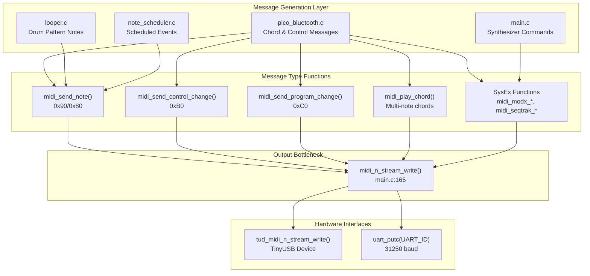
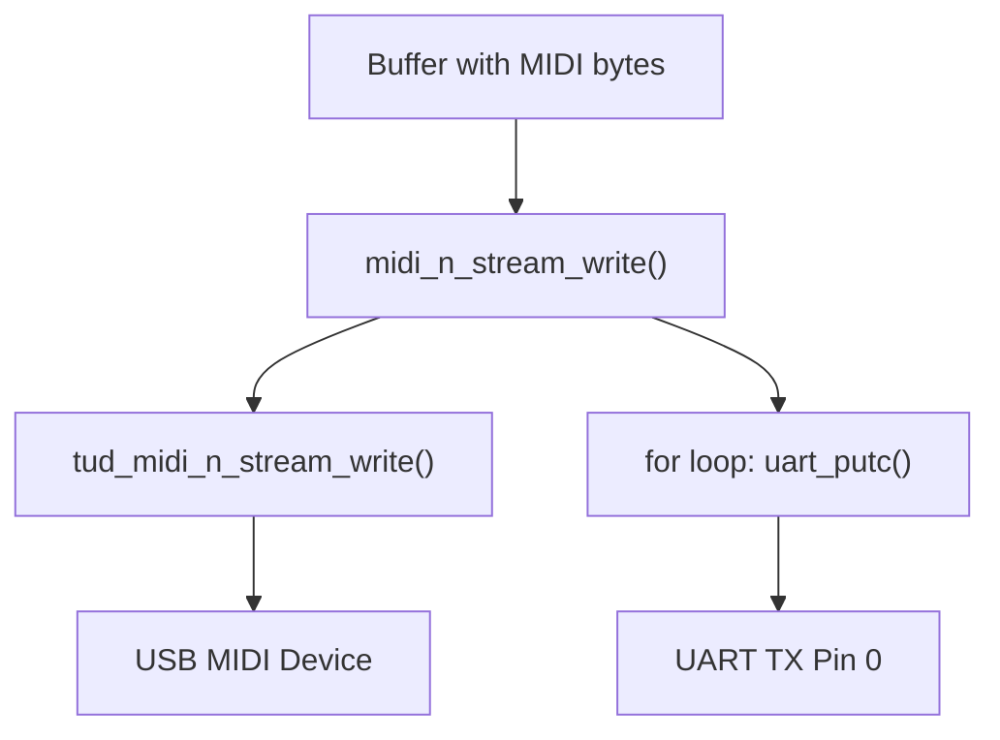
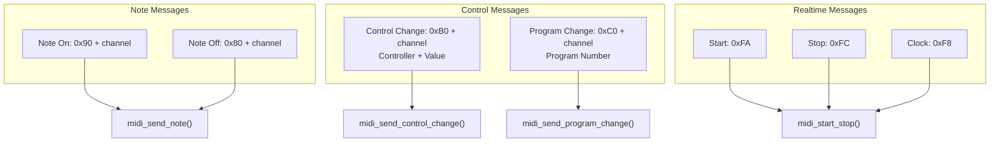
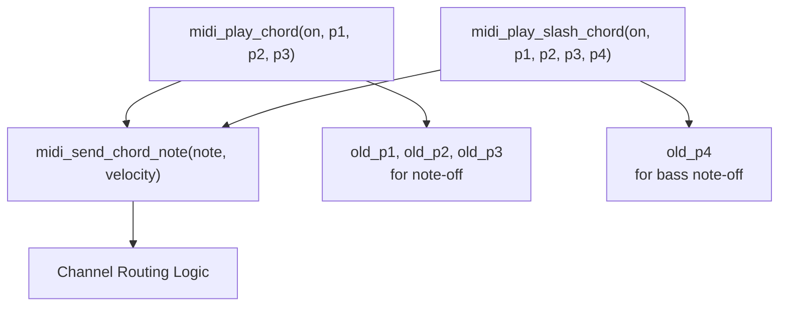
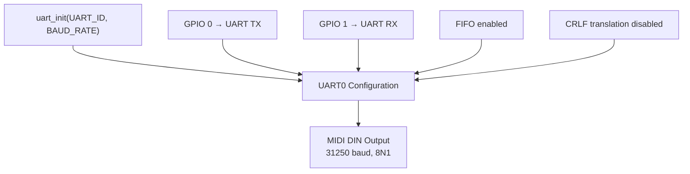

# MIDI Output System

> **Relevant source files**
> * [CMakeLists.txt](https://github.com/Jus-Be/orinayo-pico/blob/6dde5a75/CMakeLists.txt)
> * [main.c](https://github.com/Jus-Be/orinayo-pico/blob/6dde5a75/main.c)
> * [tusb_config.h](https://github.com/Jus-Be/orinayo-pico/blob/6dde5a75/tusb_config.h)
> * [usb_descriptors.c](https://github.com/Jus-Be/orinayo-pico/blob/6dde5a75/usb_descriptors.c)

## Purpose and Scope

The MIDI Output System is responsible for transmitting MIDI data from the Raspberry Pi Pico W to external synthesizers, DAWs, and MIDI devices. This page documents the architecture and message generation mechanisms that enable simultaneous output over USB and UART interfaces.

For details on how Bluetooth input is translated into MIDI commands, see [HID to MIDI Translation](./4.2-hid-to-midi-translation.md) and [Chord Generation System](./4.3-chord-generation-system.md). For information about the looper's MIDI generation, see [Step Sequencer](./5.2-step-sequencer.md) and [Note Scheduler](./5.5-note-scheduler.md).

## System Architecture

The MIDI output system implements a dual-transmission architecture where all MIDI data is simultaneously sent via USB (using TinyUSB) and hardware UART (at 31,250 baud). All output flows through a single bottleneck function that ensures synchronization between both interfaces.

```mermaid
flowchart TD

BT["pico_bluetooth.c<br>Chord & Control Messages"]
LOOPER["looper.c<br>Drum Pattern Notes"]
SCHED["note_scheduler.c<br>Scheduled Events"]
MAIN["main.c<br>Synthesizer Commands"]
NOTE["midi_send_note()<br>0x90/0x80"]
CC["midi_send_control_change()<br>0xB0"]
PC["midi_send_program_change()<br>0xC0"]
CHORD["midi_play_chord()<br>Multi-note chords"]
SYSEX["SysEx Functions<br>midi_modx_*, midi_seqtrak_*"]
STREAM["midi_n_stream_write()<br>main.c:165"]
USB["tud_midi_n_stream_write()<br>TinyUSB Device"]
UART["uart_putc(UART_ID)<br>31250 baud"]

BT --> NOTE
BT --> CC
BT --> PC
BT --> CHORD
BT --> SYSEX
LOOPER --> NOTE
SCHED --> NOTE
MAIN --> SYSEX
NOTE --> STREAM
CC --> STREAM
PC --> STREAM
CHORD --> STREAM
SYSEX --> STREAM
STREAM --> USB
STREAM --> UART

subgraph subGraph3 ["Hardware Interfaces"]
    USB
    UART
end

subgraph subGraph2 ["Output Bottleneck"]
    STREAM
end

subgraph subGraph1 ["Message Type Functions"]
    NOTE
    CC
    PC
    CHORD
    SYSEX
end

subgraph subGraph0 ["Message Generation Layer"]
    BT
    LOOPER
    SCHED
    MAIN
end
```

**Sources:** [main.c L165](https://github.com/Jus-Be/orinayo-pico/blob/6dde5a75/main.c#L165-L165)

## Central Output Function

The `midi_n_stream_write` function serves as the single point of convergence for all MIDI output, ensuring that every MIDI message is transmitted identically over both USB and UART interfaces. For details, see [Dual Output Architecture](./6.1-dual-output-architecture.md).

```mermaid
flowchart TD

INPUT["Buffer with MIDI bytes"]
FUNC["midi_n_stream_write()"]
USB_CALL["tud_midi_n_stream_write()"]
UART_LOOP["for loop: uart_putc()"]
USB_OUT["USB MIDI Device"]
UART_OUT["UART TX Pin 0"]

INPUT --> FUNC
FUNC --> USB_CALL
FUNC --> UART_LOOP
USB_CALL --> USB_OUT
UART_LOOP --> UART_OUT
```

**Implementation Details:**

| Aspect | Details |
| --- | --- |
| Function signature | `uint32_t midi_n_stream_write(uint8_t itf, uint8_t cable_num, const uint8_t *buffer, uint32_t bufsize)` [main.c L165](https://github.com/Jus-Be/orinayo-pico/blob/6dde5a75/main.c#L165-L165) |
| USB transmission | Calls `tud_midi_n_stream_write()` from TinyUSB library |
| UART transmission | Byte-by-byte loop writing to `UART_ID` (uart0) using `uart_putc()` |
| Baud rate | 31,250 (standard MIDI rate, defined at [main.c L67](https://github.com/Jus-Be/orinayo-pico/blob/6dde5a75/main.c#L67-L67)   ) |
| UART pins | TX=GPIO0, RX=GPIO1 (configured at [main.c L68-L69](https://github.com/Jus-Be/orinayo-pico/blob/6dde5a75/main.c#L68-L69)   ) |
| Blocking behavior | Hardware flow control handled by `uart_putc` in the loop |

**Sources:** [main.c L165](https://github.com/Jus-Be/orinayo-pico/blob/6dde5a75/main.c#L165-L165)

 [main.c L66-L70](https://github.com/Jus-Be/orinayo-pico/blob/6dde5a75/main.c#L66-L70)

## MIDI Message Types

The system generates primary categories of MIDI messages, each with dedicated wrapper functions defined in `main.c`.

### Standard Channel Messages

```mermaid
flowchart TD

NOTE_ON["Note On: 0x90 + channel"]
NOTE_OFF["Note Off: 0x80 + channel"]
CC["Control Change: 0xB0 + channel<br>Controller + Value"]
PC["Program Change: 0xC0 + channel<br>Program Number"]
START["Start: 0xFA"]
STOP["Stop: 0xFC"]
CLOCK["Clock: 0xF8"]
NOTES["midi_send_note()"]
CONTROL["midi_send_control_change()"]
PROGRAM["midi_send_program_change()"]
STARTSTOP["midi_start_stop()"]

NOTE_ON --> NOTES
NOTE_OFF --> NOTES
CC --> CONTROL
PC --> PROGRAM
START --> STARTSTOP
STOP --> STARTSTOP
CLOCK --> STARTSTOP

subgraph subGraph2 ["Realtime Messages"]
    START
    STOP
    CLOCK
end

subgraph subGraph1 ["Control Messages"]
    CC
    PC
end

subgraph subGraph0 ["Note Messages"]
    NOTE_ON
    NOTE_OFF
end
```

**Function Summary:**

| Function | Declaration | Purpose | Message Format |
| --- | --- | --- | --- |
| `midi_send_note()` | [main.c L133](https://github.com/Jus-Be/orinayo-pico/blob/6dde5a75/main.c#L133-L133) | Note On/Off events | 3 bytes: status, note, velocity |
| `midi_send_control_change()` | [main.c L136](https://github.com/Jus-Be/orinayo-pico/blob/6dde5a75/main.c#L136-L136) | CC messages for parameters | 3 bytes: 0xB0+ch, controller, value |
| `midi_send_program_change()` | [main.c L135](https://github.com/Jus-Be/orinayo-pico/blob/6dde5a75/main.c#L135-L135) | Patch/voice selection | 2 bytes: 0xC0+ch, program |
| `midi_start_stop()` | [main.c L132](https://github.com/Jus-Be/orinayo-pico/blob/6dde5a75/main.c#L132-L132) | Transport control | 1 byte: 0xFA/0xFC/0xF8 |

**Sources:** [main.c L132-L136](https://github.com/Jus-Be/orinayo-pico/blob/6dde5a75/main.c#L132-L136)

### Chord Message Functions

The system provides specialized functions for sending multi-note chord structures, which handle voice leading and channel routing for different operational modes.

```mermaid
flowchart TD

PLAY_CHORD["midi_play_chord(on, p1, p2, p3)"]
SLASH["midi_play_slash_chord(on, p1, p2, p3, p4)"]
CHORD_NOTE["midi_send_chord_note(note, velocity)"]
CH_OUT["Channel Routing Logic"]
OLD_P["old_p1, old_p2, old_p3<br>for note-off"]
OLD_P4["old_p4<br>for bass note-off"]

PLAY_CHORD --> CHORD_NOTE
SLASH --> CHORD_NOTE
CHORD_NOTE --> CH_OUT
PLAY_CHORD --> OLD_P
SLASH --> OLD_P4
```

**Key Behaviors:**

* **Note History:** Previous note values are stored in `old_p1-4` static variables to ensure proper note-off messages [main.c L111-L114](https://github.com/Jus-Be/orinayo-pico/blob/6dde5a75/main.c#L111-L114)
* **Specialized Routing:** `midi_send_chord_note` [main.c L134](https://github.com/Jus-Be/orinayo-pico/blob/6dde5a75/main.c#L134-L134)  handles the distribution of notes across MIDI channels based on the active mode (e.g., SeqTrak vs Arranger).

**Sources:** [main.c L111-L114](https://github.com/Jus-Be/orinayo-pico/blob/6dde5a75/main.c#L111-L114)

 [main.c L134-L138](https://github.com/Jus-Be/orinayo-pico/blob/6dde5a75/main.c#L134-L138)

## Synthesizer-Specific SysEx Commands

The system generates manufacturer-specific System Exclusive (SysEx) messages to control parameters on Yamaha MODX, SeqTrak, Ketron arrangers, and Roland Dream devices. For details, see [Synthesizer Control](./6.3-synthesizer-control.md).

### Yamaha MODX Commands

| Function | Declaration | Purpose |
| --- | --- | --- |
| `midi_modx_key()` | [main.c L147](https://github.com/Jus-Be/orinayo-pico/blob/6dde5a75/main.c#L147-L147) | Sets global key/transpose |
| `midi_modx_tempo()` | [main.c L146](https://github.com/Jus-Be/orinayo-pico/blob/6dde5a75/main.c#L146-L146) | Sets tempo (MSB/LSB split) |
| `midi_modx_arp()` | [main.c L149](https://github.com/Jus-Be/orinayo-pico/blob/6dde5a75/main.c#L149-L149) | Enables/disables arpeggiator |
| `midi_modx_arp_hold()` | [main.c L150](https://github.com/Jus-Be/orinayo-pico/blob/6dde5a75/main.c#L150-L150) | Toggle Arp Hold per part |
| `midi_modx_arp_octave()` | [main.c L152](https://github.com/Jus-Be/orinayo-pico/blob/6dde5a75/main.c#L152-L152) | Octave range selection |

**Sources:** [main.c L146-L152](https://github.com/Jus-Be/orinayo-pico/blob/6dde5a75/main.c#L146-L152)

### Yamaha SeqTrak Commands

| Function | Declaration | Purpose |
| --- | --- | --- |
| `midi_seqtrak_pattern()` | [main.c L140](https://github.com/Jus-Be/orinayo-pico/blob/6dde5a75/main.c#L140-L140) | Switches patterns for tracks |
| `midi_seqtrak_mute()` | [main.c L141](https://github.com/Jus-Be/orinayo-pico/blob/6dde5a75/main.c#L141-L141) | Mutes/Unmutes specific tracks |
| `midi_seqtrak_key()` | [main.c L142](https://github.com/Jus-Be/orinayo-pico/blob/6dde5a75/main.c#L142-L142) | Sets global key via SysEx |
| `midi_seqtrak_tempo()` | [main.c L143](https://github.com/Jus-Be/orinayo-pico/blob/6dde5a75/main.c#L143-L143) | Updates SeqTrak internal clock |
| `midi_seqtrak_arp_octave()` | [main.c L145](https://github.com/Jus-Be/orinayo-pico/blob/6dde5a75/main.c#L145-L145) | Sets arpeggio octave range |

**Sources:** [main.c L140-L145](https://github.com/Jus-Be/orinayo-pico/blob/6dde5a75/main.c#L140-L145)

### Roland Dream and Ketron

* **Dream Delay:** `dream_set_delay()` [main.c L153](https://github.com/Jus-Be/orinayo-pico/blob/6dde5a75/main.c#L153-L153)  calculates and sends tempo-synced delay rates.
* **Ketron Arranger:** `midi_ketron_arr()` [main.c L138](https://github.com/Jus-Be/orinayo-pico/blob/6dde5a75/main.c#L138-L138)  and `midi_ketron_footsw()` [main.c L139](https://github.com/Jus-Be/orinayo-pico/blob/6dde5a75/main.c#L139-L139)  handle arranger style control and footswitch emulation.

## UART Configuration

The hardware UART interface is initialized in `main()` with the following parameters:

```mermaid
flowchart TD

INIT["uart_init(UART_ID, BAUD_RATE)"]
TX["GPIO 0 → UART TX"]
RX["GPIO 1 → UART RX"]
FIFO["FIFO enabled"]
CRLF["CRLF translation disabled"]
CONFIG["UART0 Configuration"]
OUTPUT["MIDI DIN Output<br>31250 baud, 8N1"]

INIT --> CONFIG
TX --> CONFIG
RX --> CONFIG
FIFO --> CONFIG
CRLF --> CONFIG
CONFIG --> OUTPUT
```

**Configuration Details:**

* **UART ID:** `uart0` [main.c L66](https://github.com/Jus-Be/orinayo-pico/blob/6dde5a75/main.c#L66-L66)
* **Baud Rate:** 31,250 [main.c L67](https://github.com/Jus-Be/orinayo-pico/blob/6dde5a75/main.c#L67-L67)
* **Pins:** TX=0, RX=1 [main.c L68-L69](https://github.com/Jus-Be/orinayo-pico/blob/6dde5a75/main.c#L68-L69)
* **FIFO:** Enabled via `uart_set_fifo_enabled()` [main.c L223](https://github.com/Jus-Be/orinayo-pico/blob/6dde5a75/main.c#L223-L223)
* **Line Translation:** Disabled to preserve raw MIDI bytes [main.c L224](https://github.com/Jus-Be/orinayo-pico/blob/6dde5a75/main.c#L224-L224)

**Sources:** [main.c L66-L70](https://github.com/Jus-Be/orinayo-pico/blob/6dde5a75/main.c#L66-L70)

 [main.c L221-L225](https://github.com/Jus-Be/orinayo-pico/blob/6dde5a75/main.c#L221-L225)

## USB MIDI Device

The USB interface presents as a MIDI class device using TinyUSB. The device descriptor is defined in `usb_descriptors.c`:

* **Vendor ID:** `0xCafe` [usb_descriptors.c L51](https://github.com/Jus-Be/orinayo-pico/blob/6dde5a75/usb_descriptors.c#L51-L51)
* **Product ID:** Dynamic based on enabled interfaces [usb_descriptors.c L35-L36](https://github.com/Jus-Be/orinayo-pico/blob/6dde5a75/usb_descriptors.c#L35-L36)
* **Configuration:** Defines `ITF_NUM_MIDI` and `ITF_NUM_MIDI_STREAMING` [usb_descriptors.c L76-L77](https://github.com/Jus-Be/orinayo-pico/blob/6dde5a75/usb_descriptors.c#L76-L77)
* **Endpoint:** Bulk transfers on `EPNUM_MIDI` [usb_descriptors.c L88-L97](https://github.com/Jus-Be/orinayo-pico/blob/6dde5a75/usb_descriptors.c#L88-L97)

For complete USB configuration details, see [USB MIDI Configuration](./6.2-usb-midi-configuration.md).

**Sources:** [usb_descriptors.c L41-L60](https://github.com/Jus-Be/orinayo-pico/blob/6dde5a75/usb_descriptors.c#L41-L60)

 [usb_descriptors.c L74-L98](https://github.com/Jus-Be/orinayo-pico/blob/6dde5a75/usb_descriptors.c#L74-L98)

## Integration with Other Subsystems

The MIDI output system receives input from multiple sources:

1. **Main Loop:** Dispatches pending notes from the scheduler [main.c L217](https://github.com/Jus-Be/orinayo-pico/blob/6dde5a75/main.c#L217-L217)
2. **USB Input:** The system can read incoming MIDI packets from the host [main.c L232-L238](https://github.com/Jus-Be/orinayo-pico/blob/6dde5a75/main.c#L232-L238)
3. **Preferences:** Changes to system state (e.g., `enable_midi_drums`) can trigger UI feedback via the onboard LED [main.c L230](https://github.com/Jus-Be/orinayo-pico/blob/6dde5a75/main.c#L230-L230)

**Sources:** [main.c L217](https://github.com/Jus-Be/orinayo-pico/blob/6dde5a75/main.c#L217-L217)

 [main.c L230](https://github.com/Jus-Be/orinayo-pico/blob/6dde5a75/main.c#L230-L230)

 [main.c L232-L238](https://github.com/Jus-Be/orinayo-pico/blob/6dde5a75/main.c#L232-L238)

## See Also

* [Dual Output Architecture](./6.1-dual-output-architecture.md) - Detailed explanation of synchronized USB/UART transmission
* [USB MIDI Configuration](./6.2-usb-midi-configuration.md) - USB descriptors and TinyUSB integration
* [Synthesizer Control](./6.3-synthesizer-control.md) - Deep dive into device-specific SysEx commands